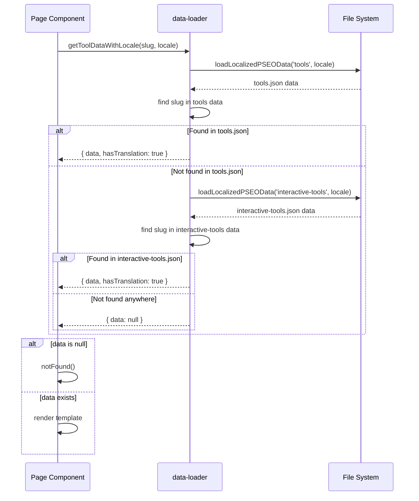

# PRD: MIU-404 — Fix 112 GSC 404 Errors

**Complexity: 5 → MEDIUM mode**

**Planning Mode: Principal Architect**

---

## 1. Context

**Problem:** Google Search Console reports 112 pages returning 404, growing from 0 → 112 in 2.5 months, damaging crawl budget and indexation health.

**Files Analyzed:**

- `lib/seo/data-loader.ts` (getToolDataWithLocale, getAllToolSlugs, DEDICATED_ROUTE_SLUGS)
- `app/[locale]/(pseo)/tools/[slug]/page.tsx`
- `app/(pseo)/tools/[slug]/page.tsx`
- `lib/seo/related-pages.ts` (buildUrl)
- `lib/seo/localization-config.ts` (ENGLISH_ONLY_CATEGORIES)
- `middleware.ts` (handleLegacyRedirects, isPSEOPath)
- `app/seo/data/interactive-tools.json`
- `locales/*/interactive-tools.json` (all 7 locales)
- GSC export: `docs/PRDs/MIU-404.zip` (Chart.csv, Table.csv)

**Current Behavior:**

- `getAllToolSlugs()` includes non-dedicated interactive tool slugs (bmp-to-jpg, gif-to-jpg, etc.) → `generateStaticParams()` pre-renders them
- `getToolDataWithLocale()` only loads from `tools.json` via `loadLocalizedPSEOData('tools', ...)` — never checks `interactive-tools.json`
- Result: localized interactive tool pages call `notFound()` at render time → 404
- Dedicated-route tools (png-to-jpg, webp-to-png) accessed at wrong path (`/tools/{slug}` instead of `/tools/convert/{slug}`) → 404
- `/undefined/` paths from broken locale interpolation in internal links
- Several orphaned/misrouted slugs (article/, compare/, blog/) have no matching routes

---

## 2. Solution

**Approach:**

1. Fix `getToolDataWithLocale()` to also search `interactive-tools.json` data (mirrors how `getToolData()` already works for English)
2. Add legacy redirects in middleware for dedicated-route tools accessed at wrong path (e.g., `/tools/png-to-jpg` → `/tools/convert/png-to-jpg`)
3. Add legacy redirects for known misrouted URLs (`/article/*` → correct category, `/tools/free-ai-upscaler` → `/free/free-ai-upscaler`, etc.)
4. Fix `/undefined/` path bug by auditing locale interpolation in platform/pSEO templates
5. Add validation test to prevent future slug/data mismatches

**Key Decisions:**

- Fix in data-loader (not page component) — single source of truth for tool data loading
- Use `loadLocalizedPSEOData('interactive-tools', ...)` for interactive tool fallback — localized data files already exist for all 7 locales
- Redirects over 404s for misrouted content — preserve any accumulated link equity
- Reuse existing `handleLegacyRedirects()` pattern in middleware

**Data Changes:** None — all data files already exist.

---

## 3. Sequence Flow



---

## 4. Execution Phases

### Phase 1: Fix `getToolDataWithLocale()` to include interactive tools

**User-visible outcome:** All ~87 localized interactive tool pages (e.g., `/es/tools/pdf-to-png`) render correctly instead of 404ing.

**Files (3):**

- `lib/seo/data-loader.ts` — update `getToolDataWithLocale()` to also search interactive-tools data
- `tests/unit/seo/tool-data-loader.unit.spec.ts` — new test for interactive tool locale loading
- `app/[locale]/(pseo)/tools/[slug]/page.tsx` — no change needed (already falls back to English correctly)

**Implementation:**

- [ ] In `getToolDataWithLocale()` (line 687-710), after searching `tools.json` data (line 701-702), add fallback to `interactive-tools.json`:

  ```typescript
  // Load locale-specific tools data
  const localizedData = await loadLocalizedPSEOData<IToolPage>('tools', locale, toolsData);
  const data = localizedData.pages.find(page => page.slug === slug) || null;

  // If not found in tools, check interactive-tools
  if (!data) {
    const localizedInteractiveData = await loadLocalizedPSEOData<IToolPage>(
      'interactive-tools',
      locale,
      interactiveToolsData
    );
    const interactiveData = localizedInteractiveData.pages.find(page => page.slug === slug) || null;

    return {
      data: interactiveData,
      hasTranslation: interactiveData !== null,
      isLocalizedCategory: isLocalized,
    };
  }
  ```

**Tests Required:**

| Test File                                      | Test Name                                                              | Assertion                                             |
| ---------------------------------------------- | ---------------------------------------------------------------------- | ----------------------------------------------------- |
| `tests/unit/seo/tool-data-loader.unit.spec.ts` | `should return interactive tool data for English locale`               | `expect(result.data?.slug).toBe('pdf-to-png')`        |
| `tests/unit/seo/tool-data-loader.unit.spec.ts` | `should return localized interactive tool data for non-English locale` | `expect(result.data).not.toBeNull()`                  |
| `tests/unit/seo/tool-data-loader.unit.spec.ts` | `should return null for non-existent slug`                             | `expect(result.data).toBeNull()`                      |
| `tests/unit/seo/tool-data-loader.unit.spec.ts` | `should return static tool data when slug exists in tools.json`        | `expect(result.data?.slug).toBe('ai-image-upscaler')` |
| `tests/unit/seo/tool-data-loader.unit.spec.ts` | `should not include DEDICATED_ROUTE_SLUGS in getAllToolSlugs`          | `expect(slugs).not.toContain('png-to-jpg')`           |

**Verification Plan:**

1. Unit tests pass for all tool data loading scenarios
2. `yarn verify` passes
3. Manual: `curl -I https://localhost:3000/es/tools/pdf-to-png` returns 200

---

### Phase 2: Add middleware redirects for misrouted URLs

**User-visible outcome:** 15+ known misrouted URLs redirect to their correct locations instead of 404ing.

**Files (2):**

- `middleware.ts` — expand `handleLegacyRedirects()` redirect map
- `tests/unit/seo/middleware-redirects.unit.spec.ts` — test new redirects

**Implementation:**

- [ ] Add the following redirects to `redirectMap` in `handleLegacyRedirects()`:

  ```typescript
  const redirectMap: Record<string, string> = {
    // Existing
    '/tools/bulk-image-resizer': '/tools/resize/bulk-image-resizer',
    '/tools/bulk-image-compressor': '/tools/compress/bulk-image-compressor',

    // NEW: Dedicated-route tools accessed at wrong path
    '/tools/png-to-jpg': '/tools/convert/png-to-jpg',
    '/tools/jpg-to-png': '/tools/convert/jpg-to-png',
    '/tools/webp-to-jpg': '/tools/convert/webp-to-jpg',
    '/tools/webp-to-png': '/tools/convert/webp-to-png',
    '/tools/jpg-to-webp': '/tools/convert/jpg-to-webp',
    '/tools/png-to-webp': '/tools/convert/png-to-webp',
    '/tools/image-compressor': '/tools/compress/image-compressor',
    '/tools/image-resizer': '/tools/resize/image-resizer',

    // NEW: Misrouted category URLs (from GSC 404 list)
    '/tools/free-ai-upscaler': '/free/free-ai-upscaler',

    // NEW: /article/ → correct category
    '/article/upscale-arw-images': '/camera-raw/upscale-arw-images',
    '/article/photography-business-enhancement':
      '/industry-insights/photography-business-enhancement',
    '/article/family-photo-preservation': '/photo-restoration/family-photo-preservation',

    // NEW: Wrong category slug
    '/industry-insights/real-estate-photo-enhancement': '/use-cases/real-estate-photo-enhancement',
  };
  ```

- [ ] Add programmatic redirect for `/undefined/*` paths (locale bug):
  ```typescript
  // Handle /undefined/ prefix (bug: locale resolved to "undefined" string)
  if (pathWithoutLocale.startsWith('/undefined/') || pathname.startsWith('/undefined/')) {
    const url = req.nextUrl.clone();
    // Strip /undefined/ and redirect to English path
    url.pathname = pathname.replace(/^\/undefined/, '');
    return NextResponse.redirect(url, 301);
  }
  ```

**Tests Required:**

| Test File                                          | Test Name                                                                | Assertion                          |
| -------------------------------------------------- | ------------------------------------------------------------------------ | ---------------------------------- |
| `tests/unit/seo/middleware-redirects.unit.spec.ts` | `should redirect /tools/png-to-jpg to /tools/convert/png-to-jpg`         | 301 redirect with correct Location |
| `tests/unit/seo/middleware-redirects.unit.spec.ts` | `should redirect /es/tools/png-to-jpg to /es/tools/convert/png-to-jpg`   | 301 redirect preserving locale     |
| `tests/unit/seo/middleware-redirects.unit.spec.ts` | `should redirect /article/* to correct category`                         | 301 redirect                       |
| `tests/unit/seo/middleware-redirects.unit.spec.ts` | `should redirect /undefined/midjourney-upscaler to /midjourney-upscaler` | 301 redirect stripping undefined   |
| `tests/unit/seo/middleware-redirects.unit.spec.ts` | `should redirect /tools/free-ai-upscaler to /free/free-ai-upscaler`      | 301 redirect                       |

**Verification Plan:**

1. Unit tests pass for all redirect scenarios
2. `yarn verify` passes

---

### Phase 3: Fix `/undefined/` locale bug at source

**User-visible outcome:** Platform-related internal links no longer generate `/undefined/` paths.

**Files (3):**

- `app/(pseo)/_components/pseo/templates/PlatformPageTemplate.tsx` — audit locale usage in breadcrumbs/links
- `app/(pseo)/_components/pseo/templates/GenericPSEOPageTemplate.tsx` — audit undefined locale references
- `tests/unit/seo/pseo-internal-links.unit.spec.ts` — test link generation doesn't produce `/undefined/`

**Implementation:**

- [ ] Audit all template files that generate internal links with locale interpolation
- [ ] Add guard: `const safeLocale = locale && locale !== 'undefined' ? locale : undefined;`
- [ ] Ensure breadcrumb `href` uses empty string for English (not `undefined`)
- [ ] For platform pages (English-only category), breadcrumb should never include locale prefix

**Tests Required:**

| Test File                                         | Test Name                                                  | Assertion                         |
| ------------------------------------------------- | ---------------------------------------------------------- | --------------------------------- |
| `tests/unit/seo/pseo-internal-links.unit.spec.ts` | `should never generate /undefined/ in breadcrumb hrefs`    | No href contains '/undefined/'    |
| `tests/unit/seo/pseo-internal-links.unit.spec.ts` | `should not add locale prefix for English-only categories` | Platform breadcrumb has no locale |

**Verification Plan:**

1. Unit tests pass
2. `yarn verify` passes
3. Grep entire codebase for `/${locale}/` patterns that don't guard against undefined

---

### Phase 4: Validation test to prevent regressions

**User-visible outcome:** CI catches future slug/route/data mismatches before deployment.

**Files (1):**

- `tests/unit/seo/tool-route-consistency.unit.spec.ts` — ensure all slugs in `generateStaticParams` have matching data

**Implementation:**

- [ ] Test that every slug returned by `getAllToolSlugs()` returns non-null from `getToolData()` or `getToolDataWithLocale(slug, 'en')`
- [ ] Test that every slug in `DEDICATED_ROUTE_SLUGS` has a matching entry in `INTERACTIVE_TOOL_PATHS` (both in data-loader and sitemap handler)
- [ ] Test that every slug in sitemap tool routes has a matching page route
- [ ] Test that no interactive tool slug appears in both `getAllToolSlugs()` AND `DEDICATED_ROUTE_SLUGS` (they should be mutually exclusive)

**Tests Required:**

| Test File                                            | Test Name                                                           | Assertion                          |
| ---------------------------------------------------- | ------------------------------------------------------------------- | ---------------------------------- |
| `tests/unit/seo/tool-route-consistency.unit.spec.ts` | `every tool slug should have resolvable data`                       | All slugs resolve to non-null data |
| `tests/unit/seo/tool-route-consistency.unit.spec.ts` | `DEDICATED_ROUTE_SLUGS should have matching INTERACTIVE_TOOL_PATHS` | Sets are equivalent                |
| `tests/unit/seo/tool-route-consistency.unit.spec.ts` | `getAllToolSlugs should not overlap with DEDICATED_ROUTE_SLUGS`     | No intersection                    |
| `tests/unit/seo/tool-route-consistency.unit.spec.ts` | `sitemap tool URLs should match actual routes`                      | All sitemap URLs resolve           |

**Verification Plan:**

1. All validation tests pass
2. `yarn verify` passes

---

## 5. Acceptance Criteria

- [ ] All 4 phases complete
- [ ] All specified tests pass
- [ ] `yarn verify` passes
- [ ] `getToolDataWithLocale()` returns data for all 15 non-dedicated interactive tool slugs across all 7 locales
- [ ] Legacy redirects handle all known misrouted URLs from GSC 404 list
- [ ] `/undefined/` paths are both redirected (middleware) and prevented at source (templates)
- [ ] Validation tests prevent future tool slug/route mismatches

---

## 6. GSC 404 URL Classification (Reference)

| Category                                                             | Count | Root Cause                                               | Fix Phase            |
| -------------------------------------------------------------------- | ----- | -------------------------------------------------------- | -------------------- |
| Localized interactive tools (`/{locale}/tools/{non-dedicated-slug}`) | ~87   | `getToolDataWithLocale()` missing interactive-tools.json | Phase 1              |
| Dedicated tools at wrong path (`/tools/png-to-jpg`)                  | ~5    | No redirect from flat path to sub-route                  | Phase 2              |
| `/undefined/` paths                                                  | 4     | Locale variable is literal "undefined"                   | Phase 2 + 3          |
| `/article/*` (no route)                                              | 3     | Route never existed, data in other categories            | Phase 2              |
| `/compare/*` (orphaned data)                                         | 2     | Data in competitor-comparisons.json, no route            | Phase 2 (redirect)   |
| `/{locale}/guides/how-to-upsize-images`                              | 5     | Slug doesn't exist in guides.json                        | N/A (legitimate 404) |
| `/blog/best-free-image-upscalers-comparison`                         | 1     | Blog slug doesn't exist                                  | N/A (legitimate 404) |
| English-only with locale prefix                                      | 3     | Middleware should redirect but showing as 404            | Phase 2 (verify)     |
| `/tools/free-ai-upscaler`                                            | 1     | Slug in free.json, not tools                             | Phase 2              |

**Legitimate 404s (no fix needed):** 6 URLs with slugs that don't exist in any data file — Google discovered them from external links or removed content. These will naturally drop from GSC over time.

**Expected impact:** ~106 of 112 404s resolved → redirects or working pages.
