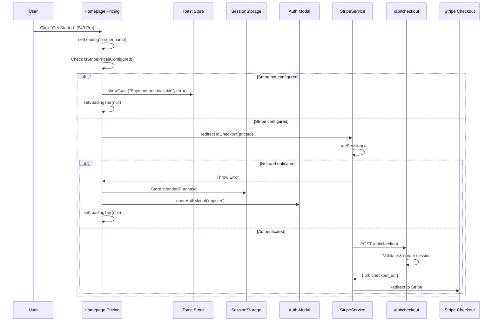
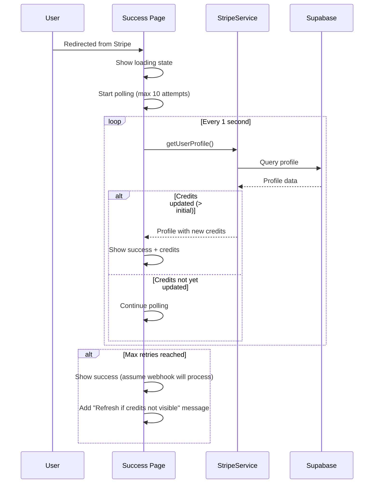

# PRD: Payment UI Flow Review and Fixes

## Context Analysis

### 1.1 Files Analyzed

```
/app/pricing/page.tsx
/app/success/page.tsx
/app/canceled/page.tsx
/app/dashboard/billing/page.tsx
/app/api/checkout/route.ts
/app/api/portal/route.ts
/client/components/stripe/PricingCard.tsx
/client/components/stripe/CreditsDisplay.tsx
/client/components/stripe/SubscriptionStatus.tsx
/client/components/stripe/BuyCreditsButton.tsx
/client/components/pixelperfect/Pricing.tsx
/client/components/modal/auth/AuthenticationModal.tsx
/client/store/modalStore.ts
/server/stripe/stripeService.ts
/server/stripe/types.ts
/shared/config/stripe.ts
```

### 1.2 Component & Dependency Overview

```mermaid
graph TD
    subgraph "User Entry Points"
        HP[Homepage Pricing.tsx]
        PP[/pricing page]
    end

    subgraph "Authentication Layer"
        AM[AuthenticationModal]
        SS[sessionStorage - intendedPurchase]
    end

    subgraph "Stripe Integration"
        PC[PricingCard]
        SVC[StripeService]
        API[/api/checkout]
        PORTAL[/api/portal]
    end

    subgraph "Result Pages"
        SUCCESS[/success]
        CANCEL[/canceled]
        BILLING[/dashboard/billing]
    end

    subgraph "External Services"
        STRIPE[Stripe Checkout]
        PORTAL_EXT[Stripe Portal]
        WH[Webhook Handler]
    end

    HP --> SS
    HP --> AM
    PP --> PC
    PC --> SVC
    AM --> SVC
    SVC --> API
    API --> STRIPE
    STRIPE --> SUCCESS
    STRIPE --> CANCEL
    STRIPE --> WH
    BILLING --> PORTAL
    PORTAL --> PORTAL_EXT
```

### 1.3 Current Behavior Summary

- **Homepage Pricing** (`Pricing.tsx`): Displays 3 tiers (Free, Starter $9, Pro $29) with hardcoded values that differ from the actual Stripe config
- **Pricing Page** (`/pricing`): Displays 6 products (3 credit packs + 3 subscriptions) using `CREDIT_PACKS` and `SUBSCRIPTION_PLANS` from config
- **Authentication Flow**: Stores `intendedPurchase` in sessionStorage, then redirects to checkout after auth
- **Checkout Process**: Creates Stripe checkout session via `/api/checkout`, redirects to Stripe hosted checkout
- **Success Page**: Shows confirmation with 2-second loading state, links to dashboard/billing
- **Billing Page**: Displays credits balance, subscription status, portal access buttons

### 1.4 Problem Statement

The payment UI flow has several UX issues, data inconsistencies, and missing edge case handling that degrade user trust and conversion rates.

---

## 2. Identified Issues

### 2.1 Critical Issues (P0)

| ID   | Issue                                                                                                                              | Location                     | Impact                                                               |
| ---- | ---------------------------------------------------------------------------------------------------------------------------------- | ---------------------------- | -------------------------------------------------------------------- |
| P0-1 | **Pricing Mismatch**: Homepage shows $9/$29 monthly subscriptions, but config defines $19/$49/$149 monthly + separate credit packs | `Pricing.tsx` vs `stripe.ts` | User sees different prices on homepage vs pricing page - trust issue |
| P0-2 | **Silent Auth Failures**: `handlePricingClick` catches errors silently with `console.log`, no user feedback                        | `Pricing.tsx:126-130`        | User clicks, nothing happens, no indication why                      |
| P0-3 | **Generic Error Handling**: `PricingCard` uses `alert()` for errors - poor UX                                                      | `PricingCard.tsx:57-58`      | Jarring native alert, unprofessional                                 |

### 2.2 High Priority Issues (P1)

| ID   | Issue                                                                                                                    | Location                 | Impact                                                     |
| ---- | ------------------------------------------------------------------------------------------------------------------------ | ------------------------ | ---------------------------------------------------------- |
| P1-1 | **No Loading State on Homepage**: `Pricing.tsx` buttons don't show loading during checkout redirect                      | `Pricing.tsx`            | User may double-click, unclear if action registered        |
| P1-2 | **Success Page Webhook Race**: Fixed 2-second delay is arbitrary - webhook may not have processed                        | `success/page.tsx:15-19` | User sees "credits added" but credits may not be there yet |
| P1-3 | **Missing Stripe Config Warning**: Homepage doesn't check `isStripePricesConfigured()` before rendering                  | `Pricing.tsx`            | Broken checkout if env vars not set                        |
| P1-4 | **Unauthenticated User Flow**: Homepage stores purchase intent, but `/pricing` page doesn't handle unauthenticated users | `PricingCard.tsx`        | Errors when unauthenticated user clicks on pricing page    |

### 2.3 Medium Priority Issues (P2)

| ID   | Issue                                                                                                    | Location            | Impact                              |
| ---- | -------------------------------------------------------------------------------------------------------- | ------------------- | ----------------------------------- |
| P2-1 | **Duplicate Tier Definitions**: Homepage has hardcoded `tiers[]` array, pricing page uses config         | Multiple files      | Maintenance burden, sync issues     |
| P2-2 | **No "Already Subscribed" Handling**: Users with active subscriptions can purchase again without warning | `PricingCard.tsx`   | Potential double-billing confusion  |
| P2-3 | **Missing Cancel Confirmation**: No confirmation when user cancels checkout                              | `canceled/page.tsx` | User may have accidentally canceled |
| P2-4 | **No Credit Balance Check**: No indication of current credits when purchasing more                       | `/pricing`          | User may over-purchase              |

### 2.4 Low Priority Issues (P3)

| ID   | Issue                                                                           | Location           | Impact          |
| ---- | ------------------------------------------------------------------------------- | ------------------ | --------------- |
| P3-1 | **Inconsistent Button Text**: "Subscribe Now" vs "Buy Credits" vs "Get Started" | Multiple           | Minor confusion |
| P3-2 | **No Price Formatting**: Prices don't include currency symbol consistently      | Multiple           | Minor UX polish |
| P3-3 | **Missing Loading Skeleton**: Billing page shows spinner, could use skeleton    | `billing/page.tsx` | Minor UX polish |

---

## 3. Proposed Solution

### 3.1 Architecture Summary

1. **Unify Pricing Data**: Single source of truth in `stripe.ts` config, used by both homepage and pricing page
2. **Enhanced Auth Flow**: Proper loading states, toast notifications, and error recovery
3. **Smart Success Page**: Poll for credit update confirmation instead of fixed timeout
4. **Subscription-Aware UI**: Check existing subscription before allowing purchase, show appropriate CTA
5. **Consistent Error Handling**: Use toast notifications instead of `alert()`

**Alternatives Considered:**

- Server-side pricing fetch from Stripe API - Rejected: Adds latency, config already provides needed data
- Redirect all pricing clicks to `/pricing` - Rejected: Adds friction to homepage conversion

### 3.2 Architecture Diagram

```mermaid
flowchart LR
    subgraph "Unified Pricing"
        CONFIG[stripe.ts Config]
        HOMEPAGE[Homepage]
        PRICING[/pricing]
    end

    subgraph "Enhanced Auth"
        BTN[Purchase Button]
        LOADING[Loading State]
        TOAST[Toast Notification]
        AUTH[Auth Modal]
    end

    subgraph "Smart Success"
        SUCCESS[Success Page]
        POLL[Credit Polling]
        CONFIRM[Confirmation]
    end

    CONFIG --> HOMEPAGE
    CONFIG --> PRICING
    BTN --> LOADING
    BTN --> |error| TOAST
    BTN --> |not auth| AUTH
    SUCCESS --> POLL
    POLL --> |credits updated| CONFIRM
```

### 3.3 Key Technical Decisions

| Decision             | Choice                                  | Justification                               |
| -------------------- | --------------------------------------- | ------------------------------------------- |
| Error Display        | Toast notifications via `useToastStore` | Already exists in codebase, consistent UX   |
| Pricing Source       | `stripe.ts` config only                 | Single source of truth, no API calls needed |
| Success Verification | Poll profile credits with max retries   | Accounts for webhook latency                |
| Loading States       | Per-button state + disabled siblings    | Prevents double-clicks                      |

### 3.4 Data Model Changes

**No Data Changes.** All fixes are UI/client-side.

---

## 4. Runtime Execution Flow

### 4.1 Homepage Purchase Flow (Fixed)



### 4.2 Success Page Flow (Fixed)



---

## 5. Detailed Implementation Spec

### A. `/shared/config/stripe.ts` (Minor Change)

**Changes Needed:**

- Add homepage-friendly pricing tier export

**New Exports:**

```typescript
/**
 * Homepage pricing tiers - derived from subscription plans
 * Used by Pricing.tsx on homepage
 */
export const HOMEPAGE_TIERS = [
  {
    name: 'Free Tier',
    price: 0,
    period: '/mo',
    description: 'For testing and personal use.',
    features: [
      '10 images per month',
      '2x & 4x Upscaling',
      'Basic Enhancement',
      'No watermark',
      '5MB file limit',
    ],
    cta: 'Start for Free',
    variant: 'outline' as const,
    priceId: null, // No Stripe price for free tier
  },
  {
    name: 'Hobby',
    price: SUBSCRIPTION_PLANS.HOBBY_MONTHLY.price,
    period: '/mo',
    description: SUBSCRIPTION_PLANS.HOBBY_MONTHLY.description,
    features: SUBSCRIPTION_PLANS.HOBBY_MONTHLY.features,
    cta: 'Get Started',
    variant: 'secondary' as const,
    priceId: STRIPE_PRICES.HOBBY_MONTHLY,
  },
  {
    name: 'Professional',
    price: SUBSCRIPTION_PLANS.PRO_MONTHLY.price,
    period: '/mo',
    description: SUBSCRIPTION_PLANS.PRO_MONTHLY.description,
    features: SUBSCRIPTION_PLANS.PRO_MONTHLY.features,
    cta: 'Get Started',
    variant: 'primary' as const,
    priceId: STRIPE_PRICES.PRO_MONTHLY,
    recommended: true,
  },
] as const;
```

**Justification:** Single source of truth for homepage tiers, derived from existing config.

---

### B. `/client/components/pixelperfect/Pricing.tsx` (Major Refactor)

**Changes Needed:**

- Remove hardcoded `tiers[]` array
- Use `HOMEPAGE_TIERS` from config
- Add loading state per button
- Replace `console.log` with toast notifications
- Add Stripe config check
- Fix pricing mismatch

**Pseudo-code:**

```typescript
'use client';

import { useState } from 'react';
import { Check } from 'lucide-react';
import Button from '@client/components/pixelperfect/Button';
import { JsonLd } from '@client/components/seo/JsonLd';
import { useModalStore } from '@client/store/modalStore';
import { useToastStore } from '@client/store/toastStore';
import { StripeService } from '@server/stripe/stripeService';
import { HOMEPAGE_TIERS, isStripePricesConfigured } from '@shared/config/stripe';

const Pricing: React.FC = () => {
  const { openAuthModal } = useModalStore();
  const { showToast } = useToastStore();
  const [loadingTier, setLoadingTier] = useState<string | null>(null);

  const handlePricingClick = async (tier: typeof HOMEPAGE_TIERS[number]) => {
    // Free tier - just open registration
    if (tier.priceId === null) {
      openAuthModal('register');
      return;
    }

    // Check if Stripe is configured
    if (!isStripePricesConfigured()) {
      showToast({
        message: 'Payment system is not configured. Please try again later.',
        type: 'error',
      });
      return;
    }

    // Set loading state
    setLoadingTier(tier.name);

    // Store intended purchase for after auth
    sessionStorage.setItem('intendedPurchase', JSON.stringify({
      priceId: tier.priceId,
      planName: tier.name,
      successUrl: `${window.location.origin}/success`,
      cancelUrl: window.location.href,
    }));

    try {
      await StripeService.redirectToCheckout(tier.priceId, {
        successUrl: `${window.location.origin}/success`,
        cancelUrl: window.location.href,
      });
    } catch (error) {
      // User not authenticated - open auth modal
      if (error instanceof Error && error.message.includes('not authenticated')) {
        openAuthModal('register');
      } else {
        // Actual error - show toast
        showToast({
          message: error instanceof Error ? error.message : 'Failed to start checkout',
          type: 'error',
        });
      }
    } finally {
      setLoadingTier(null);
    }
  };

  return (
    <section id="pricing" className="py-20 bg-slate-50">
      {/* ... existing JSX structure ... */}
      {HOMEPAGE_TIERS.map(tier => (
        <div key={tier.name} className="...">
          {/* ... tier card content ... */}
          <Button
            variant={tier.variant}
            className="w-full"
            onClick={() => handlePricingClick(tier)}
            disabled={loadingTier !== null}
          >
            {loadingTier === tier.name ? 'Processing...' : tier.cta}
          </Button>
        </div>
      ))}
    </section>
  );
};

export default Pricing;
```

**Justification:** Fixes P0-1, P0-2, P1-1, P1-3 issues. Uses config for pricing, adds proper error handling and loading states.

---

### C. `/client/components/stripe/PricingCard.tsx` (Medium Refactor)

**Changes Needed:**

- Replace `alert()` with toast notifications
- Add auth check and redirect to auth modal
- Pass through auth state to handle unauthenticated users

**Pseudo-code:**

```typescript
'use client';

import { useState } from 'react';
import { StripeService } from '@server/stripe';
import { useModalStore } from '@client/store/modalStore';
import { useToastStore } from '@client/store/toastStore';

// ... existing interface ...

export function PricingCard(
  {
    /* existing props */
  }
): JSX.Element {
  const [loading, setLoading] = useState(false);
  const { openAuthModal } = useModalStore();
  const { showToast } = useToastStore();

  const handleSubscribe = async () => {
    try {
      setLoading(true);

      // Store intended purchase for post-auth redirect
      sessionStorage.setItem(
        'intendedPurchase',
        JSON.stringify({
          priceId,
          planName: name,
          successUrl: `${window.location.origin}/success`,
          cancelUrl: window.location.href,
        })
      );

      await StripeService.redirectToCheckout(priceId, {
        metadata: creditsAmount ? { credits_amount: creditsAmount.toString() } : {},
        successUrl: `${window.location.origin}/success`,
        cancelUrl: window.location.href,
      });
    } catch (error: unknown) {
      console.error('Checkout error:', error);

      // Handle authentication errors
      if (error instanceof Error && error.message.includes('not authenticated')) {
        openAuthModal('register');
        return;
      }

      // Show user-friendly error
      const errorMessage = error instanceof Error ? error.message : 'Failed to initiate checkout';
      showToast({
        message: errorMessage,
        type: 'error',
      });
    } finally {
      setLoading(false);
    }
  };

  // ... rest of component unchanged ...
}
```

**Justification:** Fixes P0-3, P1-4 issues. Replaces alert with toast, handles unauthenticated users on pricing page.

---

### D. `/app/success/page.tsx` (Medium Refactor)

**Changes Needed:**

- Replace fixed timeout with credit polling
- Add fallback message if polling times out
- Show actual credit balance on success

**Pseudo-code:**

```typescript
'use client';

import { Suspense, useEffect, useState, useCallback } from 'react';
import { useSearchParams } from 'next/navigation';
import Link from 'next/link';
import { CheckCircle, ArrowRight, Loader2, AlertCircle } from 'lucide-react';
import { StripeService } from '@server/stripe';

const MAX_POLL_ATTEMPTS = 10;
const POLL_INTERVAL_MS = 1000;

function SuccessContent(): JSX.Element {
  const searchParams = useSearchParams();
  const sessionId = searchParams.get('session_id');
  const [loading, setLoading] = useState(true);
  const [credits, setCredits] = useState<number | null>(null);
  const [pollTimedOut, setPollTimedOut] = useState(false);

  const pollForCredits = useCallback(async () => {
    let attempts = 0;
    let initialCredits: number | null = null;

    // Get initial credits
    const initialProfile = await StripeService.getUserProfile();
    initialCredits = initialProfile?.credits_balance ?? 0;

    const poll = async (): Promise<void> => {
      attempts++;

      const profile = await StripeService.getUserProfile();
      const currentCredits = profile?.credits_balance ?? 0;

      // Credits have been updated
      if (currentCredits > initialCredits) {
        setCredits(currentCredits);
        setLoading(false);
        return;
      }

      // Max attempts reached
      if (attempts >= MAX_POLL_ATTEMPTS) {
        setCredits(currentCredits);
        setPollTimedOut(true);
        setLoading(false);
        return;
      }

      // Continue polling
      setTimeout(poll, POLL_INTERVAL_MS);
    };

    poll();
  }, []);

  useEffect(() => {
    pollForCredits();
  }, [pollForCredits]);

  if (loading) {
    return (
      <main className="flex-1 flex items-center justify-center min-h-[60vh]">
        <div className="text-center">
          <Loader2 className="h-12 w-12 animate-spin text-indigo-600 mx-auto mb-4" />
          <p className="text-lg text-slate-600">Processing your payment...</p>
          <p className="text-sm text-slate-400 mt-2">This usually takes a few seconds</p>
        </div>
      </main>
    );
  }

  return (
    <main className="flex-1">
      <div className="container mx-auto py-16 px-6">
        <div className="max-w-lg mx-auto text-center">
          {/* Success Icon */}
          <div className="mb-8">
            <div className="inline-flex items-center justify-center w-20 h-20 rounded-full bg-green-100">
              <CheckCircle className="h-12 w-12 text-green-600" />
            </div>
          </div>

          {/* Success Message */}
          <h1 className="text-3xl font-bold mb-4">Payment Successful!</h1>
          <p className="text-lg text-slate-600 mb-4">
            Thank you for your purchase.
          </p>

          {/* Credits Balance */}
          {credits !== null && (
            <div className="bg-indigo-50 border border-indigo-200 rounded-lg p-4 mb-6">
              <p className="text-sm text-indigo-600 font-medium">Your current balance</p>
              <p className="text-3xl font-bold text-indigo-700">{credits} credits</p>
            </div>
          )}

          {/* Polling timeout notice */}
          {pollTimedOut && (
            <div className="flex items-center justify-center gap-2 text-amber-600 mb-6">
              <AlertCircle className="h-4 w-4" />
              <p className="text-sm">
                If your credits haven&apos;t updated, please refresh the page.
              </p>
            </div>
          )}

          {/* ... rest of component ... */}
        </div>
      </div>
    </main>
  );
}

// ... rest unchanged ...
```

**Justification:** Fixes P1-2 issue. Polls for actual credit update instead of fixed timeout, provides feedback if webhook is delayed.

---

### E. `/app/pricing/page.tsx` (Minor Enhancement)

**Changes Needed:**

- Add current credits display for authenticated users
- Add "Already subscribed" indicator

**Pseudo-code:**

```typescript
'use client';

import { useEffect, useState } from 'react';
import { PricingCard } from '@client/components/stripe';
import { StripeService } from '@server/stripe';
import type { IUserProfile, ISubscription } from '@server/stripe/types';
// ... existing imports ...

export default function PricingPage() {
  const pricesConfigured = isStripePricesConfigured();
  const [profile, setProfile] = useState<IUserProfile | null>(null);
  const [subscription, setSubscription] = useState<ISubscription | null>(null);

  useEffect(() => {
    const loadUserData = async () => {
      const [profileData, subData] = await Promise.all([
        StripeService.getUserProfile(),
        StripeService.getActiveSubscription(),
      ]);
      setProfile(profileData);
      setSubscription(subData);
    };
    loadUserData();
  }, []);

  return (
    <main className="flex-1 bg-slate-50">
      <div className="container mx-auto py-16 px-6">
        {/* Current credits banner for logged-in users */}
        {profile && (
          <div className="bg-indigo-50 border border-indigo-200 rounded-lg p-4 mb-8 max-w-3xl mx-auto">
            <div className="flex items-center justify-between">
              <div>
                <p className="text-sm text-indigo-600 font-medium">Your current balance</p>
                <p className="text-2xl font-bold text-indigo-700">{profile.credits_balance} credits</p>
              </div>
              {subscription && (
                <div className="text-right">
                  <p className="text-sm text-indigo-600">Active subscription</p>
                  <p className="font-medium text-indigo-700">{profile.subscription_tier}</p>
                </div>
              )}
            </div>
          </div>
        )}

        {/* ... rest of page unchanged ... */}
      </div>
    </main>
  );
}
```

**Justification:** Fixes P2-2 and P2-4 issues. Shows current state before purchase.

---

## 6. Step-by-Step Execution Plan

### Phase 1: Core Fixes (P0 Issues)

- [ ] Add `HOMEPAGE_TIERS` export to `/shared/config/stripe.ts`
- [ ] Refactor `Pricing.tsx` to use `HOMEPAGE_TIERS` config
- [ ] Add loading state and toast notifications to `Pricing.tsx`
- [ ] Replace `alert()` with toast in `PricingCard.tsx`

### Phase 2: Auth Flow Improvements (P1 Issues)

- [ ] Add auth modal fallback to `PricingCard.tsx` for unauthenticated users
- [ ] Add Stripe config check to `Pricing.tsx`
- [ ] Implement credit polling in `success/page.tsx`
- [ ] Add timeout fallback message in `success/page.tsx`

### Phase 3: UX Enhancements (P2 Issues)

- [ ] Add current credits banner to `/pricing` page
- [ ] Add active subscription indicator to `/pricing` page
- [ ] Consider adding subscription check before duplicate purchase

### Phase 4: Polish (P3 Issues)

- [ ] Standardize button text across components
- [ ] Add consistent currency formatting
- [ ] Consider skeleton loading states

---

## 7. Testing Strategy

### Unit Tests

| Function/Component              | Test Cases                                                             |
| ------------------------------- | ---------------------------------------------------------------------- |
| `HOMEPAGE_TIERS`                | Matches subscription plan prices, all required fields present          |
| `Pricing.handlePricingClick`    | Free tier opens auth, paid tier calls checkout, error shows toast      |
| `PricingCard.handleSubscribe`   | Loading state toggles, auth error opens modal, other errors show toast |
| `SuccessContent.pollForCredits` | Stops on credit increase, stops after max attempts, handles errors     |

### Integration Tests

| Flow                     | Test Cases                                                     |
| ------------------------ | -------------------------------------------------------------- |
| Unauthenticated purchase | Click buy -> auth modal opens -> login -> redirect to checkout |
| Authenticated purchase   | Click buy -> loading -> redirect to Stripe                     |
| Success page             | Poll until credits update -> show balance                      |
| Canceled flow            | Return from Stripe -> show canceled message                    |

### Edge Cases

| Scenario                        | Expected Behavior                                                |
| ------------------------------- | ---------------------------------------------------------------- |
| Stripe not configured           | Show toast error, no redirect                                    |
| Double-click buy button         | Button disabled during loading, single checkout session          |
| Webhook delayed (>10s)          | Show success with "refresh if credits not visible" message       |
| User already subscribed         | Show current subscription info, allow additional credit purchase |
| Network error during checkout   | Show toast with error message                                    |
| Session expires during checkout | Stripe handles this with "session expired"                       |

---

## 8. Acceptance Criteria

- [ ] Homepage pricing matches config values ($19/$49 subscriptions, not $9/$29)
- [ ] Clicking "Get Started" shows loading state on button
- [ ] Authentication errors open auth modal with toast notification (not console.log)
- [ ] Checkout errors show toast notification (not alert)
- [ ] Success page polls for credit update (not fixed 2s timeout)
- [ ] Success page shows actual credit balance after purchase
- [ ] Pricing page shows current credits for logged-in users
- [ ] All buttons disabled while one is loading (prevent double-click)
- [ ] `yarn verify` passes with no errors

---

## 9. Verification & Rollback

### Success Criteria

- [ ] Manual test: Complete purchase flow from homepage (unauthenticated -> auth -> checkout -> success)
- [ ] Manual test: Complete purchase flow from /pricing page (authenticated)
- [ ] Manual test: Cancel checkout and verify canceled page displays
- [ ] Manual test: Verify credits update on success page
- [ ] No console errors during flows
- [ ] Toast notifications display correctly

### Rollback Plan

1. All changes are UI-only, no database migrations
2. Feature flag not needed - changes are bug fixes
3. Rollback via git revert if issues discovered
4. No breaking changes to API contracts

---

## 10. Out of Scope

The following items are explicitly NOT part of this PRD:

- Stripe webhook improvements (separate PRD)
- New pricing tiers or products
- Subscription upgrade/downgrade flows
- Promo codes or discounts
- Invoice/receipt management
- Multi-currency support
