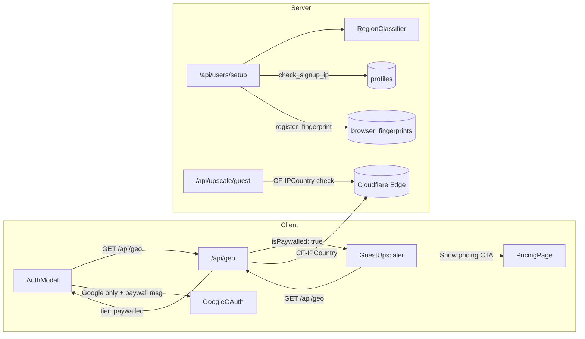
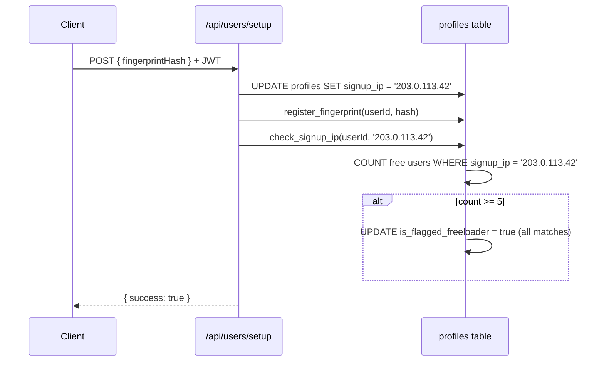
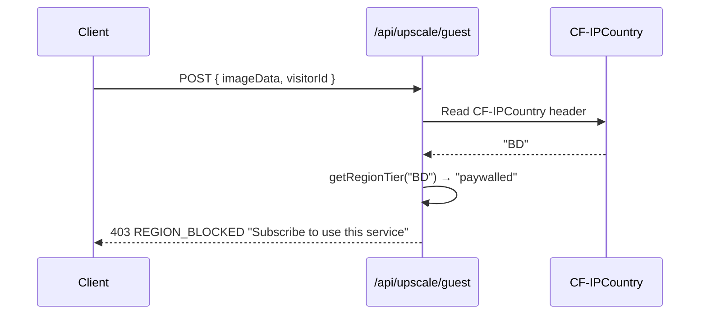
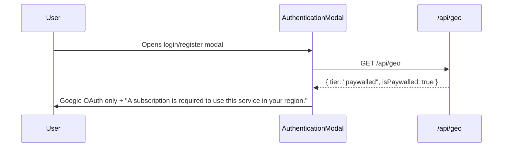

# PRD: Anti-Freeloader v2 — IP Cross-Account Flagging + Country Paywall

**Status:** Ready for implementation
**Complexity:** 6 → MEDIUM (standard checkpoints)

---

## Step 0: Complexity Assessment

```
COMPLEXITY SCORE:
+3  Touches 10+ files
+1  Database schema changes (new RPC, CHECK constraint update, index)
+2  Complex state logic (paywall across guest/auth/upscale, IP tracking)

Total: 6 → MEDIUM mode
```

---

## 1. Context

**Problem:** Two gaps in the anti-freeloader system: (1) `signup_ip` is stored in `profiles` but never cross-referenced across accounts — users creating multiple accounts via incognito (different fingerprints, same IP) are undetected; (2) no mechanism to completely paywall specific high-abuse countries where free-tier costs exceed any realistic conversion value.

**Files Analyzed:**

- `lib/anti-freeloader/region-classifier.ts`
- `lib/anti-freeloader/check-freeloader.ts`
- `app/api/users/setup/route.ts`
- `app/api/upscale/guest/route.ts`
- `app/api/geo/route.ts`
- `supabase/migrations/20260226_add_anti_freeloader.sql`
- `client/hooks/useRegionTier.ts`
- `client/components/modal/auth/AuthenticationModal.tsx`
- `shared/config/credits.config.ts`
- `shared/config/pricing-regions.ts`
- `server/services/guest-rate-limiter.ts`
- `tests/unit/anti-freeloader/*`

**Current Behavior:**

- `signup_ip` is written to `profiles` at setup — never queried across accounts
- `register_fingerprint` RPC flags 5+ free accounts sharing a fingerprint hash — no equivalent for IP
- Incognito users get different fingerprints but same IP → undetected
- Region tiers are binary: `standard` or `restricted` — no way to fully block a country's free tier
- Guest upscale route (`/api/upscale/guest`) has no country-level blocking

---

## 2. Solution

**Approach:**

1. **IP cross-account flagging** — new `check_signup_ip` RPC mirrors `register_fingerprint` logic: counts free accounts sharing the same `signup_ip`, flags all at threshold (5). No new table needed — queries `profiles.signup_ip` directly.
2. **Country paywall** — new `'paywalled'` region tier. Paywalled countries get 0 free credits, guest upscaling blocked, auth modal shows "subscription required" message. Paid users from paywalled countries are never affected.
3. **`PAYWALLED_COUNTRIES` set** — configurable set in `region-classifier.ts`. Starts empty. Add country codes as needed based on abuse data.

**Architecture:**



**Key Decisions:**

- IP threshold set to 5 (same as fingerprint) — high enough to tolerate family WiFi, low enough to catch mass account creation
- `PAYWALLED_COUNTRIES` starts empty — add countries based on data, not assumptions
- Paywalled users CAN sign up (Google-only) and CAN browse — they just can't process images without paying
- Guest route blocks paywalled countries server-side via `CF-IPCountry` (no client bypass possible)
- No new table for IP tracking — `profiles.signup_ip` already exists, just needs an index + RPC
- `region_tier` priority: `paywalled` > `standard` > `restricted` (a paywalled country overrides the standard check)

**Data Changes:**

- New index: `idx_profiles_signup_ip` on `profiles(signup_ip)`
- New RPC: `check_signup_ip(p_user_id, p_ip)` — counts free accounts by IP, flags if >= 5
- Updated CHECK constraint: `region_tier IN ('standard', 'restricted', 'paywalled')`
- `PAYWALLED_FREE_CREDITS: 0` added to `credits.config.ts`

---

## 3. Sequence Flows

### IP Cross-Account Detection (at signup)



### Guest Upscale — Paywall Block



### Auth Modal — Paywalled Region



---

## 4. Execution Phases

### Phase 1: Database — IP Flagging RPC + Paywall Support

**User-visible outcome:** `check_signup_ip` RPC exists and flags free accounts sharing the same IP at threshold >= 5. `region_tier` CHECK constraint accepts `'paywalled'`.

**Files:**

- `supabase/migrations/20260316_ip_flagging_and_paywall.sql` — new

**Implementation:**

- [ ] Create migration with:

```sql
-- Index on signup_ip for cross-account lookup
CREATE INDEX IF NOT EXISTS idx_profiles_signup_ip
  ON public.profiles(signup_ip)
  WHERE signup_ip IS NOT NULL;

-- Update region_tier CHECK to support 'paywalled'
ALTER TABLE public.profiles
  DROP CONSTRAINT IF EXISTS profiles_region_tier_check;

ALTER TABLE public.profiles
  ADD CONSTRAINT profiles_region_tier_check
  CHECK (region_tier IN ('standard', 'restricted', 'paywalled'));

-- RPC: check signup IP and flag if threshold reached
CREATE OR REPLACE FUNCTION public.check_signup_ip(
  p_user_id UUID,
  p_ip TEXT
) RETURNS void
LANGUAGE plpgsql
SECURITY DEFINER
SET search_path = public
AS $$
DECLARE
  v_count INTEGER;
BEGIN
  -- Guard: skip NULL/empty IPs (local dev, missing header)
  IF p_ip IS NULL OR p_ip = '' THEN
    RETURN;
  END IF;

  -- Count distinct FREE plan users sharing this signup IP
  SELECT COUNT(DISTINCT id) INTO v_count
  FROM public.profiles
  WHERE signup_ip = p_ip
    AND subscription_tier = 'free';

  -- Flag all free accounts sharing this IP if threshold reached
  IF v_count >= 5 THEN
    UPDATE public.profiles
    SET is_flagged_freeloader = true
    WHERE signup_ip = p_ip
      AND subscription_tier = 'free';
  END IF;
END;
$$;

-- Only service_role can call this
REVOKE ALL ON FUNCTION public.check_signup_ip(UUID, TEXT) FROM PUBLIC;
REVOKE ALL ON FUNCTION public.check_signup_ip(UUID, TEXT) FROM authenticated;
GRANT EXECUTE ON FUNCTION public.check_signup_ip(UUID, TEXT) TO service_role;
```

**Tests:**

| Test File | Test Name | Assertion |
|-----------|-----------|-----------|
| Migration verification via Supabase MCP | RPC exists | `SELECT routine_name FROM information_schema.routines WHERE routine_name = 'check_signup_ip'` returns 1 row |
| Migration verification | Index exists | `SELECT indexname FROM pg_indexes WHERE indexname = 'idx_profiles_signup_ip'` returns 1 row |
| Migration verification | CHECK accepts 'paywalled' | `UPDATE profiles SET region_tier = 'paywalled' WHERE ...` succeeds |

**Checkpoint:** Run `prd-work-reviewer` agent → must PASS before Phase 2.

---

### Phase 2: Region Classifier + Config — Paywall Tier

**User-visible outcome:** `getRegionTier()` returns `'paywalled'` for countries in `PAYWALLED_COUNTRIES`. `/api/geo` returns `isPaywalled: true`. Credits config has `PAYWALLED_FREE_CREDITS: 0`.

**Files:**

- `lib/anti-freeloader/region-classifier.ts` — modified
- `shared/config/credits.config.ts` — modified
- `app/api/geo/route.ts` — modified
- `tests/unit/anti-freeloader/region-classifier.unit.spec.ts` — modified

**Implementation:**

- [ ] Update `lib/anti-freeloader/region-classifier.ts`:
  - Add `'paywalled'` to `RegionTier` type: `export type RegionTier = 'standard' | 'restricted' | 'paywalled';`
  - Add `PAYWALLED_COUNTRIES` set (starts empty):
    ```ts
    /**
     * Countries where ALL free-tier access is blocked. Users from these countries
     * must purchase a subscription or credit pack to use the service.
     * They can browse the site and sign up, but cannot process images for free.
     *
     * Add country codes here based on abuse data — do not guess.
     * Example: PAYWALLED_COUNTRIES.add('XX') to paywall country XX.
     */
    const PAYWALLED_COUNTRIES = new Set<string>([
      // Add country codes here as needed, e.g.:
      // 'BD', // Bangladesh
    ]);

    /** Exported for test assertions only */
    export { PAYWALLED_COUNTRIES };
    ```
  - Update `getRegionTier()` to check paywalled first:
    ```ts
    export function getRegionTier(countryCode: string): RegionTier {
      if (!countryCode) return 'restricted';
      const upper = countryCode.toUpperCase();
      if (PAYWALLED_COUNTRIES.has(upper)) return 'paywalled';
      return HIGH_PURCHASING_POWER_COUNTRIES.has(upper) ? 'standard' : 'restricted';
    }
    ```
  - Update `getFreeCreditsForTier()`:
    ```ts
    export function getFreeCreditsForTier(tier: RegionTier): number {
      if (tier === 'paywalled') return 0;
      return tier === 'restricted' ? 3 : 10;
    }
    ```

- [ ] Update `shared/config/credits.config.ts`:
  - Add `PAYWALLED_FREE_CREDITS: 0` to `CREDIT_COSTS`

- [ ] Update `app/api/geo/route.ts`:
  - Add `isPaywalled` boolean to response:
    ```ts
    return NextResponse.json({
      country,
      tier: getRegionTier(country),
      isPaywalled: getRegionTier(country) === 'paywalled',
      pricingRegion: pricingConfig.region,
      discountPercent: pricingConfig.discountPercent,
    });
    ```
  - Update the no-country fallback to include `isPaywalled: false`

- [ ] Update tests in `tests/unit/anti-freeloader/region-classifier.unit.spec.ts`:
  - Add tests for paywalled tier

**Tests:**

| Test File | Test Name | Assertion |
|-----------|-----------|-----------|
| `tests/unit/anti-freeloader/region-classifier.unit.spec.ts` | `should return paywalled for country in PAYWALLED_COUNTRIES` | Temporarily add a country, assert `getRegionTier('XX') === 'paywalled'` |
| same | `should prioritize paywalled over standard` | If a country is in both sets, paywalled wins |
| same | `getFreeCreditsForTier should return 0 for paywalled` | `expect(getFreeCreditsForTier('paywalled')).toBe(0)` |
| same | `getFreeCreditsForTier should return 3 for restricted` | unchanged |
| same | `getFreeCreditsForTier should return 10 for standard` | unchanged |

**Checkpoint:** Run `prd-work-reviewer` agent → must PASS before Phase 3.

---

### Phase 3: Server Enforcement — Setup + Guest Route

**User-visible outcome:** (1) `/api/users/setup` calls `check_signup_ip` RPC after storing IP and sets credits to 0 for paywalled users. (2) Guest upscale route blocks paywalled countries with 403.

**Files:**

- `app/api/users/setup/route.ts` — modified
- `app/api/upscale/guest/route.ts` — modified
- `tests/unit/anti-freeloader/users-setup.unit.spec.ts` — modified
- `tests/unit/anti-freeloader/guest-paywall.unit.spec.ts` — new

**Implementation:**

- [ ] Update `app/api/users/setup/route.ts`:
  - After the profile update succeeds (line ~66), add IP flagging call alongside fingerprint:
    ```ts
    // Register fingerprint (best-effort)
    if (fingerprintHash) {
      const { error: rpcError } = await supabaseAdmin.rpc('register_fingerprint', {
        p_user_id: userId,
        p_hash: fingerprintHash,
      });
      if (rpcError) {
        logger.error('Failed to register fingerprint', { userId, error: rpcError.message });
      }
    }

    // Cross-account IP check (best-effort)
    if (ip) {
      const { error: ipError } = await supabaseAdmin.rpc('check_signup_ip', {
        p_user_id: userId,
        p_ip: ip,
      });
      if (ipError) {
        logger.error('Failed to check signup IP', { userId, error: ipError.message });
      }
    }
    ```
  - Update credit adjustment logic to handle paywalled tier:
    ```ts
    if (tier === 'paywalled' && profile?.subscription_tier === 'free' && isNewUser) {
      updatePayload.subscription_credits_balance = CREDIT_COSTS.PAYWALLED_FREE_CREDITS; // 0
    } else if (tier === 'restricted' && profile?.subscription_tier === 'free' && isNewUser) {
      updatePayload.subscription_credits_balance = CREDIT_COSTS.RESTRICTED_FREE_CREDITS; // 3
    }
    ```

- [ ] Update `app/api/upscale/guest/route.ts`:
  - Add country paywall check BEFORE rate limiting (early exit saves Redis calls):
    ```ts
    // Country paywall — block before any processing
    const country =
      req.headers.get('CF-IPCountry') ||
      req.headers.get('cf-ipcountry') ||
      (serverEnv.ENV === 'test' ? req.headers.get('x-test-country') : null);

    if (country) {
      const regionTier = getRegionTier(country);
      if (regionTier === 'paywalled') {
        logger.info('Guest blocked by country paywall', { country });
        return NextResponse.json(
          createErrorResponse(
            ErrorCodes.FORBIDDEN,
            'Free image processing is not available in your region. Sign up for a subscription to get started.',
            403,
            { upgradeUrl: '/pricing' }
          ).body,
          { status: 403 }
        );
      }
    }
    ```
  - Import `getRegionTier` from `@/lib/anti-freeloader/region-classifier`

**Tests:**

| Test File | Test Name | Assertion |
|-----------|-----------|-----------|
| `tests/unit/anti-freeloader/users-setup.unit.spec.ts` | `should call check_signup_ip RPC when IP is provided` | `expect(rpcMock).toHaveBeenCalledWith('check_signup_ip', { p_user_id, p_ip })` |
| same | `should not call check_signup_ip when IP is missing` | RPC not called with 'check_signup_ip' |
| same | `should set credits to 0 for paywalled new free user` | `capturedPayload.subscription_credits_balance === 0` |
| `tests/unit/anti-freeloader/guest-paywall.unit.spec.ts` | `should return 403 for paywalled country` | status 403, error includes 'not available in your region' |
| same | `should allow non-paywalled country` | request proceeds (status 200 or rate-limit, not 403) |
| same | `should allow when no country header present` | request proceeds (safe default) |

**User Verification:**

```bash
# Guest paywall (requires a country in PAYWALLED_COUNTRIES)
curl -X POST http://localhost:3000/api/upscale/guest \
  -H "x-test-country: BD" \
  -H "Content-Type: application/json" \
  -d '{"imageData":"base64...", "mimeType":"image/jpeg", "visitorId":"test123456"}' | jq .
# Expected: 403 with "not available in your region"

# Non-paywalled country
curl -X POST http://localhost:3000/api/upscale/guest \
  -H "x-test-country: US" \
  -H "Content-Type: application/json" \
  -d '{"imageData":"base64...", "mimeType":"image/jpeg", "visitorId":"test123456"}' | jq .
# Expected: proceeds normally (or rate limit, not 403)
```

**Checkpoint:** Run `prd-work-reviewer` agent → must PASS before Phase 4.

---

### Phase 4: Client UI — Paywall Messaging

**User-visible outcome:** Users from paywalled countries see "A subscription is required in your region" in the auth modal. GuestUpscaler shows a pricing CTA instead of the upload form.

**Files:**

- `client/hooks/useRegionTier.ts` — modified
- `client/components/modal/auth/AuthenticationModal.tsx` — modified
- `app/(pseo)/_components/tools/GuestUpscaler.tsx` — modified

**Implementation:**

- [ ] Update `client/hooks/useRegionTier.ts`:
  - Add `isPaywalled` to the return type and derive it:
    ```ts
    export function useRegionTier(): {
      tier: RegionTier | null;
      country: string | null;
      isLoading: boolean;
      isRestricted: boolean;
      isPaywalled: boolean;
      pricingRegion: string;
      discountPercent: number;
    }
    ```
  - Add `isPaywalled: tier === 'paywalled'` to the return object
  - Note: `isRestricted` should remain `tier === 'restricted'` (not include paywalled — they are distinct tiers)

- [ ] Update `AuthenticationModal.tsx`:
  - Get `isPaywalled` from `useRegionTier()`
  - For paywalled regions, show the same Google-only UI as restricted, but with a different message:
    ```tsx
    if (isPaywalled) {
      return (
        <>
          <p className="text-sm text-muted-foreground text-center mb-4">
            {'A subscription is required to use this service in your region.'}
          </p>
          <SocialLoginButton />
          <Link href="/pricing" className="text-sm text-primary underline text-center block mt-3">
            View plans
          </Link>
        </>
      );
    }
    ```
  - Both `isRestricted` and `isPaywalled` should show Google-only auth (no email/pw)

- [ ] Update `GuestUpscaler.tsx`:
  - Import `useRegionTier`
  - Check `isPaywalled` — if true, render a paywall CTA instead of the upscaler:
    ```tsx
    const { isPaywalled, isLoading: isGeoLoading } = useRegionTier();

    if (isGeoLoading) return <div className="animate-pulse h-32 bg-muted rounded" />;

    if (isPaywalled) {
      return (
        <div className="text-center py-8 space-y-4">
          <p className="text-lg font-medium">Image upscaling requires a subscription in your region</p>
          <p className="text-sm text-muted-foreground">
            Get started with our affordable plans — pricing adjusted for your region.
          </p>
          <Link href="/pricing" className="inline-flex items-center ...">
            View plans
          </Link>
        </div>
      );
    }
    ```

**Verification:**

Manual verification required (UI changes):

1. Set `x-test-country: BD` (add BD to `PAYWALLED_COUNTRIES` temporarily)
2. Open auth modal → should see "A subscription is required" + Google only + "View plans" link
3. Visit a pSEO tool page → GuestUpscaler should show paywall CTA, not upload form
4. Remove test country, verify standard/restricted behavior unchanged

**Checkpoint:** Run `prd-work-reviewer` agent → must PASS. Manual visual verification also required.

---

## 5. Acceptance Criteria

- [ ] All 4 phases complete with automated checkpoint PASS each
- [ ] `yarn verify` passes clean
- [ ] `check_signup_ip` RPC flags all free accounts sharing an IP at count >= 5
- [ ] `check_signup_ip` skips NULL/empty IPs (no false flags)
- [ ] `/api/users/setup` calls both `register_fingerprint` AND `check_signup_ip`
- [ ] `getRegionTier()` returns `'paywalled'` for countries in `PAYWALLED_COUNTRIES`
- [ ] `getFreeCreditsForTier('paywalled')` returns `0`
- [ ] `/api/geo` returns `isPaywalled: true` for paywalled countries
- [ ] Paywalled new free users get 0 credits at signup
- [ ] Guest upscale route returns 403 for paywalled countries
- [ ] Auth modal shows paywall message + pricing link for paywalled regions
- [ ] GuestUpscaler shows pricing CTA instead of upload form for paywalled regions
- [ ] Paid users from paywalled countries are never affected
- [ ] Standard and restricted behavior unchanged
- [ ] `PAYWALLED_COUNTRIES` starts empty (no countries paywalled by default)

---

## 6. Implementation Notes

| Note | Detail |
|------|--------|
| IP threshold | 5 accounts per IP, matching fingerprint threshold. Adjustable in the RPC SQL. |
| CGNAT risk | Mobile carriers in India/PH use CGNAT — thousands may share one IP. Threshold of 5 mitigates but doesn't eliminate false positives. Monitor and raise threshold if needed. |
| No new table | `check_signup_ip` queries `profiles.signup_ip` directly — no join table like `browser_fingerprints`. Simpler, fewer moving parts. |
| Paywall set empty | `PAYWALLED_COUNTRIES` starts empty by design. Add countries based on data from GSC/Amplitude (high free-tier usage, zero conversions). |
| How to paywall a country | Add the ISO 3166-1 alpha-2 code to `PAYWALLED_COUNTRIES` in `region-classifier.ts`. Deploy. Done. |
| Paywalled vs restricted | Restricted = fewer free credits (3) + Google-only auth. Paywalled = zero free credits + Google-only auth + guest upscale blocked + pricing CTA. |
| `region_tier` priority | `paywalled` checked first → `standard` → `restricted` (default). A country in both `PAYWALLED_COUNTRIES` and `HIGH_PURCHASING_POWER_COUNTRIES` would be paywalled. |
| Guest route order | Country paywall check runs BEFORE rate limiting to save Redis calls on blocked requests. |
| Safe defaults | Missing `CF-IPCountry` header → `standard` tier (local dev, direct access). Never accidentally paywalls. |

---

## 7. Known Limitations

### VPN Bypass

Same as v1: a user in a paywalled country using a VPN with a US exit node will appear as US. Accepted tradeoff — VPN usage costs money and filters casual abusers. Fingerprint + IP flagging still catches multi-account behavior.

### CGNAT False Positives (IP Flagging)

Mobile carriers in target countries (India, Philippines, Bangladesh) commonly use Carrier-Grade NAT, where many users share the same public IP. The threshold of 5 mitigates this but doesn't eliminate it. False positives only affect free-tier users and can be resolved by upgrading to a paid plan.

**Mitigation if needed:** Raise the IP threshold to 10 or 20, or remove IP flagging for paywalled countries (since they already have 0 credits and can't abuse the free tier).

### Paywalled Users Can Still Sign Up

By design. Paywalled users can create accounts, browse the site, and see pricing. They just can't process images for free. This keeps the conversion funnel open — they see value, hit the paywall, and some will convert.

### No Admin UI for Managing Paywalled Countries

Countries are managed via code (`PAYWALLED_COUNTRIES` set). For now this is acceptable — changes are infrequent and require a deploy. If the list changes frequently, consider moving to a database table or environment variable.
