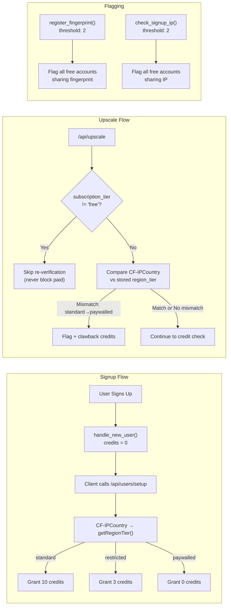
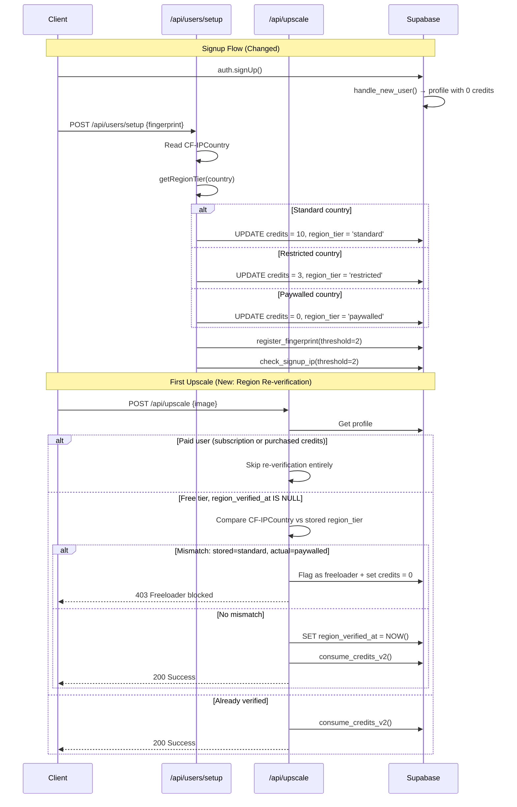

# PRD: Anti-Freeloader v3 — Account Cycling Prevention

**Status:** Ready
**Complexity:** 5 → MEDIUM (standard checkpoints)
**Date:** 2026-03-24

---

## Step 0: Complexity Assessment

```
COMPLEXITY SCORE:
+2  Touches 6-10 files
+1  Database schema changes (migration, trigger update, RPC threshold changes)
+2  Complex state logic (credit grant timing, VPN detection, region re-verification)

Total: 5 → MEDIUM mode
```

---

## 1. Context

**Problem:** Amplitude data reveals 417 distinct accounts from the Philippines (a paywalled country) farming ~743 upscales via account cycling — each account gets 10 free credits from the DB trigger before the setup route can reduce them to 0. Users bypass the paywall by: (1) using VPN at signup to get classified as "standard", (2) exploiting the race window between profile creation (10 credits) and setup route (reduces to 0), or (3) benefiting from the 5-account flagging threshold that allows 4 free accounts.

**Evidence:** Amplitude shows 1:1 user-to-device ratio (417 users / 421 devices), confirming account farming — not device spoofing. Top users burned through exactly 10 credits each. `serverEnforced: false` in batch limit modal events is a UX flag, not a credit bypass — credit enforcement via `consume_credits_v2` is atomic and solid.

**Files Analyzed:**

- `supabase/migrations/20260120_fix_signup_trigger.sql` — `handle_new_user()` trigger grants 10 credits unconditionally
- `app/api/users/setup/route.ts` — reduces credits post-signup (race window)
- `supabase/migrations/20260226_add_anti_freeloader.sql` — `register_fingerprint` RPC (threshold 5)
- `supabase/migrations/20260317_ip_flagging_and_paywall.sql` — `check_signup_ip` RPC (threshold 5)
- `lib/anti-freeloader/region-classifier.ts` — PH is paywalled
- `lib/anti-freeloader/check-freeloader.ts` — `isFreeleaderBlocked()` only blocks flagged free users
- `shared/config/credits.config.ts` — `DEFAULT_FREE_CREDITS: 10`, `PAYWALLED_FREE_CREDITS: 0`
- `shared/repositories/user.repository.ts` — `createWithDefaults` hardcodes 10 credits
- `supabase/migrations/20251205_update_credit_rpcs.sql` — `consume_credits_v2` enforces hard stop at 0

**Current Behavior:**

- `handle_new_user()` DB trigger always creates profile with `subscription_credits_balance = 10`
- `/api/users/setup` (called later by client) reduces to 0 for paywalled, 3 for restricted — but window exists
- If setup call fails, is skipped, or happens >10 min after signup → user keeps 10 credits
- VPN at signup → `CF-IPCountry` returns VPN exit country → standard tier → 10 credits permanently
- Flagging threshold of 5 accounts per IP/fingerprint → 4 free accounts before any detection
- `consume_credits_v2` correctly prevents negative balances (hard stop, `FOR UPDATE` row lock)

---

## 2. Solution

**Approach:**

1. **Zero-credit-by-default** — Change the DB trigger to create profiles with `subscription_credits_balance = 0`. Credits are granted ONLY in the setup route AFTER region classification. This eliminates the race window and ensures VPN users at signup still get 0 credits until classified.
2. **Lower flagging thresholds** — Reduce both `register_fingerprint` and `check_signup_ip` from 5 → 2 accounts. Legitimate users don't create 2+ free accounts on the same device/IP.
3. **Upscale-time region re-verification** — On the first upscale from a free-tier user, compare `CF-IPCountry` against stored `region_tier`. If a user signed up as "standard" via VPN but upscales from a paywalled country, flag and block.

**Paying user protection (CRITICAL):**

- All flagging only targets `subscription_tier = 'free'` users — paid users are never flagged
- `isFreeleaderBlocked()` already skips paid subscribers and credit purchasers
- Upscale-time re-verification ONLY runs for free-tier users with no purchases
- The zero-credit-by-default trigger change has NO effect on paying users (they get credits via subscription renewals, not the signup trigger)
- Threshold changes in RPCs are scoped to `AND subscription_tier = 'free'`

**Architecture Diagram:**



**Key Decisions:**

- Zero-credit-by-default is the highest-leverage fix (eliminates race window + VPN-at-signup bypass in one change)
- Threshold of 2 (not 3) because the only legitimate scenario for 2 free accounts on same device is "forgot password, made new account" — and they can contact support
- Re-verification only on first upscale (not every request) to avoid performance hit
- Clawback rather than immediate block on mismatch — gives user a chance to be legitimate (e.g., traveling)
- All changes are backward-compatible: existing users with credits keep them

**Data Changes:**

- New migration: update `handle_new_user()` trigger (0 credits default)
- New migration: update `register_fingerprint` threshold (5 → 2)
- New migration: update `check_signup_ip` threshold (5 → 2)
- New migration: add `region_verified_at` column to profiles (nullable timestamp)
- New RPC: `verify_usage_region(user_id, current_country)` for upscale-time check

---

## 3. Sequence Flow



---

## 4. Execution Phases

### Phase 1: Zero-Credit-by-Default — "New signups get 0 credits until region is classified"

**Files (4):**

- `supabase/migrations/20260324_zero_credit_default.sql` — NEW: update trigger + thresholds
- `app/api/users/setup/route.ts` — grant credits after classification (not just reduce)
- `shared/repositories/user.repository.ts` — change `createWithDefaults` to 0 credits
- `tests/unit/anti-freeloader/zero-credit-default.unit.spec.ts` — NEW: tests

**Implementation:**

- [ ] Create migration `20260324_zero_credit_default.sql`:
  - Update `handle_new_user()` to set `subscription_credits_balance = 0` (was 10)
  - Update welcome bonus transaction to log `0` credits (was 10)
  - Update `register_fingerprint` threshold from `>= 5` to `>= 2`
  - Update `check_signup_ip` threshold from `>= 5` to `>= 2`
- [ ] In `user.repository.ts`, change `createWithDefaults` default from `subscription_credits_balance: 10` to `subscription_credits_balance: 0`
- [ ] In `app/api/users/setup/route.ts`:
  - Remove the `NEW_USER_MAX_AGE_MS` grandfathering logic (no longer needed — credits start at 0, we always need to grant them)
  - Change logic: instead of only reducing credits for restricted/paywalled, ALWAYS set credits based on region:
    - `standard` → set `subscription_credits_balance = CREDIT_COSTS.DEFAULT_FREE_CREDITS` (10)
    - `restricted` → set `subscription_credits_balance = CREDIT_COSTS.RESTRICTED_FREE_CREDITS` (3)
    - `paywalled` → keep at 0 (already default)
  - Keep idempotency guard (skip if `region_tier` already set)
  - Log a credit transaction for the welcome bonus (only when granting > 0 credits)

**Tests Required:**

| Test File                                                     | Test Name                                                  | Assertion                                              |
| ------------------------------------------------------------- | ---------------------------------------------------------- | ------------------------------------------------------ |
| `tests/unit/anti-freeloader/zero-credit-default.unit.spec.ts` | `should create profile with 0 credits by default`          | `expect(profile.subscription_credits_balance).toBe(0)` |
| same                                                          | `should grant 10 credits after setup for standard region`  | Credits updated to 10 after setup                      |
| same                                                          | `should grant 3 credits after setup for restricted region` | Credits updated to 3 after setup                       |
| same                                                          | `should grant 0 credits after setup for paywalled region`  | Credits remain 0 after setup                           |
| same                                                          | `should not re-grant credits if region_tier already set`   | Idempotency check                                      |
| same                                                          | `should flag at threshold of 2 accounts per fingerprint`   | Flag triggers at 2, not 5                              |
| same                                                          | `should flag at threshold of 2 accounts per IP`            | Flag triggers at 2, not 5                              |

**Verification Plan:**

1. Unit tests pass
2. Migration applies cleanly
3. Manual: Create test user → verify 0 credits before setup call → verify correct credits after setup

---

### Phase 2: Upscale-Time Region Re-Verification — "VPN-at-signup users are caught on first upscale"

**Files (4):**

- `supabase/migrations/20260324_region_reverification.sql` — NEW: add column + RPC
- `app/api/upscale/route.ts` — add re-verification check for free-tier users
- `lib/anti-freeloader/region-reverifier.ts` — NEW: re-verification logic
- `tests/unit/anti-freeloader/region-reverification.unit.spec.ts` — NEW: tests

**Implementation:**

- [ ] Create migration `20260324_region_reverification.sql`:
  - Add `region_verified_at TIMESTAMPTZ NULL` column to `profiles`
  - Create `verify_usage_region` RPC:
    - Accepts `p_user_id UUID, p_current_country TEXT`
    - Only runs for `subscription_tier = 'free'` AND `purchased_credits_balance = 0` (skip paid users)
    - Compares `getRegionTier(p_current_country)` vs stored `region_tier`
    - If stored = 'standard' and current = 'paywalled' → flag as freeloader, set credits to 0
    - If stored = 'standard' and current = 'restricted' → downgrade to restricted, reduce credits to min(current, 3)
    - Sets `region_verified_at = NOW()` regardless of outcome
    - Returns `{ flagged: boolean, region_downgraded: boolean, new_region_tier: text }`
- [ ] Create `lib/anti-freeloader/region-reverifier.ts`:
  - Export `shouldReverify(profile)`: returns true if `subscription_tier = 'free'` AND `region_verified_at IS NULL` AND `purchased_credits_balance = 0`
  - Export `reverifyRegion(userId, currentCountry, supabaseAdmin)`: calls the RPC
- [ ] In `app/api/upscale/route.ts`, after fetching profile and before credit deduction:
  - Check `shouldReverify(profile)`
  - If true, call `reverifyRegion(userId, country, supabaseAdmin)`
  - If flagged → return 403 (freeloader blocked)
  - If downgraded → re-fetch profile and continue (may now have insufficient credits)
  - Track `region_reverification` analytics event with `{ result, original_tier, current_country }`

**Tests Required:**

| Test File                                                       | Test Name                                                                             | Assertion                                                     |
| --------------------------------------------------------------- | ------------------------------------------------------------------------------------- | ------------------------------------------------------------- |
| `tests/unit/anti-freeloader/region-reverification.unit.spec.ts` | `should flag free user who signed up as standard but upscales from paywalled country` | `flagged = true`                                              |
| same                                                            | `should downgrade free user from standard to restricted`                              | `region_downgraded = true, new_region_tier = 'restricted'`    |
| same                                                            | `should skip re-verification for paid subscribers`                                    | `shouldReverify returns false`                                |
| same                                                            | `should skip re-verification for users with purchased credits`                        | `shouldReverify returns false`                                |
| same                                                            | `should skip re-verification if already verified`                                     | `shouldReverify returns false when region_verified_at is set` |
| same                                                            | `should not flag when regions match`                                                  | `flagged = false`                                             |
| same                                                            | `should set region_verified_at after successful verification`                         | Timestamp set                                                 |

**Verification Plan:**

1. Unit tests pass
2. Migration applies cleanly
3. `yarn verify` passes

---

### Phase 3: Analytics + Monitoring — "Track anti-abuse effectiveness"

**Files (4):**

- `server/analytics/types.ts` — add anti-abuse event types
- `app/api/users/setup/route.ts` — track credit grant events
- `app/api/upscale/route.ts` — track re-verification events
- `tests/unit/anti-freeloader/analytics-tracking.unit.spec.ts` — NEW: tests

**Implementation:**

- [ ] Add analytics event types to `server/analytics/types.ts`:
  - `free_credits_granted`: `{ region_tier, credits_amount, country }`
  - `region_reverification`: `{ result: 'pass' | 'flagged' | 'downgraded', original_tier, current_country, signup_country }`
  - `freeloader_flagged`: `{ trigger: 'fingerprint' | 'ip' | 'region_mismatch', account_count?, country? }`
- [ ] In setup route: track `free_credits_granted` when credits > 0
- [ ] In upscale route: track `region_reverification` when re-verification runs
- [ ] Create Amplitude dashboard recommendations doc (not code — for manual Amplitude setup):
  - Chart: Free credits granted by region over time
  - Chart: Re-verification outcomes (pass/flag/downgrade)
  - Funnel: Signup → Setup → First upscale (detect setup drop-off)

**Tests Required:**

| Test File                                                    | Test Name                                                         | Assertion                             |
| ------------------------------------------------------------ | ----------------------------------------------------------------- | ------------------------------------- |
| `tests/unit/anti-freeloader/analytics-tracking.unit.spec.ts` | `should track free_credits_granted with correct properties`       | Event has region_tier, credits_amount |
| same                                                         | `should track region_reverification when re-verification runs`    | Event has result, original_tier       |
| same                                                         | `should not track free_credits_granted for paywalled (0 credits)` | No event fired                        |

**Verification Plan:**

1. All tests pass
2. `yarn verify` passes

---

## 5. Paying User Protection Matrix

| Scenario                              | Affected?      | Why Not                                                            |
| ------------------------------------- | -------------- | ------------------------------------------------------------------ |
| Active subscriber signs up            | No             | Gets credits via subscription renewal webhook, not signup trigger  |
| Existing subscriber processes image   | No             | `shouldReverify()` returns false (subscription_tier != 'free')     |
| Credit pack purchaser processes image | No             | `shouldReverify()` returns false (purchased_credits_balance > 0)   |
| Subscriber from PH processes image    | No             | `isFreeleaderBlocked()` skips non-free tiers                       |
| Free user who bought credits once     | No             | `shouldReverify()` skips if purchased_credits_balance > 0          |
| Free user from US (standard)          | No             | Gets 10 credits in setup, re-verification passes                   |
| Free user from IN (restricted)        | Minimal        | Gets 3 credits (same as before), re-verification passes            |
| Free user from PH (paywalled)         | Yes (intended) | Gets 0 credits (same as before, but now enforced at trigger level) |
| VPN user from PH pretending to be US  | Yes (intended) | Caught by re-verification on first upscale                         |

---

## 6. Acceptance Criteria

- [ ] All 3 phases complete
- [ ] All specified tests pass
- [ ] `yarn verify` passes
- [ ] New signups start with 0 credits (verified in DB)
- [ ] Setup route correctly grants 10/3/0 credits based on region
- [ ] Flagging triggers at 2 accounts (not 5)
- [ ] VPN-at-signup users flagged on first upscale from paywalled country
- [ ] Paying users (subscribers + credit purchasers) are NEVER affected
- [ ] Existing users with credits are not impacted (no retroactive changes)
- [ ] Analytics events fire correctly for monitoring
