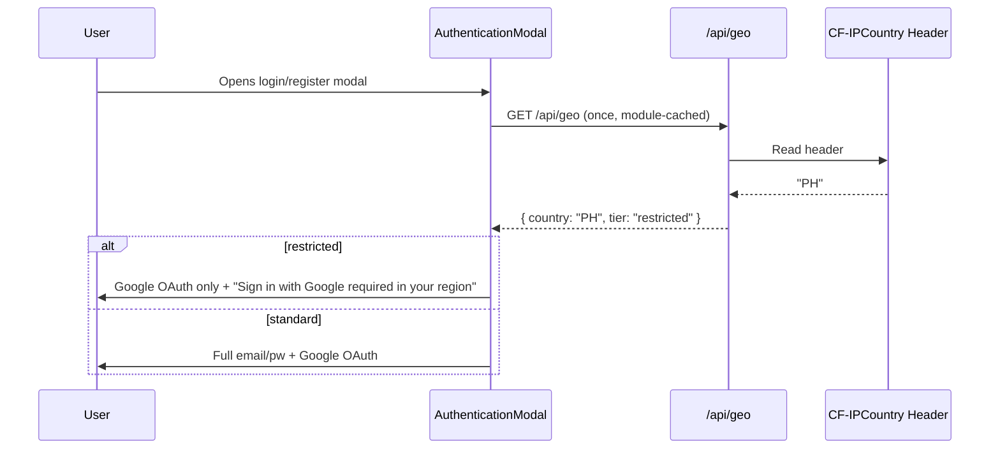
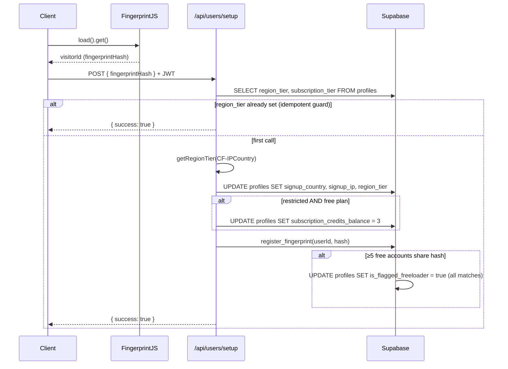
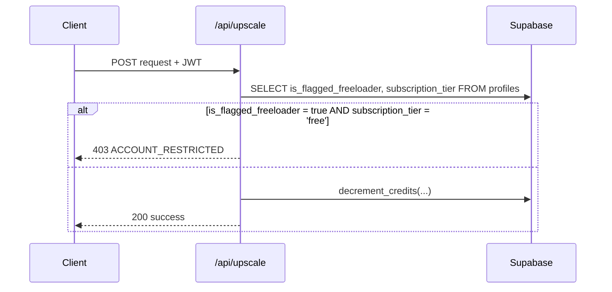

# PRD: Anti-Freeloader System

**Status:** Ready for implementation
**Complexity:** 9 → HIGH (mandatory checkpoints every phase)

---

## Step 0: Complexity Assessment

```
COMPLEXITY SCORE:
+3  Touches 10+ files
+2  New system/module from scratch (lib/anti-freeloader/)
+2  Complex state logic (fingerprint counting, region detection, credit adjustment)
+1  Database schema changes
+1  External API integration (FingerprintJS — already installed at v5.0.1)

Total: 9 → HIGH mode
```

---

## 1. Context

**Problem:** Free-tier users in low-purchasing-power regions abuse the platform by creating multiple accounts to bypass credit limits, costing real money on Replicate model calls with near-zero conversion likelihood.

**Files Analyzed:**

- `client/components/modal/auth/AuthenticationModal.tsx`
- `client/components/modal/auth/LoginForm.tsx`
- `client/components/modal/auth/RegisterForm.tsx`
- `client/components/form/SocialLoginButton.tsx`
- `client/store/auth/authOperations.ts`
- `supabase/migrations/20260120_fix_signup_trigger.sql`
- `lib/i18n/country-locale-map.ts`
- `middleware.ts`
- `shared/config/security.ts`
- `package.json` (`@fingerprintjs/fingerprintjs: ^5.0.1` already installed)

**Current Behavior:**

- All new users get 10 free subscription credits on signup regardless of location
- Email/password auth is available to everyone globally
- No fingerprinting or device tracking at signup
- No geo-based restrictions of any kind

---

## 2. Solution

**Approach:**

1. **Region classifier** — define `HIGH_PPP_COUNTRIES` set; everyone else is `restricted`
2. **`/api/geo` endpoint** — reads `CF-IPCountry` server-side (cannot be spoofed), returns `{ country, tier }`
3. **Auth gate** — `AuthenticationModal` fetches geo on open; restricted regions see Google OAuth only, email/pw hidden
4. **Post-signup setup** — after any signup, client calls `/api/users/setup` with fingerprint hash; server adjusts credits (3 for restricted vs 10 for standard) and stores metadata
5. **Fingerprint blocking** — `browser_fingerprints` table tracks hashes per free user; ≥5 free accounts sharing a fingerprint → all flagged; flagged free users blocked from credit-consuming routes

**Architecture:**

```mermaid
flowchart LR
    subgraph Client
        AuthModal -->|GET /api/geo| GeoAPI
        GeoAPI -->|tier: restricted| AuthModal
        AuthModal -->|Google only| GoogleOAuth
        Signup -->|POST /api/users/setup| SetupAPI
    end
    subgraph Server
        GeoAPI[/api/geo] -->|CF-IPCountry| CF[(Cloudflare Edge)]
        SetupAPI[/api/users/setup] --> RegionClassifier
        SetupAPI --> FingerprintDB[(browser_fingerprints)]
        SetupAPI --> ProfilesDB[(profiles)]
        UpscaleAPI -->|check is_flagged_freeloader| ProfilesDB
    end
```

**Key Decisions:**

- Country detection is **server-side only** via `CF-IPCountry` — client cannot spoof it
- `@fingerprintjs/fingerprintjs` v5 already in `package.json` — zero new dependencies
- Fingerprint blocking applies to **free plan only** — paid plans are never affected
- Credits adjusted in `/api/users/setup`, not in the DB trigger (trigger stays at 10, server overwrites to 3 for restricted)
- **Existing accounts grandfathered** — no retroactive changes
- `HIGH_PURCHASING_POWER_COUNTRIES`: countries where residents can realistically afford international SaaS pricing — where residents can realistically afford international SaaS pricing. Everyone else gets the `restricted` tier (fewer free credits, Google-only auth). See full list in Phase 1.

**Data Changes:**

- `profiles`: add `signup_country TEXT`, `signup_ip TEXT`, `region_tier TEXT`, `is_flagged_freeloader BOOLEAN DEFAULT false`
- New table: `browser_fingerprints(id, fingerprint_hash, user_id, created_at)`
- New RPC: `register_fingerprint(p_user_id, p_hash)` — inserts hash, counts free accounts, flags all if ≥5

---

## 3. Sequence Flows

### Auth Modal — Region Gate



### Post-Signup Setup



### Fingerprint Block on Credit Consumption



---

## 4. Execution Phases

### Phase 1: Region Classifier + `/api/geo` Endpoint

**User-visible outcome:** `GET /api/geo` returns the correct region tier based on the request IP.

**Files:**

- `lib/anti-freeloader/region-classifier.ts` — new
- `app/api/geo/route.ts` — new
- `shared/config/security.ts` — add `/api/geo` to `PUBLIC_API_ROUTES`
- `tests/unit/anti-freeloader/region-classifier.unit.spec.ts` — new

**Implementation:**

- [ ] Create `lib/anti-freeloader/region-classifier.ts`:

  ```ts
  export type RegionTier = 'standard' | 'restricted';

  /**
   * Countries where residents can realistically afford international SaaS pricing
   * (~$10–20/mo USD). Users from these countries are treated as standard and get the
   * full free tier. Everyone else is "restricted" (fewer free credits, Google-only auth)
   * because free-tier abuse from those regions costs money with near-zero conversion.
   *
   * Countries NOT on this list are not "worse" — they just have different price tolerance.
   * Paid users from any country are always treated as standard regardless of this list.
   */
  const HIGH_PURCHASING_POWER_COUNTRIES = new Set([
    // North America
    'US',
    'CA',
    // British Isles
    'GB',
    'IE',
    // Oceania
    'AU',
    'NZ',
    // Western Europe
    'DE',
    'FR',
    'NL',
    'BE',
    'CH',
    'AT',
    'LU',
    'LI',
    'MC',
    // Northern Europe
    'SE',
    'NO',
    'DK',
    'FI',
    'IS',
    // Southern Europe
    'IT',
    'ES',
    'PT',
    'GR',
    'CY',
    'MT',
    // Eastern Europe (EU members with similar price tolerance)
    'EE',
    'LV',
    'LT',
    'SI',
    'SK',
    'CZ',
    'PL',
    'HU',
    // East Asia
    'JP',
    'SG',
    'KR',
    'HK',
    'TW',
    // Gulf / Middle East (high per-capita income)
    'AE',
    'QA',
    'KW',
    'IL',
    'SA',
    'BH',
    'OM',
  ]);

  export function getRegionTier(countryCode: string): RegionTier {
    if (!countryCode) return 'restricted';
    // Cloudflare may return "T1" (Tor) or "XX" (unknown) — treat as restricted
    return HIGH_PURCHASING_POWER_COUNTRIES.has(countryCode.toUpperCase())
      ? 'standard'
      : 'restricted';
  }
  ```

- [ ] Create `app/api/geo/route.ts`:

  ```ts
  import { NextRequest, NextResponse } from 'next/server';
  import { getRegionTier } from '@/lib/anti-freeloader/region-classifier';
  import { serverEnv } from '@shared/config/env';

  /**
   * CF-IPCountry: Cloudflare injects this header on every request passing through
   * their network. It is set server-side by Cloudflare — the client cannot forge it.
   *
   * Works on Cloudflare Pages/Workers: YES. The header is present on all incoming
   * requests handled by Pages Functions (which is what our Next.js API routes run as).
   * No extra configuration needed.
   *
   * Special values to be aware of:
   *   "T1" — Tor exit node (anonymous). Treated as restricted by getRegionTier().
   *   "XX" — Unknown / private IP range (RFC 1918, loopback, etc.)
   *   ""   — Header absent (local dev, direct TCP connections bypassing CF)
   *
   * NOT spoofable by the client, but IS affected by VPNs — if a user in PH routes
   * through a US VPN, Cloudflare sees the VPN server's IP and returns "US". This is
   * an accepted limitation (VPN usage is low in the target abuse demographics).
   *
   * In local dev (no Cloudflare in front): header is absent → falls back to null →
   * returns { country: null, tier: 'standard' } which is the safe default.
   */
  export async function GET(req: NextRequest) {
    const country =
      req.headers.get('CF-IPCountry') ||
      req.headers.get('cf-ipcountry') ||
      (serverEnv.ENV === 'test' ? req.headers.get('x-test-country') : null);

    if (!country) {
      return NextResponse.json({ country: null, tier: 'standard' });
    }

    return NextResponse.json({ country, tier: getRegionTier(country) });
  }
  ```

- [ ] Add `'/api/geo'` to `PUBLIC_API_ROUTES` in `shared/config/security.ts`

**Tests:**

| Test File                                                   | Test Name                                   | Assertion                                        |
| ----------------------------------------------------------- | ------------------------------------------- | ------------------------------------------------ |
| `tests/unit/anti-freeloader/region-classifier.unit.spec.ts` | `should return standard for US`             | `expect(getRegionTier('US')).toBe('standard')`   |
| same                                                        | `should return standard for GB`             | `expect(getRegionTier('GB')).toBe('standard')`   |
| same                                                        | `should return standard for JP`             | `expect(getRegionTier('JP')).toBe('standard')`   |
| same                                                        | `should return restricted for PH`           | `expect(getRegionTier('PH')).toBe('restricted')` |
| same                                                        | `should return restricted for IN`           | `expect(getRegionTier('IN')).toBe('restricted')` |
| same                                                        | `should return restricted for BR`           | `expect(getRegionTier('BR')).toBe('restricted')` |
| same                                                        | `should be case-insensitive`                | `expect(getRegionTier('us')).toBe('standard')`   |
| same                                                        | `should return restricted for empty string` | `expect(getRegionTier('')).toBe('restricted')`   |

**User Verification:**

```bash
curl http://localhost:3000/api/geo -H "x-test-country: PH"
# Expected: {"country":"PH","tier":"restricted"}

curl http://localhost:3000/api/geo -H "x-test-country: US"
# Expected: {"country":"US","tier":"standard"}

curl http://localhost:3000/api/geo
# Expected: {"country":null,"tier":"standard"}
```

**Checkpoint:** Run `prd-work-reviewer` agent → must PASS before Phase 2.

---

### Phase 2: Database Migration

**User-visible outcome:** `profiles` table has region/fingerprint columns; `browser_fingerprints` table exists with RLS; `register_fingerprint` RPC works.

**Files:**

- `supabase/migrations/20260226_add_anti_freeloader.sql` — new

**Implementation:**

- [ ] Create migration file with:

```sql
-- Add anti-freeloader columns to profiles
ALTER TABLE public.profiles
  ADD COLUMN IF NOT EXISTS signup_country TEXT,
  ADD COLUMN IF NOT EXISTS signup_ip TEXT,
  ADD COLUMN IF NOT EXISTS region_tier TEXT CHECK (region_tier IN ('standard', 'restricted')),
  ADD COLUMN IF NOT EXISTS is_flagged_freeloader BOOLEAN NOT NULL DEFAULT false;

-- Browser fingerprints table
CREATE TABLE IF NOT EXISTS public.browser_fingerprints (
  id UUID PRIMARY KEY DEFAULT gen_random_uuid(),
  fingerprint_hash TEXT NOT NULL,
  user_id UUID NOT NULL REFERENCES public.profiles(id) ON DELETE CASCADE,
  created_at TIMESTAMPTZ NOT NULL DEFAULT now(),
  UNIQUE(fingerprint_hash, user_id)
);

CREATE INDEX IF NOT EXISTS idx_fingerprints_hash ON public.browser_fingerprints(fingerprint_hash);

ALTER TABLE public.browser_fingerprints ENABLE ROW LEVEL SECURITY;

CREATE POLICY "Users can read own fingerprints"
  ON public.browser_fingerprints FOR SELECT
  USING (auth.uid() = user_id);

GRANT INSERT, SELECT ON public.browser_fingerprints TO service_role;

-- RPC: register fingerprint and flag if threshold reached
CREATE OR REPLACE FUNCTION public.register_fingerprint(
  p_user_id UUID,
  p_hash TEXT
) RETURNS void
LANGUAGE plpgsql
SECURITY DEFINER
SET search_path = public
AS $$
DECLARE
  v_count INTEGER;
BEGIN
  INSERT INTO public.browser_fingerprints(fingerprint_hash, user_id)
  VALUES (p_hash, p_user_id)
  ON CONFLICT (fingerprint_hash, user_id) DO NOTHING;

  -- Count distinct FREE plan users sharing this fingerprint
  SELECT COUNT(DISTINCT bf.user_id) INTO v_count
  FROM public.browser_fingerprints bf
  JOIN public.profiles p ON p.id = bf.user_id
  WHERE bf.fingerprint_hash = p_hash
    AND p.subscription_tier = 'free';

  -- Flag all free accounts sharing this fingerprint if threshold reached
  IF v_count >= 5 THEN
    UPDATE public.profiles
    SET is_flagged_freeloader = true
    WHERE id IN (
      SELECT DISTINCT bf.user_id
      FROM public.browser_fingerprints bf
      WHERE bf.fingerprint_hash = p_hash
    )
    AND subscription_tier = 'free';
  END IF;
END;
$$;

-- Only service_role can call this — prevents client manipulation
REVOKE ALL ON FUNCTION public.register_fingerprint(UUID, TEXT) FROM PUBLIC;
REVOKE ALL ON FUNCTION public.register_fingerprint(UUID, TEXT) FROM authenticated;
GRANT EXECUTE ON FUNCTION public.register_fingerprint(UUID, TEXT) TO service_role;
```

**Verification:**

- Apply migration via Supabase MCP
- `SELECT column_name FROM information_schema.columns WHERE table_name = 'profiles'` — confirm new columns
- `SELECT * FROM information_schema.tables WHERE table_name = 'browser_fingerprints'` — confirm table
- `SELECT routine_name FROM information_schema.routines WHERE routine_name = 'register_fingerprint'` — confirm RPC

**Checkpoint:** Run `prd-work-reviewer` agent → must PASS before Phase 3.

---

### Phase 3: Auth UI — Google-Only for Restricted Regions

**User-visible outcome:** A user from PH opens the auth modal and sees only the Google sign-in button, with a clear message. US users see the full UI unchanged.

**Files:**

- `client/hooks/useRegionTier.ts` — new
- `client/components/modal/auth/AuthenticationModal.tsx` — modified

**Implementation:**

- [ ] Create `client/hooks/useRegionTier.ts`:

  ```ts
  'use client';

  import { useEffect, useState } from 'react';
  import type { RegionTier } from '@/lib/anti-freeloader/region-classifier';

  // Module-level cache — persists for the browser session
  let cachedTier: RegionTier | null = null;

  export function useRegionTier() {
    const [tier, setTier] = useState<RegionTier | null>(cachedTier);
    const [isLoading, setIsLoading] = useState(cachedTier === null);

    useEffect(() => {
      if (cachedTier !== null) return;
      fetch('/api/geo')
        .then(r => r.json())
        .then((data: { tier?: RegionTier }) => {
          cachedTier = data.tier ?? 'standard';
          setTier(cachedTier);
        })
        .catch(() => {
          cachedTier = 'standard'; // safe default on network failure
          setTier('standard');
        })
        .finally(() => setIsLoading(false));
    }, []);

    return { tier, isLoading, isRestricted: tier === 'restricted' };
  }
  ```

- [ ] Modify `AuthenticationModal.tsx`:
  - Import `useRegionTier` at the top
  - Call `const { isRestricted, isLoading: isGeoLoading } = useRegionTier();` inside component
  - In `case 'login'`:
    - If `isGeoLoading`: show a loading skeleton (e.g., `<div className="animate-pulse h-32 bg-muted rounded" />`)
    - If `isRestricted`: show message + `<SocialLoginButton />` only, skip `<LoginForm />`
  - In `case 'register'`: same pattern — message + `<SocialLoginButton />` only, skip `<RegisterForm />`
  - Message to display: `"Sign in with Google is required in your region."`

**Verification:**

```bash
# Manual: open auth modal with x-test-country PH set in browser headers
# → should see Google button only + message
# → email/password fields should not be present in DOM

# Manual: open auth modal with no special headers (standard)
# → should see email/pw + Google button
```

**Checkpoint:** Run `prd-work-reviewer` agent → must PASS before Phase 4.
Also manual checkpoint — visual verification required.

---

### Phase 4: Post-Signup Setup (Fingerprint + Credit Adjustment)

**User-visible outcome:** After email signup, restricted-region users have 3 credits; standard users have 10. Browser fingerprint is stored. 5th account on same fingerprint (free plan) triggers flagging of all 5.

**Files:**

- `client/hooks/useFingerprint.ts` — new
- `app/api/users/setup/route.ts` — new
- `client/store/auth/authOperations.ts` — modified
- `client/components/modal/auth/AuthenticationModal.tsx` — modified (pass fingerprint to signup)
- `app/[locale]/auth/callback/page.tsx` — modified (call setup after OAuth)

**Implementation:**

- [ ] Create `client/hooks/useFingerprint.ts`:

  ```ts
  'use client';

  import { useEffect, useState } from 'react';

  let cachedHash: string | null = null;

  export function useFingerprint(): string | null {
    const [hash, setHash] = useState<string | null>(cachedHash);

    useEffect(() => {
      if (cachedHash !== null) return;
      // Dynamic import — FingerprintJS is ESM, works with vitest dynamic imports
      import('@fingerprintjs/fingerprintjs')
        .then(FingerprintJS => FingerprintJS.load())
        .then(fp => fp.get())
        .then(result => {
          cachedHash = result.visitorId;
          setHash(cachedHash);
        })
        .catch(() => {}); // best-effort, silent failure is acceptable
    }, []);

    return hash;
  }
  ```

- [ ] Create `app/api/users/setup/route.ts`:

  ```ts
  import { NextRequest, NextResponse } from 'next/server';
  import { verifyApiAuth } from '@/lib/middleware/auth';
  import { getRegionTier } from '@/lib/anti-freeloader/region-classifier';
  import { createAdminClient } from '@shared/utils/supabase/admin';
  import { serverEnv } from '@shared/config/env';
  import { z } from 'zod';

  const setupSchema = z.object({
    fingerprintHash: z.string().optional(),
  });

  export async function POST(req: NextRequest) {
    const auth = await verifyApiAuth(req);
    if (!auth.success) return NextResponse.json({ error: auth.error }, { status: 401 });

    const body = setupSchema.safeParse(await req.json());
    if (!body.success) return NextResponse.json({ error: 'Invalid request' }, { status: 400 });

    const userId = auth.userId;
    const supabase = createAdminClient();

    // Idempotency guard — skip if already set up
    const { data: profile } = await supabase
      .from('profiles')
      .select('region_tier, subscription_tier')
      .eq('id', userId)
      .single();

    if (profile?.region_tier) {
      return NextResponse.json({ success: true, alreadySetup: true });
    }

    const rawCountry =
      req.headers.get('CF-IPCountry') ||
      req.headers.get('cf-ipcountry') ||
      (serverEnv.ENV === 'test' ? req.headers.get('x-test-country') : null);

    const country = rawCountry || null;
    const tier = country ? getRegionTier(country) : 'standard';
    const ip = req.headers.get('CF-Connecting-IP') || req.headers.get('x-forwarded-for') || null;

    // Update profile metadata
    const updatePayload: Record<string, unknown> = { region_tier: tier };
    if (country) updatePayload.signup_country = country;
    if (ip) updatePayload.signup_ip = ip;

    // Reduce credits for restricted free-plan users
    if (tier === 'restricted' && profile?.subscription_tier === 'free') {
      updatePayload.subscription_credits_balance = 3;
    }

    await supabase.from('profiles').update(updatePayload).eq('id', userId);

    // Register fingerprint (fire-and-forget, best-effort)
    const { fingerprintHash } = body.data;
    if (fingerprintHash) {
      await supabase.rpc('register_fingerprint', {
        p_user_id: userId,
        p_hash: fingerprintHash,
      });
    }

    return NextResponse.json({ success: true });
  }
  ```

- [ ] Modify `client/store/auth/authOperations.ts` — `createSignUpWithEmail`:
  - Add optional `fingerprintHash?: string` param
  - After successful signup (when session exists), call `/api/users/setup` fire-and-forget:
    ```ts
    if (data.session?.access_token && fingerprintHash !== undefined) {
      fetch('/api/users/setup', {
        method: 'POST',
        headers: {
          'Content-Type': 'application/json',
          Authorization: `Bearer ${data.session.access_token}`,
        },
        body: JSON.stringify({ fingerprintHash }),
      }).catch(() => {});
    }
    ```

- [ ] Modify `AuthenticationModal.tsx`:
  - Import `useFingerprint`
  - Call `const fingerprintHash = useFingerprint();` inside component
  - Pass `fingerprintHash` through `onRegisterSubmit` → `signUpWithEmail(email, password, fingerprintHash)`

- [ ] Modify `app/[locale]/auth/callback/page.tsx`:
  - After session is established, call `/api/users/setup` with fingerprint hash
  - Fingerprint can be read from module cache if `useFingerprint` was called earlier, or re-initialized here

**Tests:**

| Test File                                             | Test Name                                            | Assertion                                |
| ----------------------------------------------------- | ---------------------------------------------------- | ---------------------------------------- |
| `tests/unit/anti-freeloader/users-setup.unit.spec.ts` | `should return 401 when unauthenticated`             | status 401                               |
| same                                                  | `should set region_tier standard for US`             | profile.region_tier = 'standard'         |
| same                                                  | `should set region_tier restricted for PH`           | profile.region_tier = 'restricted'       |
| same                                                  | `should set credits to 3 for restricted free user`   | profile.subscription_credits_balance = 3 |
| same                                                  | `should not adjust credits for standard region user` | credits unchanged at 10                  |
| same                                                  | `should be idempotent on second call`                | second call returns alreadySetup: true   |

**Checkpoint:** Run `prd-work-reviewer` agent → must PASS before Phase 5.

---

### Phase 5: Enforce Fingerprint Flag on Credit-Consuming Routes

**User-visible outcome:** A flagged free-plan user attempting to upscale gets a clear 403 error with an upgrade prompt. Paid users are never affected.

**Files:**

- Primary upscale/process API route (identify via codebase search)
- `tests/unit/anti-freeloader/fingerprint-block.unit.spec.ts` — new

**Implementation:**

- [ ] Find the primary credit-consuming route: search `app/api/` for `decrement_credits` usage
- [ ] Add check immediately after auth verification, before credit deduction:

  ```ts
  const { data: profile } = await supabase
    .from('profiles')
    .select('is_flagged_freeloader, subscription_tier')
    .eq('id', userId)
    .single();

  if (profile?.is_flagged_freeloader && profile.subscription_tier === 'free') {
    return NextResponse.json(
      {
        error: {
          code: 'ACCOUNT_RESTRICTED',
          message: 'Multiple accounts detected on your device. Upgrade to a paid plan to continue.',
        },
      },
      { status: 403 }
    );
  }
  ```

- [ ] Write unit tests:

| Test File                                                   | Test Name                            | Assertion                                       |
| ----------------------------------------------------------- | ------------------------------------ | ----------------------------------------------- |
| `tests/unit/anti-freeloader/fingerprint-block.unit.spec.ts` | `should block flagged free user`     | returns 403 ACCOUNT_RESTRICTED                  |
| same                                                        | `should allow non-flagged free user` | proceeds normally                               |
| same                                                        | `should allow flagged paid user`     | proceeds normally (subscription_tier != 'free') |

**User Verification:**

```bash
# Simulate flagged free user
curl -X POST http://localhost:3000/api/upscale \
  -H "Authorization: Bearer $FLAGGED_USER_TOKEN" \
  -H "Content-Type: application/json" \
  -d '{"imageUrl":"..."}' | jq .
# Expected: {"error":{"code":"ACCOUNT_RESTRICTED","message":"..."}}
```

**Checkpoint:** Run `prd-work-reviewer` agent → must PASS.

---

## 5. Acceptance Criteria

- [ ] All 5 phases complete with automated checkpoint PASS each
- [ ] `yarn verify` passes clean
- [ ] `GET /api/geo` returns `standard` for US/GB/JP, `restricted` for PH/IN/BR
- [ ] Auth modal shows Google-only UI for restricted regions (no email/pw form in DOM)
- [ ] Standard region new signups → 10 credits; restricted region → 3 credits
- [ ] 5th free account sharing a fingerprint → all 5 get `is_flagged_freeloader = true`
- [ ] Flagged + free plan → 403 on upscale endpoint
- [ ] Paid users always unaffected regardless of flag
- [ ] Existing accounts unaffected (no retroactive changes)
- [ ] `/api/users/setup` is idempotent (safe to call multiple times)

---

## 6. Implementation Notes

| Note                       | Detail                                                                                                                                         |
| -------------------------- | ---------------------------------------------------------------------------------------------------------------------------------------------- |
| FingerprintJS v5 API       | `FingerprintJS.load().then(fp => fp.get()).then(r => r.visitorId)` — `.load()` is required                                                     |
| Dynamic import             | Use `await import('@fingerprintjs/fingerprintjs')` in hooks — works in vitest per MEMORY.md                                                    |
| Local dev                  | `CF-IPCountry` absent in local dev; `/api/geo` returns `{ country: null, tier: 'standard' }` — safe                                            |
| Idempotency                | Check `region_tier IS NULL` in setup endpoint before adjusting credits                                                                         |
| RPC security               | `register_fingerprint` callable by `service_role` only — REVOKE from `authenticated`                                                           |
| Safe default               | On `/api/geo` failure, `useRegionTier` returns `'standard'` — never accidentally locks out users                                               |
| CF-IPCountry on CF Workers | Works natively — Cloudflare Pages Functions receive the header on every request. No additional setup needed.                                   |
| Tor / unknown IPs          | CF returns `"T1"` for Tor exit nodes and `"XX"` for unknown ranges. `getRegionTier()` treats both as restricted (not in `HIGH_PPP_COUNTRIES`). |

---

## 7. Known Limitations

These are accepted trade-offs, not bugs. Document here so future engineers understand the threat model.

### `CF-IPCountry` + VPNs

**What happens:** A user in PH using a VPN with a US endpoint is classified as `standard` — they get 10 credits and email/pw auth. Cloudflare sees the VPN server's IP, not the user's real IP.

**Why it's accepted:** VPN usage requires deliberate effort and often costs money, which filters out casual abusers. Our target abusers are mass-account creators on mobile or low-effort automation — not VPN-savvy users. If it becomes a problem, the fingerprint layer still catches multi-account behavior regardless of country.

### Incognito Mode + Fingerprinting

**What happens:** FingerprintJS loses several signals in incognito (canvas fingerprinting is often blocked, IndexedDB behavior differs, some browser APIs return different values). The same user in incognito may produce a different `visitorId` than in normal mode.

**Why it's accepted:** The `CF-IPCountry` geo-gate (restricted region = Google-only auth) is the primary defense and is completely unaffected by incognito. Fingerprinting is a _secondary_ defense for multi-account detection. An abuser would need to:

1. Be in a restricted region but use a VPN to bypass geo-gate, AND
2. Create 5+ accounts in incognito with different fingerprints each time

The threshold of 5 accounts absorbs fingerprint drift. Fingerprint accuracy: ~99.5% same browser/mode, ~90% across incognito sessions.

### Multiple Browsers / Devices

**What happens:** Chrome, Firefox, Safari, and mobile browsers each produce different fingerprints for the same user. A user who legitimately creates one account per browser would register as distinct devices.

**Why it's accepted:** This is the standard limitation of browser fingerprinting. The threshold of 5 means they'd need 5 distinct browsers/devices before triggering a flag. For the abuse pattern we're targeting (cheap auto-signups), this isn't the attack vector.

### Shared Devices (False Positives)

**What happens:** A library computer, school lab, or family tablet where multiple people each create accounts will share the same browser fingerprint. The 5th legitimate user on that device gets all 5 accounts flagged.

**Why it's accepted:** False positives in this scenario are very unlikely to be paying customers. The `is_flagged_freeloader` flag only affects _free plan_ users — any of them can upgrade to immediately clear the block (paid plan check is `subscription_tier != 'free'`). If edge cases surface, we can add an appeal flow.

### Fingerprint Accuracy Degrades Over Time

**What happens:** Major browser updates (especially Chrome privacy changes), OS updates, and browser extension changes can shift the fingerprint of an existing browser, making it look like a new device on the next signup.

**Why it's accepted:** Existing accounts are grandfathered (setup is idempotent — once `region_tier` is set, it's not re-run). Fingerprint drift only matters at _signup time_. Returning users' fingerprints are never re-evaluated after the initial setup call.
