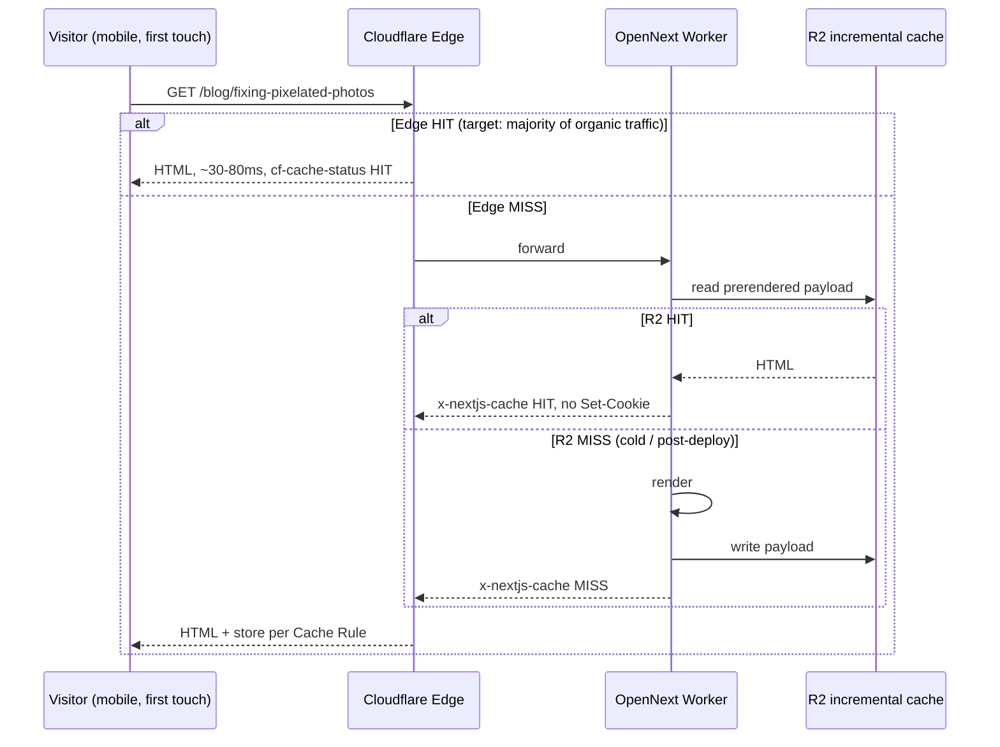

# PRD: Edge HTML Caching & LCP Recovery

**Status:** Not started
**Created:** 2026-08-25
**Owner:** TBD
**Source data:** `myimageupscaler.com-core-web-vitals-Issue-2026-08-25.zip` (GSC CWV export), live header probes 2026-08-25

`Complexity: 6 → MEDIUM mode` (touches 6-10 files +2, new caching subsystem +2, external service binding +1, performance-sensitive → manual checkpoint added)

---

## 1. Context

**Problem:** Every HTML response on myimageupscaler.com is rendered on-demand inside the Cloudflare Worker and is cached by nothing — not the Cloudflare edge, not the OpenNext incremental cache — producing 1.1-2.3s TTFB sitewide and a mobile LCP failure that has grown from 57 to 113 affected URLs since May.

**Files analyzed:**

- `middleware.ts` (lines 50-62, 907-943, 1019-1021)
- `open-next.config.ts`
- `wrangler.json`, `wrangler.toml`
- `app/[locale]/blog/[slug]/page.tsx` (lines 32-33)
- `app/(pseo)/formats/[slug]/page.tsx`
- `package.json` (`seo:pagespeed`, `verify`)
- `tests/unit/middleware/referral-detection.unit.spec.ts`

### Correction from the 2026-08-25 22:00 UTC re-probe

The claim below that "HTML returns no cache header at all" is imprecise. Cold, cookie-less
requests return an **explicit** anti-cache header, which is a stronger blocker than an absent one:

```
/                    cache-control: private, no-cache, no-store, max-age=0, must-revalidate
/pricing             cache-control: private, no-cache, no-store, max-age=0, must-revalidate
/blog                cache-control: private, no-cache, no-store, max-age=0, must-revalidate
/scale/2k-upscaler   cache-control: s-maxage=86400, stale-while-revalidate=31449600
                     x-nextjs-cache: MISS
```

So there are two distinct populations, and Phase 3's Cache Rule alone will not fix the first:

- **pSEO routes** already emit a correct `s-maxage` and only lack a populated incremental cache —
  Phase 2 addresses these.
- **App routes** (`/`, `/pricing`, `/blog`) emit `no-store`, which Cloudflare will honour no matter
  what the Cache Rule says. Find and remove whatever sets it before Phase 3, or Phase 3 will pass
  its gate on pSEO URLs while every app route stays uncached — a toy-proof pass.

Confirmed unchanged: `set-cookie: miu_referral_source=direct` is present on **every** cold response,
including the pSEO ones. Phase 1 stands as written. The `locale` cookie is set only on the redirect
path (`middleware.ts:574`), not on cold requests, so it is not a second cause here — but that
redirect is owned by [`locale-surface-retraction.md`](./locale-surface-retraction.md) Phase 3, which
should land before this PRD's Phase 3 gate is read.

### Current behavior (measured, not assumed)

Probes run 2026-08-25 against production:

| URL                                  |                          TTFB | Wire size (br) | `cf-cache-status` | `x-nextjs-cache` |
| ------------------------------------ | ----------------------------: | -------------: | ----------------- | ---------------- |
| `/blog/fixing-pixelated-photos`      | 1.15s / 2.29s / 2.05s / 2.07s |        80.9 KB | **absent**        | `MISS`           |
| `/`                                  |                         1.78s |              — | **absent**        | —                |
| `/formats/upscale-gif-images`        |                         1.87s |              — | **absent**        | —                |
| `/tools/ai-image-upscaler`           |                         1.76s |              — | **absent**        | —                |
| `/_next/static/chunks/main-app-*.js` |                             — |              — | **`HIT`**         | n/a              |

Three independent defects stack:

1. **`Set-Cookie` on every HTML response.** `middleware.ts:921` sets `miu_referral_source` for any visitor without the cookie — i.e. every first-time organic visitor, which is exactly the CWV measurement population. A `Set-Cookie` header makes Cloudflare mark the response uncacheable. This is why static assets return `cf-cache-status: HIT` and HTML returns no `cf-cache-status` header at all.
2. **No OpenNext incremental cache is configured.** `open-next.config.ts` is `defineCloudflareConfig({})` with the comment "Minimal configuration for stability", and `wrangler.json` declares no `kv_namespaces` and no `r2_buckets`. `app/[locale]/blog/[slug]/page.tsx:32-33` correctly declares `force-static` + `revalidate = 86400`, and the response carries `x-nextjs-prerender: 1`, yet `x-nextjs-cache: MISS` on 100% of samples. Without a cache binding OpenNext has nowhere to read the prerendered payload from, so the Worker re-renders on every request.
3. **The cookie that costs the cache has zero consumers.** A repo-wide grep for `miu_referral_source`, `x-referral-source`, and `referralSource` returns hits only in `middleware.ts` and `tests/unit/middleware/referral-detection.unit.spec.ts`. No client component, analytics module, API route, or server action reads either the cookie or the header. It is an orphan feature.

### Impact on the CWV export

`Chart.csv` shows affected URLs (`LCP issue: longer than 4s (mobile)`) climbing 57 → 113 between 2026-05-26 and 2026-08-21. The count tracks page count, not any single page's regression, which is the signature of a sitewide cause rather than a per-page one. `Table.csv` names `/blog/fixing-pixelated-photos` at **5.4s group LCP over 102 real users**.

The LCP element on that page is a Supabase-hosted featured image that is already `rel=preload`ed with a correct `imageSrcSet`, and it downloads in **0.65s** end-to-end. It is not the bottleneck. A ~2s server think-time in front of it is.

**Explicitly out of scope:** the `how to fix pixelated photos` query itself. See [`seo-reporting-signal-hygiene.md`](./seo-reporting-signal-hygiene.md) — that query is a phantom impression cluster (168,153 impressions and 3 clicks over 90 days, 89% desktop, 27% Brazil) and must not drive content decisions.

---

## 2. Solution

**Approach:**

- Delete the orphan referral-attribution cookie so HTML responses stop carrying `Set-Cookie` and become edge-cache-eligible.
- Configure the OpenNext R2 incremental cache plus regional cache so prerendered pages are served from storage instead of re-rendered per request.
- Add a Cloudflare Cache Rule so HTML is actually held at the edge, not merely eligible.
- Add a production header probe to `yarn verify` so a future change that re-breaks HTML caching fails the build instead of silently costing 2s of TTFB for three months.


**Key decisions:**

- [ ] Use `@opennextjs/cloudflare` v1.14.8's built-in `r2IncrementalCache` wrapped in `withRegionalCache`. R2 over KV: no per-value size ceiling concerns for 400 KB HTML documents, and no extra cost tier for this volume.
- [ ] Delete the referral cookie outright rather than porting it to client-side. It has no consumers; porting dead code is not a migration, it is relocation. If AI-search attribution is wanted later it belongs in the analytics client alongside the existing GA4/Amplitude path, as a separate PRD.
- [ ] Keep `force-static` + `revalidate` declarations exactly as they are. They are already correct; the bug is below them.
- [ ] Env vars: no new secrets. R2 bucket name lives in `wrangler.json` bindings, not `process.env`, per the project's `clientEnv`/`serverEnv` rule.

**Data changes:** None. One new R2 bucket (infrastructure, not schema).

---

## 3. Sequence Flow



---

## Integration Ledger

| #   | New thing                                         | Live caller (`file:line`, non-test)                                                    | Replaces                                      | Old path removed?  | Negative control                                                                   |
| --- | ------------------------------------------------- | -------------------------------------------------------------------------------------- | --------------------------------------------- | ------------------ | ---------------------------------------------------------------------------------- |
| 1   | Removal of `applyReferralSourceAttribution`       | n/a — deletion; callsite in `middleware.ts` (TBD line) removed                         | `middleware.ts:913-943` referral cookie block | deleted in Phase 1 | re-adding any `response.cookies.set` on an HTML path turns the Phase 1 test red    |
| 2   | `r2IncrementalCache` + `withRegionalCache` config | `open-next.config.ts` (TBD line) — consumed by `.open-next/worker.js` at every request | implicit no-cache fallback                    | n/a, new behavior  | remove the `incrementalCache` key → probe reports `x-nextjs-cache: MISS` and fails |
| 3   | `NEXT_INC_CACHE_R2_BUCKET` binding                | `wrangler.json` (TBD line)                                                             | none                                          | n/a                | unbind the bucket → Worker logs a cache-write failure and the probe fails          |
| 4   | `scripts/seo/check-html-cache.ts`                 | `package.json` `verify` script (TBD line)                                              | none                                          | n/a                | point it at a URL that sets a cookie → exits non-zero                              |
| 5   | Cloudflare Cache Rule "Cache HTML"                | Cloudflare dashboard / `wrangler` — documented in `docs/guides/` (TBD)                 | Cloudflare default (HTML uncached)            | n/a                | disable the rule → `cf-cache-status` disappears and the probe fails                |

### Reachability

**How will this feature be reached?**

- [x] Entry point: every HTTP request to a page route — the hottest path in the product
- [x] Pre-existing files EDITED to call it: `middleware.ts`, `open-next.config.ts`, `wrangler.json`, `package.json`
- [x] Registration: OpenNext reads `open-next.config.ts` at build; Wrangler binds R2 at deploy; Cloudflare applies the Cache Rule at the edge

**Is this user-facing?**

- [x] YES → but the UI surface is _every existing page_, rendered faster. No new components.

**Full flow:**

1. A visitor lands on any page from Google.
2. Triggers: Cloudflare edge → OpenNext Worker request path.
3. Reaches the change via: the deleted `Set-Cookie` in `middleware.ts` and the `incrementalCache` key in `open-next.config.ts`.
4. Result observable in: `cf-cache-status`, `x-nextjs-cache`, TTFB, and — after the CrUX 28-day window — the GSC Core Web Vitals report.

**What does this replace?**

- [x] Replaces: `middleware.ts:913-943` referral attribution → deleted in Phase 1
- [x] Replaces: OpenNext's implicit render-every-request fallback → superseded in Phase 2

---

## 4. Execution Phases

#### Phase 1: Remove the orphan referral cookie — HTML responses stop being marked uncacheable

**Files (max 5):**

- `middleware.ts` - EDIT: delete `REFERRAL_SOURCE_COOKIE` (line 56), `detectReferralSource`, `applyReferralSourceAttribution` (lines 907-943), and its callsite
- `tests/unit/middleware/referral-detection.unit.spec.ts` - EDIT: replaced by the no-cookie contract below (delete the attribution assertions; do not leave a listed-but-absent test)
- `tests/unit/seo/html-cacheability.unit.spec.ts` - NEW: asserts middleware emits no `Set-Cookie` for anonymous page requests

**Implementation:**

- [ ] Run the caller census first and paste it (see Verification). If any non-test consumer turns up, stop and convert this phase into a client-side port instead.
- [ ] Delete the three symbols and the callsite in `middleware.ts`.
- [ ] Confirm `updateSession` (Supabase) still sets auth cookies for _authenticated_ requests only — anonymous page loads must come back cookie-free.

**Wiring:**

- [ ] Caller edited: `middleware.ts` — the `applyReferralSourceAttribution(...)` invocation is removed
- [ ] Registration: n/a (middleware already registered via `config.matcher` at `middleware.ts:1019`)
- [ ] Old path: **deleted**
- [ ] Ledger rows filled: #1

**Tests Required:**

| Test File                                       | Test Name                                                                   | Assertion                                             | Negative control (must be observed red)                                         |
| ----------------------------------------------- | --------------------------------------------------------------------------- | ----------------------------------------------------- | ------------------------------------------------------------------------------- |
| `tests/unit/seo/html-cacheability.unit.spec.ts` | `should not set any cookie when an anonymous visitor requests a page route` | `expect(response.headers.getSetCookie()).toEqual([])` | re-add `response.cookies.set('miu_referral_source', 'direct')` → test must fail |
| `tests/unit/seo/html-cacheability.unit.spec.ts` | `should still set auth cookies when the request carries a Supabase session` | auth cookie present                                   | mock `updateSession` to a no-op → test must fail                                |

**Revert check:** restoring `applyReferralSourceAttribution` turns `html-cacheability.unit.spec.ts` red.

**User Verification:**

- Action: after deploy, `curl -sI https://myimageupscaler.com/blog/fixing-pixelated-photos | grep -i set-cookie`
- Expected: no output

---

#### Phase 2: Wire the OpenNext R2 incremental cache — prerendered pages stop being re-rendered

Proved on the **real production subject**: `/blog/fixing-pixelated-photos`, the exact URL GSC names at 5.4s LCP with 102 real users, and the heaviest HTML document on the site (413 KB raw / 80.9 KB brotli, 113 script tags). Not a toy route.

**Files (max 5):**

- `open-next.config.ts` - EDIT: add `incrementalCache: withRegionalCache(r2IncrementalCache, { mode: 'long-lived' })`
- `wrangler.json` - EDIT: add the `NEXT_INC_CACHE_R2_BUCKET` r2 binding
- `docs/guides/cloudflare-cache-setup.md` - NEW: bucket creation + Cache Rule runbook

**Implementation:**

- [ ] Create the R2 bucket (`wrangler r2 bucket create myimageupscaler-inc-cache`).
- [ ] Add the binding to `wrangler.json` next to the existing `assets` and `services` blocks.
- [ ] Replace the empty `defineCloudflareConfig({})` body.
- [ ] Deploy to a preview Worker first and probe it before touching production.

**Wiring:**

- [ ] Caller edited: `open-next.config.ts` — consumed by the generated `.open-next/worker.js` on every request
- [ ] Registration: `wrangler.json` R2 binding
- [ ] Old path: implicit no-cache fallback superseded
- [ ] Ledger rows filled: #2, #3

**Tests Required:**

| Test File                                                         | Test Name                                                          | Assertion                                             | Negative control (must be observed red)           |
| ----------------------------------------------------------------- | ------------------------------------------------------------------ | ----------------------------------------------------- | ------------------------------------------------- |
| `tests/unit/seo/opennext-cache-config.unit.spec.ts`               | `should configure an incremental cache for the Cloudflare adapter` | resolved config exposes a non-null `incrementalCache` | revert `open-next.config.ts` to `{}` → test fails |
| `tests/e2e/cache-headers.e2e.spec.ts` (project `workers-preview`) | `should serve a repeat page request from the incremental cache`    | second request returns `x-nextjs-cache: HIT`          | unbind R2 in the preview env → test fails         |

**Revert check:** emptying `open-next.config.ts` turns both tests red.

**User Verification (manual — performance-sensitive):**

- Action: `for i in 1 2 3; do curl -so /dev/null -w "%{time_starttransfer}\n" -H 'Accept-Encoding: br' <preview-url>/blog/fixing-pixelated-photos; done`
- Expected: runs 2 and 3 under **0.4s** (baseline: 1.15s / 2.29s / 2.05s / 2.07s)

---

#### Phase 3: Cloudflare Cache Rule — HTML is held at the edge, not merely eligible

**Files (max 5):**

- `docs/guides/cloudflare-cache-setup.md` - EDIT: record the deployed rule, its expression, and its TTL
- `scripts/seo/check-html-cache.ts` - NEW: probes production HTML routes for cache health
- `package.json` - EDIT: add `seo:cache:gate` and append it to `verify`

**Implementation:**

- [ ] Add a Cache Rule matching `http.request.uri.path` not starting with `/api/` and not `/dashboard*`, action _Eligible for cache_, Edge TTL "Respect origin" (origin already sends `s-maxage=86400, stale-while-revalidate=31449600`).
- [ ] **Exclude authenticated surfaces explicitly** — `/dashboard`, `/api/*`, and any route that legitimately varies per user. Bypass on the presence of a Supabase auth cookie.
- [ ] Write the probe to assert, for a fixed list of representative routes (`/`, `/blog/fixing-pixelated-photos`, `/formats/upscale-gif-images`, `/tools/ai-image-upscaler`): no `Set-Cookie`, a present `cf-cache-status`, and TTFB under budget on a warm second request.

**Wiring:**

- [ ] Caller edited: `package.json` `verify` script invokes `seo:cache:gate`
- [ ] Registration: script registered in `package.json`
- [ ] Old path: n/a
- [ ] Ledger rows filled: #4, #5

**Tests Required:**

| Test File                                      | Test Name                                                | Assertion               | Negative control (must be observed red)                                                           |
| ---------------------------------------------- | -------------------------------------------------------- | ----------------------- | ------------------------------------------------------------------------------------------------- |
| `tests/unit/seo/check-html-cache.unit.spec.ts` | `should fail when an HTML response carries Set-Cookie`   | exit code non-zero      | feed the probe a fixture _without_ `Set-Cookie` → must pass, proving the assertion is not vacuous |
| `tests/unit/seo/check-html-cache.unit.spec.ts` | `should fail when cf-cache-status is absent`             | exit code non-zero      | fixture with `cf-cache-status: HIT` → passes                                                      |
| `tests/unit/seo/check-html-cache.unit.spec.ts` | `should exclude /dashboard from the HTML cache contract` | dashboard route skipped | add `/dashboard` to the probe list → test fails                                                   |

**Revert check:** removing `seo:cache:gate` from `verify` turns the "gate is wired into verify" assertion red.

**User Verification (manual):**

- Action: log in, load `/dashboard`, then log out and reload
- Expected: no cross-user content leak; `/dashboard` returns `cf-cache-status: BYPASS` or no cache header, and never another account's data

---

#### Phase 4: Confirm the LCP budget on the named CWV subject

**Files (max 5):**

- `app/[locale]/blog/[slug]/page.tsx` - EDIT: add `<link rel="preconnect">` to the Supabase storage origin ahead of the existing image preload
- `tests/unit/seo/blog-lcp-hints.unit.spec.ts` - NEW: asserts the preconnect renders before the preload

**Implementation:**

- [ ] Add the preconnect. The featured image already has a correct `rel=preload` + `imageSrcSet` and downloads in 0.65s; the preconnect removes the DNS/TLS leg from the critical path once TTFB no longer masks it.
- [ ] Re-run `yarn seo:pagespeed --budget-lcp=2.5` against the production subject.
- [ ] Do **not** touch the featured image, the script count, or the page content in this phase. Measure first; if 2.5s is met, stop.

**Wiring:**

- [ ] Caller edited: `app/[locale]/blog/[slug]/page.tsx` renders the hint
- [ ] Registration: n/a (already the live blog template)
- [ ] Old path: n/a
- [ ] Ledger rows filled: n/a (hint only)

**Tests Required:**

| Test File                                    | Test Name                                    | Assertion                                                       | Negative control (must be observed red) |
| -------------------------------------------- | -------------------------------------------- | --------------------------------------------------------------- | --------------------------------------- |
| `tests/unit/seo/blog-lcp-hints.unit.spec.ts` | `should preconnect to the blog image origin` | rendered head contains `rel="preconnect"` for the Supabase host | remove the hint → test fails            |

**User Verification (manual):**

- Action: `yarn seo:pagespeed --budget-lcp=2.5` against `/blog/fixing-pixelated-photos`, mobile
- Expected: lab LCP under 2.5s. **If it is not, stop and open a follow-up PRD for the 113 script tags / 413 KB document** — do not start trimming JS inside this PRD.

---

## 5. Checkpoint Protocol

Automated checkpoint after every phase via `prd-work-reviewer`, with the integration audit prompt from the skill. **Manual checkpoint additionally required after Phases 2, 3, and 4** (performance-sensitive + external service integration).

Phase 3's manual checkpoint is the highest-risk gate in this PRD: caching HTML at the edge can leak an authenticated response to an anonymous visitor if the bypass conditions are wrong. Do not mark it passed on a green unit suite alone.

---

## 6. Verification Strategy

### Integration Proof (required, not satisfied by any test above)

```bash
# 1. Caller census — prove the referral cookie has no non-test consumer BEFORE deleting it
grep -rn --include='*.ts' --include='*.tsx' -e "miu_referral_source" -e "x-referral-source" -e "referralSource" . \
  | grep -v node_modules | grep -v '/tests/'
# Expected before Phase 1: hits in middleware.ts only
# Expected after Phase 1: no output at all

# 2. Revert check — restoring the cookie must break a pre-existing test
# (re-add response.cookies.set(...) in middleware.ts, then:)
yarn vitest run tests/unit/seo/html-cacheability.unit.spec.ts
# Expected: FAIL

# 3. Live cache proof — paste raw output, do not summarize
for i in 1 2 3; do
  curl -s -o /dev/null -D - -H 'Accept-Encoding: br' https://myimageupscaler.com/blog/fixing-pixelated-photos \
    | grep -iE 'cf-cache-status|x-nextjs-cache|set-cookie'
  curl -s -o /dev/null -w 'ttfb=%{time_starttransfer}\n' -H 'Accept-Encoding: br' https://myimageupscaler.com/blog/fixing-pixelated-photos
done
# Expected: no set-cookie; cf-cache-status present; x-nextjs-cache HIT on runs 2-3; ttfb < 0.4
```

### Baseline to beat (recorded 2026-08-25, pre-change)

| Metric                                      |                                Baseline |                   Target |
| ------------------------------------------- | --------------------------------------: | -----------------------: |
| TTFB `/blog/fixing-pixelated-photos` (warm) |                              2.05-2.29s |                  < 0.40s |
| TTFB `/`                                    |                                   1.78s |                  < 0.40s |
| `cf-cache-status` on HTML                   |                                  absent | present, `HIT` on repeat |
| `x-nextjs-cache`                            |                `MISS` (100% of samples) |          `HIT` on repeat |
| GSC CWV affected URLs (mobile LCP > 4s)     | 113 (2026-08-18 peak), 102 (2026-08-21) |                     < 20 |
| Group LCP `/blog/fixing-pixelated-photos`   |                                    5.4s |                   < 2.5s |

CrUX is a 28-day trailing window. **Do not judge the GSC CWV report before 28 complete days post-deploy.** Judge TTFB and cache headers immediately; judge CWV on or after deploy + 28 days.

---

## 7. Acceptance Criteria

Consumer-scoped:

- [ ] A first-time mobile visitor arriving from Google receives the blog page in under 400 ms TTFB, on a repeat edge request
- [ ] `/blog/fixing-pixelated-photos` — the URL GSC names — drops below the 4s mobile LCP threshold in the CWV report, measured 28+ days after deploy
- [ ] The GSC "LCP issue: longer than 4s (mobile)" affected-URL count falls below 20 and stops tracking page count
- [ ] A logged-in user never receives another user's cached dashboard HTML
- [ ] A future change that re-introduces a `Set-Cookie` on HTML, or drops the incremental cache, fails `yarn verify` before it can ship

Binary done checks:

- [ ] All phases complete
- [ ] All specified tests pass
- [ ] `yarn verify` passes
- [ ] All automated checkpoint reviews passed; manual checkpoints passed for Phases 2-4
- [ ] Integration Ledger has zero `TBD` cells
- [ ] Caller census pasted, showing zero non-test consumers of the deleted cookie
- [ ] Revert check passed
- [ ] Every gate has a negative control that was observed failing
- [ ] SEO backlog entry appended to `docs/SEO/maintenance/seo-changes-backlog.md`
