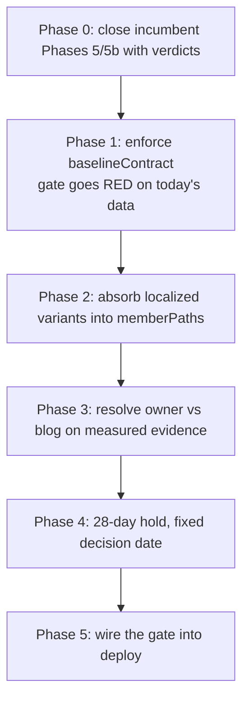

# PRD: GIF Intent Defragmentation

**Status:** Not started
**Created:** 2026-08-25
**Owner:** TBD
**Supersedes:** Phases 5 and 5b of [`gif-intent-recovery-live-signal-verification.md`](../gif-intent-recovery-live-signal-verification.md) (2026-08-04). This PRD **executes that PRD's documented fail branch**. It does not restate its Phases 1-4, which shipped.
**Source data:** GSC exports 2026-08-25 — 14-day gate window 2026-08-09→2026-08-22 vs the incumbent's locked pre-collapse baseline 2026-07-05→2026-07-18

`Complexity: 6 → MEDIUM mode` (touches 6-10 files +2, complex ownership/redirect state +2, external API integration for the gate +1, production release gating +1)

---

## Incumbent Census

`docs/PRDs/gif-intent-recovery-live-signal-verification.md` is the live owner of GIF-intent work. Its Phases 1-4 shipped: redirects are live, the sitemap signal deployed, indexing was requested. Its **Phase 5 recovery gate** was scheduled for ~2026-08-29 and locked its thresholds on 2026-08-04. Enough complete GSC days now exist to run it.

**This PRD is not a parallel plan.** Creating a second live GIF plan would leave two implementations of one decision, which is how the first consolidation ran unmeasured for six weeks. Phases 5 and 5b of the incumbent are closed out by this document's verdict below, and the incumbent is updated in Phase 0.

### Phase 5 verdict — run 2026-08-25 over 2026-08-09→2026-08-22 (14 complete days)

| #   | Incumbent threshold                                                                                        | Locked target                 | Measured                                                                                                                                                            | Verdict                  |
| --- | ---------------------------------------------------------------------------------------------------------- | ----------------------------- | ------------------------------------------------------------------------------------------------------------------------------------------------------------------- | ------------------------ |
| 1   | Legacy `/format-scale/gif-upscale-*` rows **absent** from the `gif upscaler` and `upscale gif` page-splits | absent                        | **present in both** — `/format-scale/gif-upscale-16x` at pos 6.9 (`gif upscaler`) and pos 8.1 (`upscale gif`); `/pt/format-scale/gif-upscale-4x` at pos 7.2 and 6.1 | **FAIL**                 |
| 2   | Owner share of combined GIF-intent clicks                                                                  | ≥ 80% (from 17.6%)            | **66.7%** (30 of 45)                                                                                                                                                | **FAIL**                 |
| 3   | Combined GIF-intent clicks                                                                                 | ≥ 300 (from 410 pre-collapse) | **45**                                                                                                                                                              | **FAIL**                 |
| 4   | Owner average position                                                                                     | ≤ 8.0 (from 19.11)            | **7.90**                                                                                                                                                            | **PASS — but see below** |
| 5   | `gif upscaler` `pageCount`                                                                                 | ≤ 3 (from 5)                  | **6**                                                                                                                                                               | **FAIL**                 |

**Negative control (required by the incumbent):** the same thresholds run against the pre-deploy export fail #2, #3, and #4, and the pre-collapse window passes #3 (410 ≥ 300) while failing #2 and #5. The gate discriminates between the two states; it is not passing or failing everything uniformly.

### Threshold 4 is a false pass — do not act on it

Owner average position reads 7.90, which looks like recovery. It is not. Position is impression-weighted, and the owner's **query mix changed underneath the metric**:

| Owner query            | Pre (07-05→07-18)                        | Now (08-09→08-22)                    |
| ---------------------- | ---------------------------------------- | ------------------------------------ |
| `gif upscaler`         | 668 imp / 32 clicks / **pos 5.6**        | 48 imp / 2 clicks / **pos 13.9**     |
| `gif quality enhancer` | 485 imp / 31 clicks / **pos 7.6**        | not in top 8                         |
| `upscale gif`          | 365 imp / 7 clicks / **pos 6.9**         | 40 imp / 0 clicks / **pos 16.1**     |
| `gif enhancer`         | 315 imp / 15 clicks / **pos 8.0**        | not in top 8                         |
| `enhance gif`          | 237 imp / 3 clicks / **pos 7.8**         | 15 imp / 0 clicks / **pos 32.3**     |
| **Totals**             | **115 queries · 215 clicks · 3,564 imp** | **65 queries · 10 clicks · 426 imp** |

The owner lost **44% of its query footprint, 95% of its clicks, and 88% of its impressions.** Every head query it used to rank 5th-8th for, it now ranks 14th-32nd for. The 7.90 average survives only because the surviving impressions are long-tail queries like `upscale gif quality` (pos 7.9) and `gif quality enhancer 4k` (pos 8.0) that were too small to matter before.

This is the same impression-weighted-mix artifact that made sitewide position look like it fell from 10.7 to 19.7. It is addressed as tooling in [`seo-reporting-signal-hygiene.md`](./seo-reporting-signal-hygiene.md); here it is the reason not to declare victory.

### Where the head intent went

`/blog/gif-upscaler` — a page nobody consolidated — now holds almost exactly the positions the owner lost:

| Query          | Blog post, now                   | Owner, pre-collapse           |
| -------------- | -------------------------------- | ----------------------------- |
| `gif upscaler` | 232 imp / 6 clicks / **pos 5.4** | 668 imp / 32 clicks / pos 5.6 |
| `upscale gif`  | 138 imp / 2 clicks / **pos 7.4** | 365 imp / 7 clicks / pos 6.9  |

Blog post total, now: 59 queries · 11 clicks · 671 impressions. It out-earns the designated owner on both head queries and in total.

### Named cause (the incumbent's fail branch requires one)

The incumbent's Phase 5 says: _"the recheck report must name a specific cause (redirect not consolidated in-index, owner content mismatch for GIF intent, or ongoing localized cannibalization)."_

**Cause: index-level fragmentation, from all three listed sources at once.**

Seven URLs currently compete for `gif upscaler`, three weeks after the redirects went live:

| URL                               | Live status                           | Ranks for `gif upscaler`                |
| --------------------------------- | ------------------------------------- | --------------------------------------- |
| `/blog/gif-upscaler`              | 200, never in the cluster             | **pos 5.4** — the winner                |
| `/format-scale/gif-upscale-16x`   | **301** → owner                       | pos 6.9 — a redirect Google still ranks |
| `/pt/format-scale/gif-upscale-4x` | localized, **never in `memberPaths`** | pos 7.2                                 |
| `/formats/upscale-gif-images`     | 200, the designated owner             | pos 13.9                                |
| `/es/format-scale/gif-upscale-2x` | localized, never in `memberPaths`     | pos 32.8                                |
| `/format-scale/gif-upscale-4x`    | **301** → owner                       | pos 5.0 (2 imp)                         |

`gif upscaler` `pageCount` rose from 5 (recorded 2026-08-04) to **6**. The consolidation was supposed to reduce it to ≤3. `lib/seo/intent-ownership.ts` lists four English `memberPaths` and no localized variants, so `/pt/format-scale/gif-upscale-4x` and `/es/format-scale/gif-upscale-2x` were never covered and are now outranking the owner they were meant to feed.

Total intent volume across all seven URLs is ~1,100 impressions per 14 days against 3,564 for the owner alone pre-collapse. Fragmentation did not redistribute the traffic — it destroyed most of it.

**What the evidence does not support:** a content rewrite of the owner as the primary fix. The owner's problem is that six other URLs — one of them the site's own blog post, two of them 301s Google has not honored, two of them localized URLs the cluster never named — are absorbing its intent. Reshaping copy on a page that is fragmented six ways is treating the symptom.

---

## 1. Context

**Problem:** Three weeks after the GIF consolidation shipped, seven URLs still compete for `gif upscaler`, two of them 301 redirects and two of them localized variants the cluster never covered; the designated owner has lost 95% of its clicks and 44% of its query footprint to its own blog post.

**Files analyzed:**

- `lib/seo/intent-ownership.ts` (`INTENT_CLUSTERS`, `memberPaths`, `primaryKeywordOwners`, `baselineContract`)
- `app/seo/data/formats.json`, `app/seo/data/format-scale.json`
- `middleware.ts` (cluster redirect application, locale routing)
- `scripts/seo/measure-cluster.ts` (`yarn seo:measure:cluster`)
- `tests/unit/seo/gif-intent-consolidation.unit.spec.ts`, `intent-ownership.unit.spec.ts`, `measure-cluster.unit.spec.ts`
- `docs/PRDs/gif-intent-recovery-live-signal-verification.md`
- `docs/SEO/reports/gsc-homepage-gif-recovery-2026-08-04.md`, `seo-growth-plan-2026-08-22.md`

**Current behavior:**

- Redirects work exactly as coded: `/format-scale/gif-upscale-{2x,4x,8x,16x}` return `301` to the owner; the owner returns `200` and self-canonicals. Verified live 2026-08-25.
- Google has not honored them in-index after three weeks — the 301'd URLs still receive impressions and clicks.
- Localized `/{locale}/format-scale/gif-upscale-*` URLs are absent from `memberPaths` and are ranking.
- `/blog/gif-upscaler` is outside the cluster entirely and now wins the head queries.
- The cluster's `baselineContract` floor of 847 clicks has never been compared against live data by any automated gate.

---

## 2. Solution

**Approach:**

- Close the incumbent PRD's open gates honestly first, so the record matches reality.
- Eliminate fragmentation before touching copy: bring localized variants into the cluster, and resolve the owner-versus-blog conflict on measured evidence rather than on which page was designated first.
- Let Google's revealed preference decide the owner. `/blog/gif-upscaler` reached pos 5.4 without help; the pSEO owner fell to 13.9 with the full weight of four redirects behind it.
- Enforce the `baselineContract` that already exists, so the next consolidation cannot bleed unmeasured.



**Key decisions:**

- [ ] **Do not un-redirect the English scale URLs.** They are 301s Google is slowly digesting; reversing them is a third migration in two months and would re-fragment what little has consolidated.
- [ ] **Localized variants join `memberPaths`.** They are the clearest defect — URLs the cluster was supposed to own, outranking the owner, because nobody listed them.
- [ ] **Owner selection is decided by Phase 3's measurement, not by precedent.** The decision rule is fixed in advance below.
- [ ] Copy reshaping is deliberately deferred to Phase 3's fail branch. Fragmentation is the measured cause; copy is a hypothesis.

**Data changes:** `memberPaths` membership and JSON field values. No schema, no migration.

---

## Integration Ledger

| #   | New thing                                   | Live caller (`file:line`, non-test)                                         | Replaces                               | Old path removed?               | Negative control                                   |
| --- | ------------------------------------------- | --------------------------------------------------------------------------- | -------------------------------------- | ------------------------------- | -------------------------------------------------- |
| 1   | Phase 5/5b verdicts recorded                | `docs/PRDs/gif-intent-recovery-live-signal-verification.md` (TBD lines)     | 69 unchecked boxes and an unrun gate   | incumbent's Phases 5/5b closed  | n/a — documentation reconciliation                 |
| 2   | `yarn seo:gate:cluster`                     | `package.json` (TBD); `scripts/deploy/deploy.sh` (TBD) in Phase 5           | the unenforced `baselineContract`      | n/a                             | run on 2026-08-25 data → must exit **non-zero**    |
| 3   | Localized member paths in the `gif` cluster | `lib/seo/intent-ownership.ts` (TBD) — read by middleware, sitemap, hreflang | English-only `memberPaths`             | replaced in place               | remove a locale → its redirect test fails          |
| 4   | Resolved single owner for `gif upscaler`    | `lib/seo/intent-ownership.ts` (TBD) `primaryKeywordOwners`                  | split ownership between owner and blog | loser 301s to winner in Phase 3 | assign the keyword to both → uniqueness test fails |
| 5   | Post-consolidation outcome assertion        | `tests/unit/seo/gif-intent-consolidation.unit.spec.ts` (TBD)                | redirect-only assertions               | extended, not deleted           | stub a below-floor measurement → test fails        |

### Reachability

**How will this feature be reached?**

- [x] Entry point: organic Google visitors on GIF tool queries; plus the deploy pipeline for the gate
- [x] Pre-existing files EDITED: `lib/seo/intent-ownership.ts`, `app/seo/data/*.json`, `tests/unit/seo/gif-intent-consolidation.unit.spec.ts`, `package.json`, `scripts/deploy/deploy.sh`, the incumbent PRD
- [x] Registration: `INTENT_CLUSTERS` is already consumed by middleware, data loading, sitemap, and hreflang — one edit propagates to all four

**Is this user-facing?**

- [x] YES → users searching GIF tool queries reach a different, single URL. If Phase 3 selects the blog, the pSEO owner 301s to it; if it selects the pSEO page, the blog 301s. Either way one page, not six.

**Full flow:**

1. A user searches `gif upscaler`.
2. Triggers: the SERP result for whichever GIF URL Google ranks.
3. Reaches the change via: `memberPaths` and `primaryKeywordOwners` in `lib/seo/intent-ownership.ts`, applied by middleware redirects and sitemap generation.
4. Result observable in: `gif upscaler` `pageCount`, owner query footprint, and `yarn seo:measure:cluster --cluster=gif`.

**What does this replace?**

- [x] Replaces: English-only `memberPaths` → replaced Phase 2
- [x] Replaces: de-facto split ownership between the pSEO owner and the blog → resolved Phase 3, loser 301s to winner in the same phase
- [x] Replaces: the unenforced `baselineContract` → enforced Phase 1, wired Phase 5

---

## 4. Execution Phases

#### Phase 0: Close the incumbent's open gates — the written record matches the measurement

**Files (max 5):**

- `docs/PRDs/gif-intent-recovery-live-signal-verification.md` - EDIT: record the Phase 5 verdict table above; mark Phase 5 **FAILED** with the named cause; mark Phase 5b P1 **FAILED**; point both at this PRD
- `docs/SEO/reports/gif-intent-gate-2026-08-25.md` - NEW: the pasted gate run and the query-footprint tables
- `docs/SEO/maintenance/seo-changes-backlog.md` - EDIT: append the verdict entry

**Implementation:**

- [ ] Transcribe the Phase 5 verdict, including that threshold 4 is a **false pass** and why.
- [ ] **Phase 5b P1 verdict:** `how to fix pixelated photos` was given a pass bar of CTR ≥ 0.50% by decision date 2026-08-13. Measured over 90 days: **168,153 impressions, 3 clicks, CTR 0.0018%** — 89% desktop, 27% Brazil. The incumbent's own escalation applies verbatim: _"reclassify as a structurally zero-click query and stop spending on it."_ Record that verdict and hand the mechanism to [`seo-reporting-signal-hygiene.md`](./seo-reporting-signal-hygiene.md) Phase 2.
- [ ] Leave the incumbent's Phases 6 and 7 (Topaz snippet, `imgupscaler`) untouched and open — they are unrelated and out of scope here.
- [ ] Do not tick any incumbent box that was not actually verified. An unrun gate is recorded as unrun.

**Wiring:**

- [ ] Caller edited: the incumbent PRD now points to this one; no orphan plan is left claiming ownership
- [ ] Registration: n/a
- [ ] Old path: incumbent Phases 5 and 5b **closed**, not left dangling
- [ ] Ledger rows filled: #1

**Tests Required:** none — documentation reconciliation. Verified by the Phase 1 gate producing the same numbers recorded here.

**Revert check:** n/a for this phase; Phase 1's gate is the executable proof of the same claim.

**User Verification:**

- Action: read the incumbent PRD's Phase 5 section
- Expected: it states FAILED, names the cause, and links here — no reader can mistake it for pending

---

#### Phase 1: Make the existing contract fail — the gate reports the collapse before anything changes

Ships a **red** gate on purpose. Its job is to prove it can detect a failure that has been running since 2026-07-19. A gate first observed green proves nothing.

**Files (max 5):**

- `scripts/seo/measure-cluster.ts` - EDIT: add `--gate` mode exiting non-zero below `baselineContract.minimumClicks`
- `package.json` - EDIT: add `seo:gate:cluster`
- `tests/unit/seo/measure-cluster.unit.spec.ts` - EDIT: cover both exit codes

**Implementation:**

- [ ] Add `--gate` to the existing CLI (it already parses `--cluster`, `--window`, `--baseline`, `--out` at `scripts/seo/measure-cluster.ts:287`).
- [ ] Have the gate measure the **whole cluster including localized variants and the blog post**, not just the four English members — otherwise it will report a healthy owner while the intent is fragmented, which is exactly today's failure mode.
- [ ] Do **not** lower `minimumClicks` to make it pass. 847 is the contract.

**Wiring:**

- [ ] Caller edited: `package.json` registers `seo:gate:cluster`
- [ ] Registration: npm script; deploy wiring lands in Phase 5, once the gate can plausibly go green
- [ ] Old path: n/a — the contract had no enforcement path
- [ ] Ledger rows filled: #2

**Tests Required:**

| Test File                                     | Test Name                                                                | Assertion                                                           | Negative control (must be observed red)                                       |
| --------------------------------------------- | ------------------------------------------------------------------------ | ------------------------------------------------------------------- | ----------------------------------------------------------------------------- |
| `tests/unit/seo/measure-cluster.unit.spec.ts` | `should exit non-zero when cluster clicks fall below the baseline floor` | exit `1` for a 90-click fixture against an 847 floor                | feed a 900-click fixture → must exit `0`, proving it is not hardcoded to fail |
| `tests/unit/seo/measure-cluster.unit.spec.ts` | `should exit zero when cluster clicks meet the floor`                    | exit `0`                                                            | drop the fixture below the floor → must fail                                  |
| `tests/unit/seo/measure-cluster.unit.spec.ts` | `should count localized and blog URLs in the cluster measurement`        | `/pt/format-scale/gif-upscale-4x` and `/blog/gif-upscaler` included | measure English members only → test fails                                     |

**Revert check:** removing `--gate` handling turns all three tests red.

**User Verification:**

- Action: `yarn seo:gate:cluster --cluster=gif --window=2026-07-26:2026-08-22`
- Expected: **exits non-zero**, printing measured clicks against the 847 floor. Paste it — this is the baseline evidence.

---

#### Phase 2: Absorb the localized variants — the cluster covers every URL it was meant to own

Proved on the **real production subject**: `/pt/format-scale/gif-upscale-4x`, which ranks **pos 7.2 for `gif upscaler`** and **pos 6.1 for `upscale gif`**, ahead of the designated owner on both. Not a synthetic locale.

**Files (max 5):**

- `lib/seo/intent-ownership.ts` - EDIT: extend the `gif` cluster's `memberPaths` to cover `/{locale}/format-scale/gif-upscale-*` for every supported locale
- `middleware.ts` - EDIT if locale-prefixed member matching is not already derived from `memberPaths`
- `tests/unit/seo/gif-intent-consolidation.unit.spec.ts` - EDIT: extend the existing 301 assertions across locales
- `app/sitemap-format-scale.xml/route.ts` - EDIT: exclude the newly-absorbed localized URLs

**Implementation:**

- [ ] Prefer deriving locale members from the English list over hand-listing 24 paths — `INTENT_CLUSTERS` is documented as the single source that middleware, data loading, sitemap, and hreflang all read, and a hand-list drifts.
- [ ] The existing test file already covers `/es/format-scale/gif-upscale-16x`, so localized collapse is partially implemented — establish exactly which locales are covered today before adding, and do not duplicate.
- [ ] Leave `/es/formats/upscale-gif-images` alone. It is a localized copy of the **owner**, not a member, and it was one of the few GIF URLs still earning (32 clicks in the week of 2026-08-02).
- [ ] Request indexing for the absorbed URLs and tick their rows in `docs/SEO/maintenance/gsc-request-indexing-backlog.md`.

**Wiring:**

- [ ] Caller edited: `lib/seo/intent-ownership.ts` — middleware, sitemap, and hreflang all read this list
- [ ] Registration: sitemap route excludes the absorbed URLs
- [ ] Old path: localized variants **redirect**; they no longer serve `200` alongside the owner
- [ ] Ledger rows filled: #3

**Tests Required:**

| Test File                                              | Test Name                                                       | Assertion                                 | Negative control (must be observed red)   |
| ------------------------------------------------------ | --------------------------------------------------------------- | ----------------------------------------- | ----------------------------------------- |
| `tests/unit/seo/gif-intent-consolidation.unit.spec.ts` | `should 301 localized GIF scale variants to the English owner`  | `/pt/format-scale/gif-upscale-4x` → `301` | remove `pt` from the cluster → test fails |
| `tests/unit/seo/gif-intent-consolidation.unit.spec.ts` | `should keep serving the localized owner copy`                  | `/es/formats/upscale-gif-images` → `200`  | add it to `memberPaths` → test fails      |
| `tests/unit/seo/sitemap-format-scale.unit.spec.ts`     | `should exclude redirecting localized members from the sitemap` | absent                                    | leave them in → test fails                |

**Revert check:** removing the localized paths from `memberPaths` turns the first test red.

**User Verification:**

- Action: `for l in pt es de fr it ja; do curl -s -o /dev/null -w "$l %{http_code} -> %{redirect_url}\n" "https://myimageupscaler.com/$l/format-scale/gif-upscale-4x"; done`
- Expected: `301` to the owner for every locale

---

#### Phase 3: Resolve owner versus blog — one URL owns `gif upscaler`

**Decision rule, fixed now.** Re-measure over the 14 complete days ending at execution time:

| Measurement                                                                                              | Decision                                                                                                                                                                                                            |
| -------------------------------------------------------------------------------------------------------- | ------------------------------------------------------------------------------------------------------------------------------------------------------------------------------------------------------------------- |
| `/blog/gif-upscaler` outranks `/formats/upscale-gif-images` on **both** `gif upscaler` and `upscale gif` | **Blog becomes the owner.** 301 the pSEO owner to it; move the guide content onto the blog post. Google's revealed preference is the strongest signal available, and it earned pos 5.4 with no redirects behind it. |
| pSEO owner outranks the blog on **both**                                                                 | **pSEO page stays owner.** 301 the blog to it.                                                                                                                                                                      |
| Split                                                                                                    | Hold. Re-measure once at +14 days. Then apply the majority-of-impressions branch.                                                                                                                                   |

Measured 2026-08-09→2026-08-22: blog wins both (5.4 vs 13.9; 7.4 vs 16.1). **On today's data this selects the blog.** Re-measure at execution; do not act on this three-week-old reading if execution slips.

**Files (max 5):**

- `lib/seo/intent-ownership.ts` - EDIT: set `ownerPath` and `primaryKeywordOwners` to the winner; add the loser to `memberPaths`
- `app/seo/data/formats.json` - EDIT: if the blog wins, the pSEO entry becomes non-indexable cluster member; if the pSEO page wins, widen its keywords to the eight measured tool queries
- `content/` blog source for `gif-upscaler` - EDIT: absorb the loser's unique content, so the merge adds substance rather than discarding it
- `tests/unit/seo/gif-intent-consolidation.unit.spec.ts` - EDIT: assert the resolved owner and the loser's 301
- `tests/unit/seo/intent-ownership.unit.spec.ts` - EDIT: `gif upscaler` owned exactly once

**Implementation:**

- [ ] Run the decision measurement and record it before editing anything.
- [ ] Whichever page loses, **301 it to the winner in this same phase.** Leaving both live is the failure that created this PRD.
- [ ] Carry the loser's unique content across. Do not ship a merge that drops the FAQ, `characteristics`, `useCases`, or `bestPractices` already on the pSEO page.
- [ ] Widen `primaryKeywordOwners` beyond the single `upscale gif images` entry to the eight measured tool queries: `gif upscaler`, `gif quality enhancer`, `gif enhancer`, `enhance gif quality`, `upscale gif`, `gif upscaler 4k`, `gif quality enhancer 4k`, `ai upscale gif`. The contract naming one how-to phrase is why the tool queries were never protected.
- [ ] Request indexing for the winner.

**Wiring:**

- [ ] Caller edited: `lib/seo/intent-ownership.ts` — propagates to middleware, sitemap, hreflang
- [ ] Registration: sitemap includes the winner, excludes the loser
- [ ] Old path: the loser **301s** — no two live implementations of GIF tool intent
- [ ] Ledger rows filled: #4, #5

**Tests Required:**

| Test File                                              | Test Name                                                           | Assertion                                   | Negative control (must be observed red)  |
| ------------------------------------------------------ | ------------------------------------------------------------------- | ------------------------------------------- | ---------------------------------------- |
| `tests/unit/seo/gif-intent-consolidation.unit.spec.ts` | `should 301 the losing GIF URL to the resolved owner`               | `301` to winner                             | leave the loser at `200` → test fails    |
| `tests/unit/seo/intent-ownership.unit.spec.ts`         | `should own gif upscaler exactly once`                              | one owner                                   | assign to both → test fails              |
| `tests/unit/seo/gif-intent-consolidation.unit.spec.ts` | `should own every measured GIF tool keyword`                        | all eight present in `primaryKeywordOwners` | drop `gif quality enhancer` → test fails |
| `tests/unit/seo/gif-intent-consolidation.unit.spec.ts` | `should preserve the merged FAQ and use-case content on the winner` | sections present                            | ship the merge without them → test fails |

**Revert check:** reverting `lib/seo/intent-ownership.ts` turns the ownership and redirect tests red.

**User Verification (manual — irreversible within a 28-day window):**

- Action: load the winning URL on a phone; search `gif upscaler` and confirm one MyImageUpscaler result, not several
- Expected: a single GIF upscaler page, tool-first, with the guide content intact below

---

#### Phase 4: Measured 28-day hold — decide on evidence, on a fixed date

**Files:** none. This phase edits no code by design. The PRD stays open until it resolves.

- [ ] Decision date = Phase 3 deploy date + 28 complete days + the 3-day GSC lag.
- [ ] Run `yarn seo:gate:cluster --cluster=gif` and record the result in `docs/SEO/reports/gif-intent-gate-2026-08-25.md`.

**Decision rule (fixed now):**

| Measured cluster clicks, 28d | Action                                                                                                                                       |
| ---------------------------- | -------------------------------------------------------------------------------------------------------------------------------------------- |
| ≥ 400                        | Recovery real. Proceed to Phase 5.                                                                                                           |
| 150-399                      | Partial. Hold one more 28-day window, **once**. Then apply the < 150 branch.                                                                 |
| < 150                        | Defragmentation did not recover the intent. Open a content PRD against the winning URL — and only then is copy the hypothesis worth testing. |

Baseline for comparison: 45 clicks / 14 days at gate time (~90 per 28 days) against the incumbent's locked pre-collapse 410 clicks / 14 days.

**User Verification:**

- Action: `yarn seo:gate:cluster --cluster=gif --window=<decision-28d>`
- Expected: a recorded number and a branch taken, appended to the report

---

#### Phase 5: Wire the gate into the deploy path

**Files (max 5):**

- `package.json` - EDIT: add `seo:gate:cluster` to the SEO gate chain beside `seo:indexation:gate`
- `scripts/deploy/deploy.sh` - EDIT: run the cluster gate pre-deploy
- `tests/unit/seo/intent-ownership.unit.spec.ts` - EDIT: every cluster declares a `baselineContract`
- `docs/SEO/maintenance/seo-changes-backlog.md` - EDIT: append the entry

**Implementation:**

- [ ] A cluster below its floor blocks deploy, matching how `seo:indexation:gate` already behaves in `verify`.
- [ ] The failure message names the cluster, the measured clicks, the floor, and the report path. A gate whose output nobody can act on gets disabled.

**Wiring:**

- [ ] Caller edited: `package.json` and `scripts/deploy/deploy.sh`
- [ ] Registration: deploy pipeline
- [ ] Old path: n/a
- [ ] Ledger rows filled: #2 (completed)

**Tests Required:**

| Test File                                      | Test Name                                                               | Assertion             | Negative control (must be observed red) |
| ---------------------------------------------- | ----------------------------------------------------------------------- | --------------------- | --------------------------------------- |
| `tests/unit/seo/intent-ownership.unit.spec.ts` | `should declare a baseline contract for every intent cluster`           | all clusters have one | add a cluster without one → test fails  |
| `tests/unit/seo/measure-cluster.unit.spec.ts`  | `should name the cluster, measurement, and floor in the failure output` | all three present     | strip the message → test fails          |

**Revert check:** removing the gate from `deploy.sh` turns the wiring assertion red.

---

## 5. Checkpoint Protocol

Automated `prd-work-reviewer` checkpoint after every phase, with the integration audit prompt. **Manual checkpoint additionally required after Phases 2 and 3** — both change what Google sees, and Phase 3 is not reversible inside a 28-day measurement window.

Phase 4 has no code checkpoint. It has a date and a number.

---

## 6. Verification Strategy

### Integration Proof

```bash
# 1. Caller census — cluster membership must be read by live code, not only tests
grep -rn --include='*.ts' --include='*.tsx' "INTENT_CLUSTERS\|memberPaths\|primaryKeywordOwners" . \
  | grep -v node_modules | grep -v '/tests/'
# Expected: hits in middleware, sitemap, and hreflang generation — not just the definition

# 2. Revert check
git stash -- lib/seo/intent-ownership.ts && yarn vitest run tests/unit/seo/gif-intent-consolidation.unit.spec.ts
# Expected: FAIL. Then: git stash pop

# 3. The gate proves itself RED on production data before any fix
yarn seo:gate:cluster --cluster=gif --window=2026-07-26:2026-08-22
# Expected: non-zero exit, ~90 clicks against an 847 floor

# 4. Live fragmentation is actually gone (run after Phase 3, post-recrawl)
for u in /formats/upscale-gif-images /blog/gif-upscaler /format-scale/gif-upscale-16x \
         /pt/format-scale/gif-upscale-4x /es/format-scale/gif-upscale-2x; do
  curl -s -o /dev/null -w "$u %{http_code} -> %{redirect_url}\n" "https://myimageupscaler.com$u"
done
# Expected: exactly one 200; every other URL 301s to it
```

### Baseline to beat

Incumbent's locked pre-collapse baseline (2026-07-05→07-18) and the 2026-08-25 gate reading:

| Metric                                        |   Pre-collapse |                Now (14d) |  Target |
| --------------------------------------------- | -------------: | -----------------------: | ------: |
| Combined GIF-intent clicks / 14d              |            410 |                   **45** |   ≥ 300 |
| Owner query footprint                         |    115 queries |                   **65** |   ≥ 100 |
| Owner clicks / 14d                            |            215 |                   **10** |   ≥ 150 |
| Owner impressions / 14d                       |          3,564 |                  **426** | ≥ 2,500 |
| `gif upscaler` head position (resolved owner) |            5.6 | 13.9 (pSEO) / 5.4 (blog) |   ≤ 6.0 |
| `gif upscaler` `pageCount`                    | 5 (2026-08-04) |                    **6** |     ≤ 3 |
| `yarn seo:gate:cluster --cluster=gif`         |     unenforced |                 non-zero |  exit 0 |

**Do not judge before 28 complete GSC days plus the 3-day lag have elapsed since the Phase 3 deploy.** Judging early measures the pre-change index and reads as failure regardless of truth — the incumbent PRD made this point and it still applies.

---

## 7. Acceptance Criteria

Consumer-scoped:

- [ ] A user searching `gif upscaler` sees exactly one MyImageUpscaler result, and it is the page that owns the intent
- [ ] `gif quality enhancer`, `gif enhancer`, and `enhance gif quality` — currently at 0, 1, and 0 clicks — return to double-digit monthly clicks on the resolved owner
- [ ] No 301'd URL and no localized variant appears in the `gif upscaler` or `upscale gif` page-splits
- [ ] The resolved owner's query footprint returns above 100 queries, from 65
- [ ] A future consolidation that costs a cluster its traffic blocks the next deploy instead of bleeding for six weeks

Binary done checks:

- [ ] All phases complete
- [ ] All specified tests pass
- [ ] `yarn verify` passes
- [ ] All automated checkpoint reviews passed; manual checkpoints passed for Phases 2 and 3
- [ ] Integration Ledger has zero `TBD` cells
- [ ] Revert check passed
- [ ] Every `Replaces` row's old path is deleted or 301ing — GIF tool intent has exactly one live implementation
- [ ] Every gate has a negative control observed failing, **including Phase 1's gate observed red on production data**
- [ ] Incumbent PRD's Phases 5 and 5b are closed with recorded verdicts, not left as unchecked boxes
- [ ] `docs/SEO/maintenance/seo-changes-backlog.md` entry appended
- [ ] `docs/SEO/maintenance/gsc-request-indexing-backlog.md` rows ticked after indexing is requested
