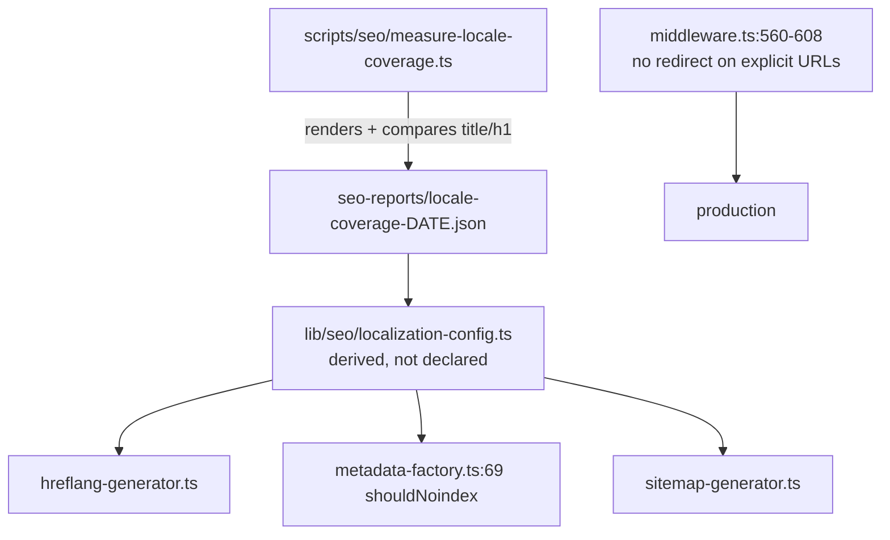

# PRD: Locale Surface Retraction

**Complexity: 3 (10+ files) + 2 (complex state logic — routing) = 5 → MEDIUM mode**

**Source:** `The August 12 Cliff` (GSC triage through 2026-08-23), items 03, 07, 09.
All three were re-verified against production on 2026-08-25. Item 09 reproduces **worse**
than the PDF describes and is upgraded from MEDIUM to the lead phase.

---

## 1. Context

**Problem:** The site publishes seven locale copies of its pSEO matrix. For most
category × locale pairs the body copy is the English original, hreflang declares all seven
translations anyway, and a cookie-driven 307 pulls visitors off explicit English URLs —
including the root.

**Files analyzed:**

- `lib/seo/localization-config.ts`
- `app/seo/data/scale.json`, `app/seo/data/social-media-resize.json`
- `lib/seo/hreflang-generator.ts`, `lib/seo/metadata-factory.ts:56,105-110`
- `middleware.ts:370-400` (`detectLocale`), `:484-521` (`isPSEOPath`), `:560-608` (the redirect)
- `i18n/config.ts:20` (`LOCALE_COOKIE = 'locale'`)

### Verified production behaviour (2026-08-25)

**Item 09 — cookie-driven locale redirect. Confirmed, and it redirects the root.**

```
curl -b "locale=es" -sI https://myimageupscaler.com<path>

/                                 307 -> https://myimageupscaler.com/es
/pricing                          307 -> https://myimageupscaler.com/es/pricing
/how-it-works                     307 -> https://myimageupscaler.com/es/how-it-works
/article/upscale-product-photos   307 -> https://myimageupscaler.com/es/article/upscale-product-photos
```

Mechanism, in order:

1. `middleware.ts:378` — cookie `locale` wins over the requested URL.
2. `middleware.ts:388-396` — with no cookie, `CF-IPCountry` decides. Geo, not the URL.
3. `middleware.ts:566` — `NextResponse.redirect(url)` with **no status argument → 307**,
   a _temporary_ redirect on a crawlable URL.
4. `middleware.ts:574` — the redirect sets `locale` for **one year**, so a single geo-detected
   visit pins every later request, including shared links.

pSEO root paths are exempt (`middleware.ts:518`, `isPSEOPath && !hasLocalePrefix → return null`),
which is why `/scale/2k-upscaler` survives. Everything else — root, `/pricing`, `/blog/*`,
`/article/*` — does not. This is the manufacturing process behind the duplication in items 03 and 07.

**Item 03 — locale folders serve English. Confirmed at the data layer, but the PDF over-generalizes.**

`scale` is listed in `LOCALIZED_CATEGORIES` (`lib/seo/localization-config.ts:14-25`).
`app/seo/data/scale.json` page objects carry these keys and no others:

```
slug, title, metaTitle, metaDescription, h1, intro, primaryKeyword,
secondaryKeywords, lastUpdated, category, resolution, dimensions,
targetUses, benefits, technicalSpecs, faq, relatedScale, relatedTools
```

There is **no translations field of any kind**. `/es/scale/2k-upscaler` renders
`<title>2K Image Upscaler: Convert to 2560x1440</title>` and `<h1>2K Upscaler</h1>` —
English — while emitting eight `hreflang` alternates (en, es, pt, de, fr, it, ja, x-default).

**But translation coverage is uneven, and a blanket retraction would delete real work:**

| URL                                        | Rendered title                                            | Translated? |
| ------------------------------------------ | --------------------------------------------------------- | ----------- |
| `/fr/device-use/mobile-ecommerce-upscaler` | `Agrandisseur d'images e-commerce mobile \| Photos de…`   | **yes**     |
| `/es/scale/2k-upscaler`                    | `2K Image Upscaler: Convert to 2560x1440`                 | no          |
| `/it/tools/ai-image-upscaler`              | `Free AI Image Upscaler — Enlarge Images Online up to 8x` | no          |
| `/ja/free/free-image-upscaler`             | `Free Image Upscaler - Enhance Photos Online`             | no          |
| `/es/guides/how-to-upscale-images`         | `How to Upscale Images with AI - Complete Guide & Tips`   | no          |

`LOCALIZED_CATEGORIES` is a **claim**, not a measurement. Phase 1 replaces it with a measurement.

**Item 07 — the `/en/` mirror. Confirmed, and it is not self-correcting.**

`/en/scale/2k-upscaler` returns **200** with `<link rel="canonical" href="…/scale/2k-upscaler">`.
The canonical is right, so rankings are not split — but Google still crawls it. Against a site
where 73% of discovered URLs go unindexed, this is crawl budget spent on a mirror of the default.
Per the PDF: 30 of the 772 crawled-not-indexed URLs sit under `/en/`, and 892 URLs are parked in
"Alternate page with proper canonical".

`/en/blog?page=43` **does** already 301 to `/blog?page=43`, so a partial `/en/` redirect exists.
It is inconsistent: pSEO `/en/` paths are not redirected. The redirect that does exist mangles the
query string — probed with a cache-buster, `/en/blog?page=43&cb=1` produced
`location: /blog?page=43%3Fcb%3D13058`, folding the second parameter into the first as literal
`%3F`. Fix the encoding while making `/en/` consistent.

### What this costs, from the PDF

- 236 URLs flagged "Duplicate, Google chose different canonical" — almost all `/es/`, `/pt/`, `/de/`, `/fr/`, `/it/`, `/ja/`
- The whole `/es/` subtree earned **29 clicks across 34 pages in 12 days** — about 1% of site traffic
- 892 URLs parked in "Alternate page with proper canonical"
- Google's **Aug 18-20 spam update** targets scaled content abuse. Shipping one English page under
  seven URLs is the textbook definition. Position slipped 18.2 → 20.8 across that window.

---

## 2. Solution

**Approach:**

- **Measure before retracting.** Build one gate that reads the rendered `<title>` and `<h1>` per
  (category, locale) and reports which pairs are genuinely translated. `/fr/device-use/*` is real
  and must survive; `/es/scale/*` is not and must not.
- Retract the untranslated pairs at all three layers **at once** — sitemap, hreflang, and robots.
  Removing a URL from the sitemap while it stays indexable and hreflang-declared changes nothing.
- Stop manufacturing duplicates: never redirect a URL that already names its locale, and never
  redirect the root. Offer a language switcher instead of overriding an explicit request.
- Make `/en/*` consistently 301 to the root equivalent, with correct query preservation.

**Key decisions:**

- Translation status is **derived**, not declared. `LOCALIZED_CATEGORIES` becomes the output of the
  measurement, not a hand-maintained list. This kills the twin-constants failure mode where
  `localization-config.ts` and the data files disagree with nothing tying them.
- The retraction reuses the existing noindex path: `metadata-factory.ts:69` already composes
  `shouldNoindex` from `page.noindex || NOINDEX_CATEGORIES.includes(category) || !shouldSubmit(...)`.
  Add the locale predicate to that same expression. **One owner for the noindex decision.**
- The redirect keeps geo detection for **first-touch on the root only, as a suggestion banner** —
  not as a redirect. Removing detection entirely would lose the language switcher's memory.
- 301, not 307, wherever a redirect survives.

**Data changes:** none. One new committed artifact: `seo-reports/locale-coverage-<date>.json`.



---

## Integration Ledger

| #   | New thing                                                             | Live caller (`file:line`, non-test)                                                                                             | Replaces                                        | Old path removed?                               | Negative control                                                                         |
| --- | --------------------------------------------------------------------- | ------------------------------------------------------------------------------------------------------------------------------- | ----------------------------------------------- | ----------------------------------------------- | ---------------------------------------------------------------------------------------- |
| 1   | `scripts/seo/measure-locale-coverage.ts` + `yarn seo:measure:locales` | `package.json` scripts (TBD)                                                                                                    | the hand-maintained `LOCALIZED_CATEGORIES` list | list becomes derived in Phase 2                 | force `/fr/device-use/*` to compare English-identical → it must be reported untranslated |
| 2   | `isTranslatedPair(category, locale)`                                  | `lib/seo/metadata-factory.ts:69` (`shouldNoindex`); `lib/seo/hreflang-generator.ts` (TBD); `lib/seo/sitemap-generator.ts` (TBD) | `isLocalizedCategory` declared form             | replaced in Phase 2                             | make it return `true` for everything → the retraction test goes red                      |
| 3   | Explicit-URL redirect suppression                                     | `middleware.ts:560-608` (EDIT)                                                                                                  | cookie/geo redirect on locale-less paths        | the redirect branch is deleted, not flagged off | re-enable it → the `curl -b "locale=es" /` test goes red                                 |
| 4   | `/en/*` → root 301 with query preservation                            | `lib/seo/legacy-redirects.ts` or `middleware.ts` (TBD)                                                                          | the partial, query-mangling `/en/blog` rule     | replaced in Phase 4                             | `/en/scale/2k-upscaler` still returning 200 → red                                        |
| 5   | Locale retraction e2e guard                                           | `tests/e2e/seo-guard.e2e.spec.ts` (TBD)                                                                                         | nothing — new guard                             | n/a                                             | add an untranslated pair back to the sitemap → red                                       |

### Reachability

**How will this feature be reached?**

- Entry point: every HTTP request passes `middleware.ts`; every pSEO render calls
  `metadata-factory.generateMetadata`; every sitemap route calls `sitemap-generator`.
- Pre-existing files EDITED: `middleware.ts`, `lib/seo/localization-config.ts`,
  `lib/seo/metadata-factory.ts`, `lib/seo/hreflang-generator.ts`, `lib/seo/sitemap-generator.ts`,
  `package.json`.
- Registration: the measurement script registers as a `package.json` script; the predicate is
  consumed by three pre-existing live modules.

**Is this user-facing?** Yes, in one respect: a visitor with a stored locale preference will stop
being redirected off the URL they clicked. Phase 3 must ship the language switcher affordance in
the same phase, or the change is a regression for multilingual users.

**Full flow:**

1. A Spanish-preferring visitor clicks a shared link to `https://myimageupscaler.com/pricing`.
2. Request reaches `middleware.ts` locale routing.
3. New behavior at `middleware.ts:~560`: the path names no locale and the visitor asked for it
   explicitly → **serve it**, and surface the switcher.
4. Observable in: `curl -b "locale=es" -sI /pricing` returning `200`, not `307`.

**What does this replace?** The declared `LOCALIZED_CATEGORIES` list and the cookie/geo redirect
branch. Both deleted, not deprecated.

---

## 4. Execution Phases

#### Phase 1: Measure translation coverage — the claim is checked against the rendered page

**Files (max 5):**

- `scripts/seo/measure-locale-coverage.ts` — NEW
- `package.json` — EDIT: add `seo:measure:locales`
- `seo-reports/locale-coverage-2026-08-25.json` — NEW artifact
- `tests/unit/seo/locale-coverage.unit.spec.ts` — NEW

**Implementation:**

- [ ] For every (category, locale) in `ALL_CATEGORIES × SUPPORTED_LOCALES`, sample N slugs, fetch
      the rendered locale URL and its English root equivalent, extract `<title>` and the first `<h1>`.
- [ ] Classify: `translated` (differs from English), `english-mirror` (identical), `soft-404`
      (title equals the generic `MyImageUpscaler - Image Upscaling & Enhancement`), `missing` (non-200).
- [ ] Emit `{ generatedAt, pairs: [{ category, locale, sampled, translated, englishMirror, soft404 }] }`.
- [ ] **Do not change any config in this phase.** The output is the input to Phase 2.

**Wiring:**

- [ ] Caller edited: `package.json`
- [ ] Old path: n/a — this phase only measures
- [ ] Ledger rows filled: #1

**Tests Required:**

| Test File                                     | Test Name                                                     | Assertion                                                           | Negative control (observed red)                                                                                                   |
| --------------------------------------------- | ------------------------------------------------------------- | ------------------------------------------------------------------- | --------------------------------------------------------------------------------------------------------------------------------- |
| `tests/unit/seo/locale-coverage.unit.spec.ts` | `should classify an English-identical page as english-mirror` | fixture with matching titles → `english-mirror`                     | feed it the real `/fr/device-use/*` pair → must classify `translated`; if both classify the same the comparison is self-comparing |
| `tests/unit/seo/locale-coverage.unit.spec.ts` | `should classify the generic homepage title as soft-404`      | title `MyImageUpscaler - Image Upscaling & Enhancement` → `soft404` | change the fixture title → no longer soft404                                                                                      |
| `tests/unit/seo/locale-coverage.unit.spec.ts` | `should compare against the English page, not against itself` | assert the two fetched URLs differ                                  | point both sides at the same URL → red                                                                                            |

**Revert check:** delete the artifact → Phase 2's derived config throws rather than falling back to
the old hardcoded list.

**Expected finding, from the 2026-08-25 spot check** — record the real numbers, do not assume these:
`fr/device-use` translated; `es/scale`, `it/tools`, `ja/free`, `es/guides` english-mirror;
`es/platform-format`, `de/use-cases`, `es/alternatives` soft-404.

---

#### Phase 2: Retract the untranslated pairs at all three layers simultaneously

**Files:**

- `lib/seo/localization-config.ts` — EDIT: `LOCALIZED_CATEGORIES` derived from the artifact;
  export `isTranslatedPair(category, locale)`
- `lib/seo/metadata-factory.ts` — EDIT: add the pair predicate to `shouldNoindex` at line 69
- `lib/seo/hreflang-generator.ts` — EDIT: emit alternates only for translated pairs
- `lib/seo/sitemap-generator.ts` — EDIT: drop untranslated locale entries
- `tests/unit/seo/locale-retraction.unit.spec.ts` — NEW

**Implementation:**

- [ ] `isTranslatedPair` reads the coverage artifact. A pair classified `english-mirror` or
      `soft404` is **not** translated.
- [ ] Extend `metadata-factory.ts:69`:
      `page.noindex === true || NOINDEX_CATEGORIES.includes(category) || !shouldSubmit(...) || !isTranslatedPair(category, locale)`
- [ ] hreflang must stop declaring untranslated locales. An `hreflang` pointing at an English mirror
      tells Google a translation exists when it does not — the specific signal the spam update targets.
- [ ] **Delete** the hand-maintained `LOCALIZED_CATEGORIES` array literal. Leaving it beside the
      derived value is the twin-constants anti-pattern; the two will drift and nothing will notice.

**Wiring:**

- [ ] Callers edited: `metadata-factory.ts:69`, `hreflang-generator.ts`, `sitemap-generator.ts`
- [ ] Old path: the declared array is **deleted**
- [ ] Ledger rows filled: #2

**Tests Required:**

| Test File                                         | Test Name                                                       | Assertion                                                      | Negative control                                                                                                                             |
| ------------------------------------------------- | --------------------------------------------------------------- | -------------------------------------------------------------- | -------------------------------------------------------------------------------------------------------------------------------------------- |
| `tests/unit/seo/locale-retraction.unit.spec.ts`   | `should noindex an english-mirror locale page`                  | `generateMetadata(page, 'scale', 'es').robots.index === false` | **run at `HEAD~1`: must PASS as `index: true`.** If it already returns false, the assertion is measuring something that predates this change |
| `tests/unit/seo/locale-retraction.unit.spec.ts`   | `should keep a genuinely translated pair indexable`             | `('device-use','fr').robots.index === true`                    | flip the artifact entry to `english-mirror` → red                                                                                            |
| `tests/unit/seo/locale-retraction.unit.spec.ts`   | `should not declare hreflang for an untranslated locale`        | `alternates.languages` has no `es` for `scale`                 | restore the declared list → red                                                                                                              |
| `tests/unit/seo/sitemap-eligibility.unit.spec.ts` | `should exclude untranslated locale URLs` (extend pre-existing) | `/es/scale/*` absent                                           | remove the predicate → red                                                                                                                   |

**Revert check:** `git stash` the predicate → `should noindex an english-mirror locale page` fails.

**User Verification:**

- Action: `curl -s https://myimageupscaler.com/es/scale/2k-upscaler | grep -o 'name="robots"[^>]*'`
- Expected: `content="noindex, follow"`. Baseline today: `content="index, follow, …"`.

---

#### Phase 3: Stop redirecting explicit URLs — a shared English link opens in English

**Files:**

- `middleware.ts` — EDIT: remove the locale-less redirect branch (`:560-580`)
- `client/components/layout/` language switcher — EDIT: surface it when the stored preference
  differs from the served locale
- `tests/unit/seo/middleware-redirects.unit.spec.ts` — EDIT (pre-existing)
- `tests/e2e/seo-guard.e2e.spec.ts` — EDIT

**Implementation:**

- [ ] A request whose path names no locale is English by definition. Serve it. Do not consult the
      cookie, `CF-IPCountry`, or `Accept-Language` to decide whether to redirect.
- [ ] Keep `detectLocale` for **choosing what the switcher suggests**, not for redirecting.
- [ ] Any redirect that survives elsewhere uses **301**, not the current unspecified-status 307
      (`middleware.ts:566`).
- [ ] The switcher must land in this phase. Removing the redirect without it strands the Spanish
      visitor on English with no visible way back — a real regression, not a rounding error.

**Wiring:**

- [ ] Caller edited: `middleware.ts` — the redirect branch is **deleted**, not gated behind a flag
- [ ] Ledger rows filled: #3

**Tests Required:**

| Test File                                          | Test Name                                                                       | Assertion                             | Negative control                                        |
| -------------------------------------------------- | ------------------------------------------------------------------------------- | ------------------------------------- | ------------------------------------------------------- |
| `tests/unit/seo/middleware-redirects.unit.spec.ts` | `should not redirect the root when a locale cookie is present`                  | `locale=es` + `/` → 200               | **run at `HEAD~1`: must FAIL** (today it 307s to `/es`) |
| `tests/unit/seo/middleware-redirects.unit.spec.ts` | `should not redirect /pricing on a geo header`                                  | `CF-IPCountry: ES` + `/pricing` → 200 | restore the branch → red                                |
| `tests/unit/seo/middleware-redirects.unit.spec.ts` | `should use 301 for any surviving locale redirect`                              | no 307 in the redirect table          | emit 307 → red                                          |
| `tests/e2e/seo-guard.e2e.spec.ts`                  | `should offer the switcher when the stored locale differs from the served page` | switcher visible                      | remove the switcher → red                               |

**Revert check:** restore the redirect branch → the root-redirect test fails.

**User Verification (manual — user-facing):**

- Action: set the site to Spanish, then open `https://myimageupscaler.com/pricing` in a new tab
- Expected: the English pricing page loads, with a visible offer to switch to Spanish.
  Today it silently becomes `/es/pricing`.

---

#### Phase 4: Collapse the `/en/` mirror — one URL per English page

**Files:**

- `lib/seo/legacy-redirects.ts` or `middleware.ts` — EDIT: `/en/*` → `/*`, 301, query preserved
- `lib/seo/sitemap-generator.ts` — EDIT: stop emitting `/en/` entries
- `lib/seo/hreflang-generator.ts` — EDIT: `hreflang="en"` points at the root, never `/en/`
- `tests/unit/seo/en-mirror.unit.spec.ts` — NEW

**Implementation:**

- [ ] 301 every `/en/<rest>` to `/<rest>`, preserving the full query string.
      The current `/en/blog?page=43` rule mangles a second parameter into literal `%3F` —
      fix the encoding, do not copy it.
- [ ] Stop generating the mirror at source: `hreflang="en"` already resolves to the root
      (verified on `/es/scale/2k-upscaler`), so nothing should be linking `/en/` internally.
      Confirm with `yarn validate:seo:internal-links`.
- [ ] Guard the single-hop rule: `/en/scale/2k-upscaler` → `/scale/2k-upscaler` in one hop,
      never chaining through the Phase 3 locale logic.

**Wiring:**

- [ ] Caller edited: the redirect table already feeds `next.config` / `middleware`
- [ ] Old path: the partial, query-mangling `/en/blog` handling is **replaced**
- [ ] Ledger rows filled: #4, #5

**Tests Required:**

| Test File                               | Test Name                                                 | Assertion                                    | Negative control                               |
| --------------------------------------- | --------------------------------------------------------- | -------------------------------------------- | ---------------------------------------------- |
| `tests/unit/seo/en-mirror.unit.spec.ts` | `should 301 /en/scale/2k-upscaler to the root equivalent` | one hop, 301                                 | **run at `HEAD~1`: must FAIL** (today it 200s) |
| `tests/unit/seo/en-mirror.unit.spec.ts` | `should preserve multiple query parameters`               | `/en/blog?page=43&x=1` → `/blog?page=43&x=1` | assert against the current mangled form → red  |
| `tests/unit/seo/en-mirror.unit.spec.ts` | `should not chain through locale routing`                 | `hops === 1`                                 | reintroduce the chain → red                    |
| `tests/e2e/seo-guard.e2e.spec.ts`       | `should emit no /en/ URLs in any sitemap`                 | zero matches across all sub-sitemaps         | add one back → red                             |

**Revert check:** `git stash` → the `/en/` 301 test fails.

**User Verification:**

- Action: `curl -sIL "https://myimageupscaler.com/en/scale/2k-upscaler"`
- Expected: `301` then `200` at `/scale/2k-upscaler`, `hops=1`.

---

## 5. Checkpoint Protocol

`prd-work-reviewer` after every phase, with the standard integration audit plus:

> 7. Confirm each retraction test was run at `HEAD~1` and **failed there**. Every gate in Phases 2-4
>    asserts a behavior the current build does not have; a gate that is green at `HEAD~1` is measuring
>    something else and the phase FAILS.
> 8. Confirm the coverage artifact is the only source of translation truth — grep for any surviving
>    hardcoded `LOCALIZED_CATEGORIES` array literal.

Manual checkpoint required for **Phase 3** (user-facing switcher behavior).

---

## 6. Verification Strategy

### Integration Proof

```bash
# 1. Caller census — the predicate must be read by live SEO modules, not only by tests
grep -rn "isTranslatedPair" --include='*.ts' --include='*.tsx' lib/ app/ client/ middleware.ts | grep -v spec
# Expected: hits in metadata-factory.ts, hreflang-generator.ts, sitemap-generator.ts

# 2. Incumbent check — the declared list must be gone, not merely unused
grep -rn "LOCALIZED_CATEGORIES *= *\[" --include='*.ts' lib/
# Expected: no output (the value is derived)

# 3. Revert check
git stash && npx vitest run tests/unit/seo/locale-retraction.unit.spec.ts tests/unit/seo/middleware-redirects.unit.spec.ts
# Expected: FAIL. Then: git stash pop

# 4. Stale-artifact control
mv seo-reports/locale-coverage-*.json /tmp/ && npx vitest run tests/unit/seo/locale-retraction.unit.spec.ts
# Expected: FAIL loudly with a named message. Then restore.

# 5. Live proof — paste raw output
curl -b "locale=es" -s -o /dev/null -w "root:     %{http_code} -> %{redirect_url}\n" -A "Mozilla/5.0" https://myimageupscaler.com/
curl -b "locale=es" -s -o /dev/null -w "pricing:  %{http_code} -> %{redirect_url}\n" -A "Mozilla/5.0" https://myimageupscaler.com/pricing
curl -sL -o /dev/null -w "en-mirror: final=%{http_code} hops=%{num_redirects} url=%{url_effective}\n" -A "Mozilla/5.0" https://myimageupscaler.com/en/scale/2k-upscaler
curl -s -A "Mozilla/5.0" https://myimageupscaler.com/es/scale/2k-upscaler | grep -o 'name="robots"[^>]*'
curl -s -A "Mozilla/5.0" https://myimageupscaler.com/es/scale/2k-upscaler | grep -o 'hreflang="[a-z-]*"' | sort -u
curl -s -A "Mozilla/5.0" https://myimageupscaler.com/fr/device-use/mobile-ecommerce-upscaler | grep -o '<title>[^<]*</title>'
# Expected: root 200; pricing 200; en-mirror hops=1 final=200;
#           es/scale robots noindex; hreflang set reduced to translated locales only;
#           fr/device-use STILL French and STILL indexable
```

### Baseline to beat (recorded 2026-08-25, pre-change)

```
curl -b "locale=es" /                     307 -> /es
curl -b "locale=es" /pricing              307 -> /es/pricing
curl -b "locale=es" /article/upscale-…    307 -> /es/article/upscale-…
/en/scale/2k-upscaler                     200 (canonical -> /scale/2k-upscaler)
/es/scale/2k-upscaler                     200, English title + English h1, robots index,follow
  hreflang emitted                        en, es, pt, de, fr, it, ja, x-default  (8)
/fr/device-use/mobile-ecommerce-upscaler  200, FRENCH title  <- must survive
app/seo/data/scale.json translations      none (field absent)
GSC "Duplicate, Google chose different canonical"   236 URLs
GSC "Alternate page with proper canonical"          892 URLs
/es/ subtree, 12 days                     29 clicks across 34 pages
```

---

## 7. Acceptance Criteria

Consumer-scoped.

- [ ] **A visitor with a stored Spanish preference who opens a shared English link reads that
      English page**, and sees an offer to switch — not a silent 307.
- [ ] **Googlebot fetching `/es/scale/2k-upscaler` receives `noindex`**, and fetching
      `/fr/device-use/mobile-ecommerce-upscaler` still receives an indexable, French page.
      Both, not either.
- [ ] **No page declares an `hreflang` alternate that serves English body copy.**
- [ ] **`/en/<anything>` resolves to `/<anything>` in one 301**, with every query parameter intact.
- [ ] **No sitemap contains a URL for an untranslated (category, locale) pair or any `/en/` path** —
      checked across all sub-sitemaps, not a sample.
- [ ] **Translation status is derived from the rendered page**, proven by the gate going red when a
      genuinely translated pair is forced to compare as English-identical.
- [ ] **Post-deploy:** sitemap resubmitted; the locale decision recorded in
      `docs/SEO/maintenance/seo-changes-backlog.md`.
- [ ] **Recovery reading, on 2026-09-22 (28 complete GSC days + 3-day lag):** "Duplicate, Google chose
      different canonical" materially below 236 and "Alternate page with proper canonical" below 892.
      Do not judge before that date.

### Integration gates

- [ ] Integration Ledger has zero `TBD` cells
- [ ] `isTranslatedPair` has non-test consumers in all three live SEO modules
- [ ] The hardcoded `LOCALIZED_CATEGORIES` array returns no grep hits
- [ ] The `middleware.ts` redirect branch is deleted, not flag-disabled
- [ ] Every Phase 2-4 gate was run at `HEAD~1` and observed **red** there
- [ ] `yarn verify` passes; `yarn validate:seo:internal-links` reports 0 broken
- [ ] Entry appended to `docs/SEO/maintenance/seo-changes-backlog.md`

### Explicitly out of scope

- Producing actual translations. This PRD retracts false claims; commissioning real Spanish copy for
  a chosen category is a separate content decision, and the PDF's own arithmetic (29 clicks / 34 pages
  / 12 days) argues against funding it before the English matrix is healthy.
- The soft-404 locale pages (`/es/platform-format/*`, `/de/use-cases/*`) — those are a **routing**
  defect, not a translation one, and are owned by
  [`pseo-matrix-soft-404-repair.md`](./pseo-matrix-soft-404-repair.md). This PRD's noindex will mask
  them; that PRD fixes them.
