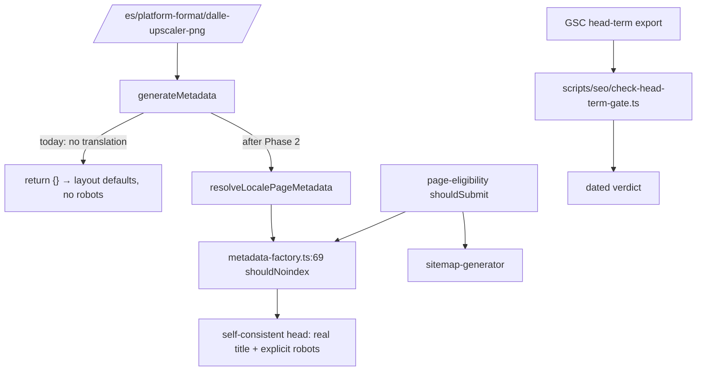

# PRD: pSEO Matrix Soft-404 Repair & Head-Term Recovery Gate

**Complexity: 3 (10+ files) + 2 (complex state logic — per-locale data fallback) + 1 (GSC integration) = 6 → MEDIUM mode**

**Source:** `The August 12 Cliff` (GSC triage through 2026-08-23), items 04 and 05.
The PDF's prescribed fix — _"choose the 100-150 combinations with real search demand,
`noindex` everything else"_ — is **the second step, not the first**. Production probing on
2026-08-25 found a specific, line-level defect that makes most of the 772 pages
unindexable regardless of how much search demand they have. Prune after the pages work,
not before; otherwise the pruning decision is made on data the bug produced.

---

## 1. Context

**Problem:** 772 programmatic pages are crawled and rejected. The named examples do not fail
because Google judged their content thin. They fail because their `<title>`, `<meta description>`,
and `robots` directive silently fall back to the site-wide layout defaults while the page body
renders full English content — a 200-status soft-duplicate, produced at scale.

**Files analyzed:**

- `app/[locale]/(pseo)/platform-format/[slug]/page.tsx` (and 16 sibling route files)
- `app/(pseo)/platform-format/[slug]/page.tsx` (the working root counterpart)
- `lib/seo/metadata-factory.ts:48-121`
- `lib/seo/page-eligibility.ts:133-197`
- `scripts/seo/check-indexation-gate.ts:16-17`
- `content/pseo-performance.json` (1,111 rows), `seo-reports/indexation-2026-08-13.md`

### The defect, at line level

`app/[locale]/(pseo)/platform-format/[slug]/page.tsx`:

```ts
export async function generateMetadata({ params }) {
  const result = await getPlatformFormatDataWithLocale(slug, locale);
  if (!result.data) return {};                    // :26  <-- no English fallback
  ...
}

export default async function PlatformFormatPage({ params }) {
  let result = await getPlatformFormatDataWithLocale(slug, locale);
  if (!result.data && locale !== 'en') {
    result = await getPlatformFormatDataWithLocale(slug, 'en');   // :41-43  <-- English fallback
  }
  if (!result.data) notFound();
  ...
}
```

**The component falls back to English. `generateMetadata` does not.** When a locale has no
translation the route returns `{}`, Next.js inherits the root layout's metadata, and the page ships:

- `<title>MyImageUpscaler - Image Upscaling & Enhancement</title>` — the site-wide default
- `<meta name="description" content="Transform your images with cutting-edge AI…">` — the site-wide default
- **no `robots` meta at all** — so the `shouldNoindex` logic at `metadata-factory.ts:69` never runs
- a self-referencing canonical from the layout
- ~280 KB of correct, English, on-topic body content (`<h1>DALL-E PNG Upscaler</h1>`)

### Verified production behaviour (2026-08-25)

| URL                                          | Status | `<title>`              | `robots` meta      | `<h1>`                       |
| -------------------------------------------- | ------ | ---------------------- | ------------------ | ---------------------------- |
| `/platform-format/dalle-upscaler-png` (root) | 200    | `DALL-E PNG Upscaler…` | `index, follow, …` | correct                      |
| `/es/platform-format/dalle-upscaler-png`     | 200    | **site default**       | **absent**         | `DALL-E PNG Upscaler`        |
| `/de/use-cases/cartoon-image-upscaler`       | 200    | **site default**       | **absent**         | correct                      |
| `/ja/device-use/mobile-ecommerce-upscaler`   | 200    | **site default**       | **absent**         | `Mobile E-commerce Upscaler` |
| `/es/alternatives/topaz-alternative`         | 200    | **site default**       | **absent**         | —                            |
| `/es/scale/2k-upscaler`                      | 200    | correct (English copy) | `index, follow`    | correct                      |

All three of the PDF's named "crawled, currently not indexed" examples are in the broken set.
`/es/scale/*` is not — its loader falls back internally, which is why that route escaped.

### Blast radius

17 locale pSEO route files contain `if (!result.data) return {};`. **Ten of them also carry the
English fallback in the component**, which is exactly the asymmetric pair above:

```
tools/convert, tools/resize, device-use, compare, platforms, tools,
use-cases, formats, platform-format, format-scale, alternatives
```

Multiply by six non-English locales and the order of magnitude matches the PDF's 772.

### Why the incumbent pruning gate does not catch this

`scripts/seo/check-indexation-gate.ts` blocks **new** matrix rows below an 85% indexation rate
(`:16`). It is a publication brake. It has no retraction path, so it is structurally incapable of
acting on 772 pages that already exist.

`lib/seo/page-eligibility.ts:133` `shouldSubmit` is the retraction path, and it has two holes that
keep the broken pages in the sitemap:

- **`if (!performance) return true;` (`:159`)** — a locale row absent from the snapshot stays
  submitted. `content/pseo-performance.json` holds 487 `en` rows against 98-112 per other locale,
  so most locale variants are absent by construction.
- **`getPerformanceRecord` falls back to the `en` row (`:70`)** for any non-`en` locale. Verified:
  `platform-format/dalle-upscaler-png` has `en` `impressions: 1`, `de`/`it`/`es` `impressions: 0`,
  and **no `ja` row at all**. A single English impression over 90 days therefore keeps the entire
  seven-locale cluster submitted, because `:161` returns true on `impressions > 0`.

And `getEligibilityReason` (`:172`), which computes the `'pruned'` verdict, **has zero non-test
consumers** — verified by grep across `lib/ app/ client/ scripts/`. It is an orphan export: the
reasoning exists, nothing reads it.

### Item 05 — the head term is the recovery signal, not a separate fix

Per the PDF, `image upscaler`: 282 → 75 clicks, position 9.5 → 14.4 (Jul 31-Aug 11 vs Aug 12-23).
Roughly half the clicks lost. It is the number that says whether this PRD and its siblings worked.
Phase 5 wires it into a dated, automated reading so it cannot quietly go unchecked — which is the
failure mode `gif-intent-defragmentation.md` documents for the GIF cluster's 847-click floor.

### One number to reconcile, not assume

`seo-reports/indexation-2026-08-13.md` reports **59.07% (1,130/1,913)**; the PDF reports **27%
(1,133 of 4,227)**. The numerators agree; the denominators do not. The report counts sitemap URLs,
GSC counts every URL it has discovered — including `/en/` mirrors and locale variants that were
never submitted. Phase 1 records both, labelled. Do not reconcile them by picking one.

---

## 2. Solution

**Approach:**

1. **Fix the metadata fallback first.** A page whose title is the site default cannot be judged for
   search demand, so any pruning decision taken before this is made on corrupted data.
2. **Make the fallback explicit rather than accidental.** If a locale has no translation, the route
   must choose deliberately: serve English **with a self-consistent, `noindex` head**, or 404.
   Silently inheriting the layout's head is neither.
3. **Close the two `shouldSubmit` holes** so retraction can actually reach locale variants.
4. **Give `getEligibilityReason` a live consumer** — or delete it. An orphan export that computes a
   `'pruned'` verdict nothing reads is how the matrix grew unnoticed.
5. **Then prune**, on post-fix data, against the PDF's 100-150 target.
6. **Wire the head-term reading to a fixed date** so the verdict is taken, not deferred.

**Key decisions:**

- The fallback rule lives in **one** shared helper, not seventeen copies. Seventeen hand-edited
  route files is how the asymmetry arose the first time.
- Reuse `metadata-factory.generateMetadata` unchanged — it already composes `shouldNoindex` at `:69`
  and handles canonical + hreflang. The routes are what must stop bypassing it.
- Reuse `check-indexation-gate.ts`'s freshness pattern (`MAX_EVIDENCE_AGE_DAYS = 35`) for the
  head-term gate rather than inventing a second staleness convention.

**Data changes:** none. Artifacts: `seo-reports/locale-metadata-audit-<date>.json`,
`seo-reports/head-term-<date>.json`.



---

## Integration Ledger

| #   | New thing                                                                  | Live caller (`file:line`, non-test)                                                          | Replaces                                           | Old path removed?            | Negative control                                                                                                    |
| --- | -------------------------------------------------------------------------- | -------------------------------------------------------------------------------------------- | -------------------------------------------------- | ---------------------------- | ------------------------------------------------------------------------------------------------------------------- |
| 1   | `scripts/seo/audit-locale-metadata.ts` + `yarn seo:audit:locale-meta`      | `package.json` (TBD)                                                                         | nothing — no audit exists                          | n/a                          | point it at the working root URL → must report 0 defects; if it reports defects everywhere it is not discriminating |
| 2   | `resolveLocalePageMetadata(loader, category, slug, locale)`                | all 10 asymmetric `app/[locale]/(pseo)/**/page.tsx` files (TBD)                              | `if (!result.data) return {};` in each             | **deleted** in Phase 2       | restore `return {}` in one route → that route's title assertion goes red                                            |
| 3   | `shouldSubmit` locale-strictness fix                                       | `lib/seo/metadata-factory.ts:69`; `lib/seo/sitemap-generator.ts` (both pre-existing callers) | the `!performance → true` and en-fallback branches | branches replaced in Phase 3 | restore the en-fallback → the `ja` variant becomes submittable again → red                                          |
| 4   | `getEligibilityReason` live consumer (structured log in the sitemap route) | `lib/seo/sitemap-generator.ts` (TBD)                                                         | orphan export                                      | n/a — now consumed           | grep must return a non-test hit; today it returns none                                                              |
| 5   | `scripts/seo/check-head-term-gate.ts` + `yarn seo:gate:head-term`          | `package.json` (TBD); run at the Phase 5 dated checkpoint                                    | nothing                                            | n/a                          | feed the Aug 12-23 window → gate must report **FAIL** at pos 14.4                                                   |
| 6   | Pruned matrix rows (`noindex` + sitemap removal)                           | `metadata-factory.ts:69` (pre-existing)                                                      | indexable matrix rows                              | n/a                          | un-prune one row → sitemap guard red                                                                                |

### Reachability

**How will this feature be reached?**

- Entry point: every request to a locale pSEO URL runs `generateMetadata` in its route file;
  every sitemap build calls `sitemap-generator`; `yarn verify` runs the unit gates; the head-term
  gate is run by the operator on the Phase 5 date.
- Pre-existing files EDITED: ten `app/[locale]/(pseo)/**/page.tsx` files, `lib/seo/page-eligibility.ts`,
  `lib/seo/sitemap-generator.ts`, `package.json`.
- Registration: the helper is imported by ten live route files — that is the wiring, and it is what
  makes this PRD's central change impossible to leave dead.

**Is this user-facing?** Crawler-facing. The rendered body does not change; the document head does.

**Full flow:**

1. Googlebot requests `/es/platform-format/dalle-upscaler-png`.
2. Next.js runs `generateMetadata` in `app/[locale]/(pseo)/platform-format/[slug]/page.tsx`.
3. New at `:26`: the route calls `resolveLocalePageMetadata`, which falls back to English **and**
   marks the response `noindex` for an untranslated locale.
4. Observable in: `curl -s … | grep 'name="robots"'` returning `noindex, follow`, and the `<title>`
   naming the actual page instead of the site default.

**What does this replace?** `if (!result.data) return {};` in ten route files, deleted in Phase 2.

---

## 4. Execution Phases

#### Phase 1: Audit — the metadata defect is counted, not estimated

**Files (max 5):**

- `scripts/seo/audit-locale-metadata.ts` — NEW
- `package.json` — EDIT
- `seo-reports/locale-metadata-audit-2026-08-25.json` — NEW artifact
- `tests/unit/seo/locale-metadata-audit.unit.spec.ts` — NEW

**Implementation:**

- [ ] For every locale pSEO URL in the sitemaps, fetch and extract `<title>`, `<meta description>`,
      `<meta name="robots">`, `<link rel="canonical">`, and the first `<h1>`.
- [ ] Flag `defaultTitle` (title equals the layout default), `missingRobots`, `titleH1Mismatch`.
- [ ] Emit totals by category × locale, plus `generatedAt`.
- [ ] Record **both** indexation denominators, labelled: the sitemap-scoped 1,130/1,913 from
      `seo-reports/indexation-2026-08-13.md`, and GSC's 1,133/4,227 from the source report.

**Wiring:**

- [ ] Caller edited: `package.json`
- [ ] Ledger rows filled: #1

**Tests Required:**

| Test File                                           | Test Name                                              | Assertion                                                  | Negative control (observed red)                                                    |
| --------------------------------------------------- | ------------------------------------------------------ | ---------------------------------------------------------- | ---------------------------------------------------------------------------------- |
| `tests/unit/seo/locale-metadata-audit.unit.spec.ts` | `should flag a page whose title is the layout default` | fixture with the site-default title → `defaultTitle: true` | fixture with a real title → not flagged. If both flag, the check is vacuous        |
| `tests/unit/seo/locale-metadata-audit.unit.spec.ts` | `should flag a page with no robots meta`               | absent robots → `missingRobots: true`                      | add `index, follow` → not flagged                                                  |
| `tests/unit/seo/locale-metadata-audit.unit.spec.ts` | `should not flag the working root route`               | `/platform-format/dalle-upscaler-png` fixture → clean      | this is the discrimination control: a checker that flags everything proves nothing |

**Revert check:** n/a — measurement only. **Phase 1 ships no behavior change.**

**Expected finding, to be replaced with the real count:** several hundred URLs with
`defaultTitle && missingRobots`, concentrated in the ten asymmetric categories.

---

#### Phase 2: One fallback rule — an untranslated locale page gets a self-consistent head

**Files (max 5, so this phase runs three times over the ten routes — 4 / 3 / 3):**

- `lib/seo/locale-page-metadata.ts` — NEW: `resolveLocalePageMetadata`
- `app/[locale]/(pseo)/platform-format/[slug]/page.tsx` — EDIT: `:26` calls the helper
- `app/[locale]/(pseo)/use-cases/[slug]/page.tsx` — EDIT
- `app/[locale]/(pseo)/device-use/[slug]/page.tsx` — EDIT
- `tests/unit/seo/locale-page-metadata.unit.spec.ts` — NEW

**Proof subject:** start with `platform-format` — it is one of the PDF's three named
crawled-not-indexed examples and carries the full asymmetry. Do **not** start with `scale`, whose
loader already falls back internally and would let a broken helper pass.

**Implementation:**

- [ ] `resolveLocalePageMetadata` loads the locale data; on miss, loads English and returns
      `generatePageMetadata(englishData, category, locale)` with `robots.index = false`.
- [ ] The rule must match the component's fallback exactly. Metadata and body disagreeing is the
      original bug; a _different_ disagreement is not a fix.
- [ ] **Delete** every `if (!result.data) return {};` as it is converted. Leaving one behind means
      that route keeps shipping the defect while the gates go green.
- [ ] Remaining routes converted in two follow-up passes under the same phase number, each with its
      own checkpoint.

**Wiring:**

- [ ] Callers edited: each converted `page.tsx` (ten by phase end)
- [ ] Old path: `return {}` **deleted** in every converted route
- [ ] Ledger rows filled: #2

**Tests Required:**

| Test File                                           | Test Name                                                           | Assertion                                          | Negative control                                             |
| --------------------------------------------------- | ------------------------------------------------------------------- | -------------------------------------------------- | ------------------------------------------------------------ |
| `tests/unit/seo/locale-page-metadata.unit.spec.ts`  | `should return a real title when the locale has no translation`     | title ≠ layout default                             | **run at `HEAD~1`: must FAIL.** Today the route returns `{}` |
| `tests/unit/seo/locale-page-metadata.unit.spec.ts`  | `should noindex an untranslated locale page`                        | `robots.index === false`                           | force a translation present → `index: true`                  |
| `tests/unit/seo/locale-page-metadata.unit.spec.ts`  | `should use the same fallback data the component renders`           | metadata slug === rendered `h1` source             | change the helper's fallback locale → red                    |
| `tests/e2e/pseo/locale-metadata.spec.ts`            | `should never render the layout default title on a locale pSEO URL` | over a sampled set                                 | revert one route → red, naming that route                    |
| `tests/unit/seo/route-fallback-parity.unit.spec.ts` | `should have no route returning bare {} from generateMetadata`      | source scan of `app/[locale]/(pseo)/**` finds none | reintroduce one → red                                        |

**Revert check:** restore `return {}` in `platform-format` → the e2e title assertion fails **and
names that route**.

**User Verification:**

- Action: `curl -s https://myimageupscaler.com/es/platform-format/dalle-upscaler-png | grep -oE '<title>[^<]*</title>|name="robots"[^>]*'`
- Expected: a title naming DALL-E PNG upscaling, plus `content="noindex, follow"`.
  Baseline today: the site-default title and **no robots line at all**.

---

#### Phase 3: Close the eligibility holes — retraction can reach a locale variant

**Files:**

- `lib/seo/page-eligibility.ts` — EDIT: `getPerformanceRecord` (`:70`), `shouldSubmit` (`:159`, `:161`)
- `lib/seo/sitemap-generator.ts` — EDIT: consume `getEligibilityReason`
- `tests/unit/seo/page-eligibility.unit.spec.ts` — EDIT (pre-existing)
- `tests/unit/seo/sitemap-eligibility.unit.spec.ts` — EDIT (pre-existing)

**Implementation:**

- [ ] Remove the `en` fallback in `getPerformanceRecord` for submission decisions. A locale variant's
      eligibility must rest on that locale's own row. **Verified today:** `en impressions: 1` keeps
      `de`, `it`, `es`, and the entirely absent `ja` variant of
      `platform-format/dalle-upscaler-png` submitted.
- [ ] Replace `if (!performance) return true;` for non-`en` locales: an absent locale row means
      unmeasured, and an unmeasured locale variant of an already-published English page does not get
      an indefinite pass. Keep the grace period for genuinely new pages via `lastUpdated`.
- [ ] Give `getEligibilityReason` a live consumer: log the reason distribution from the sitemap
      route. If no consumer is wanted, **delete the function** — do not leave the orphan.

**Wiring:**

- [ ] Callers edited: `metadata-factory.ts:69` and `sitemap-generator.ts` are pre-existing consumers
      of `shouldSubmit`; the behavior change reaches production through them unmodified
- [ ] Old path: the two branches are **replaced**, not supplemented
- [ ] Ledger rows filled: #3, #4

**Tests Required:**

| Test File                                         | Test Name                                                     | Assertion                                                                               | Negative control                                                               |
| ------------------------------------------------- | ------------------------------------------------------------- | --------------------------------------------------------------------------------------- | ------------------------------------------------------------------------------ |
| `tests/unit/seo/page-eligibility.unit.spec.ts`    | `should not inherit English impressions for a locale variant` | `shouldSubmit('platform-format','dalle-upscaler-png','de') === false` with `en:1, de:0` | **run at `HEAD~1`: must PASS as `true`** — proving the change is what flips it |
| `tests/unit/seo/page-eligibility.unit.spec.ts`    | `should not submit a locale variant with no snapshot row`     | `('platform-format','dalle-upscaler-png','ja') === false`                               | restore `!performance → true` → red                                            |
| `tests/unit/seo/page-eligibility.unit.spec.ts`    | `should still submit a new page inside its grace period`      | recent `lastUpdated` → true                                                             | pre-existing behavior must not regress                                         |
| `tests/unit/seo/sitemap-eligibility.unit.spec.ts` | `should log an eligibility reason for every excluded URL`     | reasons emitted                                                                         | remove the consumer → red                                                      |

**Revert check:** `git stash` → `should not inherit English impressions for a locale variant` fails.

**Caller census required at this checkpoint:**

```bash
grep -rn "getEligibilityReason" --include='*.ts' --include='*.tsx' lib/ app/ client/ scripts/ | grep -v spec
# Expected: at least one non-test consumer. Today: zero.
```

---

#### Phase 4: Prune on post-fix data — the matrix shrinks to what has demand

**Files:**

- `content/pseo-performance.json` — REGENERATE via `yarn seo:sync:performance`
- `seo-reports/indexation-<date>.md` — REGENERATE
- `seo-reports/prune-candidates-<date>.md` — REGENERATE
- `lib/seo/page-eligibility.ts` — EDIT: `PINNED_SLUGS` for demonstrated-demand keeps
- `tests/unit/seo/pruned-page-signals.unit.spec.ts` — EDIT (pre-existing)

**Implementation:**

- [ ] **Gate: do not start Phase 4 until Phase 2 has been live for 14 complete GSC days plus the
      3-day lag.** Pruning on pre-fix data prunes pages whose only defect was a broken `<title>` —
      it would delete demand rather than measure it.
- [ ] Re-sync performance, then apply the PDF's target: keep the 100-150 combinations with real
      search demand, `noindex` and de-list the rest.
- [ ] Every keep must cite an impression or click figure from the refreshed snapshot. "Looks
      valuable" is not a criterion.
- [ ] Refresh the indexation report so `check-indexation-gate.ts`'s 35-day freshness window
      (`:17`) does not expire mid-work and block the deploy.

**Wiring:**

- [ ] Callers: `shouldSubmit` (already live in `metadata-factory.ts:69` and the sitemap routes)
- [ ] Ledger rows filled: #6

**Tests Required:**

| Test File                                         | Test Name                                                          | Assertion                | Negative control      |
| ------------------------------------------------- | ------------------------------------------------------------------ | ------------------------ | --------------------- |
| `tests/unit/seo/pruned-page-signals.unit.spec.ts` | `should noindex a pruned matrix row`                               | `robots.index === false` | un-prune → red        |
| `tests/unit/seo/sitemap-eligibility.unit.spec.ts` | `should keep every demonstrated-demand row submitted`              | named keeps present      | drop one → red        |
| `tests/unit/seo/indexation-gate.unit.spec.ts`     | `should block new rows while the rate is below 85%` (pre-existing) | unchanged                | pre-existing coverage |

**Revert check:** restore the pre-prune snapshot → the pruned-row noindex test fails.

**User Verification:**

- Action: `yarn validate:seo:sitemap:full`
- Expected: total submitted URL count materially below the pre-prune figure, with the kept set
  matching the demand list.

---

#### Phase 5: Wire the head-term verdict to a date — item 05 gets read, not deferred

**Files:**

- `scripts/seo/check-head-term-gate.ts` — NEW
- `package.json` — EDIT: `seo:gate:head-term`
- `seo-reports/head-term-<date>.json` — NEW artifact
- `docs/SEO/maintenance/seo-changes-backlog.md` — EDIT: record the dated checkpoint
- `tests/unit/seo/head-term-gate.unit.spec.ts` — NEW

**Implementation:**

- [ ] Gate on `image upscaler`: **position < 10.0** over the most recent 28 complete GSC days.
      Baseline 9.5 (Jul 31-Aug 11) → 14.4 (Aug 12-23).
- [ ] Reuse `MAX_EVIDENCE_AGE_DAYS` from `check-indexation-gate.ts:17`. One staleness convention.
- [ ] Encode the PDF's decision rule verbatim, because it is the thing most likely to be skipped:
      _if `image upscaler` has not returned under position 10 within two to three weeks of the
      redirect fixes, the cause is the content matrix, not the URL layer, and pruning becomes urgent
      rather than hygienic._
- [ ] **First reading: 2026-09-22** — 28 complete days from the Aug 25 batch plus the 3-day lag.
      Write the date into the backlog so it is a commitment, not an intention.

**Wiring:**

- [ ] Caller edited: `package.json`; the dated checkpoint recorded in the SEO changes backlog
- [ ] Ledger rows filled: #5

**Tests Required:**

| Test File                                    | Test Name                                        | Assertion                    | Negative control                                                                    |
| -------------------------------------------- | ------------------------------------------------ | ---------------------------- | ----------------------------------------------------------------------------------- |
| `tests/unit/seo/head-term-gate.unit.spec.ts` | `should fail at the observed Aug 12-23 position` | pos 14.4 → `blocked: true`   | **this is the required red observation.** A gate never seen failing is not evidence |
| `tests/unit/seo/head-term-gate.unit.spec.ts` | `should pass at the Jul 31-Aug 11 baseline`      | pos 9.5 → `blocked: false`   | flip the threshold → red                                                            |
| `tests/unit/seo/head-term-gate.unit.spec.ts` | `should fail when the evidence is stale`         | 40-day-old artifact → throws | fresh artifact → passes                                                             |

**Revert check:** `git stash` → the head-term gate script is absent and `yarn seo:gate:head-term` fails.

---

## 5. Checkpoint Protocol

`prd-work-reviewer` after every phase, standard integration audit plus:

> 7. Confirm **zero** `app/[locale]/(pseo)/**/page.tsx` files still contain
>    `if (!result.data) return {};`. A partial conversion ships the defect on the unconverted routes
>    while the gates go green — fail the phase.
> 8. Confirm `getEligibilityReason` has a non-test consumer, or was deleted. An orphan export is a FAIL.
> 9. Confirm Phase 4 did not begin before Phase 2 had been live 14 complete GSC days + 3-day lag.

Manual checkpoint on **Phase 2** — inspect the rendered head of a real locale URL with your own eyes.
Every automated metric passed the current build.

---

## 6. Verification Strategy

### Integration Proof

```bash
# 1. Incumbent check — the asymmetric bail must be gone from every locale pSEO route
grep -rn "if (!result.data) return {};" "app/[locale]/(pseo)"
# Expected after Phase 2: no output. Today: 17 files.

# 2. Caller census — the helper must be imported by live route files, not only tests
grep -rn "resolveLocalePageMetadata" --include='*.tsx' --include='*.ts' app/ lib/ | grep -v spec
# Expected: the definition plus 10 route-file imports

# 3. Orphan check — the pruning verdict must be read by something
grep -rn "getEligibilityReason" --include='*.ts' lib/ app/ scripts/ | grep -v spec
# Expected: at least one non-test consumer. Today: zero.

# 4. Revert check
git stash && npx vitest run tests/unit/seo/locale-page-metadata.unit.spec.ts tests/unit/seo/page-eligibility.unit.spec.ts
# Expected: FAIL. Then: git stash pop

# 5. Live proof — paste raw output, do not summarize
for u in /es/platform-format/dalle-upscaler-png /de/use-cases/cartoon-image-upscaler \
         /ja/device-use/mobile-ecommerce-upscaler /es/alternatives/topaz-alternative; do
  echo "--- $u"
  curl -s -A "Mozilla/5.0" "https://myimageupscaler.com$u" \
    | grep -oE '<title>[^<]*</title>|name="robots" content="[^"]*"' | head -2
done
# Expected: a page-specific title and an explicit robots directive on every one.
# Baseline: site-default title, robots line entirely absent.

# 6. Discrimination control — the working route must still be clean
curl -s -A "Mozilla/5.0" https://myimageupscaler.com/platform-format/dalle-upscaler-png \
  | grep -oE '<title>[^<]*</title>|name="robots" content="[^"]*"'
# Expected: unchanged from baseline. If this regressed, the helper over-applied.
```

### Baseline to beat (recorded 2026-08-25, pre-change)

```
/es/platform-format/dalle-upscaler-png   200  title=SITE DEFAULT  robots=ABSENT  h1=DALL-E PNG Upscaler
/de/use-cases/cartoon-image-upscaler     200  title=SITE DEFAULT  robots=ABSENT
/ja/device-use/mobile-ecommerce-upscaler 200  title=SITE DEFAULT  robots=ABSENT  h1=Mobile E-commerce Upscaler
/es/alternatives/topaz-alternative       200  title=SITE DEFAULT  robots=ABSENT
/platform-format/dalle-upscaler-png      200  title=CORRECT       robots=index, follow      <- control
routes with `return {}`                  17   (10 asymmetric with a component-level en fallback)
pseo-performance.json rows               1,111  (en 487 | de 112 | es 111 | ja 103 | fr 100 | it 100 | pt 98)
dalle-upscaler-png snapshot              en imp=1 | de,it,es imp=0 | ja row ABSENT
getEligibilityReason consumers           0 non-test
indexation (sitemap-scoped, 2026-08-13)  59.07%  (1,130/1,913)
indexation (GSC-scoped, PDF)             27%     (1,133/4,227)
GSC "Crawled, currently not indexed"     772
"image upscaler"                         282 -> 75 clicks | pos 9.5 -> 14.4
```

---

## 7. Acceptance Criteria

Consumer-scoped.

- [ ] **Googlebot fetching any locale pSEO URL receives a page-specific `<title>` and an explicit
      `robots` directive** — never the site-wide default with no directive.
- [ ] **An untranslated locale page's head and body agree**: both English, and the head says
      `noindex`. No page serves English content under a head that claims a translation.
- [ ] **No route in `app/[locale]/(pseo)/` returns bare `{}` from `generateMetadata`** — enforced by
      a source-scanning gate, so the tenth route cannot be forgotten.
- [ ] **A locale variant with no impressions of its own is not submitted**, even when the English
      page has one — proven by the `ja` variant of `platform-format/dalle-upscaler-png`.
- [ ] **The `'pruned'` verdict is read by live code**, or the function is deleted.
- [ ] **The working root route is unchanged** — `/platform-format/dalle-upscaler-png` still returns
      its correct title and `index, follow`.
- [ ] **The head-term gate was observed FAILING** on the Aug 12-23 window before being trusted.
- [ ] **Post-deploy:** sitemap resubmitted; the 20 highest-value repaired URLs requested in GSC and
      recorded in `docs/SEO/maintenance/gsc-request-indexing-backlog.md`.
- [ ] **Recovery reading, on 2026-09-22:** run `yarn seo:gate:head-term`. If `image upscaler` is still
      above position 10, the PDF's escalation applies — the content matrix is the cause and Phase 4's
      pruning becomes urgent. **Record the verdict either way.** The GIF cluster's 847-click floor sat
      in `lib/seo/intent-ownership.ts` since July and was never compared against live data; that is how
      a cluster lost 86% of its clicks unnoticed for six weeks.

### Integration gates

- [ ] Integration Ledger has zero `TBD` cells
- [ ] `grep -rn "if (!result.data) return {};" "app/[locale]/(pseo)"` returns nothing
- [ ] `resolveLocalePageMetadata` is imported by ten live route files
- [ ] `getEligibilityReason` has a non-test consumer or no longer exists
- [ ] Every Phase 2-3 gate was run at `HEAD~1` and observed **red** there
- [ ] The head-term gate was observed red on real data
- [ ] Phase 4 began only after 14 complete post-Phase-2 GSC days + 3-day lag
- [ ] `yarn verify` passes
- [ ] Entry appended to `docs/SEO/maintenance/seo-changes-backlog.md`

### Explicitly out of scope

- Writing genuine translations — see `locale-surface-retraction.md`
- The GIF cluster — see `gif-intent-defragmentation.md`
- `/en/` mirror collapse — see `locale-surface-retraction.md` Phase 4
- Core Web Vitals — see `edge-html-caching-lcp-recovery.md`
- The PDF's item 10 (impression sinks) — a content-planning note, already covered by the phantom-cluster
  quarantine in `seo-reporting-signal-hygiene.md` Phase 2. No code change is warranted:
  `/blog/poster-size-dimensions-pixels` ranks at 6.9 and is a good page; the click was never available
  because an AI Overview answers the query outright.
