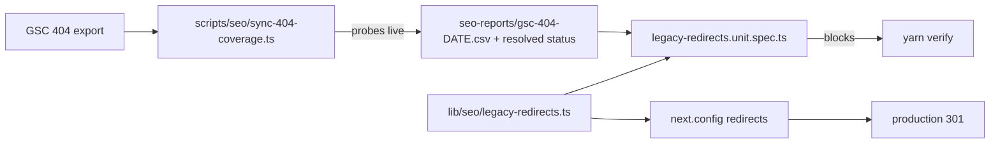

# PRD: Redirect & 404 Integrity

**Complexity: 3 (files) + 1 (external API integration — GSC export) = 4 → MEDIUM mode**

**Source:** `The August 12 Cliff` (GSC triage, data through 2026-08-23), items 01, 02, 08.
Every claim in Section 1 was re-verified against production on 2026-08-25 before this
PRD was written. Three of the PDF's claims did not survive that check and are recorded
as **corrected** below — do not implement against the PDF text.

---

## 1. Context

**Problem:** The Aug-13 deploy (`63bb04f9`, "fix(seo): eliminate GSC 404s (PRD 01)") shipped
310 legacy redirects and a unit gate that asserts full GSC-404 coverage. The gate is green.
Production still 404s on URLs that are _inside the gate's own fixture_.

**Files analyzed:**

- `lib/seo/legacy-redirects.ts` (1,821 lines, 310 rules)
- `tests/unit/seo/legacy-redirects.unit.spec.ts` (the coverage gate)
- `docs/PRDs/gsc-recovery-2026-08/data/gsc-404.csv` (the gate's fixture, 303 rows, frozen 2026-08-08)
- `app/not-found.tsx`
- `app/seo/data/social-media-resize.json`
- `seo-reports/gsc-verify-5xx-2026-08-13.json`

### Verified production behaviour (2026-08-25, cache-busted, real UA)

| URL                                   | Live                                            | Rule in `LEGACY_REDIRECTS`? | In gate fixture? |
| ------------------------------------- | ----------------------------------------------- | --------------------------- | ---------------- |
| `/article/ai-models-comparison`       | **301** → `/comparisons-expanded/…` (200)       | yes                         | yes              |
| `/article/bulk-image-resizer`         | **301** → 200                                   | yes                         | yes              |
| `/article/upscale-product-photos`     | **404**                                         | **no**                      | **no**           |
| `/article/vintage-photo-colorization` | **404**                                         | **no**                      | **no**           |
| `/tools/resize-image-for-discord`     | **404**                                         | **no**                      | **yes (5 rows)** |
| `/tools/resize-image-for-telegram`    | **404**                                         | **no**                      | **yes (6 rows)** |
| `/tools/convert/png-in-jpg`           | **404**                                         | **no**                      | **no**           |
| `/tools/Imagem-cutout-tool`           | **301** → `/tools/imagem-cutout-tool` → **404** | case rule (middleware)      | no               |

### The gate's false-pass mechanism (this is the actual bug)

`tests/unit/seo/legacy-redirects.unit.spec.ts:99` — _"should map every GSC 404 source to a
redirect **or an explicitly routed page**"_. The "explicitly routed" escape hatch is
`ROUTED_TOOL_SLUGS` (`legacy-redirects.unit.spec.ts:11-22`), built by reading every
`app/seo/data/*.json` with `category === 'tools'` and collecting **`page.slug`**.

`social-media-resize.json:2433` contains `"slug": "resize-image-for-discord"`.
The gate therefore treats `/tools/resize-image-for-discord` as routed and passes.

The page's real route is `/tools/resize/**resize-image-for-discord**` (verified 200).
The bare `/tools/<slug>` form 404s. **The gate compares a slug against a path**, so any tool
that lives under a `resize/`, `convert/`, or `compress/` sub-segment is silently exempted
from 404 coverage while its bare URL is dead in production.

This is the "gate reads a stale/wrong artifact" silent-pass mechanism, twice over:

1. **Wrong key.** Slug-vs-path comparison exempts a whole family of live 404s.
2. **Frozen fixture.** `gsc-404.csv` was exported 2026-08-08. Every 404 Google has
   discovered since — including `/article/upscale-product-photos`, last crawled Aug 21 per
   the PDF — cannot fail a gate that never sees it.

### Corrections to the source PDF — do not implement these

- **Item 08 (six 5xx responses) is already resolved.** `seo-reports/gsc-verify-5xx-2026-08-13.json`
  records 5 URLs checked, **0 violations**, generated 2026-08-14. Re-probed 2026-08-25:
  `/en/blog?page=43` → 301 → `/blog?page=43` → **200**; `/blog?page=999` → **200**;
  all four `/ja/tools/resize-image-for-*` → 301 → **200**. The 5xx bucket in the PDF is
  historical GSC data predating the Aug-13 deploy. **No 5xx work in this PRD.**
- **Item 08's blog-pagination claim is wrong today.** `/blog?page=999` returns 200, not 500.
  Bounding the range is not required and is explicitly out of scope.
- **The only surviving part of item 08** is `/tools/Imagem-cutout-tool`, which is not a 5xx —
  it is a redirect-to-404 chain, and it is in scope here as such.
- **Item 01's GIF evidence is owned by [`gif-intent-defragmentation.md`](./gif-intent-defragmentation.md), not this PRD.**
  The PDF prescribes "reverse it — keep `/format-scale/gif-upscale-16x` as canonical". That PRD's
  Phase 3 reaches the same decision through a measured gate rather than by assertion, and it holds
  the cluster contract in `lib/seo/intent-ownership.ts`. **Do not touch the GIF cluster from this PRD.**
  One new fact for it, found while probing: `/es/format-scale/gif-upscale-2x` **301s to the English
  `/formats/upscale-gif-images`**, losing the locale. Recorded in that PRD's Phase 2 scope.

### Item 02's second half — the empty 404 title — is real

`app/not-found.tsx` exports a component and **no `metadata`**. Verified live: the 404 response
body contains no `<title>` element at all. Google's report shows the same.

---

## 2. Solution

**Approach:**

- Fix the gate before fixing any URL. A coverage gate that exempts by slug proves nothing;
  every redirect added under it inherits that hole.
- Key coverage on the **path**, and resolve a path as "routed" only by proving it returns 200 —
  never by inferring a route from a data file.
- Replace the frozen CSV with a dated, refreshable export plus a freshness ceiling, matching the
  pattern `scripts/seo/check-indexation-gate.ts:16` (`MAX_EVIDENCE_AGE_DAYS = 35`) already
  establishes in this repo.
- Make `UNMAPPED_LEGACY_PATHS` (`lib/seo/legacy-redirects.ts:13`, currently `[]`) carry its
  intended meaning: a path may be knowingly left to 404, but only when it is written down.
- Give `/not-found` a real title.

**Key decisions:**

- Reuse `parseGscCsv` from `lib/seo/gsc-verification.ts` — already the gate's parser. No new parser.
- Redirects stay in `lib/seo/legacy-redirects.ts` and keep flowing through `next.config` redirects.
  No new redirect mechanism; the incumbent works, its _coverage proof_ does not.
- Live-status resolution runs in a script (`scripts/seo/`), not in the unit gate. The unit gate
  stays offline and deterministic; the script produces the artifact the gate reads.
- Single-hop is already enforced by `legacy-redirects.unit.spec.ts:109` (`should not chain redirects`).
  Extend it to also reject a rule whose **destination 404s**, which is what `Imagem-cutout-tool` is.

**Data changes:** none. One new committed artifact: `seo-reports/gsc-404-<date>.csv`.



---

## Integration Ledger

| #   | New thing                                                | Live caller (`file:line`, non-test)                       | Replaces                                                    | Old path removed?                 | Negative control                                                                        |
| --- | -------------------------------------------------------- | --------------------------------------------------------- | ----------------------------------------------------------- | --------------------------------- | --------------------------------------------------------------------------------------- |
| 1   | `resolveRoutedPaths()` — path-keyed, live-status-backed  | `scripts/seo/sync-404-coverage.ts` (TBD:line)             | `ROUTED_TOOL_SLUGS` in `legacy-redirects.unit.spec.ts:11`   | deleted in Phase 1                | re-adding `/tools/resize-image-for-discord` to the exempt set must make the gate go red |
| 2   | `scripts/seo/sync-404-coverage.ts` + `yarn seo:sync:404` | `package.json` scripts (TBD:line)                         | manual CSV drop into `docs/PRDs/gsc-recovery-2026-08/data/` | fixture path repointed in Phase 2 | delete the artifact → gate must fail loudly, never pass on the old copy                 |
| 3   | `MAX_404_EVIDENCE_AGE_DAYS` freshness ceiling            | `tests/unit/seo/legacy-redirects.unit.spec.ts` (TBD:line) | nothing — new guard                                         | n/a                               | backdate the artifact 40 days → gate red                                                |
| 4   | New redirect rules for the uncovered 404 set             | `lib/seo/legacy-redirects.ts` → `next.config` redirects   | live 404s                                                   | n/a                               | remove one rule → gate red **and** live probe 404s                                      |
| 5   | `export const metadata` in `app/not-found.tsx`           | Next.js App Router renders it for every unmatched route   | empty `<title>`                                             | replaced in Phase 4               | strip the export → e2e title assertion red                                              |
| 6   | Destination-liveness assertion                           | `tests/unit/seo/legacy-redirects.unit.spec.ts` (TBD:line) | nothing                                                     | n/a                               | point a rule at `/tools/imagem-cutout-tool` → red                                       |

### Reachability

**How will this feature be reached?**

- Entry point: (a) every unmatched HTTP request hits `next.config` redirects then `app/not-found.tsx`;
  (b) `yarn verify` runs the unit gate on every deploy; (c) `yarn seo:sync:404` is run by the operator
  before a deploy whose evidence has aged out.
- Pre-existing files EDITED: `lib/seo/legacy-redirects.ts`, `tests/unit/seo/legacy-redirects.unit.spec.ts`,
  `app/not-found.tsx`, `package.json`.
- Registration: the gate is already collected by `npx vitest run tests/unit/seo/` (99 files, 1,170 tests
  as of the 2026-08-17 backlog entry). The new script registers as a `package.json` script.

**Is this user-facing?** Partly — the 404 page is user-facing (Phase 4). The rest is crawler-facing.

**Full flow:**

1. Googlebot requests `/article/upscale-product-photos`.
2. Hits `next.config` redirects, generated from `LEGACY_REDIRECTS`.
3. Reaches the new rule added in Phase 3 → single-hop 301 to the live `/blog/*` or `/use-cases/*` equivalent.
4. Observable in: a live `curl -sIL` returning `hops=1 final=200`, and in GSC's 404 report shrinking.

**What does this replace?** The slug-keyed exemption set and the frozen fixture. Both deleted in Phases 1–2.

---

## 4. Execution Phases

#### Phase 1: Make the coverage gate red — it reports the live 404s it currently exempts

**Files (max 5):**

- `tests/unit/seo/legacy-redirects.unit.spec.ts` — EDIT: delete `ROUTED_TOOL_SLUGS` (lines 11-22),
  key coverage on path
- `seo-reports/404-resolution-2026-08-25.json` — NEW: probed status for every fixture path
- `scripts/seo/sync-404-coverage.ts` — NEW: produces the above
- `package.json` — EDIT: add `seo:sync:404`

**Implementation:**

- [ ] Write `sync-404-coverage.ts`: read a GSC 404 CSV via `parseGscCsv`, probe each URL live
      (single request, follow redirects, record `finalStatus` and `hops`), emit JSON with
      `generatedAt` and per-URL `{ url, status, finalStatus, hops, finalUrl }`.
- [ ] Rewrite the coverage assertion: a fixture path is covered **only if** it has a
      `LEGACY_REDIRECTS` rule, **or** the resolution artifact records `finalStatus === 200 && hops === 0`,
      **or** it appears in `UNMAPPED_LEGACY_PATHS`.
- [ ] Delete `ROUTED_TOOL_SLUGS` and every reference to it.

**Wiring:**

- [ ] Caller edited: `tests/unit/seo/legacy-redirects.unit.spec.ts` reads the new artifact
- [ ] Registration: `package.json` → `seo:sync:404`
- [ ] Old path: `ROUTED_TOOL_SLUGS` **deleted**, not left alongside
- [ ] Ledger rows filled: #1, #2

**Tests Required:**

| Test File                                           | Test Name                                                                            | Assertion                                                                                                                                        | Negative control (must be observed red)                                            |
| --------------------------------------------------- | ------------------------------------------------------------------------------------ | ------------------------------------------------------------------------------------------------------------------------------------------------ | ---------------------------------------------------------------------------------- |
| `tests/unit/seo/legacy-redirects.unit.spec.ts`      | `should map every GSC 404 path to a redirect, a live 200, or a documented exemption` | `expect(uncovered).toEqual([])` — **this must FAIL on first run**, listing `/tools/resize-image-for-discord`, `/tools/resize-image-for-telegram` | it is red **before** Phase 3; it goes green only after the rules land              |
| `tests/unit/seo/404-coverage-artifact.unit.spec.ts` | `should fail when the resolution artifact is missing`                                | delete artifact → throws with a named message                                                                                                    | rename the artifact file → red, never a silent pass                                |
| `tests/unit/seo/404-coverage-artifact.unit.spec.ts` | `should not treat a sub-routed tool slug as covering its bare path`                  | `/tools/resize-image-for-discord` is uncovered while `/tools/resize/resize-image-for-discord` is 200                                             | re-add the slug exemption → this test goes green, proving it guards the exact hole |

**Revert check:** restore `ROUTED_TOOL_SLUGS` → `should not treat a sub-routed tool slug…` fails.

**Phase 1 exit condition is a RED gate, not a green one.** Do not add redirects in this phase.

---

#### Phase 2: Refresh the evidence — the gate reads a dated export with a freshness ceiling

**Files:**

- `tests/unit/seo/legacy-redirects.unit.spec.ts` — EDIT: repoint `DATA_PATH`, add age ceiling
- `seo-reports/gsc-404-2026-08-25.csv` — NEW: fresh GSC export (299 rows expected)
- `docs/PRDs/gsc-recovery-2026-08/data/gsc-404.csv` — DELETE
- `scripts/seo/sync-404-coverage.ts` — EDIT: resolve the newest `seo-reports/gsc-404-*.csv`

**Implementation:**

- [ ] Export the current **Not found (404)** table from GSC (Pages → Why pages aren't indexed).
      Expected ≈ 299 rows per the PDF; record the actual count in the PRD's evidence section.
- [ ] Add `MAX_404_EVIDENCE_AGE_DAYS = 35`, matching `scripts/seo/check-indexation-gate.ts:16`.
      Reuse that module's `ageInDays` rather than writing a second one.
- [ ] Delete the frozen fixture. Two live fixtures means the gate can pass against the easy one.

**Wiring:**

- [ ] Caller edited: the gate's `DATA_PATH`
- [ ] Old path: `docs/PRDs/gsc-recovery-2026-08/data/gsc-404.csv` **deleted**
- [ ] Ledger rows filled: #3

**Tests Required:**

| Test File                                      | Test Name                                                   | Assertion                                          | Negative control                                     |
| ---------------------------------------------- | ----------------------------------------------------------- | -------------------------------------------------- | ---------------------------------------------------- |
| `tests/unit/seo/legacy-redirects.unit.spec.ts` | `should fail when the 404 evidence is older than 35 days`   | backdated `generatedAt` → throws                   | set `generatedAt` to 40 days ago → red               |
| `tests/unit/seo/legacy-redirects.unit.spec.ts` | `should read the newest dated export, not a hardcoded path` | resolved path ends with the newest `gsc-404-*.csv` | drop an older-dated file in → still picks the newest |

**Revert check:** restore the old fixture path → the freshness test fails (the file has no `generatedAt`).

---

#### Phase 3: Turn the gate green by fixing production — every 404 in the export resolves in one hop

**Files:**

- `lib/seo/legacy-redirects.ts` — EDIT: add rules for every uncovered path
- `tests/unit/seo/legacy-redirects.unit.spec.ts` — EDIT: add destination-liveness assertion
- `seo-reports/404-resolution-<date>.json` — regenerate

**Implementation:**

- [ ] For each uncovered path, map to a **genuinely equivalent** live page. Where none exists,
      add it to `UNMAPPED_LEGACY_PATHS` with an inline reason. An entry there is a decision on
      the record, not a bypass.
- [ ] Known mappings from the probe (confirm each destination returns 200 before committing):
  - `/tools/resize-image-for-discord` → `/tools/resize/resize-image-for-discord` (200 ✓)
  - `/tools/resize-image-for-telegram` → `/tools/resize/resize-image-for-telegram` (200 ✓)
  - `/tools/convert/png-in-jpg` → `/tools/convert/png-to-jpg` (200 ✓)
  - `/article/upscale-product-photos`, `/article/vintage-photo-colorization` → their `/blog/*`
    or `/use-cases/*` equivalents; if no equivalent exists, `UNMAPPED_LEGACY_PATHS`
- [ ] `/tools/Imagem-cutout-tool`: the middleware lowercasing at `middleware.ts:641` sends it to
      `/tools/imagem-cutout-tool`, which **404s**. Either route that slug or map the mixed-case
      source directly to a live destination. Do not leave a 301 pointing at a 404.
- [ ] **Do not** add rules for any `/format-scale/gif-*` path. That cluster belongs to
      `gif-intent-defragmentation.md`.

**Wiring:**

- [ ] Caller edited: `lib/seo/legacy-redirects.ts` (consumed by `next.config` redirects — already live)
- [ ] Ledger rows filled: #4, #6

**Tests Required:**

| Test File                                      | Test Name                                           | Assertion                                                              | Negative control                                                                  |
| ---------------------------------------------- | --------------------------------------------------- | ---------------------------------------------------------------------- | --------------------------------------------------------------------------------- |
| `tests/unit/seo/legacy-redirects.unit.spec.ts` | `should map every GSC 404 path…`                    | now `[]` — **green for the first time**                                | it was observed red at the end of Phase 1; remove any single new rule → red again |
| `tests/unit/seo/legacy-redirects.unit.spec.ts` | `should not point a redirect at a path that 404s`   | every destination has `finalStatus === 200` in the resolution artifact | point a rule at `/tools/imagem-cutout-tool` → red                                 |
| `tests/unit/seo/legacy-redirects.unit.spec.ts` | `should not chain redirects` (pre-existing, `:109`) | unchanged                                                              | pre-existing coverage; must stay green                                            |

**Revert check:** `git stash` the new rules → the Phase-1 coverage test fails. This is the
pre-existing-test break the Integration Litmus requires.

**User Verification:**

- Action: `curl -sIL https://myimageupscaler.com/tools/resize-image-for-discord`
- Expected: exactly one `301`, then `200`. No `404` anywhere in the chain.

---

#### Phase 4: The 404 page gets a title — Google stops reporting an empty `<title>`

**Files:**

- `app/not-found.tsx` — EDIT: add `export const metadata`
- `app/[locale]/not-found.tsx` — EDIT: same
- `tests/e2e/seo-guard.e2e.spec.ts` — EDIT: assert it

**Implementation:**

- [ ] `export const metadata: Metadata = { title: 'Page Not Found | MyImageUpscaler', robots: { index: false, follow: true } }`
- [ ] Verify the locale variant at `app/[locale]/not-found.tsx` gets the same treatment —
      it is a separate file and will otherwise stay untitled.

**Wiring:**

- [ ] Caller: Next.js App Router renders `not-found.tsx` for every unmatched route — already live
- [ ] Old path: the untitled render is replaced, not supplemented
- [ ] Ledger rows filled: #5

**Tests Required:**

| Test File                         | Test Name                                         | Assertion                                           | Negative control                                                                                                                                                                           |
| --------------------------------- | ------------------------------------------------- | --------------------------------------------------- | ------------------------------------------------------------------------------------------------------------------------------------------------------------------------------------------ |
| `tests/e2e/seo-guard.e2e.spec.ts` | `should render a non-empty title on the 404 page` | `expect(await page.title()).toContain('Not Found')` | remove the `metadata` export → red. **Run it once at `HEAD~1` and confirm it fails** — the current build has no title, so a green run here would mean the assertion is not being collected |

**Revert check:** delete the `metadata` export → the e2e title assertion fails.

**User Verification:**

- Action: open `https://myimageupscaler.com/definitely-not-a-page-1234`
- Expected: browser tab reads "Page Not Found | MyImageUpscaler", not the bare URL.

---

## 5. Checkpoint Protocol

After each phase, spawn `prd-work-reviewer` with the standard integration audit prompt from
`.claude/skills/prd-creator/`. Add one PRD-specific item:

> 7. Confirm the coverage gate was observed **red at the end of Phase 1** and green only after
>    Phase 3. If it was never red, the exemption hole was not actually closed and the phase FAILS
>    regardless of the suite result.

Automated only. No manual checkpoint except Phase 4 (visible page title).

---

## 6. Verification Strategy

### Integration Proof (required; not satisfied by any test above)

```bash
# 1. Caller census — the exemption set must be gone, not merely unused
grep -rn "ROUTED_TOOL_SLUGS" --include='*.ts' --include='*.tsx' .
# Expected after Phase 1: no output at all

# 2. The gate reads the fresh artifact, and only the fresh one
grep -rn "gsc-404" --include='*.ts' tests/ scripts/ lib/
# Expected: only seo-reports/gsc-404-*.csv; zero hits on docs/PRDs/gsc-recovery-2026-08/data/

# 3. Stale-artifact control — delete it and confirm the gate fails loudly
mv seo-reports/404-resolution-*.json /tmp/ && npx vitest run tests/unit/seo/legacy-redirects.unit.spec.ts
# Expected: FAIL with a named "artifact missing" message, NOT a pass. Then: mv /tmp/404-resolution-*.json seo-reports/

# 4. Revert check
git stash && npx vitest run tests/unit/seo/legacy-redirects.unit.spec.ts
# Expected: FAIL. Then: git stash pop

# 5. Live proof — paste raw output, do not summarize
for u in /article/upscale-product-photos /article/vintage-photo-colorization \
         /tools/resize-image-for-discord /tools/resize-image-for-telegram \
         /tools/convert/png-in-jpg /tools/Imagem-cutout-tool; do
  printf "%-46s " "$u"
  curl -sL -o /dev/null -w "final=%{http_code} hops=%{num_redirects} url=%{url_effective}\n" \
    -A "Mozilla/5.0" "https://myimageupscaler.com$u"
done
# Expected: every row final=200 hops=1 (or hops=0 for any path resolved by routing)
# Anything reading final=404 is a failed acceptance criterion, not a follow-up.
```

### Baseline to beat (recorded 2026-08-25, pre-change)

```
/article/upscale-product-photos        final=404 hops=0
/article/vintage-photo-colorization    final=404 hops=0
/tools/resize-image-for-discord        final=404 hops=0
/tools/resize-image-for-telegram       final=404 hops=0
/tools/convert/png-in-jpg              final=404 hops=0
/tools/Imagem-cutout-tool              final=404 hops=1   <- 301 into a 404
404 page <title>                       absent
GSC "Not found (404)"                  299 URLs
GSC "Page with redirect"                735 URLs
coverage gate                          GREEN (falsely)
```

---

## 7. Acceptance Criteria

Consumer-scoped. Each is checkable against production, not against the repo.

- [ ] **Googlebot requesting any URL in the current GSC 404 export lands on a live page in one hop,
      or the path is written down in `UNMAPPED_LEGACY_PATHS` with a reason.** No third outcome.
- [ ] **A tool whose real route is `/tools/resize/<slug>` no longer exempts its bare `/tools/<slug>`
      form from coverage** — proven by the gate going red when the exemption is restored.
- [ ] **The coverage gate fails when its evidence is stale or missing**, observed by deleting the
      artifact and by backdating it.
- [ ] **No `LEGACY_REDIRECTS` rule points at a path that 404s** — `/tools/Imagem-cutout-tool` resolves
      to a 200.
- [ ] **The 404 page shows a real title in the browser tab**, verified by opening an unmatched URL.
- [ ] **Post-deploy:** the 20 highest-value restored URLs are submitted through GSC URL Inspection and
      recorded in `docs/SEO/maintenance/gsc-request-indexing-backlog.md`.
- [ ] **Recovery reading, on 2026-09-22 (28 complete GSC days + 3-day lag):** GSC "Not found (404)"
      is materially below 299 and "Page with redirect" is below 735. Judging before that date measures
      the pre-change index and reads as failure regardless of truth.

### Integration gates

- [ ] Integration Ledger has zero `TBD` cells
- [ ] `ROUTED_TOOL_SLUGS` returns no grep hits
- [ ] The coverage gate was observed **RED at the end of Phase 1** (paste the failure output)
- [ ] The frozen fixture is deleted — one live evidence source, not two
- [ ] Every gate above has a negative control that was observed failing
- [ ] `yarn verify` passes
- [ ] Entry appended to `docs/SEO/maintenance/seo-changes-backlog.md`

### Explicitly out of scope

- 5xx responses — verified resolved (`seo-reports/gsc-verify-5xx-2026-08-13.json`, 0 violations)
- Blog pagination bounding — `/blog?page=999` returns 200 today
- The GIF cluster — owned by `gif-intent-defragmentation.md`
- Locale-prefixed duplication and the `/en/` mirror — owned by `locale-surface-retraction.md`
