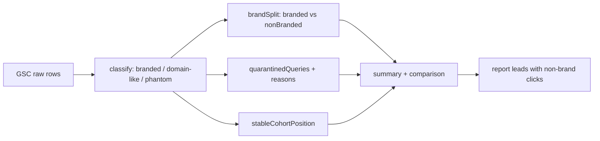

# PRD: SEO Reporting Signal Hygiene

**Status:** Implemented and verified locally
**Created:** 2026-08-25
**Owner:** TBD
**Source data:** GSC exports 2026-08-25 (90d weekly series, 28d comparison, per-query dimension breakdowns)

`Complexity: 4 → MEDIUM mode` (touches 6-10 files +2, external API integration +1, no new system, no schema)

---

## 1. Context

**Problem:** Every SEO report this project generates leads with a headline click number that mixes three unrelated signals — branded demand, real organic performance, and a phantom impression cluster with a 0.002% CTR. Four consecutive reports have opened by diagnosing a "decline" that is 70% branded decay, and the actual organic trend has been growing the whole time.

**Files analyzed:**

- `.claude/skills/gsc-analysis/scripts/gsc-fetch.cjs` (lines 919-956, 1236-1244)
- `.claude/skills/gsc-analysis/SKILL.md`, `.claude/skills/gsc-analysis/prompt.md`
- `.claude/skills/seo-growth-plan/`, `.claude/skills/wtf-should-i-do-next/`
- `scripts/seo/ctr-report.ts`, `scripts/seo/sync-page-performance.ts`
- `docs/SEO/reports/2026-08-17-gsc-decline-root-cause.md`, `gsc-drop-diagnosis-2026-08-08.md`, `gsc-performance-diagnosis-2026-07-30.md`, `seo-growth-plan-2026-08-22.md`

### Current behavior

The fetcher already knows the difference. `gsc-fetch.cjs:925-927` builds brand patterns and computes `nonBrandedQueries` by filtering `isBranded` and `isDomainLike`, and exposes it at line 1244 as `topNonBrandedQueries`.

But `summary`, `comparison`, and `searchTypeSummary` — the three fields the SKILL's own analysis workflow tells the reader to look at **first** — are computed across all queries with no split. The correct data is present and the headline ignores it.

### What that costs, measured

28-day comparison (2026-07-26→2026-08-22 vs 2026-06-28→2026-07-25), as currently reported:

> clicks 9,382 → 7,331, **-21.86%**

Decomposed:

| Segment              |  Prev | Current |    Change | Is this SEO?                                                                 |
| -------------------- | ----: | ------: | --------: | ---------------------------------------------------------------------------- |
| `myimageupscaler`    | 1,498 |     678 |  **-820** | No — position held at **1.0**; impressions fell 3,053 → 1,280                |
| `my image upscaler`  |   820 |     222 |  **-598** | No — position held at **1.0**                                                |
| other brand variants |   ~59 |     ~26 |       -33 | No                                                                           |
| GIF cluster          |  ~543 |     ~32 |      -511 | Yes — see [`gif-intent-defragmentation.md`](./gif-intent-defragmentation.md) |
| **everything else**  |     — |       — | **≈ -90** | Essentially flat                                                             |

**Branded queries account for ~70% of the reported decline, at unchanged position 1.** The GIF consolidation accounts for nearly all of the rest.

### The trend the headline hides

Non-brand, non-GIF, non-phantom weekly clicks:

| Week of    | Clicks | Impressions |
| ---------- | -----: | ----------: |
| 2026-06-14 |    373 |      20,562 |
| 2026-07-12 |    729 |      33,388 |
| 2026-08-02 |    782 |      42,267 |
| 2026-08-16 |    586 |      36,623 |

Up **57%** in clicks and **78%** in impressions across the window. The SEO work is producing traffic. No report has said so, because no report computes this series.

Branded impressions over the same window: 1,154 → 1,966 (peak, week of 2026-07-05) → 919. Current branded demand sits ~12% **below** the May baseline of ~1,050, after a Jun-Jul spike decayed. That residual erosion is consistent with the July 17 signup regression already documented in `2026-08-17-gsc-decline-root-cause.md` — a product problem with a product fix, not an SEO problem.

### The phantom cluster

`how to fix pixelated photos`, over 90 days:

| Dimension        | Value                                                                                                                        |
| ---------------- | ---------------------------------------------------------------------------------------------------------------------------- |
| Impressions      | **168,153**                                                                                                                  |
| Clicks           | **3**                                                                                                                        |
| CTR              | **0.0018%**                                                                                                                  |
| Average position | 10.0                                                                                                                         |
| Device           | 89% **desktop**, 11% mobile                                                                                                  |
| Top countries    | Brazil 45,233 · Ukraine 9,728 · Spain 9,414 · Argentina 7,625 · France 7,004 · Indonesia 5,372 · Korea 4,914 · **USA 3,732** |
| Owning page      | `/blog/fixing-pixelated-photos` (168,153 of them)                                                                            |

An English-language query drawing 27% of its impressions from Brazil, 89% from desktop, and producing three clicks in three months is not human search demand at position 10. Normal position-10 CTR is 1.5-2.5%; this is roughly a thousandth of that.

It is 12.4% of all site impressions in the 28-day window. It single-handedly produces most of the reported **-24.71% CTR** and **+4.18 average position** movement. The 2026-08-22 growth plan already caught this and correctly refused to consolidate on it — but it had to catch it by hand, and the next report will have to catch it by hand again.

### Position dilution corrupts page-level readings too, not just sitewide

The GIF investigation produced a clean example of how badly this misleads. `/formats/upscale-gif-images` reports an **average position of 7.90** over 2026-08-09→2026-08-22, which reads as a full recovery from its 19.11 collapse. It is not:

| Owner query    | Pre (07-05→07-18)           | Now (08-09→08-22)        |
| -------------- | --------------------------- | ------------------------ |
| `gif upscaler` | 668 imp / **pos 5.6**       | 48 imp / **pos 13.9**    |
| `upscale gif`  | 365 imp / **pos 6.9**       | 40 imp / **pos 16.1**    |
| `enhance gif`  | 237 imp / **pos 7.8**       | 15 imp / **pos 32.3**    |
| **Footprint**  | **115 queries · 3,564 imp** | **65 queries · 426 imp** |

Every head query got materially worse. The 7.90 average survives only because the head queries lost the impression weight that used to dominate it, leaving long-tail rows that happen to sit near position 8. A reader trusting the page-level average would have closed the incident.

**No average position — sitewide or per-page — is interpretable without the query footprint that produced it.**

### Average position dilution, sitewide

Sitewide average position moved 10.7 → 19.7 over the 90-day window while impressions stayed roughly flat. The page-level comparison shows **280 pages new to the window**, several with thousands of impressions at position 50-70 (`/scale/4k-image-upscaler` 2,557 impressions @ 68.5; `/free/free-photo-enhancer` 3,241 @ 68.6). Impression-weighted average position falls mechanically when a pSEO expansion lands. Reporting it as a ranking decline is a category error.

---

## 2. Solution

**Approach:**

- Split every headline metric by brand / non-brand at the source, so the split cannot be skipped by whoever reads the export next.
- Detect and quarantine phantom impression clusters automatically, and exclude them from CTR and position aggregates while still reporting them by name.
- Report average position over a stable page cohort alongside the all-pages figure, so pSEO expansion stops reading as decline.
- Update the skill's analysis workflow so the generated report leads with non-brand clicks.

**Key decisions:**

- [ ] Extend the existing `isBranded` / `isDomainLike` classification rather than adding a second brand list. `buildBrandPatterns(siteUrl)` already exists and is already applied per query — the gap is purely in aggregation.
- [ ] Phantom detection is **threshold-based and reported, never silently dropped.** A cluster is quarantined when it exceeds 5,000 impressions with a CTR below 0.05% over the window. Quarantined rows appear in a named `quarantinedQueries` array with the reason, so a real query that trips the heuristic is visible and can be reinstated.
- [ ] No change to what is fetched from GSC. This is entirely an aggregation and presentation change — the raw rows already contain everything needed.

**Data changes:** None. New fields on the JSON export only.



---

## Integration Ledger

| #   | New thing                                      | Live caller (`file:line`, non-test)                                              | Replaces                               | Old path removed?                          | Negative control                                                                                         |
| --- | ---------------------------------------------- | -------------------------------------------------------------------------------- | -------------------------------------- | ------------------------------------------ | -------------------------------------------------------------------------------------------------------- |
| 1   | `summary.brandSplit` / `comparison.brandSplit` | `gsc-fetch.cjs` (TBD line) in the summary builder; consumed by `SKILL.md` Step 2 | undifferentiated `summary.totalClicks` | headline retained _alongside_, never alone | stub all queries as branded → `nonBranded.clicks` must be 0, test fails if it mirrors the total          |
| 2   | `quarantinedQueries`                           | `gsc-fetch.cjs` (TBD line); consumed by the CTR/position aggregation             | nothing — no phantom handling existed  | n/a                                        | feed a 168k-impression / 3-click fixture → must be quarantined; a 168k / 3,000-click fixture must not be |
| 3   | `stableCohortPosition`                         | `gsc-fetch.cjs` (TBD line)                                                       | position reported over all pages only  | reported alongside, not replaced           | add 280 synthetic pos-68 pages → all-pages position moves, cohort position does not                      |
| 4   | Non-brand-first workflow                       | `.claude/skills/gsc-analysis/SKILL.md` Step 2 and `prompt.md` (TBD lines)        | brand-blind Step 2 ordering            | replaced                                   | n/a — documentation; verified by Phase 4's report replay                                                 |

### Reachability

**How will this feature be reached?**

- [x] Entry point: `node .claude/skills/gsc-analysis/scripts/gsc-fetch.cjs` — invoked by the `gsc-analysis`, `seo-growth-plan`, and `wtf-should-i-do-next` skills
- [x] Pre-existing files EDITED: `gsc-fetch.cjs`, `SKILL.md`, `prompt.md`
- [x] Registration: already the registered fetcher for three skills; no new registration

**Is this user-facing?**

- [ ] YES → no UI
- [x] NO → internal analysis tooling. **Trigger:** any SEO analysis request. The "user" is the human and the agents reading the exports.

**Full flow:**

1. Someone asks "are our SEO efforts working?"
2. Triggers: the `gsc-analysis` skill runs `gsc-fetch.cjs`.
3. Reaches the change via: `summary.brandSplit` and `quarantinedQueries` in the emitted JSON, and the reordered Step 2 in `SKILL.md`.
4. Result observable in: the generated report opening with non-brand clicks instead of a blended total.

**What does this replace?**

- [x] Replaces: the brand-blind aggregation in the summary builder → replaced in Phase 1. The blended total stays in the payload for continuity, but never stands alone.

---

## 4. Execution Phases

#### Phase 1: Split every headline metric by brand

**Files (max 5):**

- `.claude/skills/gsc-analysis/scripts/gsc-fetch.cjs` - EDIT: compute `brandSplit` in the summary/comparison builder near lines 925-956; expose on `summary`, `comparison`, and each `searchTypeSummary` entry
- `tests/unit/seo/gsc-brand-split.unit.spec.ts` - NEW
- `.claude/skills/gsc-analysis/SKILL.md` - EDIT: document the new output shape

**Implementation:**

- [ ] Reuse `buildBrandPatterns(siteUrl)` and the existing per-query `isBranded` / `isDomainLike` flags — do not introduce a second brand definition.
- [ ] Emit `{ branded: {clicks, impressions, ctr, position}, nonBranded: {...} }` for current and previous periods, plus deltas for each.
- [ ] Keep `totalClicks` unchanged so existing consumers do not break.

**Wiring:**

- [ ] Caller edited: `gsc-fetch.cjs` summary builder now populates the field on every emitted summary
- [ ] Registration: n/a — already the live fetcher for three skills
- [ ] Old path: blended-only reporting superseded; blended value retained as a sibling field
- [ ] Ledger rows filled: #1

**Tests Required:**

| Test File                                     | Test Name                                                                       | Assertion                                                                                  | Negative control (must be observed red)                                    |
| --------------------------------------------- | ------------------------------------------------------------------------------- | ------------------------------------------------------------------------------------------ | -------------------------------------------------------------------------- |
| `tests/unit/seo/gsc-brand-split.unit.spec.ts` | `should attribute myimageupscaler and my image upscaler to the branded segment` | both land in `branded`, neither in `nonBranded`                                            | classify them as non-brand → test fails                                    |
| `tests/unit/seo/gsc-brand-split.unit.spec.ts` | `should report a growing non-brand segment when the branded segment shrinks`    | replay of the real 28d fixture: `branded.clicks` delta ≈ -1,451, `nonBranded` delta ≈ -600 | compute both from the blended total → both deltas equal -2,051, test fails |
| `tests/unit/seo/gsc-brand-split.unit.spec.ts` | `should keep branded and non-brand clicks summing to the blended total`         | `branded + nonBranded === totalClicks`                                                     | drop domain-like queries from both buckets → test fails                    |

**Revert check:** removing `brandSplit` from the builder turns all three tests red.

**User Verification:**

- Action: `node .claude/skills/gsc-analysis/scripts/gsc-fetch.cjs --site=myimageupscaler.com --days=28 --output=/tmp/x.json && jq '.comparison.brandSplit' /tmp/x.json`
- Expected: branded clicks ~1,451 down at position ~1.0; non-brand clicks down ~600

---

#### Phase 2: Quarantine phantom impression clusters

Proved on the **real production subject**: `how to fix pixelated photos` at 168,153 impressions / 3 clicks. Not a synthetic row.

**Files (max 5):**

- `.claude/skills/gsc-analysis/scripts/gsc-fetch.cjs` - EDIT: add classification and a `quarantinedQueries` array; exclude quarantined rows from CTR and position aggregates
- `tests/unit/seo/gsc-phantom-quarantine.unit.spec.ts` - NEW
- `.claude/skills/gsc-analysis/SKILL.md` - EDIT: document the threshold and the reinstatement path

**Implementation:**

- [ ] Threshold: impressions > 5,000 **and** CTR < 0.05% over the window.
- [ ] Emit each quarantined row with `{query, impressions, clicks, ctr, position, reason, topCountry, topDevice}` so the decision is auditable.
- [ ] Report a `ctrExQuarantine` and `positionExQuarantine` **alongside** the raw figures — never overwrite them.
- [ ] Do not filter these rows out of `queries`. They stay in the array, flagged.

**Wiring:**

- [ ] Caller edited: the CTR/position aggregation in `gsc-fetch.cjs` consumes the quarantine set
- [ ] Registration: n/a
- [ ] Old path: n/a — no phantom handling existed
- [ ] Ledger rows filled: #2

**Tests Required:**

| Test File                                            | Test Name                                                       | Assertion                                     | Negative control (must be observed red)      |
| ---------------------------------------------------- | --------------------------------------------------------------- | --------------------------------------------- | -------------------------------------------- |
| `tests/unit/seo/gsc-phantom-quarantine.unit.spec.ts` | `should quarantine a 168k-impression 3-click query`             | appears in `quarantinedQueries` with a reason | raise the threshold above 168k → test fails  |
| `tests/unit/seo/gsc-phantom-quarantine.unit.spec.ts` | `should not quarantine a high-impression query with normal CTR` | 168k impressions / 3,000 clicks stays out     | quarantine on impressions alone → test fails |
| `tests/unit/seo/gsc-phantom-quarantine.unit.spec.ts` | `should still list quarantined queries in the queries array`    | present, flagged, not deleted                 | filter them out → test fails                 |
| `tests/unit/seo/gsc-phantom-quarantine.unit.spec.ts` | `should report CTR excluding quarantine above raw CTR`          | `ctrExQuarantine > ctr` on the real fixture   | compute both from the same set → test fails  |

**Revert check:** removing the quarantine step turns all four tests red.

**User Verification:**

- Action: `jq '.quarantinedQueries[] | {query, impressions, clicks, reason}' /tmp/x.json`
- Expected: `how to fix pixelated photos` listed, with `ctrExQuarantine` materially above the raw 2.06%

---

#### Phase 3: Report position over a stable page cohort

**Files (max 5):**

- `.claude/skills/gsc-analysis/scripts/gsc-fetch.cjs` - EDIT: compute `stableCohortPosition` over pages present with impressions in **both** periods
- `tests/unit/seo/gsc-stable-cohort.unit.spec.ts` - NEW
- `.claude/skills/gsc-analysis/SKILL.md` - EDIT: document it

**Implementation:**

- [ ] Cohort = pages with impressions in both the current and previous windows. The 28d comparison already identifies 280 new and 197 lost pages; reuse that classification.
- [ ] Emit alongside the all-pages position. Both are true; only one answers "did our rankings get worse".

**Wiring:**

- [ ] Caller edited: `gsc-fetch.cjs` page-comparison builder
- [ ] Registration: n/a
- [ ] Old path: retained alongside
- [ ] Ledger rows filled: #3

**Tests Required:**

| Test File                                       | Test Name                                                                  | Assertion                                                                | Negative control (must be observed red)    |
| ----------------------------------------------- | -------------------------------------------------------------------------- | ------------------------------------------------------------------------ | ------------------------------------------ |
| `tests/unit/seo/gsc-stable-cohort.unit.spec.ts` | `should hold cohort position steady when new deep-ranking pages are added` | adding 280 pos-68 pages moves all-pages position but not cohort position | compute cohort over all pages → test fails |
| `tests/unit/seo/gsc-stable-cohort.unit.spec.ts` | `should exclude pages absent from either period`                           | new and lost pages excluded                                              | include new pages → test fails             |

**Revert check:** removing the cohort computation turns both tests red.

---

#### Phase 4: Make the workflow lead with the clean signal — replay the misdiagnosis and watch it not recur

**Files (max 5):**

- `.claude/skills/gsc-analysis/SKILL.md` - EDIT: reorder Step 2 so `brandSplit`, `quarantinedQueries`, and `stableCohortPosition` are read before `summary`/`comparison`
- `.claude/skills/gsc-analysis/prompt.md` - EDIT: require the report to open with non-brand clicks and to state branded movement separately
- `.claude/skills/seo-growth-plan/SKILL.md` - EDIT: same ordering
- `docs/SEO/maintenance/seo-changes-backlog.md` - EDIT: append the entry
- `docs/SEO/reports/brand-vs-nonbrand-baseline-2026-08-25.md` - NEW: the weekly series above, as the reference baseline

**Implementation:**

- [ ] Require any report claiming a decline to attribute it across branded / non-brand / quarantined before recommending action.
- [ ] Require average position claims to cite `stableCohortPosition`.
- [ ] Add an explicit rule: **a query at position 1.0 with falling impressions is a demand change, not a ranking change, and never justifies a metadata rewrite.** This exact error was avoided by hand in the 2026-08-04 report; encode it so it does not depend on the reader catching it.

**Wiring:**

- [ ] Caller edited: three SKILL files that drive report generation
- [ ] Registration: skills are already registered
- [ ] Old path: brand-blind Step 2 ordering **replaced**, not appended to
- [ ] Ledger rows filled: #4

**Tests Required:**

| Test File                                        | Test Name                                                       | Assertion                                             | Negative control (must be observed red) |
| ------------------------------------------------ | --------------------------------------------------------------- | ----------------------------------------------------- | --------------------------------------- |
| `tests/unit/seo/gsc-skill-contract.unit.spec.ts` | `should require brandSplit in the documented analysis workflow` | `SKILL.md` Step 2 names `brandSplit` before `summary` | revert the ordering → test fails        |
| `tests/unit/seo/gsc-skill-contract.unit.spec.ts` | `should document the phantom quarantine threshold`              | threshold values present in `SKILL.md`                | remove the section → test fails         |

**Revert check:** reverting `SKILL.md` turns both tests red.

**User Verification (the real gate for this PRD):**

- Action: re-run the full analysis against the same 2026-07-26→2026-08-22 window that produced the "-21.86% decline" reading
- Expected: the report opens with non-brand clicks and their trend, states branded movement separately as demand at position 1.0, names the quarantined query, and does **not** characterize the period as a broad SEO decline

---

## 5. Checkpoint Protocol

Automated `prd-work-reviewer` checkpoint after every phase with the integration audit prompt. No manual checkpoint required — there is no UI and no external service mutation. Phase 4's replay is the substantive verification and is specified above as a User Verification step.

---

## 6. Verification Strategy

### Integration Proof

```bash
# 1. Caller census — the new fields must be consumed by the skills, not just emitted
grep -rn "brandSplit\|quarantinedQueries\|stableCohortPosition" .claude/skills/ docs/ \
  | grep -v '/tests/'
# Expected: hits in SKILL.md / prompt.md, not only in the fetcher

# 2. Revert check
git stash -- .claude/skills/gsc-analysis/scripts/gsc-fetch.cjs \
  && yarn vitest run tests/unit/seo/gsc-brand-split.unit.spec.ts
# Expected: FAIL. Then: git stash pop

# 3. Live replay against the real window — paste raw output
node .claude/skills/gsc-analysis/scripts/gsc-fetch.cjs --site=myimageupscaler.com --days=28 --output=/tmp/hygiene.json
jq '{blended: .comparison.deltaPct.clicks, brandSplit: .comparison.brandSplit, quarantined: [.quarantinedQueries[].query], cohortPos: .comparison.stableCohortPosition}' /tmp/hygiene.json
# Expected: blended ≈ -21.86; branded delta ≈ -1,451 at position ~1.0;
#           quarantined includes "how to fix pixelated photos";
#           cohort position materially better than the all-pages figure
```

### Baseline to beat (recorded 2026-08-25)

| Metric                                                   | Baseline                                     | Target                                       |
| -------------------------------------------------------- | -------------------------------------------- | -------------------------------------------- |
| Headline reported to a human                             | blended `-21.86% clicks`                     | non-brand clicks + branded stated separately |
| Brand attribution in reports                             | manual, per-report, sometimes missed         | automatic, in the export                     |
| `how to fix pixelated photos` in CTR/position aggregates | included (12.4% of impressions, 0.0018% CTR) | quarantined and named                        |
| Average position claim                                   | 10.7 → 19.7 "decline"                        | stable-cohort position reported alongside    |
| Reports opening on a misattributed decline               | 4 of the last 4                              | 0                                            |

---

## 7. Acceptance Criteria

Consumer-scoped:

- [ ] Re-running the analysis over the window that produced the "-21.86% decline" reading yields a report that identifies branded decay as the primary cause and does not recommend SEO remediation for it
- [ ] A reader who sees only the first paragraph of a generated report learns whether non-brand organic traffic went up or down
- [ ] A query at position 1.0 with falling impressions never again produces a metadata-rewrite recommendation
- [ ] Adding a batch of new pSEO pages does not make the next report say rankings declined
- [ ] `how to fix pixelated photos` is named as quarantined rather than silently inflating impressions and deflating CTR

Binary done checks:

- [ ] All phases complete
- [ ] All specified tests pass
- [ ] `yarn verify` passes
- [ ] All automated checkpoint reviews passed
- [ ] Integration Ledger has zero `TBD` cells
- [ ] Every new field has a non-test consumer (caller census pasted)
- [ ] Revert check passed
- [ ] Every gate has a negative control that was observed failing
- [ ] `docs/SEO/maintenance/seo-changes-backlog.md` entry appended
