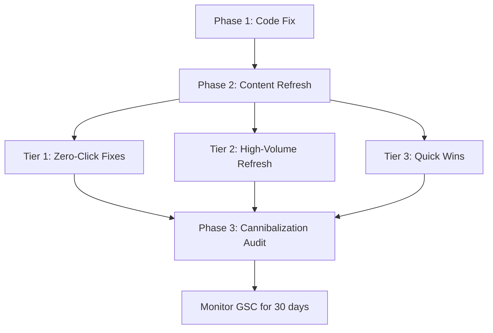

# Blog 3 Kings Content Refresh — Low-Hanging Fruit SEO

**Status:** Ready
**Complexity:** 5
**Date:** 2026-03-20
**GitHub Issue:** —

## Context / Problem Statement

Our blog generates **12.6K impressions/3mo** across 53 articles but only **27 clicks** (0.2% CTR). GSC data reveals:

- **6 articles rank on page 1 (pos 1–10) with ZERO clicks** — purely a title/meta failure
- **3 articles at positions 8–13** with 1K+ impressions — one push from major traffic
- Title tag always equals H1 (violates 3 Kings best practice)

**Critical code gap discovered:** The `seo_title` and `seo_description` fields exist in the `blog_posts` schema but are **never used** in `generateMetadata()`. The page always renders `post.title` for both the `<title>` tag and `<h1>`, making it impossible to independently optimize the title tag vs H1.

### Files Analyzed

- `app/[locale]/blog/[slug]/page.tsx` — metadata + rendering (line 146: `title: post.title`)
- `server/services/blog.service.ts` — hybrid data fetching
- `shared/validation/blog.schema.ts` — `seo_title` (max 70), `seo_description` (max 160) exist but unused

### 3 Kings Strategy

| King | Element | Current Source | Should Be |
|------|---------|---------------|-----------|
| 1 | Title tag (`<title>`) | `post.title` | `post.seo_title \|\| post.title` |
| 2 | H1 heading | `post.title` | `post.title` (no change) |
| 3 | First paragraph | `post.description` + content intro | Refreshed copy with primary keyword + value prop |

## Solution

### Phase 1: Enable Independent Title Tag Optimization (Code Fix)

**Files to modify:**
- `app/[locale]/blog/[slug]/page.tsx`

**Implementation:**

- [ ] Update `generateMetadata()` to prefer `seo_title` over `title` for the `<title>` tag
- [ ] Update `generateMetadata()` to prefer `seo_description` over `description` for meta description
- [ ] Keep OpenGraph title using `post.title` (social shares should use the natural title)
- [ ] Ensure `getPostFromDatabase()` already returns `seo_title` and `seo_description` (it does via `SELECT *`)

```
// page.tsx generateMetadata() — target state
return {
  title: post.seo_title || post.title,
  description: post.seo_description || post.description,
  // ... openGraph keeps using post.title
};
```

**Tests Required:**

| Test File | Test Name | Assertion |
|-----------|-----------|-----------|
| `tests/unit/seo/blog-metadata.unit.spec.ts` | renders seo_title in metadata when set | `<title>` uses `seo_title` |
| `tests/unit/seo/blog-metadata.unit.spec.ts` | falls back to title when seo_title is empty | `<title>` uses `title` |
| `tests/unit/seo/blog-metadata.unit.spec.ts` | OpenGraph title always uses post.title | OG title != seo_title |
| `tests/unit/seo/blog-metadata.unit.spec.ts` | renders seo_description when set | meta description uses `seo_description` |

**Verification:**
- [ ] `yarn verify` passes
- [ ] Blog post with `seo_title` set renders different `<title>` vs `<h1>`

---

### Phase 2: Content Refresh — Priority Articles

Database updates via Supabase to set `seo_title`, `seo_description`, and content intro for target articles.

#### Tier 1: URGENT — Page 1 with Zero Clicks (Meta/Title Fix Only)

These articles are already ranking well but getting ZERO clicks. This is the highest-ROI work.

| # | Slug | Impressions | Clicks | CTR | Position | Problem |
|---|------|------------|--------|-----|----------|---------|
| 1 | `best-image-upscaling-tools-2026` | 390 | 0 | 0% | 7.2 | Title too generic, position 7 should be getting 3-5% CTR |
| 2 | `how-to-upscale-midjourney-images-for-print` | 246 | 0 | 0% | 6.3 | Pos 6 with zero clicks = terrible snippet |
| 3 | `ai-vs-traditional-image-upscaling` | 184 | 0 | 0% | 6.5 | Pos 6.5, zero clicks = title doesn't match intent |

**Actions per article:**
- [ ] Set `seo_title` — compelling, keyword-rich, under 60 chars (sweet spot), include year or power word
- [ ] Set `seo_description` — clear value prop, include call-to-action, under 155 chars
- [ ] Refresh first 2 paragraphs of content — hook reader, state problem, promise solution
- [ ] Add FAQ section if missing (auto-generates FAQPage schema via existing `extractFaqSchema()`)

**Recommended Title Refreshes (Tier 1):**

| Slug | Current Title (Guess) | Proposed `seo_title` |
|------|----------------------|---------------------|
| `best-image-upscaling-tools-2026` | Best Image Upscaling Tools 2026 | `7 Best AI Image Upscalers in 2026 (Free & Paid, Tested)` |
| `how-to-upscale-midjourney-images-for-print` | How to Upscale Midjourney Images for Print | `Upscale Midjourney Art to Print Quality (4K–8K Guide)` |
| `ai-vs-traditional-image-upscaling` | AI vs Traditional Image Upscaling | `AI vs Traditional Upscaling: Real Quality Comparison` |

#### Tier 2: HIGH VOLUME — Biggest Impression Opportunities

| # | Slug | Impressions | Clicks | CTR | Position |
|---|------|------------|--------|-----|----------|
| 4 | `best-free-ai-image-upscaler-2026-tested-compared` | 3,026 | 2 | 0.1% | 8.8 |
| 5 | `best-ai-upscaler` | 1,281 | 1 | 0.1% | 11.3 |
| 6 | `upscale-image-for-print-300-dpi-guide` | 951 | 1 | 0.1% | 12.8 |

**Actions per article:**
- [ ] All Tier 1 actions plus:
- [ ] Add/refresh comparison table (for "best" articles)
- [ ] Add structured data hints (comparison tables, star ratings where appropriate)
- [ ] Strengthen internal linking to homepage upscaler tool
- [ ] Update content with 2026-current tool landscape
- [ ] Add a direct CTA to try MyImageUpscaler (embedded tool link)

**Recommended Title Refreshes (Tier 2):**

| Slug | Proposed `seo_title` |
|------|---------------------|
| `best-free-ai-image-upscaler-2026-tested-compared` | `Best Free AI Image Upscaler 2026: 9 Tools Tested & Ranked` |
| `best-ai-upscaler` | `Best AI Image Upscaler 2026: Top Picks for Any Photo` |
| `upscale-image-for-print-300-dpi-guide` | `How to Upscale Images to 300 DPI for Print (Step-by-Step)` |

#### Tier 3: SUPPORTING — Quick Wins at Positions 7–10

| # | Slug | Impressions | Clicks | CTR | Position |
|---|------|------------|--------|-----|----------|
| 7 | `photo-enhancement-upscaling-vs-quality` | 765 | 1 | 0.1% | 8.0 |
| 8 | `best-free-ai-image-upscaler-tools-2026` | 601 | 1 | 0.2% | 9.0 |
| 9 | `upscale-image-online-free` | 211 | 4 | 1.9% | 6.9 |
| 10 | `how-to-upscale-youtube-thumbnails` | 204 | 2 | 1.0% | 8.6 |
| 11 | `how-to-convert-png-to-4k` | 177 | 2 | 1.1% | 10.7 |

**Actions per article:**
- [ ] Set `seo_title` and `seo_description`
- [ ] Light content refresh on first paragraph
- [ ] Ensure FAQ section exists

**Recommended Title Refreshes (Tier 3):**

| Slug | Proposed `seo_title` |
|------|---------------------|
| `photo-enhancement-upscaling-vs-quality` | `Photo Upscaling vs Enhancement: What Actually Improves Quality?` |
| `best-free-ai-image-upscaler-tools-2026` | `5 Best Free AI Image Upscaler Tools (No Sign-Up, 2026)` |
| `upscale-image-online-free` | `Upscale Images Online Free — No Watermark, Instant Results` |
| `how-to-upscale-youtube-thumbnails` | `Make YouTube Thumbnails HD: Free Upscaling Guide (2026)` |
| `how-to-convert-png-to-4k` | `Convert PNG to 4K Resolution: Free AI Upscaler Method` |

### Phase 3: Cannibalization Audit

**Problem:** Two articles target nearly identical keywords:
- `best-free-ai-image-upscaler-2026-tested-compared` (3,026 imp, pos 8.8)
- `best-free-ai-image-upscaler-tools-2026` (601 imp, pos 9.0)
- `best-image-upscaling-tools-2026` (390 imp, pos 7.2)
- `best-ai-upscaler` (1,281 imp, pos 11.3)

**Actions:**
- [ ] Differentiate the `seo_title` and first paragraphs so each targets distinct intent
- [ ] Consider merging/redirecting `best-free-ai-image-upscaler-tools-2026` into the main comparison article if cannibalization persists after 30 days
- [ ] Monitor GSC for position changes after title refresh

**Differentiation Strategy:**

| Slug | Target Intent |
|------|---------------|
| `best-free-ai-image-upscaler-2026-tested-compared` | Comprehensive comparison ("which is best?") |
| `best-free-ai-image-upscaler-tools-2026` | Quick list for free tools specifically ("free upscaler no signup") |
| `best-image-upscaling-tools-2026` | General round-up including paid ("best tools overall") |
| `best-ai-upscaler` | Single-answer intent ("what's the best AI upscaler?") |

---

## Execution Sequence



## Expected Impact

| Metric | Current (3mo) | Target (3mo post-refresh) | Rationale |
|--------|-------------|--------------------------|-----------|
| Blog CTR | 0.2% | 1.5–3% | Industry avg for pos 5–10 is 3–5% CTR |
| Blog clicks | 27 | 150–400 | CTR lift on existing impressions |
| Tier 1 clicks | 0 | 30–60 | Page 1 articles going from 0% to ~3% CTR |
| Articles on page 1 | 6 | 9–11 | Tier 2/3 articles moving from pos 11–13 to top 10 |

## Acceptance Criteria

- [ ] `seo_title` renders in `<title>` when set, falls back to `title`
- [ ] `seo_description` renders in meta description when set, falls back to `description`
- [ ] OpenGraph title always uses `post.title` (not `seo_title`)
- [ ] H1 always uses `post.title` (not `seo_title`)
- [ ] All 11 priority articles have `seo_title` and `seo_description` set
- [ ] All Tier 1 and Tier 2 articles have refreshed first paragraphs
- [ ] No keyword cannibalization between similar articles (differentiated titles)
- [ ] `yarn verify` passes
- [ ] SEO metadata tests pass in `tests/unit/seo/`

## Out of Scope

- Creating new blog articles (focus is on refreshing existing)
- Backlink acquisition strategy
- Blog redesign or layout changes
- Articles ranking below position 20 (too much effort for uncertain return)
- Localized blog content (blog is English-only)
