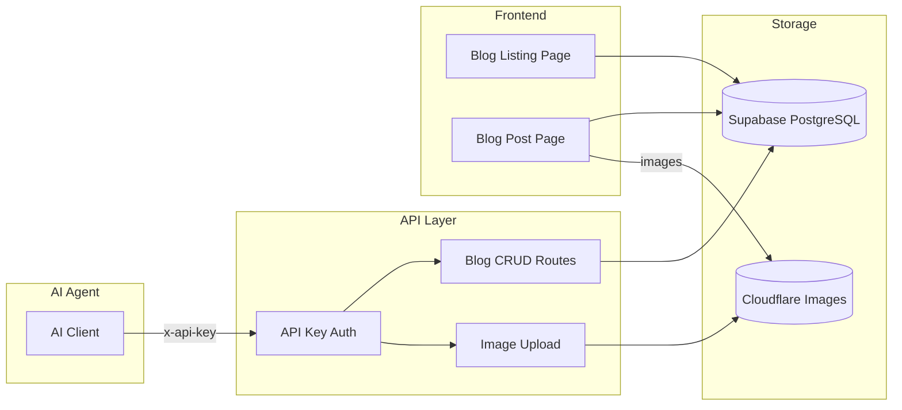

# Blog CRUD API (PRD Creator) - PRD

## 1. Context Analysis

### 1.1 Problem Statement

Currently, the blog system uses file-based MDX storage with static generation at build time. This prevents programmatic content creation and requires a redeploy for every new post. An AI agent needs a CRUD API to autonomously create and manage blog posts.

### 1.2 Current Behavior Summary

- **File-based storage**: MDX files in `/content/blog/`
- **Build-time processing**: `scripts/build-blog.ts` generates `blog-data.json`
- **No admin API**: All blog changes require code commits + rebuild
- **External images only**: Featured images use Unsplash URLs
- **No draft workflow**: All content is immediately public after deploy

### 1.3 Use Case

An AI agent will use this API to:
1. Create blog posts with markdown content
2. Upload and embed images (featured + inline)
3. Save drafts for review before publishing
4. Update existing posts
5. Manage the blog programmatically without human intervention

### 1.4 Files Analyzed

- `/server/blog.ts` - Current blog service (file-based)
- `/content/blog-data.json` - Generated blog index
- `/app/[locale]/blog/page.tsx` - Blog listing page
- `/app/[locale]/blog/[slug]/page.tsx` - Individual post page
- `/shared/config/env.ts` - Environment variable patterns
- `/lib/middleware/auth.ts` - Authentication patterns
- `/shared/config/security.ts` - PUBLIC_API_ROUTES config

---

## 2. Proposed Solution

### 2.1 Architecture Summary

| Component | Decision | Rationale |
|-----------|----------|-----------|
| **Storage** | Supabase PostgreSQL | Dynamic CRUD, no redeploy, full-text search capable |
| **Images** | Cloudflare Images (Pro plan) | Built-in optimization, resizing, global CDN |
| **Auth** | Dedicated API key | Separate from user JWT, easy rotation, AI-friendly |
| **Workflow** | Draft/Published states | Review before going live, unpublish capability |

### 2.2 Architecture Diagram



### 2.3 Data Model

#### `blog_posts` Table

```sql
CREATE TABLE public.blog_posts (
  id UUID PRIMARY KEY DEFAULT gen_random_uuid(),
  slug TEXT UNIQUE NOT NULL,
  title TEXT NOT NULL,
  description TEXT NOT NULL,
  content TEXT NOT NULL,  -- Markdown
  author TEXT NOT NULL DEFAULT 'MyImageUpscaler Team',
  category TEXT NOT NULL,
  tags TEXT[] NOT NULL DEFAULT '{}',
  featured_image_url TEXT,
  featured_image_alt TEXT,
  status TEXT NOT NULL DEFAULT 'draft' CHECK (status IN ('draft', 'published')),
  published_at TIMESTAMPTZ,
  reading_time TEXT,
  seo_title TEXT,
  seo_description TEXT,
  created_at TIMESTAMPTZ DEFAULT NOW() NOT NULL,
  updated_at TIMESTAMPTZ DEFAULT NOW() NOT NULL,
  created_by TEXT,

  CONSTRAINT valid_slug CHECK (slug ~ '^[a-z0-9]+(-[a-z0-9]+)*$'),
  CONSTRAINT published_requires_date CHECK (
    (status = 'published' AND published_at IS NOT NULL) OR status = 'draft'
  )
);

-- Indexes
CREATE INDEX idx_blog_posts_status ON public.blog_posts(status);
CREATE INDEX idx_blog_posts_published_at ON public.blog_posts(published_at DESC)
  WHERE status = 'published';
CREATE INDEX idx_blog_posts_category ON public.blog_posts(category);
CREATE INDEX idx_blog_posts_tags ON public.blog_posts USING GIN(tags);

-- RLS Policies
ALTER TABLE public.blog_posts ENABLE ROW LEVEL SECURITY;

CREATE POLICY "Service role full access" ON public.blog_posts
  FOR ALL USING (auth.role() = 'service_role');

CREATE POLICY "Public read published" ON public.blog_posts
  FOR SELECT USING (status = 'published');
```

#### `blog_media` Table (Optional - for tracking uploads)

```sql
CREATE TABLE public.blog_media (
  id UUID PRIMARY KEY DEFAULT gen_random_uuid(),
  filename TEXT NOT NULL,
  original_filename TEXT NOT NULL,
  mime_type TEXT NOT NULL,
  size_bytes INTEGER NOT NULL,
  r2_key TEXT UNIQUE NOT NULL,
  cdn_url TEXT NOT NULL,
  width INTEGER,
  height INTEGER,
  alt_text TEXT,
  created_at TIMESTAMPTZ DEFAULT NOW() NOT NULL,
  uploaded_by TEXT
);

CREATE INDEX idx_blog_media_r2_key ON public.blog_media(r2_key);

ALTER TABLE public.blog_media ENABLE ROW LEVEL SECURITY;

CREATE POLICY "Service role full access" ON public.blog_media
  FOR ALL USING (auth.role() = 'service_role');
```

---

## 3. API Specification

### 3.1 Authentication

All endpoints require API key authentication:

```
Header: x-api-key: <BLOG_API_KEY>
  -- OR --
Header: Authorization: ApiKey <BLOG_API_KEY>
```

### 3.2 Endpoints

| Endpoint | Method | Description |
|----------|--------|-------------|
| `/api/blog/posts` | POST | Create draft post |
| `/api/blog/posts` | GET | List posts (filter, paginate) |
| `/api/blog/posts/[slug]` | GET | Get single post |
| `/api/blog/posts/[slug]` | PATCH | Update post |
| `/api/blog/posts/[slug]` | DELETE | Delete post |
| `/api/blog/posts/[slug]/publish` | POST | Publish draft |
| `/api/blog/posts/[slug]/unpublish` | POST | Revert to draft |
| `/api/blog/images/upload` | POST | Upload image to R2 |

### 3.3 Request/Response Schemas

#### POST `/api/blog/posts` - Create Post

**Request:**
```json
{
  "slug": "my-new-post",
  "title": "My New Blog Post",
  "description": "A brief description for SEO and previews",
  "content": "# Introduction\n\nThis is markdown content...",
  "category": "Tutorials",
  "tags": ["ai", "image-processing"],
  "featured_image_url": "https://r2.myimageupscaler.com/blog/2026/01/image.jpg",
  "featured_image_alt": "Description of the image",
  "author": "MyImageUpscaler Team",
  "seo_title": "Optional SEO title override",
  "seo_description": "Optional SEO description override"
}
```

**Response (201):**
```json
{
  "success": true,
  "data": {
    "id": "uuid",
    "slug": "my-new-post",
    "status": "draft",
    "reading_time": "5 min read",
    "created_at": "2026-01-29T12:00:00Z",
    ...
  }
}
```

#### GET `/api/blog/posts` - List Posts

**Query Parameters:**
- `status` - Filter by `draft` or `published`
- `category` - Filter by category
- `tag` - Filter by tag
- `limit` - Max results (default: 20, max: 100)
- `offset` - Pagination offset (default: 0)
- `sort` - Sort field: `created_at`, `updated_at`, `published_at`, `title`
- `order` - Sort order: `asc`, `desc`

**Response (200):**
```json
{
  "success": true,
  "data": [...],
  "pagination": {
    "total": 42,
    "limit": 20,
    "offset": 0,
    "hasMore": true
  }
}
```

#### POST `/api/blog/posts/[slug]/publish`

**Response (200):**
```json
{
  "success": true,
  "data": {
    "slug": "my-new-post",
    "status": "published",
    "published_at": "2026-01-29T14:00:00Z"
  }
}
```

#### POST `/api/blog/images/upload`

**Request (multipart/form-data):**
```
file: <binary image data>
alt_text: "Optional alt text"
```

**Request (JSON with base64):**
```json
{
  "imageData": "data:image/jpeg;base64,/9j/4AAQ...",
  "filename": "my-image.jpg",
  "alt_text": "Optional alt text"
}
```

**Response (201):**
```json
{
  "success": true,
  "data": {
    "url": "https://blog-images.myimageupscaler.com/blog/2026/01/1706529600-my-image.jpg",
    "key": "blog/2026/01/1706529600-my-image.jpg",
    "filename": "1706529600-my-image.jpg"
  }
}
```

---

## 4. Detailed Implementation Spec

### 4.1 Environment Variables

**Add to `shared/config/env.ts` (serverEnvSchema):**

```typescript
// Blog API
BLOG_API_KEY: z.string().default(''),

// Cloudflare Images (Pro plan) for Blog Images
CLOUDFLARE_ACCOUNT_ID: z.string().default(''),
CLOUDFLARE_API_TOKEN: z.string().default(''), // API token with Images permissions
```

**Add to `loadServerEnv()`:**

```typescript
// Blog API
BLOG_API_KEY: process.env.BLOG_API_KEY || '',

// Cloudflare Images
CLOUDFLARE_ACCOUNT_ID: process.env.CLOUDFLARE_ACCOUNT_ID || '',
CLOUDFLARE_API_TOKEN: process.env.CLOUDFLARE_API_TOKEN || '',
```

### 4.2 Files to Create

| File | Purpose |
|------|---------|
| `supabase/migrations/XXXXXX_create_blog_posts.sql` | Database migration |
| `lib/middleware/blogApiAuth.ts` | API key authentication |
| `shared/validation/blog.schema.ts` | Zod validation schemas |
| `server/services/blog.service.ts` | Blog database service |
| `server/services/cloudflareImages.service.ts` | Cloudflare Images upload service |
| `app/api/blog/posts/route.ts` | Create + List endpoints |
| `app/api/blog/posts/[slug]/route.ts` | Get + Update + Delete |
| `app/api/blog/posts/[slug]/publish/route.ts` | Publish endpoint |
| `app/api/blog/posts/[slug]/unpublish/route.ts` | Unpublish endpoint |
| `app/api/blog/images/upload/route.ts` | Image upload endpoint |
| `scripts/migrate-blog-to-supabase.ts` | Migration script for existing posts |

### 4.3 Files to Modify

| File | Changes |
|------|---------|
| `shared/config/env.ts` | Add Blog API + R2 env vars |
| `shared/config/security.ts` | Add `/api/blog/*` to PUBLIC_API_ROUTES |
| `app/[locale]/blog/page.tsx` | Use Supabase instead of JSON file |
| `app/[locale]/blog/[slug]/page.tsx` | Use Supabase instead of JSON file |

### 4.4 API Key Authentication Middleware

**`lib/middleware/blogApiAuth.ts`:**

```typescript
import { NextRequest, NextResponse } from 'next/server';
import { serverEnv } from '@shared/config/env';

export interface IBlogApiAuthResult {
  authenticated: boolean;
  error?: NextResponse;
  apiKeyId?: string;
}

export async function verifyBlogApiAuth(req: NextRequest): Promise<IBlogApiAuthResult> {
  const apiKey =
    req.headers.get('x-api-key') ||
    extractApiKeyFromAuth(req.headers.get('Authorization'));

  if (!apiKey) {
    return {
      authenticated: false,
      error: NextResponse.json(
        { success: false, error: { code: 'UNAUTHORIZED', message: 'API key required' } },
        { status: 401 }
      ),
    };
  }

  if (!serverEnv.BLOG_API_KEY || apiKey !== serverEnv.BLOG_API_KEY) {
    return {
      authenticated: false,
      error: NextResponse.json(
        { success: false, error: { code: 'UNAUTHORIZED', message: 'Invalid API key' } },
        { status: 401 }
      ),
    };
  }

  return { authenticated: true, apiKeyId: 'blog-ai-agent' };
}

function extractApiKeyFromAuth(authHeader: string | null): string | null {
  if (!authHeader?.startsWith('ApiKey ')) return null;
  return authHeader.substring(7);
}
```

### 4.5 Validation Schemas

**`shared/validation/blog.schema.ts`:**

```typescript
import { z } from 'zod';

const slugSchema = z
  .string()
  .min(3, 'Slug must be at least 3 characters')
  .max(100, 'Slug must be at most 100 characters')
  .regex(/^[a-z0-9]+(-[a-z0-9]+)*$/, 'Slug must be lowercase with hyphens only');

export const blogStatusSchema = z.enum(['draft', 'published']);

export const createBlogPostSchema = z.object({
  slug: slugSchema,
  title: z.string().min(5).max(200),
  description: z.string().min(20).max(500),
  content: z.string().min(100),
  author: z.string().default('MyImageUpscaler Team'),
  category: z.string().min(2).max(50),
  tags: z.array(z.string().min(2).max(30)).max(10).default([]),
  featured_image_url: z.string().url().optional(),
  featured_image_alt: z.string().max(200).optional(),
  seo_title: z.string().max(70).optional(),
  seo_description: z.string().max(160).optional(),
});

export const updateBlogPostSchema = createBlogPostSchema
  .omit({ slug: true })
  .partial();

export const listBlogPostsSchema = z.object({
  status: blogStatusSchema.optional(),
  category: z.string().optional(),
  tag: z.string().optional(),
  limit: z.coerce.number().min(1).max(100).default(20),
  offset: z.coerce.number().min(0).default(0),
  sort: z.enum(['created_at', 'updated_at', 'published_at', 'title']).default('created_at'),
  order: z.enum(['asc', 'desc']).default('desc'),
});

export type ICreateBlogPostInput = z.infer<typeof createBlogPostSchema>;
export type IUpdateBlogPostInput = z.infer<typeof updateBlogPostSchema>;
export type IListBlogPostsQuery = z.infer<typeof listBlogPostsSchema>;
```

### 4.6 Cloudflare Images Upload Service

**`server/services/cloudflareImages.service.ts`:**

```typescript
import { serverEnv } from '@shared/config/env';

/**
 * Upload image to Cloudflare Images
 * Uses Cloudflare Images API v2
 * Requires Pro plan with Cloudflare Images enabled
 */
export async function uploadToCloudflareImages(
  buffer: Buffer,
  filename: string,
  mimeType: string
): Promise<{ url: string; id: string }> {
  // Create FormData for Cloudflare Images API
  const formData = new FormData();
  formData.append('file', new Blob([buffer], { type: mimeType }), filename);
  // Require variants (original + optimized)
  formData.append('requireSignedURLs', 'false');

  const response = await fetch(
    `https://api.cloudflare.com/client/v4/accounts/${serverEnv.CLOUDFLARE_ACCOUNT_ID}/images/v1`,
    {
      method: 'POST',
      headers: {
        'Authorization': `Bearer ${serverEnv.CLOUDFLARE_API_TOKEN}`,
      },
      body: formData,
    }
  );

  if (!response.ok) {
    const error = await response.text();
    throw new Error(`Cloudflare Images upload failed: ${error}`);
  }

  const data = await response.json();

  // Return the direct URL and image ID
  return {
    url: data.result.variants?.[0] || data.result.display_url,
    id: data.result.id,
  };
}
```

---

## 5. Frontend Migration (UI Changes)

### 5.1 Current State

The blog UI currently loads data from a static JSON file generated at build time:

```typescript
// server/blog.ts
import blogData from '@/content/blog-data.json';

export function getAllPosts(): IBlogPostMeta[] {
  return blogData.posts;
}

export function getPostBySlug(slug: string): IBlogPost | undefined {
  return blogData.posts.find(post => post.slug === slug);
}
```

**Problem**: This requires a rebuild/redeploy for any content change.

### 5.2 New Blog Service

**`server/services/blog.service.ts`:**

```typescript
import { supabaseAdmin } from '@/server/supabase/supabaseAdmin';

export interface IBlogPost {
  id: string;
  slug: string;
  title: string;
  description: string;
  content: string;
  author: string;
  category: string;
  tags: string[];
  featured_image_url?: string;
  featured_image_alt?: string;
  status: 'draft' | 'published';
  published_at?: string;
  reading_time?: string;
  created_at: string;
  updated_at: string;
}

export interface IBlogPostMeta {
  slug: string;
  title: string;
  description: string;
  date: string;
  author: string;
  category: string;
  tags: string[];
  image?: string;
  readingTime: string;
}

/**
 * Get all published posts for frontend rendering
 * Replaces file-based getAllPosts()
 */
export async function getAllPublishedPosts(): Promise<IBlogPostMeta[]> {
  const { data, error } = await supabaseAdmin
    .from('blog_posts')
    .select('slug, title, description, published_at, author, category, tags, featured_image_url, reading_time')
    .eq('status', 'published')
    .order('published_at', { ascending: false });

  if (error) throw error;

  return (data || []).map(post => ({
    slug: post.slug,
    title: post.title,
    description: post.description,
    date: post.published_at,
    author: post.author,
    category: post.category,
    tags: post.tags,
    image: post.featured_image_url,
    readingTime: post.reading_time || '5 min read',
  }));
}

/**
 * Get single published post by slug
 * Replaces file-based getPostBySlug()
 */
export async function getPublishedPostBySlug(slug: string): Promise<IBlogPost | null> {
  const { data, error } = await supabaseAdmin
    .from('blog_posts')
    .select('*')
    .eq('slug', slug)
    .eq('status', 'published')
    .single();

  if (error || !data) return null;
  return data as IBlogPost;
}

/**
 * Get all published slugs for static generation
 */
export async function getAllPublishedSlugs(): Promise<string[]> {
  const { data, error } = await supabaseAdmin
    .from('blog_posts')
    .select('slug')
    .eq('status', 'published');

  if (error) throw error;
  return (data || []).map(post => post.slug);
}

/**
 * Calculate reading time from markdown content
 */
export function calculateReadingTime(content: string): string {
  const wordsPerMinute = 200;
  const wordCount = content.split(/\s+/).length;
  const minutes = Math.ceil(wordCount / wordsPerMinute);
  return `${minutes} min read`;
}
```

### 5.3 Blog Listing Page Changes

**`app/[locale]/blog/page.tsx`:**

```diff
- import { getAllPosts } from '@server/blog';
+ import { getAllPublishedPosts } from '@server/services/blog.service';

  export default async function BlogPage({ params }: Props) {
    const { locale } = await params;
-   const allPosts = getAllPosts();
+   const allPosts = await getAllPublishedPosts();

    // Rest of the component remains the same...
  }
```

**Key changes:**
- Import from new service instead of file-based blog
- Function call becomes async (await)
- Data shape is compatible (IBlogPostMeta interface preserved)

### 5.4 Blog Post Page Changes

**`app/[locale]/blog/[slug]/page.tsx`:**

```diff
- import { getPostBySlug, getAllPosts } from '@server/blog';
+ import { getPublishedPostBySlug, getAllPublishedSlugs } from '@server/services/blog.service';

  export async function generateStaticParams() {
-   const posts = getAllPosts();
-   return posts.map(post => ({ slug: post.slug }));
+   const slugs = await getAllPublishedSlugs();
+   return slugs.map(slug => ({ slug }));
  }

  export default async function BlogPostPage({ params }: Props) {
    const { locale, slug } = await params;
-   const post = getPostBySlug(slug);
+   const post = await getPublishedPostBySlug(slug);

    if (!post) {
      notFound();
    }

    // Rest of the component remains the same...
  }
```

**Key changes:**
- Import from new service
- `generateStaticParams` becomes async
- `getPostBySlug` becomes async

### 5.5 Sitemap Changes

**`app/sitemap-blog.xml/route.ts`** (if exists):

```diff
- import { getAllPosts } from '@server/blog';
+ import { getAllPublishedPosts } from '@server/services/blog.service';

  export async function GET() {
-   const posts = getAllPosts();
+   const posts = await getAllPublishedPosts();
    // ...
  }
```

### 5.6 Fallback Strategy (Optional)

During migration, you can implement a fallback to the JSON file:

```typescript
// server/services/blog.service.ts
import blogData from '@/content/blog-data.json';

export async function getAllPublishedPosts(): Promise<IBlogPostMeta[]> {
  try {
    // Try Supabase first
    const { data, error } = await supabaseAdmin
      .from('blog_posts')
      .select('...')
      .eq('status', 'published');

    if (!error && data?.length > 0) {
      return data.map(transformPost);
    }
  } catch (e) {
    console.warn('Supabase blog fetch failed, falling back to JSON:', e);
  }

  // Fallback to static JSON
  return blogData.posts;
}
```

This ensures the blog continues working even if Supabase is temporarily unavailable.

### 5.7 Build vs Runtime

| Aspect | Before (MDX) | After (Supabase) |
|--------|--------------|------------------|
| Data source | `blog-data.json` (build time) | Supabase (runtime) |
| New post | Requires rebuild | Instant (after publish) |
| Static generation | All posts at build | ISR or dynamic |
| SEO | Full SSG | SSG + revalidation |

**Recommendation**: Use ISR (Incremental Static Regeneration) with `revalidate: 3600` (1 hour) for best performance + freshness balance.

```typescript
// app/[locale]/blog/page.tsx
export const revalidate = 3600; // Revalidate every hour
```

---

## 6. Step-by-Step Execution Plan

### Phase 1: Foundation
- [ ] Add environment variables to `shared/config/env.ts`
- [ ] Create Zod validation schemas
- [ ] Create Supabase migration SQL
- [ ] Run migration on Supabase

### Phase 2: Authentication & Routing
- [ ] Create `blogApiAuth.ts` middleware
- [ ] Add `/api/blog/*` to `PUBLIC_API_ROUTES`
- [ ] Verify Cloudflare Images is enabled on Pro plan

### Phase 3: API Implementation
- [ ] Create blog service (`server/services/blog.service.ts`)
- [ ] Implement POST/GET `/api/blog/posts`
- [ ] Implement GET/PATCH/DELETE `/api/blog/posts/[slug]`
- [ ] Implement publish/unpublish endpoints

### Phase 4: Image Upload
- [ ] Verify Cloudflare Images is enabled on Pro plan
- [ ] Create Cloudflare Images service (`server/services/cloudflareImages.service.ts`)
- [ ] Implement `/api/blog/images/upload`

### Phase 5: Frontend Migration
- [ ] Create `getAllPublishedPosts()` in blog service
- [ ] Create `getPublishedPostBySlug()` in blog service
- [ ] Update `app/[locale]/blog/page.tsx`
- [ ] Update `app/[locale]/blog/[slug]/page.tsx`

### Phase 6: Data Migration
- [ ] Create migration script for existing MDX posts
- [ ] Run migration script
- [ ] Verify all posts are accessible

### Phase 7: Testing & Verification
- [ ] Write integration tests for all endpoints
- [ ] Test image upload with both multipart and base64
- [ ] Test frontend blog pages render correctly
- [ ] Run `yarn verify`

---

## 7. Testing Strategy

### Integration Tests

```typescript
describe('Blog API', () => {
  describe('POST /api/blog/posts', () => {
    it('creates a draft post with valid data');
    it('rejects request without API key');
    it('rejects duplicate slugs with 409');
    it('validates required fields');
    it('auto-calculates reading time');
  });

  describe('GET /api/blog/posts', () => {
    it('lists all posts with pagination');
    it('filters by status');
    it('filters by category');
    it('filters by tag');
    it('sorts by specified field');
  });

  describe('POST /api/blog/posts/[slug]/publish', () => {
    it('publishes draft and sets published_at');
    it('returns 404 for non-existent post');
    it('is idempotent for already published posts');
  });

  describe('POST /api/blog/images/upload', () => {
    it('accepts multipart form data');
    it('accepts base64 JSON');
    it('returns CDN URL');
    it('validates file type');
    it('rejects files > 10MB');
  });
});
```

### Manual Testing

```bash
# Create post
curl -X POST http://localhost:3000/api/blog/posts \
  -H "x-api-key: $BLOG_API_KEY" \
  -H "Content-Type: application/json" \
  -d '{
    "slug": "test-post",
    "title": "Test Blog Post",
    "description": "This is a test description for the blog post.",
    "content": "# Hello World\n\nThis is the content of my test post.",
    "category": "Tutorials"
  }'

# List drafts
curl "http://localhost:3000/api/blog/posts?status=draft" \
  -H "x-api-key: $BLOG_API_KEY"

# Publish
curl -X POST http://localhost:3000/api/blog/posts/test-post/publish \
  -H "x-api-key: $BLOG_API_KEY"

# Upload image
curl -X POST http://localhost:3000/api/blog/images/upload \
  -H "x-api-key: $BLOG_API_KEY" \
  -F "file=@/path/to/image.jpg" \
  -F "alt_text=My test image"
```

---

## 8. Acceptance Criteria

- [ ] AI can create blog posts via API without human intervention
- [ ] Posts support draft/published workflow
- [ ] Images can be uploaded and stored in R2
- [ ] Image URLs work in markdown content
- [ ] Featured images display correctly on blog listing and post pages
- [ ] All existing blog functionality preserved (i18n, SEO, search)
- [ ] Frontend blog pages load from Supabase
- [ ] Existing MDX posts migrated successfully
- [ ] API key authentication prevents unauthorized access
- [ ] All tests pass
- [ ] `yarn verify` succeeds

---

## 9. Cloudflare Images Setup (Pro Plan)

### Prerequisites

- Cloudflare Pro plan ($5/mo) with Images enabled
- Account ID and API token with Images permissions

### Dashboard Steps

1. Go to Cloudflare Dashboard > Images > Overview
2. Ensure Images is enabled (included with Pro plan)
3. Note your Account ID from the URL or sidebar

### Create API Token

1. Cloudflare Dashboard > My Profile > API Tokens
2. Create token with:
   - Permissions: Account > Cloudflare Images > Edit
   - Account Resources: Include > Your account
3. Save the API token to `.env.api`

### Environment Variables

```bash
# .env.api
BLOG_API_KEY=<generate-secure-random-string>
CLOUDFLARE_ACCOUNT_ID=<your-account-id>
CLOUDFLARE_API_TOKEN=<from-cloudflare>
```

### Notes

- Cloudflare Images automatically optimizes and serves images from CDN
- No need to manage buckets or storage separately
- Images are stored indefinitely with your Cloudflare account

---

## 10. Rollback Plan

### If migration fails:
1. Keep existing `server/blog.ts` as fallback
2. Blog service can check Supabase first, fall back to JSON file
3. Frontend pages continue working with static data

### If R2 fails:
1. Continue accepting external image URLs (Unsplash, etc.)
2. Disable image upload endpoint temporarily
3. Investigate R2 configuration

### If API causes issues:
1. Remove `/api/blog/*` from PUBLIC_API_ROUTES to disable
2. Existing blog pages unaffected (read from Supabase)

---

## 11. Future Enhancements

- [ ] Scheduled publishing (publish_at timestamp)
- [ ] Version history / revisions
- [ ] Bulk operations (import/export)
- [ ] Image optimization on upload (resize, WebP conversion)
- [ ] Full-text search with Supabase pg_trgm
- [ ] Webhook notifications on publish
