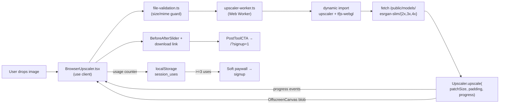
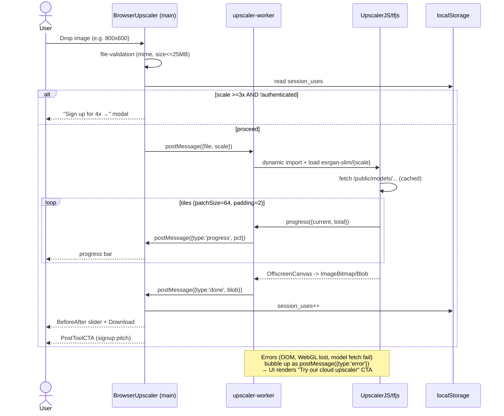

# Browser-Based AI Upscaler (UpscalerJS) — pSEO Tool Page

> Planning Mode: Principal Architect
> **Complexity: 10 → HIGH mode** (10+ files, new ML module, concurrency/worker, external model hosting)
> Owner: TBD · Created: 2026-04-23

---

## 0. Complexity Assessment

| Factor                                                                   | Score         |
| ------------------------------------------------------------------------ | ------------- |
| Touches 10+ files                                                        | +3            |
| New system/module from scratch (client-side ML pipeline)                 | +2            |
| Complex state logic / concurrency (Web Worker + progress + cancellation) | +2            |
| Database schema changes                                                  | 0             |
| External model hosting / asset pipeline                                  | +2            |
| Multi-package changes (upscaler, @tensorflow/tfjs-\*, model pkg)         | +1            |
| **Total**                                                                | **10 → HIGH** |

---

## 1. Context

**Problem:** We have zero "free, no-signup" conversion magnet for upscaling. Users searching `free image upscaler`, `upscale image online`, `browser image upscaler` (combined ~400K monthly searches) land on competitor tools. Our paid AI upscaler is a great product but gated behind signup, so these queries bounce. We need a **frictionless browser-side upscaler** that (a) delivers a functional 2×–4× result instantly, (b) demonstrates our brand's quality, and (c) funnels users to sign up for the superior server-side models (Real-ESRGAN / Clarity / Flux-2-Pro).

**Files Analyzed:**

- `app/(pseo)/tools/[slug]/page.tsx:1-110` — tool page route with `isInteractive` branching
- `app/(pseo)/_components/pseo/templates/InteractiveToolPageTemplate.tsx:42-103` — `TOOL_COMPONENTS` registry + `getToolProps` switch
- `app/(pseo)/_components/tools/BackgroundRemover.tsx:1-100` — reference pattern for lazy-loaded ML tool (@imgly)
- `app/(pseo)/_components/tools/InteractiveTool.tsx:1-80` — shared upload/process/download shell
- `app/seo/data/interactive-tools.json:1-40` — data source for interactive pSEO tools (confirmed primary data file)
- `lib/seo/pseo-types.ts:49-100` — `IToolPage` + `IToolConfig` interfaces
- `lib/seo/localization-config.ts:14-25` — `tools` is `LOCALIZED` (all 7 languages)
- `app/sitemap-tools.xml/route.ts:17,27+` — imports `interactive-tools.json`, auto-registers slugs
- `middleware.ts:454` — `isPSEOPath` already covers `/tools/`
- `shared/config/credits.config.ts` — credit/tier model (context for conversion gating)
- `client/utils/image-preprocessing.ts`, `client/utils/download.ts`, `client/utils/file-validation.ts` — reusable helpers
- `package.json:113` — `onnxruntime-web@1.21.0`, `@imgly/background-removal@1.7.0` already precedent for in-browser ML

**Current Behavior:**

- `/tools/ai-image-upscaler` exists as a **static** pSEO page (not interactive) that showcases the server-side upscaler and pushes signup.
- No client-side upscaling anywhere in the codebase.
- Competitor tools (e.g. upscale.media, bigjpg, imgupscaler) dominate "free" long-tail — we have no equivalent.
- `TOOL_COMPONENTS` registry has 13 interactive tools (resizer, compressor, bg-remover, …) — proven pattern to extend.

---

## 2. Solution

**Approach:**

- Ship a new interactive pSEO tool page at **`/tools/free-image-upscaler`** (new slug, does **not** collide with the existing static `ai-image-upscaler` page).
- Integrate **[UpscalerJS](https://github.com/thekevinscott/UpscalerJS)** via `@upscalerjs/esrgan-slim` (2×/3×/4× variants) running on TensorFlow.js + WebGL backend.
- Inference runs in a dedicated **Web Worker** with `OffscreenCanvas` (keeps main thread responsive) — mirrors our `BackgroundRemover.tsx` lazy-load-and-cache module pattern (`BackgroundRemover.tsx:36-46`).
- Host model weights at `/public/models/upscalerjs/esrgan-slim/{2x,3x,4x}/...` (static CF Pages asset; avoids CORS + edges cache globally).
- **Conversion gating:** free plan runs 2× only by default; 3×/4× prompts signup after N uses per session (localStorage counter). Post-process CTA ("Want Real-ESRGAN / Clarity? 6× sharper on faces and text →") mirrors existing `PostToolCTA` in `InteractiveToolPageTemplate.tsx:109-130`.
- Register slug in `interactive-tools.json`, add component to `TOOL_COMPONENTS` map, extend `IToolConfig` with upscaler-specific fields. Sitemap + middleware auto-pick it up.

**Architecture Diagram:**



**Key Decisions:**

- **Model pick:** `@upscalerjs/esrgan-slim` (browser-friendly size + quality). Rejected `esrgan-thick` (too large for bundle/mobile) and `@upscalerjs/default-model` (2× only, worse quality). Flagged: **measure actual weight size during Phase 1** and pick the smallest acceptable variant.
- **TFJS slimming:** import **`@tensorflow/tfjs-core` + `@tensorflow/tfjs-backend-webgl`** explicitly, not the meta-package `@tensorflow/tfjs`. Saves ~40% of JS bytes.
- **Worker + `OffscreenCanvas`:** non-negotiable — synchronous inference on 1024²+ images blocks the main thread for seconds and freezes the UI. Fallback to main thread on browsers without `OffscreenCanvas` support (Safari < 17).
- **Model hosting:** `/public/models/upscalerjs/...` — static assets, cached by Cloudflare edge, no CORS. **Not** CDN'd from jsdelivr because that adds third-party dependency + runtime variability.
- **Bundle strategy:** dynamic `import()` inside event handler so core route stays small (~5KB) and weight only transfers when user actually hits "Upscale". Pattern proven by `BackgroundRemover.tsx:41-42`.
- **Conversion gate:** soft limit (3 free upscales / session via `localStorage`) + scale-gated (2× free, 3×/4× requires signup). No hard block — the first use always works. This preserves SEO value (Googlebot sees working tool) while creating friction for power users.
- **Privacy story:** "Runs entirely in your browser — your images never leave your device" is a primary marketing hook and differentiator vs. our own paid tool (which is fine, because the paid tool offers 6× quality/faces/text that justifies trust).
- **Error handling:** WebGL unavailable → show "Your browser doesn't support in-browser AI. Sign up to use our cloud upscaler →" (pure upsell).
- **Reused utilities:** `FileUpload`, `InteractiveTool` shell, `BeforeAfterSlider`, `file-validation.ts`, `download.ts`. Do **not** rebuild these.

**Data Changes:** None (no DB). New static JSON entry + new `/public/models/` assets.

---

## 3. Sequence Flow



---

## 4. Execution Phases

**Rules honored:** one vertical slice per phase, ≤5 files/phase, concrete tests + verification per phase, automated checkpoint after every phase (spawn `prd-work-reviewer`).

---

### Phase 1 — Scaffold the pSEO page (no ML yet) · _User sees a populated landing page at the new URL_

**Files (5):**

- `app/seo/data/interactive-tools.json` — add `free-image-upscaler` entry (full IToolPage content: metaTitle, metaDescription, H1, intro, primaryKeyword="free image upscaler", secondaryKeywords, features[], useCases[], benefits[], howItWorks[], faq[], `isInteractive: true`, `toolComponent: "BrowserUpscaler"`, `toolConfig: { defaultScale: 2, availableScales: [2,3,4], model: 'esrgan-slim', allowedFreeUses: 3 }`, `maxFileSizeMB: 25`, `acceptedFormats: ["image/jpeg","image/png","image/webp"]`, `ctaText: "Upgrade to Cloud AI (4× sharper)"`, `ctaUrl: "/?signup=1"`)
- `lib/seo/pseo-types.ts` — extend `IToolConfig` with: `defaultScale?: 2|3|4`, `availableScales?: Array<2|3|4>`, `model?: 'esrgan-slim'|'esrgan-medium'`, `allowedFreeUses?: number`
- `lib/seo/keyword-mappings.ts` — add mapping for `/tools/free-image-upscaler` with `tier` + `primaryKeyword`
- `public/robots.txt` _(verify, not modify unless needed)_ — ensure `/tools/` not blocked
- `tests/unit/seo/browser-upscaler-sitemap.unit.spec.ts` — **new file**

**Implementation:**

- [ ] Write the JSON entry with copywriter-grade content (no placeholder Lorem). Target ≥800 words of unique body content via features/useCases/benefits/howItWorks/faq/expandedDescription.
- [ ] Extend `IToolConfig` union; types must compile (`yarn tsc --noEmit`).
- [ ] Register the URL in `keyword-mappings.ts` so `PSEOPageTracker` reports tier correctly.
- [ ] Verify `/tools/free-image-upscaler` renders 200 with the existing `InteractiveToolPageTemplate` — tool slot will be empty (no component registered yet) but all sections render.

**Tests Required:**
| Test File | Test Name | Assertion |
|---|---|---|
| `tests/unit/seo/browser-upscaler-sitemap.unit.spec.ts` | `should include free-image-upscaler in tools sitemap` | Fetches `/sitemap-tools.xml` output, asserts `<loc>…/tools/free-image-upscaler</loc>` present |
| `tests/unit/seo/browser-upscaler-sitemap.unit.spec.ts` | `should emit hreflang for all localized locales` | 7 `xhtml:link` entries (en + 6) since `tools` is LOCALIZED |
| `tests/unit/seo/browser-upscaler-sitemap.unit.spec.ts` | `should generate valid JSON-LD SoftwareApplication schema` | `generateToolSchema(page, 'en')` returns `@type: "SoftwareApplication"` with `offers.price: 0` |
| `tests/unit/seo/browser-upscaler-sitemap.unit.spec.ts` | `should have metaTitle length 40-60 chars and metaDescription 120-160` | Strict SEO bounds |

**Verification Plan:**

1. **Unit tests:** `yarn test tests/unit/seo/browser-upscaler-sitemap.unit.spec.ts` — all pass
2. **Manual route check:** `yarn dev` → GET `http://localhost:3000/tools/free-image-upscaler` → 200, H1 visible, no console errors
3. **curl smoke:**
   ```bash
   curl -s http://localhost:3000/tools/free-image-upscaler | grep -E '<h1|name="description"' | head -5
   # Expected: H1 text + meta description tag present
   curl -s http://localhost:3000/sitemap-tools.xml | grep 'free-image-upscaler'
   # Expected: <loc>https://.../tools/free-image-upscaler</loc>
   ```
4. **`yarn verify`** passes

**User Verification:**

- Action: visit `/tools/free-image-upscaler`
- Expected: Full pSEO page renders (hero, features, use cases, benefits, how-it-works, FAQ, CTA). Tool widget area shows an empty placeholder (by design — added in Phase 2). Breadcrumb links work.

**Checkpoint:** Spawn `prd-work-reviewer`. Block until PASS.

---

### Phase 2 — Core `BrowserUpscaler` component (main-thread, 2× only, small images) · _User uploads → gets 2× image downloaded_

**Files (5):**

- `package.json` — add `upscaler`, `@tensorflow/tfjs-core`, `@tensorflow/tfjs-backend-webgl`, `@upscalerjs/esrgan-slim`
- `next.config.js` _(or `next.config.mjs`)_ — add `upscaler`, `@tensorflow/*`, `@upscalerjs/*` to `serverExternalPackages` so they're excluded from server bundle
- `app/(pseo)/_components/tools/BrowserUpscaler.tsx` — **new file**; mirrors `BackgroundRemover.tsx` pattern; uses `InteractiveTool` shell; dynamic-imports upscaler on first use; 2× main-thread only; Blob download
- `app/(pseo)/_components/pseo/templates/InteractiveToolPageTemplate.tsx` — register `BrowserUpscaler` in `TOOL_COMPONENTS` (line 42) + add case to `getToolProps` (line 64) passing `defaultScale`, `availableScales`, `model`, `allowedFreeUses`
- `tests/unit/components/browser-upscaler-component.unit.spec.ts` — **new file**

**Implementation:**

- [ ] `yarn add upscaler @tensorflow/tfjs-core @tensorflow/tfjs-backend-webgl @upscalerjs/esrgan-slim` — pin versions in `package.json`
- [ ] Build `BrowserUpscaler.tsx`:
  - `'use client'`
  - `useRef<Upscaler | null>(null)` to cache the instance across uploads
  - Lazy load via `await import('upscaler')`, `await import('@upscalerjs/esrgan-slim/2x')`, `await import('@tensorflow/tfjs-core')`, `await import('@tensorflow/tfjs-backend-webgl')` — register backend before first `upscale()` call
  - Respect `maxFileSizeMB` + `acceptedFormats` from props
  - Wrap in `<InteractiveTool>` shell; render progress bar + "Upscaling…" label inside
  - On success, call `InteractiveTool`'s `onProcess` return contract (Blob) so download button lights up
  - On WebGL unavailable: throw a typed error → UI shows "Your browser can't run AI locally. [Try our cloud upscaler →](/?signup=1)"
- [ ] Add to `TOOL_COMPONENTS` map + `getToolProps` switch
- [ ] `next.config.js` `serverExternalPackages: [...existing, 'upscaler', '@tensorflow/tfjs-core', '@tensorflow/tfjs-backend-webgl', '@upscalerjs/esrgan-slim']`

**Tests Required:**
| Test File | Test Name | Assertion |
|---|---|---|
| `tests/unit/components/browser-upscaler-component.unit.spec.ts` | `should render upload UI when no file selected` | Renders `InteractiveTool` with file drop zone |
| `tests/unit/components/browser-upscaler-component.unit.spec.ts` | `should show size error when file > maxFileSizeMB` | 30MB file → error message "File size must be less than 25MB" |
| `tests/unit/components/browser-upscaler-component.unit.spec.ts` | `should show format error for unsupported mime` | `image/bmp` → "Invalid file format. Accepted formats: JPEG, PNG, WEBP" |
| `tests/unit/components/browser-upscaler-component.unit.spec.ts` | `should lazy-import upscaler only on process` | Spy on dynamic `import()`; zero imports on mount, 1 call after clicking "Upscale" |
| `tests/unit/components/browser-upscaler-component.unit.spec.ts` | `should surface WebGL unavailable as upsell CTA` | Mock `HTMLCanvasElement.getContext('webgl')` → null; assert CTA link `/?signup=1` rendered |

**Verification Plan:**

1. **Unit tests:** `yarn test tests/unit/components/browser-upscaler-component.unit.spec.ts` — all pass
2. **Manual browser test:** `yarn dev` → upload a 512×512 PNG → click Upscale → wait → download button appears → downloaded file is 1024×1024 PNG (verify dimensions with `file` or `imagemagick identify`)
3. **Bundle inspection:**
   ```bash
   yarn build 2>&1 | grep -E "First Load JS|tools/free-image-upscaler"
   # Expected: route First Load JS < 200KB (upscaler + tfjs are dynamic, not in initial bundle)
   ```
4. **Type check + `yarn verify`** pass

**User Verification (manual — HIGH complexity, UI change):**

- [ ] Upload 512×512 PNG → downloaded file is 1024×1024, visually sharper
- [ ] Upload 8MB JPG → downloaded file is 2× dimensions, processing stays under 10s on modern laptop
- [ ] Upload non-image → clear error, no crash
- [ ] Reload page, verify nothing downloads until user actually clicks Upscale (dynamic import works)
- [ ] Open DevTools Network: `tfjs` + `upscaler` + model weights only fetched after first click

**Checkpoint:** Spawn `prd-work-reviewer` + manual verification. Block until PASS.

---

### Phase 3 — Web Worker + `OffscreenCanvas` for large images · _User sees responsive UI during 2048² upscale_

**Files (5):**

- `app/(pseo)/_components/tools/BrowserUpscaler.tsx` — refactor to post to worker
- `app/(pseo)/_components/tools/workers/upscaler.worker.ts` — **new file**; all tfjs imports live here
- `app/(pseo)/_components/tools/workers/upscaler-protocol.ts` — **new file**; typed `WorkerRequest` / `WorkerResponse` discriminated unions
- `next.config.js` — ensure Turbopack/webpack handles `new Worker(new URL('./upscaler.worker.ts', import.meta.url))` pattern for App Router
- `tests/unit/components/browser-upscaler-worker-protocol.unit.spec.ts` — **new file**

**Implementation:**

- [ ] Move `upscaler` / `tfjs` / model imports into `upscaler.worker.ts`. Worker is `'use strict'` module worker (type: 'module').
- [ ] Define `WorkerRequest = { type: 'upscale', file: ArrayBuffer, scale: 2|3|4 }` and `WorkerResponse = { type: 'progress', pct: number } | { type: 'done', blob: Blob } | { type: 'error', message: string, code: 'WEBGL_UNAVAILABLE'|'OOM'|'MODEL_FETCH_FAILED'|'UNKNOWN' }`.
- [ ] Main thread: `const worker = useRef<Worker | null>(null)`; instantiate on first upscale; terminate on unmount.
- [ ] Fallback: if `typeof OffscreenCanvas === 'undefined'`, use Phase-2 main-thread path (code kept behind a capability check).
- [ ] Cancellation: expose a "Cancel" button during processing → `worker.terminate()` + reset state.

**Tests Required:**
| Test File | Test Name | Assertion |
|---|---|---|
| `tests/unit/components/browser-upscaler-worker-protocol.unit.spec.ts` | `should serialize/deserialize WorkerRequest correctly` | Round-trip `{type:'upscale', file: ArrayBuffer, scale: 4}` preserves fields |
| `tests/unit/components/browser-upscaler-worker-protocol.unit.spec.ts` | `should discriminate error codes` | Type narrowing: response.code === 'OOM' triggers OOM-specific UI copy |
| `tests/unit/components/browser-upscaler-component.unit.spec.ts` | `should post ArrayBuffer + scale to worker on upscale click` | Mock `Worker` constructor; assert `postMessage` called with expected shape |
| `tests/unit/components/browser-upscaler-component.unit.spec.ts` | `should render progress bar when worker posts progress` | postMessage `{type:'progress', pct:50}` → progress bar shows 50% |
| `tests/unit/components/browser-upscaler-component.unit.spec.ts` | `should fall back to main thread when OffscreenCanvas undefined` | delete global.OffscreenCanvas → component still works |

**Verification Plan:**

1. Unit tests pass
2. **Manual perf test:** upload 1920×1080 image → main thread stays responsive (mouse hover on CTAs still responds within 100ms, verified by browser rAF profiling)
3. **Cancellation test:** start upscale on 2048² → click Cancel mid-process → state resets, no ghost progress, no memory leak (`performance.memory.usedJSHeapSize` returns near baseline within 2s)
4. **`yarn verify`** passes

**User Verification (manual):**

- [ ] Upload 2048×2048 image → progress bar updates smoothly, page stays scrollable/clickable
- [ ] Click Cancel mid-process → immediate stop, "Cancelled" message, can re-upload
- [ ] Safari on iOS (OffscreenCanvas check) → still works via fallback path

**Checkpoint:** Spawn `prd-work-reviewer` + manual verification. Block until PASS.

---

### Phase 4 — Scale factors (3×, 4×) + patched inference for large images · _User picks scale; large images don't OOM_

**Files (4):**

- `app/(pseo)/_components/tools/BrowserUpscaler.tsx` — add scale selector UI (2× | 3× | 4×), lock 3×/4× behind signup gate (see Phase 5)
- `app/(pseo)/_components/tools/workers/upscaler.worker.ts` — dynamic import model based on requested scale; compute `patchSize` + `padding` from input dimensions
- `app/(pseo)/_components/tools/workers/patching.ts` — **new file**; pure function `computePatchConfig(width, height, scale): { patchSize: number, padding: number }`
- `tests/unit/components/browser-upscaler-patching.unit.spec.ts` — **new file**

**Implementation:**

- [ ] Scale selector: radio buttons or segmented control (2× default, 3×, 4×).
- [ ] `computePatchConfig`: if `width*height <= 512*512`, return `{ patchSize: 0, padding: 0 }` (no patching, whole-image inference); if larger, use `patchSize: 64, padding: 2` to cap peak memory at ~1GB.
- [ ] Worker switch: `const model = await import(`@upscalerjs/esrgan-slim/${scale}x`)` — gated by a whitelist to avoid dynamic-import injection (`if (![2,3,4].includes(scale)) throw`).
- [ ] UI: show estimated time (e.g., "~8s on this device") based on `performance.now()` timestamps of first patch.

**Tests Required:**
| Test File | Test Name | Assertion |
|---|---|---|
| `tests/unit/components/browser-upscaler-patching.unit.spec.ts` | `should return no patching for small images (<=512^2)` | `computePatchConfig(500,500,2) → { patchSize: 0, padding: 0 }` |
| `tests/unit/components/browser-upscaler-patching.unit.spec.ts` | `should use patchSize 64 for 1024x1024 4x` | `computePatchConfig(1024,1024,4) → { patchSize: 64, padding: 2 }` |
| `tests/unit/components/browser-upscaler-patching.unit.spec.ts` | `should reject non-whitelisted scales` | worker-side guard throws for scale=5 |
| `tests/unit/components/browser-upscaler-component.unit.spec.ts` | `should pass selected scale to worker postMessage` | Select 3× → worker receives `scale: 3` |

**Verification Plan:**

1. Unit tests pass
2. **Manual OOM test:** upload 2048×2048 JPEG, select 4× → completes without browser tab crash on 8GB RAM machine
3. **Visual quality spot-check:** identical input at 2×, 3×, 4× → dimensions scale correctly, no artifacts along patch seams
4. `yarn verify` passes

**User Verification:**

- [ ] Scale selector visible; default highlighted = 2×
- [ ] 3×/4× options visible (gating applied in Phase 5)
- [ ] Big image (2048²) at 4× completes without crash

**Checkpoint:** Spawn `prd-work-reviewer` + manual. Block until PASS.

---

### Phase 5 — Before/after slider + conversion gating (session limit, scale gate, post-CTA) · _Conversion funnel wired end-to-end_

**Files (5):**

- `app/(pseo)/_components/tools/BrowserUpscaler.tsx` — embed `BeforeAfterSlider`; wire signup gate for 3×/4× and session-use counter
- `app/(pseo)/_components/tools/hooks/useFreeUseCounter.ts` — **new file**; `localStorage`-backed hook returning `{ uses, increment, remaining }`
- `app/(pseo)/_components/tools/BrowserUpscalerCTA.tsx` — **new file**; tailored post-process CTA ("Real-ESRGAN does faces & text in 3s. Sign up free →") distinct from the generic `PostToolCTA`
- `app/(pseo)/_components/pseo/templates/InteractiveToolPageTemplate.tsx` — special-case `BrowserUpscaler` to render our new CTA instead of `PostToolCTA` (or via a prop on the tool component) **OR** simply leave the generic `PostToolCTA` on and add `BrowserUpscalerCTA` above the slider — pick whichever avoids touching the template. **Decision: add `BrowserUpscalerCTA` _inside_ `BrowserUpscaler.tsx` post-result block; leave the template untouched.** → only 4 files touched in this phase.
- `tests/unit/components/browser-upscaler-gating.unit.spec.ts` — **new file**

**Implementation:**

- [ ] Session counter: `useFreeUseCounter('browser-upscaler-uses', 3)` — reads/writes `localStorage`. When `uses >= 3`, CTA hardens ("You've used your 3 free upscales — [Sign up for unlimited →]").
- [ ] Scale gate: clicking 3× or 4× while `!authenticated` opens a signup modal/redirect (reuse `prepareAuthRedirect()` helper, referenced from `GuestUpscaler.tsx`). Authenticated users (server-rendered session check passed down via prop) get all scales unlocked.
- [ ] Before/after slider renders once result exists, using the original `previewUrl` and the processed blob's object URL.
- [ ] `BrowserUpscalerCTA` copy explicitly contrasts: "This tool: 2× generic upscaling · Our cloud: 4× + face/text restoration, no size limit, batch".

**Tests Required:**
| Test File | Test Name | Assertion |
|---|---|---|
| `tests/unit/components/browser-upscaler-gating.unit.spec.ts` | `should increment localStorage counter on successful upscale` | After 1 successful run → `localStorage['browser-upscaler-uses'] === '1'` |
| `tests/unit/components/browser-upscaler-gating.unit.spec.ts` | `should show signup CTA instead of 4x option for guests` | Unauth + click 4× → signup modal opens, no inference fires |
| `tests/unit/components/browser-upscaler-gating.unit.spec.ts` | `should allow 4x for authenticated users` | Prop `isAuthenticated=true` → clicking 4× starts worker |
| `tests/unit/components/browser-upscaler-gating.unit.spec.ts` | `should render "3 of 3 free uses" message when limit hit` | Counter at 3 → "You've used your 3 free upscales" visible |
| `tests/unit/components/browser-upscaler-gating.unit.spec.ts` | `should track CTA click with analytics event` | Click signup CTA → `window.analytics.track('browser_upscaler_cta_click', {scale:4, uses:3})` called |

**Verification Plan:**

1. Unit tests pass
2. **Playwright E2E:** `tests/e2e/browser-upscaler.spec.ts` — **new file**
   - Navigate to `/tools/free-image-upscaler`
   - Upload fixture PNG
   - Select 2× → Upscale → wait for result → assert before/after slider renders, download link present
   - Click 4× as guest → assert redirect to `/?signup=1` (or modal)
   - Simulate 3 uses → assert post-CTA says "3 of 3"
3. **Analytics verification:** open DevTools → Network → `/api/analytics/event` fires with `browser_upscaler_*` events (check whitelist in `app/api/analytics/event/route.ts`)
4. `yarn verify` passes

**User Verification (manual, HIGH complexity UI):**

- [ ] Before/after slider draggable, smooth
- [ ] 4× click as guest → signup flow
- [ ] After 3 successful 2× runs → hard CTA visible
- [ ] Mobile Safari: slider works, gating works, no horizontal overflow

**Checkpoint:** Spawn `prd-work-reviewer` + manual. Block until PASS.

---

### Phase 6 — Model asset hosting, Structured Data, SEO polish, analytics whitelist · _Ranks + measures_

**Files (5):**

- `public/models/upscalerjs/esrgan-slim/2x/model.json` + weight `.bin` shards (copy from `@upscalerjs/esrgan-slim` package at build time) — scripted via `scripts/copy-upscaler-models.ts`
- `scripts/copy-upscaler-models.ts` — **new file**; postinstall or prebuild script; verifies file sizes; logs total asset weight
- `lib/seo/schema-generators.ts` _(or wherever `generateToolSchema` lives)_ — ensure generated JSON-LD for our slug includes `@type: "SoftwareApplication"`, `applicationCategory: "MultimediaApplication"`, `offers.price: "0"`, `aggregateRating` (placeholder until real reviews), `operatingSystem: "Web"`
- `app/api/analytics/event/route.ts` — whitelist new events: `browser_upscaler_upload`, `browser_upscaler_success`, `browser_upscaler_error`, `browser_upscaler_cta_click`
- `tests/e2e/browser-upscaler.spec.ts` (extend from Phase 5) + `tests/unit/bugfixes/analytics-event-whitelist.unit.spec.ts` (extend existing file with new event cases)

**Implementation:**

- [ ] `copy-upscaler-models.ts`: reads from `node_modules/@upscalerjs/esrgan-slim/{2x,3x,4x}/*.{json,bin}`, writes to `public/models/upscalerjs/esrgan-slim/{2x,3x,4x}/`. Adds postinstall hook in `package.json` **or** adds step to `build` script. Pick whichever keeps `yarn install` fast on devs' machines — recommend prebuild-only.
- [ ] Update `Upscaler` instantiation in worker to pass `modelPath: '/models/upscalerjs/esrgan-slim/{scale}x/model.json'` option (UpscalerJS supports custom URL).
- [ ] `next.config.js` headers: `/models/upscalerjs/:path*` → `Cache-Control: public, max-age=31536000, immutable` (weights never change for a given pin).
- [ ] Add analytics events to whitelist array in `app/api/analytics/event/route.ts` (see existing patterns).
- [ ] JSON-LD: extend schema generator to include `aggregateRating` only if provided in data; otherwise omit (no fake ratings).

**Tests Required:**
| Test File | Test Name | Assertion |
|---|---|---|
| `tests/unit/seo/browser-upscaler-sitemap.unit.spec.ts` | `should emit SoftwareApplication schema with offers.price=0` | JSON-LD contains `"price":"0"` |
| `tests/unit/bugfixes/analytics-event-whitelist.unit.spec.ts` | `should accept browser_upscaler_* events` | POST `/api/analytics/event` with `event:'browser_upscaler_success'` → 200 |
| `tests/unit/bugfixes/analytics-event-whitelist.unit.spec.ts` | `should reject unwhitelisted browser_upscaler_foo event` | 400 |
| `tests/e2e/browser-upscaler.spec.ts` | `full happy path: upload → upscale 2× → see before/after → download` | Playwright green |
| `tests/e2e/browser-upscaler.spec.ts` | `guest clicking 4× redirects to signup` | URL contains `signup=1` |
| `scripts/copy-upscaler-models.ts` | self-check: verify total < 20MB, all manifests readable | `tsx scripts/copy-upscaler-models.ts && ls -lh public/models/upscalerjs` |

**Verification Plan:**

1. All unit + E2E tests pass
2. **Schema validator:** run page HTML through [schema.org validator](https://validator.schema.org) → 0 errors, 0 warnings
3. **curl verification:**

   ```bash
   # Analytics endpoint accepts new events
   curl -s -X POST http://localhost:3000/api/analytics/event \
     -H "Content-Type: application/json" \
     -d '{"event":"browser_upscaler_success","properties":{"scale":2}}' | jq .
   # Expected: {"success":true}

   # Rejects unwhitelisted
   curl -s -X POST http://localhost:3000/api/analytics/event \
     -H "Content-Type: application/json" \
     -d '{"event":"browser_upscaler_invalid"}' | jq .
   # Expected: 400 with error

   # Models served with correct cache headers
   curl -sI http://localhost:3000/models/upscalerjs/esrgan-slim/2x/model.json | grep -i cache-control
   # Expected: cache-control: public, max-age=31536000, immutable
   ```

4. **Lighthouse:** run on `/tools/free-image-upscaler` → Performance ≥ 85 (desktop), SEO = 100, Accessibility ≥ 95
5. `yarn verify` passes

**User Verification:**

- [ ] Google Rich Results Test shows SoftwareApplication card for the URL
- [ ] Upload 1024² PNG → see it upscaled, download works, analytics events fire in DevTools Network
- [ ] First load pulls model from `/models/...` (Network tab shows our origin, not cdn/jsdelivr)

**Checkpoint:** Spawn `prd-work-reviewer` + manual. Block until PASS. Consider deploy-ready.

---

## 5. Checkpoint Protocol

**Mandatory after every phase:**

```
Use Task tool with:
  subagent_type: "prd-work-reviewer"
  prompt: "Review checkpoint for phase [N] of PRD at docs/PRDs/browser-upscaler-upscalerjs.md"
```

**Manual checkpoint additionally required for:** Phases 2, 3, 5, 6 (all have UI changes or external-asset hosting).

---

## 6. Verification Evidence (fill in during implementation)

### Phase 1

- [ ] Unit tests: ? passing
- [ ] curl test: sitemap contains slug ✓
- [ ] yarn verify: ?

### Phase 2

- [ ] Component unit tests: ? passing
- [ ] Bundle analyzer: route First Load JS = ?KB
- [ ] Manual: 512² upload → 1024² download, dimensions verified

### Phase 3

- [ ] Worker protocol tests: ? passing
- [ ] Main thread responsive during 2048² upscale (rAF profile): ✓/✗

### Phase 4

- [ ] Patching unit tests: ? passing
- [ ] OOM test (2048² @ 4×): ✓/✗

### Phase 5

- [ ] Gating unit tests: ? passing
- [ ] Playwright E2E: ? scenarios green
- [ ] Analytics events observed

### Phase 6

- [ ] Schema validator: 0 errors
- [ ] Rich Results Test: SoftwareApplication detected
- [ ] Lighthouse Perf / SEO / A11y: ? / ? / ?

---

## 7. Acceptance Criteria

- [ ] Page live at `/tools/free-image-upscaler` with full pSEO content (≥800 unique words)
- [ ] Registered in `interactive-tools.json`, auto-included in `sitemap-tools.xml`, hreflang emitted
- [ ] `BrowserUpscaler` component in `TOOL_COMPONENTS` registry; tool widget embedded via `InteractiveToolPageTemplate`
- [ ] 2×/3×/4× upscaling works end-to-end in Chrome/Firefox/Edge/Safari 17+
- [ ] Main thread stays responsive (Web Worker + OffscreenCanvas)
- [ ] Large images (2048²) don't OOM (patched inference)
- [ ] Guest-gating: 3×/4× requires signup; 3-free-uses-per-session soft cap on 2×
- [ ] Before/after slider + post-process conversion CTA drive signup
- [ ] Analytics events whitelisted and firing (`browser_upscaler_*`)
- [ ] JSON-LD `SoftwareApplication` schema validates
- [ ] Model assets hosted at `/public/models/upscalerjs/` with immutable cache headers
- [ ] `yarn verify` passes on final PR
- [ ] All 6 automated + relevant manual checkpoints PASS
- [ ] Lighthouse: Perf ≥ 85 desktop, SEO = 100, A11y ≥ 95

---

## 8. Risks & Open Questions

| Risk                                                                    | Mitigation                                                                                                                                                                                                                  |
| ----------------------------------------------------------------------- | --------------------------------------------------------------------------------------------------------------------------------------------------------------------------------------------------------------------------- |
| `@upscalerjs/esrgan-slim/4x` weights may be >10MB each → slow first use | Lazy load on demand; show clear "First upscale downloads the AI model (~?MB)" message. Measure actual size in Phase 1. If >15MB total, consider shipping only 2x by default and fetching 3x/4x only when user selects them. |
| TensorFlow.js + WebGL bugs on older iOS Safari                          | Feature-detect, fall back to upsell CTA ("Your browser can't run AI locally — try our cloud version")                                                                                                                       |
| Cannibalizing existing `/tools/ai-image-upscaler` rankings              | New slug targets different intent ("free" + "browser" keywords) — keyword research to confirm before launch. Add cross-links between the two pages.                                                                         |
| Mobile users with limited RAM (Safari kills tab at ~400MB)              | Cap input dimensions on mobile: detect `navigator.deviceMemory` or UA; warn + auto-downscale above 1024²                                                                                                                    |
| Copying models at build time increases Cloudflare Pages asset size      | Verify Pages 25MB/file + 20K-file limits; CF Pages ships all `public/` files. Total model size should stay well under.                                                                                                      |
| UpscalerJS version drift (repo is less active since 2024)               | Pin exact version in `package.json`; flag in CHANGELOG if upgrading                                                                                                                                                         |
| Legal / model license                                                   | UpscalerJS is MIT + ESRGAN pretrained weights are typically CC — **verify each model's LICENSE before shipping to prod** (do this in Phase 1)                                                                               |

**Open questions for product:**

1. Final slug: `free-image-upscaler` vs `browser-image-upscaler` vs `online-image-upscaler-free` — recommend keyword-research step before locking in.
2. Should we allow authenticated free-tier users to run 4× here, or still funnel them to the cloud upscaler for everything? (Recommendation: let them run 4× here too — it's a better UX and our paid-tier differentiator is _quality_ on faces/text, not raw scale.)
3. Watermark free outputs? Recommend **no** — watermarks encourage users to find competitors, and our differentiation is cloud quality, not free-tier crippling.

---

## Principles Honored

- **SRP:** worker handles inference, hook handles counter, CTA handles copy, component handles orchestration
- **KISS:** reuse `InteractiveTool`, `FileUpload`, `BeforeAfterSlider`; don't reinvent
- **DRY:** model loading + tfjs import centralized in worker; dynamic-import pattern mirrors `BackgroundRemover.tsx`
- **YAGNI:** no abstract ML framework layer; single library (UpscalerJS), single model family (ESRGAN-slim), wrapped where we actually use it
- **Explicit errors:** typed `WorkerResponse` discriminated union; every failure maps to user-visible copy
- **Integration first:** every phase wires into the existing `TOOL_COMPONENTS` / `interactive-tools.json` / sitemap flow — no dead code, no orphan modules
