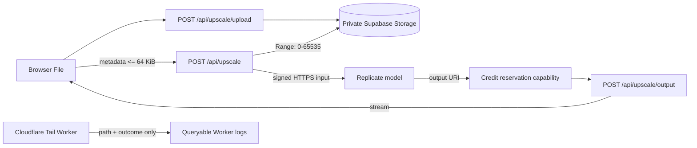
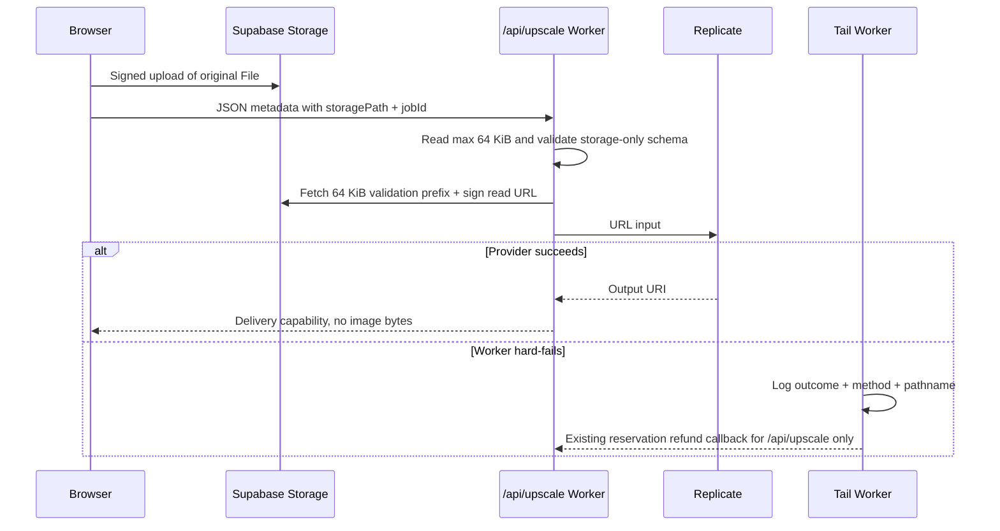

# PRD: Production Error Backlog Remediation

**Status:** Draft — ready for implementation  
**Date:** 2026-08-31  
**Owner:** João Paulo Furtado  
**Priority:** P0 for Worker memory; P1 dependency for homepage availability  
**Source:** [`docs/operations/production-error-backlog.md`](../operations/production-error-backlog.md)  
**Supersedes:** [`direct-upload-off-worker-memory.md`](direct-upload-off-worker-memory.md)  
**Related:** [`opennext-revalidation-queue.md`](opennext-revalidation-queue.md) owns the separate homepage-500 fingerprint

## Complexity

**Complexity: 8 → HIGH mode**

| Driver                                        | Score | Reason                                                                             |
| --------------------------------------------- | ----: | ---------------------------------------------------------------------------------- |
| Touches 10+ files across phases               |    +3 | Main Worker, Tail Worker, provider registry, builders, and tests                   |
| Complex state / asynchronous failure handling |    +2 | Storage upload, provider dispatch, credit reservation, and hard Worker termination |
| Multi-package deployment                      |    +2 | Main OpenNext Worker plus `workers/upscale-refund-tail`                            |
| External API integration                      |    +1 | Cloudflare, Supabase Storage, and Replicate                                        |

Mandatory phase checkpoints apply. Each implementation phase is limited to five files and must be reviewed before the next phase starts.

## Executive decision

The August 26 direct-upload release removed image bytes from the normal browser-to-Worker request, but it did not finish the memory-safety contract:

- `/api/upscale` still accepts legacy `imageData` and permits a 16 MiB JSON body before `req.json()`.
- A missing or false `Content-Length` bypasses the only pre-parse limit.
- `nano-banana` still routes through the direct Gemini service, which accepts and returns inline image data.
- `stageGeminiOutput()` copies the returned base64 into regex captures, a `Buffer`, and a second canonical base64 string.

This PRD makes the live contract storage-only and URL-only. It also adds route attribution before behavior changes because the backlog fingerprint aggregates the whole `myimageupscaler` Worker and does not prove which route exhausted memory.

## Backlog ownership

| Fingerprint                                    | Current evidence                                                            | Owner                           | Closure rule                                                                        |
| ---------------------------------------------- | --------------------------------------------------------------------------- | ------------------------------- | ----------------------------------------------------------------------------------- |
| `worker-myimageupscaler-status-exceededMemory` | Repeats through 2026-08-31; latest 21/3,283 requests (0.64%)                | This PRD                        | No `/api/upscale` memory outcomes for 24 hours and global rolling 3-hour rate ≤0.1% |
| `endpoint-homepage-status-500`                 | One sampled 500 on 2026-08-28; later ISR outage was mitigated by `dd78b04c` | OpenNext revalidation queue PRD | Its preview, production soak, and 24-hour acceptance gates pass                     |

Do not close the homepage fingerprint from this PRD. Do not keep a generic memory fingerprint open if Phase 1 identifies a different route; create a route-specific fingerprint with its own owner.

## 1. Context

### Problem

Production continues to record Cloudflare `exceededMemory` outcomes after direct uploads shipped, so users can still lose an upscale request at the platform boundary before application error handling runs.

### Files analyzed

- `docs/operations/production-error-backlog.md`
- `client/utils/api-client.ts`
- `app/api/upscale/route.ts`
- `shared/validation/upscale.schema.ts`
- `server/services/upscale-input-storage.service.ts`

Additional incumbents inspected: `server/services/image-generation.service.ts`, `server/services/model-registry.ts`, `server/services/image-processor.factory.ts`, `server/services/replicate.service.ts`, `server/services/replicate/builders/`, `workers/upscale-refund-tail/index.ts`, and the existing memory regression tests.

### Current behavior

- The current browser uploads the `File` to private Supabase Storage, then sends only `storagePath`, `jobId`, MIME type, and config to `/api/upscale`.
- The server validates a bounded 64 KiB object prefix, signs a read URL, and gives that URL to URL-capable Replicate builders.
- The route retains a legacy base64 branch, so an old or hostile client can still make the Worker parse a multi-megabyte JSON string.
- `nano-banana` is the only enabled model registered with provider `gemini`; its service is incompatible with the URL-only invariant and returns inline output.
- The Tail Worker refunds hard failures only for `POST /api/upscale`, but it does not persist or log route attribution for every hard Worker outcome.

### Evidence boundary

The two residual code paths above are confirmed memory hazards, but the production backlog does not include request paths. They must be removed even if Phase 1 finds that another route also contributes. The PRD must not claim root-cause closure until route-attributed post-deploy evidence exists.

## 2. Goals

1. Make `/api/upscale` accept metadata only and reject oversized or streamed bodies after reading no more than 64 KiB.
2. Make every enabled upscale model consume an HTTPS input reference and return a provider URL, never inline image bytes.
3. Preserve 5 MiB free-tier and 25 MiB paid-tier uploads without holding either source or output bytes in Worker memory.
4. Attribute every hard Worker failure to method and pathname without logging user data, query strings, request bodies, or credentials.
5. Reduce global `exceededMemory` to ≤0.1% in every rolling 3-hour window and to zero for `/api/upscale` over 24 hours.

## 3. Non-goals

- No database schema, RLS, credit-balance, or storage-bucket migration.
- No change to customer credit prices, tier upload limits, or model names shown in the UI.
- No redesign of output delivery; `/api/upscale/output` remains the streaming capability endpoint.
- No SEO, metadata, sitemap, or indexing change.
- No OpenNext cache-queue implementation; that work remains in the linked homepage-500 PRD.

## 4. Assumptions and decisions

### Assumptions

- Commit `e3244166` and migration `20260826120000_upscale_input_storage_and_credit_reservations.sql` are deployed before this rollout.
- The `upscale-inputs` bucket remains private and capped at 25 MiB.
- A stale browser bundle may still send inline input; it may receive a refresh-required error rather than re-enabling the unsafe path.
- Production credentials used for observation are fetched read-only with the `gcloud-secrets` workflow and never printed.
- Replicate's official `google/nano-banana` endpoint remains available at rollout time; re-check its schema immediately before implementation.

### Key decisions

- Use a byte-counted O(n) streaming JSON reader, capped at 64 KiB so it stays compatible with the 10 ms Worker CPU budget; do not trust `Content-Length` alone.
- Set the `/api/upscale` JSON ceiling to 64 KiB and cap both prompt fields at 2,000 characters.
- Route `nano-banana` through Replicate's official URL-in/URI-out model instead of direct Gemini inline data.
- Keep the customer-facing `nano-banana` model ID, display name, and credit multiplier unchanged.
- Fail closed and refund if a processor returns inline output after the cutover.

Replicate's official schema accepts `image_input` URLs and returns a URI: [google/nano-banana API schema](https://replicate.com/google/nano-banana/api/schema). The listed provider cost is $0.039 per output as of 2026-08-31 and must be reverified during Phase 4.

### Data changes

None. This PRD must not run a production migration or mutate production data. If implementation later introduces a database change, stop, split that work into a new reviewed phase, and follow the mandatory backup procedure before touching production.

## 5. Reachability

**How is the fixed flow reached?**

- Entry point: the upload widget calls `processImage()` and then `POST /api/upscale`.
- Existing caller edited: `app/api/upscale/route.ts` will call the bounded JSON reader before schema validation.
- Registration: `NanoBananaBuilder` will be registered in the existing model-input orchestrator.
- Background trigger: Cloudflare invokes the existing Tail Worker `tail()` handler for hard Worker outcomes.
- Observable result: the queue completes or reaches a terminal error, while Worker logs expose route-level hard-failure counts.

**Is this user-facing?** Yes. Free and paid users keep the same upload flow. Text Preserve keeps the same product identity but uses a URL-safe provider transport.

**Full flow:**

1. User selects a file; `client/utils/api-client.ts:497-520` obtains a signed grant and uploads bytes directly to `upscale-inputs`.
2. The client calls `/api/upscale` with the storage path at `client/utils/api-client.ts:525-543`.
3. The route reads at most 64 KiB, validates a storage-only schema, and resolves a signed input URL.
4. The selected Replicate builder sends that URL to the provider; the provider returns an output URI.
5. The client retrieves the output through the existing streaming `/api/upscale/output` capability.

**What this replaces:**

- `app/api/upscale/route.ts:672-725` legacy inline-input branch.
- `shared/validation/upscale.schema.ts` `imageData | storagePath` request union.
- `server/services/model-registry.ts:218-221` direct Gemini routing for `nano-banana`.
- The route's `stageGeminiOutput()` branch and its base64-copying hot path.

## 6. Incumbent census

| Behavior                     | Current live implementation                                                       | Disposition                           |
| ---------------------------- | --------------------------------------------------------------------------------- | ------------------------------------- |
| Browser source upload        | `client/utils/api-client.ts:497-543`                                              | Keep; this is the canonical caller    |
| Stored input validation      | `server/services/upscale-input-storage.service.ts:37-96`                          | Keep; bounded prefix only             |
| Inline request compatibility | `shared/validation/upscale.schema.ts:210-295`; `app/api/upscale/route.ts:672-725` | Remove in Phase 2                     |
| Direct Gemini processing     | `server/services/model-registry.ts:218-221` → `ImageProcessorFactory`             | Replace with Replicate in Phase 4     |
| Inline output staging        | `app/api/upscale/route.ts:1246-1268` → `stageGeminiOutput()`                      | Remove from the live route in Phase 4 |

## 7. Integration ledger

Fill the planned callers with exact post-edit line numbers during implementation. A row without a non-test caller or an observed negative control blocks the phase.

| #   | New thing                           | Planned live caller (`file:line`, non-test)                   | Replaces                                        | Old path removed?                     | Negative control                                                                           |
| --- | ----------------------------------- | ------------------------------------------------------------- | ----------------------------------------------- | ------------------------------------- | ------------------------------------------------------------------------------------------ | ------------------------------------------------------------------------ |
| 1   | Structured hard-failure observation | `workers/upscale-refund-tail/index.ts` `default.tail()`       | Unattributed aggregate memory count             | Logging added; refund filter retained | Feed `ok` and prove no hard-failure log; feed `exceededMemory` and prove one redacted log  |
| 2   | `readBoundedJsonBody()`             | `app/api/upscale/route.ts` before schema validation           | `Content-Length` check + unbounded `req.json()` | Yes in Phase 2                        | Stream 64 KiB + 1 byte without length; reader cancels and route returns 413                |
| 3   | Storage-only upscale request schema | `app/api/upscale/route.ts` `POST`                             | `imageData                                      | storagePath` union                    | Yes in Phase 2                                                                             | Send a small `imageData`; route rejects it and never calls the processor |
| 4   | `NanoBananaBuilder`                 | Model-input orchestrator → `ReplicateService.callReplicate()` | Direct Gemini input construction                | Yes in Phase 4                        | Remove builder registration; Text Preserve integration test fails before provider dispatch |
| 5   | URL-only provider result gate       | `app/api/upscale/route.ts` after `processor.processImage()`   | `stageGeminiOutput()` fallback                  | Yes in Phase 4                        | Force an inline result; reservation is refunded and no success payload is emitted          |

## 8. Architecture





## 9. Execution phases

### Checkpoint protocol

- After each phase, run its affected tests and `yarn verify`; do not batch phases before review.
- Spawn the automated PRD work reviewer with this PRD path, phase number, changed files, and raw command output.
- Require an integration audit: exact live callers, registration, incumbent removal, revert check, and observed negative controls.
- Proceed only on `PASS`; correct `NEEDS CORRECTION` findings in the same phase and rerun the checkpoint.
- Phases 1, 3, 4, and 5 also require the named manual external-integration checkpoint.

### Phase 1: Attribute hard Worker failures — Every hard outcome has a safe route-level signal

**Estimate:** 2–3 engineering hours plus one 3-hour observation window.

**Files (2):**

- `workers/upscale-refund-tail/index.ts` — EDIT: parse the pathname once, emit one bounded structured observation for all hard outcomes, and keep refunds scoped to valid `/api/upscale` reservations.
- `tests/unit/workers/upscale-refund-tail.unit.spec.ts` — EDIT: cover observation redaction, hard/non-hard outcomes, malformed URLs, and refund scoping.

**Implementation:**

- Add a pure classifier returning `{ scriptName, outcome, method, pathname, rayId }`; exclude query, headers, body, user ID, and job ID.
- Emit exactly one structured log per `exception`, `exceededCpu`, or `exceededMemory` event, including non-POST and non-upscale routes.
- Preserve the existing rule that only authenticated reservation evidence from `POST /api/upscale` triggers the refund callback.
- Deploy the Tail Worker independently and observe a complete rolling 3-hour window.
- Record counts by `outcome + method + pathname` in this PRD's Verification Evidence section.

**Wiring:**

- Caller edited: Cloudflare's existing Tail Worker binding invokes `default.tail()`.
- Registration: existing `workers/upscale-refund-tail/wrangler.toml`; no new binding or secret.
- Old path: refund behavior remains; observation is added around it.
- Ledger row filled: #1.

**Tests required:**

| Test file                                             | Test name                                                          | Assertion                                                                     | Negative control                                        |
| ----------------------------------------------------- | ------------------------------------------------------------------ | ----------------------------------------------------------------------------- | ------------------------------------------------------- |
| `tests/unit/workers/upscale-refund-tail.unit.spec.ts` | `should log route attribution when the main Worker exceeds memory` | One redacted structured log contains method/path/outcome                      | Disable classifier call; test observes zero logs        |
| Same                                                  | `should not log successful or canceled outcomes`                   | `ok`, `canceled`, and disconnect outcomes produce no hard-failure observation | Change fixture to `exceededMemory`; test must fail      |
| Same                                                  | `should refund only a valid upscale reservation hard failure`      | Existing callback fires only with path, UUID, and Ray ID                      | Change path to `/api/account`; fetch count becomes zero |

**Revert check:** Remove the classifier call from `tail()`; the pre-existing Tail Worker test file must fail on the new route-attribution assertion.

**Verification plan:**

- Run `yarn vitest run tests/unit/workers/upscale-refund-tail.unit.spec.ts`.
- Run the deliberate red controls before recording pass evidence.
- Deploy only `myimageupscaler-refund-tail` and query its logs for three hours.
- Confirm a hard failure produces no query string, authorization header, file name, email, user ID, or job ID in logs.
- Automated checkpoint plus manual external-integration checkpoint required.

**Decision gate:** Continue through Phases 2–4 regardless because confirmed unsafe paths remain. If any memory event belongs to another pathname, create a route-specific backlog entry before Phase 5; do not mislabel this PRD as its fix.

### Phase 2: Enforce storage-only bounded requests — No caller can place image bytes in `/api/upscale` JSON

**Estimate:** 4–6 engineering hours.

**Files (5):**

- `server/http/read-bounded-json-body.ts` — NEW: byte-counted streaming JSON reader with a typed too-large error.
- `app/api/upscale/route.ts` — EDIT: invoke the bounded reader before schema validation and delete the inline image branch.
- `shared/validation/upscale.schema.ts` — EDIT: require `storagePath` and `jobId`, remove request `imageData`, and cap prompts.
- `tests/unit/server/http/read-bounded-json-body.unit.spec.ts` — NEW: reader tests with and without `Content-Length`.
- `tests/unit/api/upscale-body-size-guard.unit.spec.ts` — EDIT: route-level rejection, batch-slot release, and processor non-invocation.

**Implementation:**

- Reject a declared body above 64 KiB before acquiring a reader.
- When length is absent or dishonest, stream chunks, count encoded bytes, cancel at 64 KiB + 1, and never call `JSON.parse` on the oversized body.
- Replace `req.json()` and `IMAGE_VALIDATION.MAX_REQUEST_BYTES` on this route with `readBoundedJsonBody(req, 64 * 1024)`.
- Make `storagePath` and UUID `jobId` required; reject any `imageData` property with the schema's strict-object behavior.
- Cap `enhancementPrompt` and `customInstructions` at 2,000 characters so valid metadata remains predictably bounded.

**Wiring:**

- Caller edited: `/api/upscale` `POST` invokes the new reader before `upscaleSchema.parse()`.
- Registration: none; the App Router already exposes the route.
- Old path: `req.json()` and the entire inline validation branch are deleted.
- Ledger rows filled: #2 and #3.

**Tests required:**

| Test file                                                    | Test name                                                                       | Assertion                                              | Negative control                                               |
| ------------------------------------------------------------ | ------------------------------------------------------------------------------- | ------------------------------------------------------ | -------------------------------------------------------------- |
| `tests/unit/server/http/read-bounded-json-body.unit.spec.ts` | `should stop after 64 KiB when content length is absent`                        | Reader cancels and throws the typed 413 error          | Replace streamed fixture with 64 KiB exactly; it must parse    |
| Same                                                         | `should reject a dishonest content length when streamed bytes exceed the limit` | Actual bytes, not header, enforce the limit            | Remove byte counter; test must fail                            |
| `tests/unit/api/upscale-body-size-guard.unit.spec.ts`        | `should reject inline image data before processing`                             | 400/413, batch slot released, processor not called     | Re-enable schema `imageData`; test reaches processor and fails |
| Same                                                         | `should accept the current storage metadata payload`                            | Existing storage request reaches `resolveUpscaleInput` | Remove storage caller; test fails                              |

**Revert check:** Restore `req.json()` or the inline schema branch; at least the streamed-body and inline-request tests must go red.

**Verification plan:**

- Run both Phase 2 test files plus `tests/unit/bugfixes/upscale-request-memory.unit.spec.ts` and `tests/unit/client/utils/api-client.unit.spec.ts`.
- Confirm the test runner collects each new test by first inserting a deliberate failing assertion.
- In preview, submit a valid storage request, a small inline request, a chunked 64 KiB + 1 request, and an overlong prompt.
- Inspect the valid client request body and prove it contains no `imageData` and stays under 64 KiB.
- Automated checkpoint required.

### Phase 3: Add the URL-safe Nano Banana builder — Text Preserve can run through Replicate before cutover

**Estimate:** 3–4 engineering hours.

**Files (5):**

- `server/services/replicate/builders/models/nano-banana.builder.ts` — NEW: official Replicate input shape.
- `server/services/replicate/builders/model-input.types.ts` — EDIT: add `INanoBananaInput` to the union.
- `server/services/replicate/builders/models/index.ts` — EDIT: export the builder.
- `server/services/replicate/builders/model-input.builder.ts` — EDIT: register the builder.
- `tests/unit/server/replicate-builders-new-upscalers.unit.spec.ts` — EDIT: URL input, prompt, format, and registration tests.

**Implementation:**

- Build `{ prompt, image_input: [imageDataUrl], aspect_ratio: 'match_input_image', output_format: 'png' }`.
- Reuse `buildPrompt('nano-banana', context)` so custom and tier prompt precedence remains unchanged.
- Preserve an HTTPS signed input unchanged; never wrap it as a data URI.
- Register the builder in the same orchestrator used by every Replicate model.
- Do not switch production routing in this phase; first prove construction and provider compatibility in preview.

**Wiring:**

- Caller edited: `ReplicateService.callReplicate()` already calls `buildModelInput(selectedModel, ...)`.
- Registration: `ModelInputBuilderOrchestrator.registerDefaultBuilders()`.
- Old path: not removed until the Phase 4 registry cutover.
- Ledger row prepared: #4; marked complete only after Phase 4 live routing.

**Tests required:**

| Test file                                                         | Test name                                                      | Assertion                                            | Negative control                                                           |
| ----------------------------------------------------------------- | -------------------------------------------------------------- | ---------------------------------------------------- | -------------------------------------------------------------------------- |
| `tests/unit/server/replicate-builders-new-upscalers.unit.spec.ts` | `should build Nano Banana with an HTTPS image_input`           | URL is unchanged and output contains no base64 field | Feed raw base64; test must show a data URI and fail the URL-only assertion |
| Same                                                              | `should preserve Text Preserve prompt precedence`              | Custom prompt overrides tier/default prompt          | Remove custom prompt; expected value changes                               |
| Same                                                              | `should register Nano Banana in the live builder orchestrator` | `buildModelInput('nano-banana', ...)` resolves       | Remove registration; test throws before dispatch                           |

**Revert check:** Remove `new NanoBananaBuilder()` from the orchestrator; the existing Replicate builder suite must fail.

**Verification plan:**

- Run `yarn vitest run tests/unit/server/replicate-builders-new-upscalers.unit.spec.ts server/services/__tests__/replicate.service.test.ts`.
- Use the preview environment to send one real 4 MP text-heavy PNG URL to `google/nano-banana`.
- Confirm the provider request contains a signed HTTPS URL and the provider response is a URI.
- Record provider duration, output MIME type, and current cost without recording the signed URL.
- Automated plus manual external-integration checkpoint required.

### Phase 4: Cut over Text Preserve and reject inline provider outputs — All live models are URL-in/URL-out

**Estimate:** 4–5 engineering hours.

**Files (5):**

- `server/services/model-registry.ts` — EDIT: map `nano-banana` to provider `replicate` and model `google/nano-banana`; ignore the old direct-Gemini version override.
- `shared/config/model-costs.config.ts` — EDIT: set the reverified per-output cost and dated source comment.
- `app/api/upscale/route.ts` — EDIT: require `result.imageUrl`; remove the `stageGeminiOutput()` success path and fail/refund inline results.
- `tests/unit/server/model-registry-nano-banana.unit.spec.ts` — NEW: provider, model ID, enabled state, and cost attribution.
- `tests/unit/api/upscale-failure-recording.unit.spec.ts` — EDIT: replace staging-success tests with fail-closed/refund tests.

**Implementation:**

- Change only the transport/provider mapping; keep model ID, display name, capabilities, access tiers, and customer credit multiplier stable.
- Ensure production cannot override the Replicate identifier with legacy `gemini-2.5-flash-image` configuration.
- Reverify official provider cost on implementation day and update `NANO_BANANA_COST`; do not silently retain the current `$0.00` forecast.
- Accept a processor success only when `imageUrl` is a non-empty HTTPS URL handled by the existing durable delivery capability.
- If any processor returns `imageData`, refund the reservation, record `inline_provider_output_rejected`, and return the standard retryable 503 without echoing provider details.

**Wiring:**

- Caller edited: `ImageProcessorFactory.createProcessorForModel()` reads the registry and returns `ReplicateService('nano-banana')`.
- Registration: the Phase 3 builder is selected by the existing Replicate service.
- Old path: registry no longer selects direct Gemini; route no longer stages inline output.
- Ledger rows completed: #4 and #5.

**Tests required:**

| Test file                                                   | Test name                                                       | Assertion                                                            | Negative control                                                |
| ----------------------------------------------------------- | --------------------------------------------------------------- | -------------------------------------------------------------------- | --------------------------------------------------------------- |
| `tests/unit/server/model-registry-nano-banana.unit.spec.ts` | `should route Nano Banana through the official Replicate model` | Provider is `replicate`; version is `google/nano-banana`             | Restore `gemini`; assertion fails                               |
| Same                                                        | `should attribute the current provider cost`                    | Cost equals the reverified official price                            | Restore zero cost; assertion fails                              |
| `tests/unit/api/upscale-failure-recording.unit.spec.ts`     | `should refund when a processor returns inline image data`      | 503, reservation refunded, no delivery capability                    | Restore staging branch; response becomes success and test fails |
| Same                                                        | `should complete Text Preserve with a provider URL`             | Capability-only success; no provider URL or image bytes leak to JSON | Remove `imageUrl`; test fails closed                            |

**Revert check:** Switch the registry back to `gemini` or restore inline staging; the registry and route regression tests must fail.

**Verification plan:**

- Run Phase 3 and Phase 4 tests plus the complete upscale route, provider, credit-reservation, and output-stream suites.
- Run one real preview Text Preserve job using a 4 MP text-heavy image; visually confirm readable text and correct output delivery.
- Run one 5 MiB free-tier and one 25 MiB paid-tier storage upload end to end.
- Confirm the main Worker request and response logs contain metadata only and no base64-sized payload.
- Automated plus manual external-integration checkpoint required.

### Phase 5: Production soak and backlog closure — Close only with route-attributed evidence

**Estimate:** 2–3 engineering hours spread across a 24-hour observation window.

**Files (3):**

- `docs/PRDs/production-error-backlog-remediation.md` — EDIT: paste verification evidence and exact live caller lines.
- `docs/operations/production-error-backlog.md` — EDIT: deduplicate the repeated memory entries into one resolved incident only after gates pass.
- `docs/PRDs/direct-upload-off-worker-memory.md` — EDIT: retain its superseded status and link to final evidence.

**Implementation:**

- Deploy through the standard deployment script after all earlier checkpoints pass.
- Run a 30-minute immediate canary, then observe one complete 3-hour rolling window and a full 24 hours.
- Break down hard outcomes by route; open a separate route-specific item for any non-upscale memory event.
- Record request counts, memory outcomes, completion rate, p99 duration, and Text Preserve success rate.
- Close backlog entries only when every acceptance gate below has evidence.

**Tests required:**

| Gate               | Pass condition                                                                       | Negative control                                                                    |
| ------------------ | ------------------------------------------------------------------------------------ | ----------------------------------------------------------------------------------- |
| Main Worker memory | `/api/upscale` has zero `exceededMemory` over 24 hours                               | Query the pre-fix 2026-08-31 window and confirm it returns the documented 21 events |
| Global memory rate | Every rolling 3-hour window is ≤0.1%                                                 | Set threshold to 0% against pre-fix data and prove the gate fails                   |
| Completion health  | `upscale_completed / image_upscale_started ≥ 0.95` with unaccounted attempts ≤10/day | Query 2026-08-03 and confirm the historical unhealthy window fails                  |
| Paid upload        | A real 25 MiB paid-tier file completes through storage                               | Disable signed upload in preview and prove the flow fails before dispatch           |
| Text Preserve      | 4 MP Text Preserve completes via Replicate URL input/output                          | Remove builder registration in preview test build and prove dispatch fails          |

**Wiring:**

- Caller census: paste non-test consumers for every ledger row.
- Registration audit: confirm Tail Worker binding, App Router routes, and builder registry in deployed artifacts.
- Old paths: prove request `imageData`, direct Gemini registry routing, and inline output staging have no live caller.
- Ledger rows: all exact live `file:line` values filled; zero placeholders.
- Backlog update: one concise resolution with deploy commit and observation timestamps.

**Verification plan:**

- Run affected tests, then `yarn test` and required `yarn verify`.
- Run `yarn diag:upscale-health` for the post-deploy window and retain raw output.
- Use read-only Cloudflare credentials through the approved secret workflow; never print token values.
- Confirm homepage health separately against the OpenNext PRD; do not merge its result into the memory metric.
- Final automated checkpoint plus manual production checkpoint required.

## 10. Acceptance criteria

- [ ] A current browser and a real 25 MiB paid-tier file complete without image bytes entering the `/api/upscale` request or response.
- [ ] An inline, chunked, missing-length, or >64 KiB `/api/upscale` request is rejected before unbounded parsing and before provider dispatch.
- [ ] Text Preserve uses `google/nano-banana` through Replicate with HTTPS input and URI output; the direct Gemini path has no live caller.
- [ ] `/api/upscale` records zero `exceededMemory` outcomes for 24 hours; every global rolling 3-hour window is ≤0.1%.
- [ ] The linked homepage-500 PRD passes independently, or that fingerprint remains open with its own owner.

## 11. Rollout and rollback

| Stage                 | Rollout gate                                                                  | Safe rollback                                                                                                      |
| --------------------- | ----------------------------------------------------------------------------- | ------------------------------------------------------------------------------------------------------------------ |
| Tail attribution      | Tail unit tests and redaction review                                          | Revert observation only; refund logic remains unchanged                                                            |
| Storage-only contract | Preview accepts current client payload and rejects streamed oversized payload | Roll back deployment only if signed uploads are unavailable; do not permanently restore inline input               |
| Nano builder          | Preview real-provider proof                                                   | Remove builder before registry cutover; no production effect                                                       |
| Provider cutover      | Text-heavy preview image succeeds and cost is verified                        | Route text/logo auto-selection to an existing URL-safe Replicate model; do not restore inline Gemini on the Worker |
| Production            | 30-minute canary is clean                                                     | Roll back the provider mapping or disable Text Preserve while preserving storage-only request enforcement          |

## 12. Risks and mitigations

| Risk                                             | Likelihood | Mitigation                                                                                                              |
| ------------------------------------------------ | ---------- | ----------------------------------------------------------------------------------------------------------------------- |
| Old browser tab sends inline input               | Medium     | Return a safe refresh-required error; current deployed client already uses storage                                      |
| Replicate Nano Banana changes quality or latency | Medium     | Real 4 MP preview proof, preserve prompts, record duration, and keep a URL-safe fallback model                          |
| Provider cost reduces margin                     | Medium     | Update cost attribution to the verified $0.039 rate before cutover; customer credit pricing stays unchanged in this PRD |
| Memory events originate on another route         | Medium     | Phase 1 route attribution and route-specific follow-up ownership                                                        |
| Tail logging exposes sensitive data              | Low        | Allowlist only script, outcome, method, pathname, and Ray ID; test that queries, headers, IDs, and bodies are absent    |

## 13. Required verification commands

```bash
yarn vitest run \
  tests/unit/workers/upscale-refund-tail.unit.spec.ts \
  tests/unit/server/http/read-bounded-json-body.unit.spec.ts \
  tests/unit/api/upscale-body-size-guard.unit.spec.ts \
  tests/unit/server/replicate-builders-new-upscalers.unit.spec.ts \
  tests/unit/server/model-registry-nano-banana.unit.spec.ts \
  tests/unit/api/upscale-failure-recording.unit.spec.ts

yarn test
yarn verify
```

Every gate must first be observed red using the negative control named in its phase. A green result without an observed red is recorded as **UNVERIFIED**.

## 14. Verification evidence

Fill during implementation; do not move this PRD to `done/` with placeholders.

| Phase | Commit  | Tests   | Negative control observed | Manual/external evidence            | Checkpoint |
| ----- | ------- | ------- | ------------------------- | ----------------------------------- | ---------- |
| 1     | Pending | Pending | Pending                   | Pending 3-hour route attribution    | Pending    |
| 2     | Pending | Pending | Pending                   | Pending preview request proofs      | Pending    |
| 3     | Pending | Pending | Pending                   | Pending real provider schema proof  | Pending    |
| 4     | Pending | Pending | Pending                   | Pending Text Preserve + size proofs | Pending    |
| 5     | Pending | Pending | Pending                   | Pending 24-hour production evidence | Pending    |

## 15. Definition of done

- [ ] All five phases and their automated checkpoints pass; manual checkpoints pass where specified.
- [ ] Integration Ledger contains exact deployed non-test callers and no placeholder cells.
- [ ] Caller census proves each new export is reachable from the browser request path or Tail Worker entry point.
- [ ] Revert checks and negative controls were observed red, then the final gates passed green.
- [ ] `yarn test`, `yarn verify`, the 24-hour memory gate, and the linked homepage ownership check all pass.
