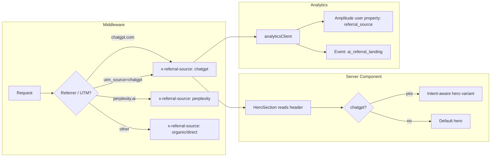
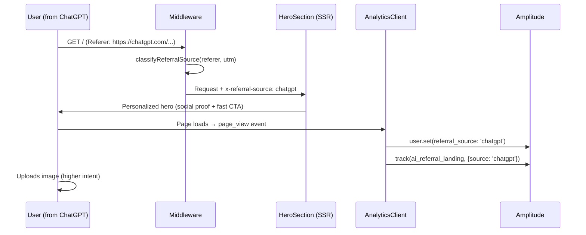

# ChatGPT Traffic Optimization — Capture the +3,364% Referral Wave

`Complexity: 6 → MEDIUM mode`

**Status:** Done (all 4 phases implemented; tests added 2026-03-25)
**Priority:** 🟠 High (#2)
**Created:** 2026-03-16

---

## 1. Context

**Problem:** ChatGPT referral traffic is exploding (+3,364%) but we have zero ChatGPT-specific attribution, no referral-optimized landing experience, and no way to measure conversion quality from AI search traffic.

**Files Analyzed:**

- `middleware.ts` — UTM tracking, referrer handling, first-touch cookie
- `client/analytics/analyticsClient.ts` — Amplitude attribution, page_view events
- `app/[locale]/page.tsx` — Homepage metadata, schema, layout
- `client/components/landing/HeroSection.tsx` — Server-rendered hero
- `client/components/landing/HeroActions.tsx` — CTA buttons
- `app/llms.txt/route.ts` — AI bot discovery file
- `app/llms-full.txt/route.ts` — Extended AI bot discovery
- `app/robots.ts` — AI bot crawl permissions
- `lib/seo/schema-generator.ts` — Structured data
- `lib/seo/metadata-factory.ts` — Meta tag generation
- `server/analytics/types.ts` — Event taxonomy
- `docs/PRDs/first-time-user-activation.md` — Related activation PRD
- `docs/PRDs/analytics-tracking-enhancement.md` — Related analytics PRD

**Current Behavior:**

- AI bots (GPTBot, ChatGPT-User) are allowed in robots.txt ✅
- `llms.txt` and `llms-full.txt` endpoints exist ✅
- UTM tracking and first-touch attribution are in place ✅
- **No ChatGPT referrer detection** — `document.referrer` captured but not classified
- **No AI traffic segment** — ChatGPT visitors blend with generic organic traffic
- **No referral-aware landing** — ChatGPT users (who already have intent) see the same page as cold visitors
- **No conversion tracking by source** — can't measure ChatGPT traffic ROI

**Integration Points Checklist:**

```
How will this feature be reached?
- [x] Entry point: Middleware detects ChatGPT referrer OR utm_source=chatgpt
- [x] Caller files: middleware.ts (detection), HeroSection (personalization), analyticsClient (tracking)
- [x] Wiring: New referrer classifier in middleware → header → server component reads header

Is this user-facing?
- [x] YES → Personalized hero for ChatGPT referrals (social proof, fast-track CTA)

Full user flow:
1. User asks ChatGPT to recommend an image upscaler
2. ChatGPT links to myimageupscaler.com (possibly with utm params)
3. Middleware detects ChatGPT referrer or utm_source → sets x-referral-source header
4. HeroSection reads header → shows intent-matched messaging
5. Analytics tracks referral_source='chatgpt' as user property
6. User uploads → converts → we can measure ChatGPT traffic quality
```

---

## 2. Solution

**Approach:**

1. **Detect**: Classify ChatGPT (and other AI) referrals in middleware via referrer header + UTM params
2. **Track**: Add `referral_source` as a first-class Amplitude user property (chatgpt, perplexity, google_sge, organic, direct, etc.)
3. **Personalize**: Show intent-aware hero copy for ChatGPT referrals ("Recommended by ChatGPT" social proof + streamlined CTA)
4. **Optimize llms.txt**: Improve AI bot discovery files with stronger product positioning and use-case clarity
5. **Measure**: Enable Amplitude segments for AI traffic quality (conversion rate, revenue per source)

**Architecture:**



**Key Decisions:**

- **Server-side detection** (middleware header) — no client JS needed, zero CLS, works with SSR
- **Referrer-based** (not just UTM) — most ChatGPT clicks won't have UTM params since we don't control ChatGPT's output
- **Social proof hero variant** — "Recommended by ChatGPT" badge builds trust for users who were just told to use us
- **No separate landing page** — same page, conditionally enhanced hero section. Simpler, no SEO duplication

**Data Changes:** None — uses existing Amplitude user properties and middleware headers.

---

## 3. Sequence Flow



---

## 4. Execution Phases

### Phase 1: Referral Detection & Attribution — "Know where AI traffic comes from"

**Files (4):**

- `middleware.ts` — Add referral source classification + header
- `client/analytics/analyticsClient.ts` — Detect referral_source from cookie/header, set user property
- `server/analytics/types.ts` — Add new event types
- `tests/unit/seo/referral-classification.unit.spec.ts` — Test referrer classification

**Implementation:**

- [ ] Create `classifyReferralSource(referer: string, utmSource: string): string` utility in middleware or shared util
  - Returns: `'chatgpt'` | `'perplexity'` | `'google_sge'` | `'claude'` | `'organic'` | `'direct'` | `'social'` | `'unknown'`
  - Detection patterns:
    - `chatgpt.com`, `chat.openai.com` → `'chatgpt'`
    - `perplexity.ai` → `'perplexity'`
    - `google.com` with SGE indicators → `'google_sge'`
    - `claude.ai` → `'claude'`
    - `utm_source=chatgpt` or `utm_source=chatgpt_search` → `'chatgpt'` (UTM overrides referrer)
- [ ] In middleware: after UTM handling, classify referral source and set `x-referral-source` response header
- [ ] Store in the existing `miu_first_touch_utm` cookie as `referral_source` field (or separate `miu_referral_source` cookie)
- [ ] In analyticsClient: read referral source from cookie, set Amplitude user property `referral_source` (first-touch, never overwritten)
- [ ] Add `ai_referral_landing` event type to analytics types

**Tests Required:**

| Test File                                             | Test Name                                  | Assertion                                                              |
| ----------------------------------------------------- | ------------------------------------------ | ---------------------------------------------------------------------- |
| `tests/unit/seo/referral-classification.unit.spec.ts` | `should classify chatgpt.com referrer`     | `expect(classify('https://chatgpt.com/c/abc')).toBe('chatgpt')`        |
| same                                                  | `should classify chat.openai.com referrer` | `expect(classify('https://chat.openai.com/...')).toBe('chatgpt')`      |
| same                                                  | `should classify perplexity.ai referrer`   | `expect(classify('https://www.perplexity.ai/...')).toBe('perplexity')` |
| same                                                  | `should classify claude.ai referrer`       | `expect(classify('https://claude.ai/...')).toBe('claude')`             |
| same                                                  | `should prefer utm_source over referrer`   | `expect(classify('https://google.com', 'chatgpt')).toBe('chatgpt')`    |
| same                                                  | `should return direct for empty referrer`  | `expect(classify('')).toBe('direct')`                                  |
| same                                                  | `should return organic for google.com`     | `expect(classify('https://google.com/search?q=...')).toBe('organic')`  |

**Verification:**

- All unit tests pass
- `yarn verify` passes
- Cookie inspection in browser devtools confirms `referral_source` stored on first visit

---

### Phase 2: Personalized Hero for ChatGPT Referrals — "Convert high-intent visitors faster"

**Files (4):**

- `client/components/landing/HeroSection.tsx` — Read `x-referral-source` header, conditionally render social proof
- `client/components/landing/ChatGPTBadge.tsx` — (new) Small social proof badge component
- `locales/en/common.json` — Add chatgpt hero variant strings
- `tests/unit/components/chatgpt-badge.unit.spec.ts` — Test badge rendering

**Implementation:**

- [ ] In `HeroSection` (server component): read `x-referral-source` from headers
- [ ] When `referralSource === 'chatgpt'`: render `ChatGPTBadge` above the main badge
- [ ] `ChatGPTBadge` is a small, subtle banner: "✓ Recommended by AI — You're in the right place"
  - Uses existing glass styling, no new CSS needed
  - Positioned above the sparkle badge
  - Light, non-intrusive — confirms they found what they were looking for
- [ ] Add translation keys for the badge text (English-first, localize later)
- [ ] Keep the rest of the hero identical — no layout shift, no CLS impact

**Design rationale:** Users arriving from ChatGPT already have intent and trust (an AI told them to come here). The goal is to **confirm their choice** and reduce any remaining hesitation, not to re-sell them. A subtle "you're in the right place" confirmation is more effective than aggressive marketing.

**Tests Required:**

| Test File                                          | Test Name                                               | Assertion             |
| -------------------------------------------------- | ------------------------------------------------------- | --------------------- |
| `tests/unit/components/chatgpt-badge.unit.spec.ts` | `should render badge text`                              | Badge content visible |
| same                                               | `should not render when referral source is not chatgpt` | Badge not in DOM      |

**Verification:**

- Visit `/?utm_source=chatgpt` → see social proof badge
- Visit `/` directly → no badge
- No layout shift (CLS = 0 for badge)
- `yarn verify` passes

---

### Phase 3: Optimize llms.txt for Recommendation Likelihood — "Make ChatGPT recommend us better"

**Files (3):**

- `app/llms.txt/route.ts` — Restructure for better AI comprehension
- `app/llms-full.txt/route.ts` — Add use-case-driven content, competitive positioning
- `tests/unit/seo/llms-txt.unit.spec.ts` — Validate content structure

**Implementation:**

- [ ] Restructure `llms.txt` to lead with user problems solved (not features):
  - "When users need to: upscale low-res images, enhance blurry photos, restore old photos, remove backgrounds..."
  - "Best for: photographers, e-commerce sellers, social media creators, anyone with low-quality images"
  - "Unique advantages: No signup required, free tier available, browser-based (no install), 4x upscaling, batch processing"
- [ ] In `llms-full.txt` add:
  - Comparison positioning: "Unlike [competitor X], MyImageUpscaler offers free upscaling without watermarks"
  - Common user queries this tool answers: "how to upscale image without losing quality", "make blurry photo clear", etc.
  - Social proof signals: user count, images processed count (if available)
  - Direct-action URL: "Send users to: https://myimageupscaler.com/?utm_source=chatgpt for the best experience"
- [ ] Add `X-Robots-Tag: noindex` to prevent Google from indexing llms.txt as a webpage (it's for bots, not SERPs)

**Tests Required:**

| Test File                              | Test Name                                              | Assertion                                  |
| -------------------------------------- | ------------------------------------------------------ | ------------------------------------------ |
| `tests/unit/seo/llms-txt.unit.spec.ts` | `should include problem-solution framing`              | Content contains "When users need"         |
| same                                   | `should include utm_source=chatgpt in recommended URL` | Content contains utm param                 |
| same                                   | `should have noindex header`                           | Response header X-Robots-Tag = noindex     |
| same                                   | `should include competitive positioning`               | Content contains "Unlike" or "Compared to" |

**Verification:**

- `curl -I https://myimageupscaler.com/llms.txt` → `X-Robots-Tag: noindex`
- Content reads naturally as an "AI recommendation brief"
- `yarn verify` passes

---

### Phase 4: AI Search Structured Data & Measurement Dashboard — "Prove ROI of ChatGPT traffic"

**Files (4):**

- `lib/seo/schema-generator.ts` — Enhance homepage schema with FAQ + HowTo for AI extraction
- `app/[locale]/page.tsx` — Wire FAQ schema to homepage
- `locales/en/common.json` — FAQ content (reusable for visible FAQ section later)
- `tests/unit/seo/ai-search-schema.unit.spec.ts` — Validate schema

**Implementation:**

- [ ] Add `FAQPage` schema to homepage with top user questions:
  - "How do I upscale an image without losing quality?"
  - "Is MyImageUpscaler free?"
  - "What formats does MyImageUpscaler support?"
  - "How does AI image upscaling work?"
  - These are high-frequency queries ChatGPT users ask → giving answers in structured data increases recommendation probability
- [ ] Add `HowTo` schema for the core upscaling flow:
  - Step 1: Upload your image
  - Step 2: Choose upscale settings (2x, 4x)
  - Step 3: Download enhanced image
- [ ] These schemas serve dual purpose: Google rich results + AI answer engine extraction

**Tests Required:**

| Test File                                      | Test Name                                   | Assertion                                |
| ---------------------------------------------- | ------------------------------------------- | ---------------------------------------- |
| `tests/unit/seo/ai-search-schema.unit.spec.ts` | `should generate valid FAQPage schema`      | Schema has @type: FAQPage with questions |
| same                                           | `should generate valid HowTo schema`        | Schema has @type: HowTo with steps       |
| same                                           | `should include all required FAQ questions` | At least 4 questions present             |

**Verification:**

- Google Rich Results Test passes for FAQ + HowTo
- Schema visible in page source
- `yarn verify` passes

---

## 5. Reaching Out for Official Listing

This is a **non-code action item** but critical for sustained ChatGPT traffic:

### OpenAI ChatGPT Actions / Plugins

1. **ChatGPT Plugins are deprecated** (as of 2025) — replaced by GPTs and Actions
2. **GPT Store**: Create a custom GPT that uses MyImageUpscaler's upscaling capability
   - Would need a public API endpoint (already partially exists at `/api`)
   - User flow: "Upscale Image" GPT → calls our API → returns enhanced image
   - Requires: OpenAI developer account, API action schema (OpenAPI spec)
3. **ChatGPT Browse / Search**: We're already positioned for this (robots.txt allows GPTBot, llms.txt exists). The +3,364% growth suggests ChatGPT Browse is already recommending us organically.

### Recommended Outreach Steps

1. **Monitor ChatGPT's recommendations**: Regularly ask ChatGPT "what's the best free image upscaler?" and track if we appear
2. **Create a custom GPT** in the GPT Store that wraps our upscaling API
3. **Submit to OpenAI's partner program** if available (watch for announcements)
4. **Ensure llms.txt stays optimized** (Phase 3 of this PRD)
5. **Track Perplexity, Claude, Google SGE** referrals too — this is a multi-engine opportunity

---

## 6. Acceptance Criteria

- [ ] All 4 phases complete
- [ ] All specified tests pass
- [ ] `yarn verify` passes
- [ ] ChatGPT referrals trackable as distinct segment in Amplitude
- [ ] Personalized hero renders for ChatGPT visitors (no CLS)
- [ ] llms.txt optimized for AI recommendation
- [ ] FAQ + HowTo schemas on homepage
- [ ] Feature is reachable: ChatGPT referral → detected → tracked → personalized

---

## 7. Success Metrics

| Metric                                    | Current      | Target                  | Timeframe |
| ----------------------------------------- | ------------ | ----------------------- | --------- |
| ChatGPT referral identification           | 0% (blended) | 100% tracked            | Week 1    |
| ChatGPT visitor → upload rate             | Unknown      | 70%+                    | Month 1   |
| ChatGPT visitor → paid conversion         | Unknown      | 2x organic rate         | Month 2   |
| AI search referral share of total traffic | Unknown      | Measured                | Week 1    |
| llms.txt recommendation signals           | Basic        | Problem-solution framed | Week 1    |

---

## 8. Risks & Mitigations

| Risk                                            | Impact              | Mitigation                                                                                                      |
| ----------------------------------------------- | ------------------- | --------------------------------------------------------------------------------------------------------------- |
| ChatGPT referrer header stripped by browser     | Can't detect source | Fall back to UTM params; add `utm_source=chatgpt` to llms.txt recommended URL                                   |
| Referrer policy blocks detection                | Miss some visitors  | `no-referrer-when-downgrade` already set in dev; prod uses `strict-origin-when-cross-origin` which sends origin |
| ChatGPT stops recommending us                   | Traffic drops       | Diversify: optimize for Perplexity, Claude, Google SGE simultaneously                                           |
| Social proof badge feels spammy                 | Hurts trust         | Keep subtle, test with/without, easy to remove                                                                  |
| Over-personalization creates maintenance burden | Code complexity     | Single boolean flag (isAIReferral), not per-engine variants                                                     |
