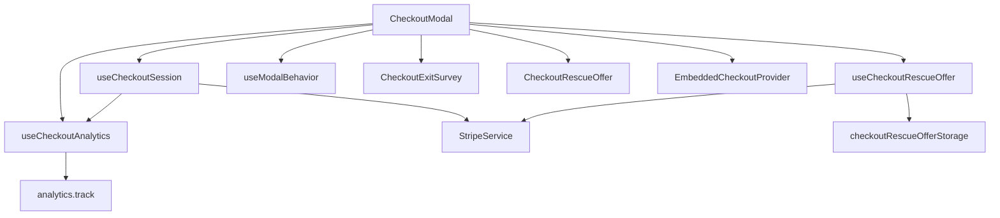
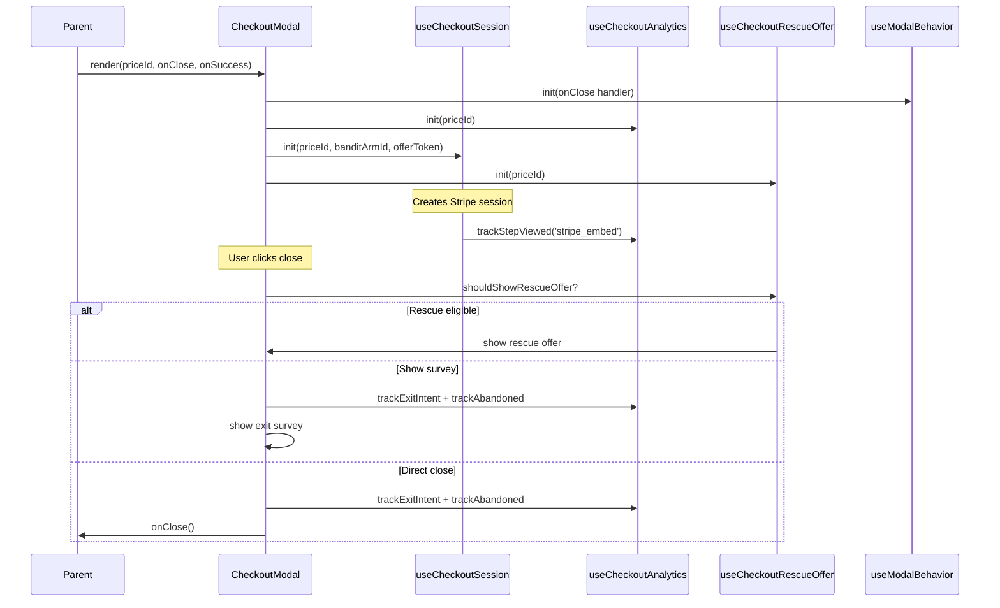

# PRD: CheckoutModal Refactoring

**Complexity: 4 → MEDIUM mode**

| Score | Reason                                                   |
| ----- | -------------------------------------------------------- |
| +2    | Touches 6-10 files                                       |
| +2    | Complex state logic (12 useState, 8 useRef, 7 useEffect) |

## 1. Context

**Problem:** `CheckoutModal.tsx` (672 lines) is a monolithic component that violates SRP, DRY, and KISS — it handles modal UI, Stripe session lifecycle, analytics tracking, rescue offer flow, exit survey flow, keyboard handling, scroll locking, slow-loading detection, device detection, and plan name resolution all in one place.

**Files Analyzed:**

- `client/components/stripe/CheckoutModal.tsx` — the target (672 lines)
- `client/store/checkoutStore.ts` — existing Zustand store (open/close + pending checkout)
- `client/hooks/useCheckoutFlow.ts` — hook that manages showing the modal
- `client/hooks/useRegionTier.ts` — region/bandit data consumed by modal
- `client/utils/checkoutRescueOfferStorage.ts` — sessionStorage for rescue offers
- `client/utils/checkoutRescueOfferVisibility.ts` — visibility predicate
- `client/utils/checkoutTrackingContext.ts` — tracking context in sessionStorage
- `client/components/stripe/CheckoutExitSurvey.tsx` — exit survey child component
- `client/components/stripe/CheckoutRescueOffer.tsx` — rescue offer child component
- `server/analytics/types.ts` — TCheckoutStep, TCheckoutExitMethod types

**Current Behavior:**

- Modal opens via `useCheckoutFlow` or direct render with `priceId`
- Creates a Stripe embedded checkout session (with timeout, retry, rescue offer token)
- Tracks 6+ distinct analytics events (step_viewed, exit_intent, abandoned, error, step_time, completion)
- On close: conditionally shows rescue offer → exit survey → finally closes
- Manages escape key, body scroll lock, backdrop click, slow-loading timer

## 2. Solution

**Approach:**

- Extract **4 custom hooks** that each own a single responsibility
- Move **2 utility functions** to shared locations
- Keep the existing `checkoutStore.ts` Zustand store as-is (it already handles the right cross-component state: open/close + pending checkout)
- The refactored `CheckoutModal` becomes a ~150-line composition layer that wires hooks to JSX
- **No behavioral changes** — this is a pure refactor; all analytics events, UI flows, and edge cases remain identical

**Why hooks over expanding Zustand?** The 12 useState + 8 useRef are all scoped to the modal's mount lifecycle. They don't need to be shared across components. Zustand would add indirection without benefit here (YAGNI). The existing Zustand store already handles the only truly cross-component state (modal open/close).

**Architecture Diagram:**



**Key Decisions:**

- [x] No new libraries — existing `zustand`, React hooks only
- [x] Error handling stays identical — each hook preserves current error behavior
- [x] Utility functions move to `client/utils/` (detectDeviceType) and `shared/config/stripe.ts` (determinePlanFromPriceId)
- [x] Existing tests remain green throughout — no behavioral changes

**Data Changes:** None

## 3. Sequence Flow



## 4. Execution Phases

### Phase 1: Extract utility functions

**Files (2):**

- `client/utils/detectDeviceType.ts` — new, move `detectDeviceType()` from CheckoutModal
- `shared/config/stripe.ts` — add `determinePlanFromPriceId()` (lives near `STRIPE_PRICES`)

**Implementation:**

- [ ] Create `client/utils/detectDeviceType.ts` with the existing function (lines 73-89 of CheckoutModal)
- [ ] Move `determinePlanFromPriceId()` to `shared/config/stripe.ts` next to `STRIPE_PRICES`
- [ ] Update CheckoutModal imports to use new locations
- [ ] Verify no other files import these from CheckoutModal (grep confirms none do)

**Tests Required:**

| Test File                                               | Test Name                                                    | Assertion                                                                 |
| ------------------------------------------------------- | ------------------------------------------------------------ | ------------------------------------------------------------------------- |
| `tests/unit/client/utils/detectDeviceType.unit.spec.ts` | `should return 'desktop' when window.innerWidth >= 1024`     | `expect(result).toBe('desktop')`                                          |
| `tests/unit/client/utils/detectDeviceType.unit.spec.ts` | `should return 'mobile' when width < 768`                    | `expect(result).toBe('mobile')`                                           |
| `tests/unit/shared/config/stripe-plan.unit.spec.ts`     | `should resolve each STRIPE_PRICES constant to correct plan` | `expect(determinePlanFromPriceId(STRIPE_PRICES.PRO_MONTHLY)).toBe('pro')` |
| `tests/unit/shared/config/stripe-plan.unit.spec.ts`     | `should default to hobby for unknown priceId`                | `expect(determinePlanFromPriceId('price_unknown')).toBe('hobby')`         |

**Verification:**

- `yarn verify` passes
- CheckoutModal behavior unchanged (existing e2e tests green)

---

### Phase 2: Extract `useCheckoutAnalytics` hook

**Files (2):**

- `client/hooks/useCheckoutAnalytics.ts` — new hook
- `client/components/stripe/CheckoutModal.tsx` — consume hook

**Implementation:**

- [ ] Create `useCheckoutAnalytics(priceId: string, pricingRegion: string)` hook containing:
  - `modalOpenedAtRef`, `checkoutCompletedRef`, `exitIntentTrackedRef`, `currentStepRef`, `loadStartRef`
  - `trackStepViewed(step, loadTimeMs?)` callback
  - `trackExitIntent(step, method)` callback
  - `trackCheckoutAbandoned(step)` callback
  - `trackError(errorType, errorMessage, step)` callback
  - `markCompleted()` — sets `checkoutCompletedRef.current = true`
  - The 5-second `checkout_step_time` interval useEffect
  - The mount/unmount useEffect that tracks initial step + cleanup exit intent
- [ ] Hook returns: `{ trackStepViewed, trackExitIntent, trackCheckoutAbandoned, trackError, markCompleted, currentStepRef, checkoutCompletedRef, exitIntentTrackedRef, loadStartRef, resetLoadStart }`
- [ ] Replace all analytics refs/callbacks in CheckoutModal with hook return values

**Tests Required:**

| Test File                                                   | Test Name                                              | Assertion                                                                                                                   |
| ----------------------------------------------------------- | ------------------------------------------------------ | --------------------------------------------------------------------------------------------------------------------------- |
| `tests/unit/client/hooks/useCheckoutAnalytics.unit.spec.ts` | `should track step_viewed on mount`                    | `expect(analytics.track).toHaveBeenCalledWith('checkout_step_viewed', expect.objectContaining({ step: 'plan_selection' }))` |
| `tests/unit/client/hooks/useCheckoutAnalytics.unit.spec.ts` | `should sanitize error messages (remove card numbers)` | `expect(sanitized).not.toContain('4242424242424242')`                                                                       |
| `tests/unit/client/hooks/useCheckoutAnalytics.unit.spec.ts` | `should track exit_intent on unmount if not completed` | `expect(analytics.track).toHaveBeenCalledWith('checkout_exit_intent', ...)`                                                 |
| `tests/unit/client/hooks/useCheckoutAnalytics.unit.spec.ts` | `should NOT track exit_intent on unmount if completed` | `expect(analytics.track).not.toHaveBeenCalledWith('checkout_exit_intent', ...)`                                             |

**Verification:**

- `yarn verify` passes
- Analytics events fire identically (unit tests prove parity)

---

### Phase 3: Extract `useCheckoutSession` hook

**Files (2):**

- `client/hooks/useCheckoutSession.ts` — new hook
- `client/components/stripe/CheckoutModal.tsx` — consume hook

**Implementation:**

- [ ] Create `useCheckoutSession(params)` hook containing:
  - Params: `{ priceId, banditArmId, regionLoading, appliedOfferToken, trackStepViewed, trackError }`
  - State: `clientSecret`, `loading`, `slowLoading`, `error`, `errorCode`
  - The Stripe session creation useEffect (lines 406-497)
  - The slow-loading timer useEffect (lines 225-236)
  - The Stripe config check useEffect (lines 212-218)
  - `retry()` function that resets state and increments retryKey
  - `stripeOptions` computed from clientSecret + onComplete callback
- [ ] Hook returns: `{ clientSecret, loading, slowLoading, error, errorCode, retry, rescueOfferApplied, engagementDiscountApplied }`
- [ ] Note: `onComplete` callback is passed in as param so the hook can wire it into stripeOptions
- [ ] Replace session-related state/effects in CheckoutModal with hook

**Tests Required:**

| Test File                                                 | Test Name                                                | Assertion                                                              |
| --------------------------------------------------------- | -------------------------------------------------------- | ---------------------------------------------------------------------- |
| `tests/unit/client/hooks/useCheckoutSession.unit.spec.ts` | `should set clientSecret on successful session creation` | `expect(result.current.clientSecret).toBeTruthy()`                     |
| `tests/unit/client/hooks/useCheckoutSession.unit.spec.ts` | `should set error on timeout after 30s`                  | `expect(result.current.error).toContain('too long')`                   |
| `tests/unit/client/hooks/useCheckoutSession.unit.spec.ts` | `should show slowLoading after 2s`                       | `expect(result.current.slowLoading).toBe(true)`                        |
| `tests/unit/client/hooks/useCheckoutSession.unit.spec.ts` | `should retry with fresh session on retry()`             | `expect(StripeService.createCheckoutSession).toHaveBeenCalledTimes(2)` |

**Verification:**

- `yarn verify` passes
- Session creation behavior identical

---

### Phase 4: Extract `useCheckoutRescueOffer` hook + `useModalBehavior` hook

**Files (3):**

- `client/hooks/useCheckoutRescueOffer.ts` — new hook
- `client/hooks/useModalBehavior.ts` — new hook (generic, reusable)
- `client/components/stripe/CheckoutModal.tsx` — final slim-down

**Implementation:**

- [ ] Create `useCheckoutRescueOffer(priceId: string)` hook containing:
  - State: `showRescueOffer`, `rescueOffer`, `applyingRescueOffer`, `appliedOfferToken`
  - `hydrateFromStorage()` — reads sessionStorage on mount (current line 221)
  - `tryShowRescueOffer(params)` — the rescue offer branch from handleClose (lines 317-349)
  - `claimOffer()` — current `handleRescueOfferClaim` logic (lines 525-541)
  - `dismissOffer(trackAbandoned)` — current `handleRescueOfferDismiss` logic (lines 543-547)
  - `clearOffer()` — called on checkout completion
- [ ] Hook returns: `{ showRescueOffer, rescueOffer, applyingRescueOffer, appliedOfferToken, tryShowRescueOffer, claimOffer, dismissOffer, clearOffer }`

- [ ] Create `useModalBehavior(onClose: () => void)` hook containing:
  - Escape key handler useEffect (lines 387-395)
  - Body scroll lock useEffect (lines 398-404)
- [ ] This hook is generic and reusable for any modal

- [ ] Refactor CheckoutModal to compose all 4 hooks + render JSX only (~150 lines)
- [ ] The `handleClose` function becomes a clean orchestration:
  ```
  if showSurvey → dismiss survey → onClose
  if showRescueOffer → dismiss → onClose
  if not completed → try rescue offer → try exit survey → track → onClose
  ```

**Tests Required:**

| Test File                                                     | Test Name                                                 | Assertion                                                 |
| ------------------------------------------------------------- | --------------------------------------------------------- | --------------------------------------------------------- |
| `tests/unit/client/hooks/useCheckoutRescueOffer.unit.spec.ts` | `should hydrate offer from sessionStorage on mount`       | `expect(result.current.rescueOffer).toEqual(storedOffer)` |
| `tests/unit/client/hooks/useCheckoutRescueOffer.unit.spec.ts` | `should set appliedOfferToken on claim`                   | `expect(result.current.appliedOfferToken).toBe(token)`    |
| `tests/unit/client/hooks/useCheckoutRescueOffer.unit.spec.ts` | `should call onClose on dismiss`                          | `expect(onCloseMock).toHaveBeenCalled()`                  |
| `tests/unit/client/hooks/useModalBehavior.unit.spec.ts`       | `should call onClose on Escape key`                       | `expect(onClose).toHaveBeenCalled()`                      |
| `tests/unit/client/hooks/useModalBehavior.unit.spec.ts`       | `should lock body scroll on mount and restore on unmount` | `expect(document.body.style.overflow).toBe('hidden')`     |

**Verification:**

- `yarn verify` passes
- All existing e2e tests pass
- CheckoutModal.tsx is ~150 lines (down from 672)
- Each hook file is <120 lines

## 5. Acceptance Criteria

- [ ] All 4 phases complete
- [ ] All new unit tests pass
- [ ] All existing tests pass (no behavioral changes)
- [ ] `yarn verify` passes
- [ ] CheckoutModal.tsx reduced from 672 lines to ~150 lines
- [ ] No SRP violations: each hook has one responsibility
- [ ] No DRY violations: utility functions extracted and reusable
- [ ] Each new file is <120 lines
- [ ] `detectDeviceType` and `determinePlanFromPriceId` are importable from their new locations
- [ ] `useModalBehavior` is generic (no checkout-specific logic)

## 6. Files Created/Modified Summary

| File                                                          | Action | Purpose                            |
| ------------------------------------------------------------- | ------ | ---------------------------------- |
| `client/utils/detectDeviceType.ts`                            | Create | Device type detection utility      |
| `shared/config/stripe.ts`                                     | Modify | Add `determinePlanFromPriceId`     |
| `client/hooks/useCheckoutAnalytics.ts`                        | Create | All checkout analytics tracking    |
| `client/hooks/useCheckoutSession.ts`                          | Create | Stripe session lifecycle           |
| `client/hooks/useCheckoutRescueOffer.ts`                      | Create | Rescue offer state machine         |
| `client/hooks/useModalBehavior.ts`                            | Create | Escape key + scroll lock (generic) |
| `client/components/stripe/CheckoutModal.tsx`                  | Modify | Slim composition layer             |
| `tests/unit/client/utils/detectDeviceType.unit.spec.ts`       | Create | Tests                              |
| `tests/unit/shared/config/stripe-plan.unit.spec.ts`           | Create | Tests                              |
| `tests/unit/client/hooks/useCheckoutAnalytics.unit.spec.ts`   | Create | Tests                              |
| `tests/unit/client/hooks/useCheckoutSession.unit.spec.ts`     | Create | Tests                              |
| `tests/unit/client/hooks/useCheckoutRescueOffer.unit.spec.ts` | Create | Tests                              |
| `tests/unit/client/hooks/useModalBehavior.unit.spec.ts`       | Create | Tests                              |

## 7. Risks

- **Analytics regression** — Mitigated by unit tests that assert exact event names + properties for each tracking call. The hook tests provide better coverage than what exists today (no direct CheckoutModal analytics tests exist currently).
- **Race condition in session creation** — The timeout/abort logic is complex. The `useCheckoutSession` hook preserves it exactly; tests explicitly cover the timeout path.
- **Rescue offer flow** — Multiple async paths (stored offer, create new, API failure). Extracted hook tests cover all three branches.
