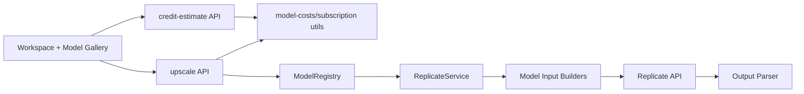
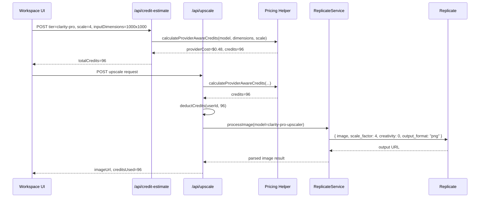

# PRD: Clarity Pro and Recraft Crisp Upscale Models

**Version:** 1.0
**Status:** Ready
**Date:** May 7, 2026
**Author:** Principal Architect
**Complexity:** 9 -> HIGH mode

---

## 1. Context

### Problem

MyImageUpscaler needs to add two Replicate upscaling models with correct provider inputs, before/after gallery assets, and credit pricing that reflects actual provider economics instead of flat model multipliers.

### Files Analyzed

```
.claude/skills/add-ai-model/SKILL.md
.claude/skills/add-gallery-images/SKILL.md
.claude/skills/replicate-before-after/SKILL.md
shared/config/credits.config.ts
shared/config/model-costs.config.ts
shared/config/subscription.config.ts
shared/config/subscription.utils.ts
shared/types/coreflow.types.ts
shared/validation/upscale.schema.ts
server/services/model-registry.ts
server/services/model-registry.types.ts
server/services/providers/replicate.provider-adapter.ts
server/services/replicate.service.ts
server/services/replicate/builders/model-input.builder.ts
server/services/replicate/builders/model-input.types.ts
server/services/replicate/builders/models/clarity-upscaler.builder.ts
server/services/image-generation.service.ts
app/api/upscale/route.ts
app/api/credit-estimate/route.ts
client/components/features/workspace/ModelGalleryModal.tsx
client/components/features/workspace/ModelCard.tsx
client/components/features/workspace/BatchSidebar/QualityTierSelector.tsx
client/components/features/workspace/BatchSidebar/UpscaleFactorSelector.tsx
public/before-after/
docs/management/regional-pricing-margin-analysis.md
docs/PRDs/variable-credit-costs-per-model.md
```

### Current Behavior

- Replicate model onboarding is split across cost config, credit config, model registry, model ID types, provider supported models, builders, validation, quality tier config, and UI gallery config.
- Existing premium upscale credits are mostly fixed or scale-multiplier based.
- `MODEL_SCALE_CREDIT_MULTIPLIERS` handles scale-aware pricing for old `clarity-upscaler`, but it cannot price models billed by output megapixel.
- `creditCosts.maximumCost` currently caps premium jobs around 20 credits, which is unsafe for high-output Clarity Pro jobs.
- Gallery before/after images already live in `public/before-after/{tier}/before.webp` and `after.webp`, with `QUALITY_TIER_CONFIG.previewImages` pointing at those files.

### External Model Facts Fetched

| Model | Replicate URL | Latest version | Inputs | Pricing | Example before | Example after |
|-------|---------------|----------------|--------|---------|----------------|---------------|
| Clarity Pro Upscaler | `https://replicate.com/philz1337x/clarity-pro-upscaler` | `8e33eb474936d75d3ceaa787f3e66f5ba16f35db0853a7697a4ca4e5fc14b6cd` | `image`, `scale_factor` enum `2/4/8/16`, `creativity` `-10..10`, `output_format` `png/jpg` | `$0.03` per output megapixel, `$0.03` minimum, 64MP output cap | `https://replicate.delivery/pbxt/P1JJHJWKqtuYlyUYLexBeYOFST6Vc2M3nGrjkpV0JLkRpn9J/flux_input.jpg` | `https://replicate.delivery/xezq/P3PaZ1wzAE7hL16eaM4Gy5Jq5l1QLqEfUuGZPtvPaLM7vcgWA/tmpyv_avm5x.png` |
| Recraft Crisp Upscale | `https://replicate.com/recraft-ai/recraft-crisp-upscale` | `2177c1e3a177f5a76c632e467c32b413e424c23d84e43f7b036a965e305f6557` | `image` only | `$6` per 1,000 output images = `$0.006` per image | `https://replicate.delivery/pbxt/MKdkS3Po0PXytPbTXh4bOlBX1BZRuXH4o34yXVEakeBlpiTW/blonde_mj.png` | `https://replicate.delivery/czjl/MbxcznPodb6nN1hIgSVAPf9DGJOA2HvJYGxbzW4T26BYE2CKA/tmpo2nljpw_.webp` |

Source pages:

- `https://replicate.com/philz1337x/clarity-pro-upscaler`
- `https://replicate.com/philz1337x/clarity-pro-upscaler/api`
- `https://replicate.com/recraft-ai/recraft-crisp-upscale`
- `https://replicate.com/recraft-ai/recraft-crisp-upscale/api`

---

## 2. Solution

### Approach

1. Add two new internal model IDs: `clarity-pro-upscaler` and `recraft-crisp-upscale`.
2. Add two quality tiers:
   - `clarity-pro`: premium pixel-priced creative/detail upscaler.
   - `crisp-upscale`: fixed-cost sharp/clean upscale tier powered by Recraft.
3. Extend cost calculation to support provider-cost-based dynamic credits for models where cost depends on input dimensions and scale.
4. Add model-specific builders, registry entries, provider support, validation, and UI gallery cards.
5. Download/convert before-after examples to `public/before-after/{tier}/before.webp` and `after.webp`.

### Architecture



### Integration Points Checklist

**How will this feature be reached?**

- [x] Entry point identified: Model Gallery tier selection in workspace, then `/api/credit-estimate` and `/api/upscale`.
- [x] Caller file identified: `client/components/features/workspace/BatchSidebar.tsx` and subcomponents drive tier/scale selection; `app/api/upscale/route.ts` invokes `ReplicateService`.
- [x] Registration/wiring needed: model registry, Replicate provider supported models, builder orchestrator, quality tier config, validation enum, credit estimate route, gallery assets.

**Is this user-facing?**

- [x] YES -> UI components required: Model Gallery cards, tier selector cost display, scale selector behavior, credit estimate display, insufficient-credit messaging.

**Full user flow:**

1. User opens Model Gallery and selects `Clarity Pro` or `Crisp Upscale`.
2. UI updates available scale controls:
   - `clarity-pro`: show 2x/4x/8x for launch.
   - `crisp-upscale`: hide scale controls because the Replicate model has no scale parameter.
3. UI calls `/api/credit-estimate`.
4. API calculates fixed credits for Recraft or dynamic pixel-aware credits for Clarity Pro.
5. User clicks upscale.
6. `/api/upscale` validates model access, charges credits, calls Replicate with the correct input schema, and returns the output URL.
7. Result appears in workspace; analytics records model, credits, scale, estimated provider cost.

### Key Decisions

- **Clarity Pro must be dynamic-priced.** Its provider cost is `max($0.03, outputMP * $0.03)`, so fixed multipliers would either overcharge small images or lose money on large images.
- **Use `$0.005 provider cost per credit` as the pricing target.** This matches the existing base-case economics doc and preserves margin even in discounted regions better than a `$0.010` ceiling-only approach.
- **Recraft Crisp should be 2 credits.** Provider cost is `$0.006/image`; 2 credits yields `$0.003` provider cost per credit and fits existing premium-but-affordable model pricing.
- **Clarity Pro launch supports 2x/4x/8x only.** The model supports 16x, but the product schema and UI currently support 2/4/8. Exposing 16x should be a separate follow-up after UX and affordability messaging are designed.
- **Recraft Crisp needs fixed-scale metadata, not user scale support.** The model input has only `image`; add `fixedOutputScale: 4` or equivalent metadata for output-dimension reporting while keeping `supportedScales: []` so the UI does not show a fake selector.

### Economics

Current standard revenue per credit:

| Source | Revenue per credit |
|--------|--------------------|
| Starter subscription | `$0.0900` |
| Hobby subscription | `$0.0950` |
| Pro subscription | `$0.0490` |
| Business subscription | `$0.0298` |
| Small credit pack | `$0.0998` |
| Medium credit pack | `$0.0750` |
| Large credit pack | `$0.0667` |
| Lowest documented regional Business | `$0.0104` |

Credit conversion rules:

```ts
const PROVIDER_COST_PER_CREDIT_TARGET_USD = 0.005;

// Clarity Pro
outputMegapixels = min((inputWidth * scale * inputHeight * scale) / 1_000_000, 64);
providerCostUsd = max(0.03, outputMegapixels * 0.03);
credits = ceil(providerCostUsd / PROVIDER_COST_PER_CREDIT_TARGET_USD);

// Recraft Crisp
providerCostUsd = 0.006;
credits = 2;
```

Clarity Pro examples:

| Input -> Scale | Output MP | Provider cost | Credits | Provider cost / credit |
|----------------|-----------|---------------|---------|------------------------|
| Any tiny output under 1MP | `<1MP` | `$0.03` minimum | `6` | `$0.0050` |
| 0.25MP input at 2x | `1MP` | `$0.03` | `6` | `$0.0050` |
| 1MP input at 2x | `4MP` | `$0.12` | `24` | `$0.0050` |
| 1MP input at 4x | `16MP` | `$0.48` | `96` | `$0.0050` |
| 1MP input at 8x | `64MP` capped | `$1.92` | `384` | `$0.0050` |

Risk note: existing `maximumCost` around 20 credits would cap a 16MP Clarity Pro job at 20 credits while provider cost is `$0.48`, or `$0.024/credit`. Phase 2 must bypass or replace that global cap for pixel-priced models.

### Data Changes

No database migration required. Credit transaction RPCs already accept variable credit amounts.

---

## 3. Sequence Flow



---

## 4. Execution Phases

### Phase 1: Model Registry and Builders - "The server can construct valid Replicate inputs for both models"

**Files (5):**

- `shared/config/model-costs.config.ts` - add model cost constants, pixel-priced metadata, max input/output limits, tier arrays, `MODEL_CONFIG` entries.
- `shared/config/credits.config.ts` - add fixed Recraft multiplier and dynamic Clarity Pro credit constant metadata.
- `server/services/model-registry.types.ts` - add model IDs and optional `fixedOutputScale` / `pricingModel` fields.
- `server/services/model-registry.ts` - add default versions, cost maps, multiplier maps, registry entries.
- `server/services/replicate/builders/models/*.ts` plus `index.ts` / orchestrator registration - add `ClarityProUpscalerBuilder` and `RecraftCrispUpscaleBuilder`.

**Implementation:**

- [ ] Add model IDs:
  - `clarity-pro-upscaler`
  - `recraft-crisp-upscale`
- [ ] Add latest model versions:
  - `philz1337x/clarity-pro-upscaler`
  - `recraft-ai/recraft-crisp-upscale`
- [ ] Add Clarity Pro config:
  - `cost: 0.03` as minimum metadata.
  - `pricingModel: 'output-megapixel'`.
  - `outputMegapixelPriceUsd: 0.03`.
  - `minimumProviderCostUsd: 0.03`.
  - `maxOutputMegapixels: 64`.
  - `supportedScales: [2, 4, 8]` for launch.
  - `tierRestriction: 'hobby'` or stricter `pro` if product wants to reserve high-cost jobs.
- [ ] Add Recraft config:
  - `cost: 0.006`.
  - `pricingModel: 'per-image'`.
  - `fixedOutputScale: 4`.
  - `supportedScales: []`.
  - `capabilities: ['enhance', 'denoise', '4k-output']` plus product-specific metadata; do not expose fake scale controls.
- [ ] Clarity builder input:
  ```ts
  {
    image: imageDataUrl,
    scale_factor: context.scale,
    creativity: 0,
    output_format: 'png',
  }
  ```
- [ ] Recraft builder input:
  ```ts
  {
    image: imageDataUrl,
  }
  ```

**Tests Required:**

| Test File | Test Name | Assertion |
|-----------|-----------|-----------|
| `tests/unit/server/model-registry-new-upscalers.unit.spec.ts` | `registers clarity-pro-upscaler with versionless Replicate model` | registry returns model with `modelVersion === 'philz1337x/clarity-pro-upscaler'` |
| `tests/unit/server/model-registry-new-upscalers.unit.spec.ts` | `registers recraft-crisp-upscale as fixed-scale image-only model` | model has `supportedScales: []` and `fixedOutputScale: 4` |
| `server/services/__tests__/replicate.service.test.ts` | `builds Clarity Pro input schema` | input contains `image`, `scale_factor`, `creativity`, `output_format` |
| `server/services/__tests__/replicate.service.test.ts` | `builds Recraft Crisp input schema` | input contains only supported `image` field |

**User Verification:**

- Action: Run builder tests for both model IDs.
- Expected: No `No builder registered for model` errors and input keys match Replicate schemas.

### Phase 2: Pixel-Aware Credit Pricing - "Credit estimates and deductions protect margins for output-megapixel pricing"

**Files (5):**

- `shared/config/model-costs.config.ts` - export provider pricing metadata and helper constants.
- `shared/config/subscription.utils.ts` - add provider-aware credit calculation helper.
- `server/services/image-generation.service.ts` - use helper for service-side cost calculations.
- `app/api/credit-estimate/route.ts` - return dynamic Clarity Pro credits using input dimensions.
- `app/api/upscale/route.ts` - deduct the same dynamic credits as estimate route.

**Implementation:**

- [ ] Add reusable helper:
  ```ts
  calculateProviderAwareCredits({
    modelId,
    qualityTier,
    scale,
    inputWidth,
    inputHeight,
    smartAnalysis,
  }): {
    credits: number;
    providerCostUsd: number;
    outputMegapixels?: number;
    pricingModel: 'flat' | 'per-image' | 'output-megapixel';
  }
  ```
- [ ] For Clarity Pro, compute provider cost from output megapixels and cap at 64MP.
- [ ] For Recraft Crisp, return 2 credits and `$0.006` provider cost.
- [ ] Replace or bypass `maximumCost` for `pricingModel: 'output-megapixel'`; use a model-specific cap such as 384 launch credits, derived from the 64MP provider cap.
- [ ] Ensure estimate route and upscale route call the same helper to prevent estimate/deduction drift.
- [ ] Return `providerCostUsd` only in server logs/analytics; do not expose internal cost to normal clients unless behind debug/admin.
- [ ] Add insufficient-credit messaging for dynamic jobs that require more credits than the user has.

**Tests Required:**

| Test File | Test Name | Assertion |
|-----------|-----------|-----------|
| `tests/unit/config/provider-aware-credits.unit.spec.ts` | `charges 6 credits for Clarity Pro minimum cost` | tiny output returns `credits: 6` |
| `tests/unit/config/provider-aware-credits.unit.spec.ts` | `charges 96 credits for Clarity Pro 1MP at 4x` | 1000x1000 at 4x returns `providerCostUsd: 0.48`, `credits: 96` |
| `tests/unit/config/provider-aware-credits.unit.spec.ts` | `caps Clarity Pro output cost at 64MP` | huge input at 8x returns `credits: 384` |
| `tests/unit/config/provider-aware-credits.unit.spec.ts` | `charges 2 credits for Recraft Crisp` | any dimensions returns `credits: 2` |
| `tests/unit/api/credit-estimate-new-upscalers.unit.spec.ts` | `estimate matches upscale route helper` | both paths return identical total credits |

**User Verification:**

- Action: Estimate `clarity-pro` for 1000x1000 at 4x.
- Expected: UI/API shows 96 credits, not the old 20-credit cap.

### Phase 3: Quality Tiers, Validation, and UI Wiring - "Users can select both models and see accurate controls/costs"

**Files (5):**

- `shared/types/coreflow.types.ts` - add `clarity-pro` and `crisp-upscale` tiers, model IDs, scales, preview image paths.
- `shared/validation/upscale.schema.ts` - add new quality tiers and model IDs to Zod enums.
- `server/services/providers/replicate.provider-adapter.ts` - add supported models.
- `client/components/features/workspace/BatchSidebar/QualityTierSelector.tsx` - display dynamic credits or use estimate for Clarity Pro.
- `client/components/features/workspace/BatchSidebar/UpscaleFactorSelector.tsx` - ensure empty scale list hides selector for Recraft and scale list shows 2/4/8 for Clarity Pro.

**Implementation:**

- [ ] Add quality tier union members:
  - `clarity-pro`
  - `crisp-upscale`
- [ ] Add `QUALITY_TIER_CONFIG` entries:
  ```ts
  'clarity-pro': {
    label: 'Clarity Pro',
    credits: 'variable',
    modelId: 'clarity-pro-upscaler',
    description: 'Creative high-detail upscale',
    bestFor: 'Portraits, products, AI images, print',
    smartAnalysisAlwaysOn: false,
    useCases: ['creative upscale', 'identity', 'print', 'portrait', 'product'],
    previewImages: {
      before: '/before-after/clarity-pro/before.webp',
      after: '/before-after/clarity-pro/after.webp',
    },
    badge: 'popular',
    popularity: 80,
  }
  ```
  ```ts
  'crisp-upscale': {
    label: 'Crisp Upscale',
    credits: 2,
    modelId: 'recraft-crisp-upscale',
    description: 'Sharper, cleaner images',
    bestFor: 'Web graphics, product shots, print-ready assets',
    smartAnalysisAlwaysOn: false,
    useCases: ['crisp', 'sharp', 'clean', 'web', 'print'],
    previewImages: {
      before: '/before-after/crisp-upscale/before.webp',
      after: '/before-after/crisp-upscale/after.webp',
    },
    popularity: 70,
  }
  ```
- [ ] Add `QUALITY_TIER_SCALES`:
  - `clarity-pro: [2, 4, 8]`
  - `crisp-upscale: []`
- [ ] Add both tiers to `PREMIUM_QUALITY_TIERS`.
- [ ] Ensure free users see locked cards with existing upgrade flow.
- [ ] Ensure user changing from `clarity-pro` to `crisp-upscale` does not leave stale 8x scale assumptions in estimate/deduction.

**Tests Required:**

| Test File | Test Name | Assertion |
|-----------|-----------|-----------|
| `tests/unit/shared/quality-tier-config.unit.spec.ts` | `includes clarity-pro tier with variable credits` | config has model ID and preview paths |
| `tests/unit/shared/quality-tier-config.unit.spec.ts` | `includes crisp-upscale tier with fixed 2 credits` | config has no scales and 2 credits |
| `tests/unit/client/components/ModelGalleryModal.new-upscalers.unit.spec.tsx` | `renders both new premium model cards` | labels visible and locked for free users |
| `tests/unit/client/components/UpscaleFactorSelector.new-upscalers.unit.spec.tsx` | `hides scale controls for crisp-upscale` | no scale buttons rendered |

**User Verification:**

- Action: Open Model Gallery as a paid user.
- Expected: `Clarity Pro` and `Crisp Upscale` appear with images and selectable cards.

### Phase 4: Gallery Assets - "Model Gallery shows real before/after previews for both new tiers"

**Files (4):**

- `public/before-after/clarity-pro/before.webp` - converted from fetched Replicate example.
- `public/before-after/clarity-pro/after.webp` - converted from fetched Replicate example.
- `public/before-after/crisp-upscale/before.webp` - converted from fetched Replicate example.
- `public/before-after/crisp-upscale/after.webp` - converted from fetched Replicate example.

**Implementation:**

- [ ] Use the existing scraper:
  ```bash
  npx tsx .claude/skills/replicate-before-after/scripts/scrape-replicate-examples.ts \
    https://replicate.com/philz1337x/clarity-pro-upscaler \
    clarity-pro \
    0 \
    512
  ```
- [ ] Use the existing scraper:
  ```bash
  npx tsx .claude/skills/replicate-before-after/scripts/scrape-replicate-examples.ts \
    https://replicate.com/recraft-ai/recraft-crisp-upscale \
    crisp-upscale \
    0 \
    512
  ```
- [ ] If scraper fails, use the direct fetched URLs from this PRD with `.claude/skills/add-gallery-images/scripts/add-gallery-images.sh` after downloading source files.
- [ ] Verify final images are 512x512 WebP and visually show meaningful differences.

**Tests Required:**

| Test File | Test Name | Assertion |
|-----------|-----------|-----------|
| `tests/unit/shared/quality-tier-config.unit.spec.ts` | `new preview image paths exist` | `fs.existsSync(public path)` true |
| `tests/e2e/model-gallery-new-upscalers.e2e.spec.ts` | `loads new before/after images` | images return 200 and render in modal |

**User Verification:**

- Action: Open Model Gallery and inspect both cards.
- Expected: Both cards display real before/after images with no placeholder gradient.

### Phase 5: End-to-End Provider Verification and Rollout - "Both models can run safely in production"

**Files (5):**

- `tests/api/multi-model.api.spec.ts` - add model availability and access assertions.
- `tests/integration/multi-model-workflow.integration.spec.ts` - add workflow coverage for both tiers.
- `tests/e2e/model-gallery-new-upscalers.e2e.spec.ts` - add UI smoke coverage.
- `docs/business-model-canvas/economics/image-upscaling-models.md` - document new provider costs and credit rules.
- `docs/management/regional-pricing-margin-analysis.md` - update model mix assumptions for pixel-priced jobs.

**Implementation:**

- [ ] Add API tests for:
  - Free user blocked from both premium tiers.
  - Paid user can estimate both tiers.
  - Recraft fixed-cost estimate returns 2 credits.
  - Clarity Pro dynamic estimate varies with dimensions and scale.
- [ ] Add one manual live Replicate smoke test behind an env guard:
  - `RUN_REPLICATE_LIVE_TESTS=1 yarn test:api --grep "new upscalers live"`
- [ ] Track analytics fields:
  - `modelUsed`
  - `qualityTier`
  - `creditsUsed`
  - `estimatedProviderCostUsd`
  - `outputMegapixels`
  - `pricingModel`
- [ ] Update economics docs with the final conversion formula.
- [ ] Add rollout flag option if desired:
  - `ENABLE_CLARITY_PRO_UPSCALER`
  - `ENABLE_RECRAFT_CRISP_UPSCALE`

**Tests Required:**

| Test File | Test Name | Assertion |
|-----------|-----------|-----------|
| `tests/api/multi-model.api.spec.ts` | `free users cannot access clarity-pro or crisp-upscale` | API returns upgrade/authorization error |
| `tests/api/multi-model.api.spec.ts` | `paid users can estimate new model costs` | API returns valid credits |
| `tests/integration/multi-model-workflow.integration.spec.ts` | `processes recraft crisp workflow` | request reaches `recraft-crisp-upscale` |
| `tests/integration/multi-model-workflow.integration.spec.ts` | `processes clarity pro workflow with dynamic credits` | credits deducted equal helper result |

**User Verification:**

- Action: Run one paid-user smoke job for each tier in staging.
- Expected: Recraft returns a crisp 4x-style output for 2 credits; Clarity Pro returns an output and deducts dynamic credits from the estimate.

---

## 5. Checkpoint Protocol

Because this is HIGH complexity, each phase requires automated review and manual checks where external provider or UI behavior is involved.

After each phase:

1. Run the phase-specific tests.
2. Run `yarn tsc`.
3. Run targeted lint/format for touched files.
4. Spawn/check with a PRD reviewer equivalent:
   - Review implementation against `docs/PRDs/clarity-pro-recraft-crisp-models.md`.
   - Confirm files changed match the phase scope.
   - Confirm estimate and deduction logic are identical.

Manual checkpoints required for:

- Phase 3 UI behavior.
- Phase 4 gallery images.
- Phase 5 live Replicate smoke tests.

---

## 6. Verification Strategy

### Automated

- Unit tests for provider-aware credits.
- Unit tests for model registry metadata.
- Unit tests for Replicate input builders.
- API tests for estimate/access behavior.
- E2E smoke test for gallery rendering.

### Manual

- Verify actual Replicate model pages still show the fetched pricing before implementation starts.
- Run a tiny Clarity Pro job and compare charged credits to output megapixels from Replicate metrics.
- Run a Recraft Crisp job and confirm no unsupported scale field is sent.
- Inspect gallery card crops for both tiers.

### Rollback

- Disable new tiers by removing them from `PREMIUM_QUALITY_TIERS` or feature-gating registry `isEnabled`.
- Keep builders and config in place for later re-enable.
- If Clarity Pro costs drift, update only provider pricing metadata and tests.

---

## 7. Open Questions

1. Should `clarity-pro` require Hobby like other premium models, or Pro because single jobs can cost 96-384 credits?
2. Should Clarity Pro expose `creativity` as an advanced control later, or keep `0` for predictable identity preservation at launch?
3. Should 16x be a separate future tier because it requires expanding product scale types and more aggressive affordability messaging?

---

## 8. Definition of Done

- Both model IDs are registered and have Replicate builders.
- Both quality tiers render in the Model Gallery with real before/after images.
- Recraft Crisp always estimates and deducts 2 credits.
- Clarity Pro estimates and deducts pixel-aware dynamic credits using the same helper in estimate and execution paths.
- Clarity Pro cannot be clipped by the old global maximum credit cap.
- Free users are blocked from premium tiers; paid users can use them.
- Tests prove pricing, builder inputs, validation, and UI availability.
- Economics docs include the new provider pricing and credit conversion rules.
