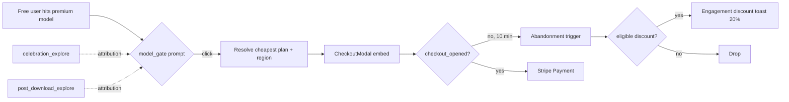
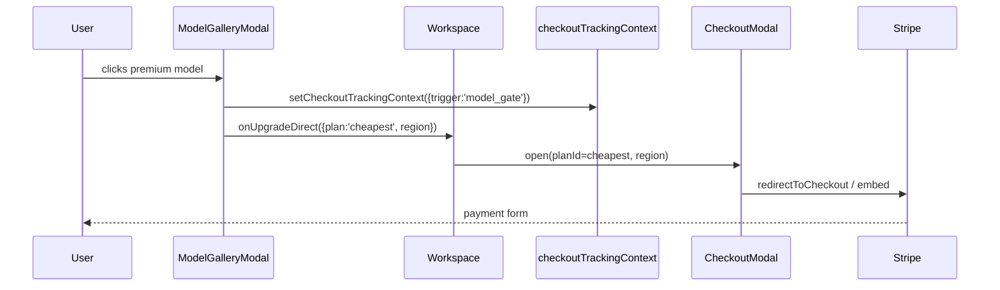
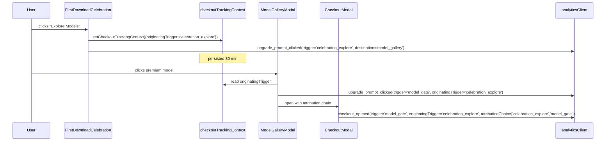
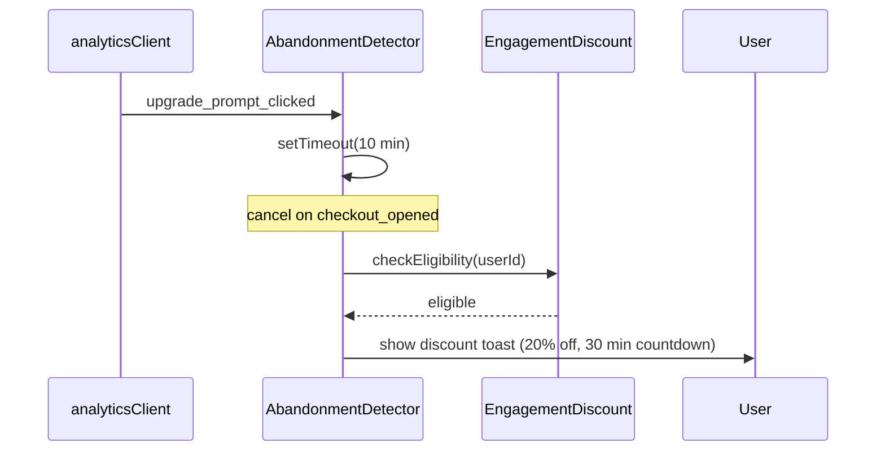

# PRD: Click-to-Checkout Conversion Fix

**Date:** 2026-04-20
**Status:** Ready
**Complexity:** 7 → HIGH mode
**Owner:** Conversion / Growth
**Source:** Click → Checkout funnel analysis (Apr 2026)

---

## 1. Context

**Problem:** Of ~1,376 upgrade prompt clicks across 10 triggers, only ~13% convert into a `checkout_opened` event. The largest leaks are concentrated in 3 places: `model_gate` (197 clicks → 2% checkout), the discovery CTAs `celebration_explore`/`after_comparison` (46 clicks → 0%), and `mobile_preview_prompt` (68 clicks → 1.5%). Meanwhile, the highest-converting surfaces (`dashboard_sidebar` 74%, `workspace_batch_sidebar` 64%) are barely shown (~200 impressions each). The funnel is broken in three ways simultaneously: **bad handoff**, **bad attribution**, and **bad surface allocation**.

### Trigger Performance Snapshot

| Trigger                   | Shown | CTR | Clicks | → Checkout |
| ------------------------- | ----- | --- | ------ | ---------- |
| `workspace_batch_sidebar` | 208   | 52% | 108    | 64%        |
| `dashboard_sidebar`       | 224   | 37% | 83     | 74%        |
| `model_gate`              | 1,544 | 21% | 326    | 2% 🔴      |
| `mobile_preview_prompt`   | 2,269 | 12% | 281    | 1.5% 🟡    |
| `post_download_explore`   | 874   | 12% | 106    | 4% (\*)    |
| `mobile_upload_prompt`    | 1,187 | 9%  | 106    | —          |
| `premium_upsell`          | 1,173 | 8%  | 91     | —          |
| `after_comparison`        | 1,685 | 7%  | 120    | 0% 🔴      |
| `after_batch`             | 1,934 | 7%  | 137    | —          |
| `after_download`          | 314   | 6%  | 18     | —          |
| `celebration_explore`     | —     | —   | 46     | 0% 🔴      |

(\*) Discovery CTAs — see attribution finding in §1.3.

### 1.1 Files Analyzed

```
client/components/features/workspace/ModelGalleryModal.tsx          # P1: model_gate
client/components/features/workspace/UpgradeSuccessBanner.tsx       # after_batch (purchase_modal)
client/components/features/workspace/AfterUpscaleBanner.tsx         # after_upscale
client/components/features/workspace/FirstDownloadCelebration.tsx   # P2: celebration_explore (model_gallery)
client/components/features/workspace/PostDownloadPrompt.tsx         # P2: post_download_explore (model_gallery)
client/components/features/workspace/MobileUpgradePrompt.tsx        # P3: mobile_preview_prompt
client/components/features/image-processing/ImageComparison.tsx     # P2: after_comparison (DEAD)
client/components/features/workspace/Workspace.tsx                  # workspace surface
client/components/dashboard/DashboardSidebar.tsx                    # P4: dashboard_sidebar (74%)
client/components/dashboard/UpgradeCard.tsx                         # P4: sidebar card
client/components/layout/Layout.tsx                                 # P4: nav header
client/components/stripe/CheckoutModal.tsx                          # checkout endpoint
client/hooks/useCheckoutSession.ts                                  # checkout state
client/hooks/useCheckoutRescueOffer.ts                              # P5: existing rescue offer
client/hooks/useEngagementTracker.ts                                # P5: engagement signals
client/utils/checkoutTrackingContext.ts                             # P2: attribution chain
client/utils/promptFrequency.ts                                     # P4: surface frequency
client/analytics/analyticsClient.ts                                 # event pipeline
shared/config/engagement-discount.ts                                # P5: discount offer
shared/config/subscription.config.ts                                # cheapest plan resolution
server/analytics/types.ts                                           # event schema
client/hooks/useRegionTier.ts                                       # regional pricing
```

### 1.2 Current Behavior (verified in code)

- **`model_gate` (ModelGalleryModal:34)**: Click on premium model fires `upgrade_prompt_clicked` then calls `onUpgrade()` → bubbles up to `Workspace.tsx` → opens `PurchaseModal` (or `UpgradePlanModal`). Two extra UI steps before Stripe loads. No plan is pre-selected. Regional pricing must be re-resolved at the next surface.
- **`celebration_explore` (FirstDownloadCelebration:139)**: Discovery CTA — `destination: 'model_gallery'`. Opens `ModelGalleryModal`, NOT checkout. The 0% checkout rate is **funnel attribution mismatch, not a broken route**. Conversion happens downstream via `model_gate`.
- **`post_download_explore` (PostDownloadPrompt:72)**: Same pattern — `destination: 'model_gallery'`. 4% checkout in the report is undercounted because conversion attribution chains through `model_gate`.
- **`after_comparison`**: Type declared in `server/analytics/types.ts:101` and asserted in tests, but **no live client component fires it**. The 1,685 impressions / 120 clicks are stale data from a previously removed CTA. This is dead code in the analytics path.
- **`after_batch` (UpgradeSuccessBanner:116)**: Real upgrade CTA → `destination: 'purchase_modal'`. Already gated by 4h cooldown + 3/week cap. 7% CTR is acceptable; no immediate change needed.
- **`mobile_preview_prompt` (MobileUpgradePrompt)**: Largest impression bucket (2,269). Need to audit whether mobile users land on a checkout flow that renders correctly on small viewports.
- **`dashboard_sidebar` / `workspace_batch_sidebar`**: 64–74% checkout rate — proven path. Currently capped at ~200 impressions because surface is hidden behind navigation.
- **No abandonment recovery**: If a user fires `upgrade_prompt_clicked` and never fires `checkout_opened`, no follow-up. The existing **`useCheckoutRescueOffer`** hook only triggers on Stripe-embed exit intent, AFTER checkout opens.
- **Existing reusable infrastructure**:
  - `setCheckoutTrackingContext({ trigger, originatingModel })` (sessionStorage, 30 min expiry) — already chains context across surfaces.
  - `useEngagementTracker` + `EngagementDiscountBanner` — 20% off coupon, 30 min countdown, server-validated, one-time per user.
  - `useCheckoutRescueOffer` + `StripeService.createCheckoutRescueOffer` — issues backend rescue offer token.
  - `useRegionTier` — resolves regional Stripe price IDs.

### 1.3 Key Insight

The "0% checkout" on `celebration_explore` and `post_download_explore` is **not a broken route or telemetry bug** — those triggers are intentionally discovery CTAs that route to `ModelGalleryModal`. Real conversion is attributed downstream to `model_gate`. The reporting layer measured them as 1-step funnels when they are 3-step funnels (`celebration_explore → model_gate → checkout_opened`). We need attribution chaining, not UX changes for those triggers.

---

## 2. Solution

### 2.1 Approach

1. **Collapse `model_gate` to a single-click checkout** with the cheapest plan pre-selected and regional pricing resolved at click time. Skip `PurchaseModal` for free users hitting a premium model.
2. **Chain trigger attribution** through `setCheckoutTrackingContext` so that discovery CTAs (`celebration_explore`, `post_download_explore`) get credit for assisted conversions when downstream `model_gate` → checkout completes. Add an `originatingTrigger` field that survives the multi-step funnel.
3. **Remove dead `after_comparison` trigger** from `server/analytics/types.ts` (and tests). Stop tracking a trigger no live code fires.
4. **Audit mobile checkout rendering**, then add a mobile-friendly intermediate path for `mobile_preview_prompt` if Stripe embed is the bottleneck.
5. **Expand high-converting surfaces**: persistent "Upgrade" button in main nav (Layout.tsx) for free users, an upgrade entry in the workspace header, and increase `dashboard_sidebar` surface density.
6. **Reuse existing discount infrastructure** for abandonment recovery — when `upgrade_prompt_clicked` fires without a follow-up `checkout_opened` within 10 min, trigger the engagement-discount toast (if eligible). No new email/comms infra.

### 2.2 Architecture Diagram



### 2.3 Key Decisions

- **Cheapest plan resolution**: read from `shared/config/subscription.config.ts` (existing source of truth) + `useRegionTier().pricingRegion` to fetch the regional price ID. No new config.
- **Attribution storage**: extend `ICheckoutTrackingContext` with `originatingTrigger: string | undefined` and `attributionChain: string[]`. Already uses sessionStorage with 30 min expiry — compatible with the discovery → gate → checkout flow.
- **Abandonment trigger**: client-side timer (`setTimeout`) registered when `upgrade_prompt_clicked` fires; cancelled when `checkout_opened` fires. No backend cron.
- **Surface expansion**: gate persistent nav button on `isFreeUser` to avoid pestering paid users.
- **Dead code removal**: remove `'after_comparison'` from `TUpgradeTrigger` union in `server/analytics/types.ts`. Update tests. Document the removal in commit message.

### 2.4 Data Changes

None. All persistence reuses sessionStorage + the existing `engagement_discount_offered_at` profile column.

---

## 3. Sequence Flow

### 3.1 model_gate → direct checkout (P1)



### 3.2 Discovery → gate → checkout attribution (P2)



### 3.3 Abandonment → discount offer (P5)



---

## 4. Execution Phases

### Phase 1 — model_gate Direct Checkout

**User-visible outcome:** Free user clicking a premium model in the gallery lands on the Stripe checkout form in one step instead of three.

**Files (5):**

- `client/components/features/workspace/ModelGalleryModal.tsx` — replace `onUpgrade()` callback with `onUpgradeDirect({trigger:'model_gate', plan:'cheapest'})`.
- `client/components/features/workspace/Workspace.tsx` — add `handleUpgradeDirect` that opens `CheckoutModal` directly with cheapest plan resolved via region.
- `client/components/stripe/CheckoutModal.tsx` — accept optional `prefillPlanId` prop; if provided, skip plan picker.
- `client/hooks/useCheckoutSession.ts` — accept `prefillPlanId` and bypass plan-selection UI step.
- `shared/config/subscription.config.ts` — export helper `resolveCheapestRegionalPlan(region)` if not already present.

**Implementation:**

- [ ] Add `resolveCheapestRegionalPlan(region: PricingRegion): string` in `subscription.config.ts` (returns Stripe price ID for the smallest credit pack in the region).
- [ ] In `ModelGalleryModal`, replace `onUpgrade` invocation with new `onUpgradeDirect` that passes `{ trigger: 'model_gate', planId, originatingTrigger? }`.
- [ ] In `Workspace.tsx`, implement `handleUpgradeDirect({trigger, planId})` that calls `setCheckoutTrackingContext` then opens `CheckoutModal` with `prefillPlanId`.
- [ ] In `CheckoutModal`, if `prefillPlanId` is set, render Stripe embed immediately (skip the plan picker UI block).
- [ ] Preserve `setCheckoutTrackingContext({ trigger: 'model_gate' })` so attribution downstream still works.

**Verification Plan:**

1. **Unit tests:**
   - `tests/unit/client/components/ModelGalleryModal.upgrade-direct.unit.spec.tsx` — `should call onUpgradeDirect with cheapest plan when premium model clicked`, `should pass region to plan resolver`.
   - `tests/unit/shared/subscription-config-cheapest.unit.spec.ts` — `resolveCheapestRegionalPlan returns expected ID per region`.
   - `tests/unit/client/components/CheckoutModal.prefill.unit.spec.tsx` — `should skip plan picker when prefillPlanId is set`.

2. **API proof (manual):**

   ```bash
   # Verify checkout session creation accepts the prefilled price ID for free user
   curl -X POST http://localhost:3000/api/checkout \
     -H "Authorization: Bearer $TOKEN" \
     -H "Content-Type: application/json" \
     -d '{"priceId":"price_starter_eu","trigger":"model_gate"}' | jq .
   # Expected: {"url":"https://checkout.stripe.com/..."} or {"clientSecret":"..."}
   ```

3. **Playwright:**
   - `tests/e2e/model-gate-direct-checkout.e2e.spec.ts` — sign in as free user → open ModelGalleryModal → click premium model → assert `CheckoutModal` opens with Stripe embed visible (no PurchaseModal in DOM).

4. **Evidence Required:**
   - [ ] All unit tests pass
   - [ ] E2E shows ≤1 click from gallery model click to Stripe embed
   - [ ] `analytics.track('upgrade_prompt_clicked', {trigger:'model_gate'})` fires
   - [ ] `analytics.track('checkout_opened', {trigger:'model_gate'})` fires within the same flow
   - [ ] `yarn verify` passes

**User Verification (manual):**

- Action: Sign out → sign in as free user → open ModelGalleryModal → click "Pro" tier model.
- Expected: Stripe checkout form appears in ≤1 click; cheapest plan price displayed in the regional currency.

---

### Phase 2 — Discovery CTA Attribution + Dead Code Cleanup

**User-visible outcome:** Conversion reports correctly credit `celebration_explore` and `post_download_explore` for assisted checkouts; the `after_comparison` ghost trigger stops polluting analytics.

**Files (5):**

- `client/utils/checkoutTrackingContext.ts` — extend `ICheckoutTrackingContext` with `originatingTrigger?: string` and `attributionChain?: string[]`.
- `client/components/features/workspace/FirstDownloadCelebration.tsx` — call `setCheckoutTrackingContext({originatingTrigger:'celebration_explore'})` before `onExploreModels`.
- `client/components/features/workspace/PostDownloadPrompt.tsx` — call `setCheckoutTrackingContext({originatingTrigger:'post_download_explore'})` before `onExploreModels`.
- `client/components/features/workspace/ModelGalleryModal.tsx` — read `originatingTrigger` from context and include in `upgrade_prompt_clicked` event payload.
- `server/analytics/types.ts` — remove `'after_comparison'` from `TUpgradeTrigger` union; add optional `originatingTrigger?: TUpgradeTrigger` and `attributionChain?: TUpgradeTrigger[]` to relevant event payloads.

**Implementation:**

- [ ] Extend `ICheckoutTrackingContext` and storage layer to include `originatingTrigger` + `attributionChain`. Append to `attributionChain` on each `setCheckoutTrackingContext` call (cap length at 5).
- [ ] In `FirstDownloadCelebration.handleExploreModels`, call `setCheckoutTrackingContext({originatingTrigger:'celebration_explore'})` before opening the gallery.
- [ ] In `PostDownloadPrompt`, do the same for `'post_download_explore'`.
- [ ] In `ModelGalleryModal.handleUpgradeClick` (or the new direct-checkout path from Phase 1), pull `originatingTrigger` from context and include it in `analytics.track('upgrade_prompt_clicked', { ..., originatingTrigger })`.
- [ ] In `useCheckoutSession`, include `originatingTrigger` and `attributionChain` on `checkout_opened` and `checkout_completed` events.
- [ ] Remove `'after_comparison'` from `TUpgradeTrigger` and any test fixtures that include it. Document in commit.

**Verification Plan:**

1. **Unit tests:**
   - `tests/unit/client/utils/checkoutTrackingContext.attribution.unit.spec.ts` — `should append originatingTrigger to attributionChain`, `should cap chain length at 5`, `should expire after 30 min`.
   - `tests/unit/client/components/FirstDownloadCelebration.attribution.unit.spec.tsx` — `should set originatingTrigger='celebration_explore' before onExploreModels`.
   - `tests/unit/client/components/PostDownloadPrompt.attribution.unit.spec.tsx` — `should set originatingTrigger='post_download_explore'`.
   - `tests/unit/analytics/analytics-types.unit.spec.ts` — `TUpgradeTrigger should not include 'after_comparison'`; update existing assertions.

2. **Integration test:**
   - `tests/unit/analytics/upgrade-funnel-attribution.unit.spec.ts` — simulate `celebration_explore` click → `model_gate` click → `checkout_opened`; assert all 3 events carry `originatingTrigger='celebration_explore'` and `attributionChain` is `['celebration_explore','model_gate']`.

3. **Evidence Required:**
   - [ ] All tests pass
   - [ ] `tsc` compile errors confirm `'after_comparison'` is removed everywhere it was used
   - [ ] In dev tools, manually walk the discovery → gate → checkout flow and confirm `originatingTrigger` propagates
   - [ ] `yarn verify` passes

---

### Phase 3 — Mobile Checkout Audit + Fix

**User-visible outcome:** Mobile users clicking `mobile_preview_prompt` reach a usable checkout that they can complete on a phone.

**Files (≤5):**

- `client/components/features/workspace/MobileUpgradePrompt.tsx` — wire to direct checkout (same pattern as Phase 1).
- `client/components/stripe/CheckoutModal.tsx` — verify mobile viewport rendering; add mobile-specific class adjustments if needed.
- `app/[locale]/checkout/page.tsx` — confirm hosted-checkout fallback path renders correctly on mobile (already exists).
- `client/hooks/useCheckoutSession.ts` — branch on `viewport === 'mobile'` to use Stripe-hosted page instead of embed if embed is broken.
- `tests/e2e/mobile-checkout.e2e.spec.ts` — new mobile-viewport playwright test.

**Implementation:**

- [ ] Run a Playwright test in mobile viewport (375×667) hitting `MobileUpgradePrompt` → CheckoutModal. Capture screenshot.
- [ ] If Stripe embed is unusable on mobile: detect viewport in `useCheckoutSession`; for mobile, use Stripe-hosted redirect (`/checkout/page.tsx`) instead of embedded form.
- [ ] Update `MobileUpgradePrompt` to use the same direct-checkout pattern (cheapest plan + region) introduced in Phase 1.
- [ ] Make any CSS adjustments to ensure CTA buttons in CheckoutModal are tappable (≥44px tap targets).

**Verification Plan:**

1. **Playwright (mobile viewport):**
   - `tests/e2e/mobile-checkout.e2e.spec.ts` — viewport 375×667 → `MobileUpgradePrompt` click → assert Stripe checkout reachable, "Pay" button visible above the fold without horizontal scroll.

2. **Manual device test:**
   - Open dev URL on a real phone (iOS Safari + Android Chrome).
   - Trigger `mobile_preview_prompt` → confirm checkout works end-to-end.

3. **Evidence Required:**
   - [ ] E2E passes in mobile viewport
   - [ ] Manual test on iOS + Android passes
   - [ ] `analytics.track('checkout_opened', {trigger:'mobile_preview_prompt'})` fires from mobile
   - [ ] `yarn verify` passes

---

### Phase 4 — Surface Expansion for High-Converting Triggers

**User-visible outcome:** Free users see persistent upgrade entry points in the main nav and workspace header — the surfaces that already convert at 64–74% become discoverable to all users.

**Files (5):**

- `client/components/layout/Layout.tsx` — add persistent "Upgrade" button in nav header for free users.
- `client/components/features/workspace/Workspace.tsx` — add "Upgrade" button in workspace header.
- `client/components/dashboard/DashboardSidebar.tsx` / `UpgradeCard.tsx` — increase frequency/visibility of sidebar prompt (e.g., always show, not gated by random sample).
- `client/utils/promptFrequency.ts` — tune `dashboard_sidebar` cooldown if it currently throttles.
- `client/analytics/analyticsClient.ts` (no edit; just used) — verify new triggers `nav_persistent` and `workspace_header` are added to `TUpgradeTrigger` and tracked.

**Implementation:**

- [ ] Add `'nav_persistent'` and `'workspace_header'` to `TUpgradeTrigger` in `server/analytics/types.ts`.
- [ ] In `Layout.tsx`, render `<UpgradeButton trigger="nav_persistent" />` in the top nav when `isAuthenticated && isFreeUser`. Click → direct checkout (same pattern as Phase 1) with `setCheckoutTrackingContext({trigger:'nav_persistent'})`.
- [ ] In `Workspace.tsx` header, render `<UpgradeButton trigger="workspace_header" />` for free users.
- [ ] Increase `dashboard_sidebar` impression density: ensure `UpgradeCard` always renders for free users in the sidebar (no probability gate).
- [ ] Fire `upgrade_prompt_shown` impressions on each render of these surfaces (with sensible cooldowns: e.g., once per session for impression event, but the button itself is always visible).

**Verification Plan:**

1. **Unit tests:**
   - `tests/unit/client/components/Layout.upgrade-nav.unit.spec.tsx` — `should render Upgrade button for free user`, `should NOT render for paid user`.
   - `tests/unit/client/components/Workspace.upgrade-header.unit.spec.tsx` — `should render Upgrade button in workspace header for free user`.
   - `tests/unit/client/components/DashboardSidebar.always-visible.unit.spec.tsx` — `should always render UpgradeCard for free user`.

2. **Playwright:**
   - `tests/e2e/persistent-upgrade-surfaces.e2e.spec.ts` — sign in as free user → navigate to dashboard, workspace, settings → assert "Upgrade" button visible on every page.

3. **Evidence Required:**
   - [ ] Unit + E2E pass
   - [ ] In analytics, `upgrade_prompt_shown` for new triggers `nav_persistent` and `workspace_header` appears on first visit
   - [ ] No layout regression on mobile (button collapses to icon if needed)
   - [ ] `yarn verify` passes

---

### Phase 5 — Abandonment Recovery via Existing Discount System

**User-visible outcome:** Free users who click `upgrade_prompt_clicked` but don't reach `checkout_opened` within 10 minutes get the existing engagement discount toast (20% off, 30 min countdown) — once per user, server-validated.

**Files (5):**

- `client/hooks/useUpgradeAbandonmentDetector.ts` — **NEW** hook that listens for `upgrade_prompt_clicked` and starts a 10-minute timer; cancels on `checkout_opened`; on timeout, calls eligibility check and shows discount toast.
- `client/components/features/workspace/Workspace.tsx` — mount `useUpgradeAbandonmentDetector` once per session.
- `client/analytics/analyticsClient.ts` — emit a local event bus signal on `upgrade_prompt_clicked` and `checkout_opened` so the abandonment hook can subscribe.
- `client/components/engagement-discount/EngagementDiscountBanner.tsx` — accept an optional `source: 'engagement' | 'abandonment'` prop for analytics attribution; default `'engagement'`.
- `server/analytics/types.ts` — add `engagement_discount_source: 'engagement' | 'abandonment'` to the existing `engagement_discount_toast_shown` event properties.

**Implementation:**

- [ ] Add a lightweight in-memory event bus to `analyticsClient.ts` (or use existing if present) so other client code can subscribe to `upgrade_prompt_clicked` / `checkout_opened` without refactoring analytics.
- [ ] Build `useUpgradeAbandonmentDetector(userId)`:
  - On `upgrade_prompt_clicked` → set `setTimeout(checkAndOffer, 10 * 60 * 1000)`. Store the timeout ID.
  - On `checkout_opened` → `clearTimeout`.
  - On timeout: call `GET /api/engagement-discount/eligibility`. If eligible, dispatch the `EngagementDiscountBanner` with `source='abandonment'`.
  - Guard: only run for free users; only fire once per session.
- [ ] Mount the hook at the `Workspace.tsx` level (covers the dominant authenticated UX surface).
- [ ] Update `EngagementDiscountBanner` to accept `source` prop and pass it to `engagement_discount_toast_shown` event.
- [ ] Add `engagement_discount_source` property to the event type in `server/analytics/types.ts`.

**Verification Plan:**

1. **Unit tests:**
   - `tests/unit/client/hooks/useUpgradeAbandonmentDetector.unit.spec.ts`:
     - `should start timer on upgrade_prompt_clicked`
     - `should cancel timer on checkout_opened`
     - `should call eligibility endpoint after 10 min timeout`
     - `should not run for paid users`
     - `should fire only once per session`
   - `tests/unit/client/components/EngagementDiscountBanner.source.unit.spec.tsx` — `should pass source='abandonment' to analytics when triggered by abandonment`.

2. **Integration / E2E:**
   - `tests/e2e/checkout-abandonment-discount.e2e.spec.ts`:
     - Sign in as free user → click an upgrade prompt → close the checkout modal → fast-forward time (mock) → assert discount toast appears with `source='abandonment'`.

3. **API proof:**

   ```bash
   # Existing eligibility endpoint
   curl -X GET http://localhost:3000/api/engagement-discount/eligibility \
     -H "Authorization: Bearer $TOKEN" | jq .
   # Expected: {"eligible": true, "discountExpiresAt":"...", "couponId":"..."}
   ```

4. **Evidence Required:**
   - [ ] Unit + E2E pass
   - [ ] Manual: open prompt, close before checkout, wait 10 min → discount toast appears
   - [ ] `engagement_discount_toast_shown` event includes `engagement_discount_source: 'abandonment'`
   - [ ] One-time-per-user enforcement still works (server validates)
   - [ ] `yarn verify` passes

---

## 5. Checkpoint Protocol

After EACH phase, spawn `prd-work-reviewer`:

```
Use Task tool with:
- subagent_type: "prd-work-reviewer"
- prompt: "Review phase [N] of docs/PRDs/click-to-checkout-conversion-fix.md"
```

**Manual checkpoint required for:**

- Phase 1 (CheckoutModal UX change — visual)
- Phase 3 (mobile rendering — needs real device test)
- Phase 4 (UI surface additions — visual)

Phases 2 and 5 = automated checkpoint only.

---

## 6. Acceptance Criteria

- [ ] All 5 phases complete and individually verified
- [ ] All specified unit + E2E tests pass
- [ ] `yarn verify` passes
- [ ] All `prd-work-reviewer` checkpoints PASS
- [ ] **`model_gate` → checkout in ≤1 click** (down from 3)
- [ ] **`originatingTrigger` propagates** through `celebration_explore → model_gate → checkout_opened`
- [ ] **`'after_comparison'`** is removed from `TUpgradeTrigger` and no test references it
- [ ] **Mobile checkout** completes successfully on iOS Safari + Android Chrome
- [ ] **Persistent "Upgrade" button** visible in nav for free users on every authenticated page
- [ ] **Abandonment discount** fires after 10 min of `upgrade_prompt_clicked` without `checkout_opened` (eligible users only, once per user)
- [ ] No regression in conversion for already-working triggers (`workspace_batch_sidebar`, `dashboard_sidebar`)

### Conversion targets (28 days post-launch)

| Metric                           | Current | Target           |
| -------------------------------- | ------- | ---------------- |
| `model_gate` → checkout          | 2%      | 15%+             |
| Overall click → checkout         | ~13%    | 20%+             |
| `dashboard_sidebar` shown        | 224     | 1,500+           |
| `workspace_batch_sidebar` shown  | 208     | 1,000+           |
| Abandonment discount accept rate | n/a     | ≥5% of triggered |

---

## 7. Out of Scope

- Email re-engagement for abandonment (existing `email-reengagement-drip` PRD covers this separately)
- New A/B testing infrastructure (existing `getVariant` is sufficient)
- Replacing the engagement-discount system (reuse as-is)
- Pricing page redesign (separate effort)
- Push notifications / SMS recovery
- Changes to paid-tier upsell logic

---

## 8. Risks & Mitigations

| Risk                                                                         | Mitigation                                                                                                                |
| ---------------------------------------------------------------------------- | ------------------------------------------------------------------------------------------------------------------------- |
| Persistent nav button annoys users → CTR drops on other surfaces             | Track `upgrade_prompt_dismissed` per surface; if `nav_persistent` shows declining engagement, gate behind 7-day cooldown. |
| Direct checkout pre-selection feels presumptuous → user backs out            | Phase 1 provides "Change plan" link inside `CheckoutModal` — user can switch up.                                          |
| Removing `after_comparison` breaks downstream analytics dashboards           | Search GSC + Amplitude for any saved queries on `after_comparison`; warn data team in commit message.                     |
| Abandonment discount fires too aggressively → cannibalizes full-price buyers | Reuse existing one-time-per-user server enforcement; track `engagement_discount_redeemed` to confirm net positive lift.   |
| Mobile Stripe-hosted redirect breaks deep linking back to app                | Use existing `app/[locale]/checkout/page.tsx` return path that handles success/failure redirects.                         |
| Attribution chain explodes through deep funnels                              | Cap `attributionChain` length at 5 entries.                                                                               |

---

## 9. Related PRDs

- `docs/PRDs/conversion-funnel-optimization-v2.md` — ancestor PRD; this PRD supersedes its model_gate and after_batch sections.
- `docs/PRDs/checkout-recovery-system.md` — email-based recovery; complementary.
- `docs/PRDs/engagement-based-first-purchase-discount.md` — base infra reused in Phase 5.
- `docs/PRDs/post-download-model-gallery-funnel.md` — established the discovery CTA pattern; this PRD adds attribution chaining.
- `docs/PRDs/analytics-instrumentation-fixes.md` — analytics hygiene baseline.

---

## 10. Rollout Plan

1. **Phase 1** (model_gate direct) — ship behind no flag, full rollout. Highest ROI, lowest risk.
2. **Phase 2** (attribution + dead code) — bundled with Phase 1 release. Pure tracking change.
3. **Phase 3** (mobile) — ship after manual device test, monitor mobile checkout open rate for 7 days.
4. **Phase 4** (surface expansion) — ship to 50% of free users via `getVariant` for first 7 days; full rollout if no negative signal.
5. **Phase 5** (abandonment) — ship to 50% via flag; expand if `engagement_discount_redeemed` rate is positive.

Total estimated timeline: 2–3 weeks engineering + 4 weeks measurement.
