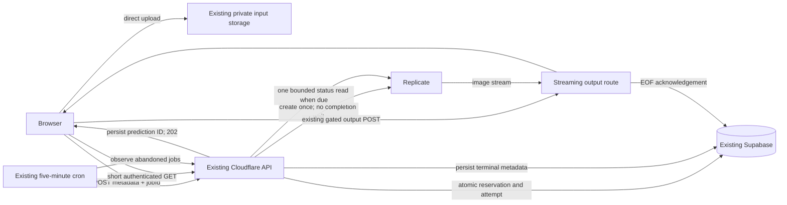

# Async upscaling on the existing Cloudflare stack

Date: 2026-09-08. Status: RELEASE BLOCKED. A pre-commit 19-scenario gate passed, but the subsequent committed-code rerun reproducibly failed interrupted-download lease cleanup (latest: 13 passed, one failed, five skipped). Three attempted fixes did not resolve disconnect propagation to the Next.js cleanup callback; work stopped under the user's stop-after-three rule. All 435 unit tests and `yarn verify` pass, but do not override this runtime failure. `yarn test:upscale:release` remains mandatory during `yarn deploy`, including `--skip-tests`, before production secrets or migrations. See `PRODUCTION-READINESS-REVIEW.md` for evidence and next investigation. Provider/Auth/Storage transport in this local gate is simulated; fresh staging provider cases, canary routing/rollback, aggregate cron timing, release and incident-closure evidence remain pending. No production deployment or database mutation was performed.
Planning Mode: Principal Architect. Complexity: 9 → HIGH (10+ files: 3; new module: 2; concurrency: 2; schema: 1; external API: 1). No new deployment package.

## Decision and user outcome

Keep Cloudflare, Supabase and Replicate. Replace the authenticated Replicate upscale request's long provider wait with a short prediction-creation request, persisted prediction identity, and short status requests. Reuse the existing five-minute provider-health cron for abandoned requests. The user starts an upscale, sees processing, and receives the result without keeping one Worker invocation alive for the entire prediction.

Optimize for the least implementation effort and recurring cost that passes the incident gates. Add no Cloud Run, Cloud Tasks, Containers, Queues, Workflows, Durable Objects, webhook endpoint, outbox, new storage bucket or new hosting subscription. A different runtime is a separate decision only if the early production-runtime experiment falsifies this approach. Short requests do not increase Cloudflare's memory allowance.

Scope is the authenticated **Replicate execution path**, led by the incident's Quick 2x/4x requests and paid large-image fallbacks. Preserve the user's selected tier, resolved model, quality, price and download behavior. Gemini, guest execution and optional AI analysis remain separate paths and receive regression coverage; this PRD does not assert that async Replicate fixes their allocations. A canary failure in those paths prevents claiming the entire `/api/upscale` incident resolved and requires a measured, separately scoped decision. Do not silently move models between providers or disable features.

The previous work is preserved on local branch `archive/durable-upscale-cloud-run`, through `e5ec89ee`. Read its incident report and borrow proven test cases where useful; do not merge its executor, outbox or migration wholesale. This PRD supersedes that branch's Cloud Run deployment proposal for this task.

## Integration ledger

Locations refer to inspected master `ae96360d`; implementers replace intended wiring with actual non-test file:line evidence after each phase. A row's negative control must fail before its gate can pass.

| ID  | New thing                                                                      | Live caller / registration                                                                                                         | Replaces                                                                  | Old path disposition                                                                                                        | Negative control                                                                                                           |
| --- | ------------------------------------------------------------------------------ | ---------------------------------------------------------------------------------------------------------------------------------- | ------------------------------------------------------------------------- | --------------------------------------------------------------------------------------------------------------------------- | -------------------------------------------------------------------------------------------------------------------------- |
| A   | `server/services/async-upscale.service.ts`: `start`, `read`, later `reconcile` | Existing POST `app/api/upscale/route.ts:1180`; new GET in the same route; existing cron `app/api/cron/provider-health/route.ts:18` | Authenticated Replicate `processor.processImage()` and request-owned wait | Phase 1 replaces only resolved Replicate execution; other providers retain their caller                                     | Restore `replicate.run()`; early-response test fails                                                                       |
| B   | Additive reservation columns and transactional async RPCs                      | Service A invokes admission, claim, observe and refund transitions                                                                 | Separate deduction plus provider call with no persisted ID                | Phase 1 bypasses processor deduction and route-owned batch mutation for async jobs; phase 3 replaces age-only async refunds | Concurrent same-ID submissions create multiple debits or predictions when admission lock is disabled                       |
| C   | `GET /api/upscale?jobId=…`, later bounded `?active=1`                          | `client/utils/api-client.ts:581`; restored jobs through `client/hooks/useBatchQueue.ts:339`                                        | Single HTTP response assumed to contain finished output                   | Phase 1 awaits status for a 202; phase 5 resumes saved jobs                                                                 | Drop POST response and reload; result identity is lost without resume                                                      |
| D   | Async delivery claim/lease using existing output route                         | `app/api/upscale/output/route.ts:111,195`, existing credit-manager retrieval/acknowledgement                                       | Refund can race a stream before EOF                                       | Phase 4 delegates async output to guarded RPCs; legacy behavior remains covered                                             | Race refund with paused stream; refunded job must not finish a usable new download                                         |
| E   | Async reconciliation through existing scheduled invocation                     | `workers/cron/index.ts:128` → `/api/cron/provider-health` → A.reconcile                                                            | Ten-minute age-only reconciliation for async reservations                 | Phase 3 excludes async rows from legacy sweeper and invokes bounded provider observation                                    | Close browser and suppress cron; stale-job recovery gate fails                                                             |
| F   | Separate authenticated status rate budget                                      | `middleware.ts:662` → `lib/middleware/rateLimit.ts` → `server/rateLimit.ts`                                                        | All authenticated calls share a 50-request bucket                         | Phase 5a selects a bounded read budget by method/path                                                                       | Exhaust admission budget; admitted job remains recoverable                                                                 |
| G   | Runtime memory proof and deployment identity evidence                          | Existing `package.json` preview/test commands and `scripts/deploy/steps/02-build.sh`, `06-verify.sh` deployment flow               | Unit-only memory confidence and unknown active artifact                   | Phase 2 exercises built OpenNext; phase 6 records deployed version + bundle hash + source SHA                               | Baseline/synchronous mutation fails short-request assertion; missing artifact or broken Tail collection fails release gate |

| H | Async terminal side-effect transition and claim | A.start/read from existing upscale route; A.reconcile from existing provider-health cron | Synchronous processor lifecycle/cost hooks and route completion/health events | Phase 1 relocates Replicate lane effects; phase 3 reuses the transition from cron | Race GET and cron or throw analytics; one health outcome, no duplicate completion and no financial reversal |

Every new export must belong to this ledger and have a live caller in its introducing phase. Keep transport and SQL helpers private unless consumed elsewhere. Do not leave a second authenticated Replicate implementation available as a silent fallback.

## Evidence and reuse

The archived September 7 report records 96 `tail_observed_exceededMemory` refunds, 21 users and 225 credits in its stated window. Its client failure count is 92; the subsequent archived PRD read reports 91 for a separate query. Neither count is newly verified here; compare by job ID before interpreting the discrepancy. Quick failures clustered near normal provider-completion time. Exact allocation and active artifact remain unknown.

| Inspected incumbent                                                                       | Reuse / implication                                                                                                                                                                                                                                       |
| ----------------------------------------------------------------------------------------- | --------------------------------------------------------------------------------------------------------------------------------------------------------------------------------------------------------------------------------------------------------- |
| `server/services/replicate.service.ts:103,126,316`                                        | `useFileOutput:false` is already present. `run()` still owns the completion wait and broad retry policy. Reuse model builders, model registry, output parser and error mapper; do not copy the processor's debit/refund wrapper.                          |
| `app/api/upscale/route.ts:615,649,788,837,1096,1180,1244`                                 | Preserve validation, account/tier guards, model selection, paid fallback, credit estimate parity and output metadata. Move async batch mutation into idempotent admission; analysis before prediction is explicitly outside the shortened-wait proof.     |
| `processing_credit_reservations`, `consume_credits_v3`, `check_and_increment_batch_limit` | Existing reservation owns job UUID, pool split and output capability. Extend it instead of treating `processing_jobs` telemetry as an authoritative job queue. Wrap existing credit/batch arithmetic in one transaction.                                  |
| `credit-manager.ts:133,182,209`; output route                                             | Existing output is server-gated and billing completes at stream EOF. Provider success must not become the new billing boundary.                                                                                                                           |
| `workers/cron/wrangler.toml:13`; provider-health route; cleanup service                   | Existing five-minute cron reconciles stale reservations; input cleanup expires objects after one hour. A 15-minute execution deadline fits within this retention without adding storage infrastructure. Verify actual scheduled execution before rollout. |

Use `serverEnv`/`clientEnv` through `shared/config/env.ts` for any necessary configuration, Zod at boundaries, project loggers, and existing error envelopes. No new environment setting is required for the core proposal. Use the same Supabase client, model builders and output delivery as today. Existing raw environment reads are not a pattern to copy into new code.

## Architecture and protocol



```mermaid
sequenceDiagram
  participant B as Browser
  participant W as Cloudflare
  participant D as Supabase
  participant R as Replicate
  B->>W: POST storagePath, existing config, stable jobId
  W->>D: Admit once; reserve credits/batch; mark submitting
  W->>R: Create prediction without Prefer: wait
  alt prediction ID received
    R-->>W: id + status
    W->>D: Persist ID using attempt guard
    W-->>B: 202 jobId, processing
    loop while processing, with backoff
      B->>W: GET jobId
      W->>D: Read; claim due observation
      W->>R: One status request if claimed
      W->>D: Persist observation
      W-->>B: processing / ready / refunded
    end
    B->>W: Existing output POST with capability
    W-->>B: Stream output, acknowledge at EOF
  else create response lost or Worker killed
    Note over W,D: Persisted submitting attempt prevents a second create
    B->>W: GET original jobId after reconnect
    W-->>B: checking status; no new charge
    Note over W,D: Cron refunds unresolved attempt at deadline; no blind create retry
  end
```

### Admission, status and bounded work

`POST /api/upscale` keeps its existing storage-only body and UUIDv4 `jobId`; client cannot choose provider authority or price. A resolved Replicate request returns `202 {jobId,status:"processing",statusUrl:"/api/upscale?jobId=…",retryAfterMs:3000}`. Gemini's existing response is still supported. Until phase 5's resume work lands, phase 1 is a local/staging capability slice, not a production release.

Before new policy mutations, look up a matching authenticated replay. Canonicalize the original accepted settings and storage path into a fingerprint; never include a freshly generated signed URL. Same owner/ID/fingerprint returns stored state; changed request returns 409, different owner returns 404. Terminal replays never reserve again. New admissions run all current entitlement, input ownership, dimensions, free-limit and model-cost checks. Never trust `resolvedModel` from the browser.

Admission RPC serializes a job ID, rechecks ownership/fingerprint, invokes the existing batch and credit functions in the same database transaction, and writes the resolved model/provider, tier, immutable bounded response metadata, input path and `submitting` attempt before any external POST. Remove the earlier route-owned batch increment/release for this lane; rejected admission rolls both back. Replays must still work with zero remaining credits or an exhausted batch allowance. Keep the current batch policy for successful jobs; release an unsuccessful async job's slot once, against its recorded admission window, not a later hourly window.

`GET /api/upscale?jobId=UUID` is authenticated, owner-filtered and `Cache-Control:no-store`; never public-cache it. States are `submitting`, `processing`, `ready`, `completed`, `refunded`, with `checking` UI for an ambiguous submitting attempt. `ready` includes the bounded existing success payload/capability; raw provider URLs, logs and signed input URLs never leave the server. Failures include the existing error shape, refund state and current balance. Return 400 malformed ID, 401 unauthenticated, 404 unknown/foreign, 429 with Retry-After, and a retryable 503 for DB/provider observation outage without reporting job failure. POST retains existing 400/401/403/402-or-current-credit-code/429/503 policy behavior and adds replay conflict 409.

Use a single short provider request per HTTP invocation. Creation deadline: 8 seconds; status request: 5 seconds. No `run()`, `wait()`, sleep loop, `waitUntil` execution or image fetch in admission/status. Prefer native `fetch` for the two bounded prediction calls so the response-body cap is enforced before JSON parsing and create retry behavior is explicit. Reuse `buildModelInput`, registry version resolution and `parseReplicateResponse`; support both version hashes and owner/model endpoints. Do not add an SDK upgrade or retry framework. Cap decoded provider metadata/error bodies at 1 MiB, cancel excess bytes and treat truncation as an observation error/ambiguous create, never as permission to recreate. Verify the cap against the real fallback prediction before committing to it; do not log provider response bodies.

Browser polls after 3 seconds, then 5 seconds, then 10 seconds after 30 seconds, with jitter; respect Retry-After and pause while offline/hidden. Server observation claims permit one provider GET per job per five seconds across tabs and cron. Serve persisted state when not due. A normal 30-second prediction should use at most eight browser status calls and seven provider reads; measure actual counts including final completion. Extra status traffic is a real operating cost, not free infrastructure.

### Minimal persistence and honest crash semantics

Add nullable async fields to `processing_credit_reservations`: execution mode/version, request fingerprint, input storage path, resolved provider/model, bounded immutable result context, attempt start, provider prediction ID (unique when present), observation lease/next-check time, execution deadline, delivery deadline, admission batch window/released marker, and async delivery capability. Keep financial status separate from provider phase. Use partial indexes for due async rows and owner/recent jobs; maintain existing service-role-only access.

Generate one random delivery capability per async job; persist it in the same service-role-only reservation that already contains its private output URL, alongside the existing hash. Only authenticated owner status responses may recover it. This intentionally avoids another signing secret and avoids token rotation invalidating another tab. Exclude it from logs, analytics and list responses. Legacy reservations retain their existing hash-only behavior.

| Interruption / event                                                                                 | Required behavior                                                                                                                                                                                                                                 |
| ---------------------------------------------------------------------------------------------------- | ------------------------------------------------------------------------------------------------------------------------------------------------------------------------------------------------------------------------------------------------- |
| Before admission commit                                                                              | No prediction and no lasting debit or batch mutation; same-ID retry can admit.                                                                                                                                                                    |
| After committed `submitting`, before/during provider POST, or after acceptance before ID persistence | Never automatically issue another create for that ID. Keep checking until the fixed 15-minute deadline, then refund once. A provider result may be lost and provider compute may still cost money; exactly-once external creation is not claimed. |
| Known prediction; POST response lost, tab closed, provider GET 429/5xx                               | Browser or existing cron observes the same ID with bounded backoff. Reads cannot turn a transport error into a provider failure.                                                                                                                  |
| Provider fails/cancels or unresolved execution reaches 15 minutes                                    | Atomically refund original subscription/purchased split once and prevent future delivery; best-effort bounded cancel for a known running prediction. Successful late observations cannot resurrect a refunded row.                                |
| Provider succeeds                                                                                    | Store allowlisted output URL and real provider completion-based expiry; mark ready. Keep reservation processing until EOF.                                                                                                                        |

Replicate API output retention is limited. Set delivery deadline to the earlier of provider expiry minus a five-minute safety margin or 30 minutes after observed success. Use provider completion time, not `Date.now()+one hour` on every observation. No permanent history or output-copy job is added. Uncollected expired outputs refund once. Do not promise recovery beyond the displayed deadline.

Async-aware guards must live in SQL, not only in a prior application SELECT. The existing generic Tail refund, failure-observation route, route catch and stale sweeper must not refund a healthy known prediction. Preserve legacy refunds and record async hard Worker outcomes for incident measurement. Async refunds require terminal provider failure/deadline and no valid active delivery lease. Async-aware generic RPCs must fail closed; dedicated transitions own the policy.

Phase 4 adds a bounded output lease using existing retrieval/acknowledgement functions. Two concurrent deliveries must have defined behavior: one lease holder, the other receives retryable busy and re-reads the same job. Lease duration exceeds the route's enforced total stream deadline; abort/cancel ends reading before lease expiry. EOF settlement checks lease and financial state atomically. Aborted streams remain retryable until delivery deadline. Never refund while the server can still finish delivering the whole image. There is a residual delivery boundary: a Worker can die after sending the final bytes but before the acknowledgement transaction commits. Once its lease expires, the customer may possess an image and still receive a refund. Preserve the existing customer-favoring EOF billing policy and record this limitation; eliminating it would change the billing contract and is outside this minimal fix. Guarantees are no new authorized delivery after refund, no refund while a valid delivery lease is held, and mutually exclusive completed/refunded database states—not proof that the browser never received bytes before a refund.

### Preserve existing provider and completion side effects

Phase 1 must move the async lane's existing side effects to live `start`/`read` transitions in service A; phase 3 `reconcile` invokes the same terminal transition. Admission acquires the existing `acquire_provider_circuit_permit` inside the admission transaction after replay detection, so a refused/rolled-back admission does not strand a probe. Remove the route's duplicate permit call for this lane. Retain the existing time-bounded half-open recovery rules; do not treat 202, a transient status read failure or an ambiguous create as provider success.

The first committed provider success records `record_provider_health_outcome` once through the terminal SQL transition; definitive provider failures map the existing billing/authentication/rate-limit/timeout classifications, while user-attributable rejections keep current exclusions. Unknown attempts reaching the execution deadline record one timeout outcome. Repeated GET/cron observations cannot increment provider health again. These database-owned effects commit with the terminal transition, avoiding a claimed-but-unrecorded health result. Test a half-open probe that survives a browser close, and an interrupted probe recovered by existing expiry.

The winning terminal observer calls the existing lifecycle service (cancel signup/winback reminders and queue first-result follow-up), `recordProcessingCostTelemetry`, and existing completion/failure analytics helpers at their current semantic boundary, with stored resolved model, dimensions, timing and cost context. Submission emits no completion event. Use a persisted per-job terminal-effects claim to prevent duplicate GET/cron emissions and existing helper idempotency where available. Noncritical external analytics remain best effort: a crash after claim can lose an event; do not introduce an outbox or claim exactly-once remote telemetry. Use reservation/provider transition rows for canary denominators, and report missing telemetry. Analytics/email failure cannot refund an otherwise valid result. Test winning/losing concurrent observers, throwing analytics helpers, correct lifecycle/cost calls and zero completion events on 202. These tests belong to phase 1's contract file and phase 3's real-DB race suite.

### Existing cron and browser recovery

Extend `/api/cron/provider-health` before its existing legacy sweep. Read at most 20 due async jobs, observe at concurrency two with a 20-second total request deadline and claim leases; each job gets one bounded GET, never a long poll or create. Return processed/remaining/oldest-due-age counters to the existing scheduler logs. Surface partial reconciliation failure in the response rather than swallowing it as healthy. Missing/invalid `CRON_SECRET` fails closed. Existing five-minute registration stays unchanged. Deadlines are enforced on status reads too; abandoned jobs should reconcile within one successful five-minute tick of becoming due at the validated capacity. If backlog prevents that, fail rollout capacity criteria instead of adding a new scheduler silently.

Persist only owner ID, job ID, display metadata and creation time in the browser before POST; retain the UUID across transport retries. Do not persist file bytes, bearer tokens, provider URLs or capabilities in local storage. Add owner-scoped `GET ?active=1` recovery of at most 20 unexpired jobs, ordered consistently with pagination if needed; it reads persisted state only and does not poll every provider. This lets workspace resume without the original `File`. Purge owner-local state on sign-out/account switch; do not discard server jobs.

Workspace shows Processing/Checking, successful preview/download, and confirmed refunded failure. On network timeout or polling budget exhaustion it keeps the same job recoverable instead of enabling a new charged attempt. Retry checks the original ID first. Polling stops at terminal state/deadline and does not record success at 202. Keep existing balance refresh, gallery/save flow, dimension-preserving Quick fallback and model display names. Reuse existing translated strings where accurate; any new copy needs all supported locales before release.

## Phases and checkpoints

These are implementation instructions, not completed work. Work on an isolated branch/worktree inside this repository. At most five touched files per phase, including tests; if an additional helper/config/translation is needed, split another bounded slice before editing. Phases 1–5 are local/staging only; no production deployment until phase 6. Database test fixtures must target disposable local PostgreSQL/Supabase, never production.

After every phase, an independent `prd-work-reviewer` or equivalent reviews the diff, real callers, test collection, observed-red evidence and incumbent removal. Only PASS advances the implementation; fix NEEDS CORRECTION. Manual runtime/UI/provider checks supplement automated review. Each phase records actual output, not a checkbox without evidence. At authoring time every implementation gate below is PENDING.

### Phase 1 — Quick user receives a result through short requests

Files (5): EDIT `app/api/upscale/route.ts`; NEW `server/services/async-upscale.service.ts`; NEW `supabase/migrations/<timestamp>_async_replicate_reservations.sql`; EDIT `client/utils/api-client.ts`; NEW `tests/unit/api/async-upscale.unit.spec.ts`.

Implement A/B/C for resolved Replicate: atomic admission, one bounded create, ID persistence, authenticated single-job GET with claimed observation, terminal output metadata and stable capability, then existing output fetch. Keep all selected model and billing behavior. Put SQL refund exclusions in place from the start; cron recovery and stronger delivery lease follow before release. The existing POST delegates the Replicate lane to A and stops invoking its processor/deduct/refund path. The client handles 202 and existing non-Replicate 200 responses. API tests drive the real handler with controlled provider/DB boundaries; this is not database concurrency proof.

Test names: `should return 202 before a thirty-second prediction finishes`; `should show the same output when prediction status becomes succeeded`; `should preserve the large paid Quick fallback model and price`; `should reject foreign job reads`; `should avoid another create when submission outcome is unknown`. Include malformed/auth/tier/credit/rate/provider failures and preserved success payload fields.

Run `yarn vitest run tests/unit/api/async-upscale.unit.spec.ts tests/unit/api/upscale-success-payload.unit.spec.ts tests/unit/api/upscale-free-limit.route.unit.spec.ts tests/unit/api/credit-estimate-auto-parity.unit.spec.ts` and `yarn verify`. Revert control: restore the synchronous call; delayed-provider early-response assertion must fail. User action: upload the largest supported paid Quick image on staging, request 2x then 4x, see result via 202/status/output. Do not report memory PASS yet.

### Phase 2 — Prove the crash hypothesis before expanding recovery

Files (4): EDIT `package.json` to register the exact runtime gate; NEW `tests/workers/async-upscale.preview.spec.ts`; NEW `tests/helpers/async-upscale-runtime.ts`; NEW `tests/helpers/async-upscale-database.ts`. Provision the disposable real database and actual migration chain here, before running the runtime gate; phase 3 reuses this helper. Any transport correction plus its regression test is a separate bounded correction slice, not a reason to postpone this gate.

The runtime helper boots the actual freshly built OpenNext artifact with workerd and a local HTTP provider fixture. Production auth, admission, database, status and output handlers must run. Fixture provider endpoints are injected only by the test harness, not a production user-configurable URL. Test collection must explicitly include the file (the current workers-preview project matches `.preview.spec.ts`). Register `test:upscale:async:runtime` to build/boot/drive/tear down this exact subject; do not substitute a tiny Worker.

Proof subject: largest accepted paid Quick input, 2x and 4x, actual resolved `clarity-upscaler`/`real-esrgan-large` fallbacks as policy selects; realistic 30-second and 120-second provider waits; largest measured metadata/log response, slow output reader, and 1/5/10 overlapping jobs. Use HTTP fixtures for deterministic concurrency, then at least one real-provider staging case for each selected fallback to validate payload assumptions. Record heap/CPU profiles, invocation durations, actual create/GET counts and artifact hashes.

`should finish admission before delayed provider completion under concurrent large Quick requests` must fail against baseline `ae96360d` or isolated restored-wait mutation. Candidate admission target p95 ≤3 seconds, p99 ≤8 seconds excluding upload and optional AI analysis; no invocation spans model completion. Require lower retained JavaScript heap under provider wait, measured through workerd/DevTools heap profiles against the same workload, and no termination under the representative runtime load. Label heap measurements as JavaScript heap, not total isolate memory. Neither zero Tail OOMs nor a heap snapshot establishes numeric headroom against the 128 MB total limit; no numeric total-memory margin is an acceptance claim. Mandatory crash evidence is runtime survival plus the staging and production load/observation gates. Respect the actual configured CPU budget as well.

Run `yarn test:upscale:async:runtime` and `yarn verify`; deliberately remove the built artifact and add a failing sentinel once to prove regeneration/collection. Revert control: synchronous baseline must fail the early-response measurement, even if baseline OOM cannot be reproduced. If baseline OOM is not reproduced, label crash causality UNPROVEN; staging/production gates remain mandatory. If candidate still OOMs or fails to reduce retained memory, STOP this implementation and present the measured allocation and smallest next intervention. Do not proceed through the remaining phases on a disproven premise.

### Phase 3 — Closed browser and interrupted requests recover financially

Files (5): EDIT async service; EDIT the unreleased migration from phase 1; EDIT `app/api/cron/provider-health/route.ts`; NEW `tests/integration/async-upscale-recovery.integration.spec.ts`; EDIT `tests/helpers/async-upscale-database.ts` introduced in phase 2.

Implement E and complete B's execution deadlines/claims, batch release window, due index and SQL-level async refund rules. Preserve the cron's provider health function and legacy reservation reconciliation. The helper provisions a disposable database with the actual relevant migration chain and real credit/batch functions, not mocked RPCs. Reuse a compatible existing helper if it actually supplies those properties; record that choice. Once any migration has been deployed, use a new forward migration instead of editing it.

Tests: `should refund once when an accepted prediction ID is lost`; `should recover a known prediction when the browser closes`; `should reserve one pool split and batch slot when twenty callers replay a job`; `should keep a known prediction processing when Tail and stale refunds race`; `should leave a refunded job unavailable when success arrives late`; `should release only the original batch window when a failure crosses an hour boundary`.

Run `yarn playwright test tests/integration/async-upscale-recovery.integration.spec.ts --project=integration` and `yarn verify`. Exercise real transactions and HTTP create-response loss at precommit, postcommit/precreate, postaccept/pre-ID and post-ID/preresponse boundaries. Execute two cron callers concurrently. Inspect balances, transaction rows, provider call count and job state. Revert control: remove admission lock/refund guards separately; corresponding race assertions fail. User action: close tab after acceptance; within deadline plus one healthy cron tick receive either recoverable ready output or exactly one refund.

### Phase 4 — Download and refund cannot contradict each other

Files (5): EDIT phase 1 migration; EDIT `server/services/replicate/utils/credit-manager.ts`; EDIT `app/api/upscale/output/route.ts`; EDIT `tests/integration/async-upscale-recovery.integration.spec.ts`; EDIT `tests/unit/api/upscale-output.route.unit.spec.ts`.

Implement D's lease/total-stream deadline and async-aware retrieval/EOF RPC delegation. Reuse allowlists, MIME validation and backpressure; keep raw output URL private. No eager `arrayBuffer`/base64 conversion. Preserve legacy output-token behavior. A busy output fetch must produce a typed retryable response the client can handle, with Retry-After; implement client handling in phase 5 without an intermediate production release.

Tests: `should acknowledge once when a valid stream reaches EOF`; `should prevent refund while a delivery lease is active`; `should allow retry after an interrupted stream`; `should refuse output when a refund wins the claim`; `should keep two tabs from invalidating the output capability`. Run existing output unit suite, phase 3 integration suite, runtime gate and `yarn verify`. Pause the real HTTP stream and race cron/refund/second download; removing the lease must make the financial/delivery assertion fail. User action: interrupt a download then retry; a normal completed download settles once; refunded jobs reject new delivery. Also inject a Worker kill after final bytes and before acknowledgement, verify the lease eventually expires/refunds once, and record the residual customer-favoring boundary instead of claiming exactly-once browser receipt.

### Phase 5a — Batch polling cannot exhaust admission access

Files (5): EDIT `middleware.ts`; EDIT `lib/middleware/rateLimit.ts`; EDIT `server/rateLimit.ts`; EDIT `client/utils/api-client.ts`; NEW `tests/unit/api/async-upscale-rate-limit.unit.spec.ts`.

Implement F and coordinated client polling/backoff. Add a separate authenticated GET `/api/upscale` budget with existing rate-limit infrastructure (initial 120 requests/minute/user); retain owner validation and a five-second provider observation claim. Batch/coalesce recovery reads where needed to keep the largest supported batch within that budget; `?active=1` is a bounded DB-only read, not unlimited provider fan-out. No test-environment limiter bypass in these tests.

Tests: `should recover an admitted job when admission requests are throttled`; `should respect Retry-After while polling a batch`; `should limit provider observations across two tabs`; `should keep unrelated API limits unchanged`. Run `yarn vitest run tests/unit/api/async-upscale-rate-limit.unit.spec.ts tests/unit/client/utils/api-client.unit.spec.ts` and `yarn verify`. Revert separate budget and observe the supported-batch test fail. User action: run maximum allowed batch; progress continues without retry storms or blocked downloads.

### Phase 5b — Refresh restores the original job and result

Files (5): EDIT `app/api/upscale/route.ts`; EDIT async service; EDIT `client/utils/api-client.ts`; EDIT `client/hooks/useBatchQueue.ts`; NEW `tests/e2e/async-upscale-recovery.e2e.spec.ts`.

Complete C's owner-scoped active list and persisted browser IDs. Keep GET query modes strict and mutually exclusive. Restore a pending item without a `File`; never feed a fabricated file to the uploader. Preserve existing output preview/gallery integration and balance refresh. Use existing strings and state components if accurate; if types/components or locale changes are needed, add a separately reviewed ≤5-file UI slice rather than hiding extra files in this phase.

Tests: `should restore the same result after the POST response is lost and the page reloads`; `should resume checking instead of charging again after polling stops`; `should hide another account's pending jobs after account switch`; `should download the original result after a mobile reconnect`. Drive real routes and the HTTP fixture/database from phases 2–3, with actual workspace UI at desktop and mobile viewport sizes. Assert job identity, single create/debit, image dimensions, preview usability, downloaded content and balance. Include output-busy retry from phase 4 and terminal expired-output messaging.

Run `yarn playwright test tests/e2e/async-upscale-recovery.e2e.spec.ts --project=chromium`, existing batch hook/client suites, phase 3 integration suite and `yarn verify`. Remove saved ID/list restoration to observe reload test failure. User action: start Quick upscale, reload and briefly disconnect; the same job returns and can be saved. Capture desktop/mobile screenshots for manual review. Polling budget exhaustion must not expose a new charged retry as if the job had failed.

### Phase 6 — Release proof and incident closure

Files (up to 5, only if needed): EDIT `scripts/deploy/steps/02-build.sh`; EDIT `scripts/deploy/steps/06-verify.sh`; NEW `tests/unit/deploy/async-upscale-artifact.unit.spec.ts`; EDIT this PRD's evidence; EDIT `docs/operations/production-error-backlog.md` only after actual rollout evidence.

Use existing deployment/version metadata when it already proves identity. Otherwise record bundle hash + source SHA at build and require verification against the deployed Worker version; a manually supplied SHA beside an unrelated deployment is insufficient. Store proof in CI artifacts, not a new observability project. Test `should reject a deployment whose artifact differs from the verified build`; mismatched hash/version must fail. Run the complete named suites and `yarn verify` before release. Deployment/schema changes are not authorized by PRD authoring.

Before any production migration, run `yarn db:backup`, verify the new schema and data archives using `yarn db:backups` and `gzip -t <each-new-archive>`, and record paths. Stop if backup verification fails. Obtain required production credentials read-only through the gcloud-secrets skill; never print values. Exercise additive migration and local rollback against the actual prior schema. Production rollback stops new async admissions while keeping async GET/output/cron alive until existing jobs settle or expire; do not deploy an old binary whose generic refund rules predate async protection, and do not drop live job columns.

Canary must have an actual route to the candidate (staging first, then a recorded Cloudflare deployment split or a narrowly implemented server admission gate). Verify the account's supported routing mechanism rather than assuming it. If a new gate/config is necessary, add a bounded phase before production. Never use a caller-supplied header as authorization to enter an unsafe experimental path.

Require zero async-lane `exceededMemory` over both at least 24 hours and at least 500 representative admissions, including large paid Quick 2x/4x/fallback cases. Tag denominators with job ID, resolved provider/model and verified deployed version before execution. Compare completion/refund rate to the same cohorts before rollout, excluding clearly classified provider rejections; do not select a favorable baseline after seeing results. Use existing completion-health baseline calculation where available and record its numeric threshold before canary. Insufficient volume means pending, not pass.

Collect Tail outcomes for POST/status/output/cron and the unchanged provider paths, not only Tail refunds; async refund protection would otherwise hide the same crash from the old refund-based metric. Prove telemetry is alive with a controlled staging failure and collection check. Record raw counts, denominators, missing events, oldest cron backlog age, request/DB/provider counts and effective incremental cost. Any candidate memory termination or financial invariant violation fails rollout and keeps issue #127 open. Unchanged-path crashes must be explicitly accounted for before claiming global incident closure.

## Cost and effort boundary

New fixed infrastructure cost target: zero additional subscriptions or deployed services. Existing Worker/Supabase usage and Replicate usage still incur their existing charges; no claim of zero marginal cost. A 30-second job targets ≤8 client status requests and ≤7 provider status reads, plus existing upload/create/download. At 1,000 jobs that is up to 8,000 additional Worker status requests plus associated DB operations; measure SQL calls per status and account for lease writes, two tabs, failed reads and cron. Failed ambiguous submissions may still incur one provider charge while the user is refunded. Do not quote a dollar saving without actual account usage/pricing.

Initial planning estimate: 3–5 engineering days for implementation and local/staging proof if existing test infrastructure is reusable, followed by at least 24 hours of production observation and the required volume. The phase 2 stop gate is deliberately early. This is an estimate, not evidence that the root cause is known. Do not add long-term result history, cross-device upload resume, webhook delivery, generic workflow tooling or another provider migration to this fix.

## Verification evidence

### Phase 1 local checkpoint — 2026-09-07

Independent review: PASS after bounded correction slices 1a (five incumbent test files) and 1b (the five phase-1 files). Slice 1b restored server start-event denominators, low-credit lifecycle alerts and batch-limit response details, and bounded the client's polling sleep by its deadline. This evidence update is a separate one-file ledger slice. No production deployment or database mutation occurred.

- Contract and incumbent checks: `yarn vitest run tests/unit/api/async-upscale.unit.spec.ts tests/unit/api/upscale-success-payload.unit.spec.ts tests/unit/api/upscale-free-limit.route.unit.spec.ts tests/unit/api/credit-estimate-auto-parity.unit.spec.ts tests/unit/api/upscale-body-size-guard.unit.spec.ts tests/unit/api/upscale-failure-recording.unit.spec.ts tests/unit/client/utils/api-client.unit.spec.ts` — **7 files, 135 tests passed**. Full output: `.tmp/async-upscale/phase1b-green.log`.
- Real disposable PostgreSQL proof: `node .tmp/async-upscale/verify-database.cjs` — **20 checks passed**, including real pool arithmetic, admission races, grants, original-window release, generic-refund protection, once-only health outcome, rollback and reapplication. Full output: `.tmp/async-upscale/phase1b-db.log`. Phase 2 replaces this scratch runner with a reusable checked-in database fixture.
- Observed red controls: incumbent synchronous handler failed the delayed-provider early-response test; restoring the synchronous branch failed again (`phase1-red.log`, `phase1-restored-wait-red.log`). Removing the SQL admission lock produced replay errors before restoration (`database-proof.log`). The client overslept two terminal deadlines before the clamp (`phase1a-client-red.log`). Five missing lifecycle/batch assertions failed before slice 1b (`phase1b-red.log`). These are observed failures, not inferred mutation coverage.
- `yarn verify` — **PASS**, exit 0, 54.80 seconds (`.tmp/async-upscale/phase1b-verify.log`). Native independent reviewer inspected implementation, collected tests and red controls and returned PASS.
- Actual wiring: replay `app/api/upscale/route.ts:457`; async start `:1083`; authenticated read `:1761`; service export `server/services/async-upscale.service.ts:618`; current browser entry `client/utils/api-client.ts:517`. The legacy processor call at route `:1229` is unreachable after resolved Replicate admission; `replicate.run()` at `server/services/replicate.service.ts:319` remains for other live callers, including separate guest behavior. Full required caller-census command output is retained in `.tmp/async-upscale/phase1-caller-census.log`.

Memory PASS is **not** claimed. Read-only historical provider inspection found a maximum 5,241-byte metadata response among 12 real-esrgan predictions; all outputs had expired and no Clarity case was available. Fresh staging cases for both selected fallbacks remain required. The existing completion-health threshold is 0.95 and must be fixed with the pre-canary cohort/window before observing rollout results.

### Local recovery slices and phase 2 stop gate — 2026-09-08

- Changed-area unit matrix: the same route/client/service command plus `tests/unit/migrations/async-upscale-delivery-lease.unit.spec.ts` — **15 files, 192 tests passed** in 7.02 seconds. Existing `act(...)` and image `fill` warnings remain non-failing.
- Recovery integration: the required Playwright web-server command was blocked before collection because Turbopack rejects the worktree's `node_modules -> ../../node_modules` symlink. With a temporary ignored config, a manually started `npx next dev --webpack --port 3211`, and the same local disposable database fixture, **10/10 tests passed** in 22.96 seconds. This covered lost prediction/refund, browser-close/cron recovery, EOF acknowledgement, lease races, interrupted-stream retry, busy second tab, refund-wins, replay idempotency, Tail/stale races and the original batch window.
- Browser recovery: the required E2E command hit the same web-server symlink blocker. With an ignored no-webserver config and the local test server, **2/2 tests passed** in 14.11 seconds, covering desktop reload and mobile offline/reconnect/download; both asserted zero second admission requests.
- Repository verification: `yarn verify` — **PASS**, exit 0, 84.64 seconds. TypeScript passed; ESLint reported 0 errors and 1,665 pre-existing warnings; translations, schema, indexation and cache checks passed.
- Initial runtime gate (before the measurement-harness correction): `yarn test:upscale:async:runtime` hit native `workerd-linux-64` signal 11 and then `Inspector command timed out: Profiler.stop`. This is retained as the historical failed control, not as the current result.

### Phase 2 built-runtime follow-up — 2026-09-08

- Root cause isolation: the runtime helper was starting the JavaScript `workerd` wrapper, which loses the control fd required by the Inspector harness. It now resolves and pins the native binary exported by the installed `workerd` package. This is test-harness-only; application runtime code was not changed for this correction.
- Direct matrix rerun: `timeout 2100s yarn playwright test tests/workers/async-upscale.preview.spec.ts --config=tests/helpers/async-upscale-runtime.ts --project=workers-preview --grep 'should finish admission'` — **1 test passed** in 20.0 minutes, exit 0. The progress artifact records all **12/12** workload comparisons: 30/120-second provider delays, overlap 1/5/10, and both Quick 2x Clarity and Quick 4x Real-ESRGAN fixtures. Candidate admission p95/p99 ranged from 51–382 ms; snapshot-retained JavaScript heap was lower in every pair, with reductions of 643,616–5,485,248 bytes. Evidence: `test-results/async-upscale-runtime/matrix-progress.json` and the per-comparison JSON/profile/snapshot artifacts.
- Rebuilt package gate: `timeout 2100s yarn test:upscale:async:runtime` — candidate/control OpenNext rebuilds, both required negative controls, the full matrix and the large paid Quick fallback completed with **2 tests passed** in 21.2 minutes (`Done in 1751.47s`, exit 0). Local candidate identity was `bundleSha256=af1a35768fa110ca3b748035a10787df026eb38e90d6c65395b2f337f72156c1`; the restored-wait control was `bundleSha256=1219e2b2acd794667b1253a44a2557e42353b0f9516a0cda8f5fdb8383d13e3b`. These are disposable local artifacts, not deployed-version proof.
- Scope limits remain: the fixture provider is local, the 5,241-byte metadata size is historical read-only evidence, CPU profiles do not prove Cloudflare CPU-budget enforcement, total isolate headroom is not measured by JavaScript heap snapshots, and staging/production survival remains pending.
- Lease correction: `20260907000200_async_upscale_delivery_leases.sql` now refuses claims with two minutes or less remaining and grants a three-minute maximum lease, strictly exceeding the output route's 120-second deadline. The new migration contract test first failed at the old equality and then passed.

| Gate                                                                | Command / evidence                                                                                                                                                                                                                  | Actual result at PRD authoring                                                                                    |
| ------------------------------------------------------------------- | ----------------------------------------------------------------------------------------------------------------------------------------------------------------------------------------------------------------------------------- | ----------------------------------------------------------------------------------------------------------------- |
| Existing memory/refund guard baseline                               | `yarn vitest run tests/unit/bugfixes/upscale-request-memory.unit.spec.ts tests/unit/api/upscale-body-size-guard.unit.spec.ts tests/unit/server/guest-processor-memory.unit.spec.ts tests/unit/api/upscale-tail-refund.unit.spec.ts` | 4 files / 32 tests passed; existing behavior only                                                                 |
| Repository verification                                             | `yarn verify`                                                                                                                                                                                                                       | PASS; exit 0 in 84.64 seconds                                                                                     |
| Phase 1 contract; phase 2 built runtime; phase 3 SQL/crash recovery | Unit matrix, built-worker runtime command, disposable DB fixture and red controls                                                                                                                                                   | Phase 1 local PASS; phase 2 local built-runtime PASS; staging/production and some exact-boundary evidence pending |
| Phase 4 delivery races; phase 5 rate budget/reload/UI               | Output unit suite, recovery integration, rate-limit units and browser recovery                                                                                                                                                      | Local slices PASS; exact web-server/E2E collection and release gate pending                                       |
| Phase 6 production identity, cost, soak and incident closure        | Verified artifact mapping; live Tail collection; counts by model/job/version                                                                                                                                                        | NOT DEPLOYED; incident not resolved by this document                                                              |

At phase completion paste non-test caller census and incumbent checks (`rg -n 'asyncUpscale|async-upscale|replicate\.run|processImage' app/api/upscale server/services client/utils/api-client.ts client/hooks/useBatchQueue.ts`) with actual command output. A grep hit alone is not runtime proof. Every named test must be collected by its actual runner; Vitest currently excludes integration/API/E2E directories. Never mark a skipped/missing-credential/mocked-production-path gate PASS. Keep this PRD in `docs/PRDs/` until every release criterion is verified.

## Sources checked for this plan

Cloudflare's [Workers limits](https://developers.cloudflare.com/workers/platform/limits/) document 128 MB per-isolate memory shared by concurrent invocations; time spent waiting on I/O differs from CPU time. This supports testing shorter retained lifetimes, not a guaranteed memory fix.

Replicate's [prediction creation guide](https://replicate.com/docs/topics/predictions/create-a-prediction) documents immediate async prediction IDs and later polling. Its [data retention guide](https://replicate.com/docs/topics/predictions/data-retention) documents limited API prediction/input/output retention. Local installed SDK inspection also shows automatic request retries and `run()` waiting; the new bounded create transport must not inherit retries of ambiguous creation.
