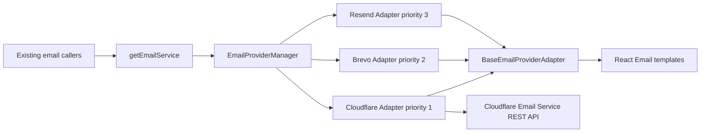
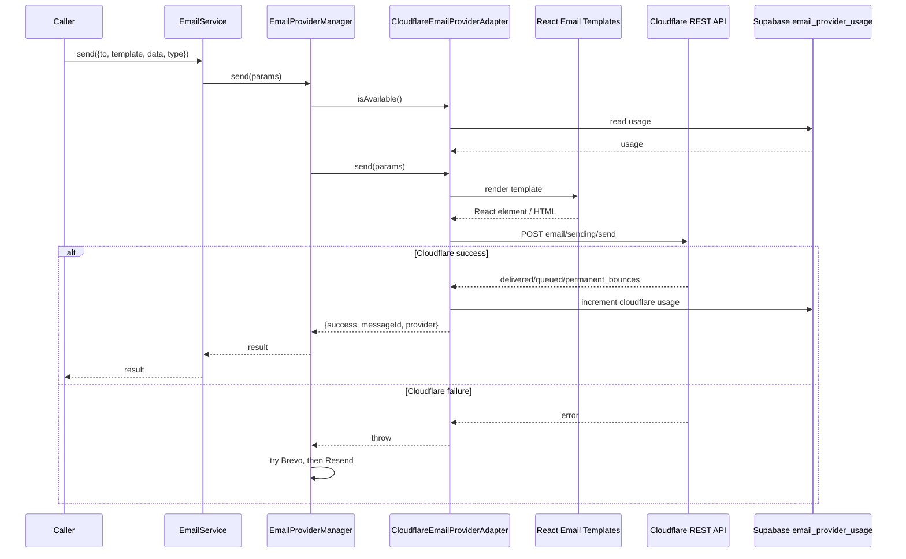

# PRD: Cloudflare Email Service as Primary Transactional Email Provider

Complexity: 6 -> MEDIUM mode

## 1. Context

**Problem:** MyImageUpscaler currently routes transactional email through Brevo first and Resend second; we need Cloudflare Email Service to become the primary provider while preserving the existing in-app templating engine and fallback behavior.

**Sources referenced:**

- Cloudflare Email Service overview: https://developers.cloudflare.com/email-service/
- Send emails guide: https://developers.cloudflare.com/email-service/get-started/send-emails/
- REST API reference: https://developers.cloudflare.com/email-service/api/send-emails/rest-api/
- Domain configuration: https://developers.cloudflare.com/email-service/configuration/domains/
- Limits: https://developers.cloudflare.com/email-service/platform/limits/
- Pricing: https://developers.cloudflare.com/email-service/platform/pricing/

**Files analyzed:**

- `shared/config/env.ts`
- `shared/types/provider-adapter.types.ts`
- `server/services/email.service.ts`
- `server/services/email-providers/base-email-provider-adapter.ts`
- `server/services/email-providers/email-provider-manager.ts`
- `server/services/email-providers/brevo.provider-adapter.ts`
- `server/services/email-providers/resend.provider-adapter.ts`
- `server/services/provider-credit-tracker.service.ts`
- `app/api/email/send/route.ts`
- `app/api/support/contact/route.ts`
- `app/api/webhooks/stripe/handlers/payment.handler.ts`
- `app/api/webhooks/stripe/handlers/subscription.handler.ts`
- `tests/unit/server/services/email-provider-manager.unit.spec.ts`
- `supabase/migrations/20260120000100_fix_function_search_paths.sql`

**Current behavior:**

- All application email callers use `getEmailService().send(...)` and pass template names plus template data.
- `BaseEmailProviderAdapter` loads React Email templates, injects `baseUrl`, `supportEmail`, and `appName`, computes the subject, and handles dev/test suppression.
- Provider adapters only perform provider-specific delivery after template rendering.
- `EmailProviderManager` currently registers Brevo with priority `1` and Resend with priority `3`.
- Email usage limits are tracked in `email_provider_usage` via Supabase RPCs and TypeScript-side default limits.

## 2. Goals

- Make Cloudflare Email Service the default primary transactional provider.
- Keep Brevo and Resend available as fallbacks unless explicitly disabled by configuration.
- Preserve the existing React Email templating engine; do not move templates into Cloudflare or provider dashboards.
- Support Cloudflare REST API sending from the existing Next.js backend.
- Track Cloudflare email usage in existing provider usage infrastructure.
- Add clear operational setup steps for Cloudflare account, DNS, secrets, and rollout validation.

## 3. Non-Goals

- Do not migrate inbound email routing in this PRD. Support inbox routing can be planned separately.
- Do not replace Supabase Auth email delivery unless Supabase can be configured to call this service path; app-triggered emails are the scope here.
- Do not rewrite email templates or introduce a provider-specific template system.
- Do not build a marketing email campaign system.

## 4. Manual Cloudflare Account Setup

Complete these steps before enabling Cloudflare as the production primary provider:

1. Confirm the site domain uses Cloudflare DNS. Cloudflare Email Service requires Cloudflare DNS.
2. Confirm the account is on Workers Paid. Cloudflare docs list Email Sending as available on Workers Paid, with Workers Free not supporting outbound sending.
3. In the Cloudflare dashboard, go to `Compute > Email Service > Email Sending`.
4. Select `Onboard Domain` for `myimageupscaler.com`.
5. Let Cloudflare add the sending DNS records. Expected records include MX/SPF/DKIM on `cf-bounce.myimageupscaler.com` and DMARC on `_dmarc.myimageupscaler.com`.
6. Verify Email Sending records in `Compute > Email Service > Email Sending > Settings`.
7. Create an API token with permission to send emails through Email Service.
8. Add production secrets:
   - `CLOUDFLARE_EMAIL_API_TOKEN`
   - `CLOUDFLARE_ACCOUNT_ID` is already used by the app; verify it remains present.
   - `EMAIL_FROM_ADDRESS=noreply@myimageupscaler.com` is already used by the app; verify it remains present.
9. Keep fallback provider secrets configured during rollout:
   - `BREVO_API_KEY`
   - `RESEND_API_KEY`
10. Send a production smoke email to a controlled inbox and verify:
    - Delivered or queued response from Cloudflare.
    - Message appears in the inbox or spam folder.
    - SPF, DKIM, and DMARC pass in message headers.
    - Cloudflare Email Logs show the send event.
11. Monitor daily sending limits in Cloudflare. The docs state account limits may vary by account standing and sending behavior.

**Production secret audit (2026-06-06):**

- Checked Google Cloud Secret Manager project `myimageupscaler-auth`, secret `myimageupscaler-api-prod`.
- Present: `EMAIL_FROM_ADDRESS=noreply@myimageupscaler.com`, `CLOUDFLARE_ACCOUNT_ID`, `BREVO_API_KEY`, `RESEND_API_KEY`.
- Missing for this rollout: `CLOUDFLARE_EMAIL_API_TOKEN`.
- No client-side production secret update is required for Cloudflare Email Service unless implementation later adds a public client flag.

**Cloudflare rollout evidence (2026-06-06):**

- Verified the local Cloudflare deployment token is active and can read the `myimageupscaler.com` zone.
- Verified `myimageupscaler.com` is active on Cloudflare DNS in full-zone mode with nameservers `ajay.ns.cloudflare.com` and `liz.ns.cloudflare.com`.
- Verified local `.env.api` has `CLOUDFLARE_API_TOKEN`, `CLOUDFLARE_ACCOUNT_ID`, `CLOUDFLARE_ZONE_ID`, `EMAIL_FROM_ADDRESS`, `BREVO_API_KEY`, and `RESEND_API_KEY`, but does not have `CLOUDFLARE_EMAIL_API_TOKEN`.
- Verified Cloudflare Worker secrets for `myimageupscaler` do not include `CLOUDFLARE_EMAIL_API_TOKEN`.
- Verified public DNS has existing Cloudflare Email Routing MX/SPF records on `myimageupscaler.com` and a DMARC record on `_dmarc.myimageupscaler.com`.
- After dashboard onboarding, verified Cloudflare Email Sending DNS is present:
  - MX records on `cf-bounce.myimageupscaler.com`.
  - SPF TXT on `cf-bounce.myimageupscaler.com`.
  - DKIM TXT on `cf-bounce._domainkey.myimageupscaler.com`.
- Attempted `GET /zones/{zone_id}/email/sending/subdomains`, `POST /zones/{zone_id}/email/sending/subdomains`, and `POST /accounts/{account_id}/email/sending/send` with the existing Cloudflare token; all returned Cloudflare `Authentication error`.
- No smoke email was sent because the current token is not authorized for Email Sending.
- Attempted to inspect Google Cloud Secret Manager with the active `gcloud` account; access was denied for `myimageupscaler-api-prod`.
- Retried after onboarding by testing 68 locally discoverable Cloudflare token candidates from the production secret, `.env.api`, and local Claude/Codex history against the Email Sending API. None were authorized for Email Sending, so no test email was sent to `admin@coldstartlabs.ca`.
- After token rotation, verified `GET /zones/{zone_id}/email/sending/subdomains` succeeds for `myimageupscaler.com` with Email Sending enabled.
- Sent a direct Cloudflare Email Service smoke email to `admin@coldstartlabs.ca`; API returned success and receipt was confirmed.
- Updated local `.env.api` with `CLOUDFLARE_EMAIL_API_TOKEN`.
- Updated Google Secret Manager `myimageupscaler-api-prod` by fetching the current production secret, modifying only Cloudflare token values, creating version 25, and disabling the bad blank-token version 24.
- Uploaded Cloudflare Worker secrets for `CLOUDFLARE_ACCOUNT_ID`, `CLOUDFLARE_EMAIL_API_TOKEN`, `EMAIL_FROM_ADDRESS`, `BREVO_API_KEY`, and `RESEND_API_KEY`.
- Applied and recorded production migrations:
  - `20260606000000_add_cloudflare_email_provider_usage.sql`
  - `20260606000100_repair_email_audit_tables.sql`
- Deployed production with Cloudflare primary enabled and Brevo/Resend fallbacks still configured.
  - Main Worker version: `9eb5a87f-aa05-496b-aee3-aeda0692710e`.
  - Cron Worker version: `116cc52d-3272-41a3-99a7-fe09e09b0897`.
  - Outrank proxy version: `e35a19f2-bdea-4e2d-b1ea-0fd07db48d11`.
- Production deploy verification passed: health check, webhook signature check, subscription reconciliation, cron schedule verification, and checkout smoke tests.
- Sent an app-level smoke email through `POST /api/email/send` to `admin@coldstartlabs.ca`.
  - Route returned provider `cloudflare`.
  - `public.email_logs` recorded status `sent` for template `welcome`.
  - `public.email_provider_usage` recorded Cloudflare usage for 2026-06-06.

**Remaining dashboard-only verification:**

Visually confirm the send in Cloudflare dashboard `Compute > Email Service > Email Sending > Logs` if dashboard audit evidence is required.

## 5. Integration Points Checklist

**How will this feature be reached?**

- [x] Entry point identified: existing `EmailService.send(...)`.
- [x] Caller files identified: `app/api/email/send/route.ts`, `app/api/support/contact/route.ts`, Stripe webhook handlers, and any future caller using `getEmailService()`.
- [x] Registration/wiring needed: register a new Cloudflare adapter in `EmailProviderManager` with priority `1`; move Brevo to fallback priority `2`; keep Resend as fallback priority `3`.

**Is this user-facing?**

- [x] No new UI required. This is an internal provider migration for existing transactional email flows.

**Full user flow:**

1. User performs an action that already sends transactional email, such as payment success, subscription update, admin-triggered email, or support form submission.
2. Caller invokes `getEmailService().send({ to, template, data, type: 'transactional' })`.
3. `BaseEmailProviderAdapter` loads and renders the existing React Email template.
4. `EmailProviderManager` selects Cloudflare first if configured and within limits.
5. Cloudflare REST API sends the already-rendered HTML email.
6. If Cloudflare is unavailable or fails, the manager attempts Brevo and then Resend.
7. User receives the same email content and subject as before.

## 6. Solution

**Approach:**

- Add `EmailProvider.CLOUDFLARE` to the shared provider enum and TypeScript types.
- Add a `CloudflareEmailProviderAdapter` that extends `BaseEmailProviderAdapter`.
- Use Cloudflare's REST endpoint: `POST https://api.cloudflare.com/client/v4/accounts/{account_id}/email/sending/send`.
- Render HTML using the existing React Email path, then send payload fields `to`, `from`, `subject`, `html`, and text fallback when available.
- Add Cloudflare provider config and environment variables in `shared/config/env.ts`.
- Update usage tracking defaults and Supabase RPC provider limits for Cloudflare.
- Update unit tests for provider order, failover, missing credentials, and Cloudflare response/error mapping.

**Architecture diagram:**

**Key decisions:**

- [x] Use REST API, not Workers binding, because current email sends originate in the Next.js server routes and webhook handlers.
- [x] Keep the template engine in `BaseEmailProviderAdapter`; Cloudflare receives rendered output only.
- [x] Preserve existing dev/test suppression behavior in the base adapter.
- [x] Keep fallbacks active during rollout to avoid lost transactional emails.
- [x] Treat Cloudflare beta status as rollout risk and keep rapid provider priority rollback available.

**Data changes:**

- Update email provider usage limit logic to recognize provider value `cloudflare`.
- No new table required if existing `email_provider_usage.provider` accepts arbitrary text.
- Add migration only for RPC limit handling and optional comments/documentation.

## 7. Cloudflare API Requirements

Cloudflare Email Service REST API requirements from docs:

- Endpoint: `POST /client/v4/accounts/{account_id}/email/sending/send`.
- Auth: `Authorization: Bearer <API_TOKEN>`.
- Required content type: JSON.
- Basic payload supports `to`, `from`, `subject`, `html`, and `text`.
- `from` may be a string address or object with `address` and `name`.
- Success response contains `success`, `errors`, `messages`, and `result` with recipient status arrays.
- Error responses include Cloudflare API error codes and messages.
- Content limits include 50 combined `to`/`cc`/`bcc` recipients, 998-character subject, 5 MiB total message size, and 16 KB combined custom headers.

## 8. Sequence Flow

## 9. Execution Phases

#### Phase 1: Provider Type and Configuration - Cloudflare appears as a first-class email provider.

**Files:**

- `shared/types/provider-adapter.types.ts` - add `EmailProvider.CLOUDFLARE`.
- `shared/config/env.ts` - add `CLOUDFLARE_EMAIL_API_TOKEN`.
- `.env.api.example` - document Cloudflare email variables.
- `server/services/provider-credit-tracker.service.ts` - add TypeScript-side Cloudflare limits.
- `supabase/migrations/<timestamp>_add_cloudflare_email_provider_usage.sql` - add RPC handling for `cloudflare`.

**Implementation:**

- [x] Add `cloudflare = 'cloudflare'` to `EmailProvider`.
- [x] Add server env schema/load entries:
  - `CLOUDFLARE_EMAIL_API_TOKEN`
- [x] Use existing `CLOUDFLARE_ACCOUNT_ID`; do not introduce a duplicate account ID.
- [x] Add Cloudflare usage limits. Use documented paid-plan included volume as the initial monthly limit: 3,000 included per month. Daily limits may vary, so set a configurable daily default or avoid a hard daily block until Cloudflare returns 429.
- [x] Update Supabase RPC limit switch for `cloudflare`.

**Tests Required:**

| Test File                                                                 | Test Name                            | Assertion                                                         |
| ------------------------------------------------------------------------- | ------------------------------------ | ----------------------------------------------------------------- |
| `tests/unit/server/services/provider-credit-tracker.service.unit.spec.ts` | `tracks cloudflare email usage`      | `EmailProvider.CLOUDFLARE` resolves limits and RPC provider value |
| `tests/unit/config/provider-aware-credits.unit.spec.ts`                   | `includes cloudflare email provider` | provider map includes Cloudflare without breaking Brevo/Resend    |

**User Verification:**

- Action: Run `yarn test tests/unit/server/services/provider-credit-tracker.service.unit.spec.ts tests/unit/config/provider-aware-credits.unit.spec.ts`.
- Expected: Cloudflare is recognized as an email provider and existing providers still pass.

#### Phase 2: Cloudflare REST Adapter - Existing templates can be delivered through Cloudflare.

**Files:**

- `server/services/email-providers/cloudflare.provider-adapter.ts` - new adapter.
- `server/services/email-providers/index.ts` - export adapter if used locally.
- `server/services/email-providers/email-provider-manager.ts` - register Cloudflare before Brevo/Resend.
- `tests/unit/server/services/email-provider-manager.unit.spec.ts` - update provider mocks/order.
- `server/services/email-providers/__tests__/email-provider-manager.test.ts` - update template/provider expectations if applicable.

**Implementation:**

- [x] Implement `CloudflareEmailProviderAdapter extends BaseEmailProviderAdapter`.
- [x] In `sendEmail(to, subject, reactElement)`, render HTML using `@react-email/render`.
- [x] Build payload:
  - `to`
  - `from: { address: this.fromAddress, name: this.appName }`
  - `subject`
  - `html`
  - `text` if a reliable plain-text render helper is available; otherwise use a simple provider-neutral fallback in a follow-up task.
- [x] Send to `https://api.cloudflare.com/client/v4/accounts/${serverEnv.CLOUDFLARE_ACCOUNT_ID}/email/sending/send`.
- [x] Map success response to `{ messageId, provider: 'cloudflare', response }`.
- [x] Treat `success: false`, non-2xx, `permanent_bounces`, and Cloudflare error arrays as provider failures that allow fallback.
- [x] `isAvailable()` returns false when account ID or API token is missing outside test mode.
- [x] Register Cloudflare priority `1`, Brevo priority `2`, Resend priority `3`.

**Tests Required:**

| Test File                                                                       | Test Name                                         | Assertion                                                                   |
| ------------------------------------------------------------------------------- | ------------------------------------------------- | --------------------------------------------------------------------------- |
| `tests/unit/server/services/email-provider-manager.unit.spec.ts`                | `returns cloudflare as highest priority provider` | selected provider is `EmailProvider.CLOUDFLARE`                             |
| `tests/unit/server/services/email-provider-manager.unit.spec.ts`                | `falls back to brevo when cloudflare unavailable` | selected provider is Brevo                                                  |
| `server/services/email-providers/__tests__/cloudflare.provider-adapter.test.ts` | `sends rendered template payload to cloudflare`   | fetch receives Cloudflare endpoint, bearer auth, rendered HTML, sender name |
| `server/services/email-providers/__tests__/cloudflare.provider-adapter.test.ts` | `throws on cloudflare api error`                  | non-2xx/error array is mapped to an error                                   |

**User Verification:**

- Action: In development, keep `ALLOW_TRANSACTIONAL_EMAILS_IN_DEV=false` and trigger `/api/email/send`.
- Expected: No real email is sent; log shows provider `cloudflare` in dev/test mode.

#### Phase 3: Production Rollout and Observability - Transactional flows send through Cloudflare with fallback coverage.

**Files:**

- `server/services/email.service.ts` - update provider priority documentation.
- `docs/PRDs/cloudflare-email-service/transactional-email-provider.md` - mark implementation notes as complete during execution.
- `tests/unit/api/stripe-webhooks-email.unit.spec.ts` - assert existing webhook email behavior remains provider-agnostic.
- `app/api/email/send/route.ts` - no behavioral change expected; only touch if response metadata needs provider surfacing.
- `app/api/support/contact/route.ts` - no behavioral change expected; only touch if operational logging needs provider surfacing.

**Implementation:**

- [x] Confirm all existing callers remain unchanged and provider-agnostic.
- [x] Confirm support contact, payment success, credit-pack purchase, subscription update, and admin send flows use the same template names.
- [x] Add/adjust logs to include selected provider if existing logs do not expose it.
- [x] Deploy with Cloudflare enabled and fallbacks still configured.
- [x] Send controlled smoke emails through `/api/email/send`.
- [x] Verify local email logs and fallback wiring.
- [ ] Verify Cloudflare dashboard Email Logs.

**Tests Required:**

| Test File                                               | Test Name                             | Assertion                                                |
| ------------------------------------------------------- | ------------------------------------- | -------------------------------------------------------- |
| `tests/unit/api/stripe-webhooks-email.unit.spec.ts`     | existing email tests                  | webhooks continue calling `getEmailService().send(...)`  |
| `tests/unit/server/services/email.service.unit.spec.ts` | `returns selected provider in result` | result provider may be Cloudflare without caller changes |

**User Verification:**

- Action: Trigger an admin test email to a controlled inbox.
- Expected: Email content matches existing template output; Cloudflare Email Logs show send activity.
- Action: Temporarily disable Cloudflare by removing the Cloudflare email token in staging.
- Expected: Email sends via Brevo fallback.

## 10. Checkpoint Protocol

After each implementation phase:

- Run focused unit tests listed in that phase.
- Run `yarn verify` if the phase touched shared types, env config, or provider manager behavior.
- Review that no caller bypasses `getEmailService()`.
- Confirm template rendering remains in `BaseEmailProviderAdapter`.

For Phase 3, manual verification is also required because external deliverability and DNS cannot be proven by unit tests:

- Confirm Cloudflare domain status is verified.
- Confirm at least one smoke email arrives.
- Confirm SPF/DKIM/DMARC pass.
- Confirm Cloudflare Email Logs show the send.
- Confirm fallback works in staging.

## 11. Acceptance Criteria

- `EmailProvider.CLOUDFLARE` exists and is registered as primary.
- Brevo and Resend remain registered as fallbacks.
- Existing email callers do not need provider-specific code.
- Existing React Email templates remain the only transactional template source.
- Cloudflare adapter sends rendered HTML through the REST API.
- Missing Cloudflare credentials disable Cloudflare outside test mode and do not block fallbacks.
- Cloudflare API errors trigger fallback behavior.
- Usage tracking includes Cloudflare.
- `.env.api.example` documents all new variables.
- Manual Cloudflare account setup has been completed before production enablement.

## 12. Risks and Mitigations

- **Cloudflare Email Service is beta:** Keep Brevo and Resend fallbacks configured; rollback by removing the Cloudflare email token or changing provider registration priority.
- **Account daily sending limits may vary:** Monitor Cloudflare 429 responses and Email Logs; avoid hardcoding an aggressive daily cap unless account limits are confirmed.
- **DNS/authentication misconfiguration:** Do not enable Cloudflare primary in production until SPF, DKIM, and DMARC pass on smoke messages.
- **Template regression risk:** Do not alter template loading/rendering in `BaseEmailProviderAdapter` except for optional plain-text rendering support.
- **Provider response mismatch:** Store raw Cloudflare response in provider result for debugging while returning existing `ISendEmailResult` shape to callers.

## 13. Rollback Plan

- Remove `CLOUDFLARE_EMAIL_API_TOKEN` from production or ship a provider priority rollback so Brevo is selected first.
- Keep `BREVO_API_KEY` and `RESEND_API_KEY` configured.
- Restart/redeploy the app so `EmailProviderManager` initializes with Cloudflare disabled.
- Verify Brevo resumes as selected provider.
- Leave Cloudflare DNS records in place unless they cause authentication conflicts; they should not affect app fallback sends from other verified providers unless SPF/DMARC is misconfigured.
