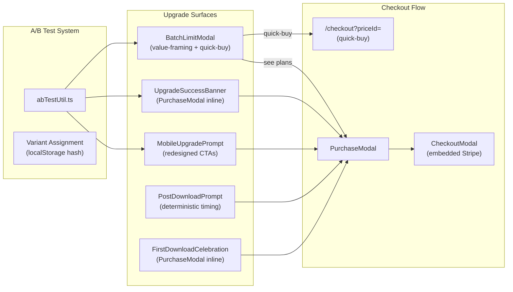
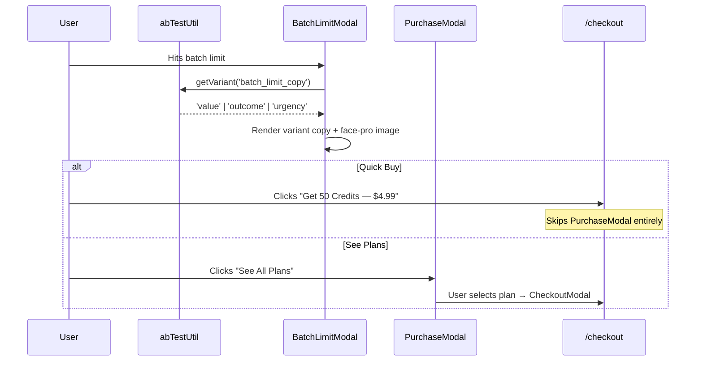

# PRD: Conversion Funnel Optimization V2

## Status: Ready

## Complexity: 6 → MEDIUM mode

## 1. Context

**Problem:** Upgrade prompts have 2.4% CTR (14,550 shown → 351 clicked → 4 purchased). The worst-performing trigger `after_batch` has 0.4% CTR (3,879 shown → 17 clicks). Mobile prompts have near-zero conversion (4,359 shown → 6 clicks). 74% of users who hit the batch limit modal bounce without clicking upgrade.

**Data (last 30 days):**

| Metric                  | Value                                     |
| ----------------------- | ----------------------------------------- |
| Upgrade prompt shown    | 14,550                                    |
| Clicked                 | 351 (2.4% CTR)                            |
| Dismissed               | 3,073 (21%)                               |
| Purchased               | 4 (0.03% of shown)                        |
| Batch limit hits        | 344 users                                 |
| Batch limit upgrade CTR | 26%                                       |
| Mobile prompt shown     | 4,359                                     |
| Mobile prompt clicked   | 6 (0.14%)                                 |
| `model_gate` CTR        | Best trigger (~85 clicks, 6th most shown) |
| `after_batch` CTR       | 0.4% (3,879 shown → 17 clicks)            |
| Median time to click    | 73,748s (~20 hours)                       |

**Files Analyzed:**

```
client/components/features/workspace/BatchLimitModal.tsx
client/components/features/workspace/UpgradeSuccessBanner.tsx
client/components/features/workspace/MobileUpgradePrompt.tsx
client/components/features/workspace/PostDownloadPrompt.tsx
client/components/features/workspace/AfterUpscaleBanner.tsx
client/components/features/workspace/FirstDownloadCelebration.tsx
client/components/features/workspace/Workspace.tsx
client/components/stripe/PurchaseModal.tsx
client/components/stripe/CheckoutModal.tsx
client/hooks/useCheckoutFlow.ts
client/utils/promptFrequency.ts
client/analytics/analyticsClient.ts
server/analytics/types.ts
shared/config/subscription.config.ts
locales/en/workspace.json
public/before-after/face-pro/before.webp
public/before-after/face-pro/after.webp
```

**Current Behavior:**

- BatchLimitModal uses amber warning icon + "Batch Limit Reached" friction-framing. Opens PurchaseModal (extra step before checkout).
- UpgradeSuccessBanner (`after_batch` trigger) fires on every batch completion for free users. Links to `/dashboard/billing` (full page navigation). 0.4% CTR — worst performer.
- MobileUpgradePrompt has small button targets (~40px), weak "View Plans" / "Upgrade" copy, no visual differentiation from background.
- PostDownloadPrompt uses 50% random probability (not strategic), hardcoded English copy, links to `/dashboard/billing`.
- FirstDownloadCelebration links to `/dashboard/billing` instead of opening PurchaseModal inline.
- No A/B testing infrastructure exists — all copy changes are ship-and-measure.

**Already Deployed (not in scope):**

- CheckoutModal with embedded Stripe, 30s timeout, exit survey (commit `2a3ea590`)
- ModelGalleryModal opens CheckoutModal directly (commit `1c9f1f7a`)
- Post-auth redirect fixed, PurchaseModal created (commit `1c9f1f7a`)
- Engagement discount toast with countdown (commit `6d09e613`)
- First-time user activation with ProgressSteps (commit `31307c81`)

---

## 2. Solution

### Approach

1. **Build a lightweight A/B test utility** — deterministic variant assignment via localStorage hash, tracked on every `upgrade_prompt_*` Amplitude event. No external library needed.
2. **Overhaul BatchLimitModal** — value-framing copy with face-pro before/after image, quick-buy $4.99 button that skips PurchaseModal, A/B test between 3 copy variants.
3. **Fix UpgradeSuccessBanner** — open PurchaseModal inline instead of linking to `/dashboard/billing`. Add promptFrequency throttling to reduce spam.
4. **Redesign MobileUpgradePrompt** — full-width bottom-sheet style with large thumb-friendly CTA, before/after thumbnail, stronger copy.
5. **Fix PostDownloadPrompt** — deterministic timing (show on 2nd download, not random), open PurchaseModal inline instead of navigating away.
6. **Fix FirstDownloadCelebration** — open PurchaseModal instead of navigating to `/dashboard/billing`.

### Architecture Diagram



### Key Decisions

- **No external A/B library** — use a simple deterministic hash on a localStorage ID. Amplitude tracks `copyVariant` on all upgrade events for segmentation.
- **Face-pro before/after image** — use existing `/public/before-after/face-pro/` assets in BatchLimitModal and MobileUpgradePrompt to show tangible upgrade value.
- **Quick-buy = $4.99 small pack** — price ID from `NEXT_PUBLIC_STRIPE_PRICE_CREDITS_SMALL`. Skips PurchaseModal, goes straight to `/checkout?priceId=...`.
- **promptFrequency utility** — already exists at `client/utils/promptFrequency.ts` but unused by most prompts. Wire it into UpgradeSuccessBanner.
- **No new analytics event types needed** — all existing `upgrade_prompt_shown/clicked/dismissed` events get a new `copyVariant` property.

### Data Changes

None — no database or migration changes.

### Integration Points

```
How will this feature be reached?
- [x] Entry point: All upgrade surfaces already exist and are wired into Workspace.tsx
- [x] Caller: Workspace.tsx already renders all these components
- [x] Registration: A/B util imported by each surface component

Is this user-facing?
- [x] YES — UI changes to 5 existing components + 1 new utility

Full user flow:
1. User uploads/upscales images as free user
2. Triggers upgrade surface (batch limit, post-download, after-upscale, mobile prompt)
3. Sees value-framing copy with A/B variant, face-pro before/after image
4. Clicks "Quick Buy $4.99" → /checkout?priceId=... OR "See All Plans" → PurchaseModal
5. Completes purchase via embedded Stripe checkout
```

---

## 3. Sequence Flow



---

## 4. Execution Phases

### Phase 1: A/B Test Utility + Analytics Enrichment

**User-visible outcome:** All upgrade prompt events in Amplitude include a `copyVariant` property for segmentation.

**Files (4):**

- `client/utils/abTest.ts` — NEW: deterministic variant assignment utility
- `server/analytics/types.ts` — add `copyVariant` to upgrade prompt event properties
- `app/api/analytics/event/route.ts` — allow `copyVariant` in event validation
- `tests/unit/client/ab-test.unit.spec.ts` — NEW: unit tests for A/B utility

**Implementation:**

- [ ] Create `abTest.ts` with:
  - `getVariant(experimentName: string, variants: string[]): string` — deterministic assignment using hash of `localStorage` user ID + experiment name
  - `getUserId(): string` — get or create a stable anonymous ID in localStorage (`miu_ab_user_id`)
  - Uses simple hash (djb2) mod variants.length for assignment — no external deps
- [ ] Add `copyVariant?: string` to `IUpgradePromptShownProperties`, `IUpgradePromptClickedProperties`, `IUpgradePromptDismissedProperties` in analytics types
- [ ] Add `copyVariant` to ALLOWED_PROPERTIES in analytics event validation
- [ ] Unit tests: deterministic assignment (same user+experiment = same variant), even distribution across 1000 IDs, stable across page reloads

**Tests Required:**

| Test File                                | Test Name                                                      | Assertion                                                    |
| ---------------------------------------- | -------------------------------------------------------------- | ------------------------------------------------------------ |
| `tests/unit/client/ab-test.unit.spec.ts` | `should return deterministic variant for same user+experiment` | Same input → same output                                     |
| `tests/unit/client/ab-test.unit.spec.ts` | `should distribute variants roughly evenly`                    | Each variant within 20-40% of 1000 samples                   |
| `tests/unit/client/ab-test.unit.spec.ts` | `should create stable user ID in localStorage`                 | ID persists across calls                                     |
| `tests/unit/client/ab-test.unit.spec.ts` | `should return different variants for different experiments`   | Different experiment names can produce different assignments |

---

### Phase 2: BatchLimitModal Overhaul

**User-visible outcome:** When a free user hits the batch limit, they see a value-framing modal with a face-pro before/after image comparison, A/B tested copy, and a "Quick Buy $4.99" button that goes directly to checkout.

**Files (3):**

- `client/components/features/workspace/BatchLimitModal.tsx` — redesign: value framing, image, quick-buy button, A/B copy
- `locales/en/workspace.json` — update batch limit copy (3 variants)
- `tests/unit/client/batch-limit-modal.unit.spec.ts` — NEW: test A/B variant rendering + quick-buy behavior

**Implementation:**

- [ ] Replace `AlertTriangle` icon with `Sparkles` icon (opportunity, not error)
- [ ] Replace amber color scheme with accent/secondary gradient (positive framing)
- [ ] Add face-pro before/after image comparison (side-by-side, `next/image`, lazy loaded)
  - Before: `/before-after/face-pro/before.webp`
  - After: `/before-after/face-pro/after.webp`
  - Small thumbnail pair with subtle rounded corners, centered above copy
- [ ] A/B test 3 copy variants using `getVariant('batch_limit_copy', ['value', 'outcome', 'urgency'])`:
  - **value**: Title "Upscale Unlimited Images", body "Get 50 credits for just $4.99 — batch process, pro AI models, 4K output."
  - **outcome**: Title "Your Images Deserve Better Quality", body "See the difference pro AI models make. Sharper details, cleaner edges, up to 4K resolution."
  - **urgency**: Title "Limited Time: 50 Credits for $4.99", body "Start batch processing now. Pro AI models included."
- [ ] Add translation keys for all 3 variants: `batchLimit.title_value`, `batchLimit.title_outcome`, `batchLimit.title_urgency`, `batchLimit.body_value`, `batchLimit.body_outcome`, `batchLimit.body_urgency`
- [ ] Primary CTA: "Get 50 Credits — $4.99" → navigates to `/checkout?priceId={SMALL_PACK_PRICE_ID}` (quick-buy, skips PurchaseModal)
- [ ] Secondary CTA: "See All Plans" → opens PurchaseModal (existing `onUpgrade()`)
- [ ] Track `copyVariant` on all analytics events (`batch_limit_modal_shown`, `batch_limit_upgrade_clicked`, `batch_limit_modal_closed`)
- [ ] Track new event property `quickBuy: boolean` to distinguish quick-buy clicks from "see plans" clicks
- [ ] Import price ID from `clientEnv` (`NEXT_PUBLIC_STRIPE_PRICE_CREDITS_SMALL`)

**Tests Required:**

| Test File                                          | Test Name                                        | Assertion                                            |
| -------------------------------------------------- | ------------------------------------------------ | ---------------------------------------------------- |
| `tests/unit/client/batch-limit-modal.unit.spec.ts` | `should render value variant when assigned`      | Title matches "Upscale Unlimited Images"             |
| `tests/unit/client/batch-limit-modal.unit.spec.ts` | `should render outcome variant when assigned`    | Title matches "Your Images Deserve Better Quality"   |
| `tests/unit/client/batch-limit-modal.unit.spec.ts` | `should render urgency variant when assigned`    | Title matches "Limited Time: 50 Credits for $4.99"   |
| `tests/unit/client/batch-limit-modal.unit.spec.ts` | `should show face-pro before/after images`       | Two img elements with correct src paths              |
| `tests/unit/client/batch-limit-modal.unit.spec.ts` | `should navigate to checkout on quick-buy click` | Router push called with `/checkout?priceId=...`      |
| `tests/unit/client/batch-limit-modal.unit.spec.ts` | `should track copyVariant in analytics events`   | `analytics.track` called with `copyVariant` property |

---

### Phase 3: UpgradeSuccessBanner + PostDownloadPrompt Fixes

**User-visible outcome:** After-batch banner opens PurchaseModal inline (no page navigation), shows less frequently. Post-download prompt triggers on 2nd download (not random) and opens PurchaseModal inline.

**Files (4):**

- `client/components/features/workspace/UpgradeSuccessBanner.tsx` — open PurchaseModal via callback, add promptFrequency throttling, add `copyVariant`
- `client/components/features/workspace/PostDownloadPrompt.tsx` — deterministic 2nd-download timing, open PurchaseModal via callback instead of Link to `/dashboard/billing`
- `client/components/features/workspace/Workspace.tsx` — pass `openUpgradeModal` callback to UpgradeSuccessBanner + PostDownloadPrompt
- `tests/unit/client/upgrade-prompts.unit.spec.tsx` — update existing tests for new behavior

**Implementation:**

**UpgradeSuccessBanner:**

- [ ] Replace `<Link href="/dashboard/billing">` with `<button onClick={onUpgrade}>` that calls `openUpgradeModal(false, 'after_batch')`
- [ ] Add `onUpgrade: () => void` prop (replaces the direct link)
- [ ] Wire promptFrequency: `canShowPrompt({ key: 'prompt_freq_after_batch', cooldownMs: 4 * 60 * 60 * 1000, maxPerWeek: 3 })` — max 3x/week, 4h cooldown
- [ ] Call `markPromptShown()` when banner is shown
- [ ] Add `copyVariant` to analytics events using `getVariant('after_batch_copy', ['value', 'outcome', 'urgency'])`
- [ ] Update analytics destination from `'/dashboard/billing'` to `'purchase_modal'`

**PostDownloadPrompt:**

- [ ] Change from 50% random (`Math.random() >= 0.5`) to deterministic: show on 2nd download (`downloadCount >= 2`) with `canShowPrompt({ key: 'prompt_freq_post_download', cooldownMs: 24 * 60 * 60 * 1000 })` for 24h cooldown
- [ ] Replace `<Link href="/dashboard/billing">` CTA with `onUpgrade` callback prop
- [ ] Add `onUpgrade: () => void` prop
- [ ] Update analytics destination from `'/dashboard/billing'` to `'purchase_modal'`

**Workspace.tsx:**

- [ ] Pass `onUpgrade={() => openUpgradeModal(false, 'after_batch')}` to UpgradeSuccessBanner
- [ ] Pass `onUpgrade={() => openUpgradeModal(false, 'after_download')}` to PostDownloadPrompt

**Tests Required:**

| Test File                                         | Test Name                                                          | Assertion                                                 |
| ------------------------------------------------- | ------------------------------------------------------------------ | --------------------------------------------------------- |
| `tests/unit/client/upgrade-prompts.unit.spec.tsx` | `UpgradeSuccessBanner should call onUpgrade instead of navigating` | `onUpgrade` callback invoked, no Link rendered            |
| `tests/unit/client/upgrade-prompts.unit.spec.tsx` | `UpgradeSuccessBanner should respect promptFrequency throttling`   | Not shown when cooldown hasn't elapsed                    |
| `tests/unit/client/upgrade-prompts.unit.spec.tsx` | `PostDownloadPrompt should show on 2nd download`                   | Visible when downloadCount=2, hidden when downloadCount=1 |
| `tests/unit/client/upgrade-prompts.unit.spec.tsx` | `PostDownloadPrompt should call onUpgrade instead of navigating`   | `onUpgrade` callback invoked                              |

---

### Phase 4: MobileUpgradePrompt Redesign

**User-visible outcome:** Mobile users see a visually prominent upgrade prompt with a face-pro before/after thumbnail and a large, thumb-friendly CTA button.

**Files (2):**

- `client/components/features/workspace/MobileUpgradePrompt.tsx` — full redesign: bigger CTA, before/after image, stronger copy
- `tests/unit/client/mobile-upgrade-prompt.unit.spec.ts` — NEW: test redesigned layout

**Implementation:**

- [ ] **Upload variant** redesign:
  - Add face-pro before/after thumbnail pair (40x40px each, side-by-side with arrow between)
  - Replace "View Plans" with "Get Pro Results — from $4.99" (benefit + price anchor)
  - Increase button to `py-3` (48px touch target minimum)
  - Use `bg-accent` filled button instead of outline (higher visual contrast)
  - A/B copy variant tracked via `copyVariant` on analytics events
- [ ] **Preview variant** redesign:
  - Increase button padding: `px-4 py-2.5` → `px-5 py-3` (bigger touch target)
  - Change copy from "Upgrade" to "Go Pro — $4.99"
  - Add subtle pulse animation on first render to draw attention: `animate-pulse` for 3 seconds then stop
- [ ] Track `copyVariant` property on `upgrade_prompt_shown` and `upgrade_prompt_clicked`

**Tests Required:**

| Test File                                              | Test Name                                             | Assertion                                |
| ------------------------------------------------------ | ----------------------------------------------------- | ---------------------------------------- |
| `tests/unit/client/mobile-upgrade-prompt.unit.spec.ts` | `upload variant should render before/after images`    | Two img elements present                 |
| `tests/unit/client/mobile-upgrade-prompt.unit.spec.ts` | `upload variant should have accessible touch targets` | Button min-height >= 44px                |
| `tests/unit/client/mobile-upgrade-prompt.unit.spec.ts` | `should track copyVariant in analytics`               | `analytics.track` includes `copyVariant` |

---

### Phase 5: FirstDownloadCelebration Fix

**User-visible outcome:** After first download, "See Plans" button opens PurchaseModal inline instead of navigating away from the workspace.

**Files (2):**

- `client/components/features/workspace/FirstDownloadCelebration.tsx` — replace router.push('/dashboard/billing') with onUpgrade callback
- `tests/unit/client/upgrade-prompts.unit.spec.tsx` — add test for celebration upgrade flow

**Implementation:**

- [ ] Add `onUpgrade?: () => void` prop to `IFirstDownloadCelebrationProps`
- [ ] Replace `router.push('/dashboard/billing')` in `handleViewPlans` with `onUpgrade?.()` call
- [ ] Remove `useRouter` import if no longer needed
- [ ] Update analytics destination from `'/dashboard/billing'` to `'purchase_modal'`
- [ ] In Workspace.tsx, pass `onUpgrade={() => openUpgradeModal(false, 'celebration')}` to FirstDownloadCelebration

**Tests Required:**

| Test File                                         | Test Name                                                              | Assertion                                            |
| ------------------------------------------------- | ---------------------------------------------------------------------- | ---------------------------------------------------- |
| `tests/unit/client/upgrade-prompts.unit.spec.tsx` | `FirstDownloadCelebration should call onUpgrade instead of navigating` | `onUpgrade` callback invoked, router.push not called |

---

## 5. Acceptance Criteria

- [ ] All phases complete
- [ ] All specified tests pass
- [ ] `yarn verify` passes
- [ ] A/B test utility assigns deterministic, stable variants
- [ ] All `upgrade_prompt_*` Amplitude events include `copyVariant` property
- [ ] BatchLimitModal shows face-pro before/after images and 3 copy variants
- [ ] Quick-buy button navigates directly to `/checkout?priceId=...` (no PurchaseModal hop)
- [ ] UpgradeSuccessBanner opens PurchaseModal inline (no `/dashboard/billing` navigation)
- [ ] PostDownloadPrompt triggers on 2nd download (not random)
- [ ] MobileUpgradePrompt has 44px+ touch targets
- [ ] FirstDownloadCelebration opens PurchaseModal inline
- [ ] No `/dashboard/billing` links remain in upgrade prompt surfaces (all use PurchaseModal callback)

## 6. Success Metrics

| Metric                     | Current   | Target                  | Measurement                                                        |
| -------------------------- | --------- | ----------------------- | ------------------------------------------------------------------ |
| Overall upgrade prompt CTR | 2.4%      | 5%+                     | Amplitude: `upgrade_prompt_clicked / upgrade_prompt_shown`         |
| Batch limit modal CTR      | 26%       | 40%+                    | Amplitude: `batch_limit_upgrade_clicked / batch_limit_modal_shown` |
| `after_batch` CTR          | 0.4%      | 3%+                     | Amplitude: filter by `trigger='after_batch'`                       |
| Mobile prompt CTR          | 0.14%     | 2%+                     | Amplitude: filter by `trigger='mobile_*'`                          |
| Quick-buy → purchase rate  | N/A (new) | 5%+                     | Amplitude: `purchase_confirmed` where `source='quick_buy'`         |
| Copy variant winner        | N/A       | Identify within 2 weeks | Amplitude: segment by `copyVariant`                                |

## 7. A/B Test Plan

### Experiment: `batch_limit_copy`

| Variant   | Title                                | Body                                                                               |
| --------- | ------------------------------------ | ---------------------------------------------------------------------------------- |
| `value`   | "Upscale Unlimited Images"           | "Get 50 credits for just $4.99 — batch process, pro AI models, 4K output."         |
| `outcome` | "Your Images Deserve Better Quality" | "See the difference pro AI models make. Sharper details, cleaner edges, up to 4K." |
| `urgency` | "Limited Time: 50 Credits for $4.99" | "Start batch processing now. Pro AI models included."                              |

**How to analyze in Amplitude:**

1. Go to Segmentation chart
2. Event: `batch_limit_upgrade_clicked`
3. Group by: `copyVariant`
4. Compare CTR across variants
5. After 2 weeks with sufficient volume, ship the winning variant as default

### Experiment: `after_batch_copy`

Same 3 variants applied to UpgradeSuccessBanner. Tracked via `copyVariant` on `upgrade_prompt_clicked` where `trigger='after_batch'`.
