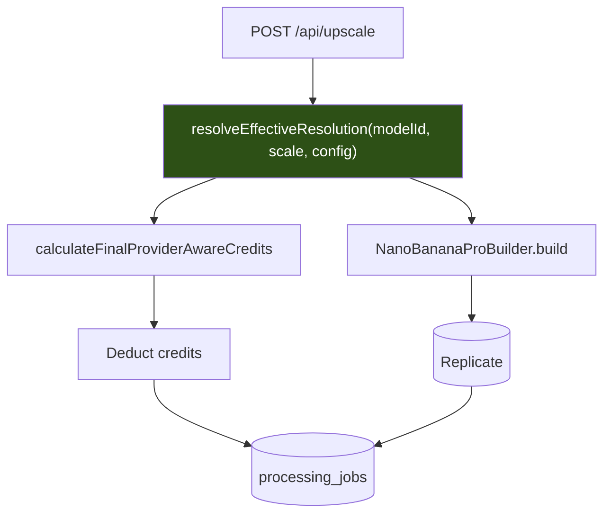
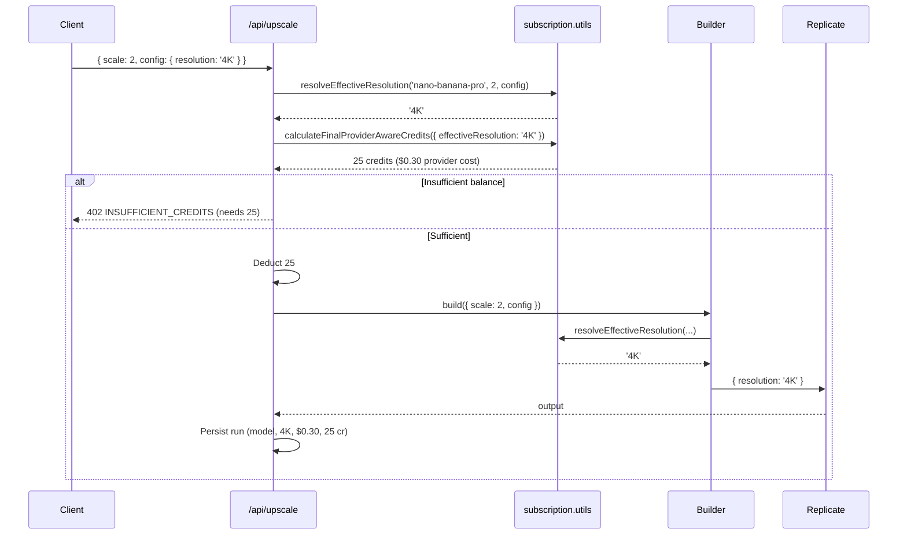

# PRD: Credit Economy Correctness

**Status:** Local implementation complete; production validation pending
**Created:** 2026-07-26
**Complexity:** 7 → HIGH mode (mandatory checkpoint after every phase)
**Trigger:** Replicate invoice reconciliation for June/July 2026 (`invoice-june.json`, `invoice-july.json`)

---

## 1. Context

**Problem:** Several models are billed by Replicate on an axis (output resolution, megapixels) that our credit charge does not model at all, so the credits we deduct do not track the cost we incur — and in one case we lose money on every run.

### Files Analyzed

| Area               | Path                                                                                                                            |
| ------------------ | ------------------------------------------------------------------------------------------------------------------------------- |
| Credit math        | `shared/config/subscription.utils.ts`, `shared/config/subscription.config.ts`, `shared/config/credits.config.ts`                |
| Model/cost config  | `shared/config/model-costs.config.ts`, `shared/types/coreflow.types.ts`                                                         |
| Billing call site  | `app/api/upscale/route.ts`, `app/api/credit-estimate/route.ts`                                                                  |
| Fallback billing   | `server/services/image-generation.service.ts`, `server/services/replicate.service.ts`                                           |
| Provider input     | `server/services/replicate/builders/models/{nano-banana-pro,nano-banana-2,seedream,flux-2-pro,clarity-pro-upscaler}.builder.ts` |
| Request validation | `shared/validation/upscale.schema.ts`                                                                                           |
| Ground truth       | `invoice-june.json`, `invoice-july.json` (Replicate line items)                                                                 |

### Current Behavior

- `calculateFinalProviderAwareCredits()` (`subscription.utils.ts:304`) supports three pricing models: `flat`, `per-image`, `output-megapixel`. Every resolution-priced model is classified `flat`.
- `MODEL_SCALE_CREDIT_MULTIPLIERS` (`model-costs.config.ts:344`) has exactly one entry — `clarity-upscaler`. Everything else is 1.0 at every scale.
- The Nano Banana builders pick an output resolution from `nanoBananaProConfig?.resolution || SCALE_TO_RESOLUTION[scale]`, but billing never sees that value.
- Replicate bills `nano-banana-pro` at **$0.15 (2K) / $0.30 (4K)** per output image and `nano-banana-2` at **$0.101 (2K) / $0.151 (4K)** — both confirmed as distinct invoice line items, not estimates.
- No per-run record of model / scale / resolution is persisted; `processing_jobs` has 0 rows.

### Ground Truth from Invoices

```
nano-banana-pro   2K   $0.15/img      nano-banana-2   2K   $0.101/img
nano-banana-pro   4K   $0.30/img      nano-banana-2   4K   $0.151/img
flux-2-pro   $0.015/MP in + $0.015/MP out + $0.015/run   (NOT flat)
```

Everything else reconciles against its configured constant within noise: `real-esrgan` $0.002/img, `qwen-image-edit` $0.03/img, `seedream` $0.04/img (flat across 2K/4K/custom), `recraft-crisp-upscale` $0.006/img, `clarity-pro-upscaler` $0.03/MP.

### The Money

Business plan is the cheapest credit: $149 / 5000 = **$0.0298/credit**.

| Model / output          | Provider cost | Charged  | Revenue    | Margin   |
| ----------------------- | ------------- | -------- | ---------- | -------- |
| nano-banana-pro 2K      | $0.15         | 8 cr     | $0.238     | **+37%** |
| **nano-banana-pro 4K**  | **$0.30**     | **8 cr** | **$0.238** | **−26%** |
| nano-banana-2 2K        | $0.101        | 6 cr     | $0.179     | +44%     |
| nano-banana-2 4K        | $0.151        | 6 cr     | $0.179     | +16%     |
| flux-2-pro (4MP in/out) | $0.135        | 6 cr     | $0.179     | +25%     |

**The trend is the real problem.** Nano Banana Pro's 4K share of runs:

| Month | 2K runs | 4K runs | 4K share | Provider cost | Credit revenue  | Margin     |
| ----- | ------- | ------- | -------- | ------------- | --------------- | ---------- |
| June  | 17      | 10      | 37%      | $5.55         | 216 cr = $6.44  | **+13.8%** |
| July  | 23      | 44      | **66%**  | $16.65        | 536 cr = $15.97 | **−4.3%**  |

The model flipped negative in one month purely on mix shift. Blended margin across all models is still healthy (~82% — July: $43.45 provider cost against 8,142 credits charged), so this is not an emergency, but the defect compounds as 4K adoption grows and it is invisible without hand-reading invoices.

---

## 2. Solution

**Approach:**

- Introduce a **`per-resolution` pricing model** alongside the existing `flat` / `per-image` / `output-megapixel` branches, driven by a provider-cost table derived from the invoices.
- Extract a single **`resolveEffectiveResolution(modelId, scale, config)`** helper and make _both_ the request builder and the biller call it. This is the structural fix: today the two derive resolution independently, which is exactly why the `resolution` override escapes billing.
- Price from the documented policy already in the codebase (`subscription.utils.ts:200`): `ceil(providerCost × 2.5 / $0.03)`.
- Raise the credit safety cap, which currently clamps at 20 and would silently swallow the new 25-credit charge.
- Persist per-run cost attribution so the next reconciliation is a SQL query, not an invoice read.

### New Pricing

| Tier            | Model           | Resolution | Provider cost     | New credits       | New margin |
| --------------- | --------------- | ---------- | ----------------- | ----------------- | ---------- |
| `ultra`         | nano-banana-pro | 1K/2K      | $0.15             | **13** (was 8)    | 61%        |
| `ultra`         | nano-banana-pro | 4K         | $0.30             | **25** (was 8)    | 60%        |
| `nano-banana-2` | nano-banana-2   | 1K         | $0.067            | **6** (unchanged) | 63%        |
| `nano-banana-2` | nano-banana-2   | 2K         | $0.101            | **9** (was 6)     | 62%        |
| `nano-banana-2` | nano-banana-2   | 4K         | $0.151            | **13** (was 6)    | 61%        |
| `face-pro`      | flux-2-pro      | ≤4MP       | $0.135 worst case | **12** (was 6)    | 62%        |

> **Provider verification (2026-07-26):** Replicate's current model pages confirm Nano Banana Pro at $0.15 for 1K/2K and $0.30 for 4K, and Nano Banana 2 at $0.067/$0.101/$0.151 for 1K/2K/4K. The provider schemas expose only `1K`, `2K`, and `4K`; the original 0.5K assumption was removed. Sources: [Nano Banana Pro](https://replicate.com/google/nano-banana-pro), [Nano Banana 2](https://replicate.com/google/nano-banana-2).

> ⚠️ **This is a user-facing price increase** (Ultra +62% at 2K, +212% at 4K). Engineering can ship it; the decision to announce, grandfather, or stage it is a product call that must be made before Phase 7 (copy) lands. Sanity check: Starter (100 cr/mo) still gets 7 Ultra 2K runs; Business (5000 cr/mo) gets 384.

### Architecture



The single-resolver box is the whole point: billing and the provider request cannot disagree because they read the same function.

### Key Decisions

- [x] **Extend the existing `calculateProviderAwareCredits` switch** rather than adding a parallel path — `getCreditRangeForTier` / `getCreditDisplayForTier` already derive UI labels from the pricing config, so ~10 UI call sites update for free.
- [x] **Express tiering as provider cost, not as a credit multiplier.** A `MODEL_SCALE_CREDIT_MULTIPLIERS`-style multiplier would encode 13→25 as `1.923`, which is a magic number with no meaning. A `$/resolution` table is auditable directly against an invoice.
- [x] **Bill on effective resolution, never on requested scale.** `scale: 8` maps to 4K in both Nano Banana builders — scale is not a faithful proxy.
- [x] **Cap becomes an explicit constant** covering all pricing models instead of a derived expression that silently exempts `output-megapixel`.
- [x] Error strategy: an unknown resolution for a per-resolution model **throws** rather than defaulting. Silent fallback is how this class of bug got here.

### Data Changes

One migration in Phase 6 adding cost-attribution columns to the (empty) `processing_jobs` table. See Phase 6 for the production-safety gate.

---

## 3. Sequence Flow



Today this same request deducts **8** credits and sends `resolution: '4K'`.

---

## 4. Execution Phases

### Phase 1: Per-resolution pricing for Nano Banana Pro — _4K Ultra runs bill 25 credits instead of 8, including when requested via the `resolution` override_

**Files (5):**

- `shared/config/model-costs.config.ts` — add `MODEL_RESOLUTION_PROVIDER_COSTS`, `MODEL_SCALE_TO_RESOLUTION`
- `shared/config/subscription.utils.ts` — add `resolveEffectiveResolution()`, `per-resolution` branch in `calculateProviderAwareCredits`, thread `effectiveResolution` through `calculateFinalProviderAwareCredits`
- `server/services/replicate/builders/models/nano-banana-pro.builder.ts` — replace local `SCALE_TO_RESOLUTION` with the shared resolver
- `app/api/upscale/route.ts` — resolve resolution once, pass to the biller (~line 869)
- `tests/unit/config/per-resolution-credits.unit.spec.ts` — new

**Implementation:**

- [x] Add to `model-costs.config.ts`:
  ```ts
  export const MODEL_RESOLUTION_PROVIDER_COSTS: Record<string, Record<string, number>> = {
    // Replicate per-output-image pricing, verified against invoice-{june,july}.json
    'nano-banana-pro': { '1K': 0.15, '2K': 0.15, '4K': 0.3 },
  };
  export const MODEL_SCALE_TO_RESOLUTION: Record<string, Record<number, string>> = {
    'nano-banana-pro': { 2: '2K', 4: '4K', 8: '4K' },
  };
  ```
- [x] Add `resolveEffectiveResolution(modelId, scale, requestedResolution?)`: returns `requestedResolution` if the model has a resolution table and the value is a known key; else the scale mapping; else `undefined` for non-resolution-priced models.
- [x] In `calculateProviderAwareCredits`, branch **before** the flat default when `MODEL_RESOLUTION_PROVIDER_COSTS[modelId]` exists: `credits = ceil(cost × PROVIDER_COST_MARGIN_MULTIPLIER / PROVIDER_COST_CREDIT_VALUE_USD) + smartAnalysisCost`, `pricingModel: 'per-resolution'`, return `providerCostUsd`.
- [x] Throw a typed error if a per-resolution model resolves to a resolution absent from its table.
- [x] Delete the local `SCALE_TO_RESOLUTION` in the builder; call the shared resolver.
- [x] Repoint the stale Nano Banana Pro forecasting constant at the verified 2K price.
- [x] Update the existing flat-8 assertions while retaining the variable-tier regression coverage.

**Tests Required:**

| Test File                                                         | Test Name                                                                | Assertion                                                                                                         |
| ----------------------------------------------------------------- | ------------------------------------------------------------------------ | ----------------------------------------------------------------------------------------------------------------- |
| `tests/unit/config/per-resolution-credits.unit.spec.ts`           | `should charge 13 credits when ultra runs at 2K`                         | `calculateFinalProviderAwareCredits({modelId:'nano-banana-pro',qualityTier:'ultra',scale:2}).finalCredits === 13` |
| ″                                                                 | `should charge 25 credits when ultra runs at 4K`                         | `...scale:4).finalCredits === 25`                                                                                 |
| ″                                                                 | `should charge 25 credits when scale is 2 but resolution override is 4K` | `resolveEffectiveResolution('nano-banana-pro',2,'4K') === '4K'` → `finalCredits === 25`                           |
| ″                                                                 | `should charge 25 credits when scale is 8`                               | scale 8 → `'4K'` → `25`                                                                                           |
| ″                                                                 | `should hold margin above 55% at every nano-banana-pro resolution`       | for each res: `(cr*0.0298 - cost)/(cr*0.0298) > 0.55`                                                             |
| ″                                                                 | `should throw when resolution is absent from the provider cost table`    | `expect(() => ...).toThrow()`                                                                                     |
| `tests/unit/server/replicate-builders-new-upscalers.unit.spec.ts` | `should send the same resolution the biller priced`                      | builder output `.resolution` === `resolveEffectiveResolution(...)`                                                |

**Verification Plan:**

1. **Unit:** `yarn test tests/unit/config/per-resolution-credits.unit.spec.ts`
2. **API proof — the abuse vector, the single most important check:**

   ```bash
   # Was: 8 credits. Must now be 25.
   curl -X POST http://localhost:3000/api/upscale \
     -H "Authorization: Bearer $TOKEN" -H "Content-Type: application/json" \
     -d '{"qualityTier":"ultra","scale":2,"config":{"resolution":"4K"},"imageUrl":"..."}' | jq '.creditsUsed'
   # Expected: 25

   curl -X POST http://localhost:3000/api/upscale \
     -H "Authorization: Bearer $TOKEN" -H "Content-Type: application/json" \
     -d '{"qualityTier":"ultra","scale":2,"imageUrl":"..."}' | jq '.creditsUsed'
   # Expected: 13
   ```

3. **Evidence:** [x] focused tests pass · [ ] authenticated curls return the expected numbers · [x] `yarn verify` passes

**Checkpoint:** Automated (`prd-work-reviewer`). Business logic only — no manual checkpoint.

---

### Phase 2: Per-resolution pricing for Nano Banana 2 — _4K nano-banana-2 runs bill 13 credits instead of 6_

**Files (3):**

- `shared/config/model-costs.config.ts` — add the `nano-banana-2` rows
- `server/services/replicate/builders/models/nano-banana-2.builder.ts` — use the shared resolver
- `tests/unit/config/per-resolution-credits.unit.spec.ts` — extend

**Implementation:**

- [x] Add the provider-verified table `'nano-banana-2': { '1K': 0.067, '2K': 0.101, '4K': 0.151 }` and scale map `{2:'2K', 4:'4K', 8:'4K'}`.
- [x] Delete the builder's local `SCALE_TO_RESOLUTION`; keep `'2K'` as the default-when-unspecified.
- [x] Retire the stale `NANO_BANANA_2_COST: 0.08`.
- [x] Add net-new Nano Banana 2 credit-cost coverage.

> Replicate verification superseded the original assumption: 0.5K is not a supported enum value, and 1K is currently $0.067.

**Tests Required:**

| Test File                                               | Test Name                                                                              | Assertion             |
| ------------------------------------------------------- | -------------------------------------------------------------------------------------- | --------------------- |
| `tests/unit/config/per-resolution-credits.unit.spec.ts` | `should charge 9 credits when nano-banana-2 runs at 2K`                                | `finalCredits === 9`  |
| ″                                                       | `should charge 6 credits when nano-banana-2 runs at 1K`                                | `finalCredits === 6`  |
| ″                                                       | `should charge 13 credits when nano-banana-2 runs at 4K`                               | `finalCredits === 13` |
| ″                                                       | `should charge 13 credits when nano-banana-2 scale is 2 but resolution override is 4K` | `finalCredits === 13` |

**Verification Plan:** unit tests + `curl` with `qualityTier: "nano-banana-2"` at scale 2 and 4 → 9 and 13. `yarn verify`.

**Checkpoint:** Automated.

---

### Phase 3: Raise the credit cap and close estimate↔charge drift — _the quote a user sees equals the credits they are charged_

**Files (4):**

- `shared/config/subscription.config.ts` — replace derived `maximumCost`
- `shared/config/subscription.utils.ts` — apply cap across all pricing models
- `app/api/upscale/route.ts` — delete the local `modelIdToTier` (line ~181), pass `targetResolution`
- `tests/unit/config/provider-aware-credits.unit.spec.ts` — extend

**Why this must not ship before Phases 1–2:** `maximumCost` is currently `NANO_BANANA_PRO_MULTIPLIER × BASE_ENHANCE_COST × 1.25 = 8 × 2 × 1.25 = 20`, and `subscription.utils.ts:336` clamps flat-priced charges to it. A 25-credit 4K job would bill 20 with no error — the Phase 1 fix would be silently half-undone.

**Implementation:**

- [x] `MAXIMUM_CREDITS_PER_OPERATION = 200` as an explicit constant (above `CLARITY_PRO_MAXIMUM_CREDITS` = 160), replacing the derived expression that coupled the cap to one model's multiplier.
- [x] Apply `Math.min` to **every** pricing model. Today `output-megapixel` bypasses the cap entirely (`subscription.utils.ts:335-337`).
- [x] Delete the local `modelIdToTier` in `app/api/upscale/route.ts:181-199` and import the complete shared mapper.
- [x] Pass `targetResolution` and the shared effective resolution from `/api/upscale` into provider-aware pricing.
- [x] Accept the same request representation in `/api/credit-estimate` and `/api/upscale`; the 4K override API estimate test returns 25 and the route unit test passes 25 to the processor.

**Tests Required:**

| Test File                                               | Test Name                                                               | Assertion                                                   |
| ------------------------------------------------------- | ----------------------------------------------------------------------- | ----------------------------------------------------------- |
| `tests/unit/config/provider-aware-credits.unit.spec.ts` | `should not clamp a 25-credit 4K ultra job`                             | `finalCredits === 25`                                       |
| ″                                                       | `should apply the cap to output-megapixel pricing`                      | 64MP clarity-pro `finalCredits <= 200`                      |
| ″                                                       | `should map every model id to its own tier`                             | every `ModelId` → tier ≠ `'quick'` unless it is real-esrgan |
| `tests/unit/api/upscale-free-limit.route.unit.spec.ts`  | `quotes and charges identically for the same smart-analysis 4K payload` | identical pricing inputs and `26 === 26`                    |

**Verification Plan:** Call `/api/credit-estimate` and `/api/upscale` with identical payloads across ultra 2K/4K, nano-banana-2 4K, clarity-pro 64MP; assert equality. `yarn verify`.

**Checkpoint:** Automated.

---

### Phase 4: Clarity Pro fallback undercharge and Seedream scale validation — _no code path can bill the 3-credit floor for a 64MP output_

**Files (4):**

- `server/services/image-generation.service.ts` — thread dimensions into the fallback
- `server/services/replicate.service.ts` — require a precomputed cost
- `app/api/upscale/route.ts` — validate scale for enhancement-only models
- `tests/unit/services/clarity-pro-billing.unit.spec.ts` — new

**Implementation:**

- [x] Make the fallback throw for dimension-dependent Clarity Pro and Flux pricing rather than silently billing a floor.
- [x] Reject non-neutral scale values for enhancement-only models; Seedream scale 8 now returns 400.
- [x] Preserve billing attribution separately from the actual processing-model cost attribution when scale-preserving fallback swaps models.

**Tests Required:**

| Test File                                              | Test Name                                                          | Assertion                     |
| ------------------------------------------------------ | ------------------------------------------------------------------ | ----------------------------- |
| `tests/unit/services/clarity-pro-billing.unit.spec.ts` | `should throw when clarity-pro is billed without input dimensions` | `expect(() => ...).toThrow()` |
| ″                                                      | `should charge 160 credits for a 64MP clarity-pro output`          | `finalCredits === 160`        |
| `tests/api/multi-model.api.spec.ts`                    | `should reject scale 8 for seedream`                               | `status === 400`              |

**Verification Plan:** unit + `curl` seedream `scale: 8` → 400. `yarn verify`.

**Checkpoint:** Automated.

---

### Phase 5: Megapixel pricing for Flux-2-Pro — _face-pro bills against real megapixel cost_

**Files (3):**

- `shared/config/model-costs.config.ts` — MP pricing constants
- `shared/config/subscription.utils.ts` — reuse the `output-megapixel` branch
- `tests/unit/config/provider-aware-credits.unit.spec.ts` — extend

**Implementation:**

- [x] Replace the stale flat Flux constant with the $0.135 configured worst-case cost.
- [x] Reuse the existing megapixel machinery: `providerCost = 0.015 × (inMP + outMP) + 0.015`, producing 12 credits at the 4MP input bound.
- [x] Realign the code with the existing regional margin analysis.

**Tests Required:**

| Test File                                               | Test Name                                                        | Assertion             |
| ------------------------------------------------------- | ---------------------------------------------------------------- | --------------------- |
| `tests/unit/config/provider-aware-credits.unit.spec.ts` | `should charge 12 credits for a 4MP flux-2-pro run`              | `finalCredits === 12` |
| ″                                                       | `should hold flux-2-pro margin above 55% at the max input bound` | `> 0.55`              |

**Verification Plan:** unit + `curl` `face-pro` with a 4MP image → 12 credits. `yarn verify`.

**Checkpoint:** Automated.

---

### Phase 6: Per-run cost telemetry — _`SELECT model_id, SUM(provider_cost_usd) FROM processing_jobs` reconciles against the Replicate invoice_

**Files (4):**

- `supabase/migrations/<ts>_processing_jobs_cost_attribution.sql` — new
- `server/services/{image-generation,replicate}.service.ts` — write the run record
- `server/services/cost-telemetry.service.ts` — typed, fail-open persistence boundary
- `tests/unit/services/cost-telemetry.unit.spec.ts` — new

> 🛑 **Production database gate (CLAUDE.md).** Before applying: run `yarn db:backup` yourself, confirm the new schema and data archives with `yarn db:backups` and `gzip -t`, and record their paths in this PRD. If the backup fails, stop and ask.
>
> Mitigating factor: `processing_jobs` currently holds **0 rows** and its own DB comment marks it unused, so this is additive to an empty table. The backup is still mandatory.
>
> **Backup evidence (2026-07-26):** `backups/backup_2026-07-26_13-37-00.schema.sql.gz` and `backups/backup_2026-07-26_13-37-00.data.sql.gz`; both appeared in `yarn db:backups` and passed `gzip -t`. The migration has not been applied to production.

**Why this phase exists:** this entire audit required hand-reading two JSON invoices because the database cannot answer "what did model X cost us last month?". `credit_transactions.description` records only the provider (`"Image processing via Replicate (N credits)"`), never the model. Credits-per-run cannot identify a model either — 8 credits could be nano-banana-pro _or_ clarity-upscaler-enhance _or_ seedream-enhance. `saved_images.model_used` covers ~6.5% of runs and stores the tier slug, not the provider model. Without this, the next pricing drift is invisible until someone reads an invoice again.

**Implementation:**

- [x] Add a migration for `model_id`, `quality_tier`, `scale`, `effective_resolution`, `provider_cost_usd`, and `credits_charged`, with an index on `(created_at, model_id)`.
- [x] Write one attribution row after a successful provider run from both image-processing services.
- [x] Make telemetry fail open; unit and service-level tests prove an insert failure does not fail the user's run.
- [x] Keep queryable reconciliation fields as discrete columns and reserve `settings jsonb` for supplemental provider metadata.
- [x] Confirm this repository has no generated database-type artifact to regenerate; use the typed `IProcessingCostAttribution` application boundary.

**Tests Required:**

| Test File                                         | Test Name                                                        | Assertion                       |
| ------------------------------------------------- | ---------------------------------------------------------------- | ------------------------------- |
| `tests/unit/services/cost-telemetry.unit.spec.ts` | `should record model, resolution and provider cost for each run` | row matches the billed values   |
| ″                                                 | `should not fail the run when telemetry insert throws`           | run still resolves successfully |

**Verification Plan:** run one upscale per model against staging, then
`SELECT model_id, effective_resolution, COUNT(*), SUM(provider_cost_usd), SUM(credits_charged) FROM processing_jobs GROUP BY 1,2;`
and reconcile against the Replicate dashboard for the same window. Migration rollback tested. `yarn verify`.

**Checkpoint:** Automated **+ Manual** (database migration against production).

---

### Phase 7: User-facing credit copy — _every surface quoting a credit number shows the new one_

**Files (5 groups):**

- `shared/config/subscription.utils.ts:421,546` — Auto-tier bounds
- `client/components/features/workspace/Workspace.tsx:882` — hardcoded `'1-4 CR'`
- `app/seo/data/use-cases.json` — `credits` fields + FAQ prose (also ships as schema.org `FAQPage`)
- `locales/{en,de,es,fr,it,ja,pt}/use-cases.json` — mirrored `supportedTiers[].credits` + FAQ prose
- `locales/*/help.json` — "What are credits?"

**Implementation:**

- [x] Update the Auto badge and batch preview ceiling to 25.
- [x] Replace the mobile Workspace hardcode with `getCreditDisplayForTier`.
- [x] Correct stale help copy across all seven locales.
- [x] Verify pSEO values round-trip into rendered `FAQPage` schema and record the change in the SEO backlog.
- [x] Confirm the remaining model-card, gallery, selector, models API, and registry surfaces already derive their values from shared pricing helpers.

**Tests Required:**

| Test File                                           | Test Name                                                 | Assertion                                              |
| --------------------------------------------------- | --------------------------------------------------------- | ------------------------------------------------------ |
| `tests/unit/config/credit-display.unit.spec.ts`     | `should display ultra as a 13-25 range`                   | `getCreditDisplayForTier('ultra','CR') === '13-25 CR'` |
| ″                                                   | `should cap the auto-tier badge at the ultra ceiling`     | `'1-25 CR'`                                            |
| `tests/unit/seo/use-cases-credits.unit.spec.ts`     | `should quote the same credits in pSEO data as in config` | JSON `credits` === `getCreditsForTierAtScale(tier,2)`  |
| `tests/unit/i18n/locale-credit-parity.unit.spec.ts` | `should quote identical credits across all 7 locales`     | all locales deep-equal on `supportedTiers[].credits`   |

**Verification Plan:** unit + Playwright (`tests/e2e/`) asserting the workspace tier selector renders `13-25 CR` for Ultra at both desktop and mobile breakpoints. Manual: screenshot the quality selector and the pricing page.

**Checkpoint:** Automated **+ Manual** (visible UI + public SEO markup).

---

## 5. Risks

| Risk                                                                                                                                                                                           | Mitigation                                                                                                                                                                                           |
| ---------------------------------------------------------------------------------------------------------------------------------------------------------------------------------------------- | ---------------------------------------------------------------------------------------------------------------------------------------------------------------------------------------------------- |
| **Price increase surprises active users.** Ultra +62%/+212%.                                                                                                                                   | Product decision required before Phase 7. Phases 1–6 are shippable independently; the copy change is the visible moment.                                                                             |
| **`variable-credit-scale.unit.spec.ts:197-221` structurally forbids Ultra becoming a range** — it enumerates 13 tiers and asserts all but `hd-upscale` are flat.                               | Amend, don't delete. This test is doing its job; it must be consciously updated with `ultra` moved to the range set.                                                                                 |
| **Provider prices or supported resolution enums change.**                                                                                                                                      | Current 1K/2K/4K prices and enums were verified against Replicate on 2026-07-26; unknown values throw so drift fails loudly.                                                                         |
| **Cap raise (20 → 200) removes a real safety net.**                                                                                                                                            | The cap only ever protected against runaway multiplication; per-resolution pricing is table-driven with no multiplication. Phase 3 extends the cap to `output-megapixel`, which is a net tightening. |
| **Phase ordering.** Shipping Phase 3's cap raise before Phases 1–2 does nothing; shipping 1–2 without 3 silently clamps 25 → 20.                                                               | Phases 1→2→3 are strictly ordered. 4–7 are independent.                                                                                                                                              |
| Existing tests to update (Phase 1): `variable-credit-scale.unit.spec.ts:42,74,78,130,189,197,239`, `model-scale-costs.unit.spec.ts:20,37,68,103`, `image-generation.service.unit.spec.ts:269`. | Enumerated so none is missed.                                                                                                                                                                        |

---

## 6. Acceptance Criteria

- [ ] All 7 phases complete, each passing its automated checkpoint
- [x] No model has negative gross margin at any reachable resolution
- [x] Every model's margin is ≥55% at the Business credit value ($0.0298/credit)
- [x] Credits charged are computed from **effective output resolution**, never requested scale
- [x] `/api/credit-estimate` and `/api/upscale` return identical credit counts for identical payloads
- [x] No billing path can charge the floor for a maximal output (Clarity Pro fallback)
- [ ] Per-run provider cost is queryable from `processing_jobs` and reconciles against the Replicate invoice
- [x] Every local user-facing surface quoting credits matches config (app, pSEO, all 7 locales)
- [x] `yarn verify` passes
- [x] `docs/SEO/maintenance/seo-changes-backlog.md` updated (Phase 7 touches FAQ schema)
- [x] `yarn db:backup` archives recorded in Phase 6 before the migration is applied

### Outstanding Release Gates

- [ ] Record product approval and the announcement/grandfathering decision for the user-facing price increase.
- [x] Test migration apply and rollback outside production.
- [ ] Apply the migration only after re-verifying the recorded backup, then verify the production schema.
- [ ] Run one staging job per model and reconcile the telemetry SQL totals against the Replicate dashboard.
- [ ] Run authenticated estimate/upscale curls with identical payloads.
- [ ] Complete post-deploy desktop/mobile visual checks and verify the public FAQ schema.

---

## 7. Verification Evidence

_Filled in during implementation._

| Phase | Unit                                             | Integration                                                                    | API/curl                                                       | E2E                                   | `yarn verify` |
| ----- | ------------------------------------------------ | ------------------------------------------------------------------------------ | -------------------------------------------------------------- | ------------------------------------- | ------------- |
| 1     | PASS: per-resolution + builder parity            | n/a                                                                            | Authenticated curl pending                                     | n/a                                   | PASS          |
| 2     | PASS: 1K=6, 2K=9, 4K=13 + overrides              | n/a                                                                            | Authenticated curl pending                                     | n/a                                   | PASS          |
| 3     | PASS: cap, mapping, charge-route attribution     | Identical-payload two-route contract PASS (26=26)                              | API estimate contract PASS; authenticated upscale curl pending | n/a                                   | PASS          |
| 4     | PASS: Clarity fail-loud + Seedream validation    | n/a                                                                            | Seedream route unit PASS; authenticated curl pending           | n/a                                   | PASS          |
| 5     | PASS: Flux 4MP=$0.135/12 credits + margin        | n/a                                                                            | Authenticated curl pending                                     | n/a                                   | PASS          |
| 6     | PASS: telemetry row + fail-open in both services | Isolated PostgreSQL apply/insert/rollback PASS; staging reconciliation pending | n/a                                                            | n/a                                   | PASS          |
| 7     | PASS: shared display, pSEO schema, seven locales | n/a                                                                            | n/a                                                            | PASS: Chromium desktop + mobile (2/2) | PASS          |

Automated checkpoint evidence:

- Phase 1–2 independent review: PASS; final focused run 19/19.
- Phase 3–7 independent review: PASS; focused Vitest 245/245, multi-model API 19/19, Chromium credit-display E2E 2/2.
- Consolidated credit-economy focused run: 191/191, including route pricing, identical-payload parity, and Seedream validation.
- Identical-payload route contract: `/api/credit-estimate` and `/api/upscale` received the same smart-analysis Ultra 4K payload, produced identical pricing inputs, and returned 26 credits.
- Migration safety: exact migration applied to disposable PostgreSQL 16, accepted a representative 4K telemetry row, then reverse DDL left zero attribution columns and zero attribution indexes.
- Repository verification: `yarn verify` passed on 2026-07-26 (TypeScript, ESLint with pre-existing warnings only, ICU translation validation, and schema validation).
