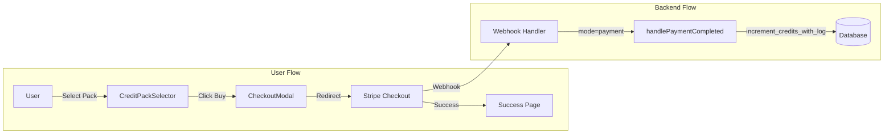
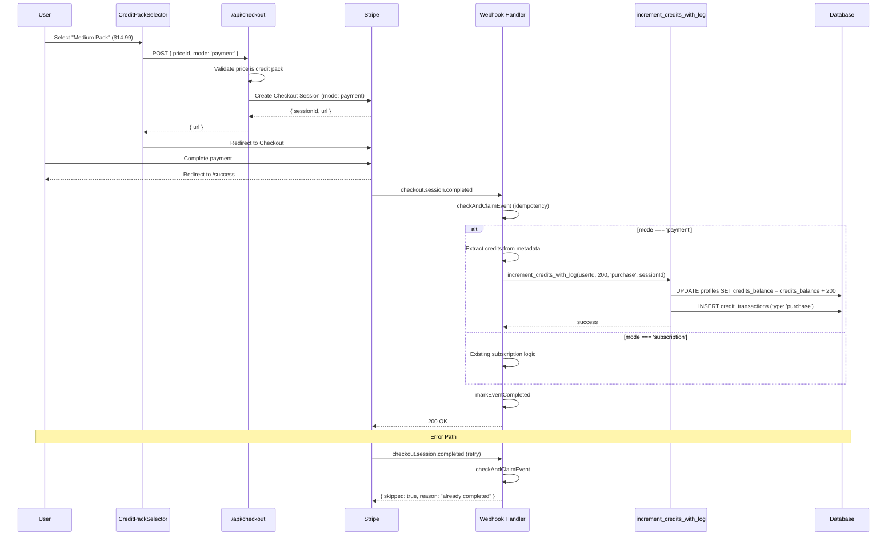

# Credit Top-Up Feature PRD

**Date:** December 2025
**Status:** Draft
**Author:** Engineering Team
**Version:** 1.0

---

## 1. Context Analysis

### 1.1 Files Analyzed

```
/home/joao/projects/pixelperfect/app/api/checkout/route.ts
/home/joao/projects/pixelperfect/app/api/webhooks/stripe/route.ts
/home/joao/projects/pixelperfect/shared/config/stripe.ts
/home/joao/projects/pixelperfect/shared/config/subscription.config.ts
/home/joao/projects/pixelperfect/shared/config/subscription.types.ts
/home/joao/projects/pixelperfect/shared/types/stripe.ts
/home/joao/projects/pixelperfect/supabase/migrations/20250121_enhanced_credit_functions.sql
/home/joao/projects/pixelperfect/client/services/stripeService.ts
/home/joao/projects/pixelperfect/client/components/stripe/CreditsDisplay.tsx
/home/joao/projects/pixelperfect/client/components/stripe/CreditHistory.tsx
/home/joao/projects/pixelperfect/docs/business-model-canvas/economics/pricing-proposal-v2.md
```

### 1.2 Component & Dependency Overview

```mermaid
graph TD
    subgraph Client
        A[CreditPackSelector] --> B[CheckoutModal]
        B --> C[stripeService.purchaseCredits]
    end

    subgraph API
        C --> D[/api/checkout]
        E[Stripe Webhook] --> F[/api/webhooks/stripe]
    end

    subgraph Server
        D --> G[Stripe Checkout Session]
        F --> H[handleCheckoutSessionCompleted]
        H --> I[increment_credits_with_log RPC]
    end

    subgraph Database
        I --> J[(profiles.credits_balance)]
        I --> K[(credit_transactions)]
    end

    G -.-> E
```

### 1.3 Current Behavior Summary

- **Checkout API** (`/api/checkout`) currently **only supports subscriptions**:
  - Validates that `priceId` is a known subscription price
  - Rejects one-time payments with `INVALID_PRICE` error
  - Sets `mode: 'subscription'` explicitly
- **Webhook handler** ignores `session.mode === 'payment'`:
  - Line 339-344: "One-time payments are no longer supported - ignore these sessions"
- **Credit system** is fully functional:
  - `increment_credits_with_log` RPC works for any transaction type including `'purchase'`
  - `credit_transactions` table already supports `type: 'purchase'`
- **UI components** exist for credit display and history but no package selector

### 1.4 Problem Statement

Users who run out of monthly subscription credits cannot purchase additional credits on-demand, forcing them to either wait for the next billing cycle or upgrade to a higher tier unnecessarily.

---

## 2. Proposed Solution

### 2.1 Architecture Summary

1. **Enable one-time payments** in `/api/checkout` alongside subscriptions
2. **Define credit packages** in `subscription.config.ts` as a new `creditPacks` section
3. **Handle `checkout.session.completed`** for `mode: 'payment'` to add purchased credits
4. **Create `CreditPackSelector`** component for package selection UI
5. **Purchased credits never expire** (unlike subscription credits that reset at cycle end)

**Alternatives Considered:**

- ❌ **Separate `/api/purchase-credits` endpoint**: Rejected - duplicates Stripe customer management logic
- ❌ **Use Stripe Payment Links**: Rejected - cannot embed in-app, loses checkout customization
- ❌ **Usage-based billing via Stripe Billing**: Rejected - over-engineered for simple top-ups

### 2.2 Architecture Diagram



### 2.3 Key Technical Decisions

| Decision         | Choice                                           | Justification                                         |
| ---------------- | ------------------------------------------------ | ----------------------------------------------------- |
| Payment mode     | Stripe Checkout (one_time)                       | Reuses existing Stripe integration                    |
| Credit storage   | Same `credits_balance` field                     | Simplicity - no separate "purchased credits" tracking |
| Expiration       | Never expire                                     | Industry standard - purchased credits are permanent   |
| Transaction type | `'purchase'`                                     | Already supported in `credit_transactions.type` enum  |
| Refund handling  | Clawback via `clawback_credits_from_transaction` | Already implemented for subscription refunds          |

### 2.4 Data Model Changes

**No schema changes required.** All tables and RPC functions already support credit purchases:

- `credit_transactions.type` includes `'purchase'`
- `increment_credits_with_log` accepts any `transaction_type`
- `clawback_credits_from_transaction` works with any `ref_id`

**Configuration change only:**

```typescript
// Addition to subscription.config.ts
creditPacks: [
  {
    key: 'small',
    name: 'Small Pack',
    credits: 50,
    priceInCents: 499,    // $4.99
    stripePriceId: 'price_xxx', // One-time Stripe price
    description: '50 credits',
    popular: false,
  },
  {
    key: 'medium',
    name: 'Medium Pack',
    credits: 200,
    priceInCents: 1499,   // $14.99
    stripePriceId: 'price_xxx',
    description: '200 credits - Best value',
    popular: true,
  },
  {
    key: 'large',
    name: 'Large Pack',
    credits: 600,
    priceInCents: 3999,   // $39.99
    stripePriceId: 'price_xxx',
    description: '600 credits',
    popular: false,
  },
],
```

---

## 2.5 Runtime Execution Flow



---

## 3. Detailed Implementation Spec

### A. `/shared/config/subscription.config.ts`

**Changes Needed:**

- Add `creditPacks` array to `SUBSCRIPTION_CONFIG`

**New Type (in `subscription.types.ts`):**

```typescript
export interface ICreditPack {
  key: string;
  name: string;
  credits: number;
  priceInCents: number;
  currency: string;
  stripePriceId: string;
  description: string;
  popular?: boolean;
  enabled: boolean;
}

// Add to ISubscriptionConfig
export interface ISubscriptionConfig {
  // ... existing fields
  creditPacks: ICreditPack[];
}
```

**New Config:**

```typescript
creditPacks: [
  {
    key: 'small',
    name: 'Small Pack',
    credits: 50,
    priceInCents: 499,
    currency: 'usd',
    stripePriceId: process.env.NEXT_PUBLIC_STRIPE_PRICE_CREDITS_SMALL || 'price_credits_small',
    description: '50 credits',
    popular: false,
    enabled: true,
  },
  {
    key: 'medium',
    name: 'Medium Pack',
    credits: 200,
    priceInCents: 1499,
    currency: 'usd',
    stripePriceId: process.env.NEXT_PUBLIC_STRIPE_PRICE_CREDITS_MEDIUM || 'price_credits_medium',
    description: '200 credits',
    popular: true,
    enabled: true,
  },
  {
    key: 'large',
    name: 'Large Pack',
    credits: 600,
    priceInCents: 3999,
    currency: 'usd',
    stripePriceId: process.env.NEXT_PUBLIC_STRIPE_PRICE_CREDITS_LARGE || 'price_credits_large',
    description: '600 credits',
    popular: false,
    enabled: true,
  },
],
```

**Justification:** Centralizes all pricing in one config file, consistent with subscription plan structure.

---

### B. `/shared/config/subscription.utils.ts`

**New Methods:**

```typescript
/**
 * Get credit pack by Stripe price ID
 */
export function getCreditPackByPriceId(priceId: string): ICreditPack | null {
  return (
    getSubscriptionConfig().creditPacks.find(
      pack => pack.stripePriceId === priceId && pack.enabled
    ) || null
  );
}

/**
 * Get credit pack by key
 */
export function getCreditPackByKey(key: string): ICreditPack | null {
  return getSubscriptionConfig().creditPacks.find(pack => pack.key === key && pack.enabled) || null;
}

/**
 * Get all enabled credit packs
 */
export function getEnabledCreditPacks(): ICreditPack[] {
  return getSubscriptionConfig().creditPacks.filter(pack => pack.enabled);
}

/**
 * Check if a price ID is a credit pack (one-time) or subscription
 */
export function isPriceIdCreditPack(priceId: string): boolean {
  return getCreditPackByPriceId(priceId) !== null;
}
```

**Justification:** Provides type-safe lookup functions consistent with existing subscription utilities.

---

### C. `/app/api/checkout/route.ts`

**Changes Needed:**

- Accept both subscription and one-time payment modes
- Validate credit pack prices separately from subscription prices
- Include `credits` in session metadata for webhook

**Modified Logic (pseudo-code):**

```typescript
// After basic validation...

// Determine if this is a credit pack or subscription
const creditPack = getCreditPackByPriceId(priceId);
const subscriptionPlan = getPlanForPriceId(priceId);

if (!creditPack && !subscriptionPlan) {
  return NextResponse.json(
    {
      success: false,
      error: {
        code: 'INVALID_PRICE',
        message: 'Invalid price ID. Must be a subscription plan or credit pack.',
      },
    },
    { status: 400 }
  );
}

// For subscriptions, check existing subscription (existing logic)
if (subscriptionPlan && existingSubscription) {
  return NextResponse.json(
    {
      success: false,
      error: {
        code: 'ALREADY_SUBSCRIBED',
        message: 'You already have an active subscription...',
      },
    },
    { status: 400 }
  );
}

// Determine checkout mode
const checkoutMode = creditPack ? 'payment' : 'subscription';

// Build session params
const sessionParams: Stripe.Checkout.SessionCreateParams = {
  customer: customerId,
  line_items: [{ price: priceId, quantity: 1 }],
  mode: checkoutMode,
  ui_mode: uiMode,
  metadata: {
    user_id: user.id,
    ...(creditPack
      ? {
          credits: creditPack.credits.toString(),
          pack_key: creditPack.key,
          type: 'credit_purchase',
        }
      : {
          plan_key: subscriptionPlan!.key,
          type: 'subscription',
        }),
    ...metadata,
  },
};

// Only add subscription_data for subscriptions
if (checkoutMode === 'subscription') {
  sessionParams.subscription_data = {
    metadata: { user_id: user.id, plan_key: subscriptionPlan!.key },
  };

  // Add trial if configured (existing logic)
  const trialConfig = getTrialConfig(priceId);
  if (trialConfig?.enabled) {
    sessionParams.subscription_data.trial_period_days = trialConfig.durationDays;
  }
}

// URLs based on mode
if (uiMode === 'hosted') {
  sessionParams.success_url = successUrl || `${baseUrl}/success?session_id={CHECKOUT_SESSION_ID}`;
  sessionParams.cancel_url = cancelUrl || `${baseUrl}/canceled`;
} else {
  sessionParams.return_url = successUrl || `${baseUrl}/success?session_id={CHECKOUT_SESSION_ID}`;
}
```

**Justification:** Minimal changes to existing flow - branches based on price type while reusing all Stripe customer management logic.

---

### D. `/app/api/webhooks/stripe/route.ts`

**Changes Needed:**

- Handle `mode === 'payment'` in `handleCheckoutSessionCompleted`
- Add credits from session metadata

**Modified `handleCheckoutSessionCompleted`:**

```typescript
async function handleCheckoutSessionCompleted(session: Stripe.Checkout.Session) {
  const userId = session.metadata?.user_id;
  if (!userId) {
    console.error('No user_id in session metadata');
    return;
  }

  console.log(`Checkout completed for user ${userId}, mode: ${session.mode}`);

  if (session.mode === 'subscription') {
    // Existing subscription logic (unchanged)
    // ...
  } else if (session.mode === 'payment') {
    // NEW: Handle credit pack purchase
    await handleCreditPackPurchase(session, userId);
  } else {
    console.warn(`Unexpected checkout mode: ${session.mode}`);
  }
}

/**
 * Handle one-time credit pack purchase
 */
async function handleCreditPackPurchase(
  session: Stripe.Checkout.Session,
  userId: string
): Promise<void> {
  const credits = parseInt(session.metadata?.credits || '0', 10);
  const packKey = session.metadata?.pack_key;

  if (!credits || credits <= 0) {
    console.error(`Invalid credits in session metadata: ${session.metadata?.credits}`);
    return;
  }

  // Get payment intent for refund correlation
  const paymentIntentId = session.payment_intent as string;

  try {
    const { error } = await supabaseAdmin.rpc('increment_credits_with_log', {
      target_user_id: userId,
      amount: credits,
      transaction_type: 'purchase',
      ref_id: paymentIntentId ? `pi_${paymentIntentId}` : `session_${session.id}`,
      description: `Credit pack purchase - ${packKey || 'unknown'} - ${credits} credits`,
    });

    if (error) {
      console.error('Error adding purchased credits:', error);
      throw error; // Trigger webhook retry
    }

    console.log(`Added ${credits} purchased credits to user ${userId} (pack: ${packKey})`);
  } catch (error) {
    console.error('Failed to process credit purchase:', error);
    throw error; // Re-throw for webhook retry
  }
}
```

**Justification:** Clean separation between subscription and payment handling. Uses existing RPC function with `'purchase'` type.

---

### E. `/client/services/stripeService.ts`

**New Method:**

```typescript
/**
 * Create checkout session for credit pack purchase
 */
static async purchaseCredits(
  packKey: string,
  options?: { uiMode?: 'hosted' | 'embedded' }
): Promise<{ url: string; sessionId: string; clientSecret?: string }> {
  const pack = getCreditPackByKey(packKey);
  if (!pack) {
    throw new Error(`Invalid credit pack: ${packKey}`);
  }

  const token = await this.getAuthToken();
  const response = await fetch('/api/checkout', {
    method: 'POST',
    headers: {
      'Content-Type': 'application/json',
      Authorization: `Bearer ${token}`,
    },
    body: JSON.stringify({
      priceId: pack.stripePriceId,
      uiMode: options?.uiMode || 'hosted',
    }),
  });

  const result = await response.json();
  if (!result.success) {
    throw new Error(result.error?.message || 'Failed to create checkout session');
  }

  return result.data;
}
```

**Justification:** Mirrors existing `createCheckoutSession` but specialized for credit packs.

---

### F. `/client/components/stripe/CreditPackSelector.tsx`

**New Component:**

```typescript
'use client';

import React, { useState } from 'react';
import { getEnabledCreditPacks, type ICreditPack } from '@shared/config/subscription.utils';
import { stripeService } from '@client/services/stripeService';
import { Button } from '@client/components/ui/button';
import { Card, CardContent, CardHeader, CardTitle } from '@client/components/ui/card';
import { Badge } from '@client/components/ui/badge';
import { Loader2, CreditCard, Check } from 'lucide-react';

interface ICreditPackSelectorProps {
  onPurchaseStart?: () => void;
  onPurchaseComplete?: () => void;
  onError?: (error: Error) => void;
}

export function CreditPackSelector({
  onPurchaseStart,
  onPurchaseComplete,
  onError,
}: ICreditPackSelectorProps) {
  const [selectedPack, setSelectedPack] = useState<string | null>(null);
  const [isLoading, setIsLoading] = useState(false);

  const packs = getEnabledCreditPacks();

  const handlePurchase = async (packKey: string) => {
    setIsLoading(true);
    setSelectedPack(packKey);
    onPurchaseStart?.();

    try {
      const { url } = await stripeService.purchaseCredits(packKey);
      window.location.href = url;
    } catch (error) {
      console.error('Purchase error:', error);
      onError?.(error instanceof Error ? error : new Error('Purchase failed'));
      setIsLoading(false);
      setSelectedPack(null);
    }
  };

  const formatPrice = (cents: number) => {
    return new Intl.NumberFormat('en-US', {
      style: 'currency',
      currency: 'USD',
    }).format(cents / 100);
  };

  const getPricePerCredit = (pack: ICreditPack) => {
    return (pack.priceInCents / pack.credits / 100).toFixed(3);
  };

  return (
    <div className="grid gap-4 md:grid-cols-3">
      {packs.map((pack) => (
        <Card
          key={pack.key}
          className={`relative cursor-pointer transition-all hover:border-primary ${
            selectedPack === pack.key ? 'border-primary ring-2 ring-primary' : ''
          } ${pack.popular ? 'border-primary' : ''}`}
          onClick={() => !isLoading && handlePurchase(pack.key)}
        >
          {pack.popular && (
            <Badge className="absolute -top-2 left-1/2 -translate-x-1/2">
              Best Value
            </Badge>
          )}

          <CardHeader className="text-center pb-2">
            <CardTitle className="text-lg">{pack.name}</CardTitle>
            <div className="text-3xl font-bold">{formatPrice(pack.priceInCents)}</div>
          </CardHeader>

          <CardContent className="text-center space-y-4">
            <div className="text-2xl font-semibold text-primary">
              {pack.credits} credits
            </div>

            <div className="text-sm text-muted-foreground">
              ${getPricePerCredit(pack)} per credit
            </div>

            <ul className="text-sm text-left space-y-1">
              <li className="flex items-center gap-2">
                <Check className="h-4 w-4 text-green-500" />
                Never expire
              </li>
              <li className="flex items-center gap-2">
                <Check className="h-4 w-4 text-green-500" />
                Use anytime
              </li>
              <li className="flex items-center gap-2">
                <Check className="h-4 w-4 text-green-500" />
                Stack with subscription
              </li>
            </ul>

            <Button
              className="w-full"
              disabled={isLoading}
              variant={pack.popular ? 'default' : 'outline'}
            >
              {isLoading && selectedPack === pack.key ? (
                <>
                  <Loader2 className="mr-2 h-4 w-4 animate-spin" />
                  Processing...
                </>
              ) : (
                <>
                  <CreditCard className="mr-2 h-4 w-4" />
                  Buy Now
                </>
              )}
            </Button>
          </CardContent>
        </Card>
      ))}
    </div>
  );
}
```

**Justification:** Follows existing component patterns. Cards show value proposition (never expire, stack with subscription).

---

## 4. Step-by-Step Execution Plan

### Phase 1: Configuration & Types

- [ ] Add `ICreditPack` interface to `subscription.types.ts`
- [ ] Add `creditPacks` array to `SUBSCRIPTION_CONFIG` in `subscription.config.ts`
- [ ] Add utility functions to `subscription.utils.ts`:
  - `getCreditPackByPriceId()`
  - `getCreditPackByKey()`
  - `getEnabledCreditPacks()`
  - `isPriceIdCreditPack()`
- [ ] Create Stripe one-time prices in Stripe Dashboard
- [ ] Add price IDs to environment variables

### Phase 2: API Layer

- [ ] Modify `/api/checkout/route.ts`:
  - Import credit pack utilities
  - Add validation for credit pack prices
  - Branch checkout mode based on price type
  - Include credits in metadata for payment mode
- [ ] Modify `/api/webhooks/stripe/route.ts`:
  - Add `handleCreditPackPurchase()` function
  - Update `handleCheckoutSessionCompleted()` to handle `mode === 'payment'`

### Phase 3: Client Layer

- [ ] Add `purchaseCredits()` method to `stripeService.ts`
- [ ] Create `CreditPackSelector` component
- [ ] Add credit pack section to pricing page or dashboard
- [ ] Update `CreditsDisplay` to show purchase option when low

### Phase 4: Testing & Validation

- [ ] Write unit tests for new utility functions
- [ ] Write integration tests for checkout flow
- [ ] Test webhook handling with Stripe CLI
- [ ] Test refund flow triggers credit clawback

---

## 5. Testing Strategy

### Unit Tests

| Function                   | Test Cases                                            |
| -------------------------- | ----------------------------------------------------- |
| `getCreditPackByPriceId`   | Valid price returns pack, invalid returns null        |
| `getCreditPackByKey`       | Valid key returns pack, invalid returns null          |
| `isPriceIdCreditPack`      | Returns true for pack prices, false for subscriptions |
| `handleCreditPackPurchase` | Adds correct credits, handles missing metadata        |

### Integration Tests

| Flow                | Steps                                                                  |
| ------------------- | ---------------------------------------------------------------------- |
| Purchase credits    | Select pack → Create session → Complete payment → Verify credits added |
| Refund credits      | Complete purchase → Issue refund → Verify credits clawed back          |
| Webhook idempotency | Send duplicate webhooks → Verify single credit addition                |

### Edge Cases

| Scenario                            | Expected Behavior                     |
| ----------------------------------- | ------------------------------------- |
| Invalid pack key in request         | Return 400 with `INVALID_PRICE` error |
| Missing credits in webhook metadata | Log error, return 200 (don't retry)   |
| User not found in webhook           | Log error, return 200 (don't retry)   |
| Concurrent purchase attempts        | Both succeed (no restriction)         |
| Purchase during subscription trial  | Both credits types coexist            |
| Refund partial amount               | Clawback all credits from transaction |

---

## 6. Acceptance Criteria

- [ ] User can purchase credits without active subscription
- [ ] User with subscription can purchase additional credits
- [ ] Credits added within 30 seconds of payment completion
- [ ] Transaction appears in credit history with type `'purchase'`
- [ ] Purchased credits never expire (no rollover cap applied)
- [ ] Refund triggers full credit clawback
- [ ] Duplicate webhooks do not double-credit
- [ ] All API responses follow existing `{ success, data, error }` format
- [ ] UI shows "Best Value" badge on popular pack
- [ ] Price per credit calculated and displayed
- [ ] Loading state shown during checkout redirect

---

## 7. Verification & Rollback

### Success Criteria

- **Metrics**: Track `credit_transactions` with `type = 'purchase'`
- **Logs**: Monitor for `Added X purchased credits to user` messages
- **Monitoring**: Alert if webhook processing takes >5s

### Rollback Plan

1. **Feature flag approach**: Add `FEATURE_CREDIT_PACKS=false` env var
2. **Checkout API**: Check flag before allowing one-time payments
3. **UI**: Hide `CreditPackSelector` when flag is false
4. **No migration needed**: Uses existing tables and RPCs

```typescript
// Quick disable in /api/checkout
if (!serverEnv.FEATURE_CREDIT_PACKS && creditPack) {
  return NextResponse.json(
    {
      success: false,
      error: { code: 'FEATURE_DISABLED', message: 'Credit packs temporarily unavailable' },
    },
    { status: 400 }
  );
}
```

---

## 8. Cost Analysis

### Pricing (from Business Model Canvas)

| Pack   | Price  | Credits | $/Credit | Margin |
| ------ | ------ | ------- | -------- | ------ |
| Small  | $4.99  | 50      | $0.10    | ~95%   |
| Medium | $14.99 | 200     | $0.075   | ~96%   |
| Large  | $39.99 | 600     | $0.067   | ~97%   |

### Unit Economics

- **Real-ESRGAN cost**: $0.0017/image
- **Revenue per credit**: $0.067-$0.10
- **Gross margin**: 93-97%
- **Stripe fees**: 2.9% + $0.30 per transaction

### Break-even per Transaction

| Pack   | Price  | Stripe Fee | Net    | Credits | Cost   | Profit |
| ------ | ------ | ---------- | ------ | ------- | ------ | ------ |
| Small  | $4.99  | $0.44      | $4.55  | 50      | $0.085 | $4.47  |
| Medium | $14.99 | $0.73      | $14.26 | 200     | $0.34  | $13.92 |
| Large  | $39.99 | $1.46      | $38.53 | 600     | $1.02  | $37.51 |

---

## References

- [Pricing Proposal v2](/docs/business-model-canvas/economics/pricing-proposal-v2.md)
- [Credits System Documentation](/docs/technical/systems/credits.md)
- [Billing System Documentation](/docs/technical/systems/billing.md)
- [Stripe Checkout API](https://stripe.com/docs/api/checkout/sessions/create)
