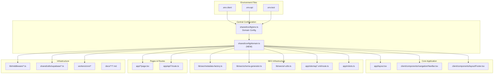
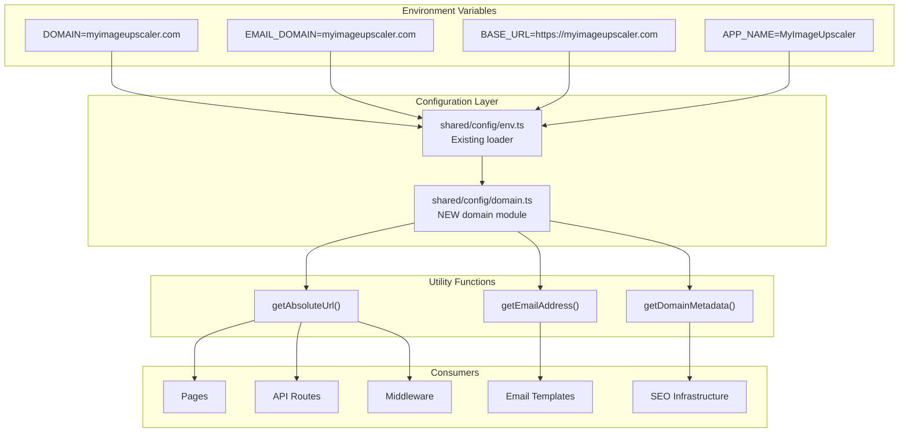
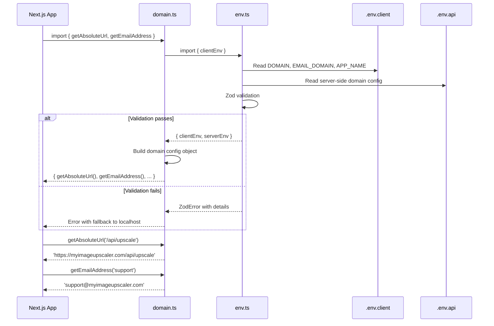

# Domain Configuration Centralization & Rebranding PRD

## 1. Context Analysis

### 1.1 Files Analyzed

| Category                   | Path                                              | Purpose                                                  |
| -------------------------- | ------------------------------------------------- | -------------------------------------------------------- |
| **Environment Config**     | `/shared/config/env.ts`                           | Centralized environment variables with hardcoded domains |
| **Environment Examples**   | `/.env.client.example`                            | Client variables template with pixelperfect.com emails   |
| **Environment Examples**   | `/.env.api.example`                               | Server variables template                                |
| **Environment Examples**   | `/.env.test.example`                              | Test environment with pixelperfect domains               |
| **GitHub Actions**         | `/.github/workflows/deploy.yml`                   | Uses APP_NAME for deployment                             |
| **App Branding**           | `/client/components/navigation/NavBar.tsx`        | Uses APP_NAME environment variable                       |
| **SEO Infrastructure**     | `/lib/seo/metadata-factory.ts`                    | Generates metadata with hardcoded domains                |
| **SEO Infrastructure**     | `/lib/seo/schema-generator.ts`                    | Schema markup with domain references                     |
| **URL Utilities**          | `/lib/seo/url-utils.ts`                           | URL construction utilities                               |
| **Sitemap Routes**         | `/app/sitemap*.xml/route.ts`                      | Multiple sitemap generators                              |
| **Robots.txt**             | `/app/robots.ts`                                  | Search engine crawling rules                             |
| **Footer Component**       | `/client/components/layout/Footer.tsx`            | Links and references to pixelperfect                     |
| **Success/Canceled Pages** | `/app/success/page.tsx`, `/app/canceled/page.tsx` | Post-payment pages with domains                          |
| **Pricing Page**           | `/app/pricing/page.tsx`                           | Pricing page with domain references                      |
| **Help Page**              | `/app/help/page.tsx`                              | Support documentation with domains                       |
| **PSEO Tool Pages**        | `/app/(pseo)/tools/*/page.tsx`                    | SEO landing pages with hardcoded domains                 |
| **API Client**             | `/client/utils/api-client.ts`                     | API communication with BASE_URL                          |
| **Download Utils**         | `/client/utils/download.ts`                       | File download functionality                              |
| **Middleware**             | `/lib/middleware/*.ts`                            | Auth, rate limiting, security headers                    |
| **Supabase Configs**       | `/shared/utils/supabase/*.ts`                     | Database client configurations                           |
| **Worker Scripts**         | `/workers/cron/*`                                 | Cloudflare Worker scripts                                |
| **Test Files**             | `/tests/*`                                        | Various test configurations                              |
| **Documentation**          | `/docs/**/*.md`                                   | Technical documentation with domain references           |

### 1.2 Component & Dependency Overview



### 1.3 Current Behavior Summary

- **Hardcoded Domain References**: 122 files contain "pixelperfect" references
- **Email Configuration**: 4 email addresses hardcoded as `*@pixelperfect.com` or `*@pixelperfect.app`
- **Domain URLs**: 6 files contain explicit pixelperfect.com URLs
- **APP_NAME Usage**: Centralized in env.ts but defaults to "PixelPerfect"
- **BASE_URL Configuration**: Used for API endpoints and absolute URL generation
- **SEO Metadata**: Hardcoded domain references in metadata factory and schema generator
- **Environment Split**: Already using `.env.client` and `.env.api` structure

### 1.4 Problem Statement

**Domain references are scattered throughout the codebase with hardcoded "pixelperfect" references, making rebranding to "myimageupscaler.com" error-prone and requiring updates across 122+ files.**

---

## 2. Proposed Solution

### 2.1 Architecture Summary

- **Centralized Domain Configuration**: Create a new `shared/config/domain.ts` module to centralize all domain-related configuration
- **Environment-Driven Domains**: Use environment variables to configure domains for different environments (dev, staging, prod)
- **Backward Compatibility**: Maintain existing environment variable patterns
- **Email Domain Separation**: Configure email domains separately from web domains for flexibility
- **URL Generation Utilities**: Provide helper functions for consistent URL generation

### 2.2 Architecture Diagram



### 2.3 Key Technical Decisions

| Decision                              | Rationale                                                            |
| ------------------------------------- | -------------------------------------------------------------------- |
| Create `shared/config/domain.ts`      | Single source of truth for all domain configuration                  |
| Use environment variables for domains | Support different domains per environment (dev/staging/prod)         |
| Separate email domain configuration   | Flexibility to use different email providers (e.g., .app for emails) |
| Provide utility functions             | Ensure consistent URL generation across the app                      |
| Update environment variable names     | Clear naming: `DOMAIN`, `EMAIL_DOMAIN`, `APP_NAME`                   |
| Maintain backward compatibility       | Gradual migration with fallback support                              |

### 2.4 Data Model Changes

**No database changes required.** Only environment variable configuration and utility functions.

---

## 2.5 Runtime Execution Flow



---

## 3. Detailed Implementation Spec

### A. `/shared/config/domain.ts` (NEW FILE)

**Purpose:** Centralize all domain configuration and provide utility functions.

```typescript
import { z } from 'zod';
import { clientEnv, serverEnv } from './env';

// Domain configuration schema
const domainConfigSchema = z.object({
  domain: z.string().min(1),
  emailDomain: z.string().min(1),
  appName: z.string().min(1),
  baseUrl: z.string().url(),
  protocol: z.enum(['http', 'https']).default('https'),
});

export type IDomainConfig = z.infer<typeof domainConfigSchema>;

/**
 * Domain configuration for the current environment
 */
function loadDomainConfig(): IDomainConfig {
  const config = {
    // Use environment variable or fallback to client config
    domain:
      serverEnv.NEXT_PUBLIC_DOMAIN ||
      clientEnv.BASE_URL?.replace(/^https?:\/\//, '') ||
      'localhost:3000',
    emailDomain:
      serverEnv.NEXT_PUBLIC_EMAIL_DOMAIN ||
      serverEnv.NEXT_PUBLIC_DOMAIN ||
      clientEnv.BASE_URL?.replace(/^https?:\/\//, '') ||
      'localhost:3000',
    appName: clientEnv.APP_NAME || 'MyImageUpscaler',
    baseUrl: clientEnv.BASE_URL || 'http://localhost:3000',
    protocol: clientEnv.BASE_URL?.startsWith('https:') ? 'https' : 'http',
  };

  return domainConfigSchema.parse(config);
}

export const domainConfig = loadDomainConfig();

/**
 * Get absolute URL for a given path
 */
export function getAbsoluteUrl(path: string = '/', includeTrailingSlash: boolean = false): string {
  const cleanPath = path.startsWith('/') ? path : `/${path}`;
  const baseUrl = domainConfig.baseUrl.endsWith('/')
    ? domainConfig.baseUrl.slice(0, -1)
    : domainConfig.baseUrl;
  const finalPath = includeTrailingSlash && !cleanPath.endsWith('/') ? `${cleanPath}/` : cleanPath;

  return `${baseUrl}${finalPath}`;
}

/**
 * Get email address for a given type
 */
export function getEmailAddress(type: 'admin' | 'support' | 'privacy' | 'legal'): string {
  const domain = domainConfig.emailDomain;
  const prefix = type === 'admin' ? 'admin' : type;
  return `${prefix}@${domain}`;
}

/**
 * Get domain metadata for SEO
 */
export function getDomainMetadata(): {
  domain: string;
  baseUrl: string;
  appName: string;
  siteName: string;
  titleSeparator: string;
} {
  return {
    domain: domainConfig.domain,
    baseUrl: domainConfig.baseUrl,
    appName: domainConfig.appName,
    siteName: domainConfig.appName,
    titleSeparator: '|',
  };
}

/**
 * Check if current environment is production
 */
export function isProductionDomain(): boolean {
  return (
    domainConfig.domain !== 'localhost:3000' &&
    !domainConfig.domain.includes('staging') &&
    !domainConfig.domain.includes('dev')
  );
}

/**
 * Get social media URLs
 */
export function getSocialUrls(): Record<string, string> {
  const baseUrl = domainConfig.baseUrl;
  return {
    twitter: 'https://twitter.com/myimageupscaler', // Update as needed
    github: 'https://github.com/myimageupscaler', // Update as needed
    website: baseUrl,
  };
}
```

**Justification:** Centralizes all domain logic, provides type-safe utilities, and handles environment differences gracefully.

---

### B. `/shared/config/env.ts` (UPDATE)

**Changes Needed:**

- Add new environment variables to schema
- Update client environment schema

**New schema additions:**

```typescript
const clientEnvSchema = z.object({
  // ... existing fields ...

  // Domain configuration (NEW)
  NEXT_PUBLIC_DOMAIN: z.string().optional(), // e.g., "myimageupscaler.com"
  NEXT_PUBLIC_EMAIL_DOMAIN: z.string().optional(), // e.g., "myimageupscaler.com"

  // ... rest unchanged ...
});

function loadClientEnv(): IClientEnv {
  const env = {
    // ... existing fields ...

    // Domain configuration (NEW)
    NEXT_PUBLIC_DOMAIN: process.env.NEXT_PUBLIC_DOMAIN,
    NEXT_PUBLIC_EMAIL_DOMAIN: process.env.NEXT_PUBLIC_EMAIL_DOMAIN,

    // ... rest unchanged ...
  };

  return clientEnvSchema.parse(env);
}
```

**Justification:** Adds support for domain configuration through environment variables.

---

### C. Environment Example Files (UPDATE)

#### C.1 `/.env.client.example`

**Add new variables:**

```bash
# App config (updated)
NEXT_PUBLIC_APP_NAME=MyImageUpscaler
NEXT_PUBLIC_BASE_URL=https://myimageupscaler.com

# Domain configuration (NEW)
NEXT_PUBLIC_DOMAIN=myimageupscaler.com
NEXT_PUBLIC_EMAIL_DOMAIN=myimageupscaler.com

# Contact emails (updated)
NEXT_PUBLIC_ADMIN_EMAIL=admin@myimageupscaler.com
NEXT_PUBLIC_SUPPORT_EMAIL=support@myimageupscaler.com
NEXT_PUBLIC_PRIVACY_EMAIL=privacy@myimageupscaler.com
NEXT_PUBLIC_LEGAL_EMAIL=legal@myimageupscaler.com
```

#### C.2 `/.env.api.example`

**Add domain configuration:**

```bash
# Environment mode
ENV=production

# Domain configuration (NEW)
NEXT_PUBLIC_DOMAIN=myimageupscaler.com
NEXT_PUBLIC_EMAIL_DOMAIN=myimageupscaler.com

# ... rest unchanged ...
```

#### C.3 `/.env.test.example`

**Update for testing:**

```bash
# App config (updated)
NEXT_PUBLIC_APP_NAME=MyImageUpscaler Test
NEXT_PUBLIC_BASE_URL=http://localhost:3000

# Domain configuration (NEW)
NEXT_PUBLIC_DOMAIN=localhost:3000
NEXT_PUBLIC_EMAIL_DOMAIN=testing.myimageupscaler.com

# Contact emails (updated)
NEXT_PUBLIC_ADMIN_EMAIL=admin@test.myimageupscaler.com
NEXT_PUBLIC_SUPPORT_EMAIL=support@test.myimageupscaler.com
```

---

### D. SEO Infrastructure Updates

#### D.1 `/lib/seo/metadata-factory.ts`

**Replace hardcoded domains with domain config:**

```typescript
import { getDomainMetadata, getAbsoluteUrl } from '@shared/config/domain';

// Update functions to use centralized config
export function createBaseMetadata(path: string = '/') {
  const { appName, baseUrl } = getDomainMetadata();

  return {
    title: appName,
    description: `Professional AI-powered image upscaling tool`,
    url: getAbsoluteUrl(path),
    siteName: appName,
    images: [
      {
        url: getAbsoluteUrl('/og-image.jpg'),
        width: 1200,
        height: 630,
        alt: `${appName} - AI Image Upscaler`,
      },
    ],
    // ... rest of metadata
  };
}
```

#### D.2 `/lib/seo/schema-generator.ts`

**Update schema generation:**

```typescript
import { getDomainMetadata, getAbsoluteUrl } from '@shared/config/domain';

export function generateOrganizationSchema() {
  const { appName, baseUrl } = getDomainMetadata();

  return {
    '@context': 'https://schema.org',
    '@type': 'Organization',
    name: appName,
    url: baseUrl,
    logo: getAbsoluteUrl('/logo.png'),
    // ... rest of schema
  };
}
```

---

### E. Core Application Updates

#### E.1 `/app/layout.tsx`

**Update root layout:**

```typescript
import { getDomainMetadata } from '@shared/config/domain';

export const metadata: Metadata = {
  title: {
    default: getDomainMetadata().appName,
    template: `%s ${getDomainMetadata().titleSeparator} ${getDomainMetadata().appName}`,
  },
  // ... rest using domain config
};
```

#### E.2 `/client/components/layout/Footer.tsx`

**Update footer links:**

```typescript
import { getEmailAddress, getAbsoluteUrl, getDomainMetadata } from '@shared/config/domain';

// In component:
const supportEmail = getEmailAddress('support');
const privacyUrl = getAbsoluteUrl('/privacy');
const { appName } = getDomainMetadata();
```

#### E.3 `/client/components/navigation/NavBar.tsx`

**Update branding:**

```typescript
import { getDomainMetadata } from '@shared/config/domain';

// In component:
const { appName } = getDomainMetadata();
```

---

### F. Page Updates

#### F.1 `/app/success/page.tsx` & `/app/canceled/page.tsx`

**Update payment pages:**

```typescript
import { getAbsoluteUrl, getEmailAddress } from '@shared/config/domain';

// Replace hardcoded URLs and emails
const homeUrl = getAbsoluteUrl();
const supportEmail = getEmailAddress('support');
```

#### F.2 `/app/pricing/page.tsx`

**Update pricing page:**

```typescript
import { getDomainMetadata } from '@shared/config/domain';

// Use centralized domain info
const { appName } = getDomainMetadata();
```

---

### G. Infrastructure Updates

#### G.1 Middleware Files

**Update all middleware files to use domain config:**

```typescript
import { getAbsoluteUrl, isProductionDomain } from '@shared/config/domain';

// Replace hardcoded URLs and domain checks
```

#### G.2 Supabase Configuration

**Update Supabase client configs:**

```typescript
import { getAbsoluteUrl } from '@shared/config/domain';

// Use for redirect URLs and auth callbacks
```

---

## 4. Step-by-Step Execution Plan

### Phase 1: Core Domain Configuration

- [ ] Create `/shared/config/domain.ts` with centralized domain utilities
- [ ] Update `/shared/config/env.ts` to add new domain environment variables
- [ ] Update all `.env.*.example` files with new domain variables
- [ ] Add domain configuration to environment setup scripts

### Phase 2: SEO Infrastructure Migration

- [ ] Update `/lib/seo/metadata-factory.ts` to use domain config
- [ ] Update `/lib/seo/schema-generator.ts` to use domain config
- [ ] Update `/lib/seo/url-utils.ts` to use domain config
- [ ] Update all sitemap route files to use domain config
- [ ] Update `/app/robots.ts` to use domain config

### Phase 3: Core Application Updates

- [ ] Update `/app/layout.tsx` metadata
- [ ] Update `/client/components/navigation/NavBar.tsx`
- [ ] Update `/client/components/layout/Footer.tsx`
- [ ] Update `/client/utils/api-client.ts` to use domain config
- [ ] Update `/client/utils/download.ts` URLs

### Phase 4: Page Migration

- [ ] Update payment success/canceled pages
- [ ] Update pricing page
- [ ] Update help page
- [ ] Update all PSEO tool pages
- [ ] Update any other pages with hardcoded domains

### Phase 5: Infrastructure & Backend

- [ ] Update all middleware files
- [ ] Update Supabase configuration files
- [ ] Update worker scripts
- [ ] Update any remaining API routes with domain references

### Phase 6: Testing & Validation

- [ ] Update test files to use new domain config
- [ ] Run `yarn verify` to ensure all tests pass
- [ ] Test environment variable loading in all modes
- [ ] Validate URL generation across all environments

### Phase 7: Documentation & Cleanup

- [ ] Update technical documentation referencing domains
- [ ] Update deployment guides
- [ ] Remove any remaining hardcoded pixelperfect references
- [ ] Update CLAUDE.md with domain configuration standards

---

## 5. Testing Strategy

### Unit Tests

- Test `getAbsoluteUrl()` with various path inputs
- Test `getEmailAddress()` for all email types
- Test `getDomainMetadata()` returns correct configuration
- Test environment variable loading with missing/invalid values

### Integration Tests

- Test domain configuration loading in different environments
- Test URL generation in SEO metadata
- Test email address generation in templates
- Test middleware behavior with new domain config

### Environment Testing

| Environment | Domain Config               | Email Config                | Base URL                            |
| ----------- | --------------------------- | --------------------------- | ----------------------------------- |
| Development | localhost:3000              | localhost:3000              | http://localhost:3000               |
| Staging     | staging.myimageupscaler.com | staging.myimageupscaler.com | https://staging.myimageupscaler.com |
| Production  | myimageupscaler.com         | myimageupscaler.com         | https://myimageupscaler.com         |

### Edge Cases

| Scenario               | Expected Behavior                      |
| ---------------------- | -------------------------------------- |
| Missing DOMAIN env var | Fallback to BASE_URL domain extraction |
| Invalid email domain   | Use main domain as fallback            |
| Missing BASE_URL       | Default to localhost:3000              |
| Protocol mismatch      | Auto-detect from BASE_URL              |

---

## 6. Acceptance Criteria

- [ ] All hardcoded "pixelperfect" references replaced with centralized configuration
- [ ] `shared/config/domain.ts` provides all necessary domain utilities
- [ ] Environment variables properly configured for all environments
- [ ] SEO metadata uses correct domain information
- [ ] Email addresses generated correctly for all types
- [ ] URL generation works consistently across the application
- [ ] All tests pass with new domain configuration
- [ ] No hardcoded domains remain in the codebase
- [ ] Documentation updated with new domain configuration standards
- [ ] Application works correctly in development, staging, and production

---

## 7. Verification & Rollback

### Success Criteria

- `yarn verify` completes without errors
- `yarn dev` starts correctly with new domain configuration
- SEO metadata displays correct domain information
- Email addresses use correct domain in all templates
- URL generation works for all paths and environments
- No 404 errors from incorrect domain references
- Sitemaps generate with correct URLs

### Rollback Plan

1. **Immediate rollback**: Revert changes via `git checkout .`
2. **Environment rollback**: Restore previous `.env.*` files
3. **Configuration rollback**: Remove `shared/config/domain.ts` and restore hardcoded values
4. **Validation**: Run `yarn verify` to confirm rollback success

### Migration Checklist

- [ ] Backup current environment files
- [ ] Test new configuration in development first
- [ ] Verify staging environment before production
- [ ] Update DNS records if necessary
- [ ] Update external services with new domain information
- [ ] Test email delivery with new domain
- [ ] Verify SSL certificates for new domain
- [ ] Update monitoring and analytics with new domain

---

## Appendix: Environment Variable Reference

### New Variables

| Variable                   | Example               | Purpose                         |
| -------------------------- | --------------------- | ------------------------------- |
| `NEXT_PUBLIC_DOMAIN`       | `myimageupscaler.com` | Main web domain                 |
| `NEXT_PUBLIC_EMAIL_DOMAIN` | `myimageupscaler.com` | Email domain (can be different) |

### Updated Variables

| Variable                    | Old Value                  | New Value                     |
| --------------------------- | -------------------------- | ----------------------------- |
| `NEXT_PUBLIC_APP_NAME`      | `PixelPerfect`             | `MyImageUpscaler`             |
| `NEXT_PUBLIC_BASE_URL`      | `https://pixelperfect.app` | `https://myimageupscaler.com` |
| `NEXT_PUBLIC_ADMIN_EMAIL`   | `admin@pixelperfect.com`   | `admin@myimageupscaler.com`   |
| `NEXT_PUBLIC_SUPPORT_EMAIL` | `support@pixelperfect.app` | `support@myimageupscaler.com` |
| `NEXT_PUBLIC_PRIVACY_EMAIL` | `privacy@pixelperfect.app` | `privacy@myimageupscaler.com` |
| `NEXT_PUBLIC_LEGAL_EMAIL`   | `legal@pixelperfect.app`   | `legal@myimageupscaler.com`   |
