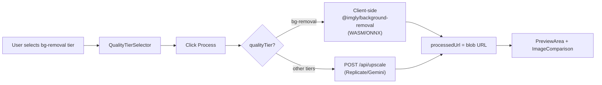
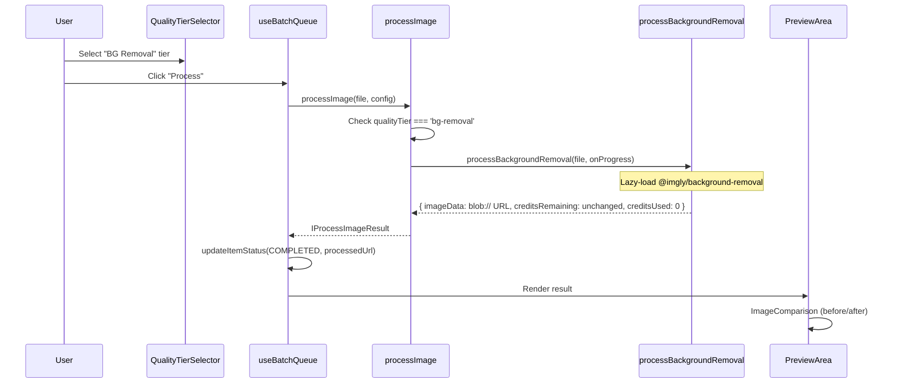

# PRD: Background Removal as Quality Tier

**Complexity: 6 → MEDIUM mode**

| Factor                                              | Score |
| --------------------------------------------------- | ----- |
| Touches 6-10 files                                  | +2    |
| Complex state logic (client-side processing branch) | +2    |
| New system (browser-based processing in core flow)  | +2    |

---

## 1. Context

**Problem:** We have a browser-based background removal tool (`@imgly/background-removal` WASM/ONNX, already in `package.json`) living only on a pSEO tool page. We want to expose it as a quality tier in the main workspace dropdown so users (including free users) can remove backgrounds from the core app flow — zero server cost, zero credit cost.

**Files Analyzed:**

- `shared/types/coreflow.types.ts` — QualityTier type, QUALITY_TIER_CONFIG, QUALITY_TIER_SCALES
- `shared/config/model-costs.config.ts` — PREMIUM_QUALITY_TIERS, FREE_QUALITY_TIERS, FREE_MODELS
- `server/services/model-registry.ts` — ModelRegistry, model configs
- `server/services/model-registry.types.ts` — ModelId, ModelCapability, IModelConfig
- `client/utils/api-client.ts` — processImage() function
- `client/hooks/useBatchQueue.ts` — processSingleItem(), processBatch()
- `client/components/features/workspace/BatchSidebar/QualityTierSelector.tsx` — dropdown UI
- `client/components/features/workspace/PreviewArea.tsx` — result display (ImageComparison)
- `app/(pseo)/_components/tools/BackgroundRemover.tsx` — existing browser-based bg removal

**Current Behavior:**

- All processing goes through `processImage()` → `POST /api/upscale` → server-side Replicate/Gemini
- No client-side AI processing exists in the core workspace flow
- Background removal only available on standalone pSEO tool page
- Free users have access to `quick` and `face-restore` tiers only
- `@imgly/background-removal` already in package.json (`^1.7.0`)

---

## 2. Solution

**Approach:**

- Add `'bg-removal'` as a new `QualityTier` in the existing tier system
- Create a client-side processing function (`processBackgroundRemoval`) that uses `@imgly/background-removal` directly in the browser
- Branch in `processImage()` to route bg-removal tier to client-side processing instead of API call
- 0 credits, 0 server cost — no API call, no auth required for processing
- Output as PNG with transparency, displayed with checkerboard pattern in preview

**Architecture:**



**Key Decisions:**

- **No new ModelId needed** — bg-removal doesn't use a server model. `modelId: null` in QUALITY_TIER_CONFIG (same pattern as `auto` tier, but for a different reason).
- **No server changes** — the API route doesn't need to know about bg-removal. All processing happens client-side.
- **Reuse existing library** — `@imgly/background-removal` already in dependencies, already proven in `BackgroundRemover.tsx`.
- **Free for all users** — added to `FREE_QUALITY_TIERS`, 0 credits. No batch limit enforcement (no server call).
- **No scale selector** — bg-removal doesn't upscale, so `QUALITY_TIER_SCALES['bg-removal'] = []` (same as enhancement-only tiers).
- **No enhancement options** — when bg-removal is selected, enhancement options (faces, text, custom instructions) are irrelevant and should be hidden.

**Data Changes:** None (no database/schema changes).

---

## 3. Sequence Flow



---

## 4. Integration Points Checklist

```
How will this feature be reached?
- [x] Entry point: QualityTierSelector dropdown in BatchSidebar
- [x] Caller: processImage() in client/utils/api-client.ts
- [x] Registration: Add 'bg-removal' to QualityTier type, QUALITY_TIER_CONFIG, QUALITY_TIER_SCALES

Is this user-facing?
- [x] YES → Dropdown option in workspace, result in PreviewArea

Full user flow:
1. User uploads image(s) to workspace
2. User opens "Quality Tier" dropdown, selects "BG Removal"
3. Scale selector hides (empty scales array)
4. Enhancement options hide (not applicable)
5. User clicks "Process"
6. Client-side WASM model loads (~15MB, cached after first use)
7. Background removed in browser, progress shown
8. Result displayed in PreviewArea with before/after comparison
9. User downloads PNG with transparent background
```

---

## 5. Execution Phases

### Phase 1: Type System & Configuration — "BG Removal appears in Quality Tier dropdown"

**Files (4):**

- `shared/types/coreflow.types.ts` — Add `'bg-removal'` to QualityTier, QUALITY_TIER_CONFIG, QUALITY_TIER_SCALES
- `shared/config/model-costs.config.ts` — Add to FREE_QUALITY_TIERS
- `client/components/features/workspace/BatchSidebar/EnhancementOptions.tsx` — Hide enhancement options when bg-removal selected
- `client/components/features/workspace/BatchSidebar.tsx` — Handle 0-credit display for bg-removal

**Implementation:**

- [ ] Add `'bg-removal'` to `QualityTier` union type
- [ ] Add to `QUALITY_TIER_CONFIG`:
  ```typescript
  'bg-removal': {
    label: 'BG Removal',
    credits: 0,
    modelId: null,
    description: 'Remove image backgrounds',
    bestFor: 'Product photos, profile pics',
    smartAnalysisAlwaysOn: false,
  },
  ```
- [ ] Add `'bg-removal': []` to `QUALITY_TIER_SCALES` (no upscale)
- [ ] Add `'bg-removal'` to `FREE_QUALITY_TIERS` in model-costs.config.ts
- [ ] In `EnhancementOptions.tsx`, return `null` or a minimal info card when `selectedTier === 'bg-removal'`
- [ ] In `BatchSidebar.tsx`, handle `credits: 0` case in `getCostPerImage()` — return 0, display "Free" instead of "0 credits"

**Tests Required:**

| Test File                                            | Test Name                                         | Assertion                                                        |
| ---------------------------------------------------- | ------------------------------------------------- | ---------------------------------------------------------------- |
| `tests/unit/shared/quality-tier-config.unit.spec.ts` | `should include bg-removal in QualityTier config` | `expect(QUALITY_TIER_CONFIG['bg-removal']).toBeDefined()`        |
| `tests/unit/shared/quality-tier-config.unit.spec.ts` | `should have 0 credits for bg-removal`            | `expect(QUALITY_TIER_CONFIG['bg-removal'].credits).toBe(0)`      |
| `tests/unit/shared/quality-tier-config.unit.spec.ts` | `should have empty scales for bg-removal`         | `expect(QUALITY_TIER_SCALES['bg-removal']).toEqual([])`          |
| `tests/unit/shared/quality-tier-config.unit.spec.ts` | `should include bg-removal in FREE_QUALITY_TIERS` | `expect(MODEL_COSTS.FREE_QUALITY_TIERS).toContain('bg-removal')` |

**User Verification:**

- Action: Open workspace, click Quality Tier dropdown
- Expected: "BG Removal" appears in "Available" section (not locked), shows "Free" or "0 CR", scale selector hides when selected, enhancement options hide

---

### Phase 2: Client-Side Processing — "BG Removal processes images without hitting API"

**Files (3):**

- `client/utils/bg-removal.ts` — **NEW** — Client-side background removal processor
- `client/utils/api-client.ts` — Add branch in `processImage()` for bg-removal tier
- `client/hooks/useBatchQueue.ts` — Skip credit update and batch delay for bg-removal

**Implementation:**

- [ ] Create `client/utils/bg-removal.ts`:

  ```typescript
  import type { ProcessingStage } from '@/shared/types/coreflow.types';

  type ProgressCallback = (progress: number, stage?: ProcessingStage) => void;

  let removeBackgroundFn: typeof import('@imgly/background-removal').removeBackground | null = null;

  export async function processBackgroundRemoval(
    file: File,
    onProgress: ProgressCallback
  ): Promise<{ imageUrl: string; creditsUsed: number }> {
    // Stage 1: Loading model (lazy, cached after first use)
    onProgress(10, ProcessingStage.PREPARING);

    if (!removeBackgroundFn) {
      const { removeBackground } = await import('@imgly/background-removal');
      removeBackgroundFn = removeBackground;
    }

    onProgress(30, ProcessingStage.ENHANCING);

    // Stage 2: Process
    const result = await removeBackgroundFn(file, {
      progress: (_key: string, current: number, total: number) => {
        const pct = 30 + Math.round((current / total) * 65); // 30% → 95%
        onProgress(pct, ProcessingStage.ENHANCING);
      },
      output: { format: 'image/png', quality: 1 },
    });

    // Stage 3: Create blob URL
    onProgress(95, ProcessingStage.FINALIZING);
    const url = URL.createObjectURL(result);
    onProgress(100, ProcessingStage.FINALIZING);

    return { imageUrl: url, creditsUsed: 0 };
  }
  ```

- [ ] In `processImage()` (api-client.ts), add early return branch before API call:

  ```typescript
  // Client-side processing for bg-removal (no API call)
  if (config.qualityTier === 'bg-removal') {
    const { processBackgroundRemoval } = await import('@/client/utils/bg-removal');
    const result = await processBackgroundRemoval(file, onProgress);
    return {
      imageUrl: result.imageUrl,
      imageData: undefined,
      creditsRemaining: -1, // Signal: don't update credits
      creditsUsed: 0,
    };
  }
  ```

- [ ] In `useBatchQueue.ts` `processSingleItem()`, skip credit update when creditsUsed is 0:

  ```typescript
  // Only update credits if server-side processing was used
  if (result.creditsUsed > 0) {
    useUserStore.getState().updateCreditsFromProcessing(result.creditsRemaining);
  }
  ```

- [ ] In `useBatchQueue.ts` `processBatch()`, skip the inter-request delay for bg-removal (no rate limiting needed):
  ```typescript
  // Skip delay for client-side processing (no API rate limits)
  if (config.qualityTier !== 'bg-removal' && i < itemsToProcess.length - 1) {
    await new Promise(resolve => setTimeout(resolve, TIMEOUTS.BATCH_REQUEST_DELAY));
  }
  ```

**Tests Required:**

| Test File                                   | Test Name                                         | Assertion                                                  |
| ------------------------------------------- | ------------------------------------------------- | ---------------------------------------------------------- |
| `tests/unit/client/bg-removal.unit.spec.ts` | `should export processBackgroundRemoval function` | `expect(typeof processBackgroundRemoval).toBe('function')` |
| `tests/unit/client/bg-removal.unit.spec.ts` | `should return creditsUsed: 0`                    | Mock library, verify result has `creditsUsed: 0`           |
| `tests/unit/client/bg-removal.unit.spec.ts` | `should return blob URL as imageUrl`              | Verify result.imageUrl starts with `blob:`                 |

**User Verification:**

- Action: Upload image, select "BG Removal" tier, click Process
- Expected: Image processes in browser (no network request to `/api/upscale`), progress bar shows, result appears with transparent background

---

### Phase 3: Preview Display & Download — "BG Removal results display correctly with transparency"

**Files (3):**

- `client/components/features/workspace/PreviewArea.tsx` — Add estimated processing time for bg-removal, handle transparency display
- `client/components/features/image-processing/ImageComparison.tsx` — Add checkerboard background for "after" panel when bg-removal
- `client/utils/download.ts` — Ensure PNG download works for blob URLs

**Implementation:**

- [ ] In `PreviewArea.tsx`, add `'bg-removal'` to `MODEL_PROCESSING_TIMES`:

  ```typescript
  'bg-removal': 10, // ~10 seconds for browser-based processing
  ```

- [ ] Read `ImageComparison.tsx` to understand its props, then pass a flag or check the processed URL to apply checkerboard background on the "after" side when the result is from bg-removal (the processedUrl will be a `blob:` URL — this is a reliable signal)

- [ ] Verify `downloadSingle()` in `download.ts` works with `blob:` URLs. If not, add a fetch → blob → download path for blob URLs.

**Tests Required:**

| Test File                                     | Test Name                                    | Assertion                                         |
| --------------------------------------------- | -------------------------------------------- | ------------------------------------------------- |
| `tests/unit/client/preview-area.unit.spec.ts` | `should have bg-removal in processing times` | Verify MODEL_PROCESSING_TIMES includes bg-removal |

**User Verification:**

- Action: Process an image with BG Removal, view result, download it
- Expected: Before/after comparison shows original vs transparent result. "After" panel shows checkerboard pattern behind transparent areas. Download produces a valid PNG with transparency.

---

## 6. Acceptance Criteria

- [ ] All phases complete
- [ ] All specified tests pass
- [ ] `yarn verify` passes
- [ ] "BG Removal" appears in Quality Tier dropdown for all users (free and paid)
- [ ] Selecting it hides scale selector and enhancement options
- [ ] Processing happens entirely in browser (no `/api/upscale` call)
- [ ] 0 credits consumed
- [ ] Progress bar shows during processing
- [ ] Result displays with transparency (checkerboard pattern)
- [ ] Download produces PNG with alpha channel
- [ ] Batch processing works (multiple images, no inter-request delay)
- [ ] No auth required for bg-removal processing (but user must still be logged in to access workspace)

---

## 7. Out of Scope

- Background removal quality settings (threshold, edge refinement)
- Batch limit enforcement for bg-removal (browser-based, no server concern)
- Adding bg-removal to auto tier's model selection
- Server-side bg-removal fallback
- Adding bg-removal to ModelId type or model-registry.ts (not a server model)
