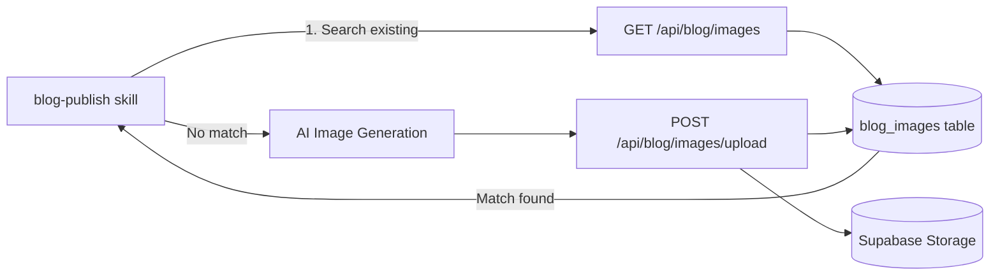
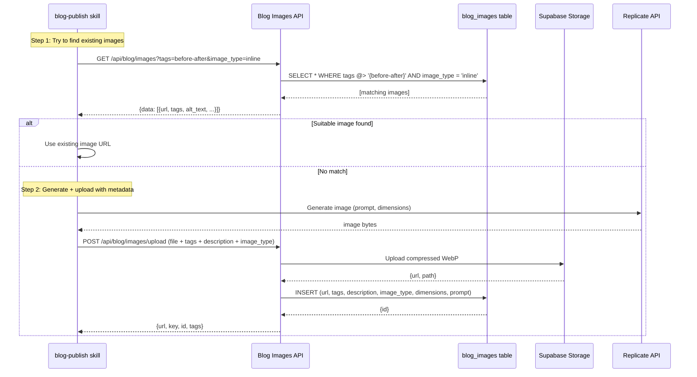

# PRD: Blog Image Reuse System

**Complexity: 6 → MEDIUM mode**

---

## 1. Context

**Problem:** Every blog post generates 3-4 new AI images via Replicate (~$0.05-0.12 per post, ~60-120s latency each). Many posts share similar themes (before/after comparisons, AI processing visualizations, print results) and could reuse existing images instead.

**Files Analyzed:**

- `.claude/skills/blog-publish/SKILL.md` - Current publishing workflow (always generates fresh images)
- `.claude/skills/ai-image-generation/scripts/generate-ai-image.ts` - Image generation script
- `server/services/blogImageStorage.service.ts` - Upload to Supabase Storage (no metadata tracking)
- `app/api/blog/images/upload/route.ts` - Upload endpoint (no metadata stored)
- `shared/validation/blog.schema.ts` - Current schemas (no image catalog types)
- `supabase/migrations/20260129_create_blog_posts.sql` - Blog posts table
- `supabase/migrations/20260131_create_blog_images_bucket.sql` - Storage bucket (no metadata table)

**Current Behavior:**

- Blog-publish skill generates 1 featured (1200x630) + 2-3 inline (800x600) images per post
- Images uploaded to Supabase Storage bucket `blog-images` with path `YYYY/MM/timestamp-filename.webp`
- **No metadata is stored** — images exist in storage but are not queryable by content/tags/purpose
- Upload endpoint returns `{url, key, filename}` but discards `alt_text`
- The `alt_text` field is extracted in the upload handler but explicitly discarded with `void`

---

## 2. Solution

**Approach:**

- Create a `blog_images` metadata table in Supabase to catalog every uploaded blog image with tags, description, dimensions, and purpose (featured vs inline)
- Add a `GET /api/blog/images` endpoint to search/browse existing images by tags, purpose, and dimensions
- Modify the image upload endpoint to store metadata alongside the storage upload
- Update the blog-publish skill to search for matching images first, only generating new ones when no suitable match exists

**Architecture Diagram:**



**Key Decisions:**

- Use a dedicated `blog_images` metadata table (not columns on `blog_posts`) because images are shared across posts
- Tag-based matching: images get semantic tags like `before-after`, `ai-processing`, `print-result`, `featured`, `inline`
- Reuse the existing `blogImageStorage.service.ts` — extend, don't replace
- No UI needed — this is a skill-only optimization (CLI/API workflow)

**Data Changes:**

- New table: `public.blog_images` (metadata catalog)
- Modified endpoint: `POST /api/blog/images/upload` (now stores metadata)
- New endpoint: `GET /api/blog/images` (search/browse)

---

## 3. Sequence Flow



---

## 4. Execution Phases

### Phase 1: Database Schema — Blog images have a searchable metadata catalog

**Files (3):**

- `supabase/migrations/20260212_create_blog_images_table.sql` - New migration
- `shared/validation/blog.schema.ts` - Add image metadata types and schemas
- `server/services/blogImageStorage.service.ts` - Add metadata CRUD functions

**Implementation:**

- [ ] Create `blog_images` table with columns: `id` (UUID), `url` (TEXT), `storage_path` (TEXT), `alt_text` (TEXT), `tags` (TEXT[]), `description` (TEXT), `image_type` (TEXT: 'featured' | 'inline'), `width` (INT), `height` (INT), `prompt` (TEXT, nullable — the AI prompt used), `used_in_posts` (TEXT[] — slugs of posts using this image), `created_at` (TIMESTAMPTZ)
- [ ] Add GIN index on `tags` for fast array matching
- [ ] Add index on `image_type` for filtering
- [ ] RLS: service_role full access, public SELECT
- [ ] Add Zod schemas: `blogImageMetadataSchema`, `searchBlogImagesSchema`, `IBlogImageMetadata` type
- [ ] Add service functions: `saveBlogImageMetadata()`, `searchBlogImages()`, `getBlogImageByUrl()`

**Tests Required:**

| Test File                                        | Test Name                                        | Assertion                        |
| ------------------------------------------------ | ------------------------------------------------ | -------------------------------- |
| `tests/unit/blog/blog-image-schema.unit.spec.ts` | `should validate blog image metadata schema`     | Schema parses valid metadata     |
| `tests/unit/blog/blog-image-schema.unit.spec.ts` | `should reject invalid image_type`               | Schema rejects 'banner'          |
| `tests/unit/blog/blog-image-schema.unit.spec.ts` | `should validate search params with tags filter` | Search schema accepts tags array |

**Verification Plan:**

1. **Unit Tests:** Zod schema validation for image metadata and search params
2. **Migration:** SQL is valid and creates table with correct constraints
3. **Evidence:** `yarn test tests/unit/blog/blog-image-schema.unit.spec.ts` passes

---

### Phase 2: Image Search API Endpoint — Images are searchable via REST API

**Files (3):**

- `app/api/blog/images/route.ts` - New GET endpoint for searching images
- `server/services/blogImageStorage.service.ts` - Implement DB query for search
- `shared/validation/blog.schema.ts` - Search response types (if not done in Phase 1)

**Implementation:**

- [ ] Create `GET /api/blog/images` route handler with auth check
- [ ] Accept query params: `tags` (comma-separated), `image_type` ('featured' | 'inline'), `limit` (default 10), `offset` (default 0)
- [ ] Implement `searchBlogImages()` in service: query `blog_images` with `tags @> ARRAY[...]` and optional `image_type` filter
- [ ] Return paginated results with `{url, alt_text, tags, image_type, width, height, prompt, created_at}`

**Tests Required:**

| Test File                                        | Test Name                            | Assertion                                 |
| ------------------------------------------------ | ------------------------------------ | ----------------------------------------- |
| `tests/unit/blog/blog-image-search.unit.spec.ts` | `should return images matching tags` | Response includes matching images         |
| `tests/unit/blog/blog-image-search.unit.spec.ts` | `should filter by image_type`        | Only returns featured/inline as requested |
| `tests/unit/blog/blog-image-search.unit.spec.ts` | `should require api key auth`        | Returns 401 without key                   |

**Verification Plan:**

1. **Unit Tests:** Schema validation and service function logic
2. **API Proof:**

   ```bash
   # Search for before-after inline images
   curl -s "http://localhost:3000/api/blog/images?tags=before-after&image_type=inline&limit=5" \
     -H "x-api-key: $API_KEY" | jq .
   # Expected: {"success": true, "data": [...], "pagination": {...}}

   # No auth
   curl -s "http://localhost:3000/api/blog/images" | jq .
   # Expected: {"success": false, "error": {"code": "UNAUTHORIZED"}}
   ```

3. **Evidence:** `yarn verify` passes

---

### Phase 3: Upgrade Upload Endpoint — Uploaded images automatically get cataloged

**Files (2):**

- `app/api/blog/images/upload/route.ts` - Extend to accept and store metadata
- `server/services/blogImageStorage.service.ts` - Save metadata after storage upload

**Implementation:**

- [ ] Extend upload to accept optional metadata fields: `tags` (string[], via form field or JSON), `description` (string), `image_type` ('featured' | 'inline'), `width` (number), `height` (number), `prompt` (string)
- [ ] After successful Supabase Storage upload, insert row into `blog_images` table with all metadata
- [ ] Update `imageUploadSchema` to include optional metadata fields (backwards-compatible)
- [ ] Return enriched response including `id` from metadata table
- [ ] For multipart uploads: accept tags as comma-separated form field

**Tests Required:**

| Test File                                        | Test Name                                         | Assertion                     |
| ------------------------------------------------ | ------------------------------------------------- | ----------------------------- |
| `tests/unit/blog/blog-image-upload.unit.spec.ts` | `should store metadata when provided`             | Metadata saved to blog_images |
| `tests/unit/blog/blog-image-upload.unit.spec.ts` | `should work without metadata (backwards compat)` | Upload succeeds without tags  |
| `tests/unit/blog/blog-image-upload.unit.spec.ts` | `should validate image_type enum`                 | Rejects invalid image_type    |

**Verification Plan:**

1. **Unit Tests:** Schema validation for extended upload input
2. **API Proof:**

   ```bash
   # Upload with metadata
   curl -s -X POST http://localhost:3000/api/blog/images/upload \
     -H "x-api-key: $API_KEY" \
     -F "file=@./test.png" \
     -F "alt_text=Before and after comparison" \
     -F "tags=before-after,comparison,upscaling" \
     -F "image_type=inline" \
     -F "description=Split screen showing pixelated vs enhanced image" \
     -F "prompt=Split screen: pixelated photo left, crystal clear right" | jq .
   # Expected: {"success": true, "data": {"url": "...", "key": "...", "id": "...", "tags": [...]}}

   # Upload without metadata (backwards compatible)
   curl -s -X POST http://localhost:3000/api/blog/images/upload \
     -H "x-api-key: $API_KEY" \
     -F "file=@./test.png" | jq .
   # Expected: {"success": true, "data": {"url": "...", "key": "..."}}
   ```

3. **Evidence:** `yarn verify` passes

---

### Phase 4: Update blog-publish Skill — Skill searches before generating

**Files (1):**

- `.claude/skills/blog-publish/SKILL.md` - Update workflow to search-first

**Implementation:**

- [ ] Add new "Step 0: Search Existing Images" before image generation
- [ ] Define a standard tag vocabulary for blog images:
  - **Themes:** `before-after`, `ai-processing`, `workflow`, `print-result`, `comparison`, `workspace`, `tutorial`, `ecommerce`, `social-media`, `restoration`
  - **Types:** `featured`, `inline`
  - **Subjects:** `laptop`, `phone`, `printer`, `photo`, `screenshot`, `artwork`, `product-photo`
- [ ] Add search commands:
  ```bash
  # Search for existing featured images matching the topic
  curl -s "http://localhost:3000/api/blog/images?tags=before-after,ai-processing&image_type=featured&limit=5" \
    -H "x-api-key: $API_KEY" | jq '.data[] | {url, alt_text, tags, prompt}'
  ```
- [ ] Add decision logic in skill instructions: "If a suitable image is found (matching 2+ tags), use it. If not, generate a new one."
- [ ] Update upload commands to always include metadata (tags, description, prompt, image_type)
- [ ] Add tag vocabulary reference table to the skill

**Tests Required:**

| Test File       | Test Name           | Assertion                                 |
| --------------- | ------------------- | ----------------------------------------- |
| N/A (skill doc) | Manual verification | Skill instructions are clear and complete |

**Verification Plan:**

1. **Manual Verification:** Read the updated skill and verify the search-first workflow is clear
2. **Evidence:** The skill includes search commands, tag vocabulary, and fallback to generation

---

## 5. Acceptance Criteria

- [ ] All phases complete
- [ ] All specified tests pass
- [ ] `yarn verify` passes
- [ ] `GET /api/blog/images` endpoint works with tag and type filters
- [ ] `POST /api/blog/images/upload` stores metadata alongside storage upload
- [ ] Upload remains backwards-compatible (metadata is optional)
- [ ] blog-publish skill instructs to search existing images before generating
- [ ] Standard tag vocabulary is documented in the skill

---

## 6. Tag Vocabulary (Reference)

Standardized tags for consistent search/reuse:

| Category          | Tags                                                                                                                                                        |
| ----------------- | ----------------------------------------------------------------------------------------------------------------------------------------------------------- |
| **Theme**         | `before-after`, `ai-processing`, `workflow`, `print-result`, `comparison`, `workspace`, `tutorial`, `ecommerce`, `social-media`, `restoration`, `upscaling` |
| **Subject**       | `laptop`, `phone`, `printer`, `photo`, `screenshot`, `artwork`, `product-photo`, `infographic`, `diagram`                                                   |
| **Style**         | `photorealistic`, `clean`, `professional`, `split-screen`, `side-by-side`, `step-by-step`                                                                   |
| **Blog Category** | `guides`, `tips`, `comparisons`, `news`, `technical`                                                                                                        |

Each uploaded image should have 3-6 tags from this vocabulary for effective matching.
