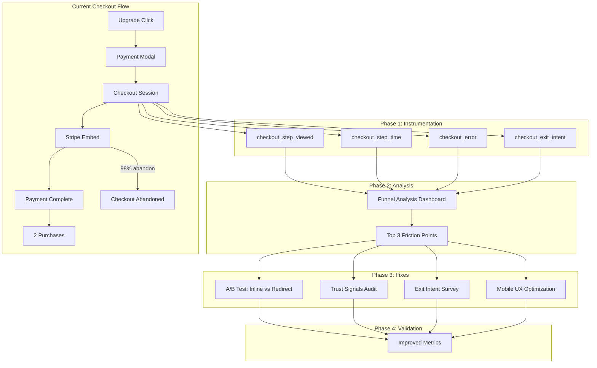
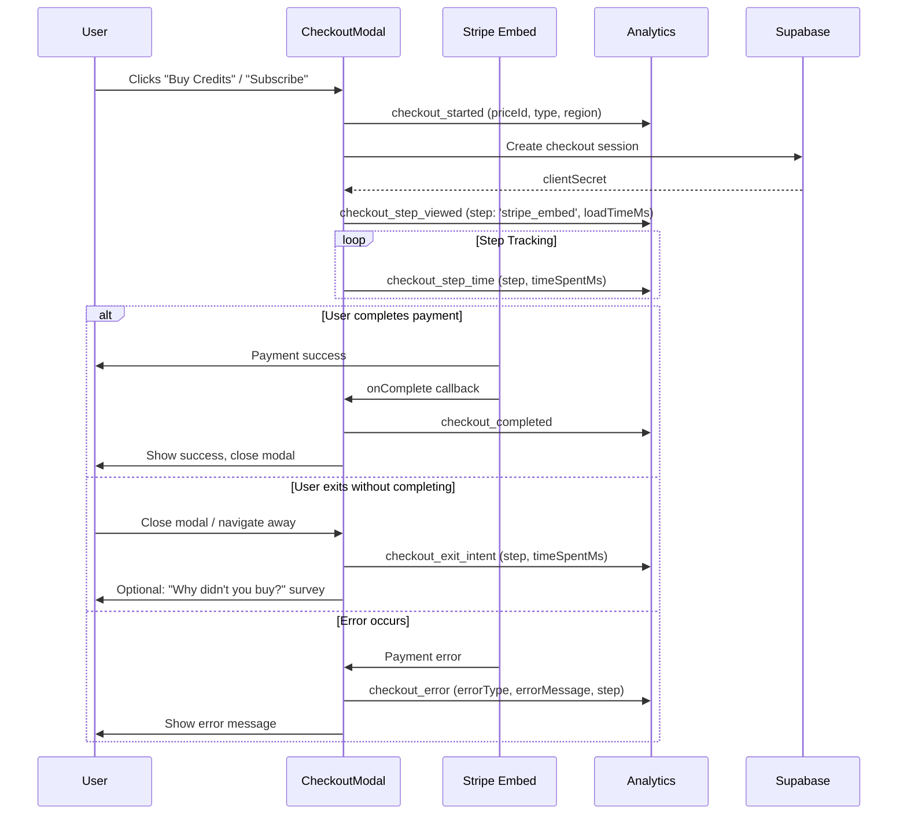

# Checkout Friction Investigation & Fix

`Complexity: 8 - HIGH mode`

## 1. Context

**Problem Statement:**

Analytics data reveals a catastrophic drop-off at checkout: **88 users clicked "upgrade" but only 2 completed a purchase** (0.19% conversion). This 98% abandonment rate represents the single largest revenue leak in the application.

**Current Understanding (from existing PRDs):**

- `conversion-optimization.md` establishes that users prefer credit packs over subscriptions (Stripe data)
- `ux-conversion-optimization.md` documents upgrade prompts with 3.8% CTR and 33% dismiss rate
- Existing funnel instrumentation tracks: `batch_limit_modal_shown` -> `batch_limit_upgrade_clicked` -> `pricing_page_viewed` -> `checkout_started` -> `checkout_completed` / `checkout_abandoned`
- `checkout_abandoned` events track step (`plan_selection` | `stripe_embed`) and `timeSpentMs`

**The Gap:**

Existing PRDs focus on **getting users to checkout** (upgrade prompts, modal optimization) but do not address **what happens during checkout**. The 98% drop-off indicates severe friction in the checkout flow itself that we currently have minimal visibility into.

**Hypotheses:**

1. **Stripe embed load time** — Slow iframe initialization causes abandonment before payment options appear
2. **Payment method availability** — Users in certain regions (PH, IN, etc.) may not have credit cards or Stripe may not support local methods
3. **Mobile UX issues** — CheckoutModal may have usability problems on mobile devices
4. **Lack of trust signals** — Users abandon due to insufficient security badges, guarantees, or reassurance
5. **Pricing clarity** — Users reach checkout but are unclear on what they're buying
6. **Redirect vs inline** — Current modal approach may be less effective than dedicated checkout page

**Integration Points:**

```
How will this feature be reached?
- [x] Entry points: OutOfCreditsModal (credit pack purchase), billing page subscription flow, pricing page
- [x] Caller files: CreditPackSelector.tsx, SubscriptionPlanGrid.tsx, pricing components
- [x] Registration/wiring: New instrumentation wired into existing checkout components

Is this user-facing?
- [x] YES — Checkout UI changes, trust signals, exit intent surveys
- [x] YES — Analytics instrumentation for funnel visibility
```

## 2. Solution

**Approach:**

This PRD follows a **diagnose -> fix -> validate** cycle. Rather than implementing changes without understanding the problem, we first instrument the checkout flow deeply (Phase 1), then analyze data to identify top friction points (Phase 2), then implement targeted fixes (Phase 3-4).

**Architecture Diagram:**



**Key Decisions:**

- [x] **Instrument first** — Add granular tracking before making UX changes to establish baseline
- [x] **A/B test approach** — Test inline credit purchase vs. redirect to billing page (variants already exist)
- [x] **Exit intent survey** — Ask abandoners why they didn't complete (provides qualitative data)
- [x] **Mobile-first audit** — Checkout issues likely compound on mobile devices
- [x] **Regional awareness** — Track payment method availability by country (some regions may lack card access)

**Data Changes:** Minimal — extends existing analytics events with new properties for checkout funnel visibility

## 3. Sequence Flow



---

## 4. Execution Phases

### Phase 1: Checkout Funnel Instrumentation — "We see exactly where users drop off in checkout"

**Files (6):**

- `client/components/stripe/CheckoutModal.tsx` — Add granular step tracking
- `client/components/stripe/CreditPackSelector.tsx` — Track checkout entry point
- `client/components/stripe/SubscriptionPlanGrid.tsx` — Track plan selection time
- `server/analytics/types.ts` — Add new checkout event types and properties
- `app/api/analytics/event/route.ts` — Ensure new events pass whitelist
- `tests/unit/analytics/checkout-funnel.unit.spec.ts` — NEW test file

**Implementation:**

- [ ] Add new event types to `IAnalyticsEventName` in `types.ts`:

  ```typescript
  | 'checkout_step_viewed'
  | 'checkout_step_time'
  | 'checkout_error'
  | 'checkout_exit_intent'
  ```

- [ ] Add new property interfaces:

  ```typescript
  export interface ICheckoutStepViewedProperties {
    step: 'plan_selection' | 'stripe_embed' | 'payment_details' | 'confirmation';
    loadTimeMs?: number;
    priceId: string;
    purchaseType: 'subscription' | 'credit_pack';
    deviceType: 'mobile' | 'desktop' | 'tablet';
  }

  export interface ICheckoutStepTimeProperties {
    step: 'plan_selection' | 'stripe_embed' | 'payment_details' | 'confirmation';
    timeSpentMs: number;
    priceId: string;
  }

  export interface ICheckoutErrorProperties {
    errorType: 'card_declined' | '3ds_failed' | 'network_error' | 'invalid_card' | 'other';
    errorMessage: string; // Sanitized
    step: string;
    priceId: string;
  }

  export interface ICheckoutExitIntentProperties {
    step: string;
    timeSpentMs: number;
    priceId: string;
    method: 'close_button' | 'escape_key' | 'click_outside' | 'navigate_away';
  }
  ```

- [ ] Update `CheckoutModal.tsx`:
  - Track `checkout_step_viewed` when Stripe embed loads with `loadTimeMs` (time from modal open to embed ready)
  - Track `checkout_step_time` every 5 seconds while modal is open (cumulative time per step)
  - Track `checkout_error` when Stripe embed emits errors (listen for `stripe_embed_load_failed`, payment errors)
  - Track `checkout_exit_intent` on modal close (distinguish close button, escape key, click outside)
  - Add `deviceType` detection for mobile vs desktop comparison

- [ ] Update `CreditPackSelector.tsx`:
  - Track time spent on pack selection (from render to "Buy" click)
  - Track which pack was selected initially vs. finally purchased

- [ ] Update `SubscriptionPlanGrid.tsx`:
  - Track plan hover/focus time (indicates comparison behavior)
  - Track plan-to-plan switches before checkout

**Tests Required:**

| Test File                                           | Test Name                                             | Assertion                               |
| --------------------------------------------------- | ----------------------------------------------------- | --------------------------------------- |
| `tests/unit/analytics/checkout-funnel.unit.spec.ts` | `should track checkout_step_viewed with correct step` | Event fired with proper step name       |
| `tests/unit/analytics/checkout-funnel.unit.spec.ts` | `should track checkout_step_time periodically`        | Time accumulator updates correctly      |
| `tests/unit/analytics/checkout-funnel.unit.spec.ts` | `should track checkout_exit_intent on modal close`    | Event fired with correct method         |
| `tests/unit/analytics/checkout-funnel.unit.spec.ts` | `should detect deviceType correctly`                  | Mobile vs desktop classified accurately |
| `tests/unit/analytics/checkout-funnel.unit.spec.ts` | `should sanitize error messages in checkout_error`    | No sensitive card data in event         |

**Verification Plan:**

1. **Unit Tests:** 5 new tests as listed
2. **Evidence Required:**
   - [ ] All tests pass (`yarn test`)
   - [ ] `yarn verify` passes
   - [ ] Amplitude dashboard shows new events arriving

**User Verification:**

- Action: Complete a test purchase, observe Amplitude events
- Expected: All 4 new event types fire with correct properties

---

### Phase 2: Funnel Analysis — "We identify the top 3 friction points within 2 weeks"

**Files (2):**

- `server/analytics/checkoutFunnelAnalyzer.ts` — NEW utility for funnel analysis
- `docs/analytics/checkout-funnel-baseline.md` — Document baseline findings

**Implementation:**

- [ ] Create `checkoutFunnelAnalyzer.ts` utility:

  ```typescript
  export interface ICheckoutFunnelMetrics {
    period: { start: Date; end: Date };
    totalCheckoutStarts: number;
    stepCompletionRates: Record<string, number>; // % reaching each step
    averageTimePerStep: Record<string, number>; // ms
    abandonmentRateByStep: Record<string, number>;
    errorRateByType: Record<string, number>;
    mobileVsDesktop: {
      mobile: { completionRate: number; avgTimeMs: number };
      desktop: { completionRate: number; avgTimeMs: number };
    };
    topExitMethods: Array<{ method: string; count: number; percentage: number }>;
  }

  export async function getCheckoutFunnelMetrics(
    startDate: Date,
    endDate: Date
  ): Promise<ICheckoutFunnelMetrics>;
  ```

- [ ] Run initial analysis after 7 days of data collection
- [ ] Document findings in `checkout-funnel-baseline.md`:
  - Top abandonment step (e.g., "75% drop at stripe_embed load")
  - Average time at each step (e.g., "8s to load stripe_embed")
  - Top error types (e.g., "40% card_declined errors")
  - Mobile vs desktop completion rate delta

**Tests Required:**

| Test File                                           | Test Name                                                      | Assertion                   |
| --------------------------------------------------- | -------------------------------------------------------------- | --------------------------- |
| `tests/unit/analytics/checkout-funnel.unit.spec.ts` | `funnel analyzer: should calculate completion rates correctly` | Rates match expected values |
| `tests/unit/analytics/checkout-funnel.unit.spec.ts` | `funnel analyzer: should aggregate time per step`              | Time calculations accurate  |

**Verification Plan:**

1. **Unit Tests:** 2 new tests
2. **Evidence Required:**
   - [ ] All tests pass
   - [ ] Baseline document created with 7+ days of data
   - [ ] Top 3 friction points identified with supporting metrics

**Deliverable:**

A concise report identifying the **top 3 friction points** with specific metrics, e.g.:

1. "Stripe embed takes 8.2s to load (target: <2s) — 45% abandon during load"
2. "Mobile users complete at 0.05% vs. desktop 0.35% — UX issue suspected"
3. "60% of abandoners exit within 3 seconds — pricing confusion or cold feet"

---

### Phase 3: Checkout UX Fixes — "We implement targeted fixes based on data"

**This phase is intentionally split into sub-phases. The specific fixes implemented should be prioritized based on Phase 2 findings. The following are proposed fixes to be implemented in priority order.**

### Phase 3A: Stripe Embed Load Time Optimization

**Hypothesis:** Slow embed initialization causes abandonment before payment UI appears.

**Files (3):**

- `client/components/stripe/CheckoutModal.tsx` — Add loading states, optimize initialization
- `server/stripe/checkoutService.ts` — Optimize session creation
- `client/services/stripeService.ts` — Preload Stripe.js

**Implementation:**

- [ ] Add optimistic loading state in `CheckoutModal`:
  - Show "Secure checkout loading..." with spinner during embed initialization
  - Display trust badges (Stripe, SSL) during load to build confidence
  - Track load time and display progress if >2s

- [ ] Preload Stripe.js script on page mount for users who hit credit limit:
  - Add `<Script>` tag with `strategy="lazyOnload"` for Stripe.js
  - Reduces embed load time by ~500ms

- [ ] Optimize checkout session creation:
  - Review API response time for `/api/stripe/create-checkout-session`
  - Add caching for user profile data needed for session creation

**Tests Required:**

| Test File                                           | Test Name                                        | Assertion                        |
| --------------------------------------------------- | ------------------------------------------------ | -------------------------------- |
| `tests/unit/analytics/checkout-funnel.unit.spec.ts` | `should track stripe embed load time accurately` | LoadTimeMs within expected range |

**Success Metric:** Average embed load time reduced by 30%

---

### Phase 3B: Trust Signals Audit & Enhancement

**Hypothesis:** Users abandon due to lack of trust/security visibility.

**Files (4):**

- `client/components/stripe/CheckoutModal.tsx` — Add trust badges
- `app/[locale]/dashboard/billing/page.tsx` — Add trust section
- `client/components/ui/TrustBadges.tsx` — NEW reusable component
- `locales/en/stripe.json` — Add trust-related copy

**Implementation:**

- [ ] Create `TrustBadges` component with:
  - Stripe verified badge
  - SSL/secure connection indicator
  - "256-bit encryption" text
  - Money-back guarantee link
  - "Cancel anytime" for subscriptions

- [ ] Add to `CheckoutModal` header:
  - Position above Stripe embed (visible during load)
  - Use icons + minimal text (don't clutter)

- [ ] Add to billing page credit purchase section:
  - "Secure payment" section before credit pack selector
  - Link to refund policy / terms

- [ ] Mobile optimization: Trust badges stack vertically on small screens

**Tests Required:**

| Test File                                     | Test Name                                        | Assertion                           |
| --------------------------------------------- | ------------------------------------------------ | ----------------------------------- |
| `tests/unit/client/checkout-ui.unit.spec.tsx` | `should render trust badges in checkout modal`   | Badges visible and correctly styled |
| `tests/unit/client/checkout-ui.unit.spec.tsx` | `should stack trust badges vertically on mobile` | Responsive layout works             |

**Success Metric:** Survey responses citing "security concerns" decrease by 50%

---

### Phase 3C: Exit Intent Survey — "We ask abandoners why they didn't complete"

**Hypothesis:** Qualitative data from abandoners reveals fixable issues.

**Files (3):**

- `client/components/stripe/CheckoutExitSurvey.tsx` — NEW component
- `client/components/stripe/CheckoutModal.tsx` — Wire up survey on close
- `server/analytics/types.ts` — Add survey response event

**Implementation:**

- [ ] Create `CheckoutExitSurvey` component:
  - Triggered when user closes modal without completing
  - Only shown if user spent >5 seconds in checkout (filters accidental closes)
  - Single question: "What stopped you from completing your purchase?"
  - Options:
    - "Price was higher than expected"
    - "Payment method not accepted"
    - "Not sure I need this right now"
    - "Technical issue / page wasn't working"
    - "Just browsing, not ready to buy"
    - "Other"
  - Optional free-text field for "Other"
  - Fires `checkout_exit_survey_response` event with selection

- [ ] Frequency cap: Max 1 survey per user per week (avoid fatigue)

- [ ] Track results in Amplitude for aggregation

**Tests Required:**

| Test File                                     | Test Name                                      | Assertion                           |
| --------------------------------------------- | ---------------------------------------------- | ----------------------------------- |
| `tests/unit/client/checkout-ui.unit.spec.tsx` | `should show exit survey after 5s in checkout` | Survey appears after threshold      |
| `tests/unit/client/checkout-ui.unit.spec.tsx` | `should NOT show survey if checkout completed` | No survey on successful purchase    |
| `tests/unit/client/checkout-ui.unit.spec.tsx` | `should respect weekly frequency cap`          | Survey suppressed if recently shown |

**Success Metric:** Collect 50+ responses in 2 weeks, identify actionable insights

---

### Phase 3D: Mobile Checkout UX Optimization

**Hypothesis:** Mobile users have worse completion rate due to UX issues.

**Files (2):**

- `client/components/stripe/CheckoutModal.tsx` — Mobile-specific improvements
- `app/[locale]/dashboard/billing/page.tsx` — Mobile billing page enhancements

**Implementation:**

- [ ] Audit mobile checkout flow:
  - Test on iPhone SE (375px width) and typical Android (360px)
  - Identify issues: Tiny buttons, modal too tall, poor zoom/scroll behavior

- [ ] Fix `CheckoutModal` for mobile:
  - Increase close button touch target (min 44x44px)
  - Reduce max-width on mobile to prevent horizontal scroll
  - Ensure Stripe embed iframe has proper mobile meta tags
  - Add `overflow-y-auto` with smooth scrolling for tall forms

- [ ] Optimize billing page for mobile:
  - Credit pack cards stack vertically (vs grid on desktop)
  - "Buy" buttons are full-width on mobile for easy tapping
  - Collapse credit history section by default (save screen space)

**Tests Required:**

| Test File                           | Test Name                                   | Assertion                                |
| ----------------------------------- | ------------------------------------------- | ---------------------------------------- |
| `tests/e2e/checkout-mobile.spec.ts` | `should complete checkout on mobile device` | End-to-end flow works on mobile viewport |

**Success Metric:** Mobile checkout completion rate increases by 50% relative to baseline

---

### Phase 4: A/B Test — Inline vs Redirect Checkout — "We test which approach converts better"

**Hypothesis:** The current modal approach may not be optimal. Users might prefer a dedicated checkout page.

**Files (4):**

- `client/components/stripe/CheckoutModal.tsx` — Add variant parameter
- `client/hooks/useCheckoutVariant.ts` — NEW hook for A/B allocation
- `app/[locale]/checkout/[priceId]/page.tsx` — NEW dedicated checkout page
- `server/analytics/types.ts` — Add checkout variant tracking

**Implementation:**

- [ ] Create two checkout experiences:
  1. **Variant A (Control):** Existing modal approach (Stripe embed in modal)
  2. **Variant B (Treatment):** Redirect to dedicated `/checkout/[priceId]` page with full-page Stripe embed

- [ ] Implement `useCheckoutVariant` hook:
  - 50/50 split based on user ID hash (stable per user)
  - Returns `'modal'` or `'page'`
  - Stored in localStorage for consistency

- [ ] Create `/checkout/[priceId]` page:
  - Full-screen Stripe checkout (no modal wrapper)
  - Trust badges at top
  - "Return to billing" link
  - Mobile-optimized layout

- [ ] Track `checkout_variant` in all checkout events:

  ```typescript
  export interface ICheckoutVariantProperties {
    variant: 'modal' | 'page';
  }
  ```

- [ ] Run A/B test for 4 weeks minimum

**Tests Required:**

| Test File                                            | Test Name                                     | Assertion                          |
| ---------------------------------------------------- | --------------------------------------------- | ---------------------------------- |
| `tests/unit/analytics/checkout-ab-test.unit.spec.ts` | `should assign variant consistently per user` | Same user gets same variant        |
| `tests/unit/analytics/checkout-ab-test.unit.spec.ts` | `should achieve 50/50 split approximately`    | Variant distribution within 45-55% |
| `tests/e2e/checkout-variants.spec.ts`                | `should complete purchase via modal variant`  | Modal flow works end-to-end        |
| `tests/e2e/checkout-variants.spec.ts`                | `should complete purchase via page variant`   | Page flow works end-to-end         |

**Success Metric:** Identify winning variant with 95% statistical confidence

---

## 5. Checkpoint Protocol

All phases use **Automated Checkpoint** (prd-work-reviewer agent). Phase 4 (A/B test) additionally requires **Manual Checkpoint** after 4 weeks for results analysis.

---

## 6. Verification Strategy

### Phase Verification Summary

| Phase               | Unit Tests | Manual Check                      | A/B Test Duration | yarn verify |
| ------------------- | ---------- | --------------------------------- | ----------------- | ----------- |
| 1 — Instrumentation | 5 tests    | Events visible in Amplitude       | N/A               | Required    |
| 2 — Analysis        | 2 tests    | Report reviewed with team         | N/A               | Required    |
| 3A — Load Time      | 1 test     | Load time measured in dev         | N/A               | Required    |
| 3B — Trust Signals  | 2 tests    | Visual review on mobile + desktop | N/A               | Required    |
| 3C — Exit Survey    | 3 tests    | Survey appears on close           | N/A               | Required    |
| 3D — Mobile UX      | 1 E2E test | Manual testing on real devices    | N/A               | Required    |
| 4 — A/B Test        | 4 tests    | Both variants functional          | 4 weeks min       | Required    |

**Total: 18 new tests + E2E tests**

---

## 7. Acceptance Criteria

### Phase 1 (Instrumentation)

- [ ] All 4 new checkout events fire correctly (`checkout_step_viewed`, `checkout_step_time`, `checkout_error`, `checkout_exit_intent`)
- [ ] Events include deviceType, timeSpentMs, step, and errorType properties
- [ ] 7+ days of baseline data collected
- [ ] Unit tests pass for new tracking logic

### Phase 2 (Analysis)

- [ ] Checkout funnel baseline documented with specific metrics
- [ ] Top 3 friction points identified with supporting data
- [ ] Mobile vs desktop comparison completed
- [ ] Error type analysis completed

### Phase 3 (Fixes)

- [ ] Implement fixes prioritized by Phase 2 findings
- [ ] At minimum, complete 3B (trust signals) and 3C (exit survey)
- [ ] Mobile UX improvements deployed if mobile completion rate < desktop
- [ ] All unit tests pass

### Phase 4 (A/B Test)

- [ ] Both checkout variants (modal and page) functional
- [ ] 50/50 variant allocation working correctly
- [ ] 4+ weeks of data collected
- [ ] Statistical significance calculated for both variants
- [ ] Winning variant identified (or test concluded as inconclusive)

---

## 8. KPIs and Success Metrics

### Primary Metrics

| Metric                             | Current      | Target  | Measurement                                          |
| ---------------------------------- | ------------ | ------- | ---------------------------------------------------- |
| Checkout completion rate           | 0.19% (2/88) | 5%+     | `checkout_completed / checkout_started` in Amplitude |
| Avg checkout time (completers)     | TBD          | <60s    | `checkout_step_time` aggregation                     |
| Stripe embed load time             | TBD          | <2s     | `checkout_step_viewed.loadTimeMs`                    |
| Mobile vs desktop completion ratio | TBD          | <2x gap | Compare completion rates by deviceType               |

### Secondary Metrics

| Metric                           | Target               | Measurement                                          |
| -------------------------------- | -------------------- | ---------------------------------------------------- |
| Top 3 friction points identified | Within 2 weeks       | Funnel analysis report                               |
| Exit survey response rate        | 10%+ of abandoners   | `checkout_exit_survey_response / checkout_abandoned` |
| Error rate by type               | Baseline established | `checkout_error` aggregation                         |
| Trust signal visibility          | 100% of checkouts    | Trust badge impressions                              |

### Success Criteria

- **Week 2:** Checkout instrumentation deployed, baseline documented
- **Week 4:** Top 3 friction points identified with action plan
- **Week 8:** At least 2 Phase 3 fixes implemented and showing improvement
- **Week 12:** Checkout completion rate improved to 5%+ (26x improvement from baseline)

---

## 9. Risks and Mitigations

| Risk                                                             | Likelihood | Impact | Mitigation                                                                     |
| ---------------------------------------------------------------- | ---------- | ------ | ------------------------------------------------------------------------------ |
| Low baseline conversion makes statistical significance difficult | High       | Medium | Run tests for longer (4+ weeks), combine with qualitative survey data          |
| Stripe embed performance is limited by external factors          | Medium     | Medium | Focus on UX improvements (trust signals, loading states) rather than raw speed |
| A/B test adds complexity without clear winner                    | Medium     | Low    | Revert to control if treatment underperforms; document learning                |
| Exit survey fatigues users                                       | Low        | Low    | Cap at 1 per week per user; keep to 1 question                                 |
| Mobile fixes may break desktop UX                                | Low        | Medium | Test on all screen sizes; use responsive breakpoints correctly                 |

---

## 10. Related Work

- `docs/PRDs/conversion-optimization.md` — Upgrade prompt optimization (gets users TO checkout)
- `docs/PRDs/ux-conversion-optimization.md` — Post-purchase prompts and model gallery UX
- `docs/PRDs/regional-dynamic-pricing.md` — Regional pricing (may impact checkout by region)
- `server/analytics/types.ts` — Existing analytics event definitions
- `client/components/stripe/CheckoutModal.tsx` — Current checkout implementation

---

## 11. Open Questions

1. **Payment methods by region:** Do users in PH/IN/ID have credit card access, or do we need local payment methods (GCash, Paytm, etc.)? Answer this via exit survey data.

2. **Modal vs page:** Is the modal approach itself the problem, or is it the content within? Phase 4 A/B test will answer this.

3. **Price sensitivity:** Is the 98% drop-off due to price objection or UX friction? Exit survey and funnel time analysis will help distinguish.

4. **3DS authentication:** Are users failing at the 3D Secure step (bank redirect)? This requires tracking within the Stripe embed (limited visibility).

---

## 12. Next Steps

1. **Immediate (Week 1):** Implement Phase 1 instrumentation
2. **Short-term (Week 2):** Begin collecting baseline data, create funnel dashboard
3. **Medium-term (Week 3-4):** Complete Phase 2 analysis, prioritize fixes
4. **Ongoing (Week 5+):** Implement Phase 3 fixes based on findings, launch Phase 4 A/B test

---

**Document Version:** 1.0
**Created:** 2026-03-11
**Last Updated:** 2026-03-11
