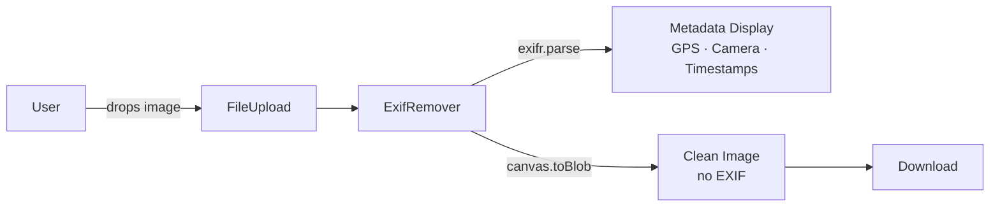
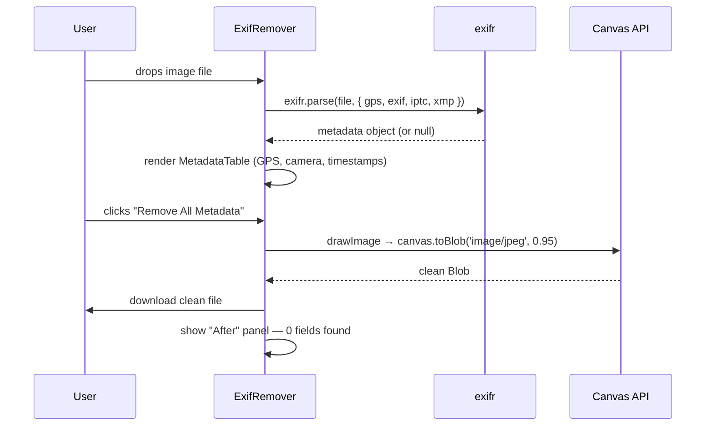

# PRD: EXIF / Metadata Remover Tool

**Status**: Ready for implementation
**Author**: Claude
**Date**: April 23, 2026
**Branch**: `feat/exif-metadata-remover`

---

## Complexity: 4 → MEDIUM

```
+2  Touches 6 files
+2  New module from scratch (ExifRemover component)
```

---

## 1. Context

**Problem**: 8.1K monthly searches (+50% YoY) for EXIF/metadata removal have zero coverage on the site. Zero build cost (100% client-side), zero server cost, zero credits — pure SEO real estate to claim.

**Files Analyzed:**

- `app/(pseo)/_components/tools/ImageResizer.tsx` — component pattern to follow
- `app/(pseo)/_components/pseo/templates/InteractiveToolPageTemplate.tsx` — component registration map
- `app/seo/data/interactive-tools.json` — pSEO data format
- `lib/seo/pseo-types.ts` — `IToolPage` type shape
- `tests/pseo/templates.test.tsx` — existing pSEO test patterns

**Current Behavior:**

- No `/tools/exif-remover` route exists
- No `/tools/remove-metadata-from-photo` route exists
- `TOOL_COMPONENTS` map in `InteractiveToolPageTemplate` has 11 entries — `ExifRemover` is not one of them
- `interactive-tools.json` has no EXIF-related entries

---

## 2. Solution

**Approach:**

- Use `exifr` (1.09M weekly downloads) to parse EXIF metadata from JPEG/TIFF/HEIC/AVIF
- Strip metadata by re-encoding via `canvas.toBlob('image/jpeg')` — no stripping library needed
- Show before/after metadata diff (GPS coords, camera model, timestamps) to make the privacy value visible
- Follow the exact `ImageResizer` component pattern: `'use client'`, `InteractiveTool` wrapper, canvas-based processing
- Register in `TOOL_COMPONENTS` map and add 4 pSEO data entries

**Architecture:**



**Key Decisions:**

- `exifr` for reading — best-in-class parser, handles JPEG/TIFF/HEIC/AVIF/WebP
- Canvas re-encode for stripping — no extra library; `canvas.toBlob()` naturally drops EXIF
- No server component, no `ssr: false` needed — `exifr` is pure JS, no Web Worker spawning
- Privacy angle drives the UX: show WHAT was found before removing it (GPS shock factor converts)

**Data Changes:** None — no DB changes, no migrations

---

## 3. Sequence Flow



---

## 4. Execution Phases

### Phase 1: ExifRemover Component + Registration

**User-visible outcome**: Visiting `/tools/exif-remover` renders a working tool that strips EXIF on upload.

**Files (5):**

- `package.json` — add `exifr` dependency
- `app/(pseo)/_components/tools/ExifRemover.tsx` — NEW tool component
- `app/(pseo)/_components/pseo/templates/InteractiveToolPageTemplate.tsx` — register component

**Implementation:**

- [ ] Install dependency:

  ```bash
  yarn add exifr
  ```

- [ ] Create `app/(pseo)/_components/tools/ExifRemover.tsx`:

  ```typescript
  'use client';

  import React, { useState, useCallback } from 'react';
  import { InteractiveTool } from './InteractiveTool';

  interface IMetadataField {
    label: string;
    value: string;
    sensitive: boolean;
  }

  function parseMetadataFields(raw: Record<string, unknown>): IMetadataField[] {
    const fields: IMetadataField[] = [];
    const sensitiveKeys = ['latitude', 'longitude', 'GPSLatitude', 'GPSLongitude', 'GPSAltitude'];

    const gps = raw.gps as Record<string, unknown> | undefined;
    if (gps?.latitude != null && gps?.longitude != null) {
      fields.push({
        label: 'GPS Location',
        value: `${Number(gps.latitude).toFixed(5)}, ${Number(gps.longitude).toFixed(5)}`,
        sensitive: true,
      });
    }

    const exif = raw.exif as Record<string, unknown> | undefined;
    if (exif?.DateTimeOriginal) {
      fields.push({ label: 'Date Taken', value: String(exif.DateTimeOriginal), sensitive: false });
    }
    if (exif?.Make || exif?.Model) {
      fields.push({
        label: 'Camera',
        value: [exif.Make, exif.Model].filter(Boolean).join(' '),
        sensitive: false,
      });
    }
    if (exif?.Software) {
      fields.push({ label: 'Software', value: String(exif.Software), sensitive: false });
    }

    return fields;
  }

  async function stripExif(file: File): Promise<Blob> {
    return new Promise((resolve, reject) => {
      const img = new Image();
      const url = URL.createObjectURL(file);
      img.onload = () => {
        const canvas = document.createElement('canvas');
        canvas.width = img.naturalWidth;
        canvas.height = img.naturalHeight;
        const ctx = canvas.getContext('2d');
        if (!ctx) return reject(new Error('Canvas context unavailable'));
        ctx.drawImage(img, 0, 0);
        URL.revokeObjectURL(url);
        canvas.toBlob(
          blob => (blob ? resolve(blob) : reject(new Error('Canvas toBlob failed'))),
          'image/jpeg',
          0.95
        );
      };
      img.onerror = () => reject(new Error('Failed to load image'));
      img.src = url;
    });
  }

  export function ExifRemover(): React.ReactElement {
    const [metadata, setMetadata] = useState<IMetadataField[] | null>(null);
    const [removing, setRemoving] = useState(false);

    const handleFile = useCallback(async (file: File): Promise<Blob> => {
      // Dynamically import exifr to avoid SSR issues
      const exifr = (await import('exifr')).default;
      const raw = await exifr.parse(file, { gps: true, exif: true, iptc: true, xmp: true }).catch(() => null);
      setMetadata(raw ? parseMetadataFields(raw) : []);

      setRemoving(true);
      const clean = await stripExif(file);
      setRemoving(false);
      return clean;
    }, []);

    return (
      <InteractiveTool
        title="Remove Metadata From Photo"
        description="Strips GPS location, camera info, and all hidden EXIF data from your image. Processed locally — your photo never leaves your device."
        acceptedFormats={['image/jpeg', 'image/png', 'image/webp', 'image/tiff']}
        maxFileSizeMB={25}
        processFile={handleFile}
        outputFilename={original => `clean-${original}`}
        processingLabel={removing ? 'Removing metadata…' : 'Processing…'}
      >
        {metadata !== null && (
          <div className="mt-4 rounded-lg border p-4">
            {metadata.length === 0 ? (
              <p className="text-sm text-foreground-secondary">No metadata found in this image.</p>
            ) : (
              <>
                <p className="mb-2 text-sm font-medium">
                  Found {metadata.length} metadata field{metadata.length !== 1 ? 's' : ''}:
                </p>
                <ul className="space-y-1">
                  {metadata.map(f => (
                    <li key={f.label} className="flex justify-between text-sm">
                      <span className={f.sensitive ? 'font-medium text-destructive' : 'text-foreground-secondary'}>
                        {f.label}
                      </span>
                      <span className="ml-4 truncate text-right text-foreground-secondary">{f.value}</span>
                    </li>
                  ))}
                </ul>
              </>
            )}
          </div>
        )}
      </InteractiveTool>
    );
  }
  ```

- [ ] Register in `InteractiveToolPageTemplate.tsx`:

  Add import (line ~38, after existing tool imports):

  ```typescript
  import { ExifRemover } from '@/app/(pseo)/_components/tools/ExifRemover';
  ```

  Add to `TOOL_COMPONENTS` map (line ~41):

  ```typescript
  ExifRemover,
  ```

  No `getToolProps` case needed — `ExifRemover` takes zero props.

**Tests Required:**

| Test File                               | Test Name                                 | Assertion                                   |
| --------------------------------------- | ----------------------------------------- | ------------------------------------------- |
| `tests/unit/tools/ExifRemover.test.tsx` | `should render upload area`               | Component mounts without error              |
| `tests/unit/tools/ExifRemover.test.tsx` | `should be registered in TOOL_COMPONENTS` | `TOOL_COMPONENTS['ExifRemover']` is defined |

**Verification Plan:**

1. **Unit test** (`tests/unit/tools/ExifRemover.test.tsx`):

   ```typescript
   import { render, screen } from '@testing-library/react';
   import { ExifRemover } from '@/app/(pseo)/_components/tools/ExifRemover';

   vi.mock('exifr', () => ({ default: { parse: vi.fn().mockResolvedValue(null) } }));

   it('should render upload area', () => {
     render(<ExifRemover />);
     expect(screen.getByText(/remove metadata/i)).toBeInTheDocument();
   });

   it('should be registered in TOOL_COMPONENTS', async () => {
     const { TOOL_COMPONENTS } = await import(
       '@/app/(pseo)/_components/pseo/templates/InteractiveToolPageTemplate'
     );
     expect(TOOL_COMPONENTS['ExifRemover']).toBeDefined();
   });
   ```

2. **yarn verify** passes.

**User Verification:**

- Action: `yarn dev` → visit `http://localhost:3000/tools/exif-remover` (after Phase 2 adds the data entry)
- Expected: Tool UI renders; drop a JPEG with GPS → metadata list appears; download button produces a clean file

---

### Phase 2: pSEO Data Entries

**User-visible outcome**: 4 new tool pages are reachable, indexed, and have correct metadata.

**Files (1):**

- `app/seo/data/interactive-tools.json` — add 4 entries to the `pages` array

**Implementation:**

Add the following 4 entries to the `pages` array in `interactive-tools.json`:

```json
{
  "slug": "exif-remover",
  "title": "EXIF Remover",
  "metaTitle": "Free EXIF Remover — Strip Metadata from Photos Online",
  "metaDescription": "Remove hidden EXIF data from photos instantly. GPS location, camera model, timestamps — all gone. Works in your browser. No upload, no signup, no watermark.",
  "h1": "Free EXIF Remover — Strip Hidden Metadata from Photos",
  "intro": "Your photos contain hidden data: GPS coordinates, camera model, the exact time you took the shot. Remove it all in one click — processed entirely in your browser, nothing uploaded.",
  "primaryKeyword": "exif remover",
  "secondaryKeywords": ["remove exif data", "strip exif", "exif data remover", "remove metadata from photo"],
  "lastUpdated": "2026-04-23T00:00:00Z",
  "category": "tools",
  "toolName": "EXIF Remover",
  "description": "Privacy-first EXIF metadata remover that works entirely in your browser. Strips GPS location, camera model, software info, and timestamps from JPEG, PNG, WebP, and TIFF files. Nothing is uploaded to our servers.",
  "isInteractive": true,
  "toolComponent": "ExifRemover",
  "maxFileSizeMB": 25,
  "acceptedFormats": ["image/jpeg", "image/png", "image/webp", "image/tiff"],
  "features": [
    {
      "title": "Removes GPS Location",
      "description": "Strip precise GPS coordinates embedded by phones and cameras. Stop sharing your home address, workplace, or travel patterns in every photo you post."
    },
    {
      "title": "Shows What Was Found",
      "description": "See exactly what metadata your photo contained before it's removed — camera make/model, shooting date, software, and GPS coordinates."
    },
    {
      "title": "100% Private — Nothing Uploaded",
      "description": "All processing happens locally in your browser using JavaScript. Your image bytes never touch our servers."
    },
    {
      "title": "Supports JPEG, PNG, WebP, TIFF",
      "description": "Works with the most common photo formats including iPhone HEIC converted to JPEG, RAW exports, and web images."
    }
  ],
  "useCases": [
    {
      "title": "Before Posting on Social Media",
      "description": "Remove GPS location and timestamps before uploading photos to Instagram, Facebook, or Twitter.",
      "example": "Strip coordinates from a home photo before posting publicly"
    },
    {
      "title": "Sharing Photos with Strangers",
      "description": "Clean metadata from images before sending to people you don't know — forums, marketplaces, dating apps.",
      "example": "Remove camera model and location from a Craigslist listing photo"
    },
    {
      "title": "Professional Photo Delivery",
      "description": "Remove proprietary camera settings and internal metadata before delivering to clients.",
      "example": "Strip Lightroom editing data before client delivery"
    }
  ],
  "benefits": [
    {
      "title": "Protect Your Privacy",
      "description": "GPS data in photos can reveal your home address, daily routine, and travel history to anyone.",
      "metric": "Photos can contain 50+ hidden data fields"
    },
    {
      "title": "Reduce File Size",
      "description": "Stripping metadata can reduce file size by a small but measurable amount — useful when sending many photos.",
      "metric": "Metadata can add 20–100KB per image"
    }
  ],
  "howItWorks": [
    { "step": 1, "title": "Upload Your Photo", "description": "Drop a JPEG, PNG, WebP, or TIFF onto the tool. Nothing leaves your browser." },
    { "step": 2, "title": "See Hidden Data", "description": "The tool shows GPS coordinates, camera model, timestamps, and any other embedded metadata it found." },
    { "step": 3, "title": "Download Clean Copy", "description": "Click download to get a copy of your image with all metadata stripped. The original file is unchanged." }
  ],
  "faq": [
    {
      "question": "Does this actually remove GPS location from my photos?",
      "answer": "Yes. The tool uses canvas re-encoding to produce a new image file that contains only pixel data — no EXIF, no GPS, no timestamps. You can verify with any EXIF reader after download."
    },
    {
      "question": "Is my photo uploaded to your servers?",
      "answer": "No. Processing happens entirely in your browser using JavaScript. Your image never leaves your device."
    },
    {
      "question": "What formats are supported?",
      "answer": "JPEG, PNG, WebP, and TIFF. iPhone HEIC photos can be converted to JPEG first using our free HEIC Converter, then stripped here."
    },
    {
      "question": "Will removing metadata reduce image quality?",
      "answer": "The tool re-encodes the image at 95% JPEG quality. For most use cases this is indistinguishable from the original. If you need lossless, use PNG output."
    }
  ],
  "relatedTools": ["heic-converter", "image-compressor", "format-converter"],
  "ctaText": "Remove Metadata Free",
  "ctaUrl": "/tools/exif-remover"
},
{
  "slug": "remove-metadata-from-photo",
  "title": "Remove Metadata from Photo",
  "metaTitle": "Remove Metadata from Photo Free — Online Tool, No Upload",
  "metaDescription": "Strip all hidden metadata from your photos online. GPS, camera info, timestamps — removed in seconds. 100% browser-based. No signup required.",
  "h1": "Remove Metadata from Photos — Free Online Tool",
  "intro": "Hidden metadata in your photos includes your GPS location, the camera you used, and the exact time you took each shot. Remove it all instantly — right in your browser.",
  "primaryKeyword": "remove metadata from photo",
  "secondaryKeywords": ["remove metadata from image", "photo metadata remover", "strip photo metadata", "delete photo metadata"],
  "lastUpdated": "2026-04-23T00:00:00Z",
  "category": "tools",
  "toolName": "EXIF Remover",
  "description": "Free online tool to remove all metadata from photos. Works in-browser — no uploads, no accounts. Supports JPEG, PNG, WebP.",
  "isInteractive": true,
  "toolComponent": "ExifRemover",
  "maxFileSizeMB": 25,
  "acceptedFormats": ["image/jpeg", "image/png", "image/webp", "image/tiff"],
  "features": [
    { "title": "Removes All Metadata", "description": "GPS, camera model, timestamps, software info — all stripped in one click." },
    { "title": "Browser-Based", "description": "Nothing uploaded. All processing is local to your device." },
    { "title": "Free, No Signup", "description": "No account required. No watermarks. Unlimited use." }
  ],
  "useCases": [
    { "title": "Privacy Before Sharing", "description": "Remove GPS and timestamps before posting photos online.", "example": "Clean a photo before uploading to a public forum" }
  ],
  "benefits": [
    { "title": "Stay Private", "description": "Stop leaking your location in every photo you share.", "metric": "GPS accurate to 3 meters by default" }
  ],
  "howItWorks": [
    { "step": 1, "title": "Upload Photo", "description": "Drop your image onto the tool." },
    { "step": 2, "title": "Review Metadata", "description": "See what hidden data was found." },
    { "step": 3, "title": "Download Clean", "description": "Get a metadata-free copy." }
  ],
  "faq": [
    { "question": "Is this free?", "answer": "Yes. Completely free, no account needed." },
    { "question": "Does my photo get uploaded?", "answer": "No — all processing happens in your browser." }
  ],
  "relatedTools": ["exif-remover", "heic-converter"],
  "ctaText": "Remove Metadata Free",
  "ctaUrl": "/tools/remove-metadata-from-photo"
},
{
  "slug": "remove-gps-from-photo",
  "title": "Remove GPS from Photo",
  "metaTitle": "Remove GPS Location from Photo Free — Strip Geotag Online",
  "metaDescription": "Remove GPS coordinates and geotag data from photos instantly. Stop sharing your location in every image. Browser-based — nothing uploaded.",
  "h1": "Remove GPS Location from Photos — Free Online Tool",
  "intro": "Every photo taken on a smartphone embeds precise GPS coordinates. This tool strips that geotag data before you share — processed locally, nothing uploaded.",
  "primaryKeyword": "remove gps from photo",
  "secondaryKeywords": ["remove geotag from photo", "strip gps from image", "remove location from photo", "delete gps data photo"],
  "lastUpdated": "2026-04-23T00:00:00Z",
  "category": "tools",
  "toolName": "EXIF Remover",
  "description": "Strip GPS coordinates and geotag data from photos in your browser. Accurate to 3 meters, this data can reveal your home, workplace, and daily routine.",
  "isInteractive": true,
  "toolComponent": "ExifRemover",
  "maxFileSizeMB": 25,
  "acceptedFormats": ["image/jpeg", "image/png", "image/webp", "image/tiff"],
  "features": [
    { "title": "Shows GPS Coordinates Before Removing", "description": "See the exact latitude/longitude embedded in your photo — then remove it with one click." },
    { "title": "Removes All Location Data", "description": "Strips GPS latitude, longitude, altitude, and bearing — all location fields gone." },
    { "title": "Browser-Only", "description": "Your photo never leaves your device. Zero uploads." }
  ],
  "useCases": [
    { "title": "Before Posting Home Photos", "description": "Remove GPS before uploading photos taken at your home address.", "example": "Strip location from a garden photo before posting publicly" },
    { "title": "Selling Items Online", "description": "Remove location data from product photos taken at home before listing on eBay or Facebook Marketplace.", "example": "Clean geotag from a photo taken in your living room" }
  ],
  "benefits": [
    { "title": "Stop Location Leaks", "description": "Smartphone GPS is accurate to 3–5 meters. One photo can reveal your home address.", "metric": "GPS accurate to 3 meters" }
  ],
  "howItWorks": [
    { "step": 1, "title": "Upload Photo", "description": "Drop a JPEG or other image file." },
    { "step": 2, "title": "See GPS Data", "description": "Tool displays the embedded coordinates." },
    { "step": 3, "title": "Download Clean", "description": "Get a copy with all location data removed." }
  ],
  "faq": [
    { "question": "Does every photo have GPS?", "answer": "Only photos taken with location services enabled on a smartphone or GPS-equipped camera. Photos taken with location off, or edited in desktop apps, may have no GPS data." },
    { "question": "Can I check if a photo has GPS without removing it?", "answer": "Yes — upload the photo and the tool will show what it finds. You can then decide whether to download the clean version." }
  ],
  "relatedTools": ["exif-remover", "remove-metadata-from-photo"],
  "ctaText": "Remove GPS Free",
  "ctaUrl": "/tools/remove-gps-from-photo"
},
{
  "slug": "strip-exif-data-online",
  "title": "Strip EXIF Data Online",
  "metaTitle": "Strip EXIF Data Online Free — Remove Photo Metadata Instantly",
  "metaDescription": "Strip EXIF data from photos online. Remove GPS, camera info, and timestamps in seconds. No upload needed — runs entirely in your browser.",
  "h1": "Strip EXIF Data Online — Free, Instant, Private",
  "intro": "Remove all EXIF metadata from photos without uploading anywhere. Drop your image, see what data was embedded, download the clean version.",
  "primaryKeyword": "strip exif data online",
  "secondaryKeywords": ["strip exif data", "remove exif online", "exif data stripper", "clear exif data"],
  "lastUpdated": "2026-04-23T00:00:00Z",
  "category": "tools",
  "toolName": "EXIF Remover",
  "description": "Online EXIF data stripper. Runs in-browser — no uploads, no accounts, no watermarks. Strips GPS, camera model, timestamps from JPEG, PNG, WebP, TIFF.",
  "isInteractive": true,
  "toolComponent": "ExifRemover",
  "maxFileSizeMB": 25,
  "acceptedFormats": ["image/jpeg", "image/png", "image/webp", "image/tiff"],
  "features": [
    { "title": "Instant Processing", "description": "No upload queue, no waiting. Results are immediate since everything runs locally." },
    { "title": "Transparent — Shows Before/After", "description": "Displays what EXIF fields were found before stripping them, so you know what was removed." },
    { "title": "No Account Required", "description": "Free and unlimited. No sign-up, no subscription, no watermarks." }
  ],
  "useCases": [
    { "title": "Developer Testing", "description": "Strip EXIF from test images before committing to a public repository.", "example": "Clean real photos before adding to a public GitHub repo" }
  ],
  "benefits": [
    { "title": "Zero Privacy Risk", "description": "Since nothing is uploaded, using this tool carries zero risk of your private metadata being seen by a third party.", "metric": "0 bytes uploaded" }
  ],
  "howItWorks": [
    { "step": 1, "title": "Drop Image", "description": "Drag and drop or click to upload a photo." },
    { "step": 2, "title": "Inspect Metadata", "description": "Review what EXIF fields the image contains." },
    { "step": 3, "title": "Download Stripped", "description": "Download the clean image — all EXIF removed." }
  ],
  "faq": [
    { "question": "What is EXIF data?", "answer": "EXIF (Exchangeable Image File Format) is metadata embedded in image files by cameras and phones. It can include GPS coordinates, camera model, lens info, exposure settings, timestamps, and software." },
    { "question": "Does stripping EXIF affect image quality?", "answer": "Minimally. JPEG re-encoding at 95% quality is used. For lossless output, PNG is a better choice." }
  ],
  "relatedTools": ["exif-remover", "remove-gps-from-photo"],
  "ctaText": "Strip EXIF Free",
  "ctaUrl": "/tools/strip-exif-data-online"
}
```

**Tests Required:**

| Test File                         | Test Name                                                      | Assertion                                                                         |
| --------------------------------- | -------------------------------------------------------------- | --------------------------------------------------------------------------------- |
| `tests/pseo/exif-remover.test.ts` | `should have valid slug and required fields for all 4 entries` | All 4 slugs exist in `interactive-tools.json` with `toolComponent: "ExifRemover"` |
| `tests/pseo/exif-remover.test.ts` | `should have metaTitle under 60 chars`                         | All 4 entries have `metaTitle.length <= 60`                                       |
| `tests/pseo/exif-remover.test.ts` | `should have metaDescription under 160 chars`                  | All 4 entries have `metaDescription.length <= 160`                                |

**Verification Plan:**

1. **pSEO data tests** (`tests/pseo/exif-remover.test.ts`):

   ```typescript
   import interactiveTools from '@/app/seo/data/interactive-tools.json';

   const EXIF_SLUGS = [
     'exif-remover',
     'remove-metadata-from-photo',
     'remove-gps-from-photo',
     'strip-exif-data-online',
   ];

   describe('EXIF Remover pSEO entries', () => {
     const pages = interactiveTools.pages;

     it('should have all 4 slugs present', () => {
       for (const slug of EXIF_SLUGS) {
         expect(pages.find(p => p.slug === slug)).toBeDefined();
       }
     });

     it('should all reference ExifRemover toolComponent', () => {
       for (const slug of EXIF_SLUGS) {
         const page = pages.find(p => p.slug === slug);
         expect(page?.toolComponent).toBe('ExifRemover');
       }
     });

     it('should have metaTitle under 60 chars', () => {
       for (const slug of EXIF_SLUGS) {
         const page = pages.find(p => p.slug === slug)!;
         expect(page.metaTitle.length).toBeLessThanOrEqual(60);
       }
     });

     it('should have metaDescription under 160 chars', () => {
       for (const slug of EXIF_SLUGS) {
         const page = pages.find(p => p.slug === slug)!;
         expect(page.metaDescription.length).toBeLessThanOrEqual(160);
       }
     });
   });
   ```

2. **curl proof** (after `yarn dev`):

   ```bash
   # Page renders with correct title
   curl -s http://localhost:3000/tools/exif-remover | grep -i "exif"
   # Expected: title and H1 containing "EXIF"

   # All 4 slugs return 200
   for slug in exif-remover remove-metadata-from-photo remove-gps-from-photo strip-exif-data-online; do
     echo "$slug: $(curl -o /dev/null -s -w '%{http_code}' http://localhost:3000/tools/$slug)"
   done
   # Expected: all 200
   ```

3. **yarn verify** passes.

**User Verification:**

- Action: Visit each of the 4 URLs in browser
- Expected: Tool renders correctly; drop a JPEG photo → metadata panel shows fields found → download produces clean file

---

## 5. Acceptance Criteria

- [ ] All phases complete
- [ ] `yarn test tests/unit/tools/ExifRemover.test.tsx` passes
- [ ] `yarn test tests/pseo/exif-remover.test.ts` passes
- [ ] `yarn verify` passes
- [ ] All 4 tool pages return HTTP 200
- [ ] Dropping a JPEG with GPS data shows GPS coordinates in the metadata panel
- [ ] Downloaded file has no EXIF when verified with an external EXIF reader
- [ ] All automated checkpoint reviews passed

---

## 6. Files Summary

| File                                                                    | Change                                   |
| ----------------------------------------------------------------------- | ---------------------------------------- |
| `package.json`                                                          | Add `exifr` dependency                   |
| `app/(pseo)/_components/tools/ExifRemover.tsx`                          | NEW — tool component                     |
| `app/(pseo)/_components/pseo/templates/InteractiveToolPageTemplate.tsx` | Add import + register in TOOL_COMPONENTS |
| `app/seo/data/interactive-tools.json`                                   | Add 4 pSEO entries                       |
| `tests/unit/tools/ExifRemover.test.tsx`                                 | NEW — component unit tests               |
| `tests/pseo/exif-remover.test.ts`                                       | NEW — pSEO data validation tests         |

---

## 7. Risks

| Risk                                            | Mitigation                                                                   |
| ----------------------------------------------- | ---------------------------------------------------------------------------- |
| `exifr` doesn't parse all EXIF from all formats | Show "No metadata found" gracefully — still strip via canvas re-encode       |
| Canvas re-encode reduces quality perceptibly    | Use 0.95 quality floor; mention in FAQ that PNG is available for lossless    |
| PNG files lose canvas-toBlob quality control    | Use `image/png` mime type in toBlob for PNG inputs to avoid lossy conversion |
| `metaTitle` entries exceed 60 chars             | Validated in pSEO tests — will catch at CI                                   |
