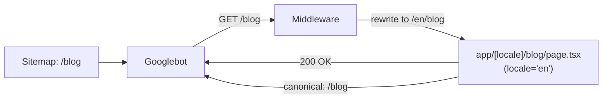
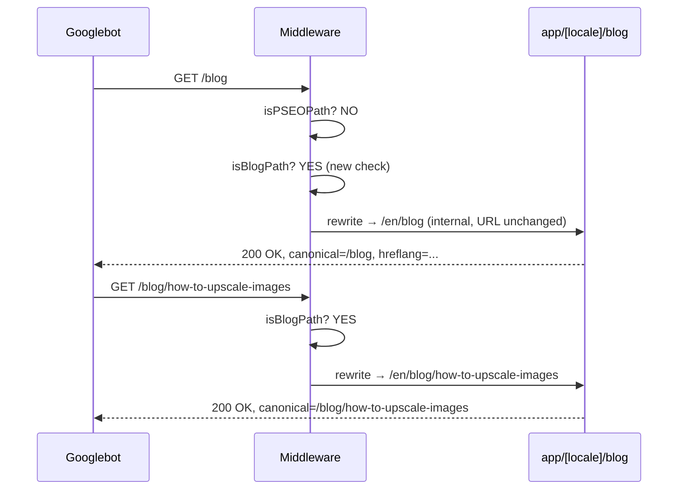

# PRD: Fix Blog Google Indexing

**Complexity: 3 → MEDIUM mode**
Score: +1 (touches 3-4 files) +2 (SEO-critical routing logic)

---

## 1. Context

**Problem:** Google cannot index blog posts because `/blog/*` URLs in the sitemap are silently HTTP-redirected to `/en/blog/*` by the middleware locale router, creating a redirect chain that breaks Google's sitemap-to-URL association.

**Files Analyzed:**
- `middleware.ts` (lines 304–367) — locale routing logic, `isPSEOPath` exemption list
- `app/sitemap-blog.xml/route.ts` — generates `/blog` and `/blog/{slug}` URLs
- `app/[locale]/blog/page.tsx` — blog listing (lives under locale prefix)
- `app/[locale]/blog/[slug]/page.tsx` — blog posts (lives under locale prefix)
- `next.config.js` — no rewrites configured
- `lib/seo/hreflang-generator.ts` — `getCanonicalUrl('/blog', 'en')` → `/blog` (correct)
- `tests/unit/seo/blog-faq-schema.unit.spec.ts` — existing blog SEO test

**Current Behavior:**
- Sitemap declares: `https://myimageupscaler.com/blog` and `https://myimageupscaler.com/blog/{slug}`
- Google visits `/blog` → middleware detects no locale prefix → redirects (302) to `/en/blog`
- Blog is NOT in `isPSEOPath` exemption list (unlike all other SEO paths)
- Actual route only exists at `app/[locale]/blog/` — no `app/blog/` counterpart
- Google Search Console shows "No referring sitemaps" for blog posts
- Result: zero impressions, zero indexing for all blog content

**Root Cause Confirmed:**
```
Googlebot → /blog (sitemap URL)
           → 302 redirect → /en/blog   ← middleware redirect
           → GSC cannot associate /blog (sitemap) with /en/blog (crawled)
           → "URL is not on Google"
```

**Canonical URLs are already correct** — `getCanonicalUrl('/blog', 'en')` returns `/blog` (no prefix). The page metadata is fine. Only the routing is broken.

---

## 2. Solution

**Approach:**
1. In `middleware.ts`, intercept `/blog` and `/blog/:slug` paths that lack a locale prefix and return a **Next.js internal rewrite** to `/en/blog` / `/en/blog/:slug` — this keeps the URL unchanged in Googlebot's view while serving content from the existing `app/[locale]/blog/` routes
2. The rewrite must happen **before** the general locale redirect logic
3. No new page files needed — reuses existing `app/[locale]/blog/` routes with `locale='en'`
4. Add sitemap unit tests to assert blog URLs are correct

**Why rewrite (not redirect):**
- `NextResponse.rewrite()` is an internal server-side map — the URL stays as `/blog`, no HTTP redirect
- Googlebot sees a clean 200 at `/blog` — matches the sitemap URL exactly
- Canonical tag on the page already points to `/blog` — no canonical mismatch

**Architecture:**



**Key Decisions:**
- Rewrite in `middleware.ts` (not `next.config.js`) — keeps routing logic co-located
- English-only blog — no hreflang needed on individual posts (already correct)
- Do NOT touch the `BLOCKED_BLOG_SLUGS` list — separate issue, out of scope
- Do NOT add blog to `isPSEOPath` (that pattern returns `null` and requires `app/blog/` to exist)

**Data Changes:** None

---

## 3. Sequence Flow



---

## 4. Execution Phases

### Phase 1: Middleware Rewrite — Blog served at canonical URLs

**Files (2):**
- `middleware.ts` — add blog rewrite block before locale redirect
- `tests/unit/seo/blog-sitemap-routing.unit.spec.ts` — new test file

**Implementation:**

In `middleware.ts`, inside `handleLocaleRouting`, add the following block **after** the `isPSEOPath` check (around line 365) and **before** the `const detectedLocale = detectLocale(req)` line:

```typescript
// Blog paths without locale prefix → rewrite to English blog
// Blog lives at app/[locale]/blog/ so /blog needs to be served as /en/blog
// Using internal rewrite (not redirect) so the URL stays as /blog for SEO
if ((pathname === '/blog' || pathname.startsWith('/blog/')) && !hasLocalePrefix) {
  const url = req.nextUrl.clone();
  url.pathname = `/en${pathname}`;
  return NextResponse.rewrite(url);
}
```

**Implementation steps:**
- [ ] Read the full `middleware.ts` `handleLocaleRouting` function to confirm insertion point
- [ ] Add the blog rewrite block at the correct position (after isPSEOPath check, before locale detection)
- [ ] Verify the condition covers `/blog` exactly and `/blog/any-slug` paths
- [ ] Ensure it does NOT match `/en/blog` (hasLocalePrefix guard handles this)

**Tests Required:**
| Test File | Test Name | Assertion |
|-----------|-----------|-----------|
| `tests/unit/seo/blog-sitemap-routing.unit.spec.ts` | `sitemap lists /blog not /en/blog` | Blog sitemap URL = `https://myimageupscaler.com/blog` |
| `tests/unit/seo/blog-sitemap-routing.unit.spec.ts` | `sitemap lists /blog/{slug} not /en/blog/{slug}` | Post URLs don't contain `/en/` prefix |
| `tests/unit/seo/blog-sitemap-routing.unit.spec.ts` | `blog sitemap contains at least 1 post` | `posts.length >= 1` |
| `tests/unit/seo/blog-sitemap-routing.unit.spec.ts` | `BLOCKED_BLOG_SLUGS are excluded from sitemap` | No blocked slug appears in sitemap output |

**Note:** Middleware logic cannot easily be unit-tested with Vitest — focus tests on sitemap output correctness. Middleware rewrite will be verified manually.

**User Verification:**
- Action: `curl -v https://myimageupscaler.com/blog` (or local dev equivalent)
- Expected: HTTP 200, no Location redirect header, page renders English blog content

---

### Phase 2: Validate and Run Full Verify

**Files (0 new):**
- Run `yarn verify` — should pass lint, typecheck, tests, i18n checks
- Run `yarn test` — confirm all unit tests pass including new ones

**Implementation steps:**
- [ ] Run `yarn verify` and confirm it passes
- [ ] Run `yarn test tests/unit/seo/` and confirm blog tests pass
- [ ] Manually check dev server: `curl -I http://localhost:3000/blog` → 200 (not 302/301)
- [ ] Manually check: `curl -I http://localhost:3000/blog/some-valid-slug` → 200 (not 302)
- [ ] Check `/en/blog` still works (direct locale-prefixed URL for non-English users)

**Tests Required:**
All existing SEO tests must continue to pass — run `yarn test tests/unit/seo/`

**User Verification:**
- Action: Open `http://localhost:3000/blog` in browser
- Expected: Blog listing page loads, no redirect in browser history

---

## 5. Checkpoint Protocol

After each phase, spawn `prd-work-reviewer` agent with:
```
PRD path: docs/PRDs/fix-blog-google-indexing.md
Phase: [N]
```

---

## 6. Verification Strategy

### Phase 1 Verification

**Unit Tests:**
- File: `tests/unit/seo/blog-sitemap-routing.unit.spec.ts`
- 4 tests verifying sitemap URL correctness

**Manual curl proof:**
```bash
# Should return 200, no redirect
curl -sv http://localhost:3000/blog 2>&1 | grep -E "< HTTP|< Location"
# Expected: < HTTP/1.1 200 OK  (no Location header)

# Individual post - should return 200
curl -sv http://localhost:3000/blog/ai-image-upscaling-complete-guide 2>&1 | grep -E "< HTTP|< Location"
# Expected: < HTTP/1.1 200 OK

# Locale-prefixed URL still works
curl -sv http://localhost:3000/en/blog 2>&1 | grep -E "< HTTP"
# Expected: < HTTP/1.1 200 OK
```

**Evidence Required:**
- [ ] `yarn test tests/unit/seo/blog-sitemap-routing.unit.spec.ts` → 4 tests passing
- [ ] `curl /blog` → 200, no redirect
- [ ] `yarn verify` → PASS

---

## 7. Acceptance Criteria

- [ ] `GET /blog` returns HTTP 200 (no redirect)
- [ ] `GET /blog/{any-valid-slug}` returns HTTP 200 (no redirect)
- [ ] Sitemap at `/sitemap-blog.xml` lists `/blog` URLs (not `/en/blog`)
- [ ] Canonical tag on the blog page remains `https://myimageupscaler.com/blog`
- [ ] `yarn verify` passes
- [ ] New unit tests pass
- [ ] `/en/blog` still works for non-English locale users (not broken by the change)

---

## 8. Post-Implementation Manual Step (GSC)

After deployment, the team must:
1. Go to Google Search Console → Sitemaps
2. Confirm `sitemap-blog.xml` is submitted (it should be via the sitemap index)
3. Use "URL Inspection" on a few blog URLs → "Request Indexing"
4. Monitor "Coverage" report over the next 1–2 weeks

This is a manual step outside the codebase — not part of this PRD's code changes.

---

## 9. Out of Scope

- **BLOCKED_BLOG_SLUGS** (17 posts returning 404) — separate issue; root cause likely missing MDX files
- Internal links from tool pages to blog posts — can be done after indexing is confirmed working
- Blog post hreflang tags — English-only blog, not needed
