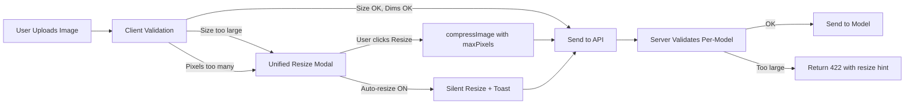
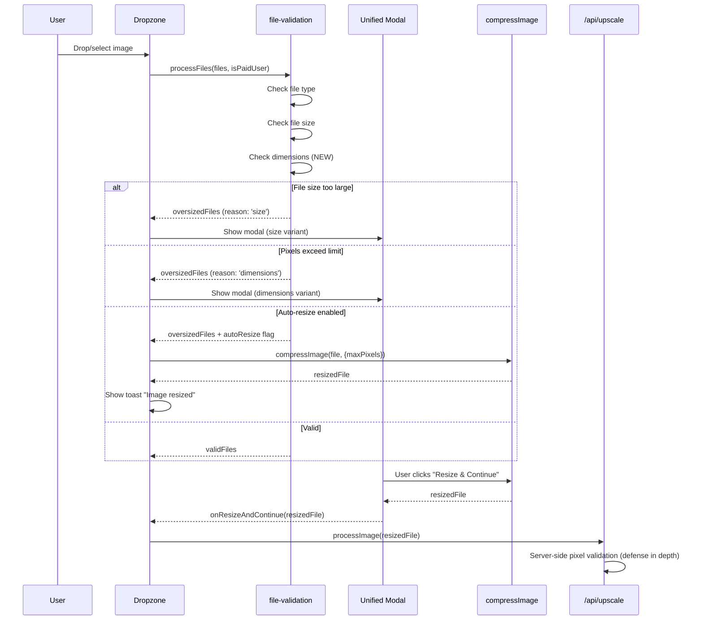

# PRD: Image Size Limits Per Model

**Complexity: 6 → MEDIUM mode**

## 1. Context

**Problem:** Users uploading large images cause two critical issues: (1) GPU memory errors on models like Real-ESRGAN that can't handle images >2M pixels, and (2) massive cost overruns on models like GFPGAN where processing time scales with image size (expected $0.001, actual $0.05 for 52s processing).

**Real incidents:**

- `nightmareai/real-esrgan`: Failed with "Input image of dimensions (2400, 1080, 3) has a total number of pixels 2592000 greater than the max size that fits in GPU memory on this hardware, 2096704"
- `tencentarc/gfpgan`: Succeeded but cost $0.05 instead of $0.001 (50x cost overrun) with 52s processing time

**Files Analyzed:**

- `shared/validation/upscale.schema.ts` — existing IMAGE_VALIDATION constants, dimension validation
- `shared/config/model-costs.config.ts` — model cost config with MAX_INPUT_RESOLUTION
- `server/services/model-registry.ts` — model configs with maxInputResolution
- `server/services/model-registry.types.ts` — IModelConfig type
- `client/components/features/image-processing/OversizedImageModal.tsx` — existing modal for file SIZE
- `client/components/features/image-processing/Dropzone.tsx` — file validation and modal triggering
- `client/utils/file-validation.ts` — processFiles() validates size only, not dimensions
- `client/utils/image-compression.ts` — compressToTargetSize() already supports maxPixels
- `app/api/upscale/route.ts` — server-side dimension validation (lines 326-347)

**Current Behavior:**

- File SIZE limits: 5MB free / 25MB paid — enforced client-side via Dropzone + OversizedImageModal
- Dimension validation: MIN 64px, MAX 8192px per axis — server-side only, generic limit
- MAX_PIXELS: 2,000,000 — defined in IMAGE_VALIDATION but **NOT enforced** in validateImageDimensions()
- All models share the same `MAX_INPUT_RESOLUTION: 2048*2048 = 4,194,304` — too high for Real-ESRGAN/GFPGAN which actually fail around ~2M pixels
- No client-side dimension checking — users upload, wait, then get server error
- No per-model pixel limits — a one-size-fits-all approach that doesn't match actual hardware constraints

## 2. Solution

**Approach:**

1. Add per-model `maxInputPixels` to model registry and shared config (different models have different GPU memory limits)
2. Add client-side dimension validation in `file-validation.ts` that reads image dimensions before upload
3. Extend the existing `OversizedImageModal` into a unified modal handling both file size AND dimension/pixel limit issues
4. Add user setting "Auto-resize before upload" (default: off) — when on, silently downsample; when off, show unified modal
5. Add server-side pixel limit enforcement per model (defense in depth)

**Architecture:**



**Key Decisions:**

- Per-model pixel limits based on actual hardware constraints (researched)
- Client-side Canvas API for dimension detection (already used in image-compression.ts)
- Reuse existing `compressImage()` with `maxPixels` option (already implemented!)
- Unified modal extending OversizedImageModal (not a separate component)
- "Auto-resize before upload" user preference stored in localStorage via Zustand

**Model Pixel Limits (researched from Replicate hardware + error data):**

| Model               | Max Input Pixels | Approx Max Dimensions | Rationale                                                                   |
| ------------------- | ---------------- | --------------------- | --------------------------------------------------------------------------- |
| `real-esrgan`       | 2,000,000        | ~1414x1414            | GPU memory error at 2,592,000. Hardware max is 2,096,704                    |
| `gfpgan`            | 2,000,000        | ~1414x1414            | Same hardware class (T4). No hard fail but 50x cost overrun on large images |
| `realesrgan-anime`  | 2,000,000        | ~1414x1414            | Same Real-ESRGAN architecture                                               |
| `clarity-upscaler`  | 4,000,000        | ~2000x2000            | Uses tiling (768px tiles), more tolerant. SD-based with A40/L40S hardware   |
| `nano-banana`       | 4,000,000        | ~2000x2000            | Gemini API, handles large inputs well                                       |
| `nano-banana-pro`   | 4,000,000        | ~2000x2000            | Gemini 3 Pro, supports up to 4K output natively                             |
| `flux-2-pro`        | 4,000,000        | ~2000x2000            | BFL model, L40S hardware, ~1MP auto-scaling                                 |
| `qwen-image-edit`   | 2,560,000        | ~1600x1600            | Max native resolution 2560x2560 but GPU constrained                         |
| `seedream`          | 4,000,000        | ~2000x2000            | Supports up to 4MP output                                                   |
| `p-image-edit`      | 2,073,600        | ~1440x1440            | Documented max 1440px per axis                                              |
| `flux-kontext-fast` | 1,048,576        | ~1024x1024            | Auto-scales to 1MP, larger inputs waste bandwidth                           |

**Conservative default: 2,000,000 pixels** (matches cheapest GPU tier). Models with higher limits explicitly opt in.

**Data Changes:** None (no DB changes). Pixel limits stored in code config.

## 3. Sequence Flow



## Integration Points Checklist

**How will this feature be reached?**

- [x] Entry point: User drops/selects image in Dropzone component
- [x] Caller file: `client/components/features/image-processing/Dropzone.tsx` calls `processFiles()`
- [x] Registration: `file-validation.ts` → `processFiles()` adds dimension checking

**Is this user-facing?**

- [x] YES → Unified OversizedImageModal (extended), Settings toggle for auto-resize

**Full user flow:**

1. User drops image that is 2400x1080 (2,592,000 pixels)
2. `processFiles()` loads image, checks dimensions, finds it exceeds 2M pixel limit
3. Modal shows: "Image dimensions (2400×1080) exceed Real-ESRGAN's maximum (2,000,000 pixels). Resize to continue."
4. User clicks "Resize & Continue" → image resized to fit within limit
5. Resized image uploaded and processed successfully

---

## 4. Execution Phases

### Phase 1: Per-Model Pixel Limits in Shared Config

**User-visible outcome:** Model pixel limits defined and accessible from both client and server.

**Files (3):**

- `shared/config/model-costs.config.ts` — Add per-model `MAX_INPUT_PIXELS` constants
- `shared/validation/upscale.schema.ts` — Update `IMAGE_VALIDATION.MAX_PIXELS` to be per-model aware, add `getMaxPixelsForModel()` helper
- `server/services/model-registry.ts` — Wire `maxInputPixels` into model configs (the `maxInputResolution` field already exists but is shared)

**Implementation:**

- [ ] Add `MODEL_MAX_INPUT_PIXELS` map to `model-costs.config.ts` with per-model limits
- [ ] Add `getMaxPixelsForModel(modelId: string): number` function to `upscale.schema.ts` that returns model-specific limit or default
- [ ] Keep `IMAGE_VALIDATION.MAX_PIXELS = 2_000_000` as the global default (most conservative)
- [ ] Update `maxInputResolution` in model registry configs to use per-model values from `MODEL_MAX_INPUT_PIXELS`

**Verification Plan:**

1. **Unit Tests:**
   - File: `tests/unit/seo/image-size-limits.unit.spec.ts`
   - Tests: `should return correct pixel limit for each model`, `should return default for unknown model`, `should have limits <= 4M for all models`

---

### Phase 2: Client-Side Dimension Validation

**User-visible outcome:** Images that are too large in pixel dimensions are caught before upload.

**Files (3):**

- `client/utils/file-validation.ts` — Add async dimension checking via Canvas API
- `client/utils/image-compression.ts` — Ensure `maxPixels` option works correctly (already partially implemented)
- `shared/validation/upscale.schema.ts` — Export `IMAGE_VALIDATION.MAX_PIXELS` (already exported)

**Implementation:**

- [ ] Add `loadImageDimensions(file: File): Promise<{width: number, height: number}>` to `file-validation.ts`
- [ ] Extend `IFileValidationResult` to include `reason: 'type' | 'size' | 'dimensions'` and optional `dimensions: {width, height, pixels}`
- [ ] Extend `IProcessFilesResult` to include `oversizedDimensionFiles: File[]` with their dimension metadata
- [ ] Make `processFiles()` async — loads images to check dimensions
- [ ] Use `IMAGE_VALIDATION.MAX_PIXELS` as the client-side default limit (2M, most conservative since we don't know the model yet at upload time)
- [ ] Update Dropzone's `handleFilesReceived` to handle async `processFiles()`

**Verification Plan:**

1. **Unit Tests:**
   - File: `tests/unit/client/file-validation.unit.spec.ts`
   - Tests: `should reject image exceeding MAX_PIXELS`, `should accept image within limits`, `should report correct dimensions for rejected file`, `should handle unloadable images gracefully`

---

### Phase 3: Unified OversizedImageModal

**User-visible outcome:** Single modal handles both file size AND pixel dimension issues with model-specific messaging.

**Files (4):**

- `client/components/features/image-processing/OversizedImageModal.tsx` — Extend to handle dimension limit variant
- `client/components/features/image-processing/Dropzone.tsx` — Pass reason/dimension data to modal
- `locales/en/workspace.json` — Add i18n strings for dimension limit messages
- `client/utils/file-validation.ts` — Export dimension metadata with oversized files

**Implementation:**

- [ ] Add `oversizeReason: 'size' | 'dimensions'` prop to `IOversizedImageModalProps`
- [ ] Add optional `dimensions?: {width: number, height: number, pixels: number, maxPixels: number}` prop
- [ ] Add `DimensionWarningBanner` component (similar to `WarningBanner` but shows pixel info)
- [ ] Show model-specific message: "Your image (2400×1080 = 2.6MP) exceeds the maximum for this processing mode (2.0MP). Resize to continue."
- [ ] Resize button: When reason is 'dimensions', compress using `maxPixels` option
- [ ] Add checkbox/toggle inside modal: "Always auto-resize in the future" → stores to localStorage
- [ ] Update Dropzone to pass `oversizeReason` and `dimensions` to modal
- [ ] Add i18n strings for: dimension warning, pixel count display, auto-resize toggle label

**Verification Plan:**

1. **Unit Tests:**
   - File: `tests/unit/client/oversized-image-modal.unit.spec.ts`
   - Tests: `should show dimension warning when reason is dimensions`, `should show size warning when reason is size`, `should call compressImage with maxPixels when resizing for dimensions`
2. **Manual Verification:**
   - Upload 2400x1080 image → modal shows with dimension warning
   - Click "Resize & Continue" → image resized, processing succeeds

---

### Phase 4: Auto-Resize Setting + Server-Side Defense

**User-visible outcome:** Users can enable "auto-resize before upload" in settings. Server validates per-model pixel limits as defense in depth.

**Files (5):**

- `client/store/userStore.ts` (or equivalent preferences store) — Add `autoResizeEnabled` preference
- `client/components/features/image-processing/Dropzone.tsx` — Check auto-resize preference, show toast instead of modal
- `app/api/upscale/route.ts` — Add per-model pixel validation before sending to Replicate
- `server/services/model-registry.ts` — Expose `getMaxInputPixels(modelId)` method
- `shared/config/model-costs.config.ts` — Already done in Phase 1, wire to server validation

**Implementation:**

- [ ] Add `autoResizeEnabled: boolean` to user preferences in Zustand store (localStorage persisted)
- [ ] In Dropzone: if `autoResizeEnabled` and files have dimension issues, auto-compress and show toast notification
- [ ] In upscale route (~line 327): after `decodeImageDimensions()`, check `pixels = w * h` against model-specific limit
- [ ] Return 422 with `{ error: { code: 'IMAGE_TOO_LARGE', message: '...', maxPixels: N } }` if exceeded
- [ ] Add `getMaxInputPixels(modelId: string): number` to ModelRegistry class
- [ ] Wire the check: resolve model first, then validate pixels against that model's limit

**Verification Plan:**

1. **Unit Tests:**
   - File: `tests/unit/server/image-pixel-validation.unit.spec.ts`
   - Tests: `should reject image exceeding model pixel limit`, `should accept image within model pixel limit`, `should use default limit for unknown models`
2. **Integration Test (curl):**
   ```bash
   # Should return 422 with IMAGE_TOO_LARGE error
   curl -X POST http://localhost:3000/api/upscale \
     -H "Authorization: Bearer $TOKEN" \
     -H "Content-Type: application/json" \
     -d '{"imageData": "<base64 of 2400x1080 image>", "config": {"qualityTier": "quick", "scale": 2}}' | jq .
   # Expected: {"error": {"code": "IMAGE_TOO_LARGE", "message": "...", "maxPixels": 2000000}}
   ```

---

## 5. Acceptance Criteria

- [ ] All 4 phases complete
- [ ] All specified tests pass
- [ ] `yarn verify` passes
- [ ] Uploading a 2400x1080 image shows the unified modal with dimension warning (not a server error)
- [ ] Clicking "Resize & Continue" in the modal successfully resizes and processes the image
- [ ] GFPGAN processing a 1400x1400 image costs ~$0.001-0.003 (not $0.05)
- [ ] Real-ESRGAN does not fail with GPU memory error for resized images
- [ ] Server-side validation returns 422 for images exceeding per-model pixel limits
- [ ] Auto-resize toggle works in modal and persists via localStorage
- [ ] Feature is reachable (upload oversized image → modal appears → resize works)

---

## Notes

### Why client-side validation uses the global MIN limit (2M pixels)

At the time of upload, we may not know which model will be selected (especially in "auto" mode). Using the most conservative limit (2M pixels, matching real-esrgan/gfpgan) ensures no image will fail on any model. If the user has selected a specific model that supports more pixels, the client could use a higher limit — but this is a future optimization.

### Replicate pricing model explains the GFPGAN cost issue

Replicate charges per second of GPU time. GFPGAN on T4 GPU at $0.000225/sec × 52 seconds = $0.0117. But the actual charge was $0.05, suggesting the large image caused auto-scaling to L40S ($0.00195/sec × 26s ≈ $0.05). This means larger images not only take longer but may trigger more expensive hardware.

### Existing infrastructure we're reusing

- `compressImage()` in `image-compression.ts` already supports `maxPixels` option with smart binary search for quality
- `OversizedImageModal` already has resize+continue flow with progress bar
- `IMAGE_VALIDATION.MAX_PIXELS` is already defined as 2,000,000
- `decodeImageDimensions()` already works server-side for JPEG/PNG/WebP
