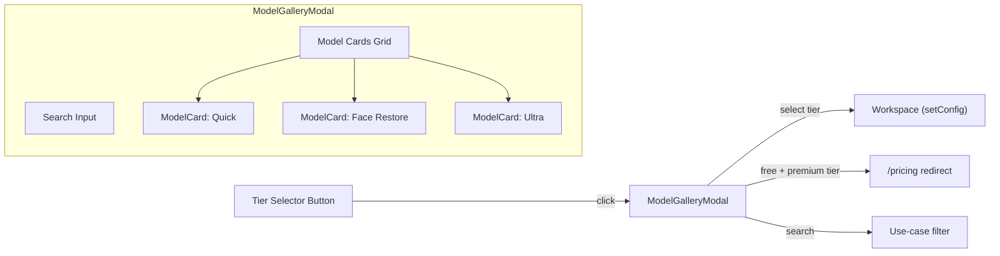
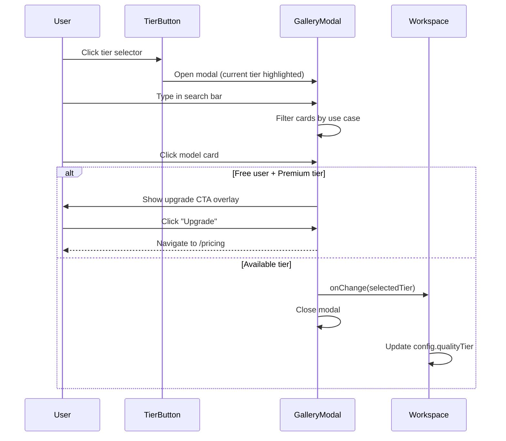

# PRD: Model Gallery - Quality Tier Redesign

> **Complexity: 6 → MEDIUM mode**
> (+2 new module from scratch, +2 touches 6-10 files, +1 UI component, +1 state logic)

## 1. Context

**Problem:** The Quality Tier selector is a dropdown with text-only labels (name + "best for" tagline + credit cost). Users have zero visual understanding of what each model actually produces. This kills conversion for premium tiers — why would someone pay 8 credits for "Ultra" when they can't see the difference from "Quick" at 1 credit?

**Files Analyzed:**

- `client/components/features/workspace/BatchSidebar/QualityTierSelector.tsx` — current dropdown implementation
- `client/components/features/workspace/Workspace.tsx` — parent orchestrator
- `client/components/features/workspace/BatchSidebar/ActionPanel.tsx` — process CTA + credit display
- `client/components/features/workspace/PreviewArea.tsx` — before/after slider (post-processing)
- `client/components/features/image-processing/ImageComparison.tsx` — existing comparison slider
- `shared/types/coreflow.types.ts` — `QualityTier`, `QUALITY_TIER_CONFIG`
- `shared/config/model-costs.config.ts` — model costs, premium tier lists

**Current Behavior:**

- Quality tier is selected via a dropdown with 11 text-only options
- Each option shows: label, "best for" tagline, credit cost badge
- Free users see "Available" (3 tiers) and "Professional Tiers" (8 tiers, locked)
- No visual preview of what each model produces — names like "HD Upscale" vs "Ultra" are meaningless without results
- The `ImageComparison` slider component exists but is only used post-processing in `PreviewArea`
- Mobile has a horizontal pill strip for tier selection (also text-only)

## 2. Solution

**Approach:**

- **Replace the dropdown** with a full **Model Gallery Modal** triggered by clicking the tier selector button
- Gallery shows a **visual card grid** with before/after thumbnail previews for each model
- Each card includes the model name, use cases, credit cost, and a compact before/after image pair
- A **search bar** at the top lets users filter by use case (e.g., "portrait", "anime", "print")
- Selecting a model auto-sets the quality tier and closes the modal
- **Free users see all models** — premium ones get a subtle lock overlay with "Upgrade" CTA
- **Mobile**: gallery opens as a **full-screen bottom sheet** with swipe-to-dismiss
- **Desktop**: centered modal with max-width constraint
- Before/after images stored in `public/before-after/{tier-slug}/before.webp` + `after.webp`
- Phase 1 ships with **placeholder images** — real model outputs added later

**Architecture:**



**Key Decisions:**

- Reuse `QUALITY_TIER_CONFIG` for all metadata — extend with `useCases: string[]` and `previewImages` fields
- Gallery modal is a new standalone component, not dependent on the old dropdown
- Use CSS `object-fit: cover` thumbnails in cards, not the full `ImageComparison` slider (too heavy for grid)
- Search filters against `label`, `bestFor`, and `useCases` fields (client-side, no API)
- Placeholder images: solid color cards with tier name overlay until real before/after images exist
- Mobile bottom sheet uses CSS `position: fixed` + `inset-0` + slide-up animation (no library)

**Data Changes:**

Extend `QUALITY_TIER_CONFIG` in `shared/types/coreflow.types.ts` with:

```typescript
useCases: string[];  // Searchable tags like ['portrait', 'old photo', 'damaged']
previewImages?: {    // Optional — null means use placeholder
  before: string;    // Path: '/before-after/quick/before.webp'
  after: string;     // Path: '/before-after/quick/after.webp'
};
```

## 3. Sequence Flow



## 4. Execution Phases

### Phase 1: Extend Quality Tier Config with Use Cases + Preview Paths

**User-visible outcome:** Quality tier config has searchable use case tags and image paths (data foundation).

**Files (3):**

- `shared/types/coreflow.types.ts` — Add `useCases` and `previewImages` to `QUALITY_TIER_CONFIG` type and data
- `tests/unit/shared/quality-tier-config.unit.spec.ts` — Update existing tests for new fields
- `public/before-after/` — Create directory structure with placeholder README

**Implementation:**

- [ ] Extend the `QUALITY_TIER_CONFIG` record type to include `useCases: string[]` and `previewImages: { before: string; after: string } | null`
- [ ] Add curated `useCases` arrays to each tier entry (e.g., Quick: `['social media', 'web', 'fast', 'general']`, Face Pro: `['portrait', 'headshot', 'professional', 'face', 'skin']`)
- [ ] Set `previewImages: null` for all tiers initially (placeholder mode)
- [ ] Create `public/before-after/` directory with a `.gitkeep` file
- [ ] Update existing unit tests to validate new fields

**Tests Required:**

| Test File                                            | Test Name                                         | Assertion                                             |
| ---------------------------------------------------- | ------------------------------------------------- | ----------------------------------------------------- |
| `tests/unit/shared/quality-tier-config.unit.spec.ts` | `should have useCases array for every tier`       | Every tier has non-empty `useCases` array             |
| `tests/unit/shared/quality-tier-config.unit.spec.ts` | `should have previewImages field for every tier`  | Every tier has `previewImages` (null or valid object) |
| `tests/unit/shared/quality-tier-config.unit.spec.ts` | `useCases should be lowercase searchable strings` | All use case strings are lowercase                    |

**Verification Plan:**

1. Unit tests: `yarn test tests/unit/shared/quality-tier-config.unit.spec.ts`
2. Type check: `yarn tsc --noEmit`
3. `yarn verify` passes

---

### Phase 2: Build ModelGalleryModal Component (Desktop + Mobile)

**User-visible outcome:** A visually striking modal that displays all quality tiers as cards with before/after previews, a search bar, and responsive layout.

**Files (5):**

- `client/components/features/workspace/ModelGalleryModal.tsx` — New gallery modal component
- `client/components/features/workspace/ModelCard.tsx` — Individual model card with preview
- `client/components/features/workspace/ModelGallerySearch.tsx` — Search input with filtering logic
- `client/components/ui/BottomSheet.tsx` — Reusable mobile bottom sheet wrapper
- `client/utils/cn.ts` — Verify `cn` utility exists (should already)

**Implementation:**

- [ ] **BottomSheet component**: Mobile full-screen slide-up overlay with backdrop, swipe-to-dismiss hint, `position: fixed; inset: 0`, slide-up animation via CSS transforms. On desktop: centered modal with `max-w-4xl`, backdrop blur, scale-in animation.
- [ ] **ModelCard component**:
  - Shows before/after thumbnail side-by-side (or placeholder gradient card if no images)
  - Model name, use cases as subtle tags, credit cost badge
  - Selected state: accent border + checkmark
  - Locked state (premium + free user): grayscale overlay + lock icon + "Upgrade" tag
  - Hover: subtle scale + border highlight
  - Click handler: calls `onSelect(tier)` or navigates to `/pricing` if locked
- [ ] **ModelGallerySearch component**:
  - Clean search input with icon
  - Filters tiers by matching `label`, `bestFor`, or `useCases` against query (case-insensitive, partial match)
  - Debounced input (150ms)
  - Shows "No results" state with suggestion to clear search
- [ ] **ModelGalleryModal component**:
  - Orchestrates: search bar at top, grid of ModelCards below
  - Available tiers section + Professional tiers section (like current dropdown grouping)
  - Passes `currentTier`, `isFreeUser`, `onSelect`, `onClose` props
  - On select: calls `onSelect(tier)` + closes modal
  - Keyboard: Escape closes, focus trap inside modal
  - Scroll: modal body scrolls independently

**Design Direction — Aesthetic:**

- **Tone**: Premium editorial feel. Think high-end camera comparison site, not generic SaaS modal.
- **Typography**: Use existing project fonts but with confident sizing — large tier names, subtle secondary text
- **Color**: Dark surface with glass morphism. Selected card gets accent glow. Premium locked cards have a subtle warm gold tint on the lock overlay (not just gray).
- **Grid**: 2 columns on desktop (spacious cards), 1 column on mobile (full-width cards)
- **Cards**: `rounded-2xl` with `border border-border`. Before/after thumbnails fill the top 60% of the card. Info section below.
- **Placeholders**: When `previewImages` is null, show a gradient placeholder with the tier name and a camera icon — styled enough to not look broken.
- **Transitions**: Cards stagger-in with `animation-delay` on mount. Modal slides up on mobile, scales in on desktop.
- **Search**: Minimal — just an input with a search icon, no border, glass bg. Results filter instantly with fade transition.

**Tests Required:**

| Test File                                            | Test Name                                              | Assertion                               |
| ---------------------------------------------------- | ------------------------------------------------------ | --------------------------------------- |
| `tests/unit/client/model-gallery-modal.unit.spec.ts` | `should render all quality tiers as cards`             | 11 cards rendered                       |
| `tests/unit/client/model-gallery-modal.unit.spec.ts` | `should filter tiers by search query`                  | Searching "anime" shows only anime tier |
| `tests/unit/client/model-gallery-modal.unit.spec.ts` | `should mark premium tiers as locked for free users`   | Premium cards show lock state           |
| `tests/unit/client/model-gallery-modal.unit.spec.ts` | `should call onSelect when available tier clicked`     | Callback fires with tier id             |
| `tests/unit/client/model-gallery-modal.unit.spec.ts` | `should navigate to /pricing when locked tier clicked` | Router push called                      |
| `tests/unit/client/model-gallery-modal.unit.spec.ts` | `should highlight currently selected tier`             | Selected card has accent styling        |
| `tests/unit/client/model-gallery-modal.unit.spec.ts` | `should show placeholder when previewImages is null`   | Placeholder element visible             |

**Verification Plan:**

1. Unit tests: `yarn test tests/unit/client/model-gallery-modal.unit.spec.ts`
2. Type check: `yarn tsc --noEmit`
3. Manual: Open modal on desktop and mobile viewport sizes
4. `yarn verify` passes

---

### Phase 3: Integrate Gallery Modal into Workspace (Replace Dropdown)

**User-visible outcome:** Clicking the quality tier selector in the sidebar opens the gallery modal instead of a dropdown. Selecting a model closes the modal and updates the active tier. Mobile tier strip also triggers the gallery.

**Files (4):**

- `client/components/features/workspace/BatchSidebar/QualityTierSelector.tsx` — Rewrite: button trigger + modal (remove dropdown)
- `client/components/features/workspace/Workspace.tsx` — Update mobile tier strip to trigger gallery modal
- `client/components/features/workspace/BatchSidebar/index.tsx` (or `BatchSidebar.tsx`) — Ensure QualityTierSelector props pass through
- `tests/unit/client/quality-tier-selector.unit.spec.ts` — New/updated tests for modal-based selector

**Implementation:**

- [ ] **QualityTierSelector rewrite:**
  - Keep the trigger button (shows current tier name + bestFor + credit badge) — same look as today
  - Remove all dropdown state/rendering (`isOpen`, dropdown menu, inline tier list)
  - On click: open `ModelGalleryModal`
  - Pass `onSelect` that calls the existing `onChange` prop
  - Pass `isFreeUser` and `currentTier` to modal
- [ ] **Workspace mobile tier strip update:**
  - Replace the horizontal pill buttons with a single "Quality: {tierName}" button that opens the same `ModelGalleryModal`
  - On mobile, the gallery opens as a full-screen bottom sheet
- [ ] **Cleanup:** Remove unused imports/styles from the old dropdown

**Tests Required:**

| Test File                                              | Test Name                                             | Assertion                        |
| ------------------------------------------------------ | ----------------------------------------------------- | -------------------------------- |
| `tests/unit/client/quality-tier-selector.unit.spec.ts` | `should open gallery modal on click`                  | Modal visible after click        |
| `tests/unit/client/quality-tier-selector.unit.spec.ts` | `should update tier when model selected from gallery` | onChange called with new tier    |
| `tests/unit/client/quality-tier-selector.unit.spec.ts` | `should display current tier in trigger button`       | Button shows tier label          |
| `tests/unit/client/quality-tier-selector.unit.spec.ts` | `should not open when disabled`                       | Modal stays closed when disabled |

**Verification Plan:**

1. Unit tests: `yarn test tests/unit/client/quality-tier-selector.unit.spec.ts`
2. Manual (desktop): Click tier button → gallery opens → select tier → modal closes, tier updates in sidebar
3. Manual (mobile): Tap tier button → full-screen gallery → select → returns to workspace with new tier
4. `yarn verify` passes

---

### Phase 4: Add Before/After Image Support + Placeholder System

**User-visible outcome:** Gallery cards display actual before/after image thumbnails when available, and styled placeholders when not. System ready for real images to be dropped into `public/before-after/`.

**Files (4):**

- `client/components/features/workspace/ModelCard.tsx` — Add image loading, error fallback, placeholder logic
- `public/before-after/` — Create directory structure for all 11 tiers (empty for now)
- `shared/types/coreflow.types.ts` — Update `previewImages` paths once directory structure exists
- `tests/unit/client/model-card.unit.spec.ts` — Image loading and fallback tests

**Implementation:**

- [ ] **Directory structure:** Create `public/before-after/{tier}/` for each tier:
  ```
  public/before-after/
  ├── quick/
  ├── face-restore/
  ├── fast-edit/
  ├── budget-edit/
  ├── seedream-edit/
  ├── anime-upscale/
  ├── hd-upscale/
  ├── face-pro/
  ├── ultra/
  ├── bg-removal/
  └── auto/
  ```
  Each folder expects `before.webp` and `after.webp` (not committed yet — just `.gitkeep`)
- [ ] **ModelCard image handling:**
  - Try to load `previewImages.before` and `previewImages.after`
  - On error (file doesn't exist yet): fall back to styled placeholder
  - Placeholder: gradient background matching the tier's section color (accent for available, secondary for premium) with tier name + use case icon
  - Use `next/image` or `` with `loading="lazy"` for performance
- [ ] **Update `QUALITY_TIER_CONFIG`**: Set `previewImages` paths for all tiers (paths point to the directories, images will be added later)

**Tests Required:**

| Test File                                   | Test Name                                          | Assertion                         |
| ------------------------------------------- | -------------------------------------------------- | --------------------------------- |
| `tests/unit/client/model-card.unit.spec.ts` | `should render placeholder when images not found`  | Placeholder element visible       |
| `tests/unit/client/model-card.unit.spec.ts` | `should render before/after images when available` | Two img elements with correct src |
| `tests/unit/client/model-card.unit.spec.ts` | `should fall back to placeholder on image error`   | Placeholder shown after onError   |

**Verification Plan:**

1. Unit tests: `yarn test tests/unit/client/model-card.unit.spec.ts`
2. Manual: Gallery shows styled placeholders (not broken images)
3. Manual: Drop test images into one tier folder → card shows real images
4. `yarn verify` passes

---

## 5. Acceptance Criteria

- [ ] All 4 phases complete
- [ ] All specified tests pass
- [ ] `yarn verify` passes
- [ ] Quality tier selector button click opens gallery modal (not dropdown)
- [ ] Gallery shows all 11 tiers with visual previews (placeholders for now)
- [ ] Search bar filters tiers by use case, name, or "best for" text
- [ ] Selecting a tier from gallery updates the active quality tier
- [ ] Premium tiers show lock overlay + upgrade CTA for free users
- [ ] Mobile: gallery opens as full-screen bottom sheet
- [ ] Desktop: gallery opens as centered modal
- [ ] Existing before/after slider in PreviewArea (post-processing) is NOT affected
- [ ] No TypeScript errors, no lint errors
- [ ] Placeholder system gracefully handles missing images (no broken image icons)

## 6. Integration Points Checklist

**How will this feature be reached?**

- [x] Entry point: Click on QualityTierSelector button in BatchSidebar
- [x] Entry point (mobile): Click on tier label in mobile quality tier strip
- [x] Caller files: `QualityTierSelector.tsx` and `Workspace.tsx`
- [x] No new routes needed — modal renders inline

**Is this user-facing?**

- [x] YES — This replaces the primary model selection UI in the workspace

**Full user flow:**

1. User uploads image(s) to workspace
2. User clicks quality tier selector button
3. Gallery modal opens showing all tiers as visual cards
4. User optionally searches by use case ("portrait", "anime", etc.)
5. User clicks a tier card → tier is selected, modal closes
6. Workspace sidebar shows updated tier; user proceeds to process

## 7. Out of Scope

- Actual before/after images (will be added to `public/before-after/` separately)
- Changes to the processing pipeline or API
- Changes to the ImageComparison slider used post-processing
- A/B testing framework for the new vs old selector
- Analytics event tracking for gallery interactions (can be added later)
