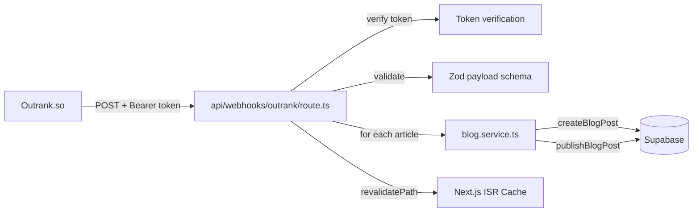
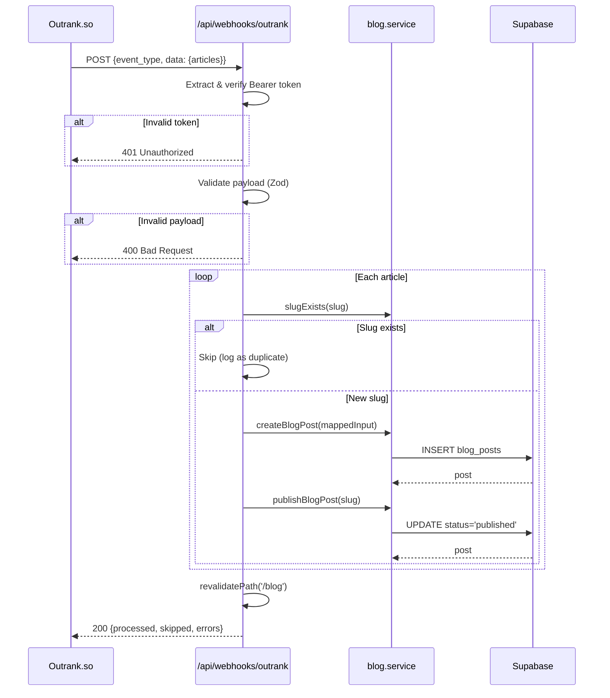

# PRD: Outrank.so Webhook Integration

**Complexity: 4 → MEDIUM mode**

| Factor                       | Score |
| ---------------------------- | ----- |
| Files touched (5-6)          | +2    |
| External API integration     | +1    |
| New module (webhook handler) | +1    |

---

## Integration Points Checklist

**How will this feature be reached?**

- [x] Entry point: `POST /api/webhooks/outrank` — called by Outrank.so when articles are published
- [x] Caller: Outrank.so external service (HTTP POST with JSON payload)
- [x] Registration/wiring: Already covered by `/api/webhooks/*` wildcard in `PUBLIC_API_ROUTES` and rate-limit bypass

**Is this user-facing?**

- [x] NO → Background webhook receiver. Articles appear on `/blog` after processing.

**Full flow:**

1. Outrank.so publishes article(s) → sends POST to `/api/webhooks/outrank`
2. Route handler verifies Bearer token against `OUTRANK_WEBHOOK_SECRET`
3. Validates payload with Zod, maps each article to `ICreateBlogPostInput`
4. For each article: `createBlogPost()` → `publishBlogPost()` → `revalidatePath('/blog')`
5. Returns 200 with summary of processed articles

---

## 1. Context

**Problem:** Blog posts are written in Outrank.so but must be manually transferred to our blog. We need an automated webhook receiver that creates and publishes blog posts when Outrank publishes articles.

**Files Analyzed:**

- `shared/config/env.ts` — env var registration pattern
- `shared/config/security.ts` — PUBLIC_API_ROUTES (webhooks already whitelisted)
- `shared/validation/blog.schema.ts` — `createBlogPostSchema`, `ICreateBlogPostInput`
- `server/services/blog.service.ts` — `createBlogPost()`, `publishBlogPost()`, `slugExists()`
- `app/api/webhooks/stripe/route.ts` — webhook handler pattern
- `app/api/blog/posts/route.ts` — blog creation route pattern
- `app/api/blog/posts/[slug]/publish/route.ts` — publish + revalidation pattern
- `lib/middleware/blogApiAuth.ts` — existing API key auth pattern
- `lib/middleware/rateLimit.ts` — webhooks exempted from rate limiting

**Current Behavior:**

- Blog posts are created manually via `POST /api/blog/posts` + `POST /api/blog/posts/[slug]/publish`
- No Outrank.so integration exists
- Webhook routes at `/api/webhooks/*` are already public (no JWT required) and rate-limit exempt

---

## 2. Solution

**Approach:**

- Create a new webhook endpoint at `POST /api/webhooks/outrank` following the Stripe webhook pattern
- Verify requests via Bearer token matching `OUTRANK_WEBHOOK_SECRET` env var
- Validate the incoming payload with a Zod schema matching Outrank's documented format
- Map Outrank article fields → `ICreateBlogPostInput` (slug sanitization, content selection, tag mapping)
- Create + publish each article, handling duplicates gracefully (skip if slug exists)
- Revalidate `/blog` paths for instant visibility

**Architecture:**



**Key Decisions:**

- **Bearer token auth** (not HMAC) — matches Outrank.so's documented `Authorization: Bearer <token>` pattern
- **Reuse existing `blog.service.ts`** — DRY, battle-tested create/publish flow
- **Prefer `content_html`** from Outrank payload — our blog renders HTML content, and Outrank sends both markdown and HTML
- **Graceful duplicate handling** — if slug already exists, skip (don't fail the entire webhook)
- **Auto-publish** — articles arrive published from Outrank, so we create and immediately publish

**Data Changes:** None — uses existing `blog_posts` table. One new env var: `OUTRANK_WEBHOOK_SECRET`.

---

## 3. Sequence Flow



---

## 4. Execution Phases

### Phase 1: Environment Variable & Zod Payload Schema

**User-visible outcome:** `OUTRANK_WEBHOOK_SECRET` registered in env config; Outrank payload validated via typed Zod schema.

**Files (3):**

- `shared/config/env.ts` — Add `OUTRANK_WEBHOOK_SECRET` to `serverEnvSchema` + `loadServerEnv()`
- `shared/validation/outrank-webhook.schema.ts` — **NEW** Zod schema for Outrank payload + article-to-blog mapper
- `tests/unit/outrank-webhook.unit.spec.ts` — **NEW** Unit tests for schema validation + mapping

**Implementation:**

- [ ] Add `OUTRANK_WEBHOOK_SECRET: z.string().default('')` to `serverEnvSchema` (after `BLOG_API_KEY` block)
- [ ] Add `OUTRANK_WEBHOOK_SECRET: process.env.OUTRANK_WEBHOOK_SECRET || ''` to `loadServerEnv()`
- [ ] Create Zod schema for Outrank webhook payload:

  ```typescript
  // Outrank article shape
  const outrankArticleSchema = z.object({
    id: z.string(),
    title: z.string().min(1),
    content_markdown: z.string().optional(),
    content_html: z.string().min(1),
    meta_description: z.string().optional(),
    created_at: z.string().optional(),
    image_url: z.string().url().optional().or(z.literal('')),
    slug: z.string().min(1),
    tags: z.array(z.string()).optional().default([]),
  });

  // Full webhook payload
  const outrankWebhookPayloadSchema = z.object({
    event_type: z.literal('publish_articles'),
    timestamp: z.string().optional(),
    data: z.object({
      articles: z.array(outrankArticleSchema).min(1),
    }),
  });
  ```

- [ ] Create mapper function `mapOutrankArticleToBlogInput(article)` → `ICreateBlogPostInput`:
  - Sanitize slug: lowercase, replace non-alphanumeric with hyphens, collapse multiple hyphens, trim hyphens from start/end
  - Use `content_html` for content (fallback to `content_markdown`)
  - Map `meta_description` → `seo_description` (truncate to 160 chars)
  - Map `title` → `seo_title` (truncate to 70 chars)
  - Map `image_url` → `featured_image_url`
  - Map `tags` → `tags` (max 10)
  - Default `category` to `'blog'`
  - Default `author` to `'MyImageUpscaler Team'`
  - Generate `description` from `meta_description` or first ~150 chars of content stripped of HTML

**Tests Required:**

| Test File                                 | Test Name                                           | Assertion                                    |
| ----------------------------------------- | --------------------------------------------------- | -------------------------------------------- |
| `tests/unit/outrank-webhook.unit.spec.ts` | `should validate a valid Outrank payload`           | Schema parses without error                  |
| `tests/unit/outrank-webhook.unit.spec.ts` | `should reject payload with missing articles`       | Schema throws ZodError                       |
| `tests/unit/outrank-webhook.unit.spec.ts` | `should reject payload with wrong event_type`       | Schema throws ZodError                       |
| `tests/unit/outrank-webhook.unit.spec.ts` | `should sanitize slug with special characters`      | `"My Article Title!"` → `"my-article-title"` |
| `tests/unit/outrank-webhook.unit.spec.ts` | `should truncate seo_title to 70 chars`             | Output `seo_title.length <= 70`              |
| `tests/unit/outrank-webhook.unit.spec.ts` | `should truncate seo_description to 160 chars`      | Output `seo_description.length <= 160`       |
| `tests/unit/outrank-webhook.unit.spec.ts` | `should use content_html over content_markdown`     | content equals HTML value                    |
| `tests/unit/outrank-webhook.unit.spec.ts` | `should generate description from meta_description` | description is populated                     |
| `tests/unit/outrank-webhook.unit.spec.ts` | `should handle empty image_url`                     | `featured_image_url` is undefined            |

**Verification Plan:**

1. **Unit tests:** Schema validation + mapper logic
2. **Evidence:** `yarn test tests/unit/outrank-webhook.unit.spec.ts` passes

---

### Phase 2: Webhook Route Handler

**User-visible outcome:** `POST /api/webhooks/outrank` receives articles from Outrank.so, creates and publishes blog posts, and returns a summary response.

**Files (2):**

- `app/api/webhooks/outrank/route.ts` — **NEW** webhook POST handler
- `tests/unit/outrank-webhook.unit.spec.ts` — Add integration-style tests for the route handler

**Implementation:**

- [ ] Create route handler at `app/api/webhooks/outrank/route.ts`:
  - Extract `Authorization: Bearer <token>` from request headers
  - Compare token against `serverEnv.OUTRANK_WEBHOOK_SECRET`
  - If secret is empty string (not configured), return 503 Service Unavailable
  - If token mismatch, return 401 with `{ message: "Unauthorized" }`
  - Parse request body as JSON
  - Validate with `outrankWebhookPayloadSchema`
  - If validation fails, return 400 with details
  - For each article in `data.articles`:
    - Map to `ICreateBlogPostInput` using `mapOutrankArticleToBlogInput()`
    - Check `slugExists(slug)` — if exists, add to `skipped` array, continue
    - Call `createBlogPost(input)` — on error, add to `errors` array, continue
    - Call `publishBlogPost(slug)` — on error, log warning but don't fail
  - Revalidate `/blog` and `/blog/[slug]` for each created post
  - Return 200 with `{ success: true, processed: [...], skipped: [...], errors: [...] }`
- [ ] Use `createLogger(request, 'outrank-webhook')` for structured logging
- [ ] Log: incoming event, each article processed/skipped/errored, final summary

**Tests Required:**

| Test File                                 | Test Name                                         | Assertion                                   |
| ----------------------------------------- | ------------------------------------------------- | ------------------------------------------- |
| `tests/unit/outrank-webhook.unit.spec.ts` | `should return 401 when no auth header`           | status 401                                  |
| `tests/unit/outrank-webhook.unit.spec.ts` | `should return 401 when token is wrong`           | status 401                                  |
| `tests/unit/outrank-webhook.unit.spec.ts` | `should return 503 when secret is not configured` | status 503                                  |
| `tests/unit/outrank-webhook.unit.spec.ts` | `should return 400 for invalid payload`           | status 400                                  |
| `tests/unit/outrank-webhook.unit.spec.ts` | `should create and publish a valid article`       | `createBlogPost` + `publishBlogPost` called |
| `tests/unit/outrank-webhook.unit.spec.ts` | `should skip duplicate slugs`                     | `skipped` array contains slug               |
| `tests/unit/outrank-webhook.unit.spec.ts` | `should handle multiple articles in one payload`  | all articles processed                      |
| `tests/unit/outrank-webhook.unit.spec.ts` | `should continue processing if one article fails` | other articles still processed              |

**Verification Plan:**

1. **Unit tests:** Mock `blog.service` functions, test auth/validation/processing logic
2. **curl proof:**

   ```bash
   # Happy path
   curl -X POST http://localhost:3000/api/webhooks/outrank \
     -H "Authorization: Bearer $OUTRANK_WEBHOOK_SECRET" \
     -H "Content-Type: application/json" \
     -d '{
       "event_type": "publish_articles",
       "timestamp": "2026-02-24T12:00:00Z",
       "data": {
         "articles": [{
           "id": "test-123",
           "title": "Test Article from Outrank",
           "content_html": "<p>This is a test article with enough content to pass the minimum 100 character validation requirement for blog posts.</p>",
           "meta_description": "A test article",
           "slug": "test-article-from-outrank",
           "tags": ["test"]
         }]
       }
     }'
   # Expected: {"success": true, "processed": ["test-article-from-outrank"], "skipped": [], "errors": []}

   # Missing auth
   curl -X POST http://localhost:3000/api/webhooks/outrank \
     -H "Content-Type: application/json" \
     -d '{}'
   # Expected: 401 Unauthorized
   ```

3. **Evidence:** All tests pass, `yarn verify` passes

---

## 5. Acceptance Criteria

- [ ] `OUTRANK_WEBHOOK_SECRET` env var registered in `shared/config/env.ts`
- [ ] Zod schema validates Outrank payload structure
- [ ] Bearer token authentication enforced
- [ ] Articles mapped correctly to `ICreateBlogPostInput` (slug sanitization, content, SEO fields)
- [ ] Duplicate slugs skipped gracefully (not rejected)
- [ ] Blog posts created as drafts then immediately published
- [ ] `/blog` paths revalidated after publish
- [ ] Structured logging for all events (received, processed, skipped, errors)
- [ ] All unit tests pass
- [ ] `yarn verify` passes
- [ ] No orphaned code — webhook is reachable via standard POST
