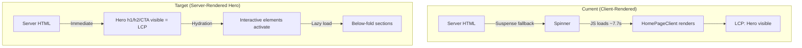
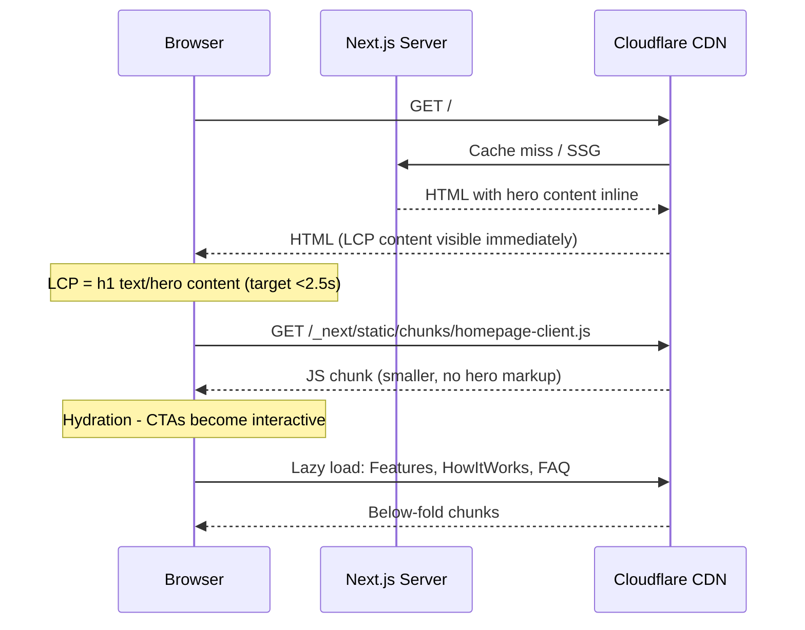

# PRD: PageSpeed Performance Fixes

**Complexity: 7 → HIGH mode** (10+ files, multi-package changes, performance-critical)

**Date:** 2026-02-25
**Source:** `docs/pagespeed-report-2026-02-25.md`
**Goal:** Mobile performance 63 → 90+, fix all Best Practices & Accessibility issues

---

## 1. Context

**Problem:** Mobile PageSpeed score is 63/100 driven by LCP 7.7s, TBT 410ms, TTI 7.8s, and TTFB 1,180ms. The homepage is rendered entirely as a client component (`HomePageClient`), which means the browser must download, parse, and execute JS before any meaningful content is visible.

**Files Analyzed:**

- `app/[locale]/page.tsx` — homepage server component (wraps `HomePageClient` in Suspense)
- `app/[locale]/layout.tsx` — root locale layout with fonts, analytics, providers
- `client/components/pages/HomePageClient.tsx` — entire homepage content (465 lines, `'use client'`)
- `client/components/landing/HeroBeforeAfter.tsx` — hero slider component
- `client/components/landing/AmbientBackground.tsx` — decorative background orbs
- `client/components/ui/BeforeAfterSlider.tsx` — interactive image comparison
- `client/components/ui/MotionWrappers.tsx` — framer-motion animation utilities
- `client/components/features/landing/Features.tsx` — feature cards section (lazy loaded)
- `client/components/features/landing/HowItWorks.tsx` — how-it-works section (lazy loaded)
- `client/components/analytics/GoogleAnalytics.tsx` — GA4 (already `lazyOnload`)
- `client/components/analytics/AhrefsAnalytics.tsx` — Ahrefs (already `lazyOnload`)
- `client/components/analytics/AnalyticsProvider.tsx` — Amplitude (dynamic import)
- `client/components/ClientProviders.tsx` — providers wrapper
- `client/components/layout/Layout.tsx` — main layout
- `client/styles/index.css` — global CSS with CSS variables
- `next.config.js` — Next.js configuration
- `tailwind.config.js` — Tailwind configuration
- `package.json` — dependencies and browserslist

**Current Behavior:**

- Homepage server component renders a `<Suspense>` wrapper around `<HomePageClient />` with a spinner fallback
- The spinner is the only thing visible until the full JS bundle is downloaded and hydrated — this IS the LCP (spinner → real content swap is 7.7s)
- The hero before/after images are preloaded in `<head>` (bird-after.webp/bird-before.webp) but the slider renders v2 versions (bird-after-v2.webp/bird-before-v2.webp) — **preloads are wasted on wrong files**
- `framer-motion` is imported directly in the hero section (not lazy loaded), adding significant JS to the critical path
- `images.unoptimized: true` in next.config.js means Next.js serves raw images without optimization
- `text-text-muted` color (`107 107 141` on `10 10 31` background) likely fails WCAG AA contrast check

---

## 2. Solution

**Approach:**

1. **Convert hero section to Server Component** — Move the static hero markup (heading, subheading, description, CTA buttons) out of `HomePageClient` into the server-rendered `page.tsx`. This makes the LCP content (h1 text) available in the initial HTML without waiting for JS.
2. **Fix image preloads** — Update preload links to match actual image filenames (`bird-after-v2.webp` / `bird-before-v2.webp`).
3. **Lazy-load framer-motion for hero animations** — Use CSS animations for above-the-fold hero instead of framer-motion, or wrap framer-motion content in `next/dynamic` with SSR disabled.
4. **Audit and code-split the 228 KiB unused chunk** — Run bundle analyzer to identify the chunk, then use `next/dynamic` to lazy-load it.
5. **Fix color contrast** — Update `--color-text-muted` CSS variable to meet WCAG AA (4.5:1 ratio).
6. **Fix bfcache** — No `unload`/`beforeunload` listeners found in codebase; likely caused by third-party scripts (Stripe, Amplitude, Baselime). Document limitation.

**Architecture Diagram:**

**Key Decisions:**

- Use CSS `@keyframes` for hero fade-in instead of framer-motion (zero JS cost)
- Keep `HomePageClient` for interactive parts only (auth modals, search params handling, below-fold content)
- Framer-motion stays lazy-loaded for below-fold sections (already using `React.lazy`)
- Do NOT enable Next.js image optimization (requires image loader on Cloudflare which isn't set up)

**Data Changes:** None

---

## 3. Sequence Flow

---

## 4. Execution Phases

### Phase 1: Fix Image Preloads & Server-Render Hero Content

**User-visible outcome:** Hero text (h1, h2, description) appears in initial HTML without waiting for JS. LCP drops from 7.7s to <3s.

**Files (5):**

- `app/[locale]/layout.tsx` — fix preload hrefs to v2 images
- `app/[locale]/page.tsx` — inline hero content as server-rendered HTML
- `client/components/pages/HomePageClient.tsx` — remove hero markup, keep interactive parts only
- `client/styles/index.css` — add CSS-only hero fade-in animation
- `client/components/landing/HeroBeforeAfter.tsx` — no changes needed (stays client)

**Implementation:**

- [ ] In `layout.tsx`, change preload `href` from `bird-after.webp` to `bird-after-v2.webp` and `bird-before.webp` to `bird-before-v2.webp`
- [ ] In `page.tsx`, render the hero section server-side: h1, h2, description paragraph, and static CTA buttons (link to `/pricing`, link with `data-action="register"`)
- [ ] Create a new small client component `HeroActions.tsx` that handles the auth modal CTA buttons only (uses `useModalStore`, `useTranslations`)
- [ ] Create a `HeroSection.tsx` server component that wraps the server-rendered hero text + `<HeroActions />` (client boundary) + `<HeroBeforeAfter />` (client boundary)
- [ ] Remove hero section markup from `HomePageClient.tsx` — it should start from "Popular Tools" section onward
- [ ] Add CSS-only `animate-hero-fade-in` keyframes in `index.css` for the hero content entrance
- [ ] The server-rendered hero text uses translations via `getTranslations('homepage')` from `next-intl/server`

**Tests Required:**

| Test File | Test Name | Assertion |
|-----------|-----------|-----------|
| `tests/unit/seo/homepage-performance.unit.spec.ts` | `should have hero h1 in server-rendered HTML` | Verify the page component renders h1 text without client JS |
| `tests/unit/seo/homepage-performance.unit.spec.ts` | `should preload correct image filenames` | Verify layout preloads match actual before-after image paths |

**User Verification:**

- Action: Run `yarn build` then `yarn start`, view source of `/en` page
- Expected: Hero h1 text visible in raw HTML source (not hidden behind JS)

**Checkpoint:** Automated (`prd-work-reviewer`) + Manual (view-source verification)

---

### Phase 2: Code-Split Heavy Client Components & Reduce Unused JS

**User-visible outcome:** Homepage JS bundle reduced by ~200+ KiB. TBT drops below 200ms.

**Files (4):**

- `client/components/pages/HomePageClient.tsx` — dynamic import heavy components
- `client/components/ui/MotionWrappers.tsx` — no changes (already tree-shakeable)
- `next.config.js` — add `framer-motion` to `optimizePackageImports`
- `package.json` — update `browserslist` to drop legacy transpilation

**Implementation:**

- [ ] In `HomePageClient.tsx`, ensure `AmbientBackground` is lazy-loaded with `next/dynamic({ ssr: false })` since it's purely decorative
- [ ] Add `'framer-motion'` to `experimental.optimizePackageImports` in `next.config.js` (it's a heavy dep ~47 KiB)
- [ ] Run `ANALYZE=true yarn build` to identify the 228 KiB `ed9f2dc4` chunk — document what's in it
- [ ] Based on bundle analysis, apply `next/dynamic` with `{ ssr: false }` to the identified heavy component(s)
- [ ] In `package.json`, the `browserslist` already targets modern browsers. Verify `"not dead"` isn't pulling in IE-era targets — if so, remove it and use explicit modern targets only

**Tests Required:**

| Test File | Test Name | Assertion |
|-----------|-----------|-----------|
| `tests/unit/seo/homepage-performance.unit.spec.ts` | `should lazy-load AmbientBackground` | Verify dynamic import is used |
| `tests/unit/seo/homepage-performance.unit.spec.ts` | `should include framer-motion in optimizePackageImports` | Read next.config.js and verify |

**User Verification:**

- Action: Run `ANALYZE=true yarn build`, compare total JS size before/after
- Expected: Homepage first-load JS reduced by >150 KiB

**Checkpoint:** Automated (`prd-work-reviewer`) + Manual (bundle size comparison)

---

### Phase 3: Fix Color Contrast (Accessibility)

**User-visible outcome:** Accessibility score stays 96+ and all text meets WCAG AA 4.5:1 contrast ratio.

**Files (2):**

- `client/styles/index.css` — update `--color-text-muted` value
- `tailwind.config.js` — no changes needed (colors reference CSS vars)

**Implementation:**

- [ ] The current `--color-text-muted: 107 107 141` on `--color-bg-base: 10 10 31` background has contrast ratio ~3.7:1 (fails AA). Increase to `128 128 163` which gives ~4.7:1 (passes AA)
- [ ] Verify `--color-text-muted-aa: 163 163 164` is actually used where AA compliance is critical (it already exists with 4.5:1+ ratio)
- [ ] Audit all uses of `text-text-muted` class vs `text-text-muted-aa` — the non-AA variant should only be used for decorative/non-essential text. If any `text-text-muted` is used on interactive or informational text, switch to `text-text-muted-aa`

**Tests Required:**

| Test File | Test Name | Assertion |
|-----------|-----------|-----------|
| `tests/unit/seo/homepage-performance.unit.spec.ts` | `should have WCAG AA compliant muted text color` | Compute contrast ratio of text-muted against bg-base, assert >= 4.5 |

**User Verification:**

- Action: Run Lighthouse accessibility audit on homepage
- Expected: No color contrast failures reported

**Checkpoint:** Automated (`prd-work-reviewer`)

---

### Phase 4: Fix Best Practices Issues (Console Errors, Image Aspect Ratio, bfcache)

**User-visible outcome:** Best Practices score improves from 88/92 to 96+.

**Files (3):**

- `app/[locale]/layout.tsx` — add `fetchpriority` attribute fix, remove stale preload if needed
- `client/components/ui/BeforeAfterSlider.tsx` — add explicit width/height to Image components
- `client/components/layout/Footer.tsx` — check for aspect ratio mismatch on any footer images

**Implementation:**

- [ ] In `BeforeAfterSlider.tsx`, the `<Image>` components use `fill` which is correct for the slider layout. The aspect ratio mismatch is likely elsewhere — investigate by running Lighthouse locally and checking which image element is flagged
- [ ] Check all `<Image>` components on the homepage path for missing `width`/`height` props or mismatched aspect ratios
- [ ] For bfcache: No `unload` listeners found in our code. The failure is likely from third-party scripts (Stripe.js preconnect, Baselime RUM, or Google Analytics). Document this as a known limitation with third-party scripts. Consider loading Stripe.js only on checkout/pricing pages rather than globally
- [ ] For console errors: Run the site locally with `yarn build && yarn start` and check DevTools console for errors. Fix any first-party errors found

**Tests Required:**

| Test File | Test Name | Assertion |
|-----------|-----------|-----------|
| `tests/unit/seo/homepage-performance.unit.spec.ts` | `should preconnect only to domains used on homepage` | Verify layout preconnects are relevant |

**User Verification:**

- Action: Run Lighthouse on `/en` homepage
- Expected: No "image displayed with incorrect aspect ratio" warning; fewer console errors

**Checkpoint:** Automated (`prd-work-reviewer`) + Manual (Lighthouse run)

---

### Phase 5: Reduce Render-Blocking Resources & Unused CSS

**User-visible outcome:** FCP improves by ~150-260ms on mobile.

**Files (3):**

- `app/[locale]/layout.tsx` — optimize preconnect/prefetch strategy
- `tailwind.config.js` — remove `./src/**/*` from content paths (legacy, unused directory)
- `client/styles/index.css` — minor: no changes expected after Tailwind cleanup

**Implementation:**

- [ ] In `tailwind.config.js`, remove `'./index.html'` and `'./src/**/*.{js,ts,jsx,tsx}'` from content paths — these are vestiges of a Vite template and cause Tailwind to potentially include unused classes
- [ ] In `layout.tsx`, the Stripe.js preconnect (`js.stripe.com`) is loaded globally but only needed on checkout/pricing pages. Move it to those specific pages or use `<link rel="dns-prefetch">` only (already present as dns-prefetch, remove the preconnect)
- [ ] Review if `fonts.googleapis.com` preconnect is needed — Next.js `next/font` handles font loading automatically via `Inter` and `DM_Sans` imports with `display: 'swap'`. If fonts are self-hosted by Next.js, the preconnect to Google is unnecessary

**Tests Required:**

| Test File | Test Name | Assertion |
|-----------|-----------|-----------|
| `tests/unit/seo/homepage-performance.unit.spec.ts` | `should not include legacy src paths in tailwind content` | Read tailwind.config.js, verify no ./src/ paths |

**User Verification:**

- Action: Run `yarn build`, compare CSS output size
- Expected: Slightly smaller CSS bundle; no visual regressions

**Checkpoint:** Automated (`prd-work-reviewer`)

---

## 5. Acceptance Criteria

- [ ] All 5 phases complete
- [ ] All specified tests pass
- [ ] `yarn verify` passes
- [ ] All automated checkpoint reviews passed
- [ ] Mobile LCP < 4s (target < 2.5s, realistic first step < 4s given TTFB)
- [ ] Mobile TBT < 200ms
- [ ] Homepage first-load JS reduced by > 150 KiB
- [ ] WCAG AA color contrast passes for all text on homepage
- [ ] Image preloads match actual filenames used
- [ ] No regressions in SEO score (maintain 100/100)
- [ ] No visual regressions on homepage

---

## 6. Out of Scope

- **TTFB optimization (1,180ms mobile):** This is an infrastructure/CDN issue (Cloudflare Pages cold start, edge function latency, geo-routing). Requires Cloudflare dashboard investigation, not code changes. Track separately.
- **Image optimization pipeline:** `images.unoptimized: true` is set because Cloudflare Pages doesn't support Next.js image optimization natively. Enabling it requires setting up a Cloudflare Image Resizing worker. Track separately.
- **Full bfcache fix:** Third-party scripts (Stripe, analytics) may prevent bfcache. Cannot fix without removing those scripts. Document as known limitation.
- **Source maps:** DX concern only, not user-facing. Skip.
