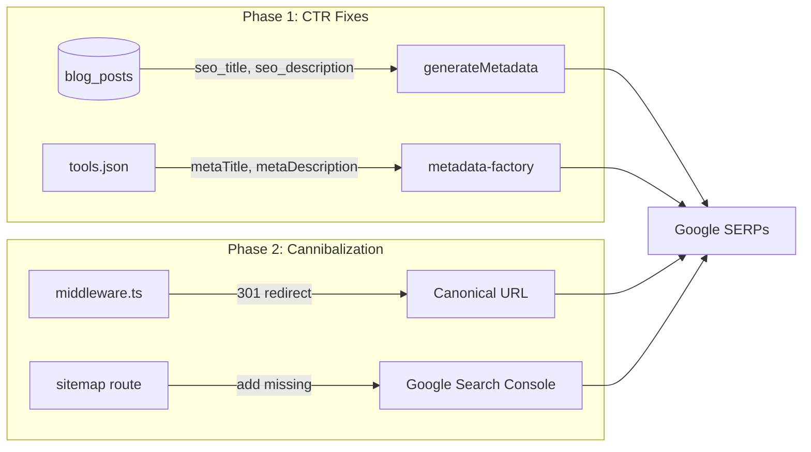

# PRD: SEO CTR & Cannibalization Fixes

**Complexity: 5 -> MEDIUM mode**

> +2 Touches 6-10 files | +1 Database schema changes | +2 Multi-package changes (middleware + data + blog DB)

---

## 1. Context

**Problem:** The site generates 50,851 impressions/90 days but only 2,010 clicks (3.95% CTR), with 88.8% of clicks coming from branded queries. The highest-impression page (`/blog/best-free-ai-image-upscaler-2026-tested-compared` — 15,826 impressions, 6 clicks, 0.04% CTR at position 7.5) has a catastrophic CTR failure. Multiple pages cannibalize the same keywords. Combined, these issues suppress ~1,000+ clicks/month that the current ranking already supports.

**Source:** `docs/seo/traffic-growth-opportunities-2026-q1.md` (Ahrefs + GSC combined analysis, April 2026)

**Files Analyzed:**

- `app/[locale]/blog/[slug]/page.tsx` — blog metadata generation (reads `seo_title`, `seo_description` from Supabase)
- `app/seo/data/tools.json` — tools pSEO data (metaTitle, metaDescription)
- `locales/es/tools.json` — Spanish tool translations
- `middleware.ts` — redirect map (lines 608-634)
- `app/sitemap.xml/route.ts` — sitemap index
- `app/[locale]/pricing/page.tsx` — pricing metadata
- `lib/seo/metadata-factory.ts` — pSEO metadata generation
- `content/blog-data.json` — static blog data (18 posts, not the DB posts)
- `server/services/blog.service.ts` — blog service (DB + static merge)

**Current Behavior:**

- Blog `generateMetadata` uses `post.seo_title || post.title` and `post.seo_description || post.description` from the Supabase `blog_posts` table
- `/tools/ai-image-upscaler` has metaTitle `"AI Image Upscaler - Enlarge to 4K Without Quality Loss"` — generic, no "free" signal
- Multiple blog posts compete for the same "best free ai upscaler 2026" cluster
- Two posts compete for "upscaling vs sharpening" queries
- Two posts compete for "restore old photos"
- 11 pages compete for generic "image upscaler"
- `/blog/photo-enhancement-upscaling-vs-quality` is missing from the blog sitemap
- No 301 redirects exist for any cannibalized blog posts

### Integration Points Checklist

**How will this feature be reached?**

- [x] Entry point: Google SERPs — improved titles/descriptions shown to users in search results
- [x] Caller file: `app/[locale]/blog/[slug]/page.tsx` reads `seo_title`/`seo_description` from DB
- [x] Registration/wiring: Supabase `blog_posts` table rows + middleware redirect map + pSEO JSON data

**Is this user-facing?**

- [x] YES — SERP appearance changes (title tags, meta descriptions). No UI component changes.

**Full user flow:**

1. Google user searches "best free ai image upscaler 2026"
2. Google renders our title tag and meta description in SERP
3. User sees a compelling, specific title and clicks
4. Landing on `blog/best-free-ai-image-upscaler-2026-tested-compared`
5. For cannibalized URLs: user hits old URL -> 301 -> canonical URL

---

## 2. Solution

**Approach:**

- Update `seo_title` and `seo_description` fields in Supabase `blog_posts` table for 5 high-impression blog posts
- Update `metaTitle` and `metaDescription` in `app/seo/data/tools.json` for `/tools/ai-image-upscaler`
- Add 301 redirects in `middleware.ts` for 3 cannibalized blog post pairs
- Add missing blog post to sitemap (verify `/blog/photo-enhancement-upscaling-vs-quality` is not in the blocked list)

**Key Decisions:**

- Blog metadata lives in Supabase, not in static JSON — updates are DB-side via SQL
- pSEO tool metadata lives in `app/seo/data/tools.json` — file edit
- Redirects go in the existing `redirectMap` in `middleware.ts`
- No content changes — purely metadata/redirect/sitemap fixes

**Data Changes:**

- UPDATE rows in `blog_posts` table (seo_title, seo_description columns)
- No schema migrations needed



---

## 3. Execution Phases

### Phase 1: Blog Post CTR Fixes (Supabase updates)

**User-visible outcome:** 5 blog posts show improved titles and descriptions in Google SERPs within 1-2 weeks.

**Files (1):**

- Supabase `blog_posts` table — UPDATE seo_title, seo_description for 5 slugs

**Implementation:**

Run the following SQL against the production Supabase database:

```sql
-- 1. best-free-ai-image-upscaler-2026-tested-compared
-- Current: 15,826 impressions, 6 clicks, 0.04% CTR at position 7.5
UPDATE blog_posts
SET
  seo_title = 'Best Free AI Image Upscaler 2026 — 12 Tools Tested & Compared',
  seo_description = 'We tested 12 free AI image upscalers head-to-head on sharpness, speed, and output quality. See which tool won for photos, artwork, and text-heavy images — with side-by-side samples.',
  updated_at = now()
WHERE slug = 'best-free-ai-image-upscaler-2026-tested-compared';

-- 2. upscale-image-for-print-300-dpi-guide
-- Current: 2,117 impressions, 2 clicks, 0.1% CTR at position 13.1
UPDATE blog_posts
SET
  seo_title = 'How to Upscale Images to 300 DPI for Print (Free, No Quality Loss)',
  seo_description = 'Step-by-step guide to upscaling any image to 300 DPI print resolution. Works with photos, logos, and artwork. Free online tool included — no Photoshop needed.',
  updated_at = now()
WHERE slug = 'upscale-image-for-print-300-dpi-guide';

-- 3. how-to-make-png-background-transparent-free
-- Current: 452 impressions, 0 clicks at position 9.1
UPDATE blog_posts
SET
  seo_title = 'How to Make a PNG Background Transparent — Free Online (2026)',
  seo_description = 'Remove PNG backgrounds in seconds with a free AI tool. No Photoshop needed. Works on product photos, logos, and portraits. Step-by-step guide with before/after examples.',
  updated_at = now()
WHERE slug = 'how-to-make-png-background-transparent-free';

-- 4. ai-image-upscaling-vs-sharpening-explained
-- Current: 877 combined impressions (cannibalizing with photo-enhancement-upscaling-vs-quality), 0 clicks at position 4.8
-- This is the KEEPER post (position 1.1 vs 6.1 for the other)
UPDATE blog_posts
SET
  seo_title = 'AI Upscaling vs Sharpening: What''s the Difference? (Visual Guide)',
  seo_description = 'AI upscaling adds real pixels to increase resolution. Sharpening enhances existing edges without adding detail. See side-by-side comparisons and learn when to use each technique.',
  updated_at = now()
WHERE slug = 'ai-image-upscaling-vs-sharpening-explained';

-- 5. best-ai-image-quality-enhancer-free
-- Current: 559 impressions, 3 clicks at position 18.8
UPDATE blog_posts
SET
  seo_title = 'Best Free AI Image Quality Enhancer (2026) — Tested on Real Photos',
  seo_description = 'Compare the best free AI image enhancers for fixing blurry, noisy, and low-resolution photos. Real test results with before/after samples. No signup required.',
  updated_at = now()
WHERE slug = 'best-ai-image-quality-enhancer-free';
```

**Tests Required:**
| Test File | Test Name | Assertion |
|-----------|-----------|-----------|
| `tests/unit/seo/blog-ctr-fixes.unit.spec.ts` | `should have seo_title set for high-impression blog posts` | Verify the blog page `generateMetadata` outputs the new title for each slug |
| `tests/unit/seo/blog-ctr-fixes.unit.spec.ts` | `should use seo_title over title when present` | Mock post with seo_title, verify metadata prefers it |
| `tests/unit/seo/blog-ctr-fixes.unit.spec.ts` | `should have seo_description under 160 characters` | All new descriptions <= 160 chars |

**Verification Plan:**

1. After SQL execution, verify with: `SELECT slug, seo_title, seo_description FROM blog_posts WHERE slug IN ('best-free-ai-image-upscaler-2026-tested-compared', 'upscale-image-for-print-300-dpi-guide', 'how-to-make-png-background-transparent-free', 'ai-image-upscaling-vs-sharpening-explained', 'best-ai-image-quality-enhancer-free');`
2. Visit each URL and verify `<title>` and `<meta name="description">` in page source
3. `yarn test` on affected test files
4. `yarn verify`

---

### Phase 2: Tool Page CTR Fix (tools.json)

**User-visible outcome:** `/tools/ai-image-upscaler` shows a more compelling title in SERPs with "Free" and capability signals.

**Files (1):**

- `app/seo/data/tools.json` — update metaTitle and metaDescription for `ai-image-upscaler`

**Implementation:**

- [ ] Update the `ai-image-upscaler` entry in `app/seo/data/tools.json`:
  - `metaTitle`: `"Free AI Image Upscaler — Enlarge to 8x, No Signup | MyImageUpscaler"`
  - `metaDescription`: `"Upscale images up to 8x with AI. Free online — no signup, no watermarks. Preserves text and details. Upload a photo and get instant HD results."`
- [ ] Verify title length <= 60 chars (excluding site name appended by Next.js) and description <= 155 chars

**Tests Required:**
| Test File | Test Name | Assertion |
|-----------|-----------|-----------|
| `tests/unit/seo/tools-metadata.unit.spec.ts` | `should include "Free" in ai-image-upscaler metaTitle` | `expect(tool.metaTitle).toMatch(/free/i)` |
| `tests/unit/seo/tools-metadata.unit.spec.ts` | `should have metaTitle under 60 chars for ai-image-upscaler` | Length check |
| `tests/unit/seo/tools-metadata.unit.spec.ts` | `should have metaDescription under 160 chars for ai-image-upscaler` | Length check |

**Verification Plan:**

1. `yarn verify`
2. Visit `/tools/ai-image-upscaler` and check `<title>` in page source

---

### Phase 3: Cannibalization Redirects (middleware.ts)

**User-visible outcome:** Cannibalized blog posts 301-redirect to the canonical version. Google consolidates ranking signals within 2-4 weeks.

**Files (2):**

- `middleware.ts` — add 3 entries to `redirectMap`
- `app/seo/sitemap-blog.xml/route.ts` (or equivalent blog sitemap) — add `photo-enhancement-upscaling-vs-quality` to blocked list (it redirects, so it shouldn't be in the sitemap)

**Implementation:**

- [ ] Add the following entries to the `redirectMap` in `middleware.ts` (~line 608):

```typescript
// SEO: Consolidate cannibalizing blog posts (PRD: seo-ctr-cannibalization-fixes)
// "upscaling vs sharpening" — keep ai-image-upscaling-vs-sharpening-explained (pos 1.1)
'/blog/photo-enhancement-upscaling-vs-quality': '/blog/ai-image-upscaling-vs-sharpening-explained',

// "best free upscaler 2026" cluster — keep best-free-ai-image-upscaler-2026-tested-compared
'/blog/best-free-ai-image-upscaler-tools-2026': '/blog/best-free-ai-image-upscaler-2026-tested-compared',

// "restore old photos" — keep use-cases/old-photo-restoration (pSEO page, richer content)
'/blog/restore-old-photos-online': '/use-cases/old-photo-restoration',
```

- [ ] Find the blog sitemap generation code and add the 3 redirected slugs to the blocked/excluded list so they don't appear in the sitemap (they 301 elsewhere)

**Tests Required:**
| Test File | Test Name | Assertion |
|-----------|-----------|-----------|
| `tests/unit/seo/cannibalization-redirects.unit.spec.ts` | `should 301 redirect /blog/photo-enhancement-upscaling-vs-quality` | Request to old path returns 301 to new path |
| `tests/unit/seo/cannibalization-redirects.unit.spec.ts` | `should 301 redirect /blog/best-free-ai-image-upscaler-tools-2026` | Request to old path returns 301 to new path |
| `tests/unit/seo/cannibalization-redirects.unit.spec.ts` | `should 301 redirect /blog/restore-old-photos-online` | Request to old path returns 301 to new path |
| `tests/unit/seo/blog-sitemap.unit.spec.ts` | `should not include redirected blog slugs in sitemap` | Verify the 3 slugs are excluded from sitemap XML output |

**Verification Plan:**

1. `curl -I https://localhost:3000/blog/photo-enhancement-upscaling-vs-quality` — verify 301 to `/blog/ai-image-upscaling-vs-sharpening-explained`
2. `curl -I https://localhost:3000/blog/best-free-ai-image-upscaler-tools-2026` — verify 301
3. `curl -I https://localhost:3000/blog/restore-old-photos-online` — verify 301 to `/use-cases/old-photo-restoration`
4. Fetch sitemap-blog.xml and verify none of the 3 redirected slugs appear
5. `yarn test` on affected test files
6. `yarn verify`

---

## 4. Summary of All Changes

| What                         | Where                       | Change                           |
| ---------------------------- | --------------------------- | -------------------------------- |
| Blog SEO titles/descriptions | Supabase `blog_posts` table | UPDATE 5 rows                    |
| Tool page metadata           | `app/seo/data/tools.json`   | Edit 1 entry (ai-image-upscaler) |
| Cannibalization redirects    | `middleware.ts` redirectMap | Add 3 entries                    |
| Sitemap cleanup              | Blog sitemap route          | Block 3 redirected slugs         |

**Total files touched:** 3 (tools.json, middleware.ts, blog sitemap route) + 1 DB update

---

## 5. Expected Impact

| Metric                           | Current (90 days) | Expected After (90 days) | Basis                                   |
| -------------------------------- | ----------------- | ------------------------ | --------------------------------------- |
| Blog comparison post clicks      | 6                 | ~600-800                 | 15,826 impressions x 5% CTR at pos 7.5  |
| /tools/ai-image-upscaler clicks  | 7                 | ~50-100                  | 1,139 impressions x 5-8% CTR at pos 2.2 |
| Print/DPI guide clicks           | 2                 | ~40-80                   | 2,117 impressions x 2-4% CTR at pos 13  |
| Background transparent post      | 0                 | ~20-40                   | 452 impressions x 5% CTR at pos 9       |
| Net new non-branded clicks/month | ~75               | ~300-400                 | Conservative estimate                   |

---

## 6. Acceptance Criteria

- [ ] All 5 blog posts have updated `seo_title` and `seo_description` in Supabase
- [ ] `ai-image-upscaler` in tools.json has updated metaTitle containing "Free"
- [ ] 3 cannibalization 301 redirects work in middleware
- [ ] Redirected slugs excluded from blog sitemap
- [ ] All new tests pass
- [ ] `yarn verify` passes
- [ ] No existing tests broken

---

## 7. Out of Scope (for separate PRDs)

These were identified in the traffic report but are larger efforts:

- Spanish `/es/tools/remove-bg` content optimization (separate content PRD)
- Image search alt-text fixes across the site
- New competitor "vs" pages
- Homepage H1 optimization for "image upscaler"
- Italian/Portuguese locale page optimization
- Backlink outreach for unlinked brand mentions
