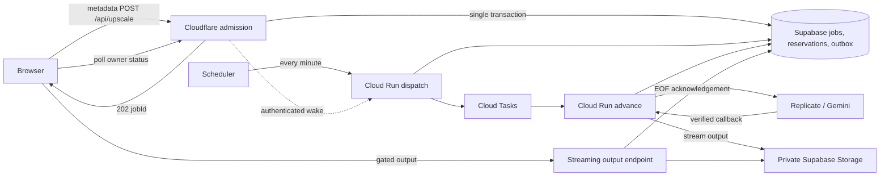

# Durable upscale execution outside Cloudflare

Date: 2026-09-07. Status: core implementation verified locally; deployment and incident-closure gates remain pending.
Incident: [recurring Worker memory report](../technical/bug-report-2026-09-07-cloudflare-upscale-memory-persists.md), issue #127.
Planning Mode: Principal Architect. Complexity: 11 → HIGH (10+ files, new service, concurrency, multiple deployment units, database changes, external APIs).

## Decision

Move all authenticated `/api/upscale` provider execution, provider-response parsing, and image output staging to a dedicated Cloud Run executor. Cloudflare accepts bounded metadata, commits a durable job and credit reservation, and returns `202`. Supabase is the authoritative job ledger. A transactional outbox drives Cloud Tasks; callbacks and scheduled reconciliation recover interrupted execution. The browser follows the job across network failures and reloads.

This deliberately goes beyond replacing `replicate.run()` with asynchronous creation inside the same OpenNext Worker. It removes provider execution from the 128 MB isolate regardless of whether the unmeasured allocation is the SDK, provider response, Gemini base64, or retained framework context. The change is a selected architecture, not a claim that the exact production allocation has been identified or that any finite-memory service cannot fail.

No production resources, schema, credits, or code behavior were changed for this PRD. Provisioning and implementation belong to the phases below. The existing Google Cloud project is the proposed deployment home; runtime APIs, IAM, quotas and billing must be verified during implementation. Estimated engineering effort: 8–12 working days, followed by the production observation gates; this is a planning estimate, not a deadline guarantee.

## Integration ledger

Locations below are inspected existing callers or explicitly proposed new entry points. Implementers must replace planned wiring with actual file:line evidence after each slice. Each named file owns one module; private helpers stay private.

| ID  | New module / contract / gate                                                  | Live caller and intended invocation                                                                                                                                               | Replaces / disposition                                                                              | Negative control                                                                                          |
| --- | ----------------------------------------------------------------------------- | --------------------------------------------------------------------------------------------------------------------------------------------------------------------------------- | --------------------------------------------------------------------------------------------------- | --------------------------------------------------------------------------------------------------------- |
| A   | Atomic admission RPC and execution tables                                     | `app/api/upscale/route.ts:1171` replaces the processor call; admission service invokes RPC                                                                                        | Remove provider execution and processor-owned deduction for migrated jobs in slice 2                | Kill request after commit; removing outbox loses job and must fail recovery test                          |
| B   | `server/services/upscale-job.service.ts`                                      | Existing upscale POST and new `app/api/upscale/jobs/route.ts`                                                                                                                     | Reservation-only request lifecycle becomes durable admission; old route is thin orchestration       | Replay same ID changes credits or creates another job when uniqueness is removed                          |
| C   | `services/upscale-executor/index.ts`, deployment configuration and Dockerfile | New Cloud Run HTTP server: `/dispatch`, `/tasks/advance`, `/webhooks/replicate`; Cloud Scheduler invokes `/dispatch` every minute, admission sends best-effort authenticated wake | No provider work in `waitUntil`; no in-process queue                                                | Disable scheduler and drop wake; watchdog must detect stale outbox                                        |
| D   | `services/upscale-executor/dispatch.ts` and SQL outbox claims                 | Executor `/dispatch` claims due rows and creates named Cloud Tasks                                                                                                                | No lossy DB-then-publish handoff                                                                    | Terminate dispatcher after task creation but before outbox acknowledgement; exactly one financial outcome |
| E   | `services/upscale-executor/advance.ts` and provider adapter                   | Cloud Tasks invokes `/tasks/advance`; executor calls existing model builders with stored plan                                                                                     | Authenticated route stops invoking `ReplicateService.processImage`; adapters do not reserve credits | Kill executor after provider acceptance; job recovers without another debit or blind prediction create    |
| F   | Completion handler and reconciler                                             | Executor webhook endpoint and scheduled dispatch enqueue bounded status checks                                                                                                    | Tail/age-only refunds delegate for v2 jobs in slice 1; legacy reservations keep existing behavior   | Race webhook, poll, tail and cleanup; no completed-plus-refunded job                                      |
| G   | Job status protocol and browser resume                                        | `client/utils/api-client.ts:581`, `client/hooks/useBatchQueue.ts:14`                                                                                                              | Replace response-timeout-as-job-failure for v2 in slice 2                                           | Lose POST response and reload; existing dashboard flow must still display result                          |
| H   | Stored output and delivery lease                                              | Executor stages output; `app/api/upscale/output/route.ts:195` performs existing acknowledgement through v2-aware RPC                                                              | Preserve delivery-based settlement; do not settle credits at webhook success                        | Abort output stream or race refund; prohibit unauthorized/free output and double settlement               |
| I   | Build identity and release proof                                              | Existing `scripts/deploy/steps/02-build.sh`, `scripts/deploy/steps/06-verify.sh`, `/api/health`; new executor health                                                              | No closure based only on repository SHA or unit tests                                               | Deploy mismatched build marker; gate must fail                                                            |

## Evidence and limits of the investigation

Inspected repository HEAD: `ae96360d055b1c0fd4f9b14d832923cfb0eda50f`, with pre-existing local changes. This is not asserted to be the active Cloudflare artifact.

| Evidence                                                                                                                             | Finding                                                                                                                 | Consequence                                                                                                         |
| ------------------------------------------------------------------------------------------------------------------------------------ | ----------------------------------------------------------------------------------------------------------------------- | ------------------------------------------------------------------------------------------------------------------- |
| Production Supabase `xqysaylskffsfwunczbd`, SELECT at 2026-09-07 20:20:04 UTC; reservation creation window `[00:00:00,16:10:56)` UTC | 96 `tail_observed_exceededMemory` refunds, 21 users, 225 credits                                                        | Confirms recurrence and financial containment independently of the report                                           |
| Same explicit window, `processing_jobs`                                                                                              | 91 `edge_error` rows, all without model ID; 143 completed rows                                                          | Report says 92; this read gives 91. Do not silently reconcile the discrepancy or equate separate tables without IDs |
| Production `information_schema.columns`                                                                                              | Neither reservations nor processing jobs has a provider prediction ID column                                            | Current state cannot reliably correlate an interrupted create with provider completion                              |
| Production `pg_get_functiondef`                                                                                                      | Stale reconciliation refunds processing reservations by age/activity; acknowledgement settles delivery under a row lock | Async migration MUST change cleanup eligibility and preserve delivery settlement                                    |
| Current route and SDK                                                                                                                | Bounded storage input; `useFileOutput:false`; route still awaits provider; factory includes Gemini                      | Input buffering was addressed, but provider lifecycle and all response types remain in the Worker                   |
| Current output route                                                                                                                 | Streams bytes and acknowledges at EOF                                                                                   | Provider success is not presently the billing completion boundary; preserve this explicitly                         |

The exact heap allocation, active deployment-to-SHA mapping and per-isolate concurrency remain unproven. GCloud Secret Manager read for Cloudflare deployment inspection failed because the configured personal account has no valid credentials. No local development secrets were substituted and no production writes were attempted. This does not prevent writing the design; exact deployment identity and runtime profiling are mandatory release evidence.

The requested `.claude/agents/cloudflare-worker-debugger.md` was read. Its blanket paid CPU claim and its inference that high wall time implies cold start are not reliable incident evidence. Apply current platform documentation and actual account configuration. Memory and provider GPU OOM are separate failure domains.

Prior fixes removed inline upload pressure, reduced validation copies, disabled eager SDK file output, and added refunds. Their tests cover these local properties. None proves durable work survives the request or that the active production artifact stays within its memory budget.

## Runtime and API contracts



`POST /api/upscale` retains existing authentication, tier access, account grants, input ownership, pixel limits, model resolution, credit estimate and batch policy. It accepts only the storage reference, existing config and a client-generated UUIDv4 `jobId`. Reuse the same ID across transport retries. Compute a canonical request fingerprint server-side from input path and normalized settings; the browser cannot choose cost, model authority or owner.

Commit job, immutable execution plan, credit reservation, batch slot and initial outbox row in one database transaction. The transaction must invoke/reuse existing credit pool arithmetic, not make a separate external RPC transaction followed by a job insert. Failure rolls everything back. Replays return existing state without rerunning model selection or recharging. Same ID with different payload returns `409`; another owner's ID returns `404` without metadata. Rate limits apply to status/replay traffic, but admitted jobs must remain recoverable while new admission is throttled.

Return `202 { jobId, status: "queued", statusUrl, retryAfterMs: 2000 }`, `Cache-Control: no-store`. A replay may return `200` for a terminal job. A failed wake never reverses committed admission; scheduled dispatch repairs it. Admission latency target: p95 ≤2 seconds, p99 ≤5 seconds, excluding direct upload; do not wait for provider prediction creation. This refines the report's recommendation: the durable job precedes provider ID, and the browser does not own the provider-creation gap.

`GET /api/upscale/jobs?jobId=<uuid>` returns owner-scoped status, timestamps, resolved tier/model/scale, retryability, refund status and output availability; no raw provider URL or secrets. Without a job ID, return up to 50 active/recent jobs with cursor pagination for reload recovery. Query indexes must support `(user_id, created_at, id)` and active-state filtering. `401` unauthenticated; `404` unowned/missing; `429` with Retry-After; transient database errors return `503`, never a fabricated failed job.

The browser waits 2 seconds initially, then polls with jitter and a maximum 10-second interval. Pause while hidden/offline, resume on focus/reconnect. A POST 503/non-JSON response triggers lookup by the original ID, then same-ID admission retry after 2/5/10 seconds if truly absent. A local network timeout is “reconnecting,” not provider failure. Refresh balance on confirmed refund. Explicit new attempts are offered only after terminal state and use a new ID. Persist account-scoped job IDs and nonsecret display metadata; server listing is authoritative after local state loss.

Background removal's separate browser/deduction flow and anonymous guest processing are not migrated by this authenticated incident PRD. Their existing memory regression tests remain required. Every provider branch reachable through authenticated `/api/upscale`, including Auto, fallback and Gemini, is in scope; none may silently retain synchronous execution after rollout.

## Durable state and accounting

Create `upscale_executions` keyed by `job_id`, referencing the reservation and owning user; use it as orchestration truth, keeping `processing_jobs` as the existing analytics projection. Store protocol version, request fingerprint, sanitized config, input object path, billing model, resolved model/provider/version, exact charge and pool attribution, stage, deadlines, lease generation, next action, output metadata and build identity. No base64, image buffers or provider logs in job rows.

Create `upscale_attempts` with unique attempt ID, job ID, ordinal, provider, nullable unique provider prediction ID, attempt-specific callback correlation, submission state and terminal timestamps. Persist the attempt BEFORE provider HTTP creation. Create `upscale_outbox` with unique `(job_id, action, generation)`, due time, claim expiry, publish status and retry count. Persist transition plus its next outbox action atomically.

All orchestration tables have RLS with no browser writes; browser reads go through authenticated owner-checked routes. Privileged RPCs use a fixed search path, explicit grants only to service role, and revoke PUBLIC/anon/authenticated execution. Add indexes for due outbox rows, active deadlines and provider prediction lookup. Migration tests use actual PostgreSQL with concurrent transactions, not SQL substring assertions.

| Execution state    | Meaning / permitted next action                   | Reservation behavior                                              |
| ------------------ | ------------------------------------------------- | ----------------------------------------------------------------- |
| queued             | Durable admission, no external create yet         | Reserved; v2-aware dispatcher owns recovery                       |
| submitting         | Attempt persisted and create may be in flight     | Reserved; never resubmit solely because lease expired             |
| submission_unknown | Provider may have accepted without local ID       | Reconcile callback/provider history; do not blindly create again  |
| processing         | Provider ID bound and nonterminal                 | Reserved; bounded polls and webhook may advance                   |
| staging            | Provider succeeded; private output copy pending   | Reserved; retry storage copy without another prediction           |
| ready              | Output durable, delivery capability can be issued | Still reserved until existing delivery acknowledgement            |
| completed          | Output stream acknowledged                        | Completed exactly once; never refundable by ordinary recovery     |
| failed / expired   | Definitive failure or recovery deadline reached   | Refund and release slot atomically once; late output inaccessible |

Terminal settlement locks the execution and reservation in a fixed order. Completion/refund are mutually exclusive compare-and-set operations. Preserve subscription/purchased-credit split and existing refund pool semantics. Duplicate tasks, callbacks, EOF acknowledgements and cleanup runs become no-ops. A refunded job can never become paid/completed again; late provider success is discarded and cleaned up.

Enforce v2 transition eligibility inside the database functions as well as callers. Census every existing caller of reservation refund, legacy `refund_consumed_credits`, completion and acknowledgement; no legacy RPC may bypass v2 state/lease checks. Lock the job ID before duplicate admission can debit, including when no reservation row exists yet; a unique row inserted late after debit is insufficient. Terminal transitions update the `processing_jobs` projection idempotently by the same job ID, so a client failure-observation request cannot overwrite authoritative success or insert an unrelated duplicate failure row. Include `app/api/upscale/failure-observation/route.ts` in a separate ≤5-file implementation slice with its API test before cohort rollout.

The existing Tail refund handler must inspect protocol version. Legacy reservations retain current refunds. For v2, a failed admission request marks recovery due; it cannot refund a committed job because the job may already be running elsewhere. Existing `reconcile_stale_credit_reservations` must exclude v2 reservations and delegate eligibility to the execution state. Existing gallery/input cleanup must protect objects referenced by queued, processing, staging and unexpired ready jobs. Preserve batch limits until provider terminal state; release slots exactly once then, independently of delayed browser delivery.

Output delivery obtains a renewable short lease under the same settlement lock before emitting bytes. Use a 120-second lease renewed every 30 seconds; expiration cleanup cannot refund while it is valid. Stream EOF invokes existing acknowledgement with the recorded output identity and capability. Aborts release the lease for retry; they do not immediately refund. Retain the existing limitation that server EOF is delivery acknowledgement, not proof a human saved the file. Do not introduce a client-controlled “charge me” callback.

## Execution, reconciliation and memory bounds

Deploy a minimal Node executor without Next.js/OpenNext. Initial configuration: 1 vCPU, 1 GiB memory, concurrency 1, maximum 10 instances, request timeout 900 seconds; tune only after measurements. Cloud Tasks global concurrent dispatch cap initially 10; callbacks and dispatcher use their own capacity budget so a provider slowdown cannot starve recovery. Use separate executor and callback/dispatcher service revisions from the same image if necessary to enforce this isolation; deploy this separation before load qualification. Configuration is checked into deployment files and loaded through the existing validated env configuration convention, never direct `process.env` in application code.

Cloud Tasks carries IDs and generation only. OIDC-authenticated task and scheduler requests validate issuer, audience and service account. The public callback endpoint validates Replicate's documented signature, timestamp tolerance and bounded raw body before parsing. Callback transport must not require Google IAM from Replicate: expose a separate authenticated-at-application callback service and keep task endpoints IAM-private. Admission's optional wake uses a dedicated rotating HMAC secret from `serverEnv`, with timestamp and replay validation; it can call the public ingress `/wake` which only records/dispatches due work, not arbitrary tasks. Scheduled dispatch is the correctness mechanism.

Replicate adapters reuse current input builders, pixel/scale decisions and output URL parsing, but use asynchronous prediction creation and bounded prediction GETs. Request only terminal webhook events. No `replicate.run`, automatic POST retry wrapper, `FileOutput`, image fetch or full prediction logs in the Edge dependency graph. Build an adapter for each model endpoint form currently enabled (versioned model versus official model), preserving the pinned execution plan. Provider create has a 15-second client deadline; a timeout is ambiguous, not proof of rejection.

Persist an attempt-scoped unguessable correlation in the callback URL before creation; authenticate callback signatures and match provider/model/input to the stored attempt using an authoritative provider GET before adopting an unknown prediction ID. Never bind solely on a supplied URL parameter. The callback can recover acceptance even if the create response was lost. Document/test provider-history pagination and matching during implementation. If history cannot uniquely identify the prediction and no callback arrives, leave `submission_unknown`; after 15 minutes, refund once and terminate the customer job. Do not claim exactly-once external creation across a provider API that does not prove an idempotency contract. No automatic second create while outcome is uncertain. Late results cannot recharge or expose refunded output.

Known predictions get one status GET per scheduled task: initial 5 seconds, exponential backoff capped at 30 seconds, with jitter and provider Retry-After. A lost webhook therefore cannot strand a job. The 15-minute customer processing deadline is measured from admission. On deadline, attempt provider cancellation where supported, refund atomically and ignore late completion for delivery. Provider cancellation uncertainty may incur operator cost; never shift that uncertainty into duplicate customer charges. Gemini and any non-asynchronous adapter run only in the memory-configured executor, with a bounded call deadline; interrupted non-idempotent calls follow the same uncertain/refund policy, not transparent reruns.

Output staging streams allowed provider URLs into private Supabase Storage with backpressure and checked redirects; reject unknown hosts, local/private network destinations and non-image MIME types. Enforce a 128 MiB output-byte cap by both header check and observed bytes; this is a proposed operational bound to validate against every enabled model's maximum output in slice 3, not an assertion about today's outputs. If legitimate fixtures exceed it, increase executor/storage limits before rollout; do not silently truncate or downgrade quality. Gemini encoded response has a separately enforced 192 MiB transport cap before parsing and decoding. No image decoding/transcoding on Cloudflare.

Provider URLs are temporary. Copy promptly, using deterministic attempt-specific private object keys and idempotent staging. Verify object length/content type and staged metadata before `ready`; retry failed copies while provider output remains available. Retain ready output for 24 hours; issue short-lived delivery capabilities only through an authenticated owner request, with atomic token rotation that does not invalidate a live delivery lease. Expire unacknowledged ready output after 24 hours and refund, then delete once no lease exists. Preserve the current gated streaming delivery endpoint, adding the byte cap and lease; never send raw provider URLs to the browser.

Dispatcher claims at most 50 due rows using `FOR UPDATE SKIP LOCKED` and expiring claims. Named task creation is at-least-once transport; database generation/lease checks are the durable deduplication boundary. A crash after task creation before publish acknowledgement is safe to replay. Mark outbox published only after task acceptance/already-exists; due unpublished rows remain retryable. Scheduler runs every minute, alerts when oldest due unpublished work exceeds 120 seconds, and re-enqueues expired execution leases subject to submission-ambiguity rules. Alerts never replace recovery.

```mermaid
sequenceDiagram
  participant B as Browser
  participant E as Edge
  participant D as Database
  participant W as Executor
  participant P as Provider
  B->>E: POST same stable jobId
  E->>D: Atomic reserve + job + outbox
  E-->>B: 202 queued (may be lost)
  W->>D: Claim action; persist attempt
  W->>P: Async create with correlated callback
  alt create response received
    W->>D: Bind prediction ID; schedule poll
  else create response lost
    W->>D: submission_unknown; no blind retry
  end
  P->>W: Signed completion callback
  W->>P: Verify authoritative prediction
  W->>D: Bind/reconcile attempt; stage output; ready
  B->>E: Poll same jobId after reload
  E-->>B: ready + owner delivery capability
  B->>E: Request gated output
  E->>D: Acquire delivery lease; acknowledge EOF
  alt delivery succeeds
    D-->>E: completed once
  else processing/recovery deadline fails
    W->>D: Refund once; late output barred
  end
```

## Implementation slices and proof

Each slice changes at most five files, including tests and an existing caller. Names below are planned paths. Generate migration timestamps with the installed Supabase CLI; do not reuse a historical migration. Larger edits must be split into additional slices with the same proof contract. Early slices remain behind a server-controlled internal cohort gate until the whole transport, UI and recovery flow is ready. Never expose a `202` contract to an old client accidentally.

### 1. Reservation recovery respects durable jobs

Files: NEW migration `durable_upscale_execution`; EDIT `server/services/replicate/utils/credit-manager.ts`; EDIT `app/api/cron/upscale-tail-refund/route.ts`; NEW `tests/integration/upscale-job-ledger.integration.spec.ts`; EDIT `tests/unit/api/upscale-tail-refund.unit.spec.ts`. Ledger A/F/H.

Implement tables, admission/settlement/lease RPCs, v2 stale-refund exclusion and tail branching. User result: interrupted durable jobs retain one recoverable reservation; legacy jobs still refund. Test `should preserve a durable reservation when tail observes admission death`, `should settle only once when completion races refund`, and `should roll back credits when admission transaction fails`. Negative control: remove protocol exclusion or row lock and observe failing concurrent test. Verify `yarn vitest run tests/unit/api/upscale-tail-refund.unit.spec.ts`, `yarn test:integration tests/integration/upscale-job-ledger.integration.spec.ts`, `yarn verify`. Exercise isolated PostgreSQL migrations and rollback before production; record grants, indexes and query plans.

### 2. Browser receives a durable job

Files: EDIT `app/api/upscale/route.ts`; NEW `server/services/upscale-job.service.ts`; NEW `app/api/upscale/jobs/route.ts`; EDIT `client/utils/api-client.ts`; NEW `tests/api/upscale-jobs.api.spec.ts`. Ledger A/B/G.

Wire existing policy/model validation into immutable admission, replace synchronous provider call for the internal cohort, return/poll 202 and preserve the legacy response adapter only for nonmigrated cohort. Status includes secure capability recovery for ready output. User result: Quick 2x at the largest permitted paid input, including scale-preserving fallback, shows processing rather than a 30-second POST. The full real provider proof closes in slice 3; this slice proves actual browser API transport with a held job, not image generation. Test `should recover the same job when the admission response is lost`, `should reject changed settings when job ID is reused`, and all 400/401/404/409/429/503 paths. Disable durable admission and observe the same transport test fail. Verify `yarn test:api tests/api/upscale-jobs.api.spec.ts`, `yarn verify`.

### 3. Real Quick execution runs outside the Worker

Files: NEW `services/upscale-executor/index.ts`; NEW `services/upscale-executor/advance.ts`; NEW `services/upscale-executor/replicate-adapter.ts`; EDIT `server/services/replicate.service.ts`; NEW `tests/integration/upscale-executor.integration.spec.ts`. Ledger C/E.

Reuse model builders without processor-owned billing; wire server handlers, bounded native creation/status/callback correlation and streaming staging. User result: the slice-2 request reaches the real staging Replicate account, produces the largest admitted Quick fallback result, and downloads through the existing gate. For local capability proof invoke executor over HTTP; deployment scheduling closes in slice 4. Test `should recover prediction identity when create response is lost`, `should stage once when terminal callbacks are duplicated`, and `should reject callbacks when signature is invalid`. Negative control: suppress provider ID adoption after response loss and observe job recovery failure. Verify `yarn test:integration tests/integration/upscale-executor.integration.spec.ts`, `yarn verify`; record real prediction ID, persisted job, output dimensions, bytes, executor RSS and confirmation that Edge has no provider call. Synthetic mocks alone cannot pass this slice.

### 4. Dispatch survives process death

Files: NEW `services/upscale-executor/dispatch.ts`; NEW `services/upscale-executor/Dockerfile`; NEW `services/upscale-executor/deploy.sh`; EDIT `services/upscale-executor/index.ts`; NEW `tests/integration/upscale-outbox.integration.spec.ts`. Ledger C/D/F.

Deploy service, private task handler and public signature-validated ingress from the same image, tasks, IAM, authenticated wake, Scheduler and outbox recovery. Pin image digest and validate service accounts. User result: kill admission after commit and worker after task publication; the same job still completes without user retry. Test `should resume due work when wake delivery is lost`, `should ignore duplicate tasks when publisher crashes after acceptance`, `should reject task execution when OIDC audience is wrong`, and submission-unknown expiry. Negative control: break scheduler target and observe both stale-work alert and withheld completion gate. Verify `yarn test:integration tests/integration/upscale-outbox.integration.spec.ts`, `yarn verify`, plus actual deployed task delivery, forced process termination and measured recovery ≤120 seconds after transport restoration.

### 5. Every authenticated provider uses the executor

Files: EDIT `services/upscale-executor/advance.ts`; EDIT `server/services/image-processor.factory.ts`; EDIT `server/services/image-generation.service.ts`; EDIT `app/api/upscale/route.ts`; EDIT `tests/integration/upscale-executor.integration.spec.ts`. Ledger A/E.

Add Gemini adapter and enumerate all enabled provider/model selections, Auto analysis and fallback decisions. Provider-dependent analysis also runs outside the Worker; admission stores a bounded plan or deferred selection instruction with a reserved maximum approved charge, then adjusts downward atomically before execution. It may not raise charge beyond the displayed authorized estimate; if a final plan exceeds the reservation, fail/refund and require a new quote. Explicit-model plans remain fixed at admission. Preserve tier access, safety failures, custom instructions, real 2x/4x dimensions and costs. User result: all enabled dashboard tiers work through the durable contract. Test `should execute every enabled provider outside Edge when selected by Auto or explicit tier`; force an inline Gemini response at the maximum allowed size and measure RSS. Negative control: route a model back into the Edge factory and fail dependency/runtime census. Verify expanded executor integration suite and `yarn verify`. No new tiers or model-quality downgrades.

### 6. Delivery and cleanup are race-safe

Files: EDIT `app/api/upscale/output/route.ts`; EDIT `server/services/galleryCleanup.service.ts`; EDIT `server/services/replicate/utils/credit-manager.ts`; EDIT `tests/unit/api/upscale-output.route.unit.spec.ts`; EDIT `tests/integration/upscale-job-ledger.integration.spec.ts`. Ledger H/F.

Wire byte caps, renewable delivery lease, capability refresh, input/output retention and EOF settlement. User result: slow downloads survive cleanup and retries do not charge again. Test `should preserve active output when cleanup races a slow stream`, `should refund once when ready output expires without delivery`, `should deny output when late success follows refund`, `should stop streaming when upstream exceeds the byte cap`. Negative control: disable the lease and force cleanup midstream. Verify output unit suite, ledger integration suite and `yarn verify`; drive a throttled real download and check private storage deletion after expiration.

### 7. Reload and retry behavior is complete

Files: EDIT `client/hooks/useBatchQueue.ts`; EDIT `client/utils/api-client.ts`; EDIT `shared/types/coreflow.types.ts`; EDIT `client/components/features/workspace/BatchSidebar/ActionPanel.tsx`; NEW `tests/e2e/upscale-job-recovery.e2e.spec.ts`. Ledger G.

Resume account-owned jobs on reload; queued/running/ready/reconnecting/refunded states use existing localized strings where equivalent. Any new wording requires a separate ≤5-file translation slice before rollout. Prevent duplicate batch admission, preserve batch order, refresh balance after refund, recover ready capabilities, and isolate local state across account changes. User result: start Quick, close/reopen tab, receive original output. Test `should display the original result when the page reloads after acceptance`, `should keep processing when polling temporarily returns 503`, `should refresh credits when execution is refunded`. Disable resume lookup and observe E2E failure. Verify `yarn test:e2e tests/e2e/upscale-job-recovery.e2e.spec.ts`, `yarn verify`; visually check narrow mobile and desktop with offline/reconnect and an actual downloaded result.

### 8. Traceable rollout and old-path removal

Files: EDIT `scripts/deploy/steps/02-build.sh`; EDIT `scripts/deploy/steps/06-verify.sh`; EDIT `app/api/health/route.ts`; EDIT `app/api/upscale/route.ts`; NEW `tests/unit/deploy/upscale-runtime-boundary.unit.spec.ts`. Ledger A/I.

Embed immutable SHA/build ID and executor image digest; verify active deployment metadata externally. After cohort gates pass, remove authenticated legacy processor path and all old catch/refund logic for migrated work; no dormant synchronous rollback branch. User result: every new dashboard job uses durable execution. Test `should fail release verification when deployment identity differs`, and dependency census proving no provider SDK execution reachable from admission. Negative control: restore old call or mismatch marker and observe failure. Verify runtime-boundary unit suite, all preceding suites and `yarn verify`. Run actual OpenNext preview memory/load scenarios with 1/5/10/25 concurrent admissions, 30/120-second provider delays, maximum admitted input, Quick fallback, Gemini maximum output and slow concurrent downloads. Archive heap/RSS traces and Tail outcomes, not object-size estimates.

After every slice, an independent PRD reviewer must compare the diff, live callers and observed-red/green evidence, run required checks and return PASS before the next slice. This is an implementation checkpoint, not a claim those phases were executed while authoring this document. Actual external integration, load and UI evidence require human inspection in addition to automated assertions.

## Production rollout and incident closure

Before production schema changes run `yarn db:backup`, then `yarn db:backups` and `gzip -t` on both newly created archives; record paths and successful verification. Stop if backup fails. Rollback is additive/schema-compatible: disable new admission, keep execution, callbacks, polls, delivery and refund recovery alive until admitted jobs drain. Never restore the synchronous Worker route or drop tables with in-flight jobs as an incident rollback.

Release to internal users with the hardest admitted paid Quick fallback input first, then 5%, 25%, 100% of authenticated users using stable account assignment. Keep protocol version pinned per job. Old cached clients receive an explicit update-required error before reservation unless they advertise support for durable jobs; do not return a 202 body they interpret as a completed image. Pause new admission on an executor outage with a specific retryable message and no debit. Existing jobs remain visible and recoverable.

| Gate                | Required evidence / threshold                                                                                                                                                                                                           | Failure action                                                                  |
| ------------------- | --------------------------------------------------------------------------------------------------------------------------------------------------------------------------------------------------------------------------------------- | ------------------------------------------------------------------------------- |
| Runtime boundary    | Active Edge SHA + executor digest recorded; no provider HTTP calls, image parsing or full-body buffering in admission                                                                                                                   | Block promotion                                                                 |
| Memory              | Zero `exceededMemory` across admission, status and delivery for ≥24 hours AND ≥500 representative admitted jobs; executor peak RSS below 70% of configured memory under maximum-input/response stress                                   | Pause admission/promotion, inspect traces; moving OOM to executor does not pass |
| Reliability         | Quick 2x and 4x infrastructure completion ≥99% separately, with at least 100 admitted jobs each; report provider rejection/safety and customer abandonment separately; no lost admitted jobs                                            | Block closure; do not hide failures by counting refunds as successes            |
| Accounting/recovery | Zero duplicate debits/refunds and zero accessible refunded outputs; all due unknown submissions resolved/refunded within 15 minutes plus 120-second reconciliation allowance; outbox recovery ≤120 seconds after dependency restoration | Pause promotion and reconcile affected IDs                                      |
| Sustained operation | Seven consecutive days after 100% rollout with no same-class incident, working alerts and no unresolved stranded jobs                                                                                                                   | Keep issue #127 open; restart observation after relevant fix                    |

If representative traffic is insufficient, continue observation; elapsed time alone does not pass. Provider duration percentiles and output-ready-to-download rates must be reported next to infrastructure completion. Compare the same fixed admission window and resolved-model cohorts; do not use fleet-level page-request counts as the upscale denominator. Keep issue open even if health endpoint is green.

Emit bounded structured events: admitted, attempt_persisted, prediction_bound, submission_unknown, provider_terminal, output_staged, delivery_started, acknowledged, refunded. Correlate job ID, attempt ID, model, provider, Edge version, executor revision and ray ID in logs; keep metric dimensions low cardinality. Never log signed URLs, callback secrets, images, base64 or complete prediction logs. Alert on any Edge memory termination, executor OOM, due outbox age >120 seconds, ambiguous submissions, settlement conflicts and deadline violations. The operator view must allow one job ID to explain credits, provider state and output disposition without querying by customer email.

## Test hardening: prevent another false closure

The user explicitly requires stronger regression protection. The following are mandatory implementation deliverables, not optional recommendations. Add `test:upscale:contract`, `test:upscale:recovery` and `test:upscale:worker` scripts to `package.json` and a required CI job in `.github/workflows/upscale-reliability.yml`. Add these as a separate ≤5-file slice with an existing deployment caller, rather than hiding more files in slice 8. Branch protection must require the CI job; a YAML file without an enforced required check is not sufficient. Configure PR triggers for app, server, shared, client, executor, migration, lockfile, Worker config and build/deploy changes. Run a scheduled full scenario matrix as well. Never make essential scenarios conditional on changed test files alone.

| Required gate             | Concrete test / assertion                                                                                                                                                                                                                                                                                                                                                                                               | What the old coverage missed                                                                                |
| ------------------------- | ----------------------------------------------------------------------------------------------------------------------------------------------------------------------------------------------------------------------------------------------------------------------------------------------------------------------------------------------------------------------------------------------------------------------- | ----------------------------------------------------------------------------------------------------------- |
| Real runtime boundary     | NEW `tests/workers/upscale-memory.runtime.spec.ts`: build and invoke actual OpenNext/workerd bundle with real SDK modules installed; replace provider HTTP transport only, not processors/imports. Capture outbound host/path census. Assert admission returns before held provider response and no provider call originates from Edge. Include malformed chunked bodies and maximum legitimate input metadata          | Constructor mocks prove an option exists, not that deployed code executes it or stays off the provider path |
| Byte and memory behavior  | Same runtime suite runs streams with absent/lying Content-Length, oversized chunks, slow consumers, cancellation and 1/5/10/25 concurrency; instrument observed bytes, cancellation and heap. Assert bounded reading, no whole-body conversion on image paths and no growth proportional to pending provider waits. Separately measure executor RSS with maximum Gemini response and largest real Quick fallback output | Source-text assertions and tiny fixtures cannot expose real response buffering or isolate pressure          |
| Durable fault matrix      | NEW `tests/integration/upscale-crash-matrix.integration.spec.ts` uses real PostgreSQL transactions and HTTP executor. Kill processes after admission commit, task creation, attempt persistence, provider acceptance, ID persistence, staging and settlement. Assert one reservation, one terminal financial outcome, correct pool balances and no accessible refunded output for every checkpoint                      | Happy-path completion and refund tests do not cover crash gaps or concurrent delivery                       |
| Browser and protocol      | Existing planned recovery E2E runs real admission/status/output routes; simulate dropped POST response, stale client, refresh, offline, two tabs, account switch, interrupted download and exhausted poll retries. Assert original job/result identity and balance, not just toast text or HTTP 200                                                                                                                     | Generic 503 handling can pass while the user loses a successful prediction or submits duplicates            |
| Deployment and production | Required release gate records artifact hashes, executes staging real-provider smoke, validates Tail collection with an injected non-production OOM, then evaluates production denominators/soak using persisted job IDs and actual runtime outcomes                                                                                                                                                                     | Passing unit tests, healthy `/api/health`, or absence of sampled logs cannot establish incident closure     |

Every suite must fail when a deliberate defect is introduced in an isolated checkout: restore synchronous Edge processing; buffer an output; remove admission idempotency; retry ambiguous creates; remove stale-refund exclusion; accept an unsigned callback; disable job resume. Keep each mutation separate, record which assertion caught it, restore and rerun. Production is never the mutation target. A harness that stays green is defective even if its final implementation tests pass. Run a collection sentinel to verify the new file/config is actually executed; missing tests, missing heap evidence, missing credentials for a required staging job, and skipped suites must produce a blocked gate rather than a success exit.

Test external-create ambiguity honestly: without a proven provider idempotency contract, assert no second automatic create after an unknown result and eventual single refund, not an impossible exactly-once guarantee. For a known prediction, duplicate task/webhook/poll delivery must still yield exactly one customer settlement. Use at least 20 simultaneous same-job callers and repeated randomized schedules against PostgreSQL; mocks cannot validate row locks, unique constraints or credit pool conservation.

Make memory evidence specific to the built artifact. Local workerd traces diagnose regressions but do not establish production isolate placement or enforcement. Keep real staging load and production Tail observation as separate gates. Verify alerts using a controlled staging termination and verify that telemetry ingestion is alive during the production window; zero collected events with a broken Tail consumer is a failed gate. Archive commands, test counts, build identity, baseline-versus-candidate traces, observed-red controls and output hashes as CI artifacts. Do not add brittle Markdown/source-string tests as a substitute for these behavioral checks.

Required implementation commands after the scripts exist: `yarn test:upscale:contract`, `yarn test:upscale:recovery`, `yarn test:upscale:worker`, the named API/E2E suites and `yarn verify`. Initial PRD authoring did not create these scripts or claim they passed. Release approval must inspect the actual CI run and branch-protection configuration.

## Verification evidence at PRD delivery

Implementation update, 2026-09-07: durable admission, transactional credit accounting, executor/provider adapters, outbox recovery, bounded output delivery and browser resume are implemented. Optional telemetry and metrics additions were removed to keep the fix focused. Existing unrelated worktree edits were preserved.

| Implementation check         | Observed result                                                                                     | Scope                                                                                                                                                                                                              |
| ---------------------------- | --------------------------------------------------------------------------------------------------- | ------------------------------------------------------------------------------------------------------------------------------------------------------------------------------------------------------------------ |
| `yarn test:upscale:contract` | 68 executor tests plus 323 application tests passed                                                 | Provider/authentication, admission policies, browser transport, delivery and accounting contracts                                                                                                                  |
| `yarn test:upscale:recovery` | 43 tests passed                                                                                     | Real PostgreSQL and HTTP crash/outbox recovery, delivery races, desktop/mobile browser reload and retry                                                                                                            |
| `yarn test:upscale:memory`   | Built executor passed maximum-input/response stress; peak RSS 516,493,312 bytes, below 70% of 1 GiB | Executor memory only; does not prove the deployed Worker memory gate                                                                                                                                               |
| `yarn verify`                | Exit 0                                                                                              | TypeScript, lint, ICU, schema, indexation and cache checks                                                                                                                                                         |
| Remaining release work       | Not complete                                                                                        | Cloud Run provisioning and three-role deployment wiring, production backup/migration, real-provider staging, actual OpenNext/workerd load proof, enforced CI protection and the production observation gates above |

No production mutations or deployment were performed. Read-only inspection found Cloud Run disabled in `myimageupscaler-auth` and no branch protection on `master`. The existing `deploy.sh` does not provision the complete executor/dispatcher/callback deployment. Keep this PRD active and issue #127 open; these local results do not establish incident closure. The following table records the earlier PRD-authoring baseline.

| Check                                                                                                                                                                                                                               | Actual result on 2026-09-07                                                             | What it proves                                              |
| ----------------------------------------------------------------------------------------------------------------------------------------------------------------------------------------------------------------------------------- | --------------------------------------------------------------------------------------- | ----------------------------------------------------------- |
| Production SELECTs                                                                                                                                                                                                                  | Completed; schema and function definitions inspected; incident refund counts reproduced | Existing failure/recovery evidence, not repaired runtime    |
| `yarn vitest run tests/unit/bugfixes/upscale-request-memory.unit.spec.ts tests/unit/api/upscale-body-size-guard.unit.spec.ts tests/unit/server/guest-processor-memory.unit.spec.ts tests/unit/api/upscale-tail-refund.unit.spec.ts` | 4 files, 32 tests passed                                                                | Current narrow guards/refunds; no new architecture proof    |
| `yarn verify`                                                                                                                                                                                                                       | Exit 0; 1664 existing lint warnings; ICU/schema/indexation/cache gates passed           | Current repository verification only                        |
| Cloudflare active deployment read                                                                                                                                                                                                   | Not obtained: GCloud credential authentication failure                                  | Deployment identity remains an explicit release requirement |
| Slices 1–8, observed-red controls, runtime profile, production soak                                                                                                                                                                 | Not executed; planned gates                                                             | Implementation must not mark these PASS from this document  |

## Existing dirty worktree audit

At investigation start, 12 tracked files were modified and three untracked entries existed. These changes predate this PRD; Git does not establish which process authored uncommitted content.

| Existing group                                           | Inspected changes                                                                                                                                                                                                                                     |
| -------------------------------------------------------- | ----------------------------------------------------------------------------------------------------------------------------------------------------------------------------------------------------------------------------------------------------- |
| Five application files                                   | `app/api/credit-estimate/route.ts`, `app/api/upscale/route.ts`, `server/services/auto-model-selection.ts`, `server/services/galleryCleanup.service.ts`, `shared/validation/upscale.schema.ts`: formatting-only diffs, no behavioral change identified |
| Four skill files and two untracked reference directories | `.agents/skills/` and `.claude/skills/` copies of context-building and prd-implementation rewritten/shortened; extracted plan-template references                                                                                                     |
| Incident documentation                                   | 63 added lines in production error backlog; untracked September 7 incident report                                                                                                                                                                     |
| Unrelated SEO work                                       | Reddit recommendation log adds 11 lines; SEO recovery test adds metadata cases and changes expected description                                                                                                                                       |

No existing edits were reverted or committed. `yarn verify` invokes auto-fixing ESLint; subsequent status showed the same pre-existing path set. The only intentionally authored deliverable for this request is this PRD.

Recommended disposition: commit this PRD, the incident report and production error backlog together as incident documentation after fixing the backlog's existing trailing blank line. Discard the five formatting-only application diffs after explicit confirmation; they do not implement this solution. Keep the skill rewrites and both matching reference directories together for a separate tooling review/commit. Keep the Reddit log and SEO test out of the incident commit; the SEO test's five tests passed independently, but that does not verify the live blog metadata against which its expectations were written. Commit that SEO change only after checking the actual content source, or preserve it pending its owner's review. Do not delete the untracked incident report or skill references as generic cleanup. The two copies of each skill and reference template were compared and match. Git provides no reliable attribution for these uncommitted edits.

## Primary references

Cloudflare documents the per-isolate 128 MB memory constraint and profiling approach: [Workers limits](https://developers.cloudflare.com/workers/platform/limits/). An async queue consumer still has a memory ceiling; the design uses a separately sized runtime for provider work.

Replicate documents [prediction creation modes](https://replicate.com/docs/topics/predictions/create-a-prediction), [webhooks](https://replicate.com/docs/topics/webhooks), [signature verification](https://replicate.com/docs/topics/webhooks/verify-webhook), and [temporary prediction data retention](https://replicate.com/docs/topics/predictions/data-retention). Provider creation atomicity with the application database is not assumed.

Google documents [configurable Cloud Run memory and termination behavior](https://docs.cloud.google.com/run/docs/configuring/services/memory-limits) and [authenticated HTTP Cloud Tasks](https://docs.cloud.google.com/tasks/docs/creating-http-target-tasks). Configuration values above are proposed application settings, not measured capacity. The Supabase changelog fetch was unavailable during investigation; this design uses existing inspected PostgreSQL/Storage contracts, and implementation must verify current SDK/API versions before adding dependencies.
