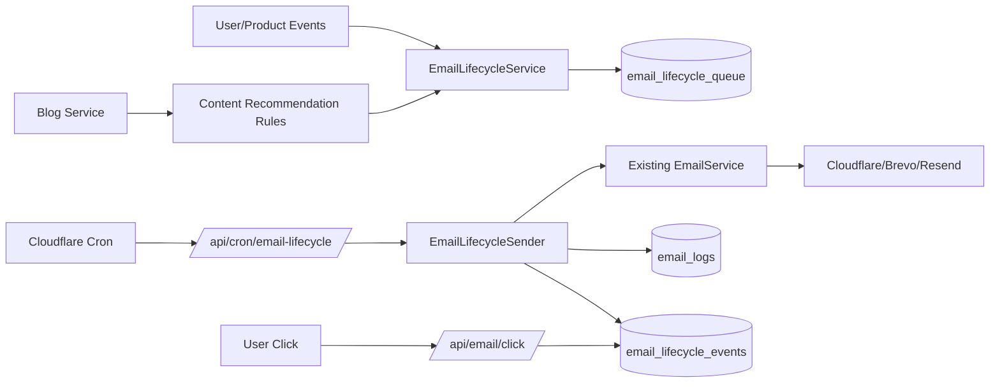

# Email Lifecycle Retention Drip Strategy PRD

**Status:** Planning  
**Priority:** High  
**Created:** 2026-06-06  
**Owner:** Product / Growth  
**Related:** `docs/PRDs/email-reengagement-drip.md`, `docs/PRDs/retention-and-reengagement.md`, `docs/technical/email-system.md`

---

## Complexity

Complexity: 8 -> HIGH mode

- +3 touches 10+ files
- +2 new lifecycle campaign system
- +1 database schema changes
- +1 external email provider integration through existing providers
- +1 scheduled cron integration

---

## 1. Context

**Problem:** MyImageUpscaler has transactional email infrastructure, but it does not consistently bring users back after signup, upload, credit depletion, purchase, or blog engagement opportunities.

**Files Analyzed:**

- `docs/technical/email-system.md`
- `docs/CURRENT-FEATURES.md`
- `docs/PRDs/email-reengagement-drip.md`
- `server/services/email.service.ts`
- `emails/templates/LowCreditsEmail.tsx`
- `app/api/email/preferences/route.ts`
- `app/api/email/send/route.ts`
- `app/api/cron/check-expirations/route.ts`
- `workers/cron/index.ts`
- `server/services/blog.service.ts`

**Current Behavior:**

- `EmailService` exists and routes through Cloudflare Email Service, Brevo, and Resend.
- React Email templates exist for welcome, payment success, subscription update, password reset, support, and low credits.
- Email preferences already support `marketing_emails`, `product_updates`, and `low_credit_alerts`.
- Stripe webhooks send transactional payment and subscription emails.
- Cron infrastructure exists through Cloudflare Worker routes.
- Blog content exists and can be queried through `server/services/blog.service.ts`, but it is not used in lifecycle messaging.

---

## 2. Goals

1. Increase logged-in return visits from email by 8-12% within 60 days of launch.
2. Increase first purchase conversion from activated free users by 5-8% within 60 days.
3. Recover users with low or zero credits by routing them to credit packs, subscriptions, or relevant feature use cases.
4. Keep MyImageUpscaler present in users' inboxes without spammy batch newsletters.
5. Use blog posts as targeted education and SEO-content amplification, not generic content blasts.

## 3. Non-Goals

- Building a full marketing automation UI in the first release.
- Sending cold outbound email to non-users.
- Replacing existing provider adapters.
- Sending high-frequency newsletters.
- Sending promotional email to users who opted out of marketing.

---

## 4. Integration Points

**How will this feature be reached?**

- [x] Entry point identified: cron route, user lifecycle events, Stripe webhook events, credit consumption path, blog publishing path.
- [x] Caller files identified:
  - `workers/cron/index.ts`
  - `app/api/cron/email-lifecycle/route.ts`
  - `server/services/email-lifecycle.service.ts`
  - `server/services/replicate/utils/credit-manager.ts`
  - `app/api/webhooks/stripe/handlers/payment.handler.ts`
  - `app/api/webhooks/stripe/handlers/subscription.handler.ts`
  - `app/api/blog/posts/[slug]/publish/route.ts`
- [x] Registration/wiring needed: add cron pattern, add route handler, add campaign queue tables, add templates, add event tracking.

**Is this user-facing?**

- [x] YES -> email templates, unsubscribe/preferences links, dashboard preference controls, blog links, pricing/checkout links.

**Full user flow:**

1. User signs up, uploads, downloads, runs low on credits, purchases, cancels, abandons checkout, or becomes inactive.
2. The app records a lifecycle event or cron identifies eligibility.
3. `EmailLifecycleService` evaluates segment rules, suppression rules, preferences, and send frequency.
4. Eligible sends are queued in `email_lifecycle_queue`.
5. Cron sends due items through `EmailService`.
6. User clicks a tracked CTA back to `/upscale`, `/pricing`, `/blog/[slug]`, or checkout.
7. Analytics records sent, opened if supported, clicked, returned, purchased, unsubscribed, and suppressed.

---

## 5. Strategy

### 5.1 Messaging Principles

- Every email must have one clear reason to exist.
- Prefer behavior-triggered messages over calendar blasts.
- Use product context: credits remaining, last used feature, selected quality tier, recent result, subscription tier, and failed/abandoned intent.
- Use blog posts when they help the user do something specific.
- Cap marketing sends to avoid fatigue.
- Transactional emails must stay useful, concise, and compliance-safe.

### 5.2 Email Categories

| Category          | Preference Gate                                              | Examples                                                             | Primary CTA               |
| ----------------- | ------------------------------------------------------------ | -------------------------------------------------------------------- | ------------------------- |
| Transactional     | Always allowed when account-critical                         | payment success, subscription update, failed payment, credit receipt | View account              |
| Low-credit alert  | `low_credit_alerts`                                          | 3 credits left, 0 credits left, high-cost model warning              | Get more credits          |
| Product lifecycle | `product_updates` or `marketing_emails` depending on content | new feature, saved gallery, batch processing tip                     | Try feature               |
| Blog education    | `marketing_emails`                                           | photo restoration guide, ecommerce image tips, pixel art guide       | Read guide / try workflow |
| Win-back          | `marketing_emails`                                           | inactive user reminder, unused credits reminder                      | Continue upscaling        |

---

## 6. Lifecycle Drip Map

### 6.1 New Signup Activation

| Trigger                    |    Delay | Segment            | Email                                               | CTA                   | Suppression                       |
| -------------------------- | -------: | ------------------ | --------------------------------------------------- | --------------------- | --------------------------------- |
| Account created, no upload |  2 hours | New signed-up user | Welcome: upload first image                         | `/upscale`            | Suppress if uploaded              |
| Account created, no upload | 24 hours | New signed-up user | "Try one of these 3 workflows"                      | `/upscale?sample=...` | Suppress if uploaded              |
| Account created, no upload |   3 days | Dormant signup     | Blog-backed tutorial: best image size for upscaling | Blog + `/upscale`     | Suppress if uploaded or opted out |

### 6.2 First Upload and First Result

| Trigger                         |      Delay | Segment            | Email                                            | CTA                         | Suppression                           |
| ------------------------------- | ---------: | ------------------ | ------------------------------------------------ | --------------------------- | ------------------------------------- |
| First successful upscale        | 15 minutes | Activated user     | Result follow-up: try a stronger quality tier    | `/upscale`                  | Suppress if purchased in same session |
| Download completed, no purchase |   24 hours | Free user          | Before/after value proof + relevant blog guide   | `/pricing` or blog          | Suppress if purchased                 |
| Used face/photo workflow        |     2 days | Face restore user  | Blog: restore old photos without over-sharpening | Blog + `/upscale?mode=face` | Marketing opt-out                     |
| Used ecommerce/product workflow |     2 days | Product image user | Blog: prepare product photos for listings        | Blog + `/upscale?mode=hd`   | Marketing opt-out                     |

### 6.3 Credit Balance Recovery

| Trigger                       |                          Delay | Segment                   | Email                            | CTA                              | Suppression               |
| ----------------------------- | -----------------------------: | ------------------------- | -------------------------------- | -------------------------------- | ------------------------- |
| Balance falls to <= 3 credits | Immediate, max once per 7 days | Free/paid users           | Low credits alert                | `/pricing`                       | `low_credit_alerts=false` |
| Balance reaches 0             | Immediate, max once per 7 days | Free/paid users           | Out of credits                   | credit pack checkout             | `low_credit_alerts=false` |
| Insufficient credits error    |                     10 minutes | User attempted processing | "Finish this image"              | pricing/checkout with return URL | `low_credit_alerts=false` |
| Unused purchased credits      |               14 days inactive | Credit holder             | "You still have credits waiting" | `/upscale`                       | Marketing opt-out         |

### 6.4 Purchase and Subscription Retention

| Trigger                                  |                    Delay | Segment        | Email                                       | CTA             | Suppression             |
| ---------------------------------------- | -----------------------: | -------------- | ------------------------------------------- | --------------- | ----------------------- |
| Credit pack purchased                    |                Immediate | Buyer          | Receipt + next best action                  | `/upscale`      | Transactional           |
| Subscription started                     |                Immediate | Subscriber     | Subscription confirmation + feature unlocks | `/upscale`      | Transactional           |
| Subscription active, no usage            |                   5 days | Subscriber     | "Use your included credits"                 | `/upscale`      | Product updates opt-out |
| Subscription active, high unused balance |                  14 days | Subscriber     | Batch/gallery/API use cases                 | `/upscale`      | Product updates opt-out |
| Subscription canceled                    |                Immediate | Canceling user | Confirmation + access end date              | account/billing | Transactional           |
| Subscription canceled                    | 7 days before period end | Canceling user | Keep access to premium models               | Reactivate      | Marketing opt-out       |

### 6.5 Blog-Powered Education

Blog emails should be selected by user behavior, not sent as a generic digest by default.

| User Intent Signal                  | Blog Content Type           | Email Angle                                 | CTA                 |
| ----------------------------------- | --------------------------- | ------------------------------------------- | ------------------- |
| Face Restore or portrait use        | Photo restoration posts     | "How to get cleaner restored faces"         | Blog + Face Restore |
| HD/Ultra quality selected           | Print quality posts         | "When to use HD vs Ultra"                   | Blog + HD Upscale   |
| Batch processing viewed             | Workflow/productivity posts | "Upscale 10-50 images without re-uploading" | Batch flow          |
| File rejected or low-quality source | Preparation posts           | "Best source files for AI upscaling"        | Blog + upload       |
| Blog visitor signs up               | Matching post cluster       | "Try what you just read"                    | `/upscale`          |
| Published high-intent blog post     | Segment-matched users       | "New guide: [specific outcome]"             | Blog + tool         |

Rules:

- A blog email must include a product CTA above or below the article link.
- Do not send more than one blog-powered marketing email per user per 14 days.
- Do not send blog emails to users who have not shown matching intent unless they opted into a digest later.
- Prefer evergreen how-to posts over generic company updates.

### 6.6 Inactive User Win-Back

| Trigger                       |   Delay | Segment             | Email                             | CTA                      | Suppression       |
| ----------------------------- | ------: | ------------------- | --------------------------------- | ------------------------ | ----------------- |
| No session after first result |  7 days | Free activated user | "Your next image can look better" | `/upscale`               | Marketing opt-out |
| No session, has credits       | 21 days | Credit holder       | "Your credits are still ready"    | `/upscale`               | Marketing opt-out |
| No session, paid before       | 45 days | Former buyer        | New model or workflow reminder    | `/pricing` or `/upscale` | Marketing opt-out |
| No session, never uploaded    | 14 days | Dormant signup      | "Start with a sample image"       | `/upscale?sample=...`    | Marketing opt-out |

---

## 7. Suppression and Compliance

1. Include unsubscribe/preference link in every marketing, product update, blog, and win-back email.
2. Honor `marketing_emails=false` for promotional, blog, discount, and win-back emails.
3. Honor `product_updates=false` for product education and feature release emails.
4. Honor `low_credit_alerts=false` for low-balance emails unless the email is part of a payment receipt.
5. Do not send more than:
   - 1 marketing email per user per 7 days.
   - 1 blog-powered email per user per 14 days.
   - 2 lifecycle emails total per user per 7 days, excluding strict transactional emails.
6. Suppress all non-transactional lifecycle emails for users with bounced or complained email status.
7. Suppress win-back emails once a user returns, purchases, or unsubscribes.
8. Add UTM parameters to every non-transactional link:
   - `utm_source=email`
   - `utm_medium=lifecycle`
   - `utm_campaign=<campaign_key>`
   - `utm_content=<template_key>`

---

## 8. Data Changes

### 8.1 `email_lifecycle_campaigns`

Stores editable campaign definitions seeded by migration.

Columns:

- `id UUID PRIMARY KEY`
- `key TEXT UNIQUE NOT NULL`
- `name TEXT NOT NULL`
- `category TEXT NOT NULL`
- `template_name TEXT NOT NULL`
- `email_type TEXT NOT NULL CHECK IN ('transactional', 'marketing')`
- `preference_key TEXT NULL CHECK IN ('marketing_emails', 'product_updates', 'low_credit_alerts')`
- `enabled BOOLEAN NOT NULL DEFAULT true`
- `cooldown_days INTEGER NOT NULL DEFAULT 7`
- `priority INTEGER NOT NULL DEFAULT 0`
- `created_at TIMESTAMPTZ NOT NULL DEFAULT now()`
- `updated_at TIMESTAMPTZ NOT NULL DEFAULT now()`

### 8.2 `email_lifecycle_queue`

Stores scheduled sends and suppression outcomes.

Columns:

- `id UUID PRIMARY KEY`
- `campaign_key TEXT NOT NULL`
- `user_id UUID REFERENCES profiles(id) ON DELETE CASCADE`
- `recipient_email TEXT NOT NULL`
- `scheduled_for TIMESTAMPTZ NOT NULL`
- `status TEXT NOT NULL CHECK IN ('pending', 'sent', 'failed', 'skipped', 'cancelled')`
- `reason TEXT NULL`
- `template_data JSONB NOT NULL DEFAULT '{}'`
- `metadata JSONB NOT NULL DEFAULT '{}'`
- `sent_at TIMESTAMPTZ NULL`
- `created_at TIMESTAMPTZ NOT NULL DEFAULT now()`
- `updated_at TIMESTAMPTZ NOT NULL DEFAULT now()`

Indexes:

- `(status, scheduled_for)`
- `(user_id, campaign_key, status)`
- `(campaign_key, created_at DESC)`

### 8.3 `email_lifecycle_events`

Stores lifecycle events and attribution.

Columns:

- `id UUID PRIMARY KEY`
- `queue_id UUID NULL REFERENCES email_lifecycle_queue(id) ON DELETE SET NULL`
- `user_id UUID NULL REFERENCES profiles(id) ON DELETE CASCADE`
- `event_type TEXT NOT NULL`
- `campaign_key TEXT NULL`
- `metadata JSONB NOT NULL DEFAULT '{}'`
- `occurred_at TIMESTAMPTZ NOT NULL DEFAULT now()`

Events:

- `queued`
- `sent`
- `skipped`
- `failed`
- `clicked`
- `returned`
- `purchased_after_email`
- `unsubscribed`
- `suppressed_frequency_cap`
- `suppressed_preference`

### 8.4 Optional Future Table: `email_content_recommendations`

Maps product signals to blog posts. This can start as a config object and move to the DB when content operations need admin control.

---

## 9. Technical Design

### 9.1 New Services

`server/services/email-lifecycle.service.ts`

Responsibilities:

- Queue lifecycle emails.
- Evaluate preferences and suppression.
- Select blog content by user signal.
- Cancel stale queued emails when user behavior changes.
- Send due queue rows through `EmailService`.
- Record lifecycle events.

`server/services/email-content-recommendation.service.ts`

Responsibilities:

- Map user intent to blog posts.
- Query published posts through `server/services/blog.service.ts`.
- Return fallback product-focused content if no matching post exists.

### 9.2 New API Routes

`app/api/cron/email-lifecycle/route.ts`

- Authenticated by `x-cron-secret`.
- Processes due queue rows in bounded batches.
- Queues daily/weekly eligibility-based emails for inactive users.
- Returns counts: queued, sent, skipped, failed.

`app/api/email/click/route.ts`

- Accepts signed click token or queue id plus redirect URL.
- Records click event.
- Redirects to destination with UTM params.

### 9.3 Template Additions

Add these React Email templates:

- `LifecycleWelcomeEmail.tsx`
- `FeatureReminderEmail.tsx`
- `BlogEducationEmail.tsx`
- `UnusedCreditsEmail.tsx`
- `FinishImageEmail.tsx`
- `WinBackEmail.tsx`

Revise existing:

- `LowCreditsEmail.tsx` to support:
  - exact credits remaining
  - "finish this image" return URL
  - credit pack vs subscription CTA
  - preference footer

---

## 10. Email Copy Matrix

| Template               | Subject Pattern                                      | Body Promise                                                | CTA                 |
| ---------------------- | ---------------------------------------------------- | ----------------------------------------------------------- | ------------------- |
| Welcome                | `Your first 10 credits are ready`                    | Start with one image and see before/after quality.          | Start upscaling     |
| First result follow-up | `Want a sharper version of your image?`              | Explain better model/tier for their prior outcome.          | Try HD/Ultra        |
| Low credits            | `You have {credits} credits left`                    | Avoid interruption before the next job.                     | Get more credits    |
| Zero credits           | `Finish your next upscale without waiting`           | Direct path to top up or subscribe.                         | Add credits         |
| Insufficient credits   | `Your image needs {requiredCredits} credits`         | Recover failed intent while it is fresh.                    | Finish this image   |
| Blog education         | `Guide: {specificOutcome}`                           | Teach one workflow tied to previous behavior.               | Read guide / Try it |
| Unused credits         | `You still have credits waiting`                     | Remind value already paid for.                              | Use credits         |
| Subscription idle      | `Your plan includes features you have not tried yet` | Mention batch, Ultra, API, text preservation based on tier. | Try feature         |
| Win-back               | `Still need cleaner images?`                         | New reason to return, not guilt.                            | Upscale an image    |

---

## 11. Analytics

Track server-side events in Amplitude and DB:

- `email_lifecycle_queued`
- `email_lifecycle_sent`
- `email_lifecycle_skipped`
- `email_lifecycle_clicked`
- `email_lifecycle_returned`
- `email_lifecycle_purchase_attributed`
- `email_lifecycle_unsubscribed`

Required properties:

- `campaign_key`
- `template_name`
- `category`
- `user_tier`
- `credits_remaining`
- `preference_key`
- `blog_slug`
- `cta_destination`
- `days_since_last_session`

Success metrics:

- Click-to-return rate by campaign.
- Purchase conversion within 7 days of click.
- Low-credit top-up conversion.
- Unsubscribe rate by category.
- Revenue per 1,000 emails sent.
- Blog email assisted sessions and signups.

Guardrail metrics:

- Complaint rate.
- Bounce rate.
- Unsubscribe rate.
- Sends per active user per month.
- Provider monthly quota use.

---

## 12. Execution Phases

### Phase 1: Queue, Suppression, and Cron Foundation - A dry-run lifecycle queue can identify eligible users without sending marketing emails.

**Files (max 5):**

- `supabase/migrations/YYYYMMDD_create_email_lifecycle_tables.sql` - lifecycle queue/events/campaign tables.
- `server/services/email-lifecycle.service.ts` - queue and suppression logic.
- `app/api/cron/email-lifecycle/route.ts` - cron endpoint with dry-run support.
- `workers/cron/index.ts` - route daily cron pattern to lifecycle endpoint.
- `workers/cron/wrangler.toml` - add daily schedule.

**Implementation:**

- [ ] Create DB tables with service-role policies and indexes.
- [ ] Seed campaign keys for signup, low-credit, unused-credit, and win-back flows.
- [ ] Implement frequency caps and preference suppression.
- [ ] Implement `dryRun=true` route mode.
- [ ] Wire Cloudflare cron to call the route once daily.

**Tests Required:**

| Test File                                                   | Test Name                                         | Assertion                                           |
| ----------------------------------------------------------- | ------------------------------------------------- | --------------------------------------------------- |
| `server/services/__tests__/email-lifecycle.service.test.ts` | `suppresses marketing emails for opted-out users` | Queue row is `skipped` with `suppressed_preference` |
| `server/services/__tests__/email-lifecycle.service.test.ts` | `applies weekly frequency cap`                    | Second marketing send is skipped                    |
| `app/api/cron/email-lifecycle/route.test.ts`                | `rejects invalid cron secret`                     | Returns 401                                         |
| `app/api/cron/email-lifecycle/route.test.ts`                | `dry run does not send email`                     | No `EmailService.send` call                         |

**User Verification:**

- Action: Run lifecycle cron in dry-run mode.
- Expected: JSON shows eligible, skipped, and queued counts without provider sends.

### Phase 2: Transactional and Low-Balance Recovery - Users receive useful low/zero credit notifications after credit-consuming actions.

**Files (max 5):**

- `server/services/replicate/utils/credit-manager.ts` - queue low-balance alerts after successful consumption or insufficient credit.
- `emails/templates/LowCreditsEmail.tsx` - support richer CTA variants and preference footer.
- `server/services/email-lifecycle.service.ts` - add low-balance helper APIs.
- `server/services/__tests__/email-lifecycle.service.test.ts` - low-balance cases.
- `emails/templates/__tests__/LowCreditsEmail.test.tsx` - template rendering.

**Implementation:**

- [ ] Queue alert when total credits fall to 3 or fewer.
- [ ] Queue urgent alert when credits reach 0.
- [ ] Queue "finish this image" alert after insufficient credits, with return URL.
- [ ] Prevent more than one low-credit alert per 7 days unless the user reaches 0 after a previous low warning.
- [ ] Respect `low_credit_alerts`.

**Tests Required:**

| Test File                                                   | Test Name                                         | Assertion                            |
| ----------------------------------------------------------- | ------------------------------------------------- | ------------------------------------ |
| `server/services/__tests__/email-lifecycle.service.test.ts` | `queues low credit alert at threshold`            | Pending queue row uses `low-credits` |
| `server/services/__tests__/email-lifecycle.service.test.ts` | `does not queue low credit alert when opted out`  | Skipped event is recorded            |
| `emails/templates/__tests__/LowCreditsEmail.test.tsx`       | `renders finish image CTA when return URL exists` | CTA points to return URL             |

**User Verification:**

- Action: Process an image until balance reaches low threshold in dev mode.
- Expected: Dev email log shows low-credit email payload with correct remaining credits and CTA.

### Phase 3: Behavioral Drips - Signup, activation, unused credits, and win-back emails are sent from user behavior.

**Files (max 5):**

- `server/services/email-lifecycle.service.ts` - segment eligibility and queue cancellation.
- `emails/templates/LifecycleWelcomeEmail.tsx` - new signup/no-upload email.
- `emails/templates/UnusedCreditsEmail.tsx` - dormant credit holder email.
- `emails/templates/WinBackEmail.tsx` - inactive user email.
- `app/api/cron/email-lifecycle/route.ts` - daily eligibility scans.

**Implementation:**

- [ ] Identify no-upload users after signup.
- [ ] Identify activated non-buyers after first result.
- [ ] Identify users with unused credits and no recent session.
- [ ] Identify inactive former buyers.
- [ ] Cancel queued emails when user returns, uploads, purchases, or unsubscribes.

**Tests Required:**

| Test File                                                   | Test Name                              | Assertion                                    |
| ----------------------------------------------------------- | -------------------------------------- | -------------------------------------------- |
| `server/services/__tests__/email-lifecycle.service.test.ts` | `queues no-upload welcome after delay` | User with no upload gets welcome queue row   |
| `server/services/__tests__/email-lifecycle.service.test.ts` | `cancels welcome after upload`         | Pending no-upload campaign becomes cancelled |
| `server/services/__tests__/email-lifecycle.service.test.ts` | `queues unused credits reminder`       | Dormant user with credits gets queue row     |

**User Verification:**

- Action: Seed test users for each lifecycle segment and run cron.
- Expected: Queue rows match only eligible users and skipped rows include clear reasons.

### Phase 4: Blog-Powered Education - Relevant blog posts are inserted into lifecycle emails based on user intent.

**Files (max 5):**

- `server/services/email-content-recommendation.service.ts` - intent-to-blog mapping.
- `server/services/email-lifecycle.service.ts` - attach recommended post to template data.
- `emails/templates/BlogEducationEmail.tsx` - blog + product CTA template.
- `app/api/blog/posts/[slug]/publish/route.ts` - optional queue trigger for newly published high-intent posts.
- `server/services/__tests__/email-content-recommendation.service.test.ts` - recommendation rules.

**Implementation:**

- [ ] Define initial intent map: face restore, HD/Ultra, batch, ecommerce/product, file-prep.
- [ ] Query published blog posts by tag/category.
- [ ] Queue blog emails only for matching user intent.
- [ ] Enforce one blog email per 14 days.
- [ ] Include product CTA in every blog email.

**Tests Required:**

| Test File                                                                | Test Name                                      | Assertion                               |
| ------------------------------------------------------------------------ | ---------------------------------------------- | --------------------------------------- |
| `server/services/__tests__/email-content-recommendation.service.test.ts` | `selects face restore post for portrait users` | Returned post has matching tag/category |
| `server/services/__tests__/email-lifecycle.service.test.ts`              | `caps blog emails to one per 14 days`          | Second blog email is skipped            |
| `emails/templates/__tests__/BlogEducationEmail.test.tsx`                 | `renders article and product CTAs`             | Both links are present                  |

**User Verification:**

- Action: Publish or seed matching blog posts and run lifecycle cron for users with matching behavior.
- Expected: Blog education emails include the right article and a direct product CTA.

### Phase 5: Click Tracking, Attribution, and Preferences - Lifecycle performance is measurable and users can control email categories.

**Files (max 5):**

- `app/api/email/click/route.ts` - click tracking redirect.
- `app/api/email/preferences/route.ts` - ensure all category preferences are exposed and updatable.
- `client` preference/settings component file - show email category toggles where account settings live.
- `server/analytics/types.ts` - add lifecycle email event types.
- `server/analytics/analyticsService.ts` - track lifecycle events.

**Implementation:**

- [ ] Generate signed click links for lifecycle emails.
- [ ] Record click events and redirect safely to internal destinations.
- [ ] Add UTM params to non-transactional links.
- [ ] Expose preference toggles in the account UI.
- [ ] Track attribution for return sessions and purchases within 7 days.

**Tests Required:**

| Test File                                 | Test Name                       | Assertion                                 |
| ----------------------------------------- | ------------------------------- | ----------------------------------------- |
| `app/api/email/click/route.test.ts`       | `records click and redirects`   | Event inserted and 302 returned           |
| `app/api/email/click/route.test.ts`       | `rejects unsafe redirect`       | External untrusted destination is blocked |
| `app/api/email/preferences/route.test.ts` | `updates lifecycle preferences` | PATCH persists preference values          |

**User Verification:**

- Action: Click a dev-mode email link.
- Expected: Redirect lands on the intended page with UTM params and click event is recorded.

---

## 13. Rollout Plan

1. Launch Phase 1 in dry-run mode for 3-5 days.
2. Review eligible counts, suppression counts, and provider quota projections.
3. Enable low-credit and zero-credit transactional-style alerts first.
4. Enable signup/no-upload and unused-credit drips at 25% of eligible users.
5. Enable blog-powered emails only after frequency caps and unsubscribe links are verified.
6. Ramp to 100% if unsubscribe rate remains below 0.5% and complaint rate remains below 0.1%.

---

## 14. Risks and Mitigations

| Risk                                         | Mitigation                                                              |
| -------------------------------------------- | ----------------------------------------------------------------------- |
| Users perceive emails as spam                | Behavior-triggered sends, strict caps, clear preferences                |
| Provider quota exhaustion                    | Daily batch limits and provider usage checks                            |
| Incorrect marketing sends to opted-out users | Central suppression in `EmailLifecycleService` and tests                |
| Blog emails feel generic                     | Segment by feature intent and require product CTA                       |
| Queue duplicates                             | Unique constraints by campaign/user/window and idempotent queue APIs    |
| Attribution overclaims revenue               | Attribute only click-to-purchase windows and report assisted separately |

---

## 15. Open Questions

1. Which account/settings component should own email preference toggles if the current UI does not already expose them?
2. Should low-credit alerts be positioned as transactional or preference-gated product notifications? This PRD keeps them gated by `low_credit_alerts`.
3. Should incentives such as free credits or discounts be included in win-back emails? Recommendation: wait until baseline non-incentive performance is measured.
4. Should blog post tags be standardized before Phase 4? Recommendation: yes, use tags like `face-restore`, `hd-upscale`, `batch`, `ecommerce`, `file-prep`, `print`.

---

## 16. Definition of Done

- Lifecycle queue and event tables exist in production.
- Cron can run in dry-run and send modes.
- Low-credit, no-upload, unused-credit, win-back, and blog education emails are implemented.
- Marketing and product emails honor preferences and unsubscribe links.
- Frequency caps are enforced centrally.
- Blog emails are selected by user intent and include product CTAs.
- Email send, skip, click, return, and purchase attribution events are visible in analytics.
- Tests cover suppression, queueing, sending, blog selection, click redirects, and preference updates.
