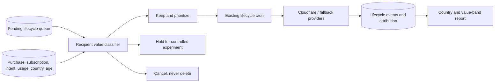

# PRD: Recipient-Value Email Queue Pruning

**Status:** Implemented; production rollout gates pending
**Owner:** Product / Growth / Engineering
**Complexity: 8 → HIGH mode** (+2 touches 6–10 files, +2 complex policy/state logic, +1 database schema change, +1 background delivery integration, +2 production data mutation and rollback risk)

## 1. Context

**Problem:** Approximately 10,000 lifecycle emails are waiting to send, but delivery has a real provider cost and the queue does not distinguish recipients by likely revenue value. Sending every pending row equally would spend capacity on stale, low-intent recipients while proven buyers and high-intent prospects wait.

**Evidence and constraints:**

- `docs/management/revenue-optimization-report-2026-07-10.md` found 81,539 suppressed lifecycle emails, only 2,192 historical sends, and 1,106 provider-exhaustion failures.
- The same report found `winback-former-buyer-45d` sent 0 of 6,805 while two low-intent win-back campaigns accounted for more than 60,000 attempted queue entries.
- Credit packs are the primary product: 249 pack buyers versus 34 subscribers ever, with 35% of pack buyers purchasing repeatedly.
- `docs/management/regional-pricing-margin-analysis.md` shows that one standard-price purchase produces about 2.86× the revenue of an Indian purchase and 2.5× the revenue of a Philippine purchase.
- The repository does **not** yet prove country-level conversion rates. Country treatment in this PRD is therefore a product hypothesis that must be measured and versioned, not presented as established fact.
- Existing campaign priority and frequency-cap work must be reused. This PRD does not change provider ordering, unsubscribe handling, complaint suppression, or the emergency marketing cap.

**Files analyzed:**

- `docs/management/revenue-optimization-report-2026-07-10.md`
- `docs/management/regional-pricing-margin-analysis.md`
- `docs/PRDs/revenue-recovery-email-cohorts.md`
- `docs/PRDs/revenue-optimization-2026-07-10/01-cloudflare-email-primary-and-priority-caps.md`
- `server/services/email-lifecycle.service.ts`
- `server/services/revenue-recovery.service.ts`
- `app/api/cron/email-lifecycle/route.ts`
- `supabase/migrations/20260607011814_create_email_lifecycle_tables.sql`
- `supabase/migrations/20260711060036_email_campaign_priority.sql`
- `supabase/migrations/20260711060702_email_lifecycle_health_report.sql`
- `supabase/migrations/20260226000100_add_anti_freeloader.sql`
- `shared/config/pricing-regions.ts`

**Current behavior:**

- The cron selects due rows by campaign priority and scheduled time.
- Revenue-critical campaigns have more permissive frequency caps than lifecycle and education campaigns.
- Preferences, unsubscribe status, bounce/complaint status, campaign cooldown, and hard marketing ceilings are checked before delivery.
- Queue rows can be marked `cancelled`, but no recipient-value classification or bulk-pruning workflow exists.
- `profiles.signup_country` is the available first-party country signal; `standard`, `restricted`, and `paywalled` region tiers already exist.

## 2. Goals

1. Classify every pending marketing email using a deterministic, explainable recipient-value policy.
2. Preserve transactional messages and high-intent/proven-revenue recipients regardless of country.
3. Cancel stale, low-intent pending marketing rows before paid delivery capacity is used.
4. Default every production operation to dry-run and require an explicit guarded apply step.
5. Measure sends, clicks, purchases, revenue proxy, bounces, and complaints by country, campaign, and value band.
6. Replace country assumptions with observed conversion evidence after a controlled holdout test.

## 3. Non-Goals

- Do not delete queue rows. Pruned rows remain as `cancelled` audit records.
- Do not cancel or delay transactional email.
- Do not bypass marketing preferences, unsubscribe, bounce, complaint, cooldown, or frequency-cap checks.
- Do not infer country from the email domain, name, browser locale, or IP history.
- Do not block an entire country permanently based on the current anecdotal evidence.
- Do not buy or enable additional provider capacity as part of this PRD.
- Do not build a marketing automation dashboard in the first release.

## 4. Success Criteria

- 100% of pending marketing rows receive a policy version, numeric score, decision, and machine-readable reasons before any cancellation.
- 0 transactional rows are classified for cancellation.
- 0 rows for former buyers, current subscribers, checkout abandoners, or recent credit-wall/upgrade intent are cancelled because of country alone.
- The apply command can update only rows from a previously persisted dry-run with an unchanged queue snapshot.
- Every cancellation is reversible to `pending` while its original `scheduled_for` and payload remain intact.
- Queue drain begins with the highest-value band and stops automatically at the existing bounce, complaint, and provider-failure thresholds.
- A 30-day report provides country-level purchase conversion with sample sizes and confidence intervals; no permanent regional rule is adopted without sufficient evidence.

## 5. Integration Points

**How will this feature be reached?**

- [x] Entry point identified: guarded CLI commands for queue audit/apply/rollback; the existing lifecycle cron consumes only retained rows.
- [x] Caller identified: an operator invokes the CLI; `app/api/cron/email-lifecycle/route.ts` continues calling `EmailLifecycleService.processDueQueue()`.
- [x] Wiring identified: classification fields are added to `email_lifecycle_queue`; the due-queue RPC excludes `hold` and `cancel` decisions and sorts retained rows by recipient-value band before scheduled time.

**Is this user-facing?**

- [x] No new UI. Recipients experience fewer and more relevant emails. Operators use count-only CLI output with no email addresses or user IDs.

**Full operational flow:**

1. Operator runs the production audit command in dry-run mode.
2. The classifier reads pending marketing rows and first-party purchase, subscription, recovery-intent, usage, campaign, country, and age signals.
3. The command persists a policy run and count-only breakdown but does not change queue status.
4. Product reviews totals by decision, reason, campaign, country, and value band.
5. Operator runs apply with the exact run ID, policy version, expected row count, and `--write`.
6. The service classifies retained rows, places experiment candidates on hold, and changes prune candidates from `pending` to `cancelled` with reason `recipient_value_pruned`.
7. Existing cron sends retained rows in value order while existing suppression and provider safety rules remain active.
8. Attribution events feed the regional performance report.



## 6. Recipient-Value Policy v1

### 6.1 Required source signals

The classifier must use only server-side, first-party data:

| Signal                           | Source                                                     | Interpretation                                       |
| -------------------------------- | ---------------------------------------------------------- | ---------------------------------------------------- |
| Campaign email type and priority | `email_lifecycle_campaigns`                                | Transactional protection and campaign value          |
| Prior purchase                   | `credit_transactions.type IN ('purchase', 'subscription')` | Proven willingness to pay                            |
| Current subscription             | `profiles.subscription_status`                             | Current customer protection                          |
| Recovery intent                  | `revenue_recovery_intents`                                 | Checkout, upgrade, credit-wall, or high-usage intent |
| Credit usage                     | negative `credit_transactions.type = 'usage'` count/sum    | Product activation and intensity                     |
| Country                          | `profiles.signup_country`                                  | Revenue hypothesis and reporting dimension           |
| Region                           | `shared/config/pricing-regions.ts` mapping                 | Standard versus discounted price economics           |
| Queue age                        | `email_lifecycle_queue.created_at` and `scheduled_for`     | Message staleness                                    |
| Engagement                       | `email_lifecycle_events` clicked/returned                  | Previous email engagement                            |
| Deliverability                   | preferences and `email_logs`                               | Existing mandatory suppression, not a scoring signal |

If `signup_country` is missing or invalid, use `UNKNOWN`. Missing country must never be interpreted as Philippines, India, or a discounted region.

### 6.2 Protection gates

Apply these before scoring:

1. If `email_type = 'transactional'`, decision is `protected`; never cancel or hold.
2. If the recipient is unsubscribed, has disabled the applicable preference, or has a recorded complaint/permanent bounce, use the existing suppression path. Do not label it recipient-value pruning.
3. If the row is not `pending`, do not mutate it.
4. If the row is currently claimed/processing through the queue claim mechanism, skip it and report `concurrent_claim`.

### 6.3 Score table

Start every eligible pending marketing row at **0** and add every applicable score exactly once:

| Dimension          | Condition                                                   | Points |
| ------------------ | ----------------------------------------------------------- | -----: |
| Customer history   | Any prior credit-pack purchase                              |   +100 |
| Customer history   | Any prior subscription transaction                          |   +100 |
| Customer history   | Currently active or trialing subscription                   |   +120 |
| Purchase intent    | Active/queued checkout-abandoner intent seen within 14 days |    +80 |
| Purchase intent    | Active/queued upgrade-click intent seen within 14 days      |    +60 |
| Purchase intent    | Active/queued credit-wall intent seen within 14 days        |    +55 |
| Product usage      | At least 10 credits consumed lifetime                       |    +40 |
| Product usage      | 3–9 credits consumed lifetime                               |    +20 |
| Email engagement   | Clicked or returned from any lifecycle email within 90 days |    +30 |
| Campaign           | `revenue_critical` priority                                 |    +30 |
| Campaign           | `lifecycle` priority                                        |     +5 |
| Campaign           | `education` priority                                        |    -20 |
| Campaign           | `winback-never-uploaded-14d`                                |    -30 |
| Country hypothesis | US                                                          |    +25 |
| Country hypothesis | GB or CA                                                    |    +20 |
| Country economics  | Other standard-price country                                |    +10 |
| Country economics  | IN                                                          |    -20 |
| Country economics  | PH                                                          |    -40 |
| Country economics  | Other discounted country                                    |    -10 |
| Country unknown    | Missing/unrecognized country                                |      0 |
| Freshness          | Scheduled/due for 0–7 days                                  |    +10 |
| Freshness          | 8–30 days old                                               |      0 |
| Freshness          | 31–60 days old                                              |    -30 |
| Freshness          | More than 60 days old                                       |    -50 |

Customer-history points are not cumulative with each other: use the single highest applicable value from that dimension. Purchase-intent points are also not cumulative: use the highest active intent. All other dimensions are cumulative.

### 6.4 Decisions

| Decision          | Rule                | Queue behavior                                                                |
| ----------------- | ------------------- | ----------------------------------------------------------------------------- |
| `protected`       | Transactional email | Existing behavior unchanged                                                   |
| `keep_high`       | Score ≥ 80          | Keep pending; send before other marketing rows                                |
| `keep_medium`     | Score 40–79         | Keep pending; send after `keep_high`                                          |
| `hold_experiment` | Score 10–39         | Exclude from normal cron; eligible only for the controlled holdout experiment |
| `cancel`          | Score < 10          | Set status to `cancelled`, reason `recipient_value_pruned`                    |

Override rules:

- Any former buyer or current/former subscriber is at least `keep_high`, regardless of country or queue age.
- Any checkout abandoner seen within 14 days is at least `keep_high`.
- Any upgrade-click or credit-wall intent seen within 14 days is at least `keep_medium`.
- Philippines recipients without purchase history or recent purchase intent can never exceed `hold_experiment` in policy v1.
- India recipients without purchase history, recent purchase intent, or at least 10 lifetime credits can never exceed `hold_experiment` in policy v1.
- `winback-never-uploaded-14d` older than 30 days is always `cancel` unless customer-history protection applies.
- Country can lower a recipient into hold/cancel, but it cannot override buyer, subscriber, or recent purchase-intent protection.

### 6.5 Explainability

Every classified row must store:

- `recipient_value_score`
- `recipient_value_band`
- `recipient_value_decision`
- `recipient_value_reasons` as stable reason codes, not prose
- `recipient_value_policy_version` set to `v1`
- `recipient_value_classified_at`
- `recipient_value_run_id`

Example reason codes: `prior_pack_buyer`, `checkout_intent_14d`, `country_ph`, `discounted_region`, `education_campaign`, `stale_over_60d`, `override_former_buyer`.

Do not place email addresses, names, raw IPs, or provider payloads in classification reasons or CLI output.

## 7. Data Changes

### `email_lifecycle_queue`

Add nullable classification columns so historical rows remain valid:

```sql
recipient_value_score INTEGER NULL,
recipient_value_band TEXT NULL CHECK (
  recipient_value_band IN ('protected', 'high', 'medium', 'experiment', 'cancel')
),
recipient_value_decision TEXT NULL CHECK (
  recipient_value_decision IN (
    'protected', 'keep_high', 'keep_medium', 'hold_experiment', 'cancel'
  )
),
recipient_value_reasons JSONB NOT NULL DEFAULT '[]',
recipient_value_policy_version TEXT NULL,
recipient_value_classified_at TIMESTAMPTZ NULL,
recipient_value_run_id UUID NULL
```

Add an index supporting the due-queue path:

```sql
CREATE INDEX ... ON email_lifecycle_queue(
  status,
  recipient_value_decision,
  recipient_value_score DESC,
  scheduled_for
);
```

### `email_queue_pruning_runs`

Create an operator-audit table containing:

- `id`, `policy_version`, `mode` (`dry_run`, `applied`, `rolled_back`)
- `queue_snapshot_at`, `candidate_count`, `candidate_checksum`
- count-only JSON summaries by decision, reason, campaign, country, and band
- `created_at`, `applied_at`, `rolled_back_at`
- no recipient email addresses or user IDs

The apply operation must refuse to run if the current candidate count/checksum differs from the persisted dry-run.

### Regional performance RPC

Add `get_email_recipient_value_performance(p_since)` returning grouped, count-only metrics by:

- country (`UNKNOWN` fallback), pricing region, campaign, policy version, and value band
- classified, held, cancelled, sent, clicked, returned, purchased-after-email
- send-to-purchase conversion rate
- Wilson 95% confidence interval for conversion
- hard bounce and complaint counts/rates

The function is service-role only and must suppress country/campaign groups with fewer than 20 sends from operator-facing output to reduce noisy conclusions.

## 8. Sequence Flow

```mermaid
sequenceDiagram
  participant O as Operator
  participant S as Pruning script/service
  participant DB as Supabase
  participant C as Lifecycle cron
  participant P as Email provider

  O->>S: audit --prod (dry-run default)
  S->>DB: Read pending candidates and value signals
  S->>DB: Persist run summary + checksum
  S-->>O: Count-only run ID and breakdown
  O->>S: apply --write --run-id --expected-count
  S->>DB: Verify checksum and acquire advisory lock
  alt Snapshot changed
    S-->>O: Refuse with no mutations
  else Snapshot unchanged
    S->>DB: Classify rows; cancel/hold atomically
    S-->>O: Applied count-only summary
  end
  C->>DB: Fetch retained due rows by score
  C->>P: Send under existing safety caps
  P-->>DB: Delivery and attribution events
```

## 9. Execution Phases

### Phase 1: Pure policy engine — every fixture receives a deterministic decision

**Files (max 5):**

- `server/services/email-recipient-value.service.ts` — typed signals, score calculation, overrides, and stable reason codes.
- `server/services/__tests__/email-recipient-value.service.test.ts` — exhaustive policy matrix.

**Implementation:**

- [x] Implement a pure `classifyRecipient(input)` function with no database access.
- [x] Encode policy version `v1` and the score table exactly once.
- [x] Normalize country codes to uppercase and unknown values to `UNKNOWN`.
- [x] Make customer-history and purchase-intent dimensions mutually exclusive as specified.
- [x] Apply override rules after the base score and retain both base reasons and override reason.

**Tests required:**

| Test file               | Test name                                                       | Assertion                                    |
| ----------------------- | --------------------------------------------------------------- | -------------------------------------------- |
| recipient value service | `should protect transactional email regardless of score`        | Decision is `protected`                      |
| recipient value service | `should keep former buyer from Philippines as high value`       | Buyer override produces `keep_high`          |
| recipient value service | `should cancel stale never-uploaded recipient from Philippines` | Score is below 10 and decision is `cancel`   |
| recipient value service | `should hold low-intent Indian recipient`                       | Decision cannot exceed `hold_experiment`     |
| recipient value service | `should keep recent US checkout abandoner as high value`        | Decision is `keep_high`                      |
| recipient value service | `should treat missing country as unknown`                       | No regional penalty is applied               |
| recipient value service | `should not double count purchase history`                      | Only highest customer-history score applies  |
| recipient value service | `should return identical output for identical input`            | Deep equality including ordered reason codes |

**Verification plan:** Run the focused unit test in red before implementation and green after implementation; then run `yarn verify`. Completed; see Verification Evidence.

**Checkpoint:** Automated PRD review PASS; no production gate applies to the pure policy engine.

### Phase 2: Persisted classification and guarded dry-run — operator can inspect the entire queue without changing it

**Files (max 5):**

- `supabase/migrations/YYYYMMDD_email_recipient_value_classification.sql` — queue columns, run table, constraints, indexes, and service-role grants.
- `server/services/email-recipient-value.service.ts` — bounded signal loading, batch classification, checksum, and run persistence.
- `scripts/audit-email-recipient-value.ts` — dry-run-default CLI with count-only output.
- `tests/unit/scripts/audit-email-recipient-value.unit.spec.ts` — CLI safety and summary tests.
- `server/services/__tests__/email-recipient-value.integration.test.ts` — query mapping and persisted-run tests.

**Implementation:**

- [x] Read candidates in bounded pages; do not load the full queue into Worker memory.
- [x] Reuse existing Supabase server client and `serverEnv`; never access `process.env` directly.
- [x] Produce summaries by decision, reason, campaign, country, and band without PII.
- [x] Persist a candidate checksum derived from sorted queue IDs plus `updated_at`, but never print those IDs.
- [x] Make dry-run the default and reject unknown CLI arguments.
- [x] Add `email:queue:audit` and `email:queue:audit:prod` package scripts using the existing environment-loader convention.

**Tests required:**

| Test file         | Test name                                             | Assertion                               |
| ----------------- | ----------------------------------------------------- | --------------------------------------- |
| audit script test | `should default to dry-run when write flag is absent` | No queue update method is called        |
| audit script test | `should emit count-only output`                       | Output contains no email or UUID values |
| audit script test | `should reject direct process environment access`     | Config is injected/serverEnv-backed     |
| integration test  | `should persist checksum and classification summary`  | Run row matches candidate snapshot      |
| integration test  | `should page candidate reads`                         | No query exceeds configured batch size  |

**User verification:** The persistence boundary tests use bounded seeded fixtures and verify one run ID plus count-only summaries with no queue status updates. A production dry-run was not executed.

**Checkpoint:** Automated PRD review PASS; production dry-run inspection and Product approval remain pending.

### Phase 3: Atomic apply and rollback — approved low-value rows are cancelled safely and reversibly

**Files (max 5):**

- `supabase/migrations/YYYYMMDD_email_recipient_value_apply_rpc.sql` — atomic apply/rollback RPCs, advisory lock, checksum verification, and grants.
- `server/services/email-recipient-value.service.ts` — guarded apply and rollback wrappers.
- `scripts/apply-email-recipient-value.ts` — explicit apply/rollback CLI.
- `tests/unit/scripts/apply-email-recipient-value.unit.spec.ts` — CLI fail-closed tests.
- `server/services/__tests__/email-recipient-value.integration.test.ts` — concurrency, idempotency, and rollback tests.

**Implementation:**

- [x] Require all of `--write`, `--run-id`, `--policy-version v1`, and `--expected-count`.
- [x] Require `--action apply` or `--action rollback`; no implicit action.
- [x] Refuse when checksum/count changed, another run holds the advisory lock, policy versions differ, or any candidate is no longer pending.
- [x] In one transaction: persist classifications, leave keep rows pending, mark experiment rows so the normal RPC excludes them, and change cancel rows to `cancelled` with `reason='recipient_value_pruned'`.
- [x] Rollback only rows cancelled by the specified run and only when they have not subsequently been sent or independently cancelled.
- [x] Make repeat apply and rollback idempotent.
- [x] Add `email:queue:apply:prod` package script; do not add an automatic cron for pruning.

**Tests required:**

| Test file         | Test name                                             | Assertion                                       |
| ----------------- | ----------------------------------------------------- | ----------------------------------------------- |
| apply script test | `should refuse apply without write flag`              | Non-zero exit and zero mutations                |
| apply script test | `should refuse apply when expected count differs`     | Non-zero exit and zero mutations                |
| integration test  | `should atomically apply an unchanged dry-run`        | All candidates receive exactly one decision     |
| integration test  | `should refuse when queue snapshot changes`           | No partial updates                              |
| integration test  | `should not mutate transactional or non-pending rows` | Protected rows are unchanged                    |
| integration test  | `should rollback only rows cancelled by selected run` | Original pending schedule/payload remain intact |
| integration test  | `should be idempotent under repeated apply`           | Second call changes zero rows                   |

**User verification:** CLI and persistence-boundary tests cover fail-closed flags, persisted count/checksum guards, aggregate apply output, and rollback semantics. No live database apply/rollback was executed; Product approval is required before production mutation.

**Checkpoint:** Automated PRD review PASS; explicit Product approval before any production apply remains pending.

### Phase 4: Value-ordered delivery — cron sends retained high-value rows first and never sends held rows

**Files (max 5):**

- `supabase/migrations/YYYYMMDD_email_recipient_value_due_queue.sql` — update due-queue RPC filtering and ordering.
- `server/services/email-lifecycle.service.ts` — validate classification fields and expose value-band processing counts.
- `app/api/cron/email-lifecycle/route.ts` — return count-only processed totals by value band.
- `tests/unit/server/services/email-lifecycle-recipient-value.unit.spec.ts` — ordering and exclusion tests.
- `tests/unit/api/email-lifecycle-cron.unit.spec.ts` — response and dry-run tests.

**Implementation:**

- [x] Exclude `hold_experiment` and `cancel` decisions from normal due-queue selection.
- [x] Preserve unclassified rows during rollout by treating them as `keep_medium` until an approved production classification is applied; do not silently drop them.
- [x] Order: campaign priority, recipient decision (`keep_high` then `keep_medium`), score descending, campaign numeric sort priority, scheduled time.
- [x] Preserve the existing atomic queue claim, preferences, complaints, bounces, cooldowns, and caps.
- [x] Add structured value-band counts without logging recipient identifiers.

**Tests required:**

| Test file                | Test name                                                | Assertion                                   |
| ------------------------ | -------------------------------------------------------- | ------------------------------------------- |
| lifecycle recipient test | `should send high-value row before medium-value row`     | Stable ordering is enforced                 |
| lifecycle recipient test | `should never select held or cancelled row`              | Neither row appears in due results          |
| lifecycle recipient test | `should preserve unclassified rows during rollout`       | Unclassified pending row remains eligible   |
| lifecycle recipient test | `should preserve existing suppression checks`            | Complaint and preference tests remain green |
| cron test                | `should report processed counts by recipient value band` | Response contains counts only               |

**User verification:** Lifecycle, API, and migration tests verify held/cancelled exclusion, unclassified eligibility, high-before-medium ordering, health stop behavior, and count-only responses. A production cron dry-run was not executed.

**Checkpoint:** Automated PRD review PASS; manual production cron dry-run remains pending.

### Phase 5: Regional measurement and holdout — country policy becomes evidence-driven

**Files (max 5):**

- `supabase/migrations/YYYYMMDD_email_recipient_value_performance.sql` — grouped performance RPC with confidence intervals and privacy threshold.
- `server/services/email-recipient-value.service.ts` — deterministic holdout selection and report access.
- `scripts/report-email-recipient-value.ts` — count-only 7/14/30-day reports.
- `tests/unit/scripts/report-email-recipient-value.unit.spec.ts` — privacy and calculations.
- `server/services/__tests__/email-recipient-value.integration.test.ts` — attribution grouping tests.

**Implementation:**

- [x] Randomize deterministically by hash of user ID plus policy version; never use `Math.random()` per run.
- [x] For `hold_experiment`, release at most 10% per country/campaign stratum, capped at 100 total recipients/day.
- [x] Do not release recipients already suppressed for preferences, unsubscribe, bounce, complaint, or frequency limits.
- [x] Compare sent holdout against unsent control using purchase within seven days of send as the primary outcome.
- [x] Report absolute purchases, conversion rate, Wilson interval, and the regional revenue multiplier; do not rank groups by rate alone.
- [x] Suppress groups with fewer than 20 sends; mark groups below 100 sends as `insufficient_evidence`.
- [x] Add `email:queue:report:prod` package script.

**Tests required:**

| Test file          | Test name                                               | Assertion                                  |
| ------------------ | ------------------------------------------------------- | ------------------------------------------ |
| report script test | `should suppress groups with fewer than twenty sends`   | Small group is not displayed               |
| report script test | `should mark fewer than one hundred sends insufficient` | No policy recommendation is emitted        |
| report script test | `should calculate Wilson interval for conversion`       | Matches known fixture bounds               |
| integration test   | `should attribute purchase within seven days of send`   | Conversion appears in correct country/band |
| integration test   | `should select stable ten percent holdout`              | Same inputs produce same recipients        |
| integration test   | `should enforce daily experiment ceiling`               | At most 100 releases occur                 |

**Decision gate after 30 days:**

- Keep the PH penalty only if PH's upper 95% conversion bound remains below 50% of the standard-market lower bound and each side has at least 100 sends.
- Keep the IN penalty only if expected revenue per send, after applying the 2.86× regional revenue multiplier, remains below 50% of the standard-market result and each side has at least 100 sends.
- Otherwise weaken/remove the regional penalty and publish policy `v2`; never rewrite the meaning of `v1`.

**User verification:** Report, Wilson interval, privacy, attribution, and deterministic-holdout tests pass. A 30-day production report is not yet available; policy-v2 remains a post-rollout decision.

**Checkpoint:** Automated PRD review PASS; Product decision on policy `v2` remains pending until sufficient post-rollout evidence exists.

## 10. Production Rollout

1. Deploy schema and pure classification with no delivery-path changes.
2. Run production dry-run and retain the run ID and count-only summary.
3. Manually inspect at least these slices: decision, campaign, country (`US`, `GB`, `CA`, `IN`, `PH`, `UNKNOWN`), prior-buyer status, intent type, and queue-age band.
4. Block apply if any protected cohort has cancellation candidates.
5. Apply classifications and cancellations only after explicit Product approval.
6. Run cron dry-run and confirm ordering/exclusion.
7. Drain `keep_high` at normal cron capacity for the first 24 hours.
8. Continue to `keep_medium` only if the existing rolling 500-send window remains below: hard bounce 2%, complaint 0.1%, and provider failure 5%.
9. Stop automatically if `get_email_lifecycle_health()` returns `stop_recommended=true` for any active priority.
10. Start the bounded holdout only after retained queue delivery is stable for 48 hours.

## 11. Rollback

- Disable normal lifecycle sending through the existing campaign/cron controls if delivery health crosses a stop threshold.
- Run rollback with the exact pruning run ID to restore only rows cancelled by that run.
- Held rows require no data rollback; normal cron already excludes them.
- Do not delete classification metadata during rollback. Preserve it for audit and mark the run `rolled_back`.
- If the due-queue RPC causes incorrect selection, restore its prior definition while leaving classification columns intact.

## 12. Verification and Checkpoint Protocol

After every phase:

1. Run the phase-focused tests in red/green order.
2. Run `yarn test` on all affected email/recovery areas.
3. Run `yarn verify`.
4. Run an automated PRD checkpoint review comparing the implementation with this file.
5. For production mutation, background delivery, or external provider phases, complete the stated manual verification in addition to automated review.
6. Record commands, passing test counts, dry-run summaries, and manual outcomes in the Verification Evidence section below.

No phase may proceed when its checkpoint reports drift or failed verification.

## 13. Acceptance Criteria

- [x] Policy v1 is implemented as a pure, deterministic, exhaustively tested classifier.
- [x] Transactional rows and mandatory suppression rules are unaffected.
- [x] Every pending marketing candidate can be audited without mutation.
- [x] Production apply requires an approved, unchanged dry-run plus explicit guarded flags.
- [x] Apply is atomic, idempotent, concurrency-safe, and reversible.
- [x] Low-value rows are cancelled, not deleted.
- [x] Former buyers, subscribers, and recent strong-intent recipients remain protected across all countries.
- [x] Normal cron never sends held or cancelled rows.
- [x] Retained rows are processed in recipient-value order while preserving campaign priority.
- [x] Operator outputs contain aggregate counts and no recipient PII.
- [x] Regional reporting includes sample sizes, confidence intervals, and revenue multipliers.
- [x] Country penalties cannot become permanent without the Phase 5 evidence gate.
- [x] All specified automated tests pass.
- [x] `yarn test` passes for affected areas.
- [x] `yarn verify` passes.
- [x] Every automated checkpoint passes; required manual checkpoints are recorded as pending where production approval or post-rollout data is required.

## 14. Open Decisions Requiring Product Approval Before Production Apply

These do not block implementation of the dry-run classifier, but they block production cancellation:

1. Approve or adjust the exact policy-v1 thresholds (`80`, `40`, `10`) after reviewing the production dry-run distribution.
2. Approve the maximum number of rows that may be cancelled in the first production apply.
3. Approve the 10% / 100-per-day controlled holdout ceiling.

## 15. Verification Evidence

Populate during implementation:

### Phase 1: Pure policy engine

- Focused tests: `server/services/__tests__/email-recipient-value.service.test.ts` — 16 passed.
- `yarn verify`: PASS (final run; TypeScript, lint with 0 errors, ICU, and schema validation).
- Checkpoint review: PASS.

### Phase 2: Persisted dry-run

- Focused tests: persistence integration plus audit CLI — included in final focused run, 44 tests passed across 9 files.
- Production dry-run summary: not executed in this implementation pass; no production mutation was authorized.
- Product approval: pending.
- `yarn verify`: PASS.
- Checkpoint review: automated PASS; manual production review pending.

### Phase 3: Apply and rollback

- Focused tests: apply CLI and persistence-boundary guards — included in final focused run, 44 tests passed across 9 files.
- Non-production apply/rollback proof: live database run not executed; guarded SQL and boundary tests are present.
- Product approval for production apply: pending.
- `yarn verify`: PASS.
- Checkpoint review: automated PASS; production mutation gate pending.

### Phase 4: Value-ordered delivery

- Focused tests: lifecycle recipient/API/migration tests — included in final focused run, 44 tests passed across 9 files.
- Production cron dry-run: not executed in this implementation pass.
- `yarn verify`: PASS.
- Checkpoint review: automated PASS; manual production dry-run pending.

### Phase 5: Regional measurement

- Focused tests: report CLI, Wilson interval, attribution, privacy, and deterministic holdout tests — included in final focused run, 44 tests passed across 9 files.
- 30-day report: not yet available; it requires post-rollout delivery data.
- Policy-v2 decision: pending evidence gate.
- `yarn verify`: PASS.
- Checkpoint review: automated PASS; Product decision pending after sufficient evidence.

### Cross-cutting verification

- Full `yarn test`: PASS — API Playwright 256 passed/1 skipped, E2E Playwright 435 passed, and Vitest 4,848 passed/5 skipped.
- Final affected suite: PASS — 9 files, 44 tests.
- Production Supabase migrations and apply/rollback commands were not run. No production queue rows were changed.
- No deploy occurred, so the post-deploy GSC indexing backlog check is not applicable.
