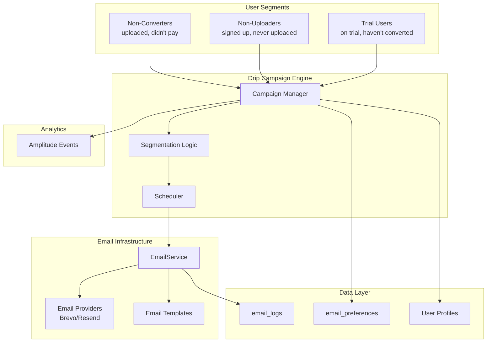

# Email Re-engagement Drip Campaign PRD

**Status:** Planning
**Priority:** High
**Created:** 2026-03-11
**Owner:** Feature Planning Architect

---

## 1. Context & Problem Statement

### 1.1 Current State

- **Day-1 retention: ~2%** (industry baseline: 20-30%)
- 98% of users never return after their first session
- The retention PRD (`docs/PRDs/retention-and-reengagement.md`) captures emails but doesn't detail what happens after capture
- Email infrastructure exists (`EmailService`, Brevo/Resend providers, templates) but is only used for transactional emails

### 1.2 Root Causes

| Issue | Impact |
|-------|--------|
| No systematic re-engagement after email capture | Users who don't return = lost conversion opportunity |
| No segmented messaging based on user behavior | Generic messaging doesn't address user context |
| Missing drip sequences | One-and-done communication loses users over time |
| No timing optimization | Emails sent at wrong times get ignored |

### 1.3 Business Case

**Conservative assumptions:**
- 1,000 new users/week
- 40% email capture rate = 400 emails/week
- 30% open rate, 10% click rate, 5% return rate
- 10% conversion from return users

**Projected impact:**
- 400 emails x 5% return = 20 returning users/week
- 20 x 10% conversion = 2 paid conversions/week
- ~$60/month in immediate revenue (at avg $30 subscription)
- Compounding: 100+ reactivated users/month building retention baseline

**Goal:** Increase Day-1 retention from 2% to 10%+ within 8 weeks

---

## 2. Solution Overview

### 2.1 Architecture



### 2.2 User Segments & Drip Sequences

#### Segment 1: Non-Converters (uploaded but didn't pay)

**Definition:** Users who uploaded at least one image but never purchased credits or subscription.

**Trigger:** `image_downloaded` event detected, no payment transaction after 24 hours.

| Day | Email Template | Subject | Key Message |
|-----|----------------|---------|-------------|
| 1 | `result-ready` | Your upscaled image is ready | Link to result (if saved), easy return |
| 3 | `premium-trial` | Try our premium models free | Trial offer, show premium benefits |
| 7 | `feature-showcase` | See what you're missing | Premium features, before/after examples |
| 14 | `win-back` | We miss you - 5 free credits | Incentive to return, limited time offer |

#### Segment 2: Non-Uploaders (signed up but never uploaded)

**Definition:** Users who created an account but never triggered `image_uploaded` event.

**Trigger:** 24 hours after account creation with no upload activity.

| Day | Email Template | Subject | Key Message |
|-----|----------------|---------|-------------|
| 1 | `getting-started` | Getting started with AI upscaling | Quick tutorial, value proposition |
| 3 | `possibility-showcase` | See what's possible | Before/after examples, use cases |
| 7 | `one-click-try` | Try it with one click | Sample image link, frictionless trial |

#### Segment 3: Trial Users (on trial, haven't converted)

**Definition:** Users with active `trial_end` date and no successful payment.

**Trigger:** Daily cron checking trial expiration.

| Day | Email Template | Subject | Key Message |
|-----|----------------|---------|-------------|
| Trial Day 3 | `trial-progress` | 3 days into your trial | Engagement tips, feature highlights |
| Trial Day 5 | `trial-reminder` | Your trial is halfway through | Usage stats, upgrade preview |
| 1 day before end | `trial-ending` | Your trial ends tomorrow | Urgency, limited-time discount |
| Day 0 (expired) | `trial-expired` | Your trial expired - continue with discount | Final offer, 20% off |

---

## 3. Technical Implementation

### 3.1 Database Schema Changes

**New table: `email_campaigns`**

```sql
CREATE TABLE public.email_campaigns (
  id UUID PRIMARY KEY DEFAULT gen_random_uuid(),
  name TEXT NOT NULL UNIQUE,
  segment TEXT NOT NULL CHECK (segment IN ('non_converter', 'non_uploader', 'trial_user')),
  template_name TEXT NOT NULL,
  send_day INTEGER NOT NULL CHECK (send_day > 0),
  subject TEXT NOT NULL,
  enabled BOOLEAN DEFAULT TRUE NOT NULL,
  priority INTEGER DEFAULT 0,
  created_at TIMESTAMPTZ DEFAULT NOW() NOT NULL,
  updated_at TIMESTAMPTZ DEFAULT NOW() NOT NULL
);

CREATE INDEX idx_email_campaigns_segment ON public.email_campaigns(segment);
CREATE INDEX idx_email_campaigns_enabled ON public.email_campaigns(enabled);
```

**New table: `email_campaign_queue`**

```sql
CREATE TABLE public.email_campaign_queue (
  id UUID PRIMARY KEY DEFAULT gen_random_uuid(),
  campaign_id UUID REFERENCES public.email_campaigns(id) ON DELETE CASCADE,
  user_id UUID REFERENCES public.profiles(id) ON DELETE CASCADE,
  email TEXT NOT NULL,
  scheduled_for TIMESTAMPTZ NOT NULL,
  sent_at TIMESTAMPTZ,
  status TEXT NOT NULL CHECK (status IN ('pending', 'sent', 'failed', 'cancelled')),
  error_message TEXT,
  created_at TIMESTAMPTZ DEFAULT NOW() NOT NULL,
  metadata JSONB DEFAULT '{}',
  UNIQUE(campaign_id, user_id)
);

CREATE INDEX idx_email_campaign_queue_scheduled ON public.email_campaign_queue(scheduled_for, status);
CREATE INDEX idx_email_campaign_queue_user ON public.email_campaign_queue(user_id, status);
```

**New table: `email_campaign_events`**

```sql
CREATE TABLE public.email_campaign_events (
  id UUID PRIMARY KEY DEFAULT gen_random_uuid(),
  queue_id UUID REFERENCES public.email_campaign_queue(id) ON DELETE CASCADE,
  event_type TEXT NOT NULL CHECK (event_type IN ('queued', 'sent', 'opened', 'clicked', 'unsubscribed', 'bounced', 'returned')),
  occurred_at TIMESTAMPTZ DEFAULT NOW() NOT NULL,
  metadata JSONB DEFAULT '{}'
);

CREATE INDEX idx_email_campaign_events_queue ON public.email_campaign_events(queue_id);
CREATE INDEX idx_email_campaign_events_type ON public.email_campaign_events(event_type);
CREATE INDEX idx_email_campaign_events_occurred ON public.email_campaign_events(occurred_at DESC);
```

**RLS Policies**

```sql
ALTER TABLE public.email_campaigns ENABLE ROW LEVEL SECURITY;
ALTER TABLE public.email_campaign_queue ENABLE ROW LEVEL SECURITY;
ALTER TABLE public.email_campaign_events ENABLE ROW LEVEL SECURITY;

-- Service role only
CREATE POLICY "Service role full access to campaigns"
  ON public.email_campaigns FOR ALL
  USING (auth.role() = 'service_role');

CREATE POLICY "Service role full access to queue"
  ON public.email_campaign_queue FOR ALL
  USING (auth.role() = 'service_role');

CREATE POLICY "Service role full access to events"
  ON public.email_campaign_events FOR ALL
  USING (auth.role() = 'service_role');

-- Users can view their own queued emails
CREATE POLICY "Users view own queue"
  ON public.email_campaign_queue FOR SELECT
  USING (auth.uid() = user_id);
```

### 3.2 API Routes

**`/api/campaigns/admin/queue` (POST)** - Queue emails for a segment

```typescript
interface IQueueCampaignInput {
  campaignId: string;
  segment: 'non_converter' | 'non_uploader' | 'trial_user';
  batchSize?: number;
}

interface IQueueCampaignResult {
  queued: number;
  skipped: number;
  errors: string[];
}
```

**`/api/campaigns/send` (POST)** - Process queue (cron/internal)

```typescript
interface ISendCampaignInput {
  secret: string; // Cron secret
  limit?: number;
}

interface ISendCampaignResult {
  sent: number;
  failed: number;
  remaining: number;
}
```

**`/api/campaigns/unsubscribe` (POST)** - One-click unsubscribe

```typescript
interface IUnsubscribeInput {
  token: string; // JWT token with user_id and campaign_id
}

interface IUnsubscribeResult {
  success: boolean;
}
```

### 3.3 Service Layer

**New file: `server/services/campaign.service.ts`**

```typescript
import { supabaseAdmin } from '@server/supabase/supabaseAdmin';
import { getEmailService } from './email.service';

export type UserSegment = 'non_converter' | 'non_uploader' | 'trial_user';

export interface ICampaignQueueParams {
  campaignId: string;
  segment: UserSegment;
  batchSize?: number;
}

export interface IQueueResult {
  queued: number;
  skipped: number;
  errors: string[];
}

/**
 * Service for managing drip email campaigns.
 * Handles segmentation, scheduling, and execution.
 */
export class CampaignService {
  /**
   * Queue emails for a specific segment and campaign.
   */
  async queueCampaign(params: ICampaignQueueParams): Promise<IQueueResult> {
    const { campaignId, segment, batchSize = 100 } = params;

    // 1. Get campaign definition
    const { data: campaign, error: campaignError } = await supabaseAdmin
      .from('email_campaigns')
      .select('*')
      .eq('id', campaignId)
      .eq('enabled', true)
      .single();

    if (campaignError || !campaign) {
      throw new Error(`Campaign not found: ${campaignError?.message}`);
    }

    // 2. Get segment users
    const users = await this.getSegmentUsers(segment, batchSize);
    const userIds = users.map(u => u.id);

    if (userIds.length === 0) {
      return { queued: 0, skipped: 0, errors: [] };
    }

    // 3. Queue emails (skip if already queued for this campaign)
    const scheduledFor = new Date();
    scheduledFor.setMinutes(scheduledFor.getMinutes() + 5); // 5 min buffer

    const { data: queued, error: queueError } = await supabaseAdmin
      .from('email_campaign_queue')
      .insert(
        userIds.map(userId => ({
          campaign_id: campaignId,
          user_id: userId,
          email: users.find(u => u.id === userId)!.email,
          scheduled_for: scheduledFor.toISOString(),
          status: 'pending',
          metadata: { segment },
        }))
      )
      .select()
      .onConflict('campaign_id, user_id')
      .ignore();

    return {
      queued: queued?.length || 0,
      skipped: userIds.length - (queued?.length || 0),
      errors: queueError ? [queueError.message] : [],
    };
  }

  /**
   * Process pending queued emails.
   */
  async processQueue(limit: number = 50): Promise<{ sent: number; failed: number; remaining: number }> {
    const now = new Date().toISOString();

    // 1. Get pending emails due for sending
    const { data: pending, error } = await supabaseAdmin
      .from('email_campaign_queue')
      .select('*, campaigns(*)')
      .eq('status', 'pending')
      .lte('scheduled_for', now)
      .limit(limit);

    if (error || !pending?.length) {
      return { sent: 0, failed: 0, remaining: 0 };
    }

    const emailService = getEmailService();
    let sent = 0;
    let failed = 0;

    // 2. Send each email
    for (const item of pending) {
      try {
        const result = await emailService.send({
          to: item.email,
          template: item.campaigns.template_name,
          data: {
            userName: item.metadata?.name,
            unsubscribeToken: this.generateUnsubscribeToken(item.user_id, item.campaign_id),
          },
          type: 'marketing',
          userId: item.user_id,
        });

        if (result.success && !result.skipped) {
          await supabaseAdmin
            .from('email_campaign_queue')
            .update({ status: 'sent', sent_at: new Date().toISOString() })
            .eq('id', item.id);

          await supabaseAdmin.from('email_campaign_events').insert({
            queue_id: item.id,
            event_type: 'sent',
          });

          sent++;
        } else if (result.skipped) {
          await supabaseAdmin
            .from('email_campaign_queue')
            .update({ status: 'cancelled' })
            .eq('id', item.id);
        }
      } catch (err) {
        await supabaseAdmin
          .from('email_campaign_queue')
          .update({
            status: 'failed',
            error_message: err instanceof Error ? err.message : 'Unknown error',
          })
          .eq('id', item.id);

        await supabaseAdmin.from('email_campaign_events').insert({
          queue_id: item.id,
          event_type: 'bounced',
          metadata: { error: err instanceof Error ? err.message : 'Unknown error' },
        });

        failed++;
      }
    }

    // 3. Check remaining
    const { count } = await supabaseAdmin
      .from('email_campaign_queue')
      .select('*', { count: 'exact', head: true })
      .eq('status', 'pending')
      .lte('scheduled_for', now);

    return { sent, failed, remaining: count || 0 };
  }

  /**
   * Get users for a specific segment.
   */
  private async getSegmentUsers(
    segment: UserSegment,
    limit: number
  ): Promise<Array<{ id: string; email: string }>> {
    switch (segment) {
      case 'non_converter': {
        // Users who uploaded but never paid
        const { data } = await supabaseAdmin
          .rpc('get_non_converter_segment', { limit_count: limit });
        return (data || []) as Array<{ id: string; email: string }>;
      }
      case 'non_uploader': {
        // Users who signed up but never uploaded
        const { data } = await supabaseAdmin
          .rpc('get_non_uploader_segment', { limit_count: limit });
        return (data || []) as Array<{ id: string; email: string }>;
      }
      case 'trial_user': {
        // Active trial users who haven't converted
        const { data } = await supabaseAdmin
          .rpc('get_trial_user_segment', { limit_count: limit });
        return (data || []) as Array<{ id: string; email: string }>;
      }
      default:
        return [];
    }
  }

  /**
   * Generate JWT token for one-click unsubscribe.
   */
  private generateUnsubscribeToken(userId: string, campaignId: string): string {
    // Implementation with JWT signing
    return Buffer.from(`${userId}:${campaignId}:${Date.now()}`).toString('base64');
  }
}

export function getCampaignService(): CampaignService {
  return new CampaignService();
}
```

### 3.4 Database Functions for Segmentation

**New migration: `supabase/migrations/20260311_create_campaign_segmentation.sql`**

```sql
-- Non-converters: uploaded but never paid
CREATE OR REPLACE FUNCTION public.get_non_converter_segment(limit_count INTEGER DEFAULT 100)
RETURNS TABLE (
  id UUID,
  email TEXT
) AS $$
BEGIN
  RETURN QUERY
  SELECT DISTINCT
    p.id,
    p.email
  FROM public.profiles p
  INNER JOIN public.processing_jobs pj ON pj.user_id = p.id
  LEFT JOIN public.credit_transactions ct
    ON ct.user_id = p.id
    AND ct.transaction_type IN ('purchase', 'subscription')
  LEFT JOIN public.subscriptions s ON s.user_id = p.id
  WHERE p.created_at >= NOW() - INTERVAL '30 days'
    AND pj.status = 'completed'
    AND ct.id IS NULL  -- No purchase transactions
    AND s.id IS NULL   -- No active subscription
    AND NOT EXISTS (
      -- Exclude users already queued for this campaign
      SELECT 1 FROM public.email_campaign_queue q
      INNER JOIN public.email_campaigns c ON c.id = q.campaign_id
      WHERE q.user_id = p.id
        AND c.segment = 'non_converter'
        AND q.status IN ('pending', 'sent')
    )
  ORDER BY p.created_at DESC
  LIMIT limit_count;
END;
$$ LANGUAGE plpgsql SECURITY DEFINER;

-- Non-uploaders: signed up but never uploaded
CREATE OR REPLACE FUNCTION public.get_non_uploader_segment(limit_count INTEGER DEFAULT 100)
RETURNS TABLE (
  id UUID,
  email TEXT
) AS $$
BEGIN
  RETURN QUERY
  SELECT
    p.id,
    p.email
  FROM public.profiles p
  LEFT JOIN public.processing_jobs pj ON pj.user_id = p.id
  WHERE p.created_at >= NOW() - INTERVAL '14 days'
    AND pj.id IS NULL  -- No processing jobs
    AND NOT EXISTS (
      -- Exclude users already queued for this campaign
      SELECT 1 FROM public.email_campaign_queue q
      INNER JOIN public.email_campaigns c ON c.id = q.campaign_id
      WHERE q.user_id = p.id
        AND c.segment = 'non_uploader'
        AND q.status IN ('pending', 'sent')
    )
  ORDER BY p.created_at DESC
  LIMIT limit_count;
END;
$$ LANGUAGE plpgsql SECURITY DEFINER;

-- Trial users: active trial, haven't converted
CREATE OR REPLACE FUNCTION public.get_trial_user_segment(limit_count INTEGER DEFAULT 100)
RETURNS TABLE (
  id UUID,
  email TEXT,
  trial_end TIMESTAMPTZ
) AS $$
BEGIN
  RETURN QUERY
  SELECT
    p.id,
    p.email,
    s.trial_end
  FROM public.profiles p
  INNER JOIN public.subscriptions s ON s.user_id = p.id
  WHERE s.status = 'trialing'
    AND s.trial_end > NOW()
    AND NOT EXISTS (
      -- Exclude users who already purchased
      SELECT 1 FROM public.credit_transactions ct
      WHERE ct.user_id = p.id
        AND ct.transaction_type IN ('purchase', 'subscription')
    )
    AND NOT EXISTS (
      -- Exclude users already queued for this campaign
      SELECT 1 FROM public.email_campaign_queue q
      INNER JOIN public.email_campaigns c ON c.id = q.campaign_id
      WHERE q.user_id = p.id
        AND c.segment = 'trial_user'
        AND q.status IN ('pending', 'sent')
    )
  ORDER BY s.trial_end ASC
  LIMIT limit_count;
END;
$$ LANGUAGE plpgsql SECURITY DEFINER;
```

### 3.5 Email Templates

**New templates to create in `emails/templates/`:**

| Template | File | Purpose |
|----------|------|---------|
| `result-ready` | `ResultReadyEmail.tsx` | Non-converter Day 1 |
| `premium-trial` | `PremiumTrialEmail.tsx` | Non-converter Day 3 |
| `feature-showcase` | `FeatureShowcaseEmail.tsx` | Non-converter Day 7 |
| `win-back` | `WinBackEmail.tsx` | Non-converter Day 14 |
| `getting-started` | `GettingStartedEmail.tsx` | Non-uploader Day 1 |
| `possibility-showcase` | `PossibilityShowcaseEmail.tsx` | Non-uploader Day 3 |
| `one-click-try` | `OneClickTryEmail.tsx` | Non-uploader Day 7 |
| `trial-progress` | `TrialProgressEmail.tsx` | Trial Day 3 |
| `trial-reminder` | `TrialReminderEmail.tsx` | Trial Day 5 |
| `trial-ending` | `TrialEndingEmail.tsx` | Trial -1 day |
| `trial-expired` | `TrialExpiredEmail.tsx` | Trial Day 0 |

**Template interface:**

```typescript
interface ICampaignEmailProps {
  userName?: string;
  baseUrl?: string;
  supportEmail?: string;
  appName?: string;
  unsubscribeToken?: string;
  // Template-specific props
  resultUrl?: string;
  creditOffer?: number;
  trialDaysRemaining?: number;
  discountPercent?: number;
}
```

---

## 4. Analytics Events

### 4.1 Event Definitions

| Event | Properties | Location |
|-------|------------|----------|
| `email_queued` | `campaign`, `segment`, `userId`, `campaignId` | CampaignService.queueCampaign() |
| `email_sent` | `campaign`, `messageId`, `template`, `userId` | CampaignService.processQueue() |
| `email_opened` | `campaign`, `messageId`, `userId` | Email webhook handler |
| `email_clicked` | `campaign`, `link`, `messageId`, `userId` | Email webhook handler |
| `email_unsubscribed` | `campaign`, `userId` | Unsubscribe handler |
| `reengagement_returned` | `campaign`, `userId`, `daysSinceLastVisit` | User session detection |

### 4.2 Webhook Handler for Email Events

**New route: `app/api/webhooks/email/route.ts`**

```typescript
import { NextRequest, NextResponse } from 'next/server';
import { supabaseAdmin } from '@server/supabase/supabaseAdmin';

/**
 * Handle email webhooks from providers (Brevo/Resend).
 * Tracks opens, clicks, bounces, and unsubscribes.
 */
export async function POST(request: NextRequest) {
  const signature = request.headers.get('signature');
  // Verify webhook signature...

  const body = await request.json();

  // Map provider events to our schema
  for (const event of body) {
    const { eventType, messageId, email, timestamp } = event;

    // Find corresponding queue entry
    const { data: queueEntry } = await supabaseAdmin
      .from('email_campaign_queue')
      .select('*')
      .eq('status', 'sent')
      .order('sent_at', { ascending: false })
      .limit(1)
      .single();

    if (!queueEntry) continue;

    // Log event
    await supabaseAdmin.from('email_campaign_events').insert({
      queue_id: queueEntry.id,
      event_type: mapEventType(eventType),
      occurred_at: new Date(timestamp).toISOString(),
      metadata: event,
    });

    // Handle unsubscribe
    if (eventType === 'unsubscribed') {
      await supabaseAdmin
        .from('email_preferences')
        .update({ marketing_emails: false })
        .eq('user_id', queueEntry.user_id);
    }
  }

  return NextResponse.json({ received: true });
}

function mapEventType(providerEvent: string): string {
  const mapping: Record<string, string> = {
    opened: 'opened',
    clicked: 'clicked',
    bounced: 'bounced',
    unsubscribed: 'unsubscribed',
    complained: 'unsubscribed',
  };
  return mapping[providerEvent] || 'opened';
}
```

---

## 5. Implementation Phases

### Phase 1: Database & Core Infrastructure (Week 1)

**Files to create:**
- `supabase/migrations/20260311_create_campaign_tables.sql`
- `supabase/migrations/20260311_create_campaign_segmentation.sql`
- `shared/types/campaign.types.ts`
- `server/services/campaign.service.ts`

**Tasks:**
- [ ] Create campaign tables with RLS
- [ ] Create segmentation functions
- [ ] Implement CampaignService with queue and process methods
- [ ] Add unsubscribe token generation

**Tests Required:**
| Test File | Test Name | Assertion |
|-----------|-----------|-----------|
| `tests/unit/server/campaign.service.unit.spec.ts` | `should queue campaign for non_converters` | `expect(result.queued).toBeGreaterThan(0)` |
| `tests/unit/server/campaign.service.unit.spec.ts` | `should skip already queued users` | `expect(result.skipped).toBeGreaterThan(0)` |
| `tests/unit/server/campaign.service.unit.spec.ts` | `should process queue successfully` | `expect(result.sent).toBeGreaterThan(0)` |

### Phase 2: API Routes (Week 1-2)

**Files to create:**
- `app/api/campaigns/admin/queue/route.ts`
- `app/api/campaigns/send/route.ts`
- `app/api/campaigns/unsubscribe/route.ts`
- `app/api/webhooks/email/route.ts`

**Tasks:**
- [ ] Create admin queue endpoint
- [ ] Create send endpoint (cron-triggered)
- [ ] Create unsubscribe endpoint with one-click flow
- [ ] Create webhook handler for provider events

**Tests Required:**
| Test File | Test Name | Assertion |
|-----------|-----------|-----------|
| `tests/api/campaign-queue.api.spec.ts` | `should require admin to queue` | `expect(status).toBe(403)` |
| `tests/api/campaign-queue.api.spec.ts` | `should queue campaign successfully` | `expect(result.queued).toBeGreaterThan(0)` |
| `tests/api/campaign-unsubscribe.api.spec.ts` | `should unsubscribe user from marketing` | `expect(prefs.marketing_emails).toBe(false)` |

### Phase 3: Email Templates (Week 2)

**Files to create:**
- `emails/templates/ResultReadyEmail.tsx`
- `emails/templates/PremiumTrialEmail.tsx`
- `emails/templates/FeatureShowcaseEmail.tsx`
- `emails/templates/WinBackEmail.tsx`
- `emails/templates/GettingStartedEmail.tsx`
- `emails/templates/PossibilityShowcaseEmail.tsx`
- `emails/templates/OneClickTryEmail.tsx`
- `emails/templates/TrialProgressEmail.tsx`
- `emails/templates/TrialReminderEmail.tsx`
- `emails/templates/TrialEndingEmail.tsx`
- `emails/templates/TrialExpiredEmail.tsx`

**Tasks:**
- [ ] Create all 11 campaign templates
- [ ] Add templates to base-email-provider-adapter.ts
- [ ] Implement unsubscribe links in all templates
- [ ] Add email preview testing

**Tests Required:**
| Test File | Test Name | Assertion |
|-----------|-----------|-----------|
| `tests/unit/emails/campaign-templates.unit.spec.ts` | `should render ResultReadyEmail` | Snapshot test |
| `tests/unit/emails/campaign-templates.unit.spec.ts` | `should include unsubscribe link` | `expect(html).toContain('unsubscribe')` |

### Phase 4: Cron Job & Automation (Week 2)

**Files to create:**
- `app/api/cron/queue-campaigns/route.ts`
- Update: `shared/config/security.ts` - Add cron routes

**Tasks:**
- [ ] Create cron job to queue new users daily
- [ ] Create cron job to send queued emails hourly
- [ ] Add cron secret authentication

**Tests Required:**
| Test File | Test Name | Assertion |
|-----------|-----------|-----------|
| `tests/api/cron-queue-campaigns.api.spec.ts` | `should require cron secret` | `expect(status).toBe(401)` |
| `tests/api/cron-queue-campaigns.api.spec.ts` | `should queue campaigns on schedule` | `expect(result).toBeDefined()` |

### Phase 5: Analytics Integration (Week 2-3)

**Tasks:**
- [ ] Add campaign events to Amplitude
- [ ] Create dashboard for email metrics
- [ ] Set up conversion tracking from emails
- [ ] Implement reengagement_returned event

### Phase 6: Launch & Optimization (Week 3+)

**Tasks:**
- [ ] Seed initial campaigns to database
- [ ] Run small batch test (100 users)
- [ ] Monitor deliverability and open rates
- [ ] Optimize send times based on engagement
- [ ] Iterate on copy based on performance

---

## 6. Success Metrics

### 6.1 Email Performance Metrics

| Metric | Target | Measurement |
|--------|--------|-------------|
| Email delivery rate | >98% | `email_logs.status = 'sent' / total` |
| Email open rate | >30% | `email_campaign_events.event_type = 'opened' / sent` |
| Email click rate | >10% | `email_campaign_events.event_type = 'clicked' / sent` |
| Unsubscribe rate | <2% | `email_campaign_events.event_type = 'unsubscribed' / sent` |
| Bounce rate | <5% | `email_campaign_events.event_type = 'bounced' / sent` |

### 6.2 Business Impact Metrics

| Metric | Baseline | Target | Measurement |
|--------|----------|--------|-------------|
| Day-1 retention | 2% | 10%+ | Amplitude cohort analysis |
| Day-7 retention | ~0.5% | 5%+ | Amplitude cohort analysis |
| Return rate from emails | N/A | 5%+ | `reengagement_returned / email_sent` |
| Conversion from email | N/A | 2%+ | Purchase events within 7 days of email |
| Weekly reactivated users | N/A | 20+ | Unique users returning via emails |

### 6.3 Dashboard Queries

**Campaign Performance:**

```sql
SELECT
  c.name as campaign,
  c.segment,
  COUNT(DISTINCT q.user_id) as sent,
  COUNT(DISTINCT CASE WHEN e.event_type = 'opened' THEN q.user_id END) as opened,
  COUNT(DISTINCT CASE WHEN e.event_type = 'clicked' THEN q.user_id END) as clicked,
  COUNT(DISTINCT CASE WHEN e.event_type = 'unsubscribed' THEN q.user_id END) as unsubscribed,
  ROUND(COUNT(DISTINCT CASE WHEN e.event_type = 'opened' THEN q.user_id END)::NUMERIC / COUNT(DISTINCT q.user_id) * 100, 2) as open_rate
FROM public.email_campaigns c
INNER JOIN public.email_campaign_queue q ON q.campaign_id = c.id
LEFT JOIN public.email_campaign_events e ON e.queue_id = q.id
WHERE c.enabled = true
  AND q.status = 'sent'
  AND q.sent_at >= NOW() - INTERVAL '7 days'
GROUP BY c.id, c.name, c.segment
ORDER BY open_rate DESC;
```

**Segment Return Rate:**

```sql
SELECT
  'non_converter' as segment,
  COUNT(DISTINCT q.user_id) as emailed,
  COUNT(DISTINCT CASE
    WHEN EXISTS (
      SELECT 1 FROM public.processing_jobs pj
      WHERE pj.user_id = q.user_id
        AND pj.created_at > q.sent_at
        AND pj.created_at <= q.sent_at + INTERVAL '7 days'
    ) THEN q.user_id
  END) as returned,
  ROUND(COUNT(DISTINCT CASE
    WHEN EXISTS (
      SELECT 1 FROM public.processing_jobs pj
      WHERE pj.user_id = q.user_id
        AND pj.created_at > q.sent_at
        AND pj.created_at <= q.sent_at + INTERVAL '7 days'
    ) THEN q.user_id
  END)::NUMERIC / COUNT(DISTINCT q.user_id) * 100, 2) as return_rate
FROM public.email_campaign_queue q
INNER JOIN public.email_campaigns c ON c.id = q.campaign_id
WHERE c.segment = 'non_converter'
  AND q.status = 'sent'
  AND q.sent_at >= NOW() - INTERVAL '30 days'
GROUP BY segment;
```

---

## 7. Send Time Optimization

### 7.1 Default Send Schedule

| Timezone | Send Window | Rationale |
|----------|-------------|-----------|
| US/EU | 10:00 AM - 2:00 PM local | Mid-week, mid-day engagement |
| Asia-Pacific | 8:00 PM - 10:00 PM local | Evening browsing |
| Latin America | 9:00 AM - 11:00 AM local | Morning commute |

### 7.2 Smart Scheduling (Future Enhancement)

After initial data collection, implement send time optimization:

```sql
-- Track best send times per user
CREATE TABLE public.email_send_time_preferences (
  user_id UUID REFERENCES public.profiles(id) ON DELETE CASCADE PRIMARY KEY,
  best_hour INTEGER CHECK (best_hour >= 0 AND best_hour <= 23),
  best_dayOfWeek INTEGER CHECK (best_dayOfWeek >= 0 AND best_dayOfWeek <= 6),
  sample_size INTEGER DEFAULT 1,
  last_updated TIMESTAMPTZ DEFAULT NOW()
);
```

---

## 8. Risk Assessment & Mitigation

| Risk | Impact | Probability | Mitigation |
|------|--------|-------------|------------|
| Low deliverability | High | Medium | Start with warm-up, use Brevo (300/day), monitor reputation |
| High unsubscribe rate | Medium | Low | Frequency caps (max 1/week), easy unsubscribe, value-focused content |
| Spam complaints | High | Low | Clear consent from retention PRD, one-click unsubscribe |
| Overwhelming free-tier limits | Low | Medium | Queue management, batch sending, fallback to Resend |
| Poor performance ROI | Medium | Medium | A/B test subject lines, optimize segments, iterate on copy |

---

## 9. Dependencies

### 9.1 Existing Components

- **Email infrastructure** - Complete (Brevo/Resend providers, EmailService)
- **email_preferences table** - Complete (from email-notifications-prd.md)
- **email_logs table** - Complete (audit trail)
- **Supabase profiles and subscriptions** - Complete

### 9.2 Blocking Items

- None - all infrastructure exists

### 9.3 Integration Points

- **Retention PRD** - Uses email capture from post-download flow
- **Analytics** - Events tracked to Amplitude
- **Stripe** - Trial status from subscriptions table

---

## 10. Testing Strategy

### 10.1 Unit Tests

- `CampaignService.queueCampaign()` - Test segmentation logic
- `CampaignService.processQueue()` - Test sending with mock EmailService
- Segmentation functions - Test SQL RPC functions

### 10.2 Integration Tests

- End-to-end: Queue -> Process -> Send -> Log
- Webhook handling: Open/Click events update database
- Unsubscribe flow: Token -> Preference update

### 10.3 Email Deliverability Tests

- Send test emails to seed list
- Verify SPF/DKIM/DMARC records
- Check spam folder placement
- Test on multiple providers (Gmail, Outlook, Apple)

---

## 11. Rollout Plan

### Week 1: Infrastructure & Non-Uploaders

- Deploy database migrations
- Implement CampaignService
- Create non-uploader templates
- Queue initial batch (100 users)

### Week 2: Non-Converters

- Create non-converter templates
- Queue users who uploaded in past 30 days
- Monitor performance metrics

### Week 3: Trial Users

- Create trial templates
- Set up daily cron for trial reminders
- A/B test subject lines

### Week 4+: Optimization

- Analyze performance by segment
- Iterate on copy and timing
- Scale to all users

---

## 12. Acceptance Criteria

- [ ] All database migrations deployed
- [ ] `yarn verify` passes
- [ ] CampaignService unit tests pass
- [ ] API endpoint tests pass
- [ ] Email templates render correctly
- [ ] Unsubscribe flow works end-to-end
- [ ] Cron jobs queue and send emails
- [ ] Analytics events fire correctly
- [ ] Dashboard shows campaign metrics
- [ ] 10 users successfully re-engaged in beta test

---

## 13. Future Enhancements

Out of scope for MVP but worth considering:

1. **AI-generated personalized copy** - LLM-based subject lines
2. **Predictive segmentation** - ML model to predict likely converters
3. **Multilingual campaigns** - Localized emails for non-English users
4. **SMS re-engagement** - For high-value trial users
5. **Push notification fallback** - For engaged web users
6. **Dynamic content blocks** - Personalized based on user history

---

## References

- `docs/PRDs/retention-and-reengagement.md` - Email capture mechanism
- `docs/PRDs/done/email-notifications-prd.md` - Email infrastructure
- `server/services/email.service.ts` - Email service implementation
- `server/services/email-providers/base-email-provider-adapter.ts` - Provider adapter
- `supabase/migrations/20260116_create_email_tables.sql` - Email tables
