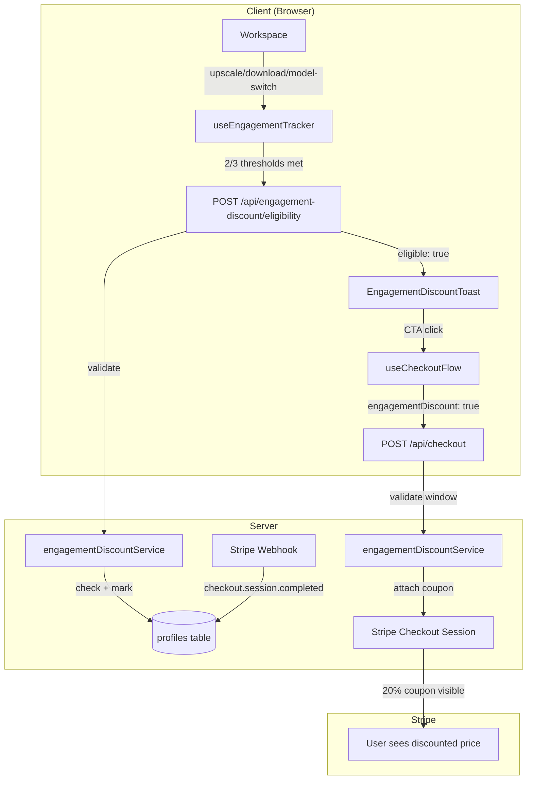
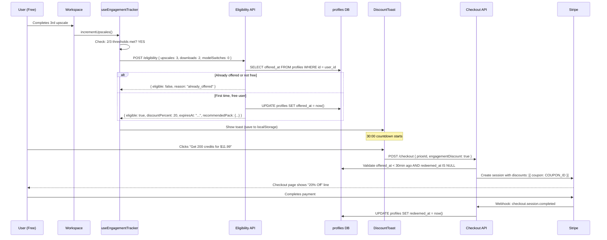

# PRD: Engagement-Based First-Purchase Discount

## Status: Ready

## Problem

Analytics reveals two buyer archetypes. Path 1 ("Limit-Hit") converts from friction (batch limit modal) and spends little ($4.99, 50 credits). Path 2 ("Feature-Engaged") converts organically after exploring models and completing upscales, spending 4x more ($14.99, 200 credits) with stronger post-purchase engagement.

Currently, no mechanism exists to proactively convert Path 2 users at the moment of peak engagement. They either convert on their own or churn. A strategically timed discount at peak engagement can capture these high-value users before they leave.

**Target persona:** Authenticated free user who has completed 3+ upscales, 2+ downloads, and/or 1+ model switch in a single session — demonstrating genuine product exploration, not just hitting a paywall.

## Files Analyzed

- `client/store/userStore.ts` — useUserData(), UserSegment, isFreeUser derivation
- `client/analytics/analyticsClient.ts` — Amplitude event tracking
- `server/analytics/types.ts` — IAnalyticsEventName event taxonomy
- `client/components/features/workspace/ModelGalleryModal.tsx` — model selection + gate
- `client/hooks/useCheckoutFlow.ts` — checkout initiation
- `app/api/checkout/route.ts` — checkout session creation, regional pricing
- `app/api/webhooks/stripe/handlers/payment.handler.ts` — purchase completion handling
- `shared/config/subscription.config.ts` — pricing config, credit packs
- `shared/config/pricing-regions.ts` — regional dynamic pricing
- `shared/types/stripe.types.ts` — UserSegment, IUserProfile
- `shared/config/env.ts` — environment variable access (clientEnv, serverEnv)
- `client/hooks/useRegionTier.ts` — regional pricing detection hook

## Current Behavior

- Free users get 10 credits on signup, no monthly refresh
- Upgrade prompts trigger reactively: batch limit, out of credits, premium model gate
- No proactive engagement-based behavioral triggers exist
- All free users see the same upgrade experience regardless of engagement level
- No promotional discount or coupon system exists (only regional pricing via inline `price_data`)
- Credit packs: Small (50 credits, $4.99), Medium (200 credits, $14.99), Large (600 credits, $39.99)

## Solution

### Approach

1. Track engagement signals (upscale count, download count, model switches) within a session for authenticated free users
2. When 2 of 3 thresholds are met (3+ upscales, 2+ downloads, 1+ model switch), call server to validate eligibility
3. Server confirms user is free segment, never been offered before, marks offer timestamp in DB
4. Client shows a non-intrusive slide-in toast with 20% off credit packs and a 30-minute countdown
5. CTA opens Stripe checkout with coupon attached; webhook marks redemption on purchase success

### Architecture



### Key Decisions

- **Stripe Coupon** (not inline `price_data`): User sees a visible "20% Off" discount line on Stripe checkout, reinforcing the special deal. Regional pricing continues to use `price_data` for the base amount — the coupon applies on top.
- **Credit packs only**: Subscription discounts add complexity and risk cannibalizing full-price subscribers. Path 2 buyers gravitate toward credit packs anyway.
- **Server-side gating**: Client requests eligibility, server decides. Prevents client manipulation and ensures one-time-per-user enforcement.
- **30-minute strict expiry**: After timeout, offer is gone permanently. Creates real urgency. Tracked via `engagement_discount_offered_at` timestamp in DB.
- **Stacks with regional pricing**: User sees their regional base price with 20% coupon on top. Indian user on medium pack: $14.99 → $5.25 (regional) → $4.20 (with coupon).
- **Recommended pack: Medium (200 credits)**: Matches Path 2 buyer behavior. Highest conversion value × reasonable entry price. Configurable in config.

### Engagement Signal Thresholds

Offer triggers when **2 of 3** signals are met in a single session:

| Signal              | Threshold | Rationale                                                  |
| ------------------- | --------- | ---------------------------------------------------------- |
| Successful upscales | 3+        | Past the "just trying it" zone — real use case established |
| Image downloads     | 2+        | Keeping outputs = genuine need, not casual browsing        |
| Model switches      | 1+        | Actively exploring premium features, curious about quality |

### Data Changes

**profiles table** (Supabase migration):

```sql
ALTER TABLE profiles
  ADD COLUMN engagement_discount_offered_at timestamptz DEFAULT NULL,
  ADD COLUMN engagement_discount_redeemed_at timestamptz DEFAULT NULL;

COMMENT ON COLUMN profiles.engagement_discount_offered_at IS 'Timestamp when the engagement-based discount offer was shown. NULL = never offered.';
COMMENT ON COLUMN profiles.engagement_discount_redeemed_at IS 'Timestamp when the user redeemed the engagement discount. NULL = never redeemed.';
```

**Stripe** (manual setup before deployment):

- Create coupon via Stripe Dashboard: name "Welcome Discount", percent_off: 20, duration: "once"
- Store coupon ID in `.env.api` as `STRIPE_ENGAGEMENT_DISCOUNT_COUPON_ID`

**Environment** (`.env.api`):

```
STRIPE_ENGAGEMENT_DISCOUNT_COUPON_ID=<coupon_id_from_stripe>
```

### Sequence Flow



### Toast UI Mockup

```
┌─────────────────────────────────────────────┐
│  ✨ Special Offer — Just for You            │
│                                             │
│  Get 200 credits for $11.99                 │
│  $14.99  ←(strikethrough)   Save 20%        │
│                                             │
│  ┌─────────────────┐                        │
│  │  Claim Offer ➜  │    Dismiss             │
│  └─────────────────┘                        │
│                                             │
│  ⏱ Expires in 28:42                         │
└─────────────────────────────────────────────┘
```

Position: Bottom-right, slide-in animation. Persists across page navigation within 30-min window (localStorage). Collapsed to a small badge after dismiss.

---

## Integration Points Checklist

```markdown
**How will this feature be reached?**

- [x] Entry point: useEngagementTracker hook monitors session signals in Workspace
- [x] Caller file: Workspace.tsx calls increment\*() on upscale/download/model-switch
- [x] Registration: Toast rendered in Workspace, eligibility API registered as route

**Is this user-facing?**

- [x] YES → EngagementDiscountToast component in Workspace

**Full user flow:**

1. User does: completes upscales, downloads images, switches models (normal usage)
2. Triggers: useEngagementTracker detects 2/3 thresholds met
3. Reaches new feature via: POST /api/engagement-discount/eligibility → toast rendered
4. Result displayed in: Slide-in toast with countdown → Stripe checkout with 20% off
```

---

## Execution Phases

### Phase 1: Configuration & Database — "Discount config and DB tracking columns exist"

**Files (4):**

- `shared/config/engagement-discount.config.ts` — Thresholds, discount %, offer duration, recommended pack
- `shared/types/engagement-discount.types.ts` — Type definitions for signals, offer state, API response
- Supabase migration file — Add columns to profiles
- `tests/unit/config/engagement-discount-config.unit.spec.ts` — Config validation tests

**Implementation:**

- [ ] Create `ENGAGEMENT_DISCOUNT_CONFIG` with: signal thresholds (upscales: 3, downloads: 2, modelSwitches: 1), requiredSignals: 2, discountPercent: 20, offerDurationMinutes: 30, recommendedPackKey: 'medium'
- [ ] Define types: `IEngagementSignals { upscales: number; downloads: number; modelSwitches: number }`, `IEngagementDiscountOffer { eligible: boolean; discountPercent: number; expiresAt: string; recommendedPack: { key: string; name: string; credits: number; originalPriceInCents: number; discountedPriceInCents: number } }`, `IEngagementDiscountEligibilityRequest { signals: IEngagementSignals }`, `IEngagementDiscountEligibilityResponse { eligible: boolean; reason?: string; offer?: IEngagementDiscountOffer }`
- [ ] Create Supabase migration: `ALTER TABLE profiles ADD COLUMN engagement_discount_offered_at timestamptz DEFAULT NULL, ADD COLUMN engagement_discount_redeemed_at timestamptz DEFAULT NULL`
- [ ] Add `STRIPE_ENGAGEMENT_DISCOUNT_COUPON_ID` to server env type definition in `shared/config/env.ts`

**Tests Required:**
| Test File | Test Name | Assertion |
|-----------|-----------|-----------|
| `tests/unit/config/engagement-discount-config.unit.spec.ts` | `should have valid signal thresholds (all > 0)` | upscales, downloads, modelSwitches all > 0 |
| `tests/unit/config/engagement-discount-config.unit.spec.ts` | `should have discount between 1 and 50 percent` | 1 <= discountPercent <= 50 |
| `tests/unit/config/engagement-discount-config.unit.spec.ts` | `should have offer duration > 0 minutes` | offerDurationMinutes > 0 |
| `tests/unit/config/engagement-discount-config.unit.spec.ts` | `should require between 1 and 3 signals` | 1 <= requiredSignals <= 3 |
| `tests/unit/config/engagement-discount-config.unit.spec.ts` | `should reference a valid credit pack key` | recommendedPackKey in ['small', 'medium', 'large'] |

**User Verification:**

- Action: Run migration, query profiles table schema
- Expected: `engagement_discount_offered_at` and `engagement_discount_redeemed_at` columns present, both nullable timestamptz

---

### Phase 2: Engagement Tracking + Eligibility API — "Server detects and validates qualified engaged users"

**Files (5):**

- `client/hooks/useEngagementTracker.ts` — Client-side session signal tracking hook
- `app/api/engagement-discount/eligibility/route.ts` — Eligibility check endpoint
- `server/services/engagementDiscountService.ts` — Server-side business logic
- `tests/unit/client/engagement-tracker.unit.spec.ts` — Hook unit tests
- `tests/unit/server/engagement-discount-eligibility.unit.spec.ts` — API + service tests

**Implementation:**

- [ ] Create `useEngagementTracker` hook:
  - Maintains session signal counts via `useRef` (resets on new session)
  - Exposes `incrementUpscales()`, `incrementDownloads()`, `incrementModelSwitches()`
  - On each increment, checks if `requiredSignals` thresholds are met (2 of 3)
  - When qualified AND no existing offer in localStorage, calls eligibility API
  - Saves offer response to localStorage with TTL (survives page refresh within 30 min)
  - Returns `{ offer: IEngagementDiscountOffer | null, isChecking: boolean, incrementUpscales, incrementDownloads, incrementModelSwitches }`
  - Skips entirely for non-free users (`userSegment !== 'free'`)
- [ ] Create POST `/api/engagement-discount/eligibility`:
  - Authenticate via Supabase JWT
  - Validate request body with Zod: `{ signals: { upscales: number, downloads: number, modelSwitches: number } }`
  - Call `engagementDiscountService.checkEligibility(userId, signals)`
  - Return `IEngagementDiscountEligibilityResponse`
- [ ] Create `engagementDiscountService.ts`:
  - `checkEligibility(userId, signals)`: Verify user is free segment (no subscription, no purchased credits, no stripe_customer_id), verify `engagement_discount_offered_at IS NULL`, verify signal counts meet thresholds, compute recommended pack with regional pricing
  - `markOffered(userId)`: Set `engagement_discount_offered_at = now()`
  - `isOfferValid(userId)`: Check `offered_at` within 30 min AND `redeemed_at IS NULL`
  - `markRedeemed(userId)`: Set `engagement_discount_redeemed_at = now()`

**Tests Required:**
| Test File | Test Name | Assertion |
|-----------|-----------|-----------|
| `tests/unit/client/engagement-tracker.unit.spec.ts` | `should not qualify with only 1 of 3 signals met` | offer === null, API not called |
| `tests/unit/client/engagement-tracker.unit.spec.ts` | `should qualify when 2 of 3 thresholds met (upscales + downloads)` | API called |
| `tests/unit/client/engagement-tracker.unit.spec.ts` | `should qualify when 2 of 3 thresholds met (upscales + model switches)` | API called |
| `tests/unit/client/engagement-tracker.unit.spec.ts` | `should qualify when all 3 thresholds met` | API called |
| `tests/unit/client/engagement-tracker.unit.spec.ts` | `should not call API if localStorage already has active offer` | API not called |
| `tests/unit/client/engagement-tracker.unit.spec.ts` | `should skip tracking for non-free users` | No state updates |
| `tests/unit/server/engagement-discount-eligibility.unit.spec.ts` | `should return eligible for free user never offered` | `eligible === true` |
| `tests/unit/server/engagement-discount-eligibility.unit.spec.ts` | `should return ineligible if already offered` | `eligible === false, reason === 'already_offered'` |
| `tests/unit/server/engagement-discount-eligibility.unit.spec.ts` | `should return ineligible for subscriber` | `eligible === false, reason === 'not_free_user'` |
| `tests/unit/server/engagement-discount-eligibility.unit.spec.ts` | `should return ineligible for credit purchaser` | `eligible === false, reason === 'not_free_user'` |
| `tests/unit/server/engagement-discount-eligibility.unit.spec.ts` | `should return ineligible if signal thresholds not met` | `eligible === false, reason === 'thresholds_not_met'` |
| `tests/unit/server/engagement-discount-eligibility.unit.spec.ts` | `should return 401 for unauthenticated request` | HTTP 401 |

**Verification Plan:**

```bash
# Happy path — eligible free user
curl -X POST http://localhost:3000/api/engagement-discount/eligibility \
  -H "Authorization: Bearer $FREE_USER_TOKEN" \
  -H "Content-Type: application/json" \
  -d '{"signals": {"upscales": 3, "downloads": 2, "modelSwitches": 1}}' | jq .
# Expected: {"eligible": true, "offer": {"discountPercent": 20, "expiresAt": "2026-...", "recommendedPack": {...}}}

# Second call — already offered
curl -X POST http://localhost:3000/api/engagement-discount/eligibility \
  -H "Authorization: Bearer $FREE_USER_TOKEN" \
  -H "Content-Type: application/json" \
  -d '{"signals": {"upscales": 3, "downloads": 2, "modelSwitches": 1}}' | jq .
# Expected: {"eligible": false, "reason": "already_offered"}
```

**User Verification:**

- Action: As a free user, complete 3 upscales and download 2 images in a single session
- Expected: Network tab shows POST to `/api/engagement-discount/eligibility` returning `eligible: true`

---

### Phase 3: Discount Toast UI — "Engaged users see a timed discount offer with countdown"

**Files (5):**

- `client/components/features/workspace/EngagementDiscountToast.tsx` — Slide-in toast component
- `client/components/features/workspace/Workspace.tsx` — Wire tracker + toast into workspace
- `client/hooks/useCountdown.ts` — Reusable countdown timer hook
- `tests/unit/client/engagement-discount-toast.unit.spec.tsx` — Component tests
- `tests/unit/client/use-countdown.unit.spec.ts` — Countdown hook tests

**Implementation:**

- [ ] Create `useCountdown(targetTimestamp)` hook:
  - Returns `{ minutes: number, seconds: number, isExpired: boolean, formattedTime: string }`
  - Updates every second via `setInterval`
  - Cleans up on unmount
- [ ] Create `EngagementDiscountToast` component:
  - Props: `offer: IEngagementDiscountOffer`, `onClaim: () => void`, `onDismiss: () => void`, `onExpire: () => void`
  - Slide-in animation from bottom-right (Tailwind `animate-` + `transition`)
  - Shows: offer headline, recommended pack name + credits, original price (strikethrough), discounted price, "Save X%" badge, countdown timer (MM:SS format)
  - Primary CTA: "Claim Offer" → calls `onClaim`
  - Secondary: "Dismiss" text button → calls `onDismiss`
  - On countdown expiry → calls `onExpire`, auto-hides with fade-out
  - Regional pricing support: display prices from `offer.recommendedPack` (already computed server-side)
  - Dark theme compatible (use Tailwind design tokens only)
  - Mobile responsive: full-width on small screens, fixed-width on desktop
- [ ] Wire into `Workspace.tsx`:
  - Use `useEngagementTracker()` to get offer state
  - Call `incrementUpscales()` when `upscale_completed` fires
  - Call `incrementDownloads()` when `image_download` fires
  - Call `incrementModelSwitches()` when `model_selection_changed` fires
  - Render `EngagementDiscountToast` when offer is active
  - `onClaim` → call `handleCheckout(offer.recommendedPack.priceId, { engagementDiscount: true })`
  - `onDismiss` → hide toast, keep offer in localStorage (still valid for 30 min if they navigate to checkout)
  - `onExpire` → clear offer from localStorage
- [ ] Track analytics: `engagement_discount_shown` on render, `engagement_discount_clicked` on CTA, `engagement_discount_dismissed` on dismiss, `engagement_discount_expired` on timer expiry

**Tests Required:**
| Test File | Test Name | Assertion |
|-----------|-----------|-----------|
| `tests/unit/client/use-countdown.unit.spec.ts` | `should return correct minutes and seconds` | Matches expected values |
| `tests/unit/client/use-countdown.unit.spec.ts` | `should mark as expired when target time passed` | `isExpired === true` |
| `tests/unit/client/engagement-discount-toast.unit.spec.tsx` | `should render with pack name, prices, and countdown` | Contains credit count, prices, timer |
| `tests/unit/client/engagement-discount-toast.unit.spec.tsx` | `should show strikethrough original price and discounted price` | Both prices present |
| `tests/unit/client/engagement-discount-toast.unit.spec.tsx` | `should call onClaim when CTA clicked` | onClaim called once |
| `tests/unit/client/engagement-discount-toast.unit.spec.tsx` | `should call onDismiss when dismiss clicked` | onDismiss called once |
| `tests/unit/client/engagement-discount-toast.unit.spec.tsx` | `should call onExpire when countdown reaches zero` | onExpire called |
| `tests/unit/client/engagement-discount-toast.unit.spec.tsx` | `should display regional prices when provided` | Shows regional discounted amount |

**User Verification:**

- Action: As a free user, complete 3 upscales and 2 downloads
- Expected: Slide-in toast appears bottom-right with "200 credits for $11.99 (was $14.99)", 30-minute countdown, and "Claim Offer" button

---

### Phase 4: Checkout Integration + Analytics — "20% discount applied at Stripe checkout, full funnel tracked"

**Files (5):**

- `app/api/checkout/route.ts` — Accept `engagementDiscount` flag, validate, attach Stripe coupon
- `app/api/webhooks/stripe/handlers/payment.handler.ts` — Mark redemption on successful purchase
- `server/analytics/types.ts` — New engagement discount event types
- `client/hooks/useCheckoutFlow.ts` — Pass `engagementDiscount` flag through checkout flow
- `tests/unit/server/engagement-discount-checkout.unit.spec.ts` — Checkout integration + webhook tests

**Implementation:**

- [ ] Update checkout request Zod schema: add optional `engagementDiscount?: boolean`
- [ ] In checkout route, when `engagementDiscount: true`:
  - Call `engagementDiscountService.isOfferValid(userId)` — check `offered_at` within 30 min AND `redeemed_at IS NULL`
  - If invalid: return 400 with descriptive error ("Discount offer has expired" or "Discount already redeemed")
  - If valid: add `discounts: [{ coupon: serverEnv.STRIPE_ENGAGEMENT_DISCOUNT_COUPON_ID }]` to Stripe session creation params
  - Add metadata to session: `engagement_discount: 'true'`
  - Track `engagement_discount_checkout_started` event
- [ ] In `handleCheckoutSessionCompleted` (payment webhook handler):
  - If session metadata includes `engagement_discount: 'true'`, call `engagementDiscountService.markRedeemed(userId)`
  - Track `engagement_discount_redeemed` event with pack, amount, discount saved
- [ ] Update `useCheckoutFlow` hook:
  - Accept optional `engagementDiscount?: boolean` in checkout options
  - Pass through to POST `/api/checkout` request body
- [ ] Add new event types to `IAnalyticsEventName`:
  - `'engagement_discount_qualified'` — 2/3 thresholds met (client)
  - `'engagement_discount_shown'` — Toast rendered (client)
  - `'engagement_discount_clicked'` — CTA clicked (client)
  - `'engagement_discount_dismissed'` — Toast dismissed (client)
  - `'engagement_discount_expired'` — Timer ran out (client)
  - `'engagement_discount_redeemed'` — Purchase completed with discount (server)

**Tests Required:**
| Test File | Test Name | Assertion |
|-----------|-----------|-----------|
| `tests/unit/server/engagement-discount-checkout.unit.spec.ts` | `should attach coupon when engagement discount is valid` | Stripe create called with `discounts` array containing coupon ID |
| `tests/unit/server/engagement-discount-checkout.unit.spec.ts` | `should reject discount if offer expired (>30 min)` | Returns 400, message contains "expired" |
| `tests/unit/server/engagement-discount-checkout.unit.spec.ts` | `should reject discount if already redeemed` | Returns 400, message contains "redeemed" |
| `tests/unit/server/engagement-discount-checkout.unit.spec.ts` | `should reject discount if user was never offered` | Returns 400, message contains "no active offer" |
| `tests/unit/server/engagement-discount-checkout.unit.spec.ts` | `should work without discount flag (normal checkout)` | No coupon attached, normal flow |
| `tests/unit/server/engagement-discount-checkout.unit.spec.ts` | `should include engagement_discount in session metadata` | metadata.engagement_discount === 'true' |
| `tests/unit/server/engagement-discount-checkout.unit.spec.ts` | `should stack with regional pricing (coupon on top of regional price_data)` | Both price_data discount and coupon present |

**Verification Plan:**

```bash
# Checkout with valid engagement discount
curl -X POST http://localhost:3000/api/checkout \
  -H "Authorization: Bearer $ELIGIBLE_USER_TOKEN" \
  -H "Content-Type: application/json" \
  -d '{"priceId": "price_xxx", "engagementDiscount": true}' | jq .
# Expected: { "url": "https://checkout.stripe.com/...", "sessionId": "cs_..." }
# Stripe session includes 20% coupon

# Checkout with expired offer (>30 min after offered_at)
curl -X POST http://localhost:3000/api/checkout \
  -H "Authorization: Bearer $EXPIRED_USER_TOKEN" \
  -H "Content-Type: application/json" \
  -d '{"priceId": "price_xxx", "engagementDiscount": true}' | jq .
# Expected: 400 { "error": "Discount offer has expired" }

# Normal checkout (no discount flag) — unchanged behavior
curl -X POST http://localhost:3000/api/checkout \
  -H "Authorization: Bearer $USER_TOKEN" \
  -H "Content-Type: application/json" \
  -d '{"priceId": "price_xxx"}' | jq .
# Expected: Normal checkout session without coupon
```

**User Verification:**

- Action: Click "Claim Offer" on the discount toast
- Expected: Stripe checkout opens showing the credit pack with a "Welcome Discount -20%" line, reducing the total

---

## Acceptance Criteria

- [ ] All phases complete
- [ ] All specified tests pass
- [ ] `yarn verify` passes
- [ ] All automated checkpoint reviews passed
- [ ] Free users see discount toast after meeting 2/3 engagement thresholds in a session
- [ ] Toast shows 30-minute countdown that updates in real-time
- [ ] Toast shows regional-adjusted prices when applicable
- [ ] CTA opens Stripe checkout with 20% coupon attached
- [ ] Stripe checkout page displays "Welcome Discount" with -20% line
- [ ] Discount stacks correctly with regional pricing (coupon on top of regional `price_data`)
- [ ] Offer is strictly one-time per user (never shown again after first showing)
- [ ] Offer survives page refresh within 30-min window (localStorage persistence)
- [ ] Server rejects discount at checkout if: offer expired (>30 min), already redeemed, or never offered
- [ ] Subscribers and credit purchasers never see the offer
- [ ] Analytics events track full funnel: qualified → shown → clicked/dismissed/expired → redeemed
- [ ] Feature is fully wired into Workspace (not orphaned code)

---

## Operational Setup (Pre-deployment)

1. **Create Stripe Coupon** (via Stripe Dashboard or API):
   - Name: "Welcome Discount"
   - Type: Percentage
   - Percent off: 20%
   - Duration: Once
   - No redemption limit (server controls eligibility)
   - Copy the coupon ID (e.g., `coupn_xxxx`)

2. **Set Environment Variable**:

   ```
   # .env.api
   STRIPE_ENGAGEMENT_DISCOUNT_COUPON_ID=<coupon_id>
   ```

3. **Run Database Migration**: Apply Supabase migration to add `engagement_discount_offered_at` and `engagement_discount_redeemed_at` columns to profiles

4. **Verify in staging**: Test full flow with a free test account before production deployment

---

## Edge Cases

| Scenario                                                               | Behavior                                                                                                                               |
| ---------------------------------------------------------------------- | -------------------------------------------------------------------------------------------------------------------------------------- |
| User qualifies but closes tab before toast appears                     | Server already marked `offered_at` — offer is consumed. On return, no toast (localStorage empty), no re-offer (DB has `offered_at`).   |
| User refreshes page during 30-min window                               | localStorage has offer data with `expiresAt` — toast re-renders with remaining time                                                    |
| User opens multiple tabs                                               | First tab to call eligibility API gets the offer. Other tabs see offer from localStorage.                                              |
| Timer expires while on checkout page                                   | Checkout still valid if session was already created. Stripe coupon applies regardless of timer.                                        |
| User navigates to billing page independently during offer window       | No auto-discount. Discount only applied via the explicit `engagementDiscount: true` checkout flag.                                     |
| Regional user qualifies                                                | Toast shows regional price with 20% on top. Checkout stacks regional `price_data` + Stripe coupon.                                     |
| User creates account, hits thresholds, and upgrades all in one session | Eligibility check happens after thresholds met. If they already purchased before the check, `not_free_user` prevents offer.            |
| Stripe coupon ID missing from env                                      | Checkout route returns 500 with clear error. Service logs warning. Toast is never shown (eligibility API checks coupon config exists). |

---

## Success Metrics

| Metric                              | Target                                  | Measurement                                                    |
| ----------------------------------- | --------------------------------------- | -------------------------------------------------------------- |
| Discount offer show rate            | 15-25% of free users who do 3+ upscales | `engagement_discount_shown` / free users with 3+ upscales      |
| Discount claim rate (click)         | 30-50% of shown                         | `engagement_discount_clicked` / `engagement_discount_shown`    |
| Discount conversion rate            | 40-60% of clicked                       | `engagement_discount_redeemed` / `engagement_discount_clicked` |
| Revenue per discount user           | > $11.99 (medium pack)                  | Average revenue from users who redeemed                        |
| 30-day retention of discount buyers | > Path 1 buyers                         | Cohort comparison vs batch-limit converters                    |
| Overall conversion rate lift        | +0.5-1.0% of free→paid                  | Before/after comparison                                        |

---

## Future Considerations (Out of Scope)

- **A/B testing discount percentage**: Test 15% vs 20% vs 25% to find optimal conversion/revenue balance
- **Personalized pack recommendation**: Based on usage patterns (heavy user → medium/large, light user → small)
- **Re-engagement email**: If user qualifies but doesn't convert within 30 min, send a follow-up email with a 24-hour extended offer
- **Subscription discount variant**: Offer 20% off first month of subscription for users who show subscription-like usage patterns (daily returns)
- **Graduated thresholds**: Lower thresholds for users from high-conversion regions
