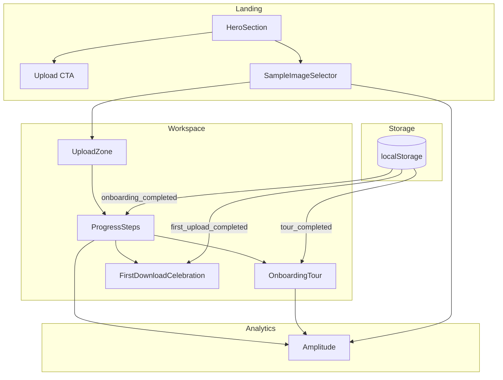
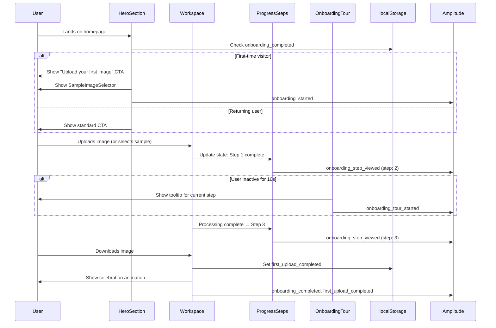

# First-Time User Activation — Converting Visitors to Uploaders

`Complexity: 5 MEDIUM mode`

## 1. Context

**Problem:** Analytics data (March 2026) reveals 150-300 daily active users but only 50-137 image uploads per day. Approximately 50% of users who visit the site never engage with the core feature (uploading an image).

**Current Behavior:**

- Landing page hero section lacks a clear, prominent CTA
- Upload zone requires scrolling to reach on some viewport sizes
- No low-friction way to experience the product without uploading
- No visual guidance for first-time users through the upsell process
- Users who don't upload never convert to paying customers

**Integration Points Checklist:**

```
How will this feature be reached?
- [x] Entry points: Homepage hero, direct traffic, pSEO CTAs
- [x] Caller files: Workspace.tsx (main orchestrator), landing page components
- [x] Registration/wiring: New components wired into Workspace and landing page

Is this user-facing?
- [x] YES UI components: Hero redesign, SampleImageSelector, OnboardingTour, ProgressSteps

Full user flow:
1. First-time visitor lands on homepage
2. Sees clear CTA and drag-drop zone above fold
3. Optionally clicks sample image to try instantly
4. Sees progress indicator through upsell process
5. Completes first download with celebration
6. Onboarding tour highlights available for confused users
```

## 2. Problem Statement

Users arrive at MyImageUpscaler but approximately 50% never upload an image. This indicates:

1. **Unclear value proposition** - Users don't immediately understand what the tool does
2. **High friction to first value** - Upload zone not immediately visible
3. **No risk-free trial** - Users must have an image ready to try the product
4. **No guidance** - First-time users don't know what to expect from the process

Users who don't upload never convert to paid customers, making activation the critical bottleneck for growth.

## 3. Goals

1. Increase upload rate from ~50% to 70%+ of daily active users
2. Reduce time-to-first-upload through clearer CTAs
3. Provide a zero-friction way to experience the product (sample images)
4. Guide first-time users through the upload → configure → download flow
5. Achieve 60%+ onboarding completion rate
6. Improve first-upload-to-download rate to 90%+
7. Improve Day-1 retention from 1.2% to 5%+

## 4. Non-Goals

- Full user account system (covered in other PRDs)
- Persistent identity/authentication (covered in retention PRD)
- Email capture during onboarding (covered in retention PRD)
- A/B testing infrastructure (future work)
- Gamification or rewards (future work)

## 5. Proposed Solution

Four incremental phases, each building on the previous:

### Phase 1: Hero Redesign — "Clear CTA Above the Fold"

**Goal:** Make the primary action (upload) immediately visible and obvious.

**Current State Analysis:**

The current hero section has several issues:
- CTA button text may not be descriptive enough
- Drag-and-drop zone visibility varies by viewport
- Before/after examples may not be immediately visible
- Value proposition is text-heavy rather than visual

**Proposed Changes:**

1. **Clear CTA Button Above Fold**
   - Text: "Upload your first image" (explicit, action-oriented)
   - Position: Top-right of hero, always visible without scrolling
   - Secondary CTA: "Try a sample" (links to Phase 2)

2. **Drag-and-Drop Zone Visibility**
   - Ensure zone is visible on 1366x768 (most common resolution) without scrolling
   - Add visual cue: animated dashed border when no file is selected
   - Add pulsing effect to draw attention

3. **Before/After Examples**
   - Side-by-side comparison visible in hero section
   - Label: "Original" vs "Upscaled 4x" with arrow indicating transformation
   - Use real results from actual processing

**Files (5):**

- `client/components/landing/HeroSection.tsx` — MODIFY for CTA and layout
- `client/components/features/workspace/UploadZone.tsx` — MODIFY for visibility improvements
- `shared/styles/hero.css` or equivalent Tailwind classes — MODIFY for animations
- `tests/unit/client/hero-redesign.unit.spec.tsx` — NEW test file
- `locales/en/landing.json` or equivalent — MODIFY for new copy

**Implementation:**

- [ ] Update hero layout to ensure upload zone visible at 1366x768 viewport
- [ ] Add "Upload your first image" CTA button with pulsing animation
- [ ] Add animated dashed border to drag-drop zone when empty
- [ ] Add before/after comparison image to hero section
- [ ] Add secondary "Try a sample" button (wired to Phase 2 component)
- [ ] Track click events on both CTAs

**Analytics Events:**

| Event | Properties | Location |
|-------|------------|----------|
| `hero_upload_cta_clicked` | `ctaType: 'primary' \| 'secondary'` | HeroSection |
| `hero_upload_zone_visible` | `viewportHeight`, `scrollDepth` | HeroSection (via IntersectionObserver) |

**Tests Required:**

| Test File | Test Name | Assertion |
|-----------|-----------|-----------|
| `tests/unit/client/hero-redesign.unit.spec.tsx` | `should show upload CTA button in hero` | Button element with text "Upload your first image" exists |
| `tests/unit/client/hero-redesign.unit.spec.tsx` | `should show drag-drop zone above fold on 1366x768` | Zone visible without scroll at target viewport |
| `tests/unit/client/hero-redesign.unit.spec.tsx` | `should fire hero_upload_cta_clicked on CTA click` | analytics.track called with correct event |

**Verification Plan:**

1. **Unit Tests:** 3 tests as listed above
2. **Evidence Required:**
   - [ ] All tests pass (`yarn test`)
   - [ ] `yarn verify` passes
   - [ ] Manual check: CTA visible at 1366x768 viewport
   - [ ] Manual check: Before/after image renders correctly

**User Verification:**

- Action: Visit homepage as first-time visitor
- Expected: "Upload your first image" button visible without scrolling, drag-drop zone with animated border, before/after comparison visible

---

### Phase 2: Sample Images — "Try with a Sample Image"

**Goal:** Remove friction for users who don't have an image ready.

**Design:**

Show 3 pre-configured sample images that users can click to instantly experience upscaling:

```
[Don't have an image? Try a sample]
[ Photo ] [ Illustration ] [ Old Photo ]
   ↓           ↓               ↓
 Before→After slider for each
```

**Sample Image Specifications:**

- **Photo**: Portrait or product photo (shows general upscaling)
- **Illustration**: Digital art or vector (shows detail preservation)
- **Old Photo**: Scanned vintage photo (shows restoration capability)

Each sample is pre-configured with optimal settings for its type.

**Files (6):**

- `client/components/features/workspace/SampleImageSelector.tsx` — NEW component
- `client/hooks/useSampleImages.ts` — NEW hook for sample image management
- `public/samples/` — NEW directory for sample images (3 images, ~50KB each)
- `shared/config/sample-images.config.ts` — NEW config for sample metadata
- `tests/unit/client/sample-images.unit.spec.tsx` — NEW test file
- `locales/en/workspace.json` — MODIFY for sample image labels

**Implementation:**

```typescript
// Interface for sample image configuration
interface ISampleImage {
  id: string;
  type: 'photo' | 'illustration' | 'old_photo';
  src: string; // Path to optimized sample image
  beforeSrc: string; // Path to before version
  afterSrc: string; // Path to after version (upscaled)
  qualityTier: QualityTier; // Optimal tier for this type
  scaleFactor: number;
  title: string;
  description: string;
}

// localStorage key for tracking
const SAMPLE_IMAGES_USED_KEY = 'miu_sample_images_used';
const ONBOARDING_COMPLETED_KEY = 'miu_onboarding_completed';
```

- [ ] Create sample image assets (optimize for web: WebP format, ~50KB each)
- [ ] Create `SampleImageSelector` component with 3 sample cards
- [ ] Each card shows: thumbnail, title, one-click "Try this" button
- [ ] On click: automatically upload and process with optimal settings
- [ ] Show before/after comparison after processing
- [ ] Store used sample images in localStorage (for analytics)
- [ ] Only show to first-time users (no upload history)
- [ ] Track `sample_image_selected` event with `sampleType` property

**Analytics Events:**

| Event | Properties | Location |
|-------|------------|----------|
| `sample_image_selector_viewed` | `availableSamples: number` | SampleImageSelector |
| `sample_image_selected` | `sampleType: 'photo' \| 'illustration' \| 'old_photo'` | SampleImageSelector |
| `sample_image_processed` | `sampleType`, `durationMs`, `qualityTier` | SampleImageSelector (after processing) |
| `first_upload_completed` | `source: 'sample' \| 'upload'` | Workspace (global tracker) |

**Tests Required:**

| Test File | Test Name | Assertion |
|-----------|-----------|-----------|
| `tests/unit/client/sample-images.unit.spec.tsx` | `should render 3 sample image cards` | 3 cards with correct metadata |
| `tests/unit/client/sample-images.unit.spec.tsx` | `should not show samples to returning users` | Component returns null when upload history exists |
| `tests/unit/client/sample-images.unit.spec.tsx` | `should fire sample_image_selected on card click` | analytics.track called with correct event and sampleType |
| `tests/unit/client/sample-images.unit.spec.tsx` | `should store used samples in localStorage` | localStorage updated correctly after selection |

**Verification Plan:**

1. **Unit Tests:** 4 tests as listed above
2. **Evidence Required:**
   - [ ] All tests pass (`yarn test`)
   - [ ] `yarn verify` passes
   - [ ] Manual check: Sample images render correctly
   - [ ] Manual check: Clicking sample processes and shows before/after

**User Verification:**

- Action: Visit homepage as first-time user, click "Photo" sample
- Expected: Image automatically uploads, processes, shows before/after comparison

---

### Phase 3: Progress Indicator — "Visual Progress for First-Time Users"

**Goal:** Guide users through the upsell process and set expectations.

**Design:**

```
Step 1: Upload      Step 2: Configure      Step 3: Download
    [Active]             [Pending]            [Pending]
        ●                   ○                   ○
```

**Progress States:**

1. **Upload** — Active when no image is selected
2. **Configure** — Active when image is uploaded, before processing starts
3. **Download** — Active when processing is complete

**Celebration:**

After first successful download, show a celebratory animation:

```
First upscale complete!
[Celebration animation]
Want to try another image?
[Upload Another] [See Premium Plans]
```

**Files (4):**

- `client/components/features/workspace/ProgressSteps.tsx` — NEW component
- `client/components/features/workspace/FirstDownloadCelebration.tsx` — NEW component
- `client/components/features/workspace/Workspace.tsx` — MODIFY to integrate progress
- `tests/unit/client/progress-indicator.unit.spec.tsx` — NEW test file

**Implementation:**

```typescript
// Progress state interface
interface IProgressState {
  currentStep: 1 | 2 | 3;
  isFirstUpload: boolean;
}

// localStorage key for tracking first upload
const FIRST_UPLOAD_COMPLETED_KEY = 'miu_first_upload_completed';
```

- [ ] Create `ProgressSteps` component with 3-step indicator
- [ ] Active step has filled circle and bold text, pending steps have outlined circles
- [ ] Steps update based on workspace state (no image → uploaded → processed)
- [ ] Only show to first-time users (check `FIRST_UPLOAD_COMPLETED_KEY`)
- [ ] Create `FirstDownloadCelebration` component with confetti animation
- [ ] Show celebration only once (set flag in localStorage)
- [ ] Track `onboarding_step_viewed` event for each step
- [ ] Track `onboarding_completed` event on first download

**Analytics Events:**

| Event | Properties | Location |
|-------|------------|----------|
| `onboarding_started` | `timestamp` | ProgressSteps (on first mount) |
| `onboarding_step_viewed` | `step: 1 \| 2 \| 3`, `durationToStepMs` | ProgressSteps |
| `onboarding_completed` | `totalDurationMs`, `source: 'sample' \| 'upload'` | FirstDownloadCelebration |
| `first_upload_completed` | `source: 'sample' \| 'upload'`, `durationMs` | Workspace |

**Tests Required:**

| Test File | Test Name | Assertion |
|-----------|-----------|-----------|
| `tests/unit/client/progress-indicator.unit.spec.tsx` | `should show Step 1 active when no image` | Step 1 marked active, others pending |
| `tests/unit/client/progress-indicator.unit.spec.tsx` | `should advance to Step 2 after upload` | Step 2 active after image state changes |
| `tests/unit/client/progress-indicator.unit.spec.tsx` | `should advance to Step 3 after processing` | Step 3 active after upscale completes |
| `tests/unit/client/progress-indicator.unit.spec.tsx` | `should show celebration on first download` | Celebration component renders on first download |
| `tests/unit/client/progress-indicator.unit.spec.tsx` | `should not show progress to returning users` | ProgressSteps returns null when flag exists |

**Verification Plan:**

1. **Unit Tests:** 5 tests as listed above
2. **Evidence Required:**
   - [ ] All tests pass (`yarn test`)
   - [ ] `yarn verify` passes
   - [ ] Manual check: Progress steps update correctly through flow
   - [ ] Manual check: Celebration animation shows on first download

**User Verification:**

- Action: Upload first image as new user
- Expected: See "Step 1: Upload" → "Step 2: Configure" → "Step 3: Download" progression, then celebration animation

---

### Phase 4: Onboarding Tooltips — "Skippable 3-Step Tour"

**Goal:** Provide contextual help for confused users without annoying experienced users.

**Design:**

Tooltip tour highlights 3 key areas:

1. **Upload Zone** — "Drag and drop any image here, or click to browse"
2. **Quality Selector** — "Choose your quality tier. Higher quality = better results"
3. **Download Button** — "Click to download your upscaled image"

**Behavior:**

- Only show to users with <1 upload (no `FIRST_UPLOAD_COMPLETED_KEY` flag)
- Auto-trigger after 10 seconds of inactivity OR manual "Show me how" button
- Skippable at any step (X button)
- Don't re-show after completion or skip

**Files (5):**

- `client/components/features/workspace/OnboardingTour.tsx` — NEW component
- `client/hooks/useOnboardingTour.ts` — NEW hook for tour state management
- `client/components/features/workspace/Workspace.tsx` — MODIFY to integrate tour
- `tests/unit/client/onboarding-tour.unit.spec.tsx` — NEW test file
- `locales/en/workspace.json` — MODIFY for tour tooltip content

**Implementation:**

```typescript
// Tour step interface
interface ITourStep {
  id: string;
  target: string; // CSS selector for target element
  title: string;
  content: string;
  position: 'top' | 'bottom' | 'left' | 'right';
}

// localStorage keys
const TOUR_COMPLETED_KEY = 'miu_onboarding_tour_completed';
const TOUR_SKIPPED_KEY = 'miu_onboarding_tour_skipped';
const TOUR_CURRENT_STEP_KEY = 'miu_onboarding_tour_current_step';
```

- [ ] Create `OnboardingTour` component with 3 steps
- [ ] Use portal/overlay to position tooltips correctly
- [ ] Add "Next", "Previous", "Skip tour" buttons to each tooltip
- [ ] Highlight target element with overlay (darken rest of UI)
- [ ] Auto-trigger after 10s inactivity OR manual button click
- [ ] Store completion/skip state in localStorage
- [ ] Track `onboarding_tour_started`, `onboarding_tour_step_viewed`, `onboarding_tour_completed`, `onboarding_tour_skipped`

**Analytics Events:**

| Event | Properties | Location |
|-------|------------|----------|
| `onboarding_tour_started` | `trigger: 'auto' \| 'manual'` | OnboardingTour |
| `onboarding_tour_step_viewed` | `step: 1 \| 2 \| 3`, `trigger` | OnboardingTour |
| `onboarding_tour_completed` | `totalDurationMs`, `trigger` | OnboardingTour |
| `onboarding_tour_skipped` | `step: 1 \| 2 \| 3`, `trigger` | OnboardingTour |

**Tests Required:**

| Test File | Test Name | Assertion |
|-----------|-----------|-----------|
| `tests/unit/client/onboarding-tour.unit.spec.tsx` | `should render first step on tour start` | First tooltip with correct content |
| `tests/unit/client/onboarding-tour.unit.spec.tsx` | `should advance to next step on Next click` | Second tooltip shown after Next click |
| `tests/unit/client/onboarding-tour.unit.spec.tsx` | `should complete tour and set localStorage flag` | Tour completed, flag set |
| `tests/unit/client/onboarding-tour.unit.spec.tsx` | `should skip tour and set skip flag` | Tour skipped, skip flag set |
| `tests/unit/client/onboarding-tour.unit.spec.tsx` | `should not show tour to returning users` | Tour doesn't start when flag exists |

**Verification Plan:**

1. **Unit Tests:** 5 tests as listed above
2. **Evidence Required:**
   - [ ] All tests pass (`yarn test`)
   - [ ] `yarn verify` passes
   - [ ] Manual check: Tour triggers after 10s inactivity
   - [ ] Manual check: Manual "Show me how" button triggers tour
   - [ ] Manual check: All 3 steps render correctly

**User Verification:**

- Action: Stay on homepage for 10s without uploading as first-time user
- Expected: Tour tooltip appears highlighting upload zone

---

## 6. Architecture Diagram



## 7. Sequence Flow



## 8. Analytics Schema Additions

The following event types need to be added to `server/analytics/types.ts`:

```typescript
// Add to IAnalyticsEventName union type:
export type IAnalyticsEventName =
  // ... existing events ...
  | 'onboarding_started'
  | 'onboarding_step_viewed'
  | 'onboarding_completed'
  | 'onboarding_tour_started'
  | 'onboarding_tour_step_viewed'
  | 'onboarding_tour_completed'
  | 'onboarding_tour_skipped'
  | 'hero_upload_cta_clicked'
  | 'hero_upload_zone_visible'
  | 'sample_image_selector_viewed'
  | 'sample_image_selected'
  | 'sample_image_processed'
  | 'first_upload_completed';

// Add new property interfaces:
export interface IOnboardingStepViewedProperties {
  step: 1 | 2 | 3;
  durationToStepMs: number;
  source?: 'sample' | 'upload';
}

export interface IOnboardingCompletedProperties {
  totalDurationMs: number;
  source: 'sample' | 'upload';
  uploadCount: number;
}

export interface IOnboardingTourStepViewedProperties {
  step: 1 | 2 | 3;
  trigger: 'auto' | 'manual';
}

export interface ISampleImageSelectedProperties {
  sampleType: 'photo' | 'illustration' | 'old_photo';
}

export interface ISampleImageProcessedProperties {
  sampleType: 'photo' | 'illustration' | 'old_photo';
  durationMs: number;
  qualityTier: string;
}

export interface IFirstUploadCompletedProperties {
  source: 'sample' | 'upload';
  durationMs: number;
  fileSize?: number;
  fileType?: string;
}
```

## 9. Checkpoint Protocol

All phases use **Automated Checkpoint** (prd-work-reviewer agent). Phases 1, 2, and 3 additionally require **Manual Checkpoint** for visual UI verification.

## 10. Implementation Priority

| Phase | What                              | Effort   | Expected Impact                                   |
| ----- | --------------------------------- | -------- | ------------------------------------------------- |
| **1** | Hero redesign (CTA, drag-drop)    | 2-3 days | +15-20% upload rate (clearer action)              |
| **2** | Sample images for instant trial   | 1-2 days | +20-25% activation from non-uploaders             |
| **3** | Progress indicator + celebration  | 2-3 days | +10% completion rate, +5% Day-1 retention         |
| **4** | Onboarding tooltips tour          | 1-2 days | +5% conversion for confused users, reduced support |

**Total Estimated Effort:** 6-10 days

## 11. Validation Criteria

### Metrics to Track (via Amplitude)

| Metric | Current | Target | Measurement |
|--------|---------|--------|-------------|
| Upload rate (uploads/DAU) | ~50% | 70%+ | `image_uploaded` / `page_view` |
| First-upload completion | N/A | 90%+ | `first_upload_completed` / `image_uploaded` |
| Onboarding completion | N/A | 60%+ | `onboarding_completed` / `onboarding_started` |
| Sample image usage | N/A | 15% of first uploads | `sample_image_selected` / `first_upload_completed` |
| Day-1 retention | 1.2% | 5%+ | Return users within 24h |
| Tour completion rate | N/A | 40%+ | `onboarding_tour_completed` / `onboarding_tour_started` |
| Tour skip rate | N/A | <30% | `onboarding_tour_skipped` / `onboarding_tour_started` |

### Success Criteria

- [ ] Upload rate increases from 50% to 70%+ within 4 weeks
- [ ] Onboarding completion rate >60%
- [ ] First-upload-to-download rate >90%
- [ ] Day-1 retention improves from 1.2% to 5%+
- [ ] Sample image selection rate >15% of first uploads
- [ ] All unit tests pass (17 tests total)
- [ ] `yarn verify` passes

## 12. Testing

### Unit Tests

| Phase | Tests | File |
|-------|-------|------|
| 1 — Hero Redesign | 3 tests | `tests/unit/client/hero-redesign.unit.spec.tsx` |
| 2 — Sample Images | 4 tests | `tests/unit/client/sample-images.unit.spec.tsx` |
| 3 — Progress Indicator | 5 tests | `tests/unit/client/progress-indicator.unit.spec.tsx` |
| 4 — Onboarding Tour | 5 tests | `tests/unit/client/onboarding-tour.unit.spec.tsx` |

**Total: 17 new tests**

### E2E Tests

- [ ] First-time visitor flow: Landing → Upload → Configure → Download → Celebration
- [ ] Sample image flow: Landing → Select sample → Processing → Download
- [ ] Onboarding tour flow: Auto-trigger → Complete all 3 steps → Verify flag set
- [ ] Returning user flow: Verify onboarding elements NOT shown

## 13. Risks & Mitigation

| Risk | Impact | Mitigation |
|------|--------|------------|
| **Hero redesign reduces conversion** | HIGH | A/B test with subset of users before full rollout |
| **Sample images increase costs** | MEDIUM | Use aggressive caching, limit to 3 small images (~150KB total) |
| **Onboarding tour annoys users** | MEDIUM | Make it easily skippable, don't auto-trigger on return visits |
| **Progress indicator clutter** | LOW | Only show to first-time users, hide after completion |
| **localStorage key collisions** | LOW | Use consistent `miu_` prefix for all keys |
| **Celebration animation performance** | LOW | Use CSS animations, avoid heavy JS libraries |

## 14. Dependencies

- **Analytics Instrumentation V2** (PRD exists) — required for proper event tracking
- **Current Workspace component** — needs to be extensible for new components
- **LocalStorage utilities** — may need to create shared utility for consistent key management

## 15. Future Considerations

Out of scope for this PRD but worth noting:

- **A/B testing infrastructure** — to test hero copy, CTA variations, sample image selection
- **Personalization** — showing relevant sample images based on referral source
- **Progressive enhancement** — more advanced onboarding for enterprise users
- **Accessibility** — ensure all onboarding elements are keyboard navigable and screen-reader friendly
- **Internationalization** — translate all onboarding copy for supported locales

## 16. Changelog

| Date | Version | Changes |
|------|---------|---------|
| 2026-03-11 | 1.0 | Initial PRD creation |

---

**Related PRDs:**
- `/docs/PRDs/retention-and-reengagement.md` — Sample images section reference
- `/docs/PRDs/ux-conversion-optimization.md` — UX patterns reference
