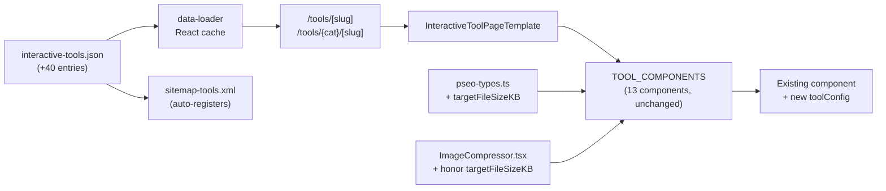

# Functional pSEO Tool Expansion — 40+ Config-Driven Variations

> Planning Mode: Principal Architect
> **Complexity: 4 → MEDIUM mode** (6–10 files, no new components, content-heavy)
> Owner: TBD · Created: 2026-04-23

**Constraint restated:** every new page must be a **real working interactive tool**, not a static landing page. All variations reuse existing components in `TOOL_COMPONENTS` with a different `toolConfig`. If a variation can't be expressed via `toolConfig`, it's out of scope for this PRD.

---

## 0. Complexity Assessment

| Factor                                      | Score          |
| ------------------------------------------- | -------------- |
| Touches 6-10 files                          | +2             |
| New system/module                           | 0              |
| Complex state logic                         | 0              |
| Multi-package                               | 0              |
| DB schema changes                           | 0              |
| External API                                | 0              |
| Content volume (40+ pages, ~800 words each) | +2             |
| **Total**                                   | **4 → MEDIUM** |

---

## 1. Context

**Problem:** We currently have **34 functional interactive tool pages** covering 13 components. Competitor coverage (upscale.media, iloveimg, tinypng, simpleimageresizer, etc.) is 100–300 variants per category. We're leaving long-tail organic traffic on the table for keywords like `webp to avif`, `resize image for snapchat`, `crop image to 1:1`, `compress image to 100kb`, `heic to webp`. Every one of these queries can be served by an **existing component** with a different preset — zero new code, just config + SEO content.

**Files Analyzed:**

- `app/(pseo)/_components/pseo/templates/InteractiveToolPageTemplate.tsx:42-103` — `TOOL_COMPONENTS` registry (13 components) and `getToolProps` switch
- `lib/seo/pseo-types.ts:81-100` — `IToolConfig` interface (fields per component)
- `app/seo/data/interactive-tools.json` — 34 existing pages, data source for the sitemap
- `app/sitemap-tools.xml/route.ts:17-80` — `INTERACTIVE_TOOL_PATHS` slug→path map; auto-registers any new slug
- `app/(pseo)/tools/{resize,convert,compress}/[slug]/page.tsx` — subcategory route handlers (already exist; reusable)
- `middleware.ts:454` — `isPSEOPath` already covers all `/tools/*` paths

**Current Inventory** (from subagent inventory, 2026-04-23):

| Component           | Existing Pages                | Config-driven                   |
| ------------------- | ----------------------------- | ------------------------------- |
| ImageResizer        | 11 (1 generic + 10 platforms) | via width/height/preset         |
| FormatConverter     | 10 (format pairs)             | via targetFormat + inputFormats |
| ImageCropper        | 5 (generic + presets)         | via aspectRatio                 |
| ExifRemover         | 4                             | no config                       |
| ImageToPdfConverter | 4                             | via inputFormats                |
| HeicConverter       | 2                             | via outputFormat                |
| PdfToImageConverter | 2                             | via outputFormat + dpi          |
| ImageToText         | 2                             | no config                       |
| Others (5)          | 1 each                        | limited                         |

**Current behavior gaps:**

- `ImageCompressor` has **zero** variants despite being the highest-volume intent ("compress image to 100kb" alone has ~60K searches/month).
- `ImageCropper` has only 5 variants — generic aspect ratios (1:1, 16:9, 9:16, 4:3, 3:2) are missing.
- Only 10 format-conversion pairs exist; AVIF-out, WEBP-in-edge-cases, HEIC-to-WEBP missing.
- Resize covers 10 platforms but misses Snapchat, Threads, Bluesky, WhatsApp Status, X Header, YouTube Shorts.

---

## 2. Solution

**Approach:**

- Treat expansion as a **content + config batch**, not a code project. Each new page = one JSON entry + one `INTERACTIVE_TOOL_PATHS` map entry (if subcategorized) + SEO content.
- Introduce one small `IToolConfig` extension: `targetFileSizeKB?: number` for `ImageCompressor` to enable "compress to X KB" variants (the highest-traffic gap). This is the **only** code change touching component logic.
- Ship in 5 content-batch phases by category so each phase is independently shippable, testable, and reviewable.
- Every page passes the **functional test**: open the URL → upload a fixture → get a correct output → file matches expected format/dimension/size.

**Architecture Diagram:**



**Key Decisions:**

- **One code change only:** add `targetFileSizeKB` to `IToolConfig` and teach `ImageCompressor` to iterate quality until output blob ≤ target. Everything else is pure content.
- **Subcategory routing**: continue using existing `/tools/resize/`, `/tools/convert/`, `/tools/compress/` subcategory handlers. Add a new **`/tools/crop/`** subcategory route for the 10 new crop-aspect-ratio pages (mirrors the existing `/tools/resize/` pattern).
- **Content uniqueness:** each page has a genuinely distinct `intro`, `uniqueIntro`, `expandedDescription`, `pageSpecificDetails`, `features`, `useCases`, `benefits`, `howItWorks`, `faq`. **Copy-paste with find-replace is not acceptable** — Google's Helpful Content system penalizes it. Minimum 800 unique words per page. Use variation-specific hooks (target platform specs, exact file size targets, etc.) as the anchor.
- **Keyword targeting:** one primary keyword per page + 4–6 LSI/secondary. Must match actual search intent (pick from GSC / Ahrefs / our prior keyword research, not invented).
- **Localization:** `tools` is a `LOCALIZED` category — but we ship English-first. Do **not** add 7× translations in this PRD; translations are a follow-up (translation-workflow skill). Hreflang will emit only available locales (already handled).
- **Out of scope:** new components (bulk format converter, bulk crop, etc.), image-to-avif server-side (existing client FormatConverter only supports JPEG/PNG/WEBP via canvas), TIFF/SVG input. These are separate PRDs.

**Data Changes:** One `IToolConfig` field added. Forty+ JSON entries added. No DB changes.

---

## 3. The Expansion Matrix (the spec)

**Phases 1–5 deliver this matrix.** Every row = one page. Counts exclude existing pages.

### Phase 1 — FormatConverter expansion (+6)

| Slug          | Path                         | toolConfig                                                              |
| ------------- | ---------------------------- | ----------------------------------------------------------------------- |
| `jpg-to-webp` | `/tools/convert/jpg-to-webp` | `{ defaultTargetFormat: 'webp', acceptedInputFormats: ['image/jpeg'] }` |
| `png-to-webp` | `/tools/convert/png-to-webp` | `{ defaultTargetFormat: 'webp', acceptedInputFormats: ['image/png'] }`  |
| `bmp-to-png`  | `/tools/convert/bmp-to-png`  | `{ defaultTargetFormat: 'png', acceptedInputFormats: ['image/bmp'] }`   |
| `gif-to-png`  | `/tools/convert/gif-to-png`  | `{ defaultTargetFormat: 'png', acceptedInputFormats: ['image/gif'] }`   |
| `gif-to-webp` | `/tools/convert/gif-to-webp` | `{ defaultTargetFormat: 'webp', acceptedInputFormats: ['image/gif'] }`  |
| `bmp-to-webp` | `/tools/convert/bmp-to-webp` | `{ defaultTargetFormat: 'webp', acceptedInputFormats: ['image/bmp'] }`  |

_Note: `webp-to-avif` and `_-to-avif`are deferred — current`FormatConverter` doesn't support AVIF output. Separate PRD.\*

### Phase 2 — ImageCropper expansion (+10)

New subcategory: `/tools/crop/[slug]`.

| Slug                   | Path                               | toolConfig                                                      |
| ---------------------- | ---------------------------------- | --------------------------------------------------------------- |
| `crop-image-to-square` | `/tools/crop/crop-image-to-square` | `{ defaultAspectRatio: 1, aspectRatioPresets: '1:1' }`          |
| `crop-image-to-16-9`   | `/tools/crop/crop-image-to-16-9`   | `{ defaultAspectRatio: 16/9, aspectRatioPresets: '16:9' }`      |
| `crop-image-to-9-16`   | `/tools/crop/crop-image-to-9-16`   | `{ defaultAspectRatio: 9/16, aspectRatioPresets: '9:16' }`      |
| `crop-image-to-4-3`    | `/tools/crop/crop-image-to-4-3`    | `{ defaultAspectRatio: 4/3, aspectRatioPresets: '4:3' }`        |
| `crop-image-to-3-2`    | `/tools/crop/crop-image-to-3-2`    | `{ defaultAspectRatio: 3/2, aspectRatioPresets: '3:2' }`        |
| `crop-image-to-21-9`   | `/tools/crop/crop-image-to-21-9`   | `{ defaultAspectRatio: 21/9, aspectRatioPresets: '21:9' }`      |
| `crop-image-to-4-5`    | `/tools/crop/crop-image-to-4-5`    | `{ defaultAspectRatio: 4/5, aspectRatioPresets: '4:5' }`        |
| `crop-image-to-2-3`    | `/tools/crop/crop-image-to-2-3`    | `{ defaultAspectRatio: 2/3, aspectRatioPresets: '2:3' }`        |
| `crop-passport-photo`  | `/tools/crop/crop-passport-photo`  | `{ defaultAspectRatio: 35/45, aspectRatioPresets: 'passport' }` |
| `crop-profile-picture` | `/tools/crop/crop-profile-picture` | `{ defaultAspectRatio: 1, aspectRatioPresets: 'profile' }`      |

### Phase 3 — ImageCompressor "compress to X" (+7)

Requires `targetFileSizeKB` config + component logic change.

| Slug                          | Path                                          | toolConfig                                                                                                |
| ----------------------------- | --------------------------------------------- | --------------------------------------------------------------------------------------------------------- |
| `compress-image-to-100kb`     | `/tools/compress/compress-image-to-100kb`     | `{ targetFileSizeKB: 100 }`                                                                               |
| `compress-image-to-200kb`     | `/tools/compress/compress-image-to-200kb`     | `{ targetFileSizeKB: 200 }`                                                                               |
| `compress-image-to-500kb`     | `/tools/compress/compress-image-to-500kb`     | `{ targetFileSizeKB: 500 }`                                                                               |
| `compress-image-to-1mb`       | `/tools/compress/compress-image-to-1mb`       | `{ targetFileSizeKB: 1024 }`                                                                              |
| `compress-image-to-2mb`       | `/tools/compress/compress-image-to-2mb`       | `{ targetFileSizeKB: 2048 }`                                                                              |
| `compress-image-for-email`    | `/tools/compress/compress-image-for-email`    | `{ targetFileSizeKB: 5120 }` (most email limits are 10–25MB, aim for 5MB safe default)                    |
| `compress-image-for-whatsapp` | `/tools/compress/compress-image-for-whatsapp` | `{ targetFileSizeKB: 100 }` (WhatsApp auto-compresses but users want to pre-compress for quality control) |

### Phase 4 — ImageResizer platform expansion (+8)

| Slug                               | Path                                             | toolConfig                                                                     |
| ---------------------------------- | ------------------------------------------------ | ------------------------------------------------------------------------------ |
| `resize-image-for-snapchat`        | `/tools/resize/resize-image-for-snapchat`        | `{ defaultWidth: 1080, defaultHeight: 1920, presetFilter: 'snapchat' }`        |
| `resize-image-for-threads`         | `/tools/resize/resize-image-for-threads`         | `{ defaultWidth: 1080, defaultHeight: 1350, presetFilter: 'threads' }`         |
| `resize-image-for-bluesky`         | `/tools/resize/resize-image-for-bluesky`         | `{ defaultWidth: 1000, defaultHeight: 500, presetFilter: 'bluesky' }`          |
| `resize-image-for-whatsapp-status` | `/tools/resize/resize-image-for-whatsapp-status` | `{ defaultWidth: 1080, defaultHeight: 1920, presetFilter: 'whatsapp' }`        |
| `resize-image-for-youtube-shorts`  | `/tools/resize/resize-image-for-youtube-shorts`  | `{ defaultWidth: 1080, defaultHeight: 1920, presetFilter: 'youtube-shorts' }`  |
| `resize-image-for-instagram-reels` | `/tools/resize/resize-image-for-instagram-reels` | `{ defaultWidth: 1080, defaultHeight: 1920, presetFilter: 'instagram-reels' }` |
| `resize-image-for-twitter-header`  | `/tools/resize/resize-image-for-twitter-header`  | `{ defaultWidth: 1500, defaultHeight: 500, presetFilter: 'twitter-header' }`   |
| `resize-image-for-linkedin-banner` | `/tools/resize/resize-image-for-linkedin-banner` | `{ defaultWidth: 1584, defaultHeight: 396, presetFilter: 'linkedin-banner' }`  |

### Phase 5 — HEIC + PDF + misc (+5)

| Slug                  | Path                                 | toolConfig                                                          |
| --------------------- | ------------------------------------ | ------------------------------------------------------------------- |
| `heic-to-webp`        | `/tools/convert/heic-to-webp`        | `{ defaultOutputFormat: 'webp' }`                                   |
| `pdf-to-webp`         | `/tools/convert/pdf-to-webp`         | `{ defaultOutputFormat: 'webp', defaultDpi: 150 }`                  |
| `pdf-to-jpg-hq`       | `/tools/convert/pdf-to-jpg-hq`       | `{ defaultOutputFormat: 'jpeg', defaultDpi: 300 }`                  |
| `pdf-to-png-hq`       | `/tools/convert/pdf-to-png-hq`       | `{ defaultOutputFormat: 'png', defaultDpi: 300 }`                   |
| `merge-images-to-pdf` | `/tools/convert/merge-images-to-pdf` | `{ acceptedInputFormats: ['image/jpeg','image/png','image/webp'] }` |

_Note: `heic-to-webp` requires verifying `HeicConverter` supports `'webp'` output. If it's currently `'jpeg' \| 'png'` only, extend the union and add conversion path (small code change — include in Phase 5)._

**Total new pages: 6 + 10 + 7 + 8 + 5 = 36 functional pages.**

---

## 4. Execution Phases

### Phase 1 — Format conversion pairs (6 pages) · _User sees 6 new /tools/convert/_ pages with working conversion\*

**Files (4):**

- `app/seo/data/interactive-tools.json` — append 6 entries
- `app/sitemap-tools.xml/route.ts` — add 6 slug→path entries to `INTERACTIVE_TOOL_PATHS`
- `tests/unit/seo/format-converter-expansion.unit.spec.ts` — **new file**
- `tests/e2e/format-converter-expansion.spec.ts` — **new file**

**Implementation:**

- [ ] Write 6 JSON entries following the existing `png-to-jpg` / `jpg-to-png` shape. Each must:
  - Have a unique `metaTitle` (40–60 chars), `metaDescription` (120–160 chars), `h1`, `intro`, `uniqueIntro`, `description` (≥150 chars), `expandedDescription`, `pageSpecificDetails`
  - List 5 `features`, 4 `useCases`, 3 `benefits`, 4 `howItWorks` steps, 6 `faq` entries — content uniquely framed around the specific format pair
  - Set `isInteractive: true`, `toolComponent: 'FormatConverter'`, `toolConfig` as per matrix, `maxFileSizeMB: 25`
  - `relatedTools`: cross-link to at least 2 sibling conversion pages + 1 complementary tool (compressor/resizer)
- [ ] Update `INTERACTIVE_TOOL_PATHS` map in `sitemap-tools.xml/route.ts`
- [ ] Test assertions below

**Tests Required:**
| Test File | Test Name | Assertion |
|---|---|---|
| `format-converter-expansion.unit.spec.ts` | `should register all 6 new slugs in sitemap` | Each slug emits a `<loc>` with correct full URL |
| `format-converter-expansion.unit.spec.ts` | `should set toolComponent=FormatConverter for all new entries` | JSON filter matches 6 entries |
| `format-converter-expansion.unit.spec.ts` | `should have unique metaTitle across all format pairs` | Set size = 16 (existing 10 + new 6) |
| `format-converter-expansion.unit.spec.ts` | `should have ≥800 words total content per entry` | Sum of description + expandedDescription + pageSpecificDetails + features/useCases/benefits/faq text |
| `format-converter-expansion.spec.ts` (E2E) | `bmp-to-png should convert a BMP fixture` | Visit page, upload fixture.bmp, click Convert, download, assert file starts with PNG magic bytes `89 50 4E 47` |
| `format-converter-expansion.spec.ts` (E2E) | `jpg-to-webp should produce a WEBP blob` | Download blob starts with `52 49 46 46 .. 57 45 42 50` (RIFF…WEBP) |

**Verification Plan:**

1. **Unit tests** `yarn test tests/unit/seo/format-converter-expansion.unit.spec.ts` green
2. **E2E** `yarn playwright test tests/e2e/format-converter-expansion.spec.ts` green — exercises actual tool functionality
3. **curl smoke:**
   ```bash
   for slug in jpg-to-webp png-to-webp bmp-to-png gif-to-png gif-to-webp bmp-to-webp; do
     curl -sI "http://localhost:3000/tools/convert/$slug" | head -1
   done
   # Expected: 6× HTTP/1.1 200
   curl -s http://localhost:3000/sitemap-tools.xml | grep -cE 'jpg-to-webp|png-to-webp|bmp-to-png|gif-to-png|gif-to-webp|bmp-to-webp'
   # Expected: 6
   ```
4. **`yarn verify`** passes

**User Verification:**

- Each of 6 URLs loads, shows the FormatConverter widget with correct default target format, upload→convert→download produces a valid file of the target format.

**Checkpoint:** `prd-work-reviewer` agent. Block until PASS.

---

### Phase 2 — Image cropper aspect ratio variants (10 pages + new subcategory route) · _User can crop to any standard aspect ratio via dedicated SEO pages_

**Files (5):**

- `app/(pseo)/tools/crop/[slug]/page.tsx` — **new file**; mirror of `app/(pseo)/tools/resize/[slug]/page.tsx`
- `app/sitemap-tools.xml/route.ts` — add 10 slug→path entries + register `crop` subcategory
- `app/seo/data/interactive-tools.json` — append 10 entries
- `tests/unit/seo/image-cropper-expansion.unit.spec.ts` — **new file**
- `tests/e2e/image-cropper-expansion.spec.ts` — **new file**

**Implementation:**

- [ ] Copy `app/(pseo)/tools/resize/[slug]/page.tsx` to `crop/[slug]/page.tsx`. Update to load from cropper-filtered slugs. If resize uses the generic `/tools/[slug]` route already, the new `/tools/crop/` folder is only needed if we want URL branding; otherwise all 10 slugs work under `/tools/[slug]` directly. **Decision check in Phase 0 of implementation:** verify whether `/tools/crop/crop-image-to-square` vs `/tools/crop-image-to-square` better matches the existing pattern. If resize uses subcategory and gets the SEO benefit, mirror it. Otherwise, flatten to `/tools/crop-image-to-square`.
- [ ] Write 10 JSON entries with unique content (see Phase 1 standards). Anchor each page's content on:
  - Exact dimensions shipped by platforms that use that ratio
  - Specific use cases (1:1 → profile pics, 9:16 → Stories/Reels, 21:9 → cinematic wallpapers)
  - 6 unique FAQs per page, not recycled
- [ ] `relatedTools` cross-link: each crop page links to 2–3 sibling ratios + `/tools/image-resizer` + `/tools/image-cropper`

**Tests Required:**
| Test File | Test Name | Assertion |
|---|---|---|
| `image-cropper-expansion.unit.spec.ts` | `should register 10 new crop slugs in sitemap` | Each URL present with `priority` ≥ 0.8 |
| `image-cropper-expansion.unit.spec.ts` | `should pass defaultAspectRatio to ImageCropper via getToolProps` | Unit-test `getToolProps('ImageCropper', {defaultAspectRatio: 16/9})` returns `{defaultAspectRatio: 1.7777…, aspectRatioPresets: '16:9'}` |
| `image-cropper-expansion.unit.spec.ts` | `each page should have unique intro, h1, metaTitle` | Set size = 10 across fields |
| `image-cropper-expansion.spec.ts` (E2E) | `crop-image-to-square should crop a landscape image to 1:1` | Upload 1600×900, apply default crop, assert output is 900×900 (or square near-max) |
| `image-cropper-expansion.spec.ts` (E2E) | `crop-image-to-9-16 should lock aspect to 9:16` | Attempt to drag handles to 16:9 → aspect stays locked to 9:16 |

**Verification Plan:**

1. Unit + E2E green
2. **Playwright visual proof:** screenshot before/after crop for square + 9:16 + 21:9
3. `yarn verify` passes

**Checkpoint:** `prd-work-reviewer` + manual UI check. Block until PASS.

---

### Phase 3 — ImageCompressor "compress to target KB" (7 pages + config extension + component logic) · _User can enter a target file size and get a compressed image at or below it_

**Files (5):**

- `lib/seo/pseo-types.ts` — extend `IToolConfig` with `targetFileSizeKB?: number`
- `app/(pseo)/_components/pseo/templates/InteractiveToolPageTemplate.tsx` — add `targetFileSizeKB` to `getToolProps` case for `ImageCompressor`
- `app/(pseo)/_components/tools/ImageCompressor.tsx` — if `targetFileSizeKB` prop is set, run a binary-search compression loop (start at q=0.85, adjust ±0.1 until blob size ≤ target or 6 iterations; clamp 0.1–0.98; if still over, warn "Image too large to hit target — smallest reached: X KB")
- `app/seo/data/interactive-tools.json` — append 7 entries
- `tests/unit/components/image-compressor-target-size.unit.spec.ts` + `tests/e2e/image-compressor-target-size.spec.ts` — **new files**

**Implementation:**

- [ ] Extend type: `targetFileSizeKB?: number`
- [ ] Wire `getToolProps`: `case 'ImageCompressor': return { defaultQuality, targetFileSizeKB }`
- [ ] In `ImageCompressor.tsx`:
  - Accept new prop
  - If set, override the quality slider with a "Target size" display + hide/demote manual quality
  - Binary-search quality: start 0.85, if blob > target then q -= (q / 2), else q += (q / 2)… typical bisection. Halt at ≤ target or 6 iterations or q within 0.01 of bounds. Expose result size back to UI.
  - Show actual achieved size next to target ("Target: 100 KB · Result: 98 KB ✓")
- [ ] Write 7 JSON entries — distinct content per target size (email-compression FAQs differ from WhatsApp-compression FAQs; 100KB use cases differ from 2MB use cases)

**Tests Required:**
| Test File | Test Name | Assertion |
|---|---|---|
| `image-compressor-target-size.unit.spec.ts` | `binary search converges to target within 6 iterations` | Mock canvas; feed 5MB source; target 500KB → final blob ≤500KB, iterations ≤6 |
| `image-compressor-target-size.unit.spec.ts` | `should warn when target unreachable` | 100KB target on a 300KB source-that-can't-go-below-150KB → UI shows "smallest reached" message |
| `image-compressor-target-size.unit.spec.ts` | `should ignore manual quality slider when targetFileSizeKB set` | prop check |
| `image-compressor-target-size.spec.ts` (E2E) | `compress-image-to-100kb happy path` | Upload fixture ~800KB JPEG → output blob ≤ 100KB, still displays |
| `image-compressor-target-size.spec.ts` (E2E) | `compress-image-for-email renders target 5MB` | Check UI copy "Target: 5 MB" visible on page load |

**Verification Plan:**

1. Unit + E2E green
2. **Manual verification on real images:** phone photo (3–5MB) → compress-to-100KB → result ≤100KB, visually acceptable (not a scrambled mess)
3. `yarn verify` passes

**Checkpoint:** `prd-work-reviewer` + manual. Block until PASS.

---

### Phase 4 — Resize platform expansion (8 pages) · _User finds dedicated resize pages for 8 missing platforms_

**Files (3):**

- `app/seo/data/interactive-tools.json` — append 8 entries
- `app/sitemap-tools.xml/route.ts` — add 8 slug→path entries
- `tests/unit/seo/resize-platforms-expansion.unit.spec.ts` + `tests/e2e/resize-platforms-expansion.spec.ts` — **new files**

**Implementation:**

- [ ] Write 8 JSON entries. Each anchored on the specific platform's exact dimensions, aspect ratio, and content-specific FAQs (e.g., "Does LinkedIn crop my banner on mobile?" "What's the safe zone for Twitter headers?").
- [ ] Each page references platform policy docs in `externalSources` for E-E-A-T (3 external links each: official spec + 2 authoritative guides)
- [ ] `relatedTools`: cross-link to `/tools/image-resizer` + 2 adjacent platforms (e.g., Threads → Instagram Reels, YouTube Shorts)

**Tests Required:**
| Test File | Test Name | Assertion |
|---|---|---|
| `resize-platforms-expansion.unit.spec.ts` | `all 8 new slugs registered in sitemap` | Each `<loc>` present |
| `resize-platforms-expansion.unit.spec.ts` | `each page sets correct defaultWidth/defaultHeight` | JSON assertion matrix |
| `resize-platforms-expansion.unit.spec.ts` | `each page has 3 externalSources with HTTPS URLs` | Array length + URL regex |
| `resize-platforms-expansion.spec.ts` (E2E) | `snapchat page renders width=1080 height=1920 in resize widget` | Inputs hydrated with preset dimensions |
| `resize-platforms-expansion.spec.ts` (E2E) | `upload → resize → download produces file with target dimensions` | Use `imagemagick identify` (or equivalent in-test ImageBitmap) on the downloaded blob; width×height matches preset |

**Verification Plan:**

1. Unit + E2E green
2. **curl** all 8 URLs return 200 + sitemap includes them
3. `yarn verify` passes

**Checkpoint:** `prd-work-reviewer`. Block until PASS.

---

### Phase 5 — HEIC/PDF/merge tail (5 pages, 1 small code extension) · _Completes the planned 36-page expansion_

**Files (4-5):**

- `app/(pseo)/_components/tools/HeicConverter.tsx` — if it doesn't already support `'webp'` output, extend the output format union + conversion path (tiny change: just `canvas.toBlob(blob, 'image/webp', 0.92)`)
- `app/seo/data/interactive-tools.json` — append 5 entries
- `app/sitemap-tools.xml/route.ts` — add 5 slug→path entries
- `lib/seo/pseo-types.ts` — if `HeicConverter.defaultOutputFormat` union is `'jpeg' | 'png'`, widen to include `'webp'`
- `tests/unit/seo/heic-pdf-merge-expansion.unit.spec.ts` + `tests/e2e/heic-pdf-merge-expansion.spec.ts` — **new files**

**Implementation:**

- [ ] Check current `HeicConverter` + `defaultOutputFormat` union. Widen if needed.
- [ ] Write 5 JSON entries with unique copy.
- [ ] For `merge-images-to-pdf`: verify `ImageToPdfConverter` supports multi-file input. If not, out of scope (document in PRD risks).

**Tests Required:**
| Test File | Test Name | Assertion |
|---|---|---|
| `heic-pdf-merge-expansion.unit.spec.ts` | `all 5 slugs registered in sitemap` | Each present |
| `heic-pdf-merge-expansion.unit.spec.ts` | `pdf-to-jpg-hq has defaultDpi: 300` | Config assertion |
| `heic-pdf-merge-expansion.unit.spec.ts` | `heic-to-webp toolConfig.defaultOutputFormat === 'webp'` | Exact match |
| `heic-pdf-merge-expansion.spec.ts` (E2E) | `heic-to-webp converts a .heic fixture` | Output blob is WEBP |
| `heic-pdf-merge-expansion.spec.ts` (E2E) | `pdf-to-jpg-hq produces larger file than pdf-to-jpg` | DPI 300 vs 150 — file size comparison (300dpi > 150dpi for same page) |

**Verification Plan:**

1. Unit + E2E green
2. Manual: upload real HEIC → get WEBP; upload multi-page PDF → get HQ JPGs
3. `yarn verify` passes
4. Total page count verification: `jq '.pages | length' app/seo/data/interactive-tools.json` → **70** (34 existing + 36 new)

**Checkpoint:** `prd-work-reviewer` + manual. Block until PASS.

---

## 5. Checkpoint Protocol

After every phase:

```
Use Task tool with:
  subagent_type: "prd-work-reviewer"
  prompt: "Review checkpoint for phase [N] of PRD at docs/PRDs/functional-pseo-tool-expansion.md"
```

---

## 6. Acceptance Criteria

- [ ] **36 new functional tool pages live** at their correct paths
- [ ] Every page **actually works** (upload → process → download produces correct output) — verified by Playwright E2E at least once per component
- [ ] `IToolConfig` extended with `targetFileSizeKB`; `ImageCompressor` honors it with binary-search quality
- [ ] `/tools/crop/` subcategory route created (if flattened decision reverses)
- [ ] All 36 slugs present in `sitemap-tools.xml`
- [ ] All 36 pages pass Lighthouse SEO = 100
- [ ] No duplicate `metaTitle` or `metaDescription` across the full 70-page set (unit-asserted)
- [ ] Every page ≥800 unique words (grep word count in test)
- [ ] Each page has ≥3 internal cross-links via `relatedTools`
- [ ] `yarn verify` passes on final PR
- [ ] All 5 automated checkpoint reviews PASS

---

## 7. Risks & Open Questions

| Risk                                                                                                                                 | Mitigation                                                                                                                                                   |
| ------------------------------------------------------------------------------------------------------------------------------------ | ------------------------------------------------------------------------------------------------------------------------------------------------------------ |
| Content at this scale tempts LLM copy-paste, triggering Google Helpful Content penalty                                               | Mandatory uniqueness unit tests (metaTitle/metaDescription/h1/intro sets); reviewer agent spot-checks 5 random pages per phase for distinctiveness           |
| Target file size unreachable (e.g., 100KB target on 10MB complex image)                                                              | Component shows "Smallest reached: X KB" warning; UX honest, no silent failure                                                                               |
| `HeicConverter` may not support WEBP output today                                                                                    | Phase 5 includes union widening + `canvas.toBlob('image/webp')` path (tiny change). If blocked, drop `heic-to-webp` from scope and note.                     |
| `ImageToPdfConverter` may not support multi-file merge                                                                               | If single-file only, drop `merge-images-to-pdf` from scope. Verify in Phase 5 pre-work.                                                                      |
| Subcategory `/tools/crop/` SEO question                                                                                              | Check what `/tools/resize/` actually ships via sitemap inspection; mirror that pattern for consistency                                                       |
| Translations delayed — will hurt hreflang                                                                                            | Ship English-first; hreflang emits only available locales (already handled). Follow-up PRD: translation-workflow.                                            |
| Competing slugs inside the repo (e.g., `/tools/image-cropper` already exists and may cannibalize `/tools/crop/crop-image-to-square`) | Each crop-ratio page targets a **distinct primary keyword** ("crop image to 1:1" ≠ "image cropper"); verify via keyword research spreadsheet before merging. |

**Open questions (flag for implementer):**

1. Subcategory vs flat: does `/tools/resize/...` outperform `/tools/...` in GSC? Choose the winner before Phase 2. If unclear, A/B by shipping flat first then redirecting.
2. Should `compress-image-for-email` be 5MB or should we offer multiple tiers (Gmail 25MB, Outlook 20MB)? Picked 5MB as safe default; revisit post-launch.
3. For `merge-images-to-pdf`: if the existing `ImageToPdfConverter` only supports single input, do we extend it (not in scope) or drop the page?

---

## Principles Honored

- **SRP** — Each page is one component + one config; no special-casing
- **DRY** — Zero new components; one config field extension
- **YAGNI** — No bulk-ops, no AVIF, no TIFF, no translations in this PRD
- **KISS** — The matrix in §3 is the full spec; implementer reads the table, writes JSON
- **Integration first** — Every page auto-registers in sitemap, renders via existing template, reachable via existing routes (plus 1 optional new subcategory folder)
- **Functional over decorative** — "Must be functional" is enforced by mandatory E2E tests per phase: upload → process → download → validate output

---

## Implementation Notes for the Executor

- Batch JSON writes per phase — do not try to ship all 36 in one PR
- Content: use a combination of (a) platform spec docs, (b) user-intent research, (c) technical explanations — write for humans, not keyword density
- Before writing page N content, read pages N-1 and N-2 to avoid accidental repetition
- Commit per phase: `feat(pseo): phase N - [category] expansion (X pages)`
- Final tally check: `jq '.pages | length' app/seo/data/interactive-tools.json` should equal `34 + sum(pages added up through this phase)`
