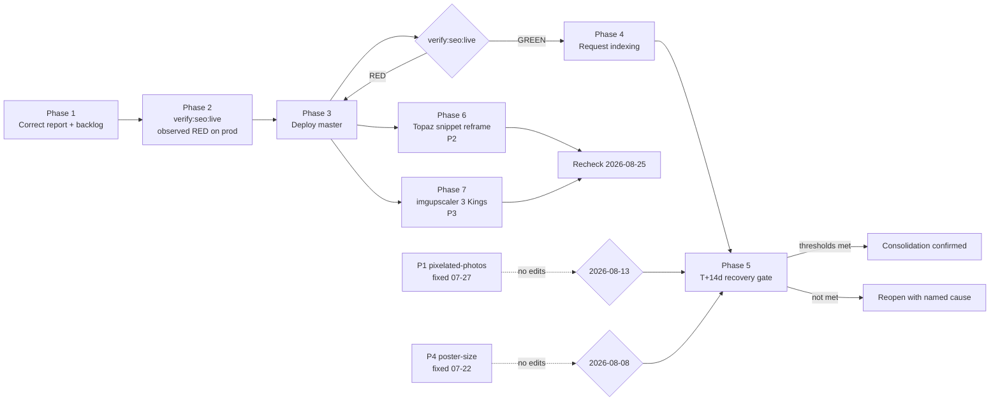
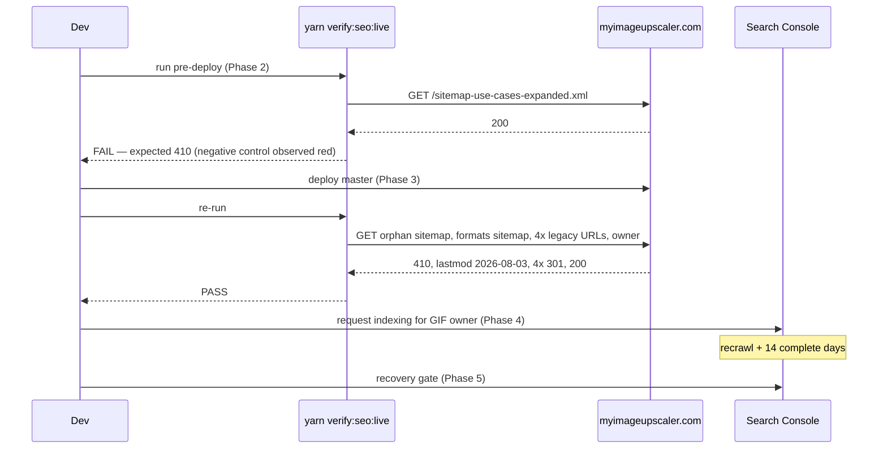

# PRD: GIF-Intent Recovery and Live SEO Signal Verification

**Created:** 2026-08-04
**Source report:** [GSC Homepage and GIF Recovery Check — 2026-08-04](../SEO/reports/gsc-homepage-gif-recovery-2026-08-04.md)
**Complexity:** 7 → **HIGH** mode (6-10 files +2; new verification module +2; external API integration for GSC URL Inspection +1; production release gating +2) — mandatory checkpoints every phase

---

## 1. Context

**Problem:** The GIF-intent consolidation's recrawl signals are not in production, the source report asserts they are, and there is no gate anywhere in the repo that can tell the difference.

### Verification of the source report (done 2026-08-04)

Every GSC figure in the report was re-checked against its own exports and matches exactly.

| Report claim                                                                                                   | Verification                                             | Result       |
| -------------------------------------------------------------------------------------------------------------- | -------------------------------------------------------- | ------------ |
| `/` = 1,705 clicks / 33,300 imp / 5.12% / pos 10.39                                                            | `topPages` in `/tmp/gsc-miu-home-gif-14-2026-08-04.json` | ✅ exact     |
| `/formats/upscale-gif-images` = 28 / 811 / pos 19.11                                                           | same export                                              | ✅ exact     |
| `/format-scale/gif-upscale-16x` = 131 / 2,154 / pos 7.26                                                       | same export                                              | ✅ exact     |
| `image upscaler` 207 / 9,105 / 10.83; `myimageupscaler` 439 / 865 / 1.01; `my image upscaler` 148 / 305 / 1.03 | `topQueries`                                             | ✅ exact     |
| Window 2026-07-19→08-01 vs 2026-07-05→07-18, 3-day lag                                                         | export `meta.dateRanges`                                 | ✅ exact     |
| Legacy 16x returns `301` → owner; owner returns `200`; `/` returns `200`                                       | live `curl`                                              | ✅ confirmed |
| Owner inspection predates `aef53d64` by ~34 min                                                                | crawl 2026-08-03 17:03 UTC = 10:03 PDT; commit 10:37 PDT | ✅ confirmed |

**One material error found.**

> Report line 7: _"the GIF consolidation is now live"_ and Backlog-correlation item 3: _"A live probe now confirms the GIF redirect and owner response, even though the change log still says deployment is pending."_

This conflates two separate deploys. The **2026-07-30 redirect consolidation is live**. The **2026-08-03 commit `aef53d64` is not deployed at all**:

| Signal                                      | Local (`master`)                                                      | Production (probed 2026-08-04) |
| ------------------------------------------- | --------------------------------------------------------------------- | ------------------------------ |
| `/sitemap-use-cases-expanded.xml`           | `410` route exists at `app/sitemap-use-cases-expanded.xml/route.ts:5` | **`200`**                      |
| Formats sitemap `lastmod` for the GIF owner | `2026-08-03T00:00:00Z` (`app/seo/data/formats.json`)                  | **`2025-12-19T00:00:00Z`**     |

`git status` reports `master...origin/master [ahead 13]`. `aef53d64` is unpushed.

**Consequence for the report's Next Actions:** action #1 (request indexing now) is sequenced wrong. The 2026-08-03 backlog entry's own post-deploy checklist requires deploy → verify `410` → verify `lastmod` → _then_ request indexing. Requesting indexing today spends a manual crawl on a page whose freshness signal still reads 2025-12-19, which is the opposite of the signal the consolidation is trying to send.

**Second gap the report omits:** `gif upscaler` has `pageCount: 5` in the cannibalization export, not the 2 URLs named. The extra surfaces are localized `/{locale}/formats/upscale-gif-images` (pt: 6 clicks, ja: 4, es: 3) and `/blog/gif-upscaler` (0 clicks / 325 imp / pos 10.72). Neither is materially harmful today; the recheck gate below tracks them rather than acting on them now.

### Files analyzed

- `docs/SEO/reports/gsc-homepage-gif-recovery-2026-08-04.md`
- `docs/SEO/maintenance/seo-changes-backlog.md`, `docs/SEO/maintenance/gsc-request-indexing-backlog.md`
- `app/seo/data/formats.json`, `app/sitemap-use-cases-expanded.xml/route.ts`, `app/sitemap-formats.xml/route.ts`
- `tests/unit/seo/gif-intent-consolidation.unit.spec.ts` (asserts `lastUpdated === '2026-08-03T00:00:00Z'` at line 98)
- `tests/unit/seo/sitemap-index.unit.spec.ts` (asserts the `410` route and the index exclusion, lines 165-177)
- `package.json` scripts (`verify`, `verify:prod:schema`, `validate:seo:*`, `recovery:verify:prod`, `deploy`)

### Current behavior

- Local code and unit tests for the GIF consolidation are **complete and green**. There is no code defect.
- Production serves stale SEO signals because the commit was never pushed.
- The whole SEO fix is queued behind 12 other commits, including `8b80abe5 feat: implement revenue telemetry and retention trust PRD` — whose **production DB migrations are already applied** and intentionally ahead of deployed code.
- Nothing in `yarn verify` or the test suite inspects production. Local green and production stale are indistinguishable to every existing gate.

---

## 2. GSC Issue Backlog (Prioritized)

Mined from `/tmp/gsc-miu-home-gif-28-2026-08-04.json` (28-day window 2026-07-05→08-01) using the **3 Kings** refresh filter: query+page rows at position 5.0–15.0, sorted by impressions, then CTR gap.

**Every row was cross-checked against `.claude/skills/blog-changelog.md` and both maintenance backlogs before being marked actionable.** Three of the six largest opportunities are _already fixed and still maturing_ — re-editing them would reset their 14-day measurement clock and destroy the evidence that the existing fix worked. Those are monitor-with-decision-date, not work.

| P      | Issue                                                                                         | Imp (28d)     | Clicks | Pos         | CTR       | Prior action                                                   | Verdict                           |
| ------ | --------------------------------------------------------------------------------------------- | ------------- | ------ | ----------- | --------- | -------------------------------------------------------------- | --------------------------------- |
| —      | **GIF-intent consolidation** (this PRD)                                                       | 2,965         | 159    | 19.11 owner | —         | 2026-07-30 redirects shipped; 2026-08-03 signals **unshipped** | **ACT** — Phases 1–5              |
| **P1** | `how to fix pixelated photos` → `/blog/fixing-pixelated-photos`                               | **81,399**    | **1**  | 9.07        | **0.00%** | **SERP title/desc rewrite 2026-07-27**                         | **MONITOR** — decision 2026-08-13 |
| **P2** | Topaz free-trial cluster → `/blog/topaz-labs-free-trial`                                      | 7,816 (page)  | 89     | 8.00        | **1.14%** | Content refresh 2026-07-10; **CTR never actioned**             | **ACT** — Phase 6                 |
| **P3** | `imgupscaler` → `/es/alternatives/vs-imgupscaler`                                             | 2,229         | 11     | 7.00        | **0.49%** | **None**                                                       | **ACT** — Phase 7                 |
| P4     | `poster size in pixels` → `/blog/poster-size-dimensions-pixels`                               | 10,209 (page) | 31     | 6.91        | 0.30%     | Snippet applied 2026-07-22                                     | **MONITOR** — decision 2026-08-08 |
| P5     | `best free ai image upscaler 2026` → `/blog/best-free-ai-image-upscaler-2026-tested-compared` | 1,105         | 0      | 6.37        | 0.00%     | Refreshed 2026-07-20                                           | **DO NOT TOUCH** — see below      |

### Why P1 is monitored, not actioned

It is the single largest opportunity on the site — 81,399 impressions at position 9.07 earning **one click**. At a normal ~1% position-9 CTR that is ~800 lost clicks per 28 days.

It is also **already fixed**. The 2026-07-27 edit changed the production `seo_title` to `How to Fix Pixelated Photos Online: 3 Fast AI Fixes` and rewrote `seo_description`. The 14-day measurement window (07-19→08-01) contains only 5 post-fix days and predates recrawl. Editing again now is the exact pitfall the 3 Kings skill names: _"rewriting recently refreshed pages too soon."_

**Decision date 2026-08-13** (14 complete GSC days after 07-27, plus the 3-day lag). Escalation criteria are in Phase 5.

### Why P5 must not be touched

The page is one of the site's best performers: **761 clicks / 5,895 impressions / 12.91% CTR at position 5.23** on the 14-day window. It wins `best free image upscaler` outright. Only the year-qualified variant `best free ai image upscaler 2026` (242 imp) returns zero clicks.

Trading a 761-click page's snippet to chase a 242-impression query is a bad bet. **Monitor only.** This row exists in the PRD specifically so a future reader does not "discover" the zero-click query and optimize a healthy page into a worse one.

### Findings deliberately not promoted to phases

- **`how to fix pixelated photos` cannibalization** — `pageCount: 6`, but the competing URLs draw 72 and 44 impressions against 81,399. Noise. Monitor in Phase 5.
- **Site-wide `<head>` hreflang absence** — probed and confirmed: `/formats/*`, `/tools/*`, and `/alternatives/*` all emit zero `hreflang=` tags in `<head>`; the full alternate cluster lives in the sitemaps. Three existing test files (`hreflang.unit.spec.ts`, `hreflang-data-aware.unit.spec.ts`, `hreflang-interactive-tools.unit.spec.ts`) encode this as the intended architecture. **Not a defect and not in scope.** P3 is therefore treated as a 3 Kings ranking-signal problem on the English page, not an hreflang overhaul.
- **`minecraft animation maker`** (490 imp, pos 9.23) and **`ai frame interpolation`** (337 imp, pos 14.47) — genuine intent-fit questions for an upscaling product. Too small to justify a phase; revisit only if a future window shows growth.

---

## 3. Solution

**Approach:**

- Correct the report so the written record matches the probe, rather than leaving a false "live" claim in `docs/SEO/reports/`.
- Add one production-facing gate — `yarn verify:seo:live` — that probes the exact signals the backlog claims after a deploy. This is the durable fix; unit tests structurally cannot catch a deploy gap.
- Ship the release, then let the new gate turn green as the proof, not a human reading a changelog.
- Only then request indexing, and only then start the measurement clock.
- Judge recovery against numeric thresholds fixed **now**, before the data arrives.
- Hold homepage metadata unchanged; the loss is branded demand at position 1.01, which no metadata rewrite addresses.
- Work the two GSC opportunities that are genuinely unactioned (P2, P3) and put the three already-fixed ones behind dated decision gates instead of re-editing them.

**Key decisions:**

- [ ] **Ship the whole branch, do not cherry-pick `aef53d64`.** Prod migrations for the revenue-telemetry PRD are already applied and waiting on this code; cherry-picking leaves that mismatch open longer and creates a divergent history. Risk is accepted and surfaced at the Phase 3 manual checkpoint.
- [ ] **New script reuses `node:fetch` + existing script conventions** (`scripts/check-recovery-delivery.ts` pattern). No new dependency.
- [ ] **Explicit errors:** the probe exits non-zero with the expected-vs-actual value per failing signal. No silent pass.
- [ ] **No localized-GIF or `/blog/gif-upscaler` changes** in this PRD. They are tracked in Phase 5's gate, not acted on. (YAGNI.)

**Data changes:** None.



---

## 4. Sequence Flow



---

## Integration Ledger

| #   | New thing                                                                                  | Live caller (`file:line`, non-test)                                                                              | Replaces                                                                           | Old path removed?                                             | Negative control                                                                                                             |
| --- | ------------------------------------------------------------------------------------------ | ---------------------------------------------------------------------------------------------------------------- | ---------------------------------------------------------------------------------- | ------------------------------------------------------------- | ---------------------------------------------------------------------------------------------------------------------------- |
| 1   | `scripts/verify-seo-live-signals.ts`                                                       | `package.json` → `verify:seo:live` (CLI entry point) — TBD line                                                  | The human "live probe" step written into the 2026-08-03 backlog checklist as prose | Prose step replaced by the script invocation in the same edit | Run against production **before** Phase 3 deploy: must exit non-zero on the `410` and `lastmod` signals                      |
| 2   | `verify:seo:live` npm script                                                               | `docs/SEO/maintenance/seo-changes-backlog.md` post-deploy checklist — TBD line; run manually after `yarn deploy` | Manual `curl` instructions                                                         | Prose replaced                                                | Same as #1                                                                                                                   |
| 3   | Corrected deploy-state section in the 2026-08-04 report                                    | Read by the SEO backlog's post-deploy checklist — TBD line                                                       | The false "consolidation is now live" claim                                        | Claim rewritten in Phase 1                                    | Re-read after Phase 3: the corrected text must itself become stale and require a status update, proving it tracks real state |
| 4   | Reframed `seo_description` for `topaz-labs-free-trial` (Phase 6)                           | Served by the live blog route from the production DB field — TBD                                                 | The negation-first description                                                     | Replaced in place                                             | `curl`-grep the live description before the change returns the negation-first text                                           |
| 5   | `alternatives-keyword-first.unit.spec.ts` + keyword-first `vs-imgupscaler` title (Phase 7) | `app/seo/data/alternatives.json` consumed by the live `/alternatives/[slug]` route — TBD line                    | Promotional `Superior Text & Quality` title                                        | Replaced in place                                             | Test run against `HEAD` (pre-edit) must be **red**                                                                           |

### Reachability

**How will this feature be reached?**

- [x] Entry point: CLI command — `yarn verify:seo:live`, run as the post-deploy step
- [x] Pre-existing file EDITED to call it: `package.json` (scripts block)
- [x] Registration: npm script + referenced from the post-deploy checklist in `seo-changes-backlog.md`

**Is this user-facing?**

- [x] NO → internal verification tooling. Trigger: manual invocation after `yarn deploy`.

**Full flow:**

1. Operator runs `yarn deploy`
2. Triggers: existing `scripts/deploy/deploy.sh`
3. Reaches new gate via: the post-deploy checklist line added in Phase 2, invoking `yarn verify:seo:live`
4. Result observable in: script exit code and per-signal expected-vs-actual output

**What does this replace?**

- [x] Replaces: the prose "verify X returns 410, verify Y appears with lastmod Z" step in the 2026-08-03 backlog entry → converted to the script invocation in Phase 2.

---

## 5. Execution Phases

### Phase 1: Correct the report's deploy-state claim — the written record matches production

**Files (2):**

- `docs/SEO/reports/gsc-homepage-gif-recovery-2026-08-04.md` — EDIT: fix the Technical-state verdict and Backlog-correlation item 3; re-sequence Next Actions
- `docs/SEO/maintenance/seo-changes-backlog.md` — EDIT: append a 2026-08-04 entry recording that `aef53d64` is unshipped and why the indexing request is deferred

**Implementation:**

- [ ] Rewrite the Technical-state bullet to distinguish the shipped 2026-07-30 redirects from the unshipped 2026-08-03 sitemap signals, with the probed values
- [ ] Rewrite Backlog-correlation item 3 to state `master...origin/master [ahead 13]` and name `aef53d64` as unpushed
- [ ] Re-sequence Next Actions: deploy → verify → request indexing (currently indexing is #1)
- [ ] Add the `pageCount: 5` finding for `gif upscaler` as a tracked-not-actioned note
- [ ] Append the SEO backlog entry (required by CLAUDE.md for any SEO change)

**Wiring:**

- [ ] Caller edited: `docs/SEO/maintenance/seo-changes-backlog.md` post-deploy checklist references the corrected report section
- [ ] Old path: the false "now live" claim is deleted, not annotated
- [ ] Ledger row filled: #3

**Verification Plan:**

1. **Live re-probe, pasted into the report** — every claim in the corrected section must be reproduced by:
   ```bash
   curl -s -o /dev/null -w "%{http_code}\n" https://myimageupscaler.com/sitemap-use-cases-expanded.xml
   # Expected today: 200  (the stale state the correction documents)
   curl -s https://myimageupscaler.com/sitemap-formats.xml | grep -A1 "upscale-gif-images" | head -2
   # Expected today: lastmod 2025-12-19T00:00:00Z
   git status -sb | head -1
   # Expected: ## master...origin/master [ahead 13]
   ```
2. **Negative control:** grep the report for the retired phrasing — it must return zero hits.
   ```bash
   grep -n "consolidation is now live" docs/SEO/reports/gsc-homepage-gif-recovery-2026-08-04.md
   # Expected: no output (goes red if the correction was not applied)
   ```

**Revert check:** Restoring the old wording makes the report contradict the probe output pasted in the same file — an internal contradiction any reader hits immediately.

**User Verification:** Read the corrected Technical-state section; it must name a deploy that has not happened.

---

### Phase 2: `yarn verify:seo:live` — a gate that fails on today's production

**Files (3):**

- `scripts/verify-seo-live-signals.ts` — NEW: probes production for the SEO signals the backlog claims
- `package.json` — EDIT: add `verify:seo:live`
- `docs/SEO/maintenance/seo-changes-backlog.md` — EDIT: replace the prose post-deploy verification step with the command

**Implementation:**

- [ ] Probe, with expected-vs-actual output per signal and a non-zero exit on any failure:
  - `/sitemap-use-cases-expanded.xml` → `410`
  - `/sitemap-formats.xml` contains `/formats/upscale-gif-images` with `lastmod` `2026-08-03T00:00:00Z`
  - `/format-scale/gif-upscale-{2x,4x,8x,16x}` → `301` → `/formats/upscale-gif-images`
  - `/formats/upscale-gif-images` → `200`
- [ ] Base URL from `serverEnv` / script arg — **never** `process.env` directly (CLAUDE.md)
- [ ] Keep it under ~80 lines. It is a probe, not a framework.

**Wiring:**

- [ ] Caller edited: `package.json` scripts block
- [ ] Registration: post-deploy checklist line in `seo-changes-backlog.md`
- [ ] Old path: the prose verification step deleted in the same edit
- [ ] Ledger rows filled: #1, #2

**Tests Required:**

| Test File                                       | Test Name                                                         | Assertion                                                | Negative control (must be observed red)                                 |
| ----------------------------------------------- | ----------------------------------------------------------------- | -------------------------------------------------------- | ----------------------------------------------------------------------- |
| `tests/unit/seo/live-signal-probe.unit.spec.ts` | `should fail when the orphan sitemap returns 200`                 | probe result `.ok === false` with the `410` signal named | mock a `200` response → red; only passes because the probe reads status |
| `tests/unit/seo/live-signal-probe.unit.spec.ts` | `should fail when the formats sitemap serves a stale gif lastmod` | failure names expected `2026-08-03T00:00:00Z` vs actual  | mock the `2025-12-19` value → red                                       |
| `tests/unit/seo/live-signal-probe.unit.spec.ts` | `should pass when every signal matches the deployed contract`     | `.ok === true`                                           | flip any one mock → red                                                 |

**Verification Plan:**

1. **Unit tests:** `yarn test tests/unit/seo/live-signal-probe.unit.spec.ts`
2. **Negative control against real production — the decisive one:**
   ```bash
   yarn verify:seo:live
   # Expected TODAY (pre-deploy): exit 1
   #   FAIL /sitemap-use-cases-expanded.xml        expected 410            actual 200
   #   FAIL /sitemap-formats.xml gif lastmod       expected 2026-08-03...  actual 2025-12-19...
   #   PASS 4x /format-scale/gif-upscale-* -> 301
   #   PASS /formats/upscale-gif-images -> 200
   ```
   This gate is observed red before it is ever green. Paste the raw output into the PRD's Verification Evidence.
3. **Integration proof:**
   ```bash
   grep -rn "verify-seo-live-signals" --include=*.json --include=*.md . | grep -v node_modules | grep -v "/tests/"
   # Expected: package.json hit + seo-changes-backlog.md hit (non-test consumers)
   grep -rn "returns 410" docs/SEO/maintenance/seo-changes-backlog.md
   # Expected: the prose step is gone, replaced by the command
   ```
4. **Evidence:**
   - [ ] Unit tests pass
   - [ ] Real-production run **observed red**, output pasted verbatim
   - [ ] Caller census pasted
   - [ ] `yarn verify` passes

**Revert check:** Remove the script → the post-deploy checklist references a missing command and `yarn verify:seo:live` errors, breaking the documented deploy flow.

**User Verification:** Run `yarn verify:seo:live` today. It must fail, and the failure must name exactly the two stale signals.

---

### Phase 3: Ship the release — production signals match the repo

**Files (0 new):** deploy-only phase. No code changes.

**⚠️ Manual checkpoint required — production deploy.**

**Scope of this deploy (13 commits, not just the SEO fix):**

| Commit                                                               | Risk note                                                                                                  |
| -------------------------------------------------------------------- | ---------------------------------------------------------------------------------------------------------- |
| `8b80abe5` revenue telemetry and retention trust PRD                 | **Prod migrations already applied** (2026-08-02). This deploy closes the intentional DB-ahead-of-code gap. |
| `2e9945a7` revoke health alert RPCs from anon + prod schema harness  | Permission change — run `yarn verify:prod:schema` after                                                    |
| `c28f0af0`, `1eeaecd0`, `62e304d8` upload auto-resize + byte ceiling | User-facing upload path                                                                                    |
| `aef53d64` orphan sitemap + gif lastmod                              | The SEO target of this PRD                                                                                 |
| remainder                                                            | docs + smaller fixes                                                                                       |

**Implementation:**

- [ ] Confirm with the user that shipping the full branch is intended (not a cherry-pick) — this is the decision flagged in §2
- [ ] `yarn verify` and `yarn test` green on `master`
- [ ] `git push origin master`; run `yarn deploy` per project flow
- [ ] Wait for the Cloudflare Pages deployment to report success

**Verification Plan:**

1. **The Phase 2 gate, now green:**
   ```bash
   yarn verify:seo:live
   # Expected: exit 0, all signals PASS
   ```
   Its red run in Phase 2 is what makes this green run mean something.
2. **Prod schema harness:** `yarn verify:prod:schema` → PASS (covers `2e9945a7`)
3. **Spot-check the non-SEO surface:** upload a >tier-limit image and confirm the auto-resize path behaves (covers `c28f0af0`/`1eeaecd0`/`62e304d8`)
4. **Evidence:**
   - [ ] `yarn verify:seo:live` output pasted, exit 0
   - [ ] `yarn verify:prod:schema` PASS
   - [ ] Deployment ID recorded

**Manual checkpoint:**

```
## PHASE 3 COMPLETE - CHECKPOINT
Deployed commits: origin/master..master (13)
verify:seo:live: [pass/fail]
verify:prod:schema: [pass/fail]
Manual verification:
1. [ ] Oversized upload auto-resizes without error
2. [ ] Checkout completes (revenue telemetry now live against pre-applied migrations)
Reply "continue" to proceed to Phase 4.
```

---

### Phase 4: Request indexing — Google is told the owner changed

**Files (1):**

- `docs/SEO/maintenance/gsc-request-indexing-backlog.md` — EDIT: resolve the GIF owner row

**Implementation:**

- [ ] Request indexing for `https://myimageupscaler.com/formats/upscale-gif-images` in GSC URL Inspection (manual — requires the GSC UI)
- [ ] Record the request date and the deployment it followed on the backlog row
- [ ] Do **not** check the row on a request alone; per the backlog's own rule, resolve it only when the UI accepts the request **or** URL Inspection reports a successful crawl dated after the Phase 3 deploy

**Wiring:**

- [ ] Old path: the pending row is resolved with an explicit post-deploy reference, not silently ticked

**Verification Plan:**

1. **URL Inspection API re-check, ≥24h after the request:**
   - Expected: `Submitted and indexed`, last crawl **after** the Phase 3 deploy timestamp
2. **Negative control:** compare against the 2026-08-03 17:03 UTC crawl already on record. If the reported crawl time is unchanged, the recrawl has not happened and the row stays open. A row that resolves without the crawl time moving is a false pass.
3. **Evidence:**
   - [ ] Crawl timestamp strictly greater than the deploy timestamp, pasted
   - [ ] Backlog row annotated with request date + deploy reference

**User Verification:** Open the GIF owner row in the backlog — it must cite a crawl time later than the deploy.

---

### Phase 5: Recovery gate at T+14 complete days — judged by numbers fixed today

**Files (1):**

- `docs/SEO/reports/` — NEW: recheck report

**Run when:** ≥14 complete GSC days have elapsed since the Phase 4 confirmed recrawl, plus the 3-day lag. If deploy lands 2026-08-05 and recrawl completes by ~2026-08-08, the earliest valid run is **~2026-08-29**. Running earlier measures the pre-change index and will read as failure regardless of truth.

**Baselines locked now** (from `/tmp/gsc-miu-home-gif-14-2026-08-04.json`):

| Metric                                 | Pre-collapse (07-05→07-18) | Current (07-19→08-01) |
| -------------------------------------- | -------------------------- | --------------------- |
| GIF-intent clicks (owner + legacy 16x) | 410                        | 159                   |
| GIF-intent impressions                 | 5,736                      | 2,965                 |
| Owner share of GIF clicks              | 90.7%                      | 17.6%                 |
| Owner position                         | 6.95                       | 19.11                 |

**Acceptance thresholds — consumer-scoped, all must hold:**

- [ ] `/formats/upscale-gif-images` is the URL Google ranks for `gif upscaler` and `upscale gif` — legacy `/format-scale/gif-upscale-*` rows **absent** from both query page-splits
- [ ] Owner takes **≥80%** of combined GIF-intent clicks (from 17.6%)
- [ ] Combined GIF-intent clicks **≥300** (≥73% of the 410 pre-collapse baseline)
- [ ] Owner average position **≤8.0** (from 19.11)
- [ ] `gif upscaler` `pageCount` **≤3** (from 5) — confirms the localized/blog surfaces are not absorbing the consolidation

**Homepage gate (separate, hold-and-measure):**

- [ ] Homepage metadata **unchanged** — the loss is branded demand at position 1.01, which metadata cannot move
- [ ] `image upscaler` clicks continue upward from 207 (currently +36%)
- [ ] Branded queries (`myimageupscaler`, `my image upscaler`) checked against an **external demand signal** (Google Trends or paid-brand volume) before attributing the −51%/−71% to anything on-site. Position stayed 1.01/1.03 — an on-site cause is not supported by this data.

**Verification Plan:**

1. Re-run `/gsc-analysis` for the 14-day window and diff against the locked baselines above
2. **Negative control:** run the same query against the **pre-deploy** export (`/tmp/gsc-miu-home-gif-14-2026-08-04.json`). It must **fail** every recovery threshold. A gate the old data passes is measuring nothing.
3. **Evidence:** per-threshold pass/fail table with the actual figures

**If thresholds are not met:** the recheck report must name a specific cause (redirect not consolidated in-index, owner content mismatch for GIF intent, or ongoing localized cannibalization). "Needs more time" is only acceptable once, with the next recheck date stated.

### Phase 5b: Monitored-issue decision gates (no edits — verdicts only)

These pages are **already fixed**. This gate decides whether each fix worked. Editing any of them before its decision date resets the clock and destroys the evidence.

| Issue                                                                                  | Decision date  | Pass                                                                              | Fail → escalation                                                                                                                                                                                                                                              |
| -------------------------------------------------------------------------------------- | -------------- | --------------------------------------------------------------------------------- | -------------------------------------------------------------------------------------------------------------------------------------------------------------------------------------------------------------------------------------------------------------- |
| **P1** `how to fix pixelated photos` → `/blog/fixing-pixelated-photos` (07-27 rewrite) | **2026-08-13** | CTR ≥ 0.50% (from 0.01%) — ~400 clicks/28d at current impressions                 | Escalate to SERP-feature diagnosis: check for an AI Overview or People-Also-Ask block absorbing the click. If the SERP answers the query in place, **no snippet rewrite will fix it** — reclassify as a structurally zero-click query and stop spending on it. |
| **P4** `poster size in pixels` → `/blog/poster-size-dimensions-pixels` (07-22 snippet) | **2026-08-08** | `poster size in pixels` clicks > 0 and page CTR ≥ 1.0% (from 0.30%)               | Same SERP-feature check — dimension queries are prime featured-snippet/zero-click territory.                                                                                                                                                                   |
| **P5** `best free ai image upscaler 2026`                                              | **2026-08-06** | No action either way                                                              | **Locked: no edits.** Page holds 761 clicks at 12.91% CTR. Record the reading and move on.                                                                                                                                                                     |
| Cannibalization watch                                                                  | with Phase 5   | `how to fix pixelated photos` `pageCount` stays ≤6 with competitors under 200 imp | Only then consider consolidation                                                                                                                                                                                                                               |

**Negative control for this gate:** run each threshold against the pre-fix data in `/tmp/gsc-miu-home-gif-28-2026-08-04.json`. Every one must **fail**. A gate the old data passes is measuring nothing.

---

#### Phase 6: Topaz free-trial snippet — the SERP promise stops leading with a "no"

**Priority P2.** 7,816 impressions / 89 clicks / **1.14% CTR** at position 8.00 (14-day). Ranking is fine; the snippet is the problem.

**Three Kings audit — all three PASS. Do not rewrite the content.**

- King 1 Title: `Topaz Labs Free Trial 2026: Current Terms and Limits` — keyword front-loaded ✓
- King 2 H1: `Topaz Labs Free Trial 2026: Current Photo and Video Terms` — mirrors title ✓
- King 3: opening answers the query directly ✓

**The actual diagnosis:** `seo_description` currently opens `Topaz Photo has no current free trial.` and then stops — it delivers a dead end. Users searching `topaz photo ai free` (767 imp, **1 click**) are told the thing they want does not exist and are offered nothing instead, so they do not click.

**We are MyImageUpscaler, not Topaz.** This page exists to capture Topaz-free-trial intent, not to service it. The negation is not the problem — it is the **hook**. Someone searching `topaz photo ai free` wants free AI upscaling; telling them Topaz has none _and that MIU does_ is both truthful and the strongest possible click promise. The current snippet does the first half and drops the second.

The 2026-07-10 refresh deliberately removed false Topaz trial claims — that decision stands and is not reversed. Nothing here promises a Topaz trial.

**Files (1):**

- Blog `seo_description` for `topaz-labs-free-trial` — EDIT via the blog API (production DB field, same mechanism as the 2026-07-27 change)

**Implementation:**

- [ ] Rewrite `seo_description` as: honest negation → **MIU free alternative** as the payoff. The reader must see a free option they can use in the snippet itself.
- [ ] Confirm the page body actually delivers that alternative above the fold; if it does not, add the MIU path to the body **first** — the snippet must not out-promise the page
- [ ] Leave `seo_title`, H1, slug, canonical, and the Topaz factual content **unchanged** — the Kings pass and the competitor facts are correct
- [ ] Log the change in `.claude/skills/blog-changelog.md` and the SEO backlog

**Wiring:**

- [ ] Old path: the negation-first description is replaced, not appended to
- [ ] Ledger: no new code symbol; this is a content-field change

**Verification Plan:**

1. **Truthfulness gate (blocking):** every claim in the new description must be traceable to a sentence in the live page body. Paste the body sentence next to each claim. A description that promises a trial the page says does not exist **fails this phase outright.**
2. **Live check after publish:**
   ```bash
   curl -s https://myimageupscaler.com/blog/topaz-labs-free-trial | grep -o 'name="description" content="[^"]*"'
   # Expected: the new text, negation not in the first clause
   ```
3. **Negative control:** the grep above run _before_ the change must return the current negation-first text. Record it.
4. **Request indexing** for the URL; add the row to `gsc-request-indexing-backlog.md`
5. **Recheck 2026-08-25** (14 complete GSC days + lag). Pass: page CTR ≥ 2.5% (from 1.14%) at unchanged position.

**Ceiling and value:** Topaz is a competitor, so a share of these searchers are navigating to topazlabs.com and will never click us — 2.5% is the target, not 8%. But the clicks we do win are the highest-intent traffic in this backlog: someone searching for a _free_ upscaling trial and finding out the competitor has none is a person actively shopping for exactly what MIU sells. Weight this cluster by conversion, not just clicks. If position degrades while CTR rises, revert.

**Revert check:** restore the prior description → CTR returns to the 1.14% baseline within one window.

---

#### Phase 7: `imgupscaler` — the English page carries the competitor keyword

**Priority P3.** 2,229 impressions / 11 clicks / **0.49% CTR** at position 7.00 — and the URL Google ranks is **`/es/alternatives/vs-imgupscaler`**, the Spanish page, for a query with global English intent. The English page does not appear in the query's page split at all.

**Three Kings audit on the English page — King 1 and King 2 FAIL:**

- King 1 Title: `MyImageUpscaler vs ImgUpscaler - Superior Text & Quality` — the query term `imgupscaler` is the **third** token, behind our own brand. `Superior Text & Quality` is promotional filler that earns no click.
- King 2 H1: `MyImageUpscaler vs ImgUpscaler — Quality & Features Comparison` — same front-loading failure
- King 3: needs inspection during implementation

**Not an hreflang fix.** The sitemap alternate cluster for this URL is complete and correct (verified: 7 locales + `x-default`). Sitemap-only hreflang is this codebase's intended architecture, guarded by three existing test files. Phase 7 changes ranking signal on the English page; it does not touch locale routing.

**Files (2, max):**

- `app/seo/data/alternatives.json` — EDIT: title / H1 / description for the `vs-imgupscaler` entry
- `tests/unit/seo/` — EDIT or NEW: assert the keyword-first title contract for the entry

**Implementation:**

- [ ] Front-load `ImgUpscaler` in title and H1; drop the puffery in favour of a concrete comparison hook
- [ ] Keep the title ≤ 60 characters
- [ ] Verify the first paragraph names `ImgUpscaler` in sentence 1–2 (King 3)
- [ ] Add the unit test — **SEO changes MUST have tests** per CLAUDE.md

**Wiring:**

- [ ] Caller: `app/seo/data/alternatives.json` is already consumed by the live `/alternatives/[slug]` route — no new wiring, the data change reaches production through an existing path
- [ ] Test asserts the contract so a future data edit cannot silently revert it

**Tests Required:**

| Test File                                                | Test Name                                                              | Assertion                                                              | Negative control (must be observed red)                                                                                         |
| -------------------------------------------------------- | ---------------------------------------------------------------------- | ---------------------------------------------------------------------- | ------------------------------------------------------------------------------------------------------------------------------- |
| `tests/unit/seo/alternatives-keyword-first.unit.spec.ts` | `should front-load the competitor keyword in the vs-imgupscaler title` | title index of `imgupscaler` (lowercased) < index of `myimageupscaler` | run against the **current** JSON at `HEAD` → must fail; this proves the gate measures the change and not the pre-existing state |
| same                                                     | `should keep the vs-imgupscaler title within 60 characters`            | `title.length <= 60`                                                   | set a 70-char title → red                                                                                                       |

**Verification Plan:**

1. `yarn test tests/unit/seo/alternatives-keyword-first.unit.spec.ts`
2. **Negative control (the decisive one):** `git stash` the JSON edit and re-run — the test must go **red** against the current title. Paste both runs.
3. Live check post-deploy:
   ```bash
   curl -s https://myimageupscaler.com/alternatives/vs-imgupscaler | grep -o '<title>[^<]*</title>'
   ```
4. `yarn verify` passes
5. **Recheck 2026-08-25.** Pass: `imgupscaler` clicks ≥ 45 (from 11, ~2% CTR).

**Stated uncertainty, not hidden:** this improves the English page's relevance signal for the query. It does **not** guarantee Google swaps the ranked URL from `/es/` to `/en`. If the recheck shows the ES page still ranking with unchanged CTR, the next step is an internal-linking pass to the English URL — not another title rewrite. Record that outcome rather than iterating on copy.

**Revert check:** restore the old title → the new unit test fails.

---

## 6. Checkpoint Protocol

After each phase, spawn `prd-work-reviewer`:

```
subagent_type: "prd-work-reviewer"
prompt: "Review checkpoint for phase [N] of docs/PRDs/gif-intent-recovery-live-signal-verification.md

Also audit integration, independent of whether tests pass:
1. Integration Ledger: is every row filled with a real non-test file:line?
2. Caller census: grep verify-seo-live-signals — any non-test consumer?
3. Did this phase edit at least one pre-existing file?
4. Revert check: if the new code were removed, what pre-existing flow breaks?
5. Incumbent: is the prose post-deploy verification step deleted, or still live alongside the script?
6. Negative controls: was verify:seo:live observed FAILING against real production before Phase 3?
Report FAIL on any of these even when the full suite is green."
```

Phase 3 additionally requires the manual checkpoint above (production deploy).

---

## 7. Acceptance Criteria

**Binary done checks:**

- [ ] All 7 phases complete (5 + 5b + 6 + 7)
- [ ] All specified tests pass
- [ ] `yarn verify` passes
- [ ] All automated checkpoint reviews passed; Phase 3 manual checkpoint passed
- [ ] Internal-only tooling — no UI required (explicitly marked)

**Integration gates:**

- [ ] Integration Ledger has zero `TBD` cells
- [ ] `verify-seo-live-signals` has a non-test consumer (caller census pasted)
- [ ] Revert check passed: removing the script breaks the documented post-deploy flow
- [ ] The prose post-deploy verification step is deleted — not running alongside the script
- [ ] `yarn verify:seo:live` was **observed red against real production** before Phase 3, output pasted
- [ ] The capability was proved on the real production subject: production `myimageupscaler.com`, not a local build or a fixture

**Outcome criteria (consumer-scoped):**

- [ ] Production serves the GIF owner with a `2026-08-03` freshness signal and returns `410` for the retired sitemap — verified by the gate, not by reading a changelog
- [ ] Google ranks `/formats/upscale-gif-images` for `gif upscaler` and `upscale gif`, with legacy URLs absent
- [ ] Combined GIF-intent clicks ≥300 with ≥80% on the owner
- [ ] No future SEO backlog entry can be marked deployed while production disagrees — because the gate that catches it exists and has been seen failing
- [ ] `/blog/topaz-labs-free-trial` CTR ≥ 2.5% at unchanged position, with every snippet claim traceable to the page body
- [ ] `imgupscaler` clicks ≥ 45 per 28 days, **or** a recorded finding that the ES URL still ranks and the next step is internal linking
- [ ] Every P1/P4/P5 monitored issue has a verdict recorded on its decision date — pass, fail with escalation, or locked-no-action

**Anti-regression gates (this PRD fails if any of these happens):**

- [ ] `/blog/fixing-pixelated-photos` was **not** re-edited before 2026-08-13
- [ ] `/blog/poster-size-dimensions-pixels` was **not** re-edited before 2026-08-08
- [ ] `/blog/best-free-ai-image-upscaler-2026-tested-compared` was **not** edited at all — it holds 761 clicks at 12.91% CTR
- [ ] No homepage metadata was changed

---

## 8. Out of Scope

- Homepage metadata rewrites — data does not support an on-site cause (position 1.01 unchanged)
- Localized `/{locale}/formats/upscale-gif-images` consolidation — 13 clicks combined; tracked in the Phase 5 gate, not acted on
- `/blog/gif-upscaler` — 0 clicks; monitored only
- The Cloudflare Worker CPU / `error code: 1102` item open in the SEO backlog — unrelated
- **Any edit to a page fixed within the last 14 GSC days** — `fixing-pixelated-photos` (07-27), `poster-size-dimensions-pixels` (07-22), `best-free-ai-image-upscaler-2026-tested-compared` (07-20). Re-editing destroys the measurement.
- Site-wide `<head>` hreflang — sitemap-only hreflang is the intended architecture, guarded by three existing test files
- `minecraft animation maker` (490 imp) and `ai frame interpolation` (337 imp) — below the effort threshold
- Reversing the truthful "no current Topaz free trial" position — Phase 6 reframes the snippet, it does not restore a false claim

---

## Verification Evidence

_(Filled in during implementation — a phase is not complete until its block is populated with pasted output, not summaries.)_

### Phase 1

- Live re-probe output: _pending_
- Retired-phrasing grep (expect empty): _pending_

### Phase 2

- Unit tests: _pending_
- `yarn verify:seo:live` against production, **expected red**: _pending_
- Caller census: _pending_

### Phase 3

- Deployment ID: _pending_
- `yarn verify:seo:live` **expected green**: _pending_
- `yarn verify:prod:schema`: _pending_

### Phase 4

- URL Inspection crawl timestamp vs deploy timestamp: _pending_

### Phase 5

- Threshold table with actuals: _pending_
- Negative control (old export must fail all thresholds): _pending_

### Phase 5b (monitored issues — verdicts only)

- P1 `fixing-pixelated-photos` verdict on 2026-08-13: _pending_
- P4 `poster-size-dimensions-pixels` verdict on 2026-08-08: _pending_
- P5 reading on 2026-08-06 (no action): _pending_
- Proof of no re-edit before each decision date (`git log --since` on the affected pages): _pending_

### Phase 6 (Topaz snippet)

- Truthfulness gate — each claim mapped to a body sentence: _pending_
- Description grep before (negation-first) and after: _pending_
- Recheck 2026-08-25, CTR ≥ 2.5%: _pending_

### Phase 7 (imgupscaler)

- Unit test run **red against `HEAD`** (pre-edit), then green: _pending_
- Live `<title>` after deploy: _pending_
- Recheck 2026-08-25, clicks ≥ 45 **or** recorded ES-still-ranks finding: _pending_
