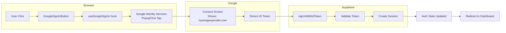
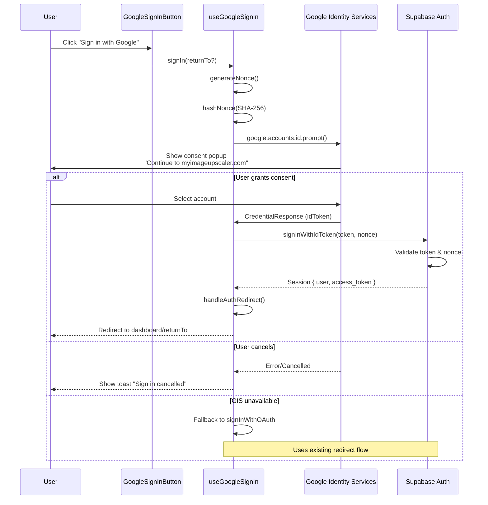

# PRD: Native Google Sign-In (Show App Branding in Consent Screen)

## 1. Context Analysis

### 1.1 Files Analyzed

```
client/hooks/useGoogleSignIn.ts
client/components/form/GoogleSignInButton.tsx
client/components/form/SocialLoginButton.tsx
client/store/auth/authStore.ts
client/store/auth/authOperations.ts
client/store/auth/authStateHandler.ts
client/utils/authRedirectManager.ts
shared/utils/supabase/client.ts
shared/utils/supabase/server.ts
shared/config/env.ts
app/auth/callback/page.tsx
app/layout.tsx
lib/middleware/auth.ts
```

### 1.2 Component & Dependency Overview

```mermaid
graph TD
    subgraph "Current Flow (Redirect-based)"
        A[GoogleSignInButton] --> B[useGoogleSignIn]
        B --> C[supabase.auth.signInWithOAuth]
        C --> D[Redirect to Google]
        D --> E[Google Consent Screen<br/>Shows: supabase.co]
        E --> F[Redirect to Supabase Callback]
        F --> G[/auth/callback page]
        G --> H[Session Created]
    end

    subgraph "New Flow (ID Token-based)"
        A2[GoogleSignInButton] --> B2[useGoogleSignIn]
        B2 --> C2[Google Identity Services]
        C2 --> D2[Google Consent Screen<br/>Shows: myimageupscaler.com]
        D2 --> E2[ID Token returned]
        E2 --> F2[supabase.auth.signInWithIdToken]
        F2 --> G2[Session Created]
    end
```

### 1.3 Current Behavior Summary

- User clicks "Sign in with Google" button
- `useGoogleSignIn` calls `supabase.auth.signInWithOAuth({ provider: 'google' })`
- Browser redirects to Google OAuth consent screen
- Google shows "Continue to **xqysaylskffsfwunczbd.supabase.co**" (Supabase's callback URL)
- After consent, Google redirects to Supabase's callback
- Supabase exchanges code for tokens, then redirects to `/auth/callback`
- App handles session setup and redirects user to intended destination

### 1.4 Problem Statement

Google's OAuth consent screen displays the Supabase project URL instead of the app's domain (myimageupscaler.com), making the authentication flow appear unprofessional and potentially reducing user trust.

---

## 2. Proposed Solution

### 2.1 Architecture Summary

- **Use Google Identity Services (GIS)** to display a popup/One Tap flow that shows the app's domain
- **Exchange Google's ID token** with Supabase via `signInWithIdToken()` instead of redirect-based OAuth
- **Keep all existing Supabase session/JWT infrastructure** unchanged
- **No server-side changes required** - Supabase handles token validation

**Alternative approaches rejected:**
| Approach | Rejection Reason |
|----------|------------------|
| Supabase Custom Domain | Costs $25/mo (Pro plan required) |
| Full Passport.js migration | 2-3 days work, requires rewriting entire auth layer |
| Accept current UX | User explicitly wants branding fix |

### 2.2 Architecture Diagram



### 2.3 Key Technical Decisions

| Decision | Choice | Rationale |
|----------|--------|-----------|
| **Google library** | Native GIS script (`accounts.google.com/gsi/client`) | Official Google library, no npm dependency, lightweight |
| **Auth flow** | Popup mode | Better UX than redirect, user stays on page |
| **Nonce handling** | SHA-256 hashed nonce | Security best practice per Supabase docs |
| **Fallback** | Keep redirect OAuth as backup | Graceful degradation if GIS fails |
| **FedCM support** | Enabled | Required for Chrome's third-party cookie phase-out |

### 2.4 Data Model Changes

**No Data Changes.** - All existing Supabase auth tables remain unchanged.

---

### 2.5 Runtime Execution Flow



---

## 3. Detailed Implementation Spec

### A. `client/hooks/useGoogleSignIn.ts`

**Changes Needed:** Complete rewrite to use Google Identity Services

**New Implementation:**

```typescript
import { useState, useCallback, useEffect } from 'react';
import { createClient } from '@shared/utils/supabase/client';
import { useModalStore } from '@client/store/modalStore';
import { useToastStore } from '@client/store/toastStore';
import { handleAuthRedirect, setAuthIntent } from '@client/utils/authRedirectManager';
import { clientEnv } from '@shared/config/env';

// Type for Google's credential response
interface ICredentialResponse {
  credential: string;
  select_by: string;
}

// Generate nonce for security
async function generateNoncePayload(): Promise<{ nonce: string; hashedNonce: string }> {
  const nonce = btoa(String.fromCharCode(...crypto.getRandomValues(new Uint8Array(32))));
  const encoder = new TextEncoder();
  const encodedNonce = encoder.encode(nonce);
  const hashBuffer = await crypto.subtle.digest('SHA-256', encodedNonce);
  const hashArray = Array.from(new Uint8Array(hashBuffer));
  const hashedNonce = hashArray.map(b => b.toString(16).padStart(2, '0')).join('');
  return { nonce, hashedNonce };
}

export const useGoogleSignIn = (): {
  signIn: (returnTo?: string) => Promise<void>;
  loading: boolean;
  isGisLoaded: boolean;
} => {
  const { showToast } = useToastStore();
  const { openAuthModal } = useModalStore();
  const [loading, setLoading] = useState(false);
  const [isGisLoaded, setIsGisLoaded] = useState(false);
  const [pendingReturnTo, setPendingReturnTo] = useState<string | undefined>();

  // Handle the credential response from Google
  const handleCredentialResponse = useCallback(
    async (response: ICredentialResponse, nonce: string) => {
      try {
        const supabase = createClient();
        const { error } = await supabase.auth.signInWithIdToken({
          provider: 'google',
          token: response.credential,
          nonce,
        });

        if (error) {
          console.error('Supabase signInWithIdToken error:', error);
          showToast({ message: error.message || 'Sign in failed', type: 'error' });
          openAuthModal('login');
          return;
        }

        // Success - handle redirect
        await handleAuthRedirect();
      } catch (err) {
        console.error('Error during Google sign-in:', err);
        showToast({
          message: err instanceof Error ? err.message : 'An unexpected error occurred',
          type: 'error',
        });
      } finally {
        setLoading(false);
      }
    },
    [showToast, openAuthModal]
  );

  // Initialize Google Identity Services
  useEffect(() => {
    const initGis = async () => {
      // Check if script is already loaded
      if (typeof window !== 'undefined' && window.google?.accounts?.id) {
        setIsGisLoaded(true);
        return;
      }

      // Load the GIS script
      const script = document.createElement('script');
      script.src = 'https://accounts.google.com/gsi/client';
      script.async = true;
      script.defer = true;
      script.onload = () => setIsGisLoaded(true);
      script.onerror = () => console.error('Failed to load Google Identity Services');
      document.head.appendChild(script);
    };

    initGis();
  }, []);

  const signIn = useCallback(
    async (returnTo?: string): Promise<void> => {
      // Store return URL for after auth
      if (returnTo) {
        setAuthIntent({ action: 'oauth_complete', returnTo });
      }
      setPendingReturnTo(returnTo);

      // Fallback to redirect OAuth if GIS not available
      if (!isGisLoaded || !window.google?.accounts?.id) {
        console.warn('GIS not loaded, falling back to redirect OAuth');
        const supabase = createClient();
        const { error } = await supabase.auth.signInWithOAuth({
          provider: 'google',
          options: {
            redirectTo: `${window.location.origin}/auth/callback${returnTo ? `?returnTo=${encodeURIComponent(returnTo)}` : ''}`,
            scopes: 'email profile',
            queryParams: { access_type: 'offline', prompt: 'select_account' },
          },
        });
        if (error) {
          showToast({ message: error.message, type: 'error' });
        }
        return;
      }

      setLoading(true);

      try {
        const { nonce, hashedNonce } = await generateNoncePayload();

        // Initialize with the hashed nonce (Google expects hashed version)
        window.google.accounts.id.initialize({
          client_id: clientEnv.GOOGLE_CLIENT_ID,
          callback: (response: ICredentialResponse) => handleCredentialResponse(response, nonce),
          nonce: hashedNonce,
          use_fedcm_for_prompt: true,
          context: 'signin',
          ux_mode: 'popup',
        });

        // Trigger the One Tap / account chooser prompt
        window.google.accounts.id.prompt((notification: { isNotDisplayed: () => boolean; getNotDisplayedReason: () => string }) => {
          if (notification.isNotDisplayed()) {
            console.warn('Google One Tap not displayed:', notification.getNotDisplayedReason());
            // Fallback: try the standard button flow or redirect
            setLoading(false);
            // Could fallback to redirect here if needed
          }
        });
      } catch (err) {
        console.error('Error initializing Google sign-in:', err);
        setLoading(false);
        showToast({ message: 'Failed to initialize Google sign-in', type: 'error' });
      }
    },
    [isGisLoaded, handleCredentialResponse, showToast]
  );

  return { signIn, loading, isGisLoaded };
};
```

**Justification:** This replaces the redirect-based OAuth with Google Identity Services popup flow. The ID token is exchanged with Supabase via `signInWithIdToken`, which validates the token server-side. The nonce provides replay attack protection.

---

### B. `client/types/google-identity.d.ts` (NEW FILE)

**Purpose:** TypeScript declarations for Google Identity Services

```typescript
declare global {
  interface Window {
    google?: {
      accounts: {
        id: {
          initialize: (config: GoogleIdConfiguration) => void;
          prompt: (callback?: (notification: PromptNotification) => void) => void;
          renderButton: (parent: HTMLElement, options: GsiButtonConfiguration) => void;
          disableAutoSelect: () => void;
          cancel: () => void;
        };
      };
    };
  }
}

interface GoogleIdConfiguration {
  client_id: string;
  callback: (response: CredentialResponse) => void;
  nonce?: string;
  use_fedcm_for_prompt?: boolean;
  context?: 'signin' | 'signup' | 'use';
  ux_mode?: 'popup' | 'redirect';
  auto_select?: boolean;
  itp_support?: boolean;
}

interface CredentialResponse {
  credential: string;
  select_by: string;
  clientId?: string;
}

interface PromptNotification {
  isNotDisplayed: () => boolean;
  isSkippedMoment: () => boolean;
  isDismissedMoment: () => boolean;
  getNotDisplayedReason: () => string;
  getSkippedReason: () => string;
  getDismissedReason: () => string;
}

interface GsiButtonConfiguration {
  type?: 'standard' | 'icon';
  theme?: 'outline' | 'filled_blue' | 'filled_black';
  size?: 'large' | 'medium' | 'small';
  text?: 'signin_with' | 'signup_with' | 'continue_with' | 'signin';
  shape?: 'rectangular' | 'pill' | 'circle' | 'square';
  logo_alignment?: 'left' | 'center';
  width?: number;
  locale?: string;
}

export {};
```

**Justification:** Provides type safety for Google Identity Services API usage.

---

### C. `client/components/form/GoogleSignInButton.tsx`

**Changes Needed:** Minor - add loading state feedback

```typescript
import { OAuthButton } from '@client/components/form/OAuthButton';
import { useGoogleSignIn } from '@client/hooks/useGoogleSignIn';
import { getAndClearAuthIntent } from '@client/utils/authRedirectManager';
import React from 'react';
import { FaGoogle } from 'react-icons/fa';

export const GoogleSignInButton: React.FC = () => {
  const { signIn, loading } = useGoogleSignIn();

  const handleClick = async () => {
    const intent = getAndClearAuthIntent();
    await signIn(intent?.returnTo);
  };

  return (
    <OAuthButton
      provider="Google"
      icon={<FaGoogle className="text-lg" />}
      loading={loading}
      onClick={handleClick}
    />
  );
};
```

**Justification:** No significant changes needed - the hook abstraction handles the complexity.

---

### D. Supabase Dashboard Configuration

**Required Setup (Manual):**

1. Go to Supabase Dashboard → Authentication → Providers → Google
2. Add `NEXT_PUBLIC_GOOGLE_CLIENT_ID` to the **"Client IDs"** field (comma-separated if multiple)
3. Enable **"Skip nonce check"** toggle: **OFF** (we're providing a nonce)

**Note:** The existing OAuth client ID/secret can remain for backward compatibility with the redirect flow.

---

### E. Google Cloud Console Configuration

**Required Setup (Manual):**

1. Go to [Google Cloud Console](https://console.cloud.google.com/) → APIs & Services → Credentials
2. Edit your existing OAuth 2.0 Client ID
3. Under **Authorized JavaScript Origins**, ensure these are added:
   - `http://localhost:3000` (dev)
   - `https://myimageupscaler.com`
   - `https://www.myimageupscaler.com`

**Note:** No changes needed to redirect URIs - the popup flow doesn't use them.

---

## 4. Step-by-Step Execution Plan

### Phase 1: Type Definitions & Hook Implementation

- [ ] Create `client/types/google-identity.d.ts` with GIS type declarations
- [ ] Update `tsconfig.json` to include the new type file if needed
- [ ] Rewrite `client/hooks/useGoogleSignIn.ts` with GIS implementation
- [ ] Keep redirect-based fallback for graceful degradation

### Phase 2: Configuration & Testing (Can run in parallel with Phase 1)

- [ ] Verify `NEXT_PUBLIC_GOOGLE_CLIENT_ID` is set in `.env.client`
- [ ] Configure Google Cloud Console Authorized JavaScript Origins
- [ ] Add client ID to Supabase Dashboard (Client IDs field)
- [ ] Test locally with `yarn dev`

### Phase 3: Cleanup & Documentation

- [ ] Remove or mark deprecated any unused redirect-only code
- [ ] Update `docs/guides/google-oauth-setup.md` with new flow documentation
- [ ] Run `yarn verify` to ensure all tests pass

---

## 5. Testing Strategy

### Unit Tests

| Function | Test Case |
|----------|-----------|
| `generateNoncePayload()` | Returns valid nonce and SHA-256 hash |
| `useGoogleSignIn.signIn()` | Falls back to redirect when GIS unavailable |
| `handleCredentialResponse()` | Calls `signInWithIdToken` with correct params |

### Integration Tests

| Flow | Expected Behavior |
|------|-------------------|
| GIS popup sign-in | User authenticates, session created, redirect to dashboard |
| GIS unavailable fallback | Falls back to redirect OAuth seamlessly |
| Token validation failure | Shows error toast, opens login modal |

### Edge Cases

| Scenario | Expected Behavior |
|----------|-------------------|
| User cancels Google popup | Loading state resets, no error shown |
| Invalid/expired ID token | Supabase rejects, error toast displayed |
| Network failure during `signInWithIdToken` | Error caught, toast shown |
| GIS script fails to load | Fallback to redirect OAuth |
| Browser blocks popups | GIS handles gracefully, may show in-page UI |

---

## 6. Acceptance Criteria

- [ ] Google consent screen shows "Continue to **myimageupscaler.com**" (not Supabase URL)
- [ ] User can successfully sign in via Google popup
- [ ] Session is created and user is redirected to dashboard
- [ ] Fallback to redirect OAuth works when GIS unavailable
- [ ] No regressions in existing email/password authentication
- [ ] `yarn verify` passes
- [ ] Works in Chrome, Firefox, Safari (latest versions)

---

## 7. Verification & Rollback

### Success Criteria

- [ ] Manual test: Sign in with Google shows app branding
- [ ] Manual test: Complete sign-in flow works end-to-end
- [ ] No console errors during authentication flow
- [ ] Auth state correctly populated after sign-in

### Rollback Plan

If issues arise:
1. Revert `useGoogleSignIn.ts` to previous version (redirect-based)
2. The redirect OAuth flow will continue working as before
3. No database changes to rollback

---

## 8. Environment Variable Requirements

Ensure these are set:

```bash
# .env.client
NEXT_PUBLIC_GOOGLE_CLIENT_ID=your-google-client-id.apps.googleusercontent.com
```

The Google Client ID must be the **Web application** type OAuth client from Google Cloud Console.
