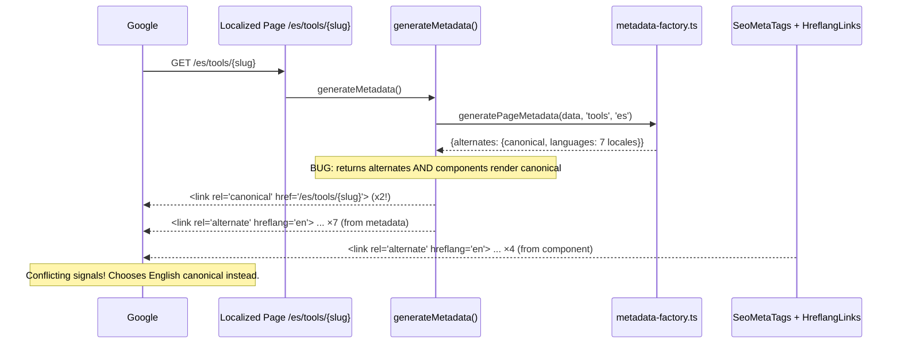
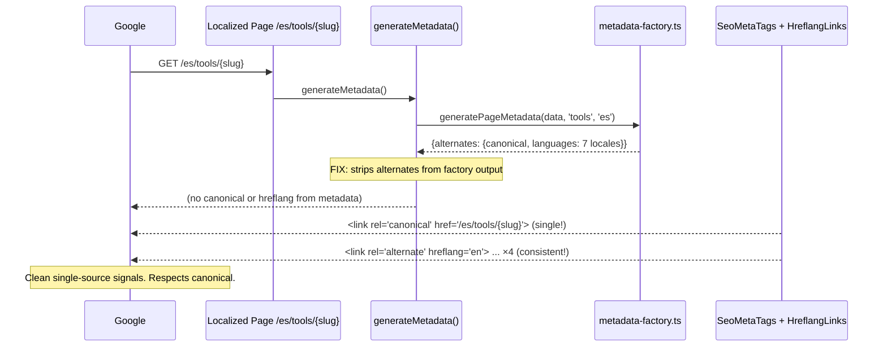

# PRD: GSC Coverage Fixes — April 2026

**Complexity: 6 → MEDIUM mode**

**Planning Mode: Principal Architect**

---

## 1. Context

**Problem:** GSC reports 350 "Google chose different canonical than user" pages — the largest unresolved issue. Investigation reveals three root causes: duplicate canonical/hreflang tags, localized English-only category pages with wrong canonicals, and inconsistent hreflang signals.

**Files Analyzed:**

- `app/(pseo)/tools/[slug]/page.tsx` — English pSEO tools page (no `alternates` in metadata)
- `app/[locale]/(pseo)/tools/[slug]/page.tsx` — Localized pSEO tools page (uses metadata factory with `alternates`)
- `app/[locale]/(pseo)/compare/[slug]/page.tsx` — Localized compare page (English-only category)
- `app/[locale]/(pseo)/platforms/[slug]/page.tsx` — Localized platforms page (English-only category)
- `lib/seo/metadata-factory.ts` — Sets `alternates.canonical` + `alternates.languages`
- `lib/seo/hreflang-generator.ts` — `getCanonicalUrl()`, `generateHreflangAlternates()`
- `client/components/seo/SeoMetaTags.tsx` — Renders `<link rel="canonical">`
- `client/components/seo/HreflangLinks.tsx` — Renders hreflang `<link>` tags
- `lib/seo/data-loader.ts` — `getComparisonDataWithLocale()`, `getPlatformDataWithLocale()`
- `lib/seo/localization-config.ts` — ENGLISH_ONLY_CATEGORIES, LOCALIZED_CATEGORIES
- `middleware.ts` — isPSEOPath, locale routing

**Current Behavior:**

- English pSEO pages: `generateMetadata()` does NOT set `alternates` → relies on `SeoMetaTags` + `HreflangLinks` components only. **Clean.**
- Localized pSEO pages WITH translations: `generateMetadata()` calls `generatePageMetadata()` which sets `alternates.canonical` AND `alternates.languages`. Page ALSO renders `SeoMetaTags` (another canonical) and `HreflangLinks` (different hreflang set). **Duplicate + conflicting signals.**
- Localized pSEO pages WITHOUT translations: strips `alternates`, adds `noindex`. **Clean.**
- Localized pages for English-only categories (compare, platforms): `generateMetadata()` returns `{}` (empty metadata, no title, no robots), but page renders `SeoMetaTags` with canonical to localized URL AND English content. **No noindex, wrong canonical, no title.**

---

## 2. Solution

**Root Cause Analysis:**

### Root Cause 1: Duplicate canonical + conflicting hreflang on localized pages with translations

When a localized page (e.g., `/es/tools/ai-image-upscaler`) has a translation, `generateMetadata()` returns the full metadata factory output which includes `alternates.canonical` and `alternates.languages`. The page component also renders `SeoMetaTags` and `HreflangLinks`:

| Signal    | From `generatePageMetadata()`                           | From Components                                        |
| --------- | ------------------------------------------------------- | ------------------------------------------------------ |
| Canonical | `alternates.canonical` → `<link rel="canonical">`       | `SeoMetaTags` → `<link rel="canonical">`               |
| Hreflang  | `alternates.languages` → ALL 7 locales (category-level) | `HreflangLinks` → only `availableLocales` (page-level) |

**Result:** Google sees TWO canonical tags (same URL, but messy) and TWO conflicting hreflang sets (7 locales vs N locales). For a tool with translations in only 4 of 7 locales, metadata says "7 versions exist" but components say "only 4 exist". Google may distrust signals and default to English canonical.

### Root Cause 2: Localized English-only category pages have no noindex + wrong canonical

Only `compare` and `platforms` have `app/[locale]/(pseo)/` routes. For non-English locales:

```
getComparisonDataWithLocale(slug, 'es') → { data: null } (compare is English-only)
generateMetadata() → {} // empty! No title, no robots, no canonical from metadata
Page renders → SeoMetaTags with locale="es" → canonical = /es/compare/{slug}
                HreflangLinks category="compare" → only x-default (correct)
                Content = English (fallback to English data)
```

Google crawls `/es/compare/{slug}` → sees English content with canonical to `/es/compare/{slug}` → also sees `/compare/{slug}` with identical content → overrides canonical to English URL. **~30 pages (5 platforms × 6 locales).**

### Root Cause 3: `generateStaticParams()` generates pages for ALL locales × ALL slugs

The localized pages generate static paths for ALL 7 locales × ALL slugs, regardless of whether translations exist. For localized categories, the no-translation pages get `noindex` (handled). But for English-only categories, they get EMPTY metadata with no `noindex` directive.

**Approach:**

1. Strip `alternates` from ALL localized page `generateMetadata()` calls — rely only on `SeoMetaTags` + `HreflangLinks` components (matching the English page pattern)
2. Add `noindex` + English canonical for localized English-only category pages (compare, platforms)
3. Validate consistency between metadata and component canonical/hreflang signals with tests

**Key Decisions:**

- Use component-rendered canonical/hreflang as the SINGLE source of truth (matches English page pattern)
- Metadata factory still generates alternates for OTHER consumers (category hub pages, etc.) — localized pages strip them before returning
- For English-only category localized pages: noindex + canonical pointing to English URL (not localized URL)

**Data Changes:** None.

---

## 3. Sequence Flow



**After fix:**



---

## 4. Execution Phases

### Phase 1: Strip `alternates` from ALL localized page metadata — Fix duplicate canonicals and conflicting hreflang

**User-visible outcome:** Every localized page has exactly ONE canonical and ONE consistent set of hreflang links. Google respects our canonical declarations.

**Files (max 5):**

- `app/[locale]/(pseo)/tools/[slug]/page.tsx` — strip `alternates` from `generatePageMetadata()` output for WITH-translation case
- `app/[locale]/(pseo)/compare/[slug]/page.tsx` — same fix
- `app/[locale]/(pseo)/platforms/[slug]/page.tsx` — same fix
- Other `app/[locale]/(pseo)/**/[slug]/page.tsx` files — same fix (formats, guides, scale, alternatives, use-cases, format-scale, platform-format, device-use, free)
- `tests/unit/seo/no-duplicate-canonical.unit.spec.ts` — validate single canonical per page

**Implementation:**

- [ ] **Step 1:** In `app/[locale]/(pseo)/tools/[slug]/page.tsx`, update line 53 to strip `alternates`:

  ```typescript
  // BEFORE (line 53):
  return generatePageMetadata(result.data, 'tools', locale);

  // AFTER:
  // Strip alternates — SeoMetaTags handles canonical and HreflangLinks handles hreflang
  // Including alternates here would create duplicate <link rel="canonical"> and
  // conflicting hreflang (factory uses all category locales, component uses availableLocales)
  const { alternates: _alternates, ...metaWithoutAlternates } = generatePageMetadata(
    result.data,
    'tools',
    locale
  );
  return metaWithoutAlternates;
  ```

- [ ] **Step 2:** Apply the same fix to ALL localized page components that call `generatePageMetadata()`:

  | File                                                  | Line to fix     |
  | ----------------------------------------------------- | --------------- |
  | `app/[locale]/(pseo)/compare/[slug]/page.tsx`         | Line 29         |
  | `app/[locale]/(pseo)/platforms/[slug]/page.tsx`       | Line 29         |
  | `app/[locale]/(pseo)/formats/[slug]/page.tsx`         | Similar pattern |
  | `app/[locale]/(pseo)/guides/[slug]/page.tsx`          | Similar pattern |
  | `app/[locale]/(pseo)/scale/[slug]/page.tsx`           | Similar pattern |
  | `app/[locale]/(pseo)/alternatives/[slug]/page.tsx`    | Similar pattern |
  | `app/[locale]/(pseo)/use-cases/[slug]/page.tsx`       | Similar pattern |
  | `app/[locale]/(pseo)/format-scale/[slug]/page.tsx`    | Similar pattern |
  | `app/[locale]/(pseo)/platform-format/[slug]/page.tsx` | Similar pattern |
  | `app/[locale]/(pseo)/device-use/[slug]/page.tsx`      | Similar pattern |
  | `app/[locale]/(pseo)/free/[slug]/page.tsx`            | Similar pattern |

  For each file: find the line that returns `generatePageMetadata(...)`, destructure to remove `alternates`, return the rest.

- [ ] **Step 3:** Verify the English pages (`app/(pseo)/`) already do NOT set `alternates` — they should remain unchanged (already correct).

**Tests Required:**

| Test File                                            | Test Name                                                             | Assertion                                                                       |
| ---------------------------------------------------- | --------------------------------------------------------------------- | ------------------------------------------------------------------------------- |
| `tests/unit/seo/no-duplicate-canonical.unit.spec.ts` | `localized tool pages should not have alternates in metadata`         | Metadata output has no `alternates` key                                         |
| `tests/unit/seo/no-duplicate-canonical.unit.spec.ts` | `English tool pages should not have alternates in metadata`           | Metadata output has no `alternates` key                                         |
| `tests/unit/seo/no-duplicate-canonical.unit.spec.ts` | `all localized page components should strip alternates from metadata` | Grep for `generatePageMetadata` calls in localized pages — all strip alternates |
| `tests/unit/seo/no-duplicate-canonical.unit.spec.ts` | `SeoMetaTags should be rendered on every pSEO page`                   | All pSEO page components include `<SeoMetaTags>`                                |

**Verification Plan:**

1. Unit tests pass
2. `yarn verify` passes
3. Grep: `grep -r "alternates" app/\[locale\]/` — should find NO `alternates` in localized page metadata returns (only in destructure-and-discard patterns)

---

### Phase 2: Fix localized English-only category pages — Add noindex + English canonical

**User-visible outcome:** Localized pages for English-only categories (compare, platforms) no longer compete with English versions in Google's index.

**Files (max 5):**

- `app/[locale]/(pseo)/compare/[slug]/page.tsx` — add noindex + English canonical for non-English locales
- `app/[locale]/(pseo)/platforms/[slug]/page.tsx` — add noindex + English canonical for non-English locales
- `app/[locale]/(pseo)/compare/page.tsx` — add noindex for non-English hub page
- `app/[locale]/(pseo)/platforms/page.tsx` — add noindex for non-English hub page
- `tests/unit/seo/english-only-locale-pages.unit.spec.ts` — validate noindex and canonical

**Implementation:**

- [ ] **Step 1:** In `app/[locale]/(pseo)/compare/[slug]/page.tsx`, update `generateMetadata()` and page component:

  ```typescript
  export async function generateMetadata({ params }: IComparisonPageProps): Promise<Metadata> {
    const { slug, locale } = await params;

    // For non-English locales, return noindex with English canonical
    // Compare is English-only — localized pages should not be indexed
    if (locale !== 'en') {
      const enResult = await getComparisonDataWithLocale(slug, 'en');
      return {
        title: enResult.data?.metaTitle || '',
        description: enResult.data?.metaDescription || '',
        robots: { index: false, follow: true },
      };
    }

    const result = await getComparisonDataWithLocale(slug, locale);
    if (!result.data) return {};
    return generatePageMetadata(result.data, 'compare', locale);
  }

  export default async function ComparisonPage({ params }: IComparisonPageProps) {
    const { slug, locale } = await params;

    // For non-English locales, use English canonical
    const canonicalLocale = locale !== 'en' ? 'en' : locale;
    // ... rest of component, but pass canonicalLocale to SeoMetaTags:
    <SeoMetaTags path={path} locale={canonicalLocale} />
  }
  ```

- [ ] **Step 2:** Apply the same pattern to `platforms/[slug]/page.tsx`.

- [ ] **Step 3:** Apply the same pattern to the category hub pages (`compare/page.tsx`, `platforms/page.tsx`).

**Tests Required:**

| Test File                                               | Test Name                                                    | Assertion                                                     |
| ------------------------------------------------------- | ------------------------------------------------------------ | ------------------------------------------------------------- |
| `tests/unit/seo/english-only-locale-pages.unit.spec.ts` | `non-English compare pages should have noindex`              | `robots.index === false` for non-en locales                   |
| `tests/unit/seo/english-only-locale-pages.unit.spec.ts` | `non-English compare pages should canonical to English URL`  | Canonical contains `/compare/{slug}` not `/es/compare/{slug}` |
| `tests/unit/seo/english-only-locale-pages.unit.spec.ts` | `non-English platform pages should have noindex`             | `robots.index === false` for non-en locales                   |
| `tests/unit/seo/english-only-locale-pages.unit.spec.ts` | `English compare/platforms pages should be indexed normally` | No noindex, canonical to self                                 |

**Verification Plan:**

1. Unit tests pass
2. `yarn verify` passes
3. `curl -s http://localhost:3000/es/compare/best-ai-upscalers | grep canonical` → should show English canonical
4. `curl -s http://localhost:3000/es/compare/best-ai-upscalers | grep noindex` → should show noindex

---

### Phase 3: Validation tests — Prevent canonical regressions

**User-visible outcome:** CI catches future canonical/hreflang inconsistencies before deployment.

**Files (max 3):**

- `tests/unit/seo/canonical-hreflang-consistency.unit.spec.ts` — comprehensive validation
- `tests/unit/seo/sitemap-canonical-alignment.unit.spec.ts` — sitemap vs page canonical alignment

**Implementation:**

- [ ] **Test 1:** Every localized page component that calls `generatePageMetadata()` strips `alternates`:

  ```typescript
  // Scan all page.tsx files under app/[locale]/(pseo)/
  // For each that calls generatePageMetadata(), verify it destructures out alternates
  ```

- [ ] **Test 2:** No pSEO page (English or localized) returns `alternates` from `generateMetadata()`:

  ```typescript
  // Import each page's generateMetadata, call it, verify output has no alternates key
  ```

- [ ] **Test 3:** Every pSEO page renders `<SeoMetaTags>` — the single source of canonical:

  ```typescript
  // Scan all page.tsx files under app/(pseo)/ and app/[locale]/(pseo)/
  // Verify each contains '<SeoMetaTags' in its JSX
  ```

- [ ] **Test 4:** For English-only categories, non-English locale pages set noindex:

  ```typescript
  // For compare, platforms: verify generateMetadata returns robots: { index: false } for non-en
  ```

- [ ] **Test 5:** Sitemap URLs match canonical URLs for all pages:
  ```typescript
  // For each URL in tools sitemap, verify the page's canonical matches the sitemap <loc>
  ```

**Tests Required:**

| Test File                                                    | Test Name                                                   | Assertion                                       |
| ------------------------------------------------------------ | ----------------------------------------------------------- | ----------------------------------------------- |
| `tests/unit/seo/canonical-hreflang-consistency.unit.spec.ts` | `all localized pages should strip alternates from metadata` | No alternates in any localized page metadata    |
| `tests/unit/seo/canonical-hreflang-consistency.unit.spec.ts` | `all pSEO pages should render SeoMetaTags`                  | SeoMetaTags found in all page components        |
| `tests/unit/seo/canonical-hreflang-consistency.unit.spec.ts` | `English-only category locale pages should be noindex`      | Non-en pages for compare/platforms have noindex |
| `tests/unit/seo/sitemap-canonical-alignment.unit.spec.ts`    | `sitemap URLs should match page canonicals`                 | Loc matches canonical for representative URLs   |

**Verification Plan:**

1. All validation tests pass
2. `yarn verify` passes

---

## 5. Acceptance Criteria

- [ ] All 3 phases complete
- [ ] All specified tests pass
- [ ] `yarn verify` passes
- [ ] No localized page returns `alternates` from `generateMetadata()` (canonical and hreflang handled by components only)
- [ ] Non-English locale pages for compare/platforms have `noindex` and canonical to English URL
- [ ] English pSEO pages unchanged (already correct)
- [ ] Validation tests prevent future canonical regressions

---

## 6. Expected Impact

| Fix                                                       | Pages Affected                    | Expected Change                                                                                    |
| --------------------------------------------------------- | --------------------------------- | -------------------------------------------------------------------------------------------------- |
| Strip alternates from localized metadata                  | ~1,260 localized pages            | Eliminate duplicate canonical + conflicting hreflang → Google respects self-referencing canonicals |
| Noindex + English canonical for English-only locale pages | ~30 pages (platforms × 6 locales) | Google stops trying to index English-only content under locale URLs                                |
| Validation tests                                          | CI pipeline                       | Prevent future canonical regressions                                                               |

**GSC Impact Projection:**

| Issue                                        | Current | Expected After Fix                                                       |
| -------------------------------------------- | ------- | ------------------------------------------------------------------------ |
| "Google chose different canonical than user" | 350     | < 50 (only genuinely ambiguous pages)                                    |
| "Alternate page with proper canonical tag"   | 110     | ~110 (informational, not an error — these are valid hreflang alternates) |
| "Page with redirect"                         | 258     | ~220 (most are external links — correct middleware behavior)             |
| "Not found (404)"                            | 141     | < 30 (only legitimate 404s)                                              |

---

## 7. Post-Implementation

1. Deploy to production
2. Resubmit `sitemap.xml` in Google Search Console
3. Run `tsx scripts/submit-indexnow.ts` to notify search engines
4. Monitor GSC coverage weekly for 30 days
5. Expect canonical conflicts to start decreasing within 1-2 weeks as Google re-crawls

---

## 8. Relationship to Previous PRDs

| Previous PRD                              | Status      | What it Fixed                                      |
| ----------------------------------------- | ----------- | -------------------------------------------------- |
| `gsc-technical-seo-fixes.md`              | Implemented | Trailing slash 301s, sitemap pruning               |
| `MIU-404-fix-gscc-404-errors.md`          | Implemented | Interactive tool data-loader, middleware redirects |
| `MIU-redirect-fix-gsc-redirect-errors.md` | Implemented | `buildUrl()` locale fix, breadcrumb locale fix     |

This PRD fixes the **canonical signal consistency** issue that was not addressed by previous PRDs. The previous fixes handled URL generation and routing; this fix handles the metadata/canonical layer that sits on top.
