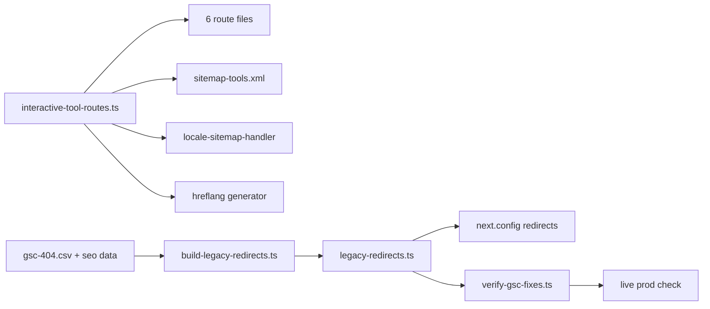

# PRD 01 — 404 Elimination (303 URLs)

**Complexity: 6 → MEDIUM mode** (10+ files +3, multi-package no, new module +2, external API no, +1 data/config)

**Planning Mode: Principal Architect**
**Source:** `data/gsc-404.csv` (302 URLs, last crawled 2026-02-16 → 2026-08-08), audit §02

---

## 1. Context

**Problem:** GSC reports 303 hard 404s. They are not one bug — they are five distinct
mechanisms, and the largest one (144 URLs) is *live and still generating new 404s* because
localized interactive-tool routes accept fewer slugs than the sitemaps advertise.

**Files Analyzed:**

- `app/(pseo)/tools/resize/[slug]/page.tsx` — `RESIZE_SLUGS` (12 slugs)
- `app/[locale]/(pseo)/tools/resize/[slug]/page.tsx` — `RESIZE_SLUGS` (6 slugs) ← drift
- `app/(pseo)/tools/convert/[slug]/page.tsx` — `CONVERSION_SLUGS` (10 slugs)
- `app/[locale]/(pseo)/tools/convert/[slug]/page.tsx` — `CONVERSION_SLUGS` (6 slugs) ← drift
- `app/(pseo)/tools/compress/[slug]/page.tsx`, `app/[locale]/(pseo)/tools/compress/[slug]/page.tsx`
- `app/sitemap-tools.xml/route.ts` — `INTERACTIVE_TOOL_PATHS` (26 entries)
- `lib/seo/locale-sitemap-handler.ts` — `TOOLS_INTERACTIVE_PATHS` (15 entries) ← drift
- `app/sitemap.xml/route.ts` — `ENGLISH_ONLY_SITEMAP_CATEGORIES` (no `use-cases-expanded`)
- `next.config.js` — `redirects()` (23 entries, blog cannibalization only)
- `middleware.ts` — `redirectMap` (line ~651, **27 hand-written entries covering 12 of the 194
  distinct 404 paths**), `isPSEOPath()` (line ~505), `/undefined/` handler (line ~630), GIF-owner
  redirect (line ~637)
- `lib/seo/data-loader.ts` — `DEDICATED_ROUTE_SLUGS`, `getToolDataWithLocale`
- `app/seo/data/*.json` — 358 unique slugs across 30 category files
- `docs/PRDs/MIU-404-fix-gscc-404-errors.md` — prior partial fix (2026-04)

**Current Behavior — the five mechanisms, with counts from `gsc-404.csv`:**

| # | Mechanism | 404s | Still live? |
| --- | --- | --- | --- |
| A | Locale interactive-tool routes accept fewer slugs than English + sitemaps | 87 (`/tools/resize` 48, `/tools/convert` 33, `/tools/compress` 6) | **Yes** — newest crawl 2026-08-08 |
| B | `/tools/{slug}` for tools that live at a dedicated sub-route or have no locale data | 92 | **Yes** — newest 2026-08-07 |
| C | Retired sections, only 12 of 194 covered by the hand-written `middleware.ts` `redirectMap`: `/article/*` 61, `/personas/*` 11, `/comparisons/*` 8, `/use-cases-expanded/*` 10, `/comparison/*` 1, `/technical-guides` 1 | 92 | **Yes** — newest 2026-08-07 |
| D | Deleted/renamed blog posts | 7 | **Yes** — newest 2026-08-06 |
| E | Junk + stale: `/&`, `/$`, `/5`, `/undefined/*` (5), casing (`/tools/Converter/*` 4, `resize-image-for-YouTube`), translated-slug guesses (`/tools/resize/redimensionneur-image` etc. 19), `/auth/register`, `/signup`, `/search?q={search_term_string}` | 44 | Mixed — `/undefined/*` last seen 2026-03-18 (likely already fixed) |

**Measured baseline — `yarn seo:verify:gsc --set=404`, production, 2026-08-13**
(`seo-reports/gsc-verify-404-2026-08-13.json`; GSC reports history, this is now):

```text
212 / 303 URLs still violate       206 still 404 · 6 redirect to a 404 destination · 91 already fixed

/article              58/61        /blog                 7/7
/tools/resize         47/48        /tools/compress       6/6
/tools/convert        33/33        /guides               6/6
/personas             11/11        /undefined            5/5   (301 → 404 destination)
/use-cases-expanded   10/10        /tools/[slug]         9/92  (83 already fixed)
/comparisons           7/8
```

This changes the priority order stated below: **mechanism B is 90% already fixed** by the earlier
MIU-404 work (9 of 92 remain), while **A and C are fully live** — `/tools/convert` is 33/33 and
`/tools/resize` 47/48. The `/undefined/*` family is not stale after all: it 301s to a path that
404s, which is why the harness resolves redirect destinations instead of trusting a 3xx.

Mechanism A in detail — the four lists that must agree but don't:

| Slug | English route | Locale route | `sitemap-tools.xml` | locale sitemaps |
| --- | --- | --- | --- | --- |
| `resize-image-for-pinterest` | ✅ | ❌ | ✅ | ❌ |
| `resize-image-for-tiktok` | ✅ | ❌ | ✅ | ❌ |
| `resize-image-for-discord` | ✅ | ❌ | ✅ | ❌ |
| `resize-image-for-reddit` | ✅ | ❌ | ✅ | ❌ |
| `resize-image-for-telegram` | ✅ | ❌ | ✅ | ❌ |
| `bulk-image-resizer` | ✅ | ✅ (own route) | ✅ | ✅ |
| `bmp-to-png` / `gif-to-png` / `gif-to-webp` / `bmp-to-webp` | ✅ | ❌ | ✅ | ❌ |

The English `sitemap-tools.xml` emits `<xhtml:link hreflang="de">` etc. for every one of these
(`generateSitemapHreflangLinks`), so Google is told 6 locale URLs exist for each slug that has
no locale route. 11 drifted slugs × 6 locales ≈ 66 of the 87 A-class 404s, and the count grows
every time someone adds a slug to one list only.

---

## 2. Solution

**Approach:**

1. **One source of truth for interactive-tool routes.** New `lib/seo/interactive-tool-routes.ts`
   exports `RESIZE_SLUGS`, `CONVERSION_SLUGS`, `COMPRESS_SLUGS`, `INTERACTIVE_TOOL_PATHS`, and
   `LOCALIZED_INTERACTIVE_SLUGS` (the subset with real locale translations). All six route files
   and both sitemap modules import it. Drift becomes impossible, not just fixed.
2. **hreflang follows routes, not wishes.** `generateSitemapHreflangLinks` for interactive tools
   emits locale alternates only for slugs in `LOCALIZED_INTERACTIVE_SLUGS`.
3. **Generated legacy-redirect map.** `scripts/seo/build-legacy-redirects.ts` reads
   `data/gsc-404.csv` + `app/seo/data/*.json` and emits `lib/seo/legacy-redirects.ts` — every
   retired slug 301s to the live page that owns it (all 92 C-class slugs resolve; verified below).
4. **Junk handled at the edge.** Casing normalization and unroutable garbage (`/&`, `/$`,
   `/undefined/*`) 301 to the closest real page or the homepage in `middleware.ts`.
5. **A live gate, not a unit test.** `scripts/seo/verify-gsc-fixes.ts` re-fetches every URL in
   `data/gsc-404.csv` against production and fails on any 404. This is the shared harness for
   PRDs 02 and 03.

C-class resolution is already proven — every retired slug exists in a live data file:

| Retired path | Owner data file | Redirect target |
| --- | --- | --- |
| `/article/{slug}` (61) | `content.json`, `photo-restoration.json`, `technical-guides.json`, `camera-raw.json`, `use-cases-expanded.json`, `bulk-tools.json` | `/{owner-category}/{slug}` |
| `/personas/{slug}` (10) | `personas-expanded.json` | `/personas-expanded/{slug}` |
| `/comparisons/{slug}` (7) | `comparisons-expanded.json` | `/comparisons-expanded/{slug}` |
| `/use-cases-expanded/{slug}` (10) | `use-cases-expanded.json` — **data exists, no route** | build route (Phase 4) |
| `/personas`, `/comparisons`, `/article`, `/technical-guides` (bare) | — | `/use-cases`, `/compare`, `/blog`, `/guides` |



**Key Decisions:**

- 301 (permanent) everywhere — these URLs carry links (one has `?ref=narrareach-blog.ghost.io`).
- Redirects in `next.config.js` `redirects()`, not middleware, for anything static: no CPU cost
  at the edge (10 ms Workers budget). Middleware only for the casing/garbage regex cases.
- `/use-cases-expanded/*` gets a **route**, not a redirect: the data is written, it is in
  `ENGLISH_ONLY_CATEGORIES`, `middleware.ts:509` already treats it as pSEO, and
  `app/sitemap-use-cases-expanded.xml/route.ts` exists but is unregistered in the sitemap index.
  Half a feature is live; finish it or the orphan sitemap keeps leaking.
- Do NOT redirect stale-only entries (`/undefined/*`, last crawled 2026-03-18) blindly — Phase 0
  re-checks live status first and drops whatever already returns 200/301.

**Data Changes:** None. Generated file `lib/seo/legacy-redirects.ts` is committed source.

---

## Integration Ledger

| # | New thing | Live caller (`file:line`, non-test) | Replaces | Old path removed? | Negative control |
| --- | --- | --- | --- | --- | --- |
| 1 | `lib/seo/interactive-tool-routes.ts` | `app/(pseo)/tools/resize/[slug]/page.tsx:TBD`, `app/[locale]/(pseo)/tools/resize/[slug]/page.tsx:TBD`, +4 route files | inline `RESIZE_SLUGS`/`CONVERSION_SLUGS`/`COMPRESS_SLUGS` in 6 files | deleted in Phase 1 | delete a slug from the shared list → that route's 200 test goes red |
| 2 | `INTERACTIVE_TOOL_PATHS` (shared) | `app/sitemap-tools.xml/route.ts:TBD`, `lib/seo/locale-sitemap-handler.ts:TBD` | two divergent local copies | deleted in Phase 2 | parity test fails when the two copies are reintroduced |
| 3 | `LOCALIZED_INTERACTIVE_SLUGS` | `lib/seo/locale-sitemap-handler.ts:TBD` (hreflang emission) | unconditional 7-locale hreflang | replaced in Phase 2 | adding `resize-image-for-telegram` to the localized set makes the sitemap-parity test red |
| 4 | `lib/seo/legacy-redirects.ts` (generated) | `next.config.js:TBD` (`redirects()` spreads it) | the 27-entry `redirectMap` in `middleware.ts:651` | middleware map deleted in Phase 3 (its 27 entries are regenerated into the map — verified by test) | emptying the array makes `/article/upscale-anime` 404 in the redirect test |
| 5 | `app/(pseo)/use-cases-expanded/[slug]/page.tsx` | `app/sitemap.xml/route.ts:TBD` registers `sitemap-use-cases-expanded.xml` | orphan sitemap route | sitemap registered in Phase 4 | removing the page makes the live 200 check for `/use-cases-expanded/real-estate-photography` red |
| 6 | `lib/seo/gsc-verification.ts` + `scripts/seo/verify-gsc-fixes.ts` | `package.json:91` script `seo:verify:gsc`; `tests/unit/seo/gsc-verification.unit.spec.ts` | manual spot checks | n/a | ✅ observed: mutating the 404 expectation to always-pass turns 6 tests red; `--expect=404` flips the verdict on live data |

### Reachability

**How is this reached?** Route handlers + `next.config.js` redirect table + sitemap routes —
all pre-existing entry points. No new runtime surface except one page route.

**User-facing?** YES — a user (or Googlebot) hitting `/de/tools/resize/resize-image-for-telegram`
currently gets the 404 page and will get the German resize tool.

**Full flow:** Googlebot requests a sitemap-advertised URL → Cloudflare Worker → Next route →
route imports the shared slug list → page renders 200 (or `redirects()` returns 301).

**What does this replace?** Six inline slug arrays and two sitemap path maps — all deleted in
Phases 1–2.

---

## 3. Execution Phases

### Phase 0: Live triage — prove which 404s are real (no code changes yet)

**Status: DONE 2026-08-13.**

**Files (3):**

- `lib/seo/gsc-verification.ts` — NEW: expectation logic, HTML/sitemap parsing, family grouping (pure, unit-tested)
- `scripts/seo/verify-gsc-fixes.ts` — NEW: CLI runner (fetching, concurrency, report writing)
- `package.json` — EDIT: `"seo:verify:gsc": "tsx scripts/seo/verify-gsc-fixes.ts"`
- `tests/unit/seo/gsc-verification.unit.spec.ts` — NEW: 31 tests, each expectation tested in both directions

(Split into lib + CLI so the expectations are testable without executing `process.argv` on import.)

**Implementation:**

- [x] Read `docs/PRDs/gsc-recovery-2026-08/data/gsc-<set>.csv`; `--set=404|noindex|5xx|dup|cni`
- [x] `HEAD` (falling back to `GET`) each URL, `--delay=250`, `--concurrency=4`, `redirect: 'manual'`
- [x] Record status, `Location`, `<link rel=canonical>`, `<meta name=robots>`, `X-Robots-Tag`, sitemap membership
- [x] **Resolve redirect destinations** — a 301 to a 404 is not a fix, and a chain is its own defect
- [x] Write `seo-reports/gsc-verify-<set>-<date>.json` + a stdout summary grouped by URL family
- [x] Exit 1 when any URL violates the set's expectation
- [x] `--expect=<status>`, `--limit`, `--base-url` for negative controls and local runs

Per-set expectations, as implemented:

| Set | Violation |
| --- | --- |
| `404` | not 200, or a redirect whose destination is not a single-hop 200 |
| `5xx` | status ≥ 500 |
| `noindex` / `cni` | URL is noindexed **and** still submitted in a sitemap (walks `/sitemap.xml` + children) |
| `dup` | locale URL still self-canonical, or no canonical tag at all |

**Wiring:**

- [x] Caller: `package.json` script (pre-existing file edited)
- [x] Registration: this folder's README verification protocol
- [x] Old path: n/a — replaces ad-hoc `curl` checks

**Verification Plan — executed, output below:**

```bash
yarn seo:verify:gsc --set=404
# 212/303 URLs violate the "404" expectation   → exit 1
# 206 still 404 · 6 redirect to a 404 destination · 91 already fixed
# Report: seo-reports/gsc-verify-404-2026-08-13.json

yarn seo:verify:gsc --set=5xx
# 0/5 URLs violate — 4 now 301 to /ja/tools/resize/*, 1 returned 200 on that request
# (1102 is intermittent; PRD 02 Phase 4 requires 20 sequential requests, not one)
```

**Negative controls — both observed:**

1. `yarn seo:verify:gsc --set=404 --limit=20 --expect=404` flips the verdict for exactly the two
   URLs that no longer 404 (18 match, 2 do not). The harness reads live status codes; it does not
   always pass or always fail.
2. Mutating `evaluateExpectation` to always return `ok: true` for the 404 case turns 6 of the 31
   unit tests red. The suite can fail.

**Output of this phase:** `seo-reports/gsc-verify-404-2026-08-13.json` — the authoritative list of
**live** 404s. Every later phase targets that list, not the raw GSC export.

---

### Phase 1: One slug list for interactive tools (kills mechanism A, 87 URLs)

**Files (5):**

- `lib/seo/interactive-tool-routes.ts` — NEW: `RESIZE_SLUGS`, `CONVERSION_SLUGS`, `COMPRESS_SLUGS`, `INTERACTIVE_TOOL_PATHS`, `LOCALIZED_INTERACTIVE_SLUGS`
- `app/[locale]/(pseo)/tools/resize/[slug]/page.tsx` — EDIT: import the list, delete the local 6-slug array (line 13)
- `app/[locale]/(pseo)/tools/convert/[slug]/page.tsx` — EDIT: same (line 13)
- `app/(pseo)/tools/resize/[slug]/page.tsx` — EDIT: same (line 17)
- `app/(pseo)/tools/convert/[slug]/page.tsx` — EDIT: same (line 13)

(Compress routes follow in the same commit if the 5-file cap allows; otherwise Phase 1b —
`COMPRESS_SLUGS` is identical in both files today, so the risk is nil.)

**Implementation:**

- [ ] `LOCALIZED_INTERACTIVE_SLUGS` = slugs present in **all** of `locales/{de,es,fr,it,ja,pt}/interactive-tools.json`
- [ ] Locale routes render every slug in the shared list; for slugs outside
      `LOCALIZED_INTERACTIVE_SLUGS`, render English copy + `robots: { index: false, follow: true }`
      (never `notFound()` — a 200 + noindex beats a 404 for a URL Google already knows)
- [ ] `generateStaticParams` in locale routes uses the full shared list

**Wiring:**

- [ ] Callers edited: the four route files above (all pre-existing)
- [ ] Old path: four inline arrays deleted — grep must show zero remaining literals
- [ ] Ledger rows filled: #1

**Tests Required:**

| Test File | Test Name | Assertion | Negative control (observe red) |
| --- | --- | --- | --- |
| `tests/unit/seo/interactive-tool-route-parity.unit.spec.ts` | `should expose the same resize slugs in English and locale routes` | both route modules import from `interactive-tool-routes` and the arrays are reference-equal | re-add a literal array to the locale route → red |
| `tests/unit/seo/interactive-tool-route-parity.unit.spec.ts` | `should route every sitemap-advertised interactive tool path` | every path in `INTERACTIVE_TOOL_PATHS` maps to a slug in one of the three lists | add a path with no slug → red |
| `tests/unit/seo/interactive-tool-route-parity.unit.spec.ts` | `should mark untranslated interactive tools noindex, not 404` | `LOCALIZED_INTERACTIVE_SLUGS ⊂ all slugs`, and untranslated → `index:false` | make the route call `notFound()` → red |

**Revert check:** delete `lib/seo/interactive-tool-routes.ts` → all four routes fail to compile
and `tests/unit/seo/hreflang-interactive-tools.unit.spec.ts` (pre-existing) fails.

**User Verification:**

- Action: `yarn dev`, open `/de/tools/resize/resize-image-for-telegram`
- Expected: 200, German resize tool renders (or English copy with a noindex tag), not the 404 page

---

### Phase 2: Sitemaps stop advertising URLs that do not exist (prevents A recurring)

**Files (4):**

- `app/sitemap-tools.xml/route.ts` — EDIT: delete local `INTERACTIVE_TOOL_PATHS` (line 26), import shared
- `lib/seo/locale-sitemap-handler.ts` — EDIT: delete `TOOLS_INTERACTIVE_PATHS` (line 34), import shared; gate hreflang on `LOCALIZED_INTERACTIVE_SLUGS`
- `lib/seo/hreflang-generator.ts` — EDIT: `generateSitemapHreflangLinks` accepts an optional locale allow-list
- `tests/unit/seo/sitemap-route-parity.unit.spec.ts` — NEW

**Implementation:**

- [ ] Every URL emitted by any `sitemap-*.xml` route must resolve to a declared route pattern
- [ ] Locale sitemaps emit a URL only when the slug has that locale's data
- [ ] English sitemap hreflang blocks list only locales that will return 200

**Wiring:**

- [ ] Callers edited: both sitemap modules (pre-existing)
- [ ] Old path: two divergent path maps deleted — `grep -rn "TOOLS_INTERACTIVE_PATHS" app lib` returns only the shared definition and its importers
- [ ] Ledger rows filled: #2, #3

**Tests Required:**

| Test File | Test Name | Assertion | Negative control |
| --- | --- | --- | --- |
| `tests/unit/seo/sitemap-route-parity.unit.spec.ts` | `should emit only URLs with a matching route` | every `<loc>` matches a route pattern derived from `app/**/page.tsx` | add a fake slug to the sitemap map → red |
| `tests/unit/seo/sitemap-route-parity.unit.spec.ts` | `should not emit locale hreflang for untranslated interactive tools` | no `hreflang="de"` for `resize-image-for-telegram` until it is in `LOCALIZED_INTERACTIVE_SLUGS` | force-add it → red |

**Revert check:** restore the old 15-entry `TOOLS_INTERACTIVE_PATHS` → the parity test fails.

**Verification Plan:**

```bash
yarn build && yarn start &
yarn validate:seo:sitemap --base-url=http://localhost:3000     # pre-existing crawler
# Expected: 0 URLs with status 404 (baseline today: the A-class URLs above)
```

---

### Phase 3: Legacy redirect map for retired sections (mechanism C+D, 99 URLs)

**Files (4):**

- `scripts/seo/build-legacy-redirects.ts` — NEW: generate the map from `data/gsc-404.csv` + `app/seo/data/*.json`
- `lib/seo/legacy-redirects.ts` — NEW (generated, committed): `export const LEGACY_REDIRECTS: Array<{source, destination, permanent}>`
- `next.config.js` — EDIT: `redirects()` spreads `LEGACY_REDIRECTS` alongside the existing 23 entries
- `middleware.ts` — EDIT: delete the 27-entry `redirectMap` (line ~651) once its entries are in the generated map
- `tests/unit/seo/legacy-redirects.unit.spec.ts` — NEW

**Implementation:**

- [ ] For each live 404 from Phase 0: find the slug's owner data file → destination `/{category}/{slug}`
- [ ] Emit locale-prefixed variants `'/:locale(en|fr|de|es|it|ja|pt)/article/:slug'` mirroring the existing convention (`next.config.js:177`)
- [ ] Bare-section redirects: `/article`→`/blog`, `/personas`→`/use-cases`, `/comparisons`→`/compare`, `/technical-guides`→`/guides`
- [ ] Blog D-class: `/blog/10-best-ai-tools-for-photo-editing` → `/blog/10-best-ai-tools-for-photo-editing-in-2026` if live, else the roundup `/blog/best-free-ai-image-upscaler-2026-tested-compared`; same for the other 6
- [ ] Any 404 with no owner → explicit `UNMAPPED` list printed by the script; a human decides (do not silently drop)

**Wiring:**

- [ ] Caller edited: `next.config.js` `redirects()` (pre-existing)
- [ ] Old path: `middleware.ts` `redirectMap` deleted — one live redirect table, not two. The GIF-owner
      redirect (line ~637) and the `/undefined/` handler (line ~630) stay in middleware: they are
      pattern-based, not a static table
- [ ] Ledger rows filled: #4

**Tests Required:**

| Test File | Test Name | Assertion | Negative control |
| --- | --- | --- | --- |
| `tests/unit/seo/legacy-redirects.unit.spec.ts` | `should map every GSC 404 slug to a live destination` | for each row in `gsc-404.csv` (minus the documented UNMAPPED list) a redirect exists AND its destination slug exists in a data file or blog index | empty `LEGACY_REDIRECTS` → red |
| `tests/unit/seo/legacy-redirects.unit.spec.ts` | `should not chain redirects` | no destination is itself a redirect source | add `/a→/b` and `/b→/c` → red |
| `tests/unit/seo/legacy-redirects.unit.spec.ts` | `should use 301 for all legacy redirects` | every entry `permanent: true` | flip one to false → red |
| `tests/unit/seo/legacy-redirects.unit.spec.ts` | `should preserve every redirect the middleware map used to serve` | all 27 former `redirectMap` sources still resolve to the same destination | drop one during generation → red |

**Revert check:** remove the spread from `next.config.js` → `tests/unit/seo/middleware-redirects.unit.spec.ts` (pre-existing) plus the new suite fail.

---

### Phase 4: `/use-cases-expanded/*` route + junk cleanup (mechanisms C-tail and E)

**Files (5):**

- `app/(pseo)/use-cases-expanded/[slug]/page.tsx` — NEW (mirrors `app/(pseo)/personas-expanded/[slug]/page.tsx`)
- `app/sitemap.xml/route.ts` — EDIT: add `'use-cases-expanded'` to `ENGLISH_ONLY_SITEMAP_CATEGORIES` (line ~33)
- `middleware.ts` — EDIT: normalize casing (`/tools/Converter/*` → `/tools/convert/*`, `resize-image-for-YouTube` → lowercase) and 301 unroutable junk (`/&`, `/$`, `/5`) to `/`
- `tests/unit/seo/pseo-category-coverage.unit.spec.ts` — NEW
- `tests/unit/seo/middleware-redirects.unit.spec.ts` — EDIT: casing + junk cases

**Implementation:**

- [ ] Category page uses `generatePSEOSchema(page, 'use-cases-expanded')` — real category name, per CLAUDE.md pSEO rules
- [ ] `middleware.ts` casing rule: lowercase the pathname for `/tools/**` only, 301 when it differs
- [ ] Translated-slug guesses (`/tools/resize/redimensionneur-image`, `/tools/compress/compresseur-image`, 19 total, 1 hit each) → 301 to the English slug under the requesting locale prefix

**Wiring:**

- [ ] Callers edited: `app/sitemap.xml/route.ts`, `middleware.ts` (both pre-existing)
- [ ] Registration: sitemap index entry + `isPSEOPath` already covers `/use-cases-expanded/` (`middleware.ts:509`)
- [ ] Ledger rows filled: #5

**Tests Required:**

| Test File | Test Name | Assertion | Negative control |
| --- | --- | --- | --- |
| `tests/unit/seo/pseo-category-coverage.unit.spec.ts` | `should have a route for every category with a sitemap` | every `app/sitemap-*.xml` has a matching page route | delete the new page → red |
| `tests/unit/seo/pseo-category-coverage.unit.spec.ts` | `should register every sitemap route in the sitemap index` | `sitemap-use-cases-expanded.xml` appears in `/sitemap.xml` | remove from the array → red |
| `tests/unit/seo/middleware-redirects.unit.spec.ts` | `should 301 mixed-case tool paths to lowercase` | `/tools/Converter/jpg-to-webp` → 301 `/tools/convert/jpg-to-webp` | remove the rule → red |

**User Verification:**

- Action: open `/use-cases-expanded/real-estate-photography`
- Expected: 200 with real content (this URL has an external backlink from `narrareach-blog.ghost.io`)

---

## 4. Checkpoint Protocol

After **each** phase, spawn `prd-work-reviewer` with the standard integration audit prompt from
the skill, plus:

```text
Also audit integration:
1. Integration Ledger rows for this phase filled with real non-test file:line?
2. grep -rn "RESIZE_SLUGS\s*=\s*\[" app/ — must return zero inline arrays after Phase 1
3. Did the phase edit a pre-existing file?
4. Revert check performed and observed red?
5. Were the four inline slug arrays and two sitemap maps deleted, not left alongside?
```

Manual checkpoint required after Phase 4 (visible page + edge redirects).

---

## 5. Verification Strategy

### Live gate (the one that matters)

```bash
# After deploy — the same command from Phase 0, now expected to pass
yarn seo:verify:gsc --set=404 --base-url=https://myimageupscaler.com | tee /tmp/404-after.txt
diff /tmp/404-before.txt /tmp/404-after.txt
```

Pass condition: **0 URLs returning 404**; every URL is 200 or a single 301 to a 200.

```bash
# Spot checks, one per mechanism — paste real output into the PRD, do not summarize
curl -sI https://myimageupscaler.com/de/tools/resize/resize-image-for-telegram | head -1  # A → 200
curl -sI https://myimageupscaler.com/tools/ocr-online                          | head -1  # B → 200
curl -sI https://myimageupscaler.com/article/upscale-anime                     | head -1  # C → 301
curl -sI https://myimageupscaler.com/article/upscale-anime -L -o /dev/null -w '%{url_effective} %{http_code}\n'
curl -sI https://myimageupscaler.com/blog/how-to-batch-edit-photos             | head -1  # D → 301
curl -sI https://myimageupscaler.com/tools/Converter/jpg-to-webp               | head -1  # E → 301
```

### Integration proof

```bash
# 1. Caller census — the shared module must have non-test consumers
grep -rn "interactive-tool-routes" app lib --include=*.ts --include=*.tsx | grep -v tests/
# Expected: ≥6 hits (4 route files + 2 sitemap modules)

# 2. Incumbent check — no inline copies survive
grep -rn "RESIZE_SLUGS = \[\|CONVERSION_SLUGS = \[\|TOOLS_INTERACTIVE_PATHS" app lib | grep -v "lib/seo/interactive-tool-routes.ts"
# Expected: no output

# 3. Revert check
git stash && yarn test:unit tests/unit/seo && git stash pop
# Expected: the new suites fail before the change, pass after
```

### Post-deploy GSC protocol

1. Submit changed URLs: `yarn tsx scripts/submit-indexnow.ts`
2. GSC → Pages → **Not found (404)** → **Validate Fix** (only after the live gate passes)
3. **2026-08-27 (14 days):** 404 count trending down; no new 404s with a post-deploy crawl date
4. **2026-09-10 (28 days):** 404 count < 25; `/tools/resize` and `/tools/convert` families at 0

---

## 6. Acceptance Criteria

Consumer-scoped — each is checkable only by a build a user could tell apart:

- [ ] A visitor on `/de`, `/es`, `/fr`, `/it`, `/ja`, `/pt` can open every resize/convert/compress tool listed in that locale's sitemap and gets a working tool page
- [ ] Every URL in `data/gsc-404.csv` returns 200 or one 301 hop to a 200 in production
- [ ] A person following the `narrareach-blog.ghost.io` backlink lands on a real page, not the 404 screen
- [ ] Adding a new interactive tool slug to one list and not the others fails CI before merge
- [ ] GSC "Not found (404)" drops below 25 by 2026-09-10

Binary done checks:

- [ ] All phases complete
- [ ] All specified tests pass · `yarn verify` passes
- [ ] All checkpoint reviews passed
- [ ] Integration Ledger has zero `TBD` cells
- [ ] Every gate observed red before it was green (Phase 0 baseline captured)
- [ ] SEO backlog entry appended · GSC indexing backlog updated
