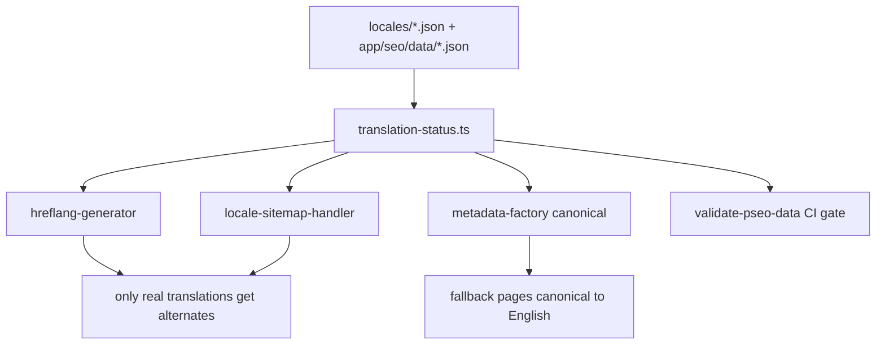

# PRD 02 — Locale Indexation Integrity (239 duplicate + 107 noindex + 5 server errors)

**Complexity: 8 → HIGH mode** (10+ files +3, complex state/config logic +2, new module +2, data/config +1)
**Mandatory checkpoint after every phase.**

**Planning Mode: Principal Architect**
**Source:** `data/gsc-duplicate-canonical.csv`, `data/gsc-noindex.csv`, `data/gsc-5xx.csv`, audit §02/§06

---

## 1. Context

**Problem:** 351 URLs in three GSC buckets share one root cause: **locale pages are published
as if they were translated when they are not.** The site tells Google a `/de/...` page exists,
serves English text under a self-referencing German canonical, and Google reduces it to a
duplicate — or the page is noindexed but still sitemap-submitted, or the locale data is a stub
and the page 500s.

The distribution proves it is a locale problem, not a page problem:

| Bucket | Total | English | Non-English |
| --- | ---: | ---: | ---: |
| Duplicate, Google chose different canonical | 238 | **0** | 238 |
| Excluded by `noindex` | 106 | 1 | 105 |
| Server error (5xx) | 5 | 0 | **5 (all `/ja/`)** |

Duplicate-canonical families: `/scale/*` 80, `/format-scale/*` 75, `/platform-format/*` 20,
`/guides/*` 17, `/free/*` 16, `/formats/*` 9, `/tools` 5, `/about` 5, `/use-cases/*` 5.

**Files Analyzed:**

- `lib/seo/hreflang-generator.ts` — `generateHreflangAlternates` (line 57), `getCanonicalUrl` (line 186)
- `lib/seo/localization-config.ts` — `LOCALIZED_CATEGORIES` (10 categories), `isCategoryLocalized`
- `lib/seo/data-loader.ts` — `getToolDataWithLocale` (line 719), `getAvailableLocalesForToolSlug` (line 767), the 12 other `hasTranslation` loaders
- `lib/seo/metadata-factory.ts` — `generateMetadata` (line 47), `NOINDEX_CATEGORIES` (line 31)
- `lib/seo/locale-sitemap-handler.ts` — locale sitemap emission
- `app/[locale]/(pseo)/tools/[slug]/page.tsx` — the only route that already noindexes untranslated fallbacks (line 34)
- `app/[locale]/(pseo)/scale/[slug]/page.tsx` — calls `getScaleData(slug)` with **no locale argument** (line 30)
- `locales/{de,es,fr,it,ja,pt}/*.json` vs `app/seo/data/*.json`
- `app/sitemap.xml/route.ts` — emits `sitemap-{category}-{locale}.xml` for all 10 localized categories × 6 locales

**Current Behavior:**

- `isCategoryLocalized(category, locale)` answers per **category**, never per **page**. A category is
  "localized" if any translation work was done for it.
- `generateHreflangAlternates(path, category)` therefore emits all 7 locale alternates for every
  page in a localized category, translated or not.
- `getCanonicalUrl(path, locale)` always self-references (`/de/scale/2k-upscaler` canonicals to itself),
  which is correct *only if* the page is genuinely a German page.
- Locale routes fall back to English data and render English text under that German canonical.
  Google sees 7 near-identical pages, keeps one, and files 238 duplicates.
- `app/[locale]/(pseo)/tools/[slug]/page.tsx` is the exception: it noindexes untranslated
  fallbacks (correct), but the locale sitemaps still submit those URLs → 105 "Excluded by noindex"
  in the *sitemap* report, which is a self-inflicted crawl-budget bill.
- `locales/ja/interactive-tools.json` has 21 entries vs 15 in English; four of them
  (`resize-image-for-{linkedin,instagram,facebook,twitter}`) are **stubs** carrying only title-ish
  fields — no `features`, `howItWorks`, `useCases`, `benefits`, `toolComponent`, `toolConfig`,
  `isInteractive`. `getToolDataWithLocale` treats a stub as a valid translation
  (`hasTranslation: interactiveData !== null`, line 755) → the template maps over `undefined` → 500.

**The 5xx bucket is two different bugs, and one is already partly handled:**

| URL | Mechanism | Status |
| --- | --- | --- |
| `/ja/tools/resize-image-for-{linkedin,instagram,facebook,twitter}` | stub locale data → template crash | **Masked**: a locale-preserving 301 to `/ja/tools/resize/{slug}` shipped ~2026-08-10 ([backlog](../../SEO/maintenance/seo-changes-backlog.md), "Validate fix" still open). The stub data is still there and still crashes anything that reaches the route directly — the durable fix is Phase 1. |
| `/ja/platform-format/lightroom-upscaler-avif` | **Cloudflare Worker CPU `error code: 1102` → 503**, not a data bug. The 2026-07-30 crawl hit it on 63 of 1,927 URLs, concentrated in localized `platform-format`, `format-scale`, `device-use`; a representative OpenNext cache record is ~1.1 MB. | Open — tracked in the backlog and [GSC drop diagnosis 2026-08-08](../../SEO/reports/gsc-drop-diagnosis-2026-08-08.md); addressed in Phase 4. Intermittent, so an 8-URL sample returning 200 does **not** mean fixed. |

Phase 0 re-checks both live before any code is written — the redirect may already have cleared the
first four in GSC.

---

## 2. Solution

**Approach:**

1. **Per-page translation truth.** New `lib/seo/translation-status.ts` exposes
   `getTranslatedLocales(category, slug): Promise<Locale[]>` — the single answer to "which locales
   really have this page", built on the existing `hasTranslation` loaders.
2. **Hreflang and locale sitemaps consume that answer**, not `isCategoryLocalized`. Untranslated
   locale URLs disappear from sitemaps and from hreflang blocks.
3. **Untranslated locale pages canonical to English.** When a page is an English fallback, emit
   `<link rel="canonical" href="{en URL}">` instead of a self-reference, and drop `noindex`.
   That is the correct signal for a fallback page: Google already chose the English canonical for
   238 of them — we stop contradicting it, and consolidate the signals into the English URL.
4. **Stub translations are not translations.** A schema validator rejects locale entries missing
   required render fields; `getToolDataWithLocale` treats a stub as *no translation* (English
   fallback) rather than as data. Fixes the 5xx and prevents the next one.
5. **Gate it in CI.** `scripts/validate-pseo-data.ts` gains a locale-completeness check so an
   incomplete locale file fails `yarn verify` instead of failing in production.



**Key Decisions:**

- **Canonical-to-English beats noindex** for fallback pages: noindex wastes the crawl and drops the
  URL entirely; a cross-locale canonical consolidates signals into the English page that is already
  winning. Applies to fallback pages only — real translations keep self-canonical + hreflang.
- **Sitemaps list only self-canonical URLs.** Never submit a URL that canonicals elsewhere.
- **Do not delete locale routes.** `/de` and `/it` convert at 4.0–4.2% CTR at position ~9.6 (audit
  §06) — localization works where translations are real. This PRD makes the claim honest, it does
  not retreat from localization.
- Stub detection is a data-shape check (required fields non-empty), not a heuristic on text.

**Data Changes:** None to the database. `locales/ja/interactive-tools.json` loses 4 stub entries
(or gains full translations — Phase 1 decides per entry).

---

## Integration Ledger

| # | New thing | Live caller (`file:line`, non-test) | Replaces | Old path removed? | Negative control |
| --- | --- | --- | --- | --- | --- |
| 1 | `lib/seo/translation-status.ts` → `getTranslatedLocales()` | `lib/seo/locale-sitemap-handler.ts:TBD`, `lib/seo/hreflang-generator.ts:TBD`, `lib/seo/metadata-factory.ts:TBD` | `isCategoryLocalized`-based locale lists | category-level check reduced to a coarse pre-filter in Phase 2 | stub the function to return all locales → sitemap/hreflang tests go red |
| 2 | `isStubTranslation()` in `lib/seo/translation-status.ts` | `lib/seo/data-loader.ts:755` (`getToolDataWithLocale`) and the sibling loaders | `data !== null` truthiness as the translation test | replaced in Phase 1 | restore truthiness check → `/ja/tools/resize-image-for-linkedin` 500 test goes red |
| 3 | `canonicalOverride` in metadata factory | `lib/seo/metadata-factory.ts:TBD`, consumed by locale pSEO routes | unconditional self-canonical | Phase 3 | remove the override → duplicate-canonical assertion goes red |
| 4 | Locale-completeness rule in `scripts/validate-pseo-data.ts` | `package.json` `validate:seo:schema` → `yarn verify` | manual review | n/a | add a stub entry to a locale file → `yarn verify` fails |
| 5 | `scripts/seo/check-cache-record-size.ts` (Phase 4) | `package.json` `verify` chain | nothing — 1102 was only observed, never gated | n/a | set the budget to 1 KB → `yarn verify` fails, proving it measures real records |

### Reachability

**How is this reached?** `generateMetadata` on every localized pSEO route, every
`sitemap-{category}-{locale}.xml` route handler, and `yarn verify` in CI. All pre-existing.

**User-facing?** Partly — a `/ja/` visitor currently gets a 500 on four tool pages and will get a
working page. The canonical/hreflang changes are crawler-facing.

**Full flow:** Googlebot fetches `/de/scale/2k-upscaler` → route calls `generateMetadata` →
factory asks `getTranslatedLocales('scale','2k-upscaler')` → German absent → canonical points at
`https://myimageupscaler.com/scale/2k-upscaler`, no `de` hreflang, URL absent from
`sitemap-scale-de.xml`.

**What does this replace?** Category-level localization assumptions in three modules, and the
`data !== null` translation test in the data loaders.

---

## 3. Execution Phases

### Phase 0: Reproduce all three buckets live (no fixes)

**Files (2):**

- `scripts/seo/verify-gsc-fixes.ts` — EDIT (built in PRD 01): add `--set=dup` and `--set=noindex` expectations
- `seo-reports/` — output only

**Implementation:**

- [ ] `--set=noindex`: FAIL when a URL returns `noindex` **and** appears in any sitemap
- [ ] `--set=dup`: FAIL when a locale URL's `<link rel=canonical>` points at itself while its
      rendered `<html lang>` content matches the English page (fallback detection: compare the
      `<h1>` to the English `<h1>`)
- [ ] `--set=5xx`: FAIL on any status ≥ 500

**Verification Plan:**

```bash
yarn seo:verify:gsc --set=5xx      | tee /tmp/5xx-before.txt
yarn seo:verify:gsc --set=noindex  | tee /tmp/noindex-before.txt
yarn seo:verify:gsc --set=dup      | tee /tmp/dup-before.txt

# The four social-resize URLs should now 301 (redirect shipped ~2026-08-10) — confirm, don't assume
curl -s -o /dev/null -w '%{http_code} %{redirect_url}\n' https://myimageupscaler.com/ja/tools/resize-image-for-linkedin

# The stub crash is masked by that redirect — hit the crashing route directly to prove it still exists
curl -s -o /dev/null -w '%{http_code}\n' https://myimageupscaler.com/ja/tools/resize/resize-image-for-linkedin

# 1102 is intermittent: 20 sequential requests, not one
for i in $(seq 1 20); do curl -s -o /dev/null -w '%{http_code} ' https://myimageupscaler.com/ja/platform-format/lightroom-upscaler-avif; done; echo
```

**Measured 2026-08-13** (`yarn seo:verify:gsc --set=5xx`, harness built in PRD 01 Phase 0):

```text
0/5 URLs violate
200  /ja/platform-format/lightroom-upscaler-avif        ← 1102 is intermittent; one 200 proves nothing
301  /ja/tools/resize-image-for-facebook   → /ja/tools/resize/resize-image-for-facebook
301  /ja/tools/resize-image-for-linkedin   → /ja/tools/resize/resize-image-for-linkedin
301  /ja/tools/resize-image-for-instagram  → /ja/tools/resize/resize-image-for-instagram
301  /ja/tools/resize-image-for-twitter    → /ja/tools/resize/resize-image-for-twitter
```

So the redirect confirmed as shipped: GSC can be sent to **Validate Fix** for those four now. The
stub data behind them is untouched and still crashes the route it redirects to — Phase 1 stands.

**Negative control:** run `--set=5xx --expect=500` → every currently-healthy URL is reported as a
violation. Proves the gate reads live status rather than always passing.

---

### Phase 1: Stub translations stop crashing `/ja/` (5 server errors)

**Files (5):**

- `lib/seo/translation-status.ts` — NEW: `isStubTranslation(page, category)` + required-field table
- `lib/seo/data-loader.ts` — EDIT line ~755: `hasTranslation: interactiveData !== null && !isStubTranslation(...)`; a stub falls through to English
- `locales/ja/interactive-tools.json` — EDIT: remove or complete the 4 stub entries (`resize-image-for-{linkedin,instagram,facebook,twitter}`)
- `scripts/validate-pseo-data.ts` — EDIT: fail on stub entries in any `locales/*/**.json`
- `tests/unit/seo/locale-data-integrity.unit.spec.ts` — NEW

**Implementation:**

- [ ] Required-render fields per category (tools: `toolName`, `description`, `features[]`, `howItWorks[]`, `useCases[]`, `benefits[]`, `metaTitle`, `metaDescription`)
- [ ] `isStubTranslation` = any required field missing, null, or an empty array
- [ ] `/ja/platform-format/lightroom-upscaler-avif` is **not** in this phase — its data is complete and
      the failure is Worker CPU 1102 (Phase 4)
- [ ] Sweep all 6 locale dirs for stubs; report counts in the PR description

**Wiring:**

- [ ] Caller edited: `lib/seo/data-loader.ts` (pre-existing, line ~755) and the sibling loaders that use `data !== null`
- [ ] Registration: `validate-pseo-data.ts` already runs in `yarn verify` via `validate:seo:schema`
- [ ] Old path: truthiness translation test deleted at every `hasTranslation:` site
- [ ] Ledger rows filled: #2, #4

**Tests Required:**

| Test File | Test Name | Assertion | Negative control |
| --- | --- | --- | --- |
| `tests/unit/seo/locale-data-integrity.unit.spec.ts` | `should treat a stub locale entry as untranslated` | `getToolDataWithLocale('resize-image-for-linkedin','ja')` → `hasTranslation === false` and English data returned | revert to truthiness → red |
| `tests/unit/seo/locale-data-integrity.unit.spec.ts` | `should have no stub entries in any locale data file` | every `locales/*/**.json` page passes `isStubTranslation === false` | re-add a stripped entry → red |
| `tests/e2e/pseo/locale-tool-pages.spec.ts` | `should render the ja LinkedIn resize tool without a server error` | status 200 and the tool component is visible | restore the stub → red |

**Revert check:** restore the 4 stub entries → the e2e test 500s and `yarn verify` fails.

**User Verification (manual, HIGH complexity):**

- Action: open `/ja/tools/resize-image-for-linkedin`, `/ja/tools/resize-image-for-instagram`, `/ja/tools/resize-image-for-facebook`, `/ja/tools/resize-image-for-twitter`, `/ja/platform-format/lightroom-upscaler-avif`
- Expected: five 200s, tool UI usable, no error boundary

---

### Phase 2: Sitemaps and hreflang list only real translations (105 noindex-in-sitemap)

**Files (5):**

- `lib/seo/translation-status.ts` — EDIT: add `getTranslatedLocales(category, slug)`
- `lib/seo/locale-sitemap-handler.ts` — EDIT: skip pages without that locale's translation
- `lib/seo/hreflang-generator.ts` — EDIT: `generateHreflangAlternates(path, category, translatedLocales?)`
- `lib/seo/metadata-factory.ts` — EDIT: pass the per-page locale list through
- `tests/unit/seo/hreflang-data-aware.unit.spec.ts` — EDIT (pre-existing): extend to all 10 localized categories

**Implementation:**

- [ ] `getTranslatedLocales` reuses the existing per-category `hasTranslation` loaders — no new data reads
- [ ] Locale sitemap: emit a `<url>` only when `getTranslatedLocales(...)` includes that locale
- [ ] hreflang: alternates only for translated locales + `x-default` → English
- [ ] Log the emitted-vs-skipped counts per locale sitemap during build for the Phase 3 baseline

**Wiring:**

- [ ] Callers edited: three pre-existing lib modules
- [ ] Old path: `getAvailableLocales(category)` (`hreflang-generator.ts:21`) becomes a fallback used only when no slug is supplied — no second live implementation
- [ ] Ledger rows filled: #1

**Tests Required:**

| Test File | Test Name | Assertion | Negative control |
| --- | --- | --- | --- |
| `tests/unit/seo/hreflang-data-aware.unit.spec.ts` | `should not emit hreflang for locales without a translation` | `/tools/exif-remover` has no `de` alternate while `locales/de` lacks it | force `getTranslatedLocales` to return all → red |
| `tests/unit/seo/locale-sitemap-handler.unit.spec.ts` | `should not submit noindexed fallback URLs` | none of the 106 URLs in `data/gsc-noindex.csv` appear in any locale sitemap | revert the skip → red |
| `tests/unit/seo/locale-sitemap-handler.unit.spec.ts` | `should still submit genuinely translated locale URLs` | German tool pages with real data remain present | over-filter (skip everything) → red |

**Revert check:** revert `locale-sitemap-handler.ts` → the noindex-in-sitemap assertion fails.

**Verification Plan:**

```bash
yarn build && yarn start &
# Count locale URLs before/after — the drop should be ~105 for tools, not ~all
yarn tsx scripts/count-sitemap-urls.ts --base-url=http://localhost:3000
yarn seo:verify:gsc --set=noindex --base-url=http://localhost:3000   # expect exit 0
```

---

### Phase 3: Fallback pages canonical to English (238 duplicates)

**Files (5):**

- `lib/seo/metadata-factory.ts` — EDIT: accept `isFallback` → canonical = English URL, `robots.index: true`
- `app/[locale]/(pseo)/tools/[slug]/page.tsx` — EDIT line ~34: replace `robots:{index:false,follow:false}` with the English canonical
- `app/[locale]/(pseo)/scale/[slug]/page.tsx` — EDIT line ~30: pass `locale` to the data loader (it currently ignores it) and mark fallbacks
- `client/components/seo/SeoMetaTags.tsx` — EDIT: render the override canonical (it owns the tag today)
- `tests/unit/seo/locale-canonical-fallback.unit.spec.ts` — NEW

**Implementation:**

- [ ] `/scale/*` and `/format-scale/*` are 155 of the 238 duplicates — start there and verify the
      route actually loads locale data before claiming the fix
- [ ] Fallback page: canonical → English URL, no self hreflang, still indexable (Google will fold it)
- [ ] Real translation: unchanged (self-canonical + full hreflang)
- [ ] Sweep every `app/[locale]/(pseo)/*/[slug]/page.tsx` for loaders called without `locale`

**Wiring:**

- [ ] Callers edited: two route files + the shared meta component (all pre-existing)
- [ ] Old path: `robots:{index:false}` fallback branch deleted from the tools route
- [ ] Ledger rows filled: #3

**Tests Required:**

| Test File | Test Name | Assertion | Negative control |
| --- | --- | --- | --- |
| `tests/unit/seo/locale-canonical-fallback.unit.spec.ts` | `should canonical an untranslated locale page to English` | `/de/scale/2k-upscaler` canonical === `https://myimageupscaler.com/scale/2k-upscaler` | restore self-canonical → red |
| `tests/unit/seo/locale-canonical-fallback.unit.spec.ts` | `should keep self-canonical for real translations` | a translated German tool page canonicals to itself | apply the override unconditionally → red |
| `tests/unit/seo/locale-canonical-fallback.unit.spec.ts` | `should emit exactly one canonical tag` | one `<link rel=canonical>` per page (the factory + `SeoMetaTags` duplication risk noted in the tools route) | render both → red |

**Revert check:** revert the factory change → the duplicate-canonical assertion for
`/de/scale/2k-upscaler` fails.

**User Verification (manual):**

- Action: `curl -s https://myimageupscaler.com/de/scale/2k-upscaler | grep -E 'canonical|hreflang'`
- Expected: one canonical pointing at the English URL; no `de` hreflang alternate

---

### Phase 4: Worker CPU 1102 — intermittent 503s to Googlebot

**Files (4):**

- `open-next.config.ts` — EDIT: cache configuration for localized pSEO routes
- `app/[locale]/(pseo)/{platform-format,format-scale,device-use}/[slug]/page.tsx` — EDIT: reduce the serialized payload (the ~1.1 MB OpenNext cache record) — pass only rendered fields to client components, keep heavy data server-side
- `scripts/seo/check-cache-record-size.ts` — NEW: fail when any generated cache record exceeds 512 KB
- `tests/unit/seo/cache-record-size.unit.spec.ts` — NEW

**Context this phase must respect:** this is a **known open item**, not a new discovery. The
2026-07-30 crawl found 63 of 1,927 URLs returning 503 with `error code: 1102`, concentrated in
localized `platform-format`, `format-scale`, and `device-use`. A previous client-boundary change was
tried and **did not** reduce the cache record. Do not repeat it — measure first.

**Implementation:**

- [ ] Measure before theorizing: build, then list generated cache records by size
      (`du -a .open-next | sort -rn | head -20`) and identify what dominates a 1.1 MB record
- [ ] Serving 503s to Googlebot degrades rankings sitewide — this is the highest-severity item in
      this PRD even though it is only 1 URL in the GSC 5xx export (the export shows examples, not totals)
- [ ] After the fix, re-crawl **all** sitemap URLs (`yarn validate:seo:sitemap:full`) and count 503s;
      the pre-fix baseline is 63/1,927

**Wiring:**

- [ ] Callers edited: the three pre-existing route files + `open-next.config.ts`
- [ ] Registration: size gate added to the `verify` chain
- [ ] Old path: n/a — this is a payload reduction, not a new code path

**Tests Required:**

| Test File | Test Name | Assertion | Negative control |
| --- | --- | --- | --- |
| `tests/unit/seo/cache-record-size.unit.spec.ts` | `should keep generated cache records under 512KB` | no record exceeds the budget | set the budget to 1 KB → red |
| `tests/e2e/pseo/localized-pseo-stability.spec.ts` | `should return 200 on 20 sequential requests to a localized platform-format page` | 20/20 status 200 | run against the pre-fix build → red |

**Verification Plan:**

```bash
yarn validate:seo:sitemap:full --base-url=https://myimageupscaler.com | tee /tmp/crawl-after.txt
grep -c ' 503' /tmp/crawl-after.txt    # baseline 63 of 1,927 → target 0
```

**Revert check:** revert the payload reduction → the cache-record size gate fails.

**User Verification (manual):** 20 sequential loads of `/ja/platform-format/lightroom-upscaler-avif`,
all 200. One 200 proves nothing — the failure is intermittent.

---

## 4. Checkpoint Protocol

HIGH complexity → automated `prd-work-reviewer` **and** manual checkpoint after every phase.
Add to the reviewer prompt:

```text
Also audit:
1. grep -rn "isCategoryLocalized" lib app — every remaining call justified as a coarse pre-filter?
2. grep -rn "hasTranslation:" lib/seo/data-loader.ts — any site still using bare truthiness?
3. Is there exactly ONE canonical emitter per page (factory vs SeoMetaTags)?
4. Were locale sitemap URL counts logged before and after, and is the delta ≈ the fallback count?
5. Revert check observed red for this phase?
```

---

## 5. Verification Strategy

### Live gate

```bash
yarn seo:verify:gsc --set=5xx      --base-url=https://myimageupscaler.com   # 0 failures
yarn seo:verify:gsc --set=noindex  --base-url=https://myimageupscaler.com   # 0 sitemap-submitted noindex URLs
yarn seo:verify:gsc --set=dup      --base-url=https://myimageupscaler.com   # every fallback canonicals to English
```

### Integration proof

```bash
# 1. Caller census
grep -rn "getTranslatedLocales\|isStubTranslation" lib app --include=*.ts --include=*.tsx | grep -v tests/
# Expected: ≥4 non-test consumers

# 2. Incumbent check — category-level locale lists no longer drive sitemaps/hreflang
grep -rn "getAvailableLocales(" lib/seo/hreflang-generator.ts
# Expected: only the no-slug fallback path

# 3. Revert check
git stash && yarn test:unit tests/unit/seo && git stash pop   # new suites red before, green after
```

### Post-deploy GSC protocol

1. `yarn tsx scripts/submit-indexnow.ts` for the changed locale URLs
2. GSC → **Validate Fix** on "Server error (5xx)" immediately (deterministic), on
   "Excluded by noindex" and "Duplicate, Google chose different canonical" after the live gate passes
3. **2026-08-27:** 5xx = 0; noindex-in-sitemap trending to 0
4. **2026-09-10:** duplicate-canonical < 40 (from 239); sitemap indexation rate ≥ 70% en route to 85%
5. Watch `/de` and `/it` clicks (audit §06 baseline: 346 and 223 per 28d) — they must not fall;
   a drop means real translations were filtered out by mistake

---

## 6. Acceptance Criteria

- [ ] A Japanese visitor can use all five previously-500ing pages, and 20 sequential requests to a
      localized `platform-format` page all return 200 (no intermittent 1102)
- [ ] A full sitemap crawl returns 0× 503 (baseline: 63 of 1,927 on 2026-07-30)
- [ ] A German visitor searching a translated tool still finds the German page in Google (de clicks ≥ 346/28d)
- [ ] Google no longer reports our locale pages as duplicates of English: bucket < 40 by 2026-09-10
- [ ] No URL that returns `noindex` is submitted in any sitemap (live gate, not unit test)
- [ ] Adding an incomplete locale entry fails `yarn verify` before it can ship
- [ ] Sitemap indexation rate ≥ 85% (combined with PRD 03)

Binary done checks:

- [ ] All phases complete · all tests pass · `yarn verify` passes
- [ ] Automated + manual checkpoints passed for every phase
- [ ] Integration Ledger has zero `TBD` cells
- [ ] Every gate observed red first (Phase 0 baselines captured in `seo-reports/`)
- [ ] SEO backlog + GSC indexing backlog updated
