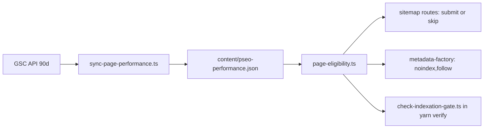

# PRD 03 — Index Bloat Pruning (790 crawled, not indexed)

**Complexity: 6 → MEDIUM mode** (6-10 files +2, new module +2, external API (GSC) +1, data/config +1)

**Planning Mode: Principal Architect**
**Source:** `data/gsc-crawled-not-indexed.csv` (789 URLs), `data/gsc-coverage-summary.csv`, audit §02

---

## 1. Context

**Problem:** The sitemap declares 1,913 pages; Google indexes 1,130 and rejects 2,840. 790 of those
were crawled and judged not worth keeping. That is a quality verdict on the pSEO matrix template,
and the crawl budget it burns is why genuinely good new pages take weeks to gain traction.

Rejection by family (`data/gsc-crawled-not-indexed.csv`):

| Family | Rejected | Note |
| --- | ---: | --- |
| `/platform-format/*` | 178 | 7 platforms × formats × 7 locales |
| `/format-scale/*` | 97 | overlaps `/formats/` and `/scale/` (PRD 04) |
| `/alternatives/*` | 65 | |
| `/device-use/*` | 54 | |
| `/use-cases/*` | 41 | |
| `/guides/*` | 37 | |
| `/blog/*` | 33 | **real assets** — handled in PRD 06, not pruned here |
| `/scale/*`, `/free/*`, `/formats/*` | 67 | |
| `/tools/convert`, `/tools/resize` | 37 | |

By locale: en 144, es 116, de 116, fr 107, ja 105, it 102, pt 100 — the matrix is multiplied by 7
before anything has proven it earns a slot once.

**Files Analyzed:**

- `app/sitemap.xml/route.ts` — 89 sitemap routes, 10 localized categories × 6 locales
- `lib/seo/sitemap-generator.ts`, `lib/seo/locale-sitemap-handler.ts`
- `lib/seo/metadata-factory.ts` — `NOINDEX_CATEGORIES` (currently empty, designed exactly for this)
- `lib/seo/pseo-types.ts` — `noindex?: boolean` already exists per page (line 22)
- `app/seo/data/*.json` — 358 unique slugs
- `scripts/count-sitemap-urls.ts`, `scripts/validate-sitemap-urls.ts`, `scripts/pseo-audit.ts`
- `.claude/skills/gsc-analysis/scripts/gsc-fetch.cjs` — GSC API access already wired
- `client/components/layout/Footer.tsx` — global `/about` and `/terms` links on every page
- `docs/PRDs/seo-equity-flywheel-internal-link-promotion.md` — prior internal-link work

**Current Behavior:**

- Every page in a data file is sitemap-eligible unconditionally. There is no performance feedback
  loop: a page that has produced zero impressions in 90 days is submitted exactly as hard as the
  roundup post that produces 18% of clicks.
- `noindex` support exists (`pseo-types.ts:22`, `metadata-factory.ts:68`) and is unused.
- Nothing blocks adding another 200 matrix pages tomorrow.
- The footer links `/about` and `/terms` from every page (`Footer.tsx:192`, `:213`), which is why
  they carry more internal links (1,000 / 607) than most tool pages.

---

## 2. Solution

**Approach:**

1. **Import the verdict.** `scripts/seo/sync-page-performance.ts` pulls 90 days of GSC
   impressions/clicks per URL (reusing `.claude/skills/gsc-analysis/scripts/gsc-fetch.cjs`
   credentials) and writes `content/pseo-performance.json` — a committed snapshot, not a live call
   (Workers CPU budget, and builds must be deterministic).
2. **Make sitemap eligibility earned.** `lib/seo/page-eligibility.ts` decides
   `shouldSubmit(category, slug, locale)`: a page is submitted if it has impressions in the last
   90 days, OR is younger than 90 days (grace period), OR is explicitly pinned. Everything else is
   dropped from the sitemap and gets `noindex, follow`.
3. **Fold, don't just hide.** Pruned pages keep serving (200 + noindex + follow) and gain a
   prominent link to their parent hub, so accumulated equity flows up instead of evaporating.
4. **Freeze publication behind a gate.** `scripts/seo/check-indexation-gate.ts` fails when
   sitemap indexation < 85% and new pSEO rows were added in the same diff. No new locale × format ×
   scale pages until the existing ones are indexed.
5. **Rebalance internal links** away from `/about` and `/terms` toward `/tools/*` and the roundup.



**Key Decisions:**

- **noindex + follow, not 410.** These URLs have internal links and some backlinks; keeping them
  crawlable-but-unindexed preserves link flow to the hubs while removing the index-bloat signal.
- **90-day grace for new pages** so the gate cannot strangle legitimate new content.
- **`/blog/*` is excluded from pruning** — 33 unindexed posts are real assets (PRD 06).
- **Snapshot, not live API**, so a GSC outage cannot change what the sitemap says.
- Pinned list for strategically important zero-impression pages (new commercial pages), capped and
  reviewed — every pin is logged, never silent.

**Data Changes:** New committed data file `content/pseo-performance.json` (~150 KB, refreshed
monthly by a script the user runs).

---

## Integration Ledger

| # | New thing | Live caller (`file:line`, non-test) | Replaces | Old path removed? | Negative control |
| --- | --- | --- | --- | --- | --- |
| 1 | `scripts/seo/sync-page-performance.ts` | `package.json` script `seo:sync:performance` (run monthly) | manual GSC spreadsheet review | n/a | point at an empty date range → script exits non-zero instead of writing an empty snapshot |
| 2 | `lib/seo/page-eligibility.ts` → `shouldSubmit()` | `lib/seo/sitemap-generator.ts:TBD`, `lib/seo/locale-sitemap-handler.ts:TBD` | unconditional emission | replaced in Phase 2 | make it return `true` always → sitemap URL-count test goes red |
| 3 | `shouldNoindex` wired to eligibility | `lib/seo/metadata-factory.ts:68` (existing `shouldNoindex` line) | `NOINDEX_CATEGORIES` only | extended in Phase 3 | remove the eligibility term → the pruned-page robots test goes red |
| 4 | `scripts/seo/check-indexation-gate.ts` | `package.json` `verify` chain | nothing | n/a | add a fake pSEO row with indexation < 85% → `yarn verify` fails |
| 5 | Parent-hub link block on pruned pages | pSEO templates in `app/(pseo)/_components/pseo/templates/*` | orphan pruned pages | n/a | remove the block → the internal-link test goes red |

### Reachability

**How is this reached?** Sitemap route handlers (build + request time), `generateMetadata` on every
pSEO route, and `yarn verify` in CI. All pre-existing entry points.

**User-facing?** The parent-hub link block is (Phase 3). The rest is crawler-facing.

**Full flow:** monthly `yarn seo:sync:performance` → snapshot committed → next build:
`sitemap-platform-format-de.xml` emits 40 URLs instead of 178, and the 138 dropped pages render
200 + `noindex, follow` + a link to `/platform-format`.

**What does this replace?** Unconditional sitemap emission in two generators.

---

## 3. Execution Phases

### Phase 0: Measure the real indexation rate (no fixes)

**Files (2):**

- `scripts/seo/sync-page-performance.ts` — NEW
- `package.json` — EDIT: `"seo:sync:performance"`, `"seo:indexation:report"`

**Implementation:**

- [ ] Pull 90 days of `page`-dimension rows from GSC for `sc-domain:myimageupscaler.com`
- [ ] Join against every URL emitted by `/sitemap.xml` (reuse `scripts/count-sitemap-urls.ts`)
- [ ] Report per category × locale: submitted, impressions>0, clicks>0, indexation rate
- [ ] Write `content/pseo-performance.json` + `seo-reports/indexation-<date>.md`

**Verification Plan:**

```bash
yarn seo:sync:performance
yarn seo:indexation:report | tee /tmp/indexation-before.txt
# Expected baseline (audit): ~1,913 submitted, ~1,130 indexed → ~59%
# Cross-check the total against data/gsc-coverage-summary.csv before trusting the join
```

**Negative control:** run the report with the snapshot file deleted → it must fail loudly, not
silently report 100%.

---

### Phase 1: Decide the prune list — human-reviewed, not silent

**Files (3):**

- `lib/seo/page-eligibility.ts` — NEW: `shouldSubmit()`, `PINNED_SLUGS`, `GRACE_PERIOD_DAYS = 90`
- `seo-reports/prune-candidates-<date>.md` — generated, reviewed by a human before Phase 2
- `tests/unit/seo/page-eligibility.unit.spec.ts` — NEW

**Implementation:**

- [ ] Candidate = 0 impressions in 90 days AND page older than 90 days AND not pinned AND not `/blog/*`
- [ ] Group candidates by family and locale; print the count that will remain per family
- [ ] **Stop and get sign-off** on the list before wiring it in — the expected cut is ~600–700 URLs
- [ ] Log the dropped count per sitemap at build time (no silent truncation)

**Tests Required:**

| Test File | Test Name | Assertion | Negative control |
| --- | --- | --- | --- |
| `tests/unit/seo/page-eligibility.unit.spec.ts` | `should keep a page with impressions in the last 90 days` | `shouldSubmit` true for a URL present in the snapshot | remove it from the snapshot → red |
| `tests/unit/seo/page-eligibility.unit.spec.ts` | `should keep pages younger than the grace period` | new slug with no data → true | set grace to 0 → red |
| `tests/unit/seo/page-eligibility.unit.spec.ts` | `should never prune blog posts` | `/blog/*` always true | remove the exclusion → red |

---

### Phase 2: Sitemaps submit only eligible pages

**Files (4):**

- `lib/seo/sitemap-generator.ts` — EDIT: filter through `shouldSubmit`
- `lib/seo/locale-sitemap-handler.ts` — EDIT: same
- `scripts/validate-sitemap-structure.ts` — EDIT: assert submitted count matches eligibility
- `tests/unit/seo/sitemap-eligibility.unit.spec.ts` — NEW

**Wiring:**

- [ ] Callers edited: both pre-existing sitemap modules
- [ ] Old path: unconditional emission removed (not left behind a flag)
- [ ] Ledger rows filled: #2

**Tests Required:**

| Test File | Test Name | Assertion | Negative control |
| --- | --- | --- | --- |
| `tests/unit/seo/sitemap-eligibility.unit.spec.ts` | `should exclude zero-impression matrix pages` | none of a sampled 20 from `data/gsc-crawled-not-indexed.csv` appear in any sitemap | disable the filter → red |
| `tests/unit/seo/sitemap-eligibility.unit.spec.ts` | `should keep every page that produced clicks` | all click-producing URLs from the snapshot still submitted | invert the filter → red |
| `tests/unit/seo/sitemap-eligibility.unit.spec.ts` | `should log the dropped count per sitemap` | build log contains `skipped=N` per category | remove the log → red |

**Verification Plan:**

```bash
yarn build && yarn start &
yarn tsx scripts/count-sitemap-urls.ts --base-url=http://localhost:3000 | tee /tmp/sitemap-after.txt
# Expected: total submitted drops from ~1,913 to ~1,200-1,300; blog count unchanged
```

---

### Phase 3: Pruned pages noindex and point at their hub

**Files (4):**

- `lib/seo/metadata-factory.ts` — EDIT line ~68: `shouldNoindex = page.noindex || NOINDEX_CATEGORIES.includes(category) || !shouldSubmit(...)`; `follow: true` retained
- `app/(pseo)/_components/pseo/templates/*` — EDIT one shared template: parent-hub link block for pruned pages
- `tests/unit/seo/pruned-page-signals.unit.spec.ts` — NEW
- `tests/e2e/pseo/pruned-page.spec.ts` — NEW

**Tests Required:**

| Test File | Test Name | Assertion | Negative control |
| --- | --- | --- | --- |
| `tests/unit/seo/pruned-page-signals.unit.spec.ts` | `should noindex but follow a pruned page` | `robots` = `index:false, follow:true` | drop the eligibility term → red |
| `tests/unit/seo/pruned-page-signals.unit.spec.ts` | `should keep indexable pages indexable` | a click-producing page stays `index:true` | invert → red |
| `tests/e2e/pseo/pruned-page.spec.ts` | `should link a pruned page to its category hub` | hub link visible and points at `/{category}` | remove the block → red |

**Revert check:** revert `metadata-factory.ts` → the pruned-page robots assertion fails.

---

### Phase 4: Publication gate + internal-link rebalance

**Files (5):**

- `scripts/seo/check-indexation-gate.ts` — NEW: fail when indexation < 85% and the diff adds pSEO rows
- `package.json` — EDIT: add to the `verify` chain
- `client/components/layout/Footer.tsx` — EDIT: demote `/about` and `/terms` (keep one link each in a legal row; drop duplicates at lines ~192 and ~213)
- `app/(pseo)/_components/pseo/templates/*` — EDIT: link the roundup + top tool pages from pSEO footers
- `tests/unit/seo/internal-link-balance.unit.spec.ts` — NEW

**Implementation:**

- [ ] Gate reads the latest `seo-reports/indexation-*.md`; stale (>35 days) snapshot also fails, with the refresh command in the message
- [ ] Footer: `/terms` currently rendered twice — one link is enough
- [ ] Target: `/tools/ai-image-upscaler` and `/blog/best-free-ai-image-upscaler-2026-tested-compared` outrank `/about` in internal-link count

**Tests Required:**

| Test File | Test Name | Assertion | Negative control |
| --- | --- | --- | --- |
| `tests/unit/seo/internal-link-balance.unit.spec.ts` | `should link money pages more than legal pages` | computed internal-link counts: `/tools/*` total > `/about` + `/terms` | revert the footer → red |
| `tests/unit/seo/internal-link-balance.unit.spec.ts` | `should render each legal link once per page` | exactly one `/terms` link in the footer | restore the duplicate → red |
| `tests/unit/seo/indexation-gate.unit.spec.ts` | `should block new pSEO pages below 85% indexation` | gate exits 1 for a diff adding rows at 59% | set the threshold to 0 → red |

**User Verification (manual):** load any pSEO page, confirm the footer still shows Terms/Privacy
once and the page links to the roundup and a tool page.

---

## 4. Checkpoint Protocol

Automated `prd-work-reviewer` after each phase, plus:

```text
Also audit:
1. Does any sitemap route still emit URLs without calling shouldSubmit?
2. Is the prune list human-reviewed (sign-off recorded in the PRD) rather than applied silently?
3. Are dropped counts logged per sitemap (no silent truncation)?
4. Is content/pseo-performance.json committed and is its freshness checked by the gate?
5. Revert check observed red for this phase?
```

---

## 5. Verification Strategy

### Live gate

```bash
# Pruned pages must be reachable, unindexed, and link to their hub
for u in $(head -20 docs/PRDs/gsc-recovery-2026-08/data/gsc-crawled-not-indexed.csv | tail -19 | cut -d, -f1); do
  printf '%s ' "$u"
  curl -s "$u" | grep -o '<meta name="robots"[^>]*>' | head -1
done
# Expected: every line 200 + noindex,follow — and none of these URLs in /sitemap.xml

yarn seo:verify:gsc --set=cni --base-url=https://myimageupscaler.com
# Expected: 0 URLs that are both sitemap-submitted and noindexed
```

### Integration proof

```bash
grep -rn "shouldSubmit" lib app --include=*.ts | grep -v tests/     # ≥3 non-test consumers
grep -rn "pages.map" lib/seo/sitemap-generator.ts                    # no unfiltered emission path
git stash && yarn test:unit tests/unit/seo && git stash pop          # new suites red before
```

### Post-deploy GSC protocol

1. **2026-09-10 (28 days):** "Crawled – currently not indexed" < 400 (from 790); indexed page count
   holds at ≥ 1,100 — pruning must not remove indexed pages
2. **2026-10-08 (56 days):** sitemap indexation rate ≥ 85%
3. Non-brand clicks must not fall: baseline ~3,050 / 28 days. A drop means something earning traffic
   was pruned — roll back the eligibility filter for that family first, investigate second
4. Refresh the snapshot monthly (`yarn seo:sync:performance`) and re-review the prune list

---

## 6. Acceptance Criteria

- [ ] Google's "Crawled – currently not indexed" bucket falls below 400 by 2026-09-10
- [ ] Sitemap indexation rate ≥ 85% by 2026-10-08 (from 59%)
- [ ] A pruned page still opens for a visitor and offers a route to its category hub
- [ ] Non-brand clicks over 28 days do not fall below the ~3,050 baseline at any checkpoint
- [ ] Attempting to add new matrix pages below 85% indexation fails `yarn verify` with the reason
- [ ] `/tools/*` collectively carry more internal links than `/about` + `/terms`

Binary done checks:

- [ ] All phases complete · tests pass · `yarn verify` passes
- [ ] Prune list signed off before Phase 2 shipped
- [ ] Integration Ledger has zero `TBD` cells
- [ ] Every gate observed red first
- [ ] SEO backlog updated
