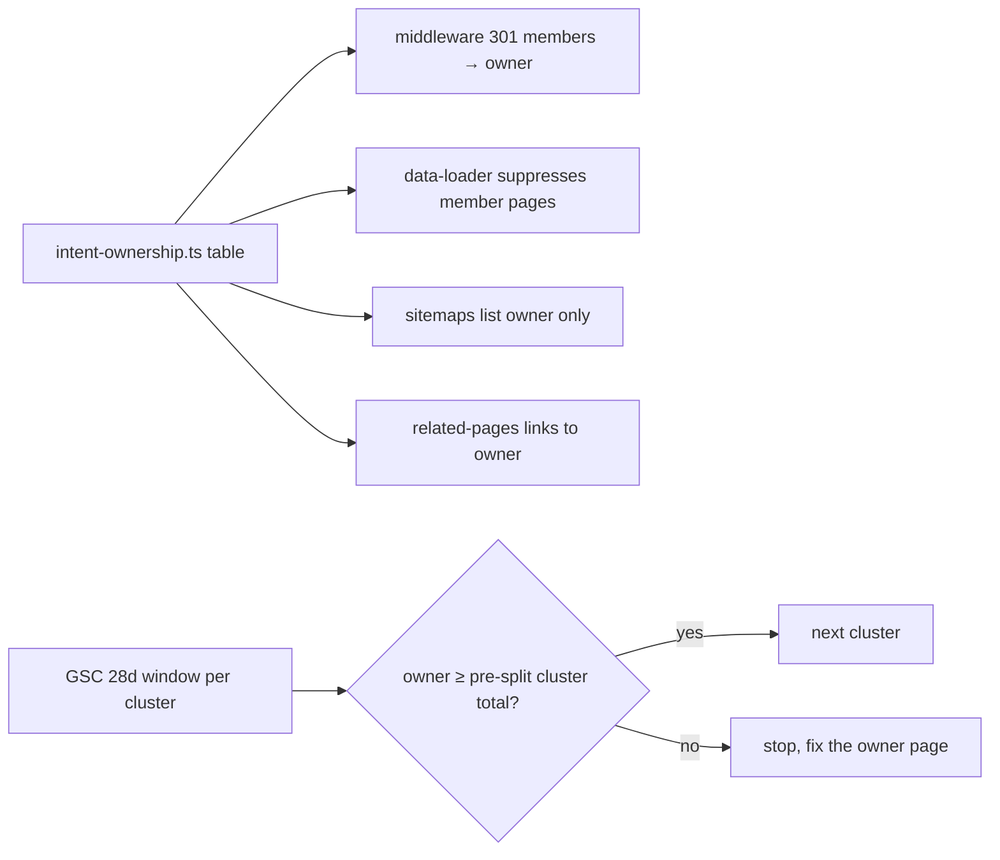

# PRD 04 — Taxonomy Cannibalization (`/formats/` ÷ `/format-scale/` ÷ `/scale/`)

**Complexity: 6 → MEDIUM mode** (6-10 files +2, new module +2, data/config +1, external API (GSC) +1)

**Planning Mode: Principal Architect**
**Source:** audit §03 and §07, `data/gsc-duplicate-canonical.csv`
**Depends on:** the GIF-intent consolidation already shipped (`lib/seo/gif-intent.ts`, `middleware.ts:637`, [PRD](../gif-intent-recovery-live-signal-verification.md))

---

## 1. Context

**Problem:** Three URL families target the same intent. When a new one ranks, it displaces our own
established URL instead of a competitor's, and the cluster loses clicks overall.

The audit's GIF evidence (28 days to 10 Aug vs prior 28):

| Page | Clicks 28d | Prior | Δ | Position |
| --- | ---: | ---: | ---: | --- |
| `/format-scale/gif-upscale-16x` | 212 | 5 | +207 | 6.9 → 7.4 |
| `/formats/upscale-gif-images` | 181 | 513 | −332 | 7.3 → 11.6 |
| `/scale/upscale-16x` | 197 | 329 | −132 | 7.7 → 8.0 |
| **Cluster total** | **590** | **847** | **−257** | |

**Critical caveat this PRD must not get wrong:** the GIF cluster was *already consolidated* on
2026-08-03/04 — `/format-scale/gif-upscale-*` now 301s to `/formats/upscale-gif-images`
(`middleware.ts:637-642`, `data-loader.ts:1020`). The audit window (14 Jul – 10 Aug) is ~90%
pre-consolidation, so those numbers describe the disease, **not the outcome of the cure**. Phase 0
re-measures a clean post-consolidation window before any of it is copied to other clusters.

Two separate collapses in the same audit, unexplained:

| Page | Clicks 28d | Prior | Position |
| --- | ---: | ---: | --- |
| `/tools/photo-quality-enhancer` | 0 | 33 | 42.7 → 59.5 |
| `/free` | 2 | 14 | 1.9 → 7.5 |
| `/tools/ai-image-upscaler` | 423 | 611 | 5.7 → 6.2 |

`/tools/photo-quality-enhancer` also appears in `gsc-404.csv` (3 locales) and in
`gsc-duplicate-canonical.csv` (1) — so PRDs 01 and 02 touch it too. Diagnose after those land,
not before, or the diagnosis will chase already-fixed symptoms.

**Files Analyzed:**

- `lib/seo/gif-intent.ts` — the existing one-owner-per-intent mechanism (owner slug + member set)
- `middleware.ts:637-642` — the 301 that enforces it; `data-loader.ts:382,387,395,1020` — data-side suppression
- `lib/seo/locale-sitemap-handler.ts:107` — owner excluded from locale sitemaps
- `app/seo/data/{formats,format-scale,scale}.json` — the three overlapping families
- `app/(pseo)/{formats,format-scale,scale}/[slug]/page.tsx` and their `[locale]` twins
- `lib/seo/related-pages.ts` — internal linking between the families
- `tests/unit/seo/{gif-intent-consolidation,cannibalization,cannibalization-redirects}.unit.spec.ts`
- `app/seo/data/interactive-tools.json:1839` — `photo-quality-enhancer` (interactive, not in `tools.json`)

**Current Behavior:**

- `gif-intent.ts` hardcodes one cluster: 4 member slugs → 1 owner. It is not a general mechanism.
- Every other format × scale combination is still published three ways: `/formats/upscale-{fmt}-images`,
  `/format-scale/{fmt}-upscale-{n}x`, `/scale/upscale-{n}x`.
- `/format-scale/*` and `/scale/*` are also 155 of the 238 duplicate-canonical URLs (PRD 02) —
  the same overlap, seen from the locale angle.

---

## 2. Solution

**Approach:**

1. **Generalize `gif-intent.ts` into `lib/seo/intent-ownership.ts`** — a table of
   `{ intent, ownerPath, memberPaths[] }`. GIF becomes the first row of a data structure instead of
   a special case, and the existing middleware/data-loader/sitemap wiring reads the table.
2. **Prove the mechanism on GIF first** (Phase 0) with a clean post-2026-08-04 GSC window. If the
   cluster has not recovered toward its 847-click pre-cannibalization level, do **not** replicate it —
   fix the owner page instead.
3. **Roll out cluster by cluster, measured**, highest-volume first, one per deploy, each with a
   14-day read before the next.
4. **Diagnose the two collapses with evidence**, not guesses: GSC URL Inspection + live HTML +
   git log for each page, after PRDs 01 and 02 are deployed.



**Key Decisions:**

- **Owner = the URL with the deepest history and best position**, not the newest. For GIF that is
  `/formats/upscale-gif-images` (513 clicks before the split), already chosen.
- **One cluster per deploy.** A 5-cluster big-bang cannot be attributed, and rollback would be blind.
- **301, not canonical**, for members: the audit shows Google ignoring our canonicals in 239 cases.
- **Stop-loss rule:** if a consolidated cluster's total clicks fall for two consecutive 14-day reads,
  revert that cluster's redirects and record why.

**Data Changes:** None. `intent-ownership.ts` is committed source; member pages stay in the data
files (they are the redirect sources).

---

## Integration Ledger

| # | New thing | Live caller (`file:line`, non-test) | Replaces | Old path removed? | Negative control |
| --- | --- | --- | --- | --- | --- |
| 1 | `lib/seo/intent-ownership.ts` (`INTENT_CLUSTERS`, `getOwnerPath`, `isClusterMember`) | `middleware.ts:637` (replaces the GIF-specific branch), `lib/seo/data-loader.ts:382/387/395/1020`, `lib/seo/locale-sitemap-handler.ts:107`, `lib/seo/hreflang-generator.ts:65` | `lib/seo/gif-intent.ts` | `gif-intent.ts` deleted in Phase 1, its exports re-exported only if an outside consumer needs them | empty the cluster table → `/format-scale/gif-upscale-16x` stops 301ing and `gif-intent-consolidation.unit.spec.ts` (pre-existing) goes red |
| 2 | Cluster row for the next intent (Phase 2+) | same call sites | three competing URLs | member pages become 301 sources | remove the row → the member's 301 test goes red |
| 3 | `scripts/seo/measure-cluster.ts` | `package.json` `seo:measure:cluster` | manual GSC reading | n/a | run against a cluster with no rows → exits 1 rather than reporting 0 |

### Reachability

**How is this reached?** `middleware.ts` runs on every request; the data-loader and sitemap modules
run at build/request time. All pre-existing.

**User-facing?** YES — someone landing on `/format-scale/tiff-upscale-4x` from Google will land on
the owner page instead.

**Full flow:** request `/format-scale/{member}` → middleware consults `INTENT_CLUSTERS` → 301 →
owner page 200 → GSC records the redirect and consolidates the query to the owner URL.

**What does this replace?** `lib/seo/gif-intent.ts` in full — one hardcoded cluster becomes a table.

---

## 3. Execution Phases

### Phase 0: Did the GIF consolidation actually work? (measurement only)

**Files (2):**

- `scripts/seo/measure-cluster.ts` — NEW: GSC clicks/impressions/position for a set of URLs over a window
- `seo-reports/cluster-gif-<date>.md` — generated

**Implementation:**

- [ ] Window A: 2026-08-05 → 2026-09-01 (fully post-consolidation, 3-day GSC lag respected)
- [ ] Window B: 2026-06-16 → 2026-07-13 (pre-split baseline: cluster ≈ 847 clicks)
- [ ] Report cluster totals AND owner-only totals for both windows
- [ ] Verify the redirect is live before trusting anything: `curl -sI .../format-scale/gif-upscale-16x`

**Verification Plan:**

```bash
curl -sI https://myimageupscaler.com/format-scale/gif-upscale-16x | head -2   # expect 301 → /formats/upscale-gif-images
curl -sI https://myimageupscaler.com/formats/upscale-gif-images   | head -1   # expect 200
yarn seo:measure:cluster --cluster=gif --window=2026-08-05:2026-09-01 --baseline=2026-06-16:2026-07-13
```

**Decision gate (write the answer into this PRD before Phase 2):**

| Result | Action |
| --- | --- |
| Owner ≥ 700 clicks/28d | mechanism works → roll out to the next cluster |
| Owner 400–700 | partial → fix the owner page (title/H1/intro per `seo-content-3-kings-technique`), re-measure in 14 days |
| Owner < 400 | mechanism failed → **do not replicate**; open an investigation instead |

**Negative control:** run `measure-cluster` against `/blog/best-free-ai-image-upscaler-2026-tested-compared`,
whose 28-day number is known (1,499 clicks). If the script does not reproduce it, the script is wrong.

---

### Phase 1: Generalize the mechanism (no behavior change)

**Files (5):**

- `lib/seo/intent-ownership.ts` — NEW: `INTENT_CLUSTERS` table seeded with exactly the current GIF cluster
- `middleware.ts` — EDIT line ~637: use `isClusterMember`/`getOwnerPath`
- `lib/seo/data-loader.ts` — EDIT lines 382/387/395/1020: table-driven suppression
- `lib/seo/locale-sitemap-handler.ts` — EDIT line ~107 + `lib/seo/hreflang-generator.ts` line ~65
- `lib/seo/gif-intent.ts` — DELETE

**Wiring:**

- [ ] Callers edited: four pre-existing modules
- [ ] Old path: `gif-intent.ts` deleted — `grep -rn "gif-intent"` returns nothing outside history
- [ ] Ledger rows filled: #1

**Tests Required:**

| Test File | Test Name | Assertion | Negative control |
| --- | --- | --- | --- |
| `tests/unit/seo/gif-intent-consolidation.unit.spec.ts` (pre-existing) | unchanged suite still green | behavior identical after the refactor | empty `INTENT_CLUSTERS` → red |
| `tests/unit/seo/intent-ownership.unit.spec.ts` | `should 301 every cluster member to its owner` | for each member path, middleware returns 301 + owner `Location` | remove a member → red |
| `tests/unit/seo/intent-ownership.unit.spec.ts` | `should never make an owner a member of another cluster` | no path is both owner and member (no redirect chains) | add a cycle → red |

**Revert check:** delete `intent-ownership.ts` → four modules fail to compile and the pre-existing
GIF suite fails. This phase is a pure refactor: the pre-existing suite is the proof.

---

### Phase 2: Consolidate the next cluster (one deploy, then wait)

**Files (3):**

- `lib/seo/intent-ownership.ts` — EDIT: add one cluster row
- `lib/seo/related-pages.ts` — EDIT: internal links point at owners, never members
- `tests/unit/seo/intent-ownership.unit.spec.ts` — EDIT

**Implementation:**

- [ ] Pick the cluster by GSC volume from Phase 0's data — the `/scale/upscale-16x` ÷
      `/format-scale/*-upscale-16x` ÷ `/formats/*` overlap is the leading candidate
- [ ] Owner = deepest history + best position; document the evidence in the cluster row comment
- [ ] Record the pre-consolidation 28-day cluster total in the same comment — that is the number the
      stop-loss rule is measured against
- [ ] Ship. Wait 14 days. Measure. Only then consider the next cluster

**Tests Required:**

| Test File | Test Name | Assertion | Negative control |
| --- | --- | --- | --- |
| `tests/unit/seo/intent-ownership.unit.spec.ts` | `should redirect the new cluster's members` | each member 301s to the owner | remove the row → red |
| `tests/unit/seo/cannibalization.unit.spec.ts` (pre-existing) | `should not target one keyword from two indexable URLs` | extended to the new cluster's primary keyword | keep both indexable → red |
| `tests/unit/seo/internal-links.unit.spec.ts` | `should link to cluster owners, not members` | no internal link points at a member path | restore a member link → red |

**Verification Plan:**

```bash
curl -sI https://myimageupscaler.com/<member-path> | head -2      # 301 → owner
yarn seo:measure:cluster --cluster=<name> --window=<14d after deploy>
# Stop-loss: two consecutive falling reads → revert this cluster row and record why
```

---

### Phase 3: Diagnose the two collapses (evidence, not guesses)

**Files (3):**

- `seo-reports/collapse-photo-quality-enhancer-<date>.md` — NEW
- `seo-reports/collapse-free-hub-<date>.md` — NEW
- Fix files — unknown until diagnosed; expected candidates: `app/seo/data/interactive-tools.json`,
  `app/(pseo)/free/page.tsx`, `lib/seo/metadata-factory.ts`

**Implementation (run only after PRDs 01 and 02 are deployed):**

- [ ] For each URL, collect: live status + robots + canonical, GSC URL Inspection verdict,
      28-day query mix before/after, and `git log -S"<slug>"` for the drop window (mid-Jul → Aug)
- [ ] `/tools/photo-quality-enhancer`: it is an interactive tool (`interactive-tools.json:1839`) with
      no `tools.json` entry, it 404s in 3 locales, and it appears in the duplicate-canonical export —
      confirm which of those is the cause before changing anything
- [ ] `/free`: position 1.9 → 7.5 on a hub page with a thin, link-list body
      (`app/(pseo)/free/page.tsx`, 38 lines) — check whether the query it used to win moved to
      `/free/free-ai-upscaler` or the homepage
- [ ] Write the finding, then a one-paragraph fix plan per page; implement only what the evidence supports

**Tests Required:** determined by the diagnosis; every fix ships with a test asserting the specific
regression cannot recur (e.g. "the free hub renders a unique H1 and ≥N words of non-link copy").

**User Verification:** search the page's primary query in an incognito window and record the position.

---

## 4. Checkpoint Protocol

Automated `prd-work-reviewer` after each phase, plus:

```text
Also audit:
1. Is gif-intent.ts deleted, with no parallel cluster implementation left behind?
2. Does exactly ONE module own cluster membership (grep for hardcoded slug lists)?
3. Phase 2: was the pre-consolidation cluster total recorded before the redirect shipped?
4. Phase 3: is every claimed cause backed by a pasted artifact (curl output, GSC screenshot, git log)?
5. Revert check observed red for this phase?
```

---

## 5. Verification Strategy

### Integration proof

```bash
grep -rn "intent-ownership" lib app middleware.ts --include=*.ts | grep -v tests/   # ≥4 consumers
grep -rn "gif-intent" lib app middleware.ts                                          # no output
grep -rn "GIF_FORMAT_SCALE_SLUGS\|isGifFormatScaleSlug" lib app                       # no output
git stash && yarn test:unit tests/unit/seo/gif-intent-consolidation.unit.spec.ts && git stash pop
```

### Post-deploy GSC protocol

Per cluster, not per PRD:

1. Day 0: deploy, `yarn tsx scripts/submit-indexnow.ts`, request indexing for the owner URL
2. Day 14: `yarn seo:measure:cluster` — owner clicks must exceed the sum the members produced
3. Day 28: cluster total ≥ pre-consolidation baseline; if not, stop-loss and revert that row
4. Watch `/tools/ai-image-upscaler` (423 clicks, −188) — it must not fall further; it is the largest
   commercial page in the account after the homepage

---

## 6. Acceptance Criteria

- [ ] A searcher for "gif upscaler 16x" reaches one page of ours, and that page's 28-day clicks
      exceed what the three URLs produced together pre-split (847 baseline)
- [ ] No two indexable URLs target the same primary keyword in any consolidated cluster (test-enforced)
- [ ] Adding a new page whose primary keyword is already owned fails the cannibalization test
- [ ] `/tools/photo-quality-enhancer` and `/free` each have a written, evidence-backed cause and either
      a shipped fix or a recorded decision not to fix
- [ ] Every consolidated cluster has a dated 14-day and 28-day measurement recorded in `seo-reports/`

Binary done checks:

- [ ] All phases complete · tests pass · `yarn verify` passes
- [ ] Phase 0 decision gate answered in writing before Phase 2 shipped
- [ ] Integration Ledger has zero `TBD` cells; `gif-intent.ts` deleted
- [ ] Every gate observed red first
- [ ] SEO backlog updated per cluster
