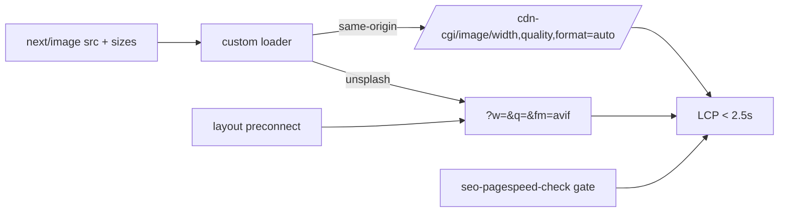

# PRD 05 — LCP & Page Experience (95 poor / 0 good URL groups)

**Complexity: 5 → MEDIUM mode** (6-10 files +2, new module +2, config +1)

**Planning Mode: Principal Architect**
**Source:** `data/gsc-lcp-mobile-trend.csv`, GSC CWV export 2026-08-10, audit §05

---

## 1. Context

**Problem:** 95 URL groups are "poor" and 0 are "good" on **both** mobile and desktop. The failing
metric is LCP > 4s (INP > 200 ms also flagged). It is getting worse, not better:

| Date | Affected URL groups (mobile LCP > 4s) |
| --- | ---: |
| 2026-05-11 | 45 |
| 2026-06-28 | ~75 (desktop tips from "needs improvement" to "poor") |
| 2026-07-31 | 86 |
| 2026-08-01 | 96 |
| 2026-08-08 | 100 |

GSC's example group: `/blog/fixing-pixelated-photos`, group LCP **5.2s**, group population 100.
That page also carries 90,070 impressions and 13 clicks (audit §04) — the worst
impressions-to-clicks ratio on the site, on the slowest template.

For an upload-a-file tool, 4s LCP is not only a ranking input; it is the largest single source of
abandonment before anyone touches the product.

**Files Analyzed:**

- `next.config.js:32-56` — `images: { unoptimized: true, formats: ['image/avif','image/webp'] }`
- `open-next.config.ts` — `defineCloudflareConfig({})`, no image handling
- `client/components/blog/BlogFeaturedImage.tsx` — `fill`, `sizes="(max-width:1024px) 100vw, 540px"`, `priority`
- `client/components/blog/BlogPostHeroSection.tsx`, `client/components/blog/BlogPostCard.tsx`
- `content/blog-data.json` — 18 posts, all hero images `images.unsplash.com/...?w=1200&h=630&fit=crop&q=80`
- `app/[locale]/layout.tsx` — `next/font/google` (Inter, DM_Sans, self-hosted by next/font), logo preloads
- `client/components/landing/heroAssets.ts` — `hero-image-regular.webp` (193 KB), `hero-image-blurred.webp` (31 KB)
- `tests/unit/seo/{homepage-performance,blog-core-web-vitals}.unit.spec.ts` — prior LCP work
- `scripts/seo-pagespeed-check.ts` — existing PSI harness

**Current Behavior:**

- `images.unoptimized: true` disables the Next image pipeline entirely. Consequence chain:
  1. `sizes` is inert — a phone downloads the same bytes as a 27" monitor.
  2. `formats: ['image/avif','image/webp']` is dead config; it optimizes nothing.
  3. Every blog hero is a 1200×630 Unsplash JPEG (~150–300 KB) fetched from a **third-party origin**
     with no `preconnect`, so the LCP element pays DNS + TLS + TCP before the first byte.
- The blog hero is the LCP element and it is `priority`, so it competes with nothing — the cost is
  purely bytes and connection setup.
- The homepage LCP was already worked on (logo preloads, server-rendered hero); blog and pSEO
  templates were not.
- 17 MB of unreferenced originals sit in `public/before-after/originals/` — not served, but they
  inflate every deploy; delete them (`girl-after.png` alone is 17 MB).

---

## 2. Solution

**Approach:**

1. **Turn image optimization back on** with a Cloudflare-native loader:
   `client/utils/image-loader.ts` rewrites same-origin images through `/cdn-cgi/image/width={w},quality={q},format=auto/`
   and third-party Unsplash images through Unsplash's own `?w=&q=&fm=` parameters. Set
   `images: { loader: 'custom', loaderFile: './client/utils/image-loader.ts' }` and delete
   `unoptimized: true`.
2. **Preconnect to `images.unsplash.com`** in the root layout so the LCP fetch starts a full RTT earlier.
3. **Serve the hero at the size it renders.** With the loader live, `sizes` becomes real: a 390 px
   phone requests ~390 px wide AVIF instead of a 1200 px JPEG (≈ 220 KB → ≈ 25 KB).
4. **Gate it.** `scripts/seo-pagespeed-check.ts` runs against a fixed URL list and fails the build
   when mobile LCP p75 > 2.5s on any of them.
5. **Measure the real thing** — field CWV in GSC, not only lab PSI. Lab is the fast feedback loop;
   GSC's 28-day field data is the acceptance criterion.



**Key Decisions:**

- **Custom loader, not Next's default optimizer.** On Cloudflare Workers via OpenNext, the built-in
  optimizer either does not run or burns the 10 ms CPU budget. `/cdn-cgi/image/` is CDN-side and free
  of Worker CPU. **Confirm Image Resizing is enabled on the zone in Phase 0** — if it is not, ship the
  Unsplash-parameter half (which needs nothing) and gate the same-origin half behind the zone setting.
- **Blog first.** The GSC example group and the worst impression waste are both blog pages.
- **INP is out of scope** for this PRD except for measurement — LCP is the flagged failure and the
  one that moves both ranking and conversion.
- **Delete `public/before-after/originals/`** (21 MB, unreferenced). Verified: no code references it.

**Data Changes:** None.

---

## Integration Ledger

| # | New thing | Live caller (`file:line`, non-test) | Replaces | Old path removed? | Negative control |
| --- | --- | --- | --- | --- | --- |
| 1 | `client/utils/image-loader.ts` | `next.config.js:TBD` (`images.loaderFile`) — applies to every `next/image` in the app | `images.unoptimized: true` | flag deleted in Phase 1 | make the loader return `src` unchanged → the rendered-`srcset` test goes red |
| 2 | `preconnect` to `images.unsplash.com` | `app/[locale]/layout.tsx:TBD` | nothing | n/a | remove the tag → the layout head test goes red |
| 3 | LCP budget gate in `scripts/seo-pagespeed-check.ts` | `package.json` `seo:pagespeed` (CI-optional) | manual PSI runs | n/a | set the budget to 0.1s → the gate fails, proving it reads real numbers |

### Reachability

**How is this reached?** Every `next/image` render in the app (blog, pSEO templates, landing) plus
the root layout `<head>`. All pre-existing entry points.

**User-facing?** YES — this is the user-visible change: pages paint faster.

**Full flow:** phone requests `/blog/fixing-pixelated-photos` → HTML includes a preconnect and an
`` produced by the custom loader → browser fetches a ~390 px AVIF → LCP element paints.

**What does this replace?** `unoptimized: true` — deleted, not left beside the loader.

---

## 3. Execution Phases

### Phase 0: Baseline and capability check (no fixes)

**Files (2):**

- `scripts/seo-pagespeed-check.ts` — EDIT: accept a URL list file, emit JSON + markdown
- `seo-reports/cwv-baseline-<date>.md` — generated

**Implementation:**

- [ ] Fixed URL list: `/`, `/blog/fixing-pixelated-photos`, `/blog/best-free-ai-image-upscaler-2026-tested-compared`, `/tools/ai-image-upscaler`, `/tools/photo-quality-enhancer`, `/formats/upscale-gif-images`
- [ ] Record mobile + desktop LCP, INP, CLS, and the identified LCP element per URL
- [ ] Confirm Cloudflare Image Resizing on the zone:
      `curl -sI 'https://myimageupscaler.com/cdn-cgi/image/width=200,format=auto/before-after/hero/hero-image-regular.webp'`
      → 200 with `content-type: image/avif|webp` means available; 404/notfound means the same-origin
      half of Phase 1 is blocked and must ship behind the zone setting

**Verification Plan:**

```bash
yarn tsx scripts/seo-pagespeed-check.ts --urls=seo-reports/cwv-urls.txt | tee /tmp/cwv-before.txt
# Expected: mobile LCP > 4s on the blog URLs — matches GSC's 5.2s example group
```

**Negative control:** run the gate with `--budget-lcp=99` → exits 0. Run with `--budget-lcp=0.1` →
exits 1. Proves the gate reads measured values.

---

### Phase 1: Real image optimization (the root cause)

**Files (5):**

- `client/utils/image-loader.ts` — NEW: Cloudflare + Unsplash aware loader
- `next.config.js` — EDIT lines 32-56: delete `unoptimized: true`, add `loader: 'custom'` + `loaderFile`
- `app/[locale]/layout.tsx` — EDIT: `<link rel="preconnect" href="https://images.unsplash.com" crossOrigin="">`
- `tests/unit/seo/image-optimization.unit.spec.ts` — NEW
- `tests/e2e/performance/blog-lcp.spec.ts` — NEW

**Implementation:**

- [ ] Loader signature `({ src, width, quality })`; Unsplash → set `w`, `q` (default 75), `fm=avif`,
      strip the hardcoded `w=1200&h=630`; same-origin → `/cdn-cgi/image/width=,quality=,format=auto/…`;
      other hosts (dicebear, supabase) → passthrough
- [ ] Keep the `remotePatterns` allow-list intact
- [ ] Verify `BlogFeaturedImage`'s existing `sizes` value is right once it is actually honored
      (`(max-width:1024px) 100vw, 540px` — correct for the current layout)

**Wiring:**

- [ ] Caller edited: `next.config.js` (pre-existing) — the loader applies globally, no per-component change
- [ ] Old path: `unoptimized: true` deleted
- [ ] Ledger rows filled: #1, #2

**Tests Required:**

| Test File | Test Name | Assertion | Negative control |
| --- | --- | --- | --- |
| `tests/unit/seo/image-optimization.unit.spec.ts` | `should request a width-matched Unsplash image` | loader with width 640 returns a URL containing `w=640` and no `w=1200` | passthrough loader → red |
| `tests/unit/seo/image-optimization.unit.spec.ts` | `should route same-origin images through /cdn-cgi/image` | `/before-after/hero/x.webp` → `/cdn-cgi/image/width=…` | remove the branch → red |
| `tests/unit/seo/image-optimization.unit.spec.ts` | `should not set images.unoptimized` | `next.config.js` has no `unoptimized: true` | restore the flag → red |
| `tests/e2e/performance/blog-lcp.spec.ts` | `should serve a mobile-sized hero on a 390px viewport` | the fetched hero response is < 60 KB at 390 px width | revert the loader → red |

**Revert check:** restore `unoptimized: true` → the e2e byte-size assertion and the config assertion
both fail.

**User Verification (manual — visual change):**

- Action: DevTools → Network → throttle to Slow 4G, open `/blog/fixing-pixelated-photos` on a 390 px viewport
- Expected: hero transfer < 60 KB (baseline ~220 KB), LCP < 2.5s, image visually unchanged

---

### Phase 2: Budget gate + dead-weight cleanup

**Files (4):**

- `scripts/seo-pagespeed-check.ts` — EDIT: `--budget-lcp=2.5` fails the run
- `package.json` — EDIT: `"seo:pagespeed": "tsx scripts/seo-pagespeed-check.ts --budget-lcp=2.5"`
- `public/before-after/originals/` — DELETE (21 MB, unreferenced — `grep -rn "before-after/originals" client app` returns nothing)
- `tests/unit/seo/blog-core-web-vitals.unit.spec.ts` — EDIT (pre-existing): assert preconnect + loader config

**Tests Required:**

| Test File | Test Name | Assertion | Negative control |
| --- | --- | --- | --- |
| `tests/unit/seo/blog-core-web-vitals.unit.spec.ts` | `should preconnect to the image host used by blog heroes` | layout contains the preconnect | remove it → red |
| `tests/unit/seo/asset-weight.unit.spec.ts` | `should ship no public asset over 1MB` | no file in `public/` exceeds 1 MB | re-add `girl-after.png` → red |

**Verification Plan:**

```bash
yarn seo:pagespeed --urls=seo-reports/cwv-urls.txt | tee /tmp/cwv-after.txt
diff /tmp/cwv-before.txt /tmp/cwv-after.txt
# Expected: every URL mobile LCP < 2.5s; gate exits 0
du -sh public/    # expect ~21MB smaller
```

---

## 4. Checkpoint Protocol

Automated `prd-work-reviewer` after each phase; **manual checkpoint required** (visual + performance
change), plus:

```text
Also audit:
1. Is images.unoptimized deleted, not merely overridden?
2. Does the loader actually run in the built output (inspect a rendered srcset in .next output or a live page)?
3. Was the LCP measured on a real page load, not asserted from config?
4. Did the phase edit a pre-existing file?
5. Revert check observed red?
```

---

## 5. Verification Strategy

### Live proof (must be pasted into the PRD, not summarized)

```bash
# The rendered HTML must contain a width-matched srcset — config alone proves nothing
curl -s https://myimageupscaler.com/blog/fixing-pixelated-photos | grep -o 'srcset="[^"]*"' | head -2

# Actual bytes for the LCP element at a phone width
curl -s -o /dev/null -w '%{size_download}\n' "https://images.unsplash.com/photo-1588681664899-f142ff2dc9b1?w=390&q=75&fm=avif"

# Field-adjacent lab check
yarn seo:pagespeed --urls=seo-reports/cwv-urls.txt
```

### Integration proof

```bash
grep -n "unoptimized" next.config.js            # no output
grep -n "loaderFile" next.config.js             # points at client/utils/image-loader.ts
grep -rn "image-loader" next.config.js client   # loader referenced from config, used app-wide
git stash && yarn test:unit tests/unit/seo/image-optimization.unit.spec.ts && git stash pop
```

### Post-deploy GSC protocol

Field CWV updates on a 28-day rolling window — patience is part of the plan:

1. **Day 0:** deploy; lab LCP < 2.5s on all six URLs
2. **2026-08-27 (14 days):** GSC → Core Web Vitals → mobile: "poor" group count falling from 95
3. **2026-09-10 (28 days):** "poor" ≤ 30, "good" > 0 (first groups crossing)
4. **2026-10-08 (56 days):** "poor" = 0 — the acceptance criterion
5. Track conversion alongside: blog → tool click-through should rise; if it does not, say so plainly

---

## 6. Acceptance Criteria

- [ ] A visitor on Slow 4G sees the blog hero paint in under 2.5s (measured, not configured)
- [ ] GSC Core Web Vitals reports 0 poor mobile URL groups by 2026-10-08 (from 95)
- [ ] The rendered HTML of a blog page contains a width-matched `srcset` on a 390 px viewport
- [ ] A regression that restores `unoptimized: true` or removes the preconnect fails CI
- [ ] `public/` ships no asset over 1 MB

Binary done checks:

- [ ] All phases complete · tests pass · `yarn verify` passes
- [ ] Automated + manual checkpoints passed
- [ ] Integration Ledger has zero `TBD` cells
- [ ] Every gate observed red first (Phase 0 baseline pasted)
- [ ] SEO backlog updated
